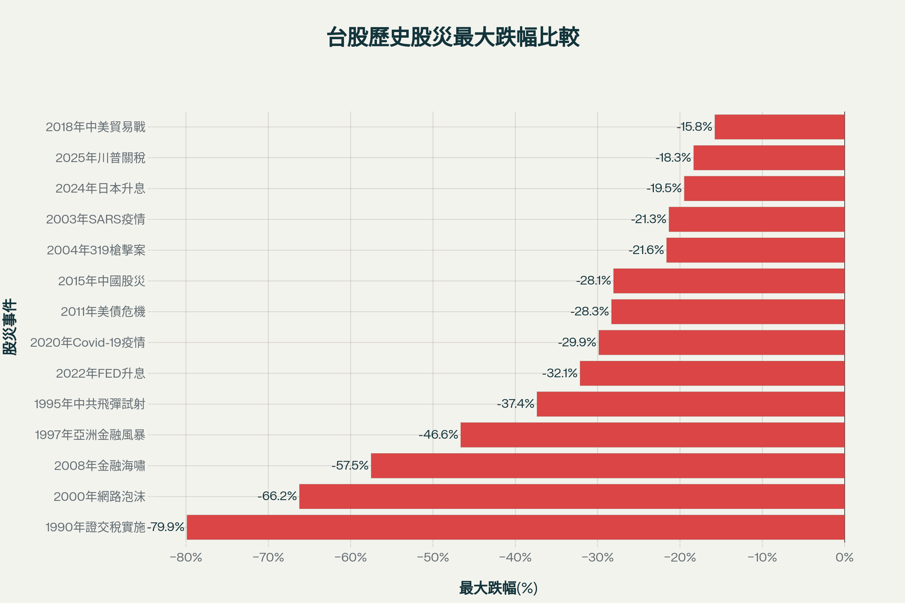
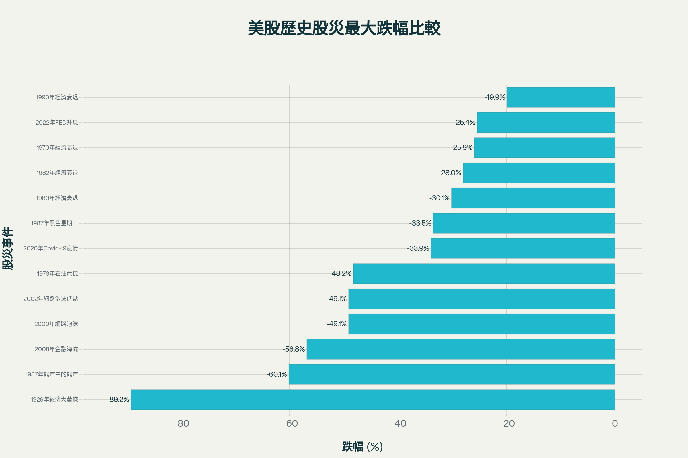

# 臺股與美股歷史股災完整統計報告

本報告全面整理臺灣加權指數與美國股市（道瓊指數及標普500指數）自1929年以來的重大股災事件，包含每次股災的發生時間、最高點與最低點日期、指數數值及最大回檔百分比。

## 臺股歷史股災統計

臺灣股市自1990年證交稅實施以來，經歷了14次重大股災事件。以下為完整的臺股股災記錄:

### 1. 1990年證交稅實施

- **發生時間**: 1990年2月12日
- **最低點日期**: 1990年10月1日
- **指數變化**: 12,682點 → 2,551點
- **最大跌幅**: -79.88%
- **持續時間**: 8個月（231天）
- **原因**: 臺灣經濟過熱後的修正，政府開始實施證交稅千分之六，投資人意識到股市已經過高

### 2. 1995年中共飛彈試射

- **發生時間**: 1995年1月5日
- **最低點日期**: 1995年8月15日
- **指數變化**: 7,144點 → 4,474點
- **最大跌幅**: -37.37%
- **持續時間**: 7個月（222天）
- **原因**: 臺海關係緊張，中共在臺海進行飛彈試射，戰爭危機造成投資人恐慌，外資紛紛撤離

### 3. 1997年亞洲金融風暴

- **發生時間**: 1997年8月27日
- **最低點日期**: 1999年2月5日
- **指數變化**: 10,256點 → 5,474點
- **最大跌幅**: -46.63%
- **持續時間**: 18個月（527天）
- **原因**: 泰國央行改變匯率政策導致泰銖大幅貶值，東南亞各國經濟崩潰，間接影響臺灣貿易狀況

### 4. 2000年網路泡沫

- **發生時間**: 2000年2月5日
- **最低點日期**: 2001年9月20日
- **指數變化**: 10,202點 → 3,446點
- **最大跌幅**: -66.22%
- **持續時間**: 19個月（593天）
- **原因**: 網路公司估值過高，泡沫化破裂引起崩盤，持續近2年

### 5. 2003年SARS疫情

- **發生時間**: 2003年1月24日
- **最低點日期**: 2003年4月28日
- **指數變化**: 5,141點 → 4,044點
- **最大跌幅**: -21.34%
- **持續時間**: 3個月（94天）
- **原因**: 高死亡率的SARS爆發讓人陷入恐慌，短短10天跌了600點

### 6. 2004年319槍擊案

- **發生時間**: 2004年3月19日
- **最低點日期**: 2004年8月5日
- **指數變化**: 6,833點 → 5,355點
- **最大跌幅**: -21.63%
- **持續時間**: 5個月（139天）
- **原因**: 總統陳水扁遭槍擊，全臺政治經濟陷入恐慌

### 7. 2008年金融海嘯

- **發生時間**: 2008年5月20日
- **最低點日期**: 2008年11月21日
- **指數變化**: 9,309點 → 3,955點
- **最大跌幅**: -57.51%
- **持續時間**: 6個月（185天）
- **原因**: 美國次級房貸崩潰，連帶影響臺股。雷曼兄弟破產引發全球金融危機

### 8. 2011年美債危機

- **發生時間**: 2011年2月8日
- **最低點日期**: 2011年12月19日
- **指數變化**: 9,220點 → 6,609點
- **最大跌幅**: -28.32%
- **持續時間**: 10個月（314天）
- **原因**: 歐美債務問題影響全球股市，臺股加權指數創近10年來最低點

### 9. 2015年中國股災

- **發生時間**: 2015年4月28日
- **最低點日期**: 2015年8月24日
- **指數變化**: 10,014點 → 7,203點
- **最大跌幅**: -28.07%
- **持續時間**: 4個月（118天）
- **原因**: 中國股市崩盤加上油價大跌，8月24日當天台股跌幅達7.49%

### 10. 2018年中美貿易戰

- **發生時間**: 2018年10月2日
- **最低點日期**: 2019年1月4日
- **指數變化**: 11,064點 → 9,319點
- **最大跌幅**: -15.77%
- **持續時間**: 3個月（94天）
- **原因**: 美國針對中國傾銷課高額關稅，市場恐慌，臺灣科技業受美中雙方合作緊密影響

### 11. 2020年Covid-19疫情

- **發生時間**: 2020年1月20日
- **最低點日期**: 2020年3月19日
- **指數變化**: 12,151點 → 8,523點
- **最大跌幅**: -29.86%
- **持續時間**: 2個月（59天）
- **原因**: 新冠疫情開始在中國以外地區蔓延，沙烏地阿拉伯和俄羅斯石油生產分歧導致油價暴跌

### 12. 2022年FED升息

- **發生時間**: 2022年1月5日
- **最低點日期**: 2022年10月26日
- **指數變化**: 18,619點 → 12,635點
- **最大跌幅**: -32.14%
- **持續時間**: 9個月（294天）
- **原因**: 新冠疫情FED大量QE加上俄烏戰爭等因素導致通膨，FED需要升息抵制通膨

### 13. 2024年日本升息

- **發生時間**: 2024年7月11日
- **最低點日期**: 2024年8月6日
- **指數變化**: 24,417點 → 19,663點
- **最大跌幅**: -19.48%
- **持續時間**: 1個月（26天）
- **原因**: 日本央行宣佈升息，導致套息交易資金紛紛撤離，臺指期跌停10%，加權指數跌8.35%

### 14. 2025年川普關稅

- **發生時間**: 2025年4月2日
- **最低點日期**: 2025年4月9日
- **指數變化**: 21,298點 → 17,392點
- **最大跌幅**: -18.34%
- **持續時間**: 0個月（7天）
- **原因**: 川普對等關稅政策，臺灣被課徵32%關稅，4月7日單日暴跌超過2,000點，超過1,700檔股票無量跌停

臺股歷史股災最大跌幅比較圖，清楚呈現各次股災的嚴重程度

## 美股歷史股災統計

美國股市作為全球最大的資本市場，自1929年以來經歷了13次重大股災。以下為完整的美股股災記錄:

### 1. 1929年經濟大蕭條

- **發生時間**: 1929年9月3日（10月28-29日黑色星期一、二）
- **最低點日期**: 1932年7月8日
- **指數變化**: 道瓊381.17點 → 41.22點
- **最大跌幅**: -89.2%
- **持續時間**: 34個月（1,039天）
- **漲回高點時間**: 1954年9月（歷時25年）
- **原因**: 投機及槓桿形成經濟泡沫，1920年代經濟繁榮後的崩盤，市場貸款總額超過美國流通貨幣總額

### 2. 1937年熊市中的熊市

- **發生時間**: 1937年3月
- **最低點日期**: 1942年4月28日
- **指數變化**: 標普500 19.67點 → 7.84點
- **最大跌幅**: -60.1%
- **持續時間**: 61個月（1,884天）
- **漲回高點時間**: 1946年4月（歷時9年2個月）
- **原因**: 二次世界大戰開始，歐洲陷入大規模戰爭，日本在亞洲挑起戰火

### 3. 1970年經濟衰退

- **發生時間**: 1970年1月
- **最低點日期**: 1970年5月26日
- **指數變化**: 標普500 93.46點 → 69.29點
- **最大跌幅**: -25.9%
- **持續時間**: 4個月（145天）
- **原因**: 經濟衰退導致股市調整

### 4. 1973年石油危機

- **發生時間**: 1973年1月11日
- **最低點日期**: 1974年10月3日
- **指數變化**: 標普500 120.24點 → 62.28點
- **最大跌幅**: -48.2%
- **持續時間**: 21個月（630天）
- **漲回高點時間**: 1980年7月（歷時7年7個月）
- **原因**: 經濟衰退、通膨、石油危機。原油價格從每桶2.7美元漲到13美元，美聯儲激進升息

### 5. 1980年經濟衰退

- **發生時間**: 1980年1月
- **最低點日期**: 1980年3月27日
- **指數變化**: 標普500 140.52點 → 98.22點
- **最大跌幅**: -30.1%
- **持續時間**: 2個月（86天）
- **原因**: 經濟衰退，美聯儲主席Paul Volcker實施激進貨幣政策對抗通膨

### 6. 1982年經濟衰退

- **發生時間**: 1982年1月
- **最低點日期**: 1982年8月12日
- **指數變化**: 標普500 142.35點 → 102.42點
- **最大跌幅**: -28.0%
- **持續時間**: 7個月（223天）
- **原因**: 經濟衰退，聯邦基金利率高達19%以上

### 7. 1987年黑色星期一

- **發生時間**: 1987年10月19日
- **最低點日期**: 1987年10月19日（當日）
- **指數變化**: 標普500 336.77點 → 223.92點，道瓊單日暴跌22.62%
- **最大跌幅**: -33.5%
- **持續時間**: 單日暴跌
- **漲回高點時間**: 1989年1月（歷時1年4個月）
- **原因**: 經濟不看好、中東局勢緊張，程式交易加速跌勢形成惡性循環

### 8. 1990年經濟衰退

- **發生時間**: 1990年7月16日
- **最低點日期**: 1990年10月11日
- **指數變化**: 標普500 368.95點 → 295.46點
- **最大跌幅**: -19.9%
- **持續時間**: 3個月（87天）
- **原因**: 經濟衰退導致股市回調

### 9. 2000年網路泡沫

- **發生時間**: 2000年9月
- **最低點日期**: 2002年10月9日
- **指數變化**: 標普500 1,527.46點 → 776.76點，納斯達克損失近80%市值
- **最大跌幅**: -49.1%
- **持續時間**: 25個月（768天）
- **漲回高點時間**: 2007年5月（歷時6年9個月）
- **原因**: 互聯網公司過度被炒作而泡沫，2000年4月14日納斯達克單日暴跌9.67%

### 10. 2008年金融海嘯（次貸危機）

- **發生時間**: 2007年10月9日
- **最低點日期**: 2009年3月9日
- **指數變化**: 標普500 1,565.15點 → 676.53點
- **最大跌幅**: -56.8%
- **持續時間**: 17個月（517天）
- **漲回高點時間**: 2013年1月（歷時5年2個月）
- **原因**: 次級房貸泡沫破裂，雷曼兄弟破產，2008年11月20日標普創下752點低點

### 11. 2020年Covid-19疫情

- **發生時間**: 2020年2月19日
- **最低點日期**: 2020年3月23日
- **指數變化**: 標普500 3,386.15點 → 2,237.40點
- **最大跌幅**: -33.9%
- **持續時間**: 1個月（33天）
- **漲回高點時間**: 2020年6月3日（歷時90天）
- **原因**: 新冠疫情帶來恐慌、石油價格暴跌。3月16日道瓊單日暴跌2,997點，創最大單日跌點

### 12. 2022年FED升息

- **發生時間**: 2022年1月3日
- **最低點日期**: 2022年10月13日
- **指數變化**: 標普500 4,796.56點 → 3,577.03點
- **最大跌幅**: -25.4%
- **持續時間**: 9個月（283天）
- **原因**: FED停止QE對抗通膨，2022年6月一口氣升息3碼，創2008年金融海嘯後最糟一年

美股歷史股災最大跌幅比較圖，展示百年來美國股市重大危機的跌幅

## 重要觀察與結論

### 臺股股災特徵

1. **最嚴重股災**: 1990年證交稅實施導致跌幅達79.88%，幾乎回吐整個1980年代的漲幅
2. **最長持續時間**: 1997年亞洲金融風暴持續18個月，2000年網路泡沫持續19個月
3. **最快速暴跌**: 2025年川普關稅僅7天就暴跌18.34%，超過1,700檔股票無量跌停
4. **近期趨勢**: 2024-2025年連續兩年發生股災，反映全球金融市場波動加劇

### 美股股災特徵

1. **最嚴重股災**: 1929年經濟大蕭條跌幅達89.2%，需時25年才漲回高點
2. **最長持續時間**: 1937年熊市持續61個月，直到二戰結束才恢復
3. **最快速恢復**: 2020年Covid-19疫情僅90天就漲回高點，得益於各國大規模救市
4. **平均跌幅**: 美股歷史股災平均跌幅約42.2%，反映市場週期性調整的嚴重性

### 股災發生頻率

臺股平均每2-3年會經歷一次較大回檔，美股則約每7-10年會出現一次重大股災。兩市場都顯示股災雖難以預測，但長期而言市場終將恢復並創新高。

