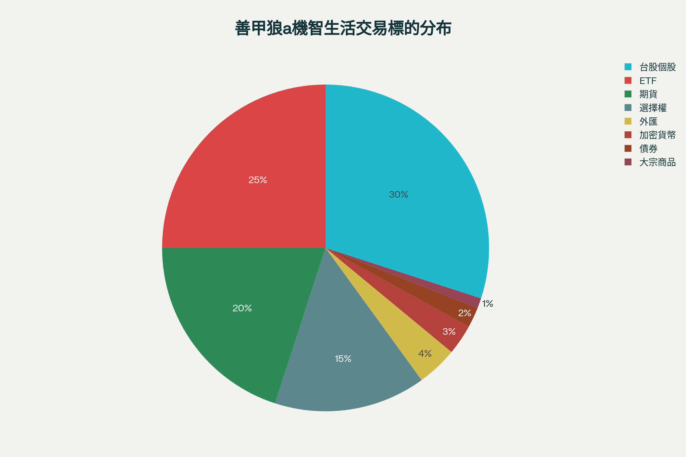
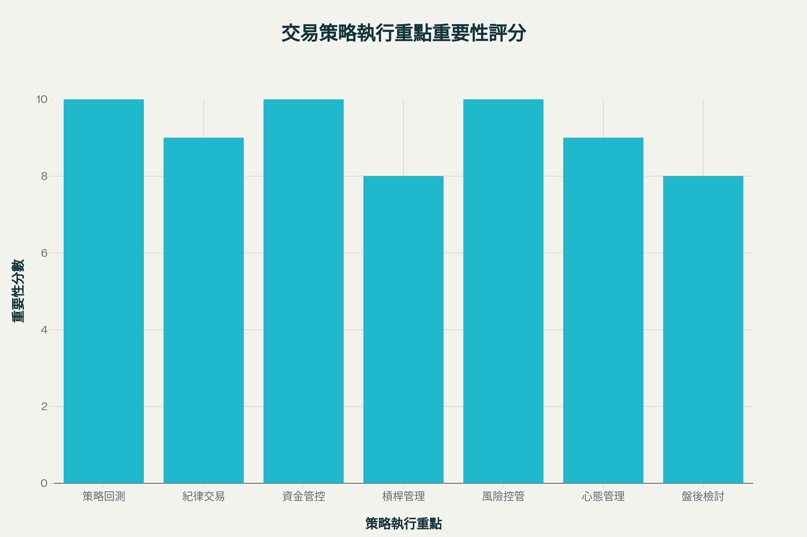

# 善甲狼a機智生活：策略與交易心法深度解析

善甲狼a機智生活在台灣股市、期貨及多元金融商品領域以務實、紀律且不斷反思自省的操作風格著稱。本報告將針對其公開分享的核心交易策略、盤勢操作原則、資金及風險控管心法，以及失敗教訓與心態調適，做一綜合且系統性的整理。

## 核心結論摘要

善甲狼a機智生活之操作哲學主張「先驗證策略、嚴守風控」，並強調紀律、資金分散，以及不斷盤後檢討，是長期穩健獲利的根本。雖擅長多元商品投資及槓桿應用，但多次強調過度自信與高槓桿是致命大敵，往昔爆倉案例更成為其持續修正心態與優化策略的重要養分。

## 善甲狼a機智生活交易策略範圍

善甲狼a機智生活粉專內容涵蓋的商品及工具極為多元，以下為其主要涉略標的：

- **台股個股**（主力）：聚焦籌碼流向、公開資訊、大型與小型風格股票。
- **ETF/基金**：依不同資金規模選擇定期定額或技術面低檔進場。
- **期貨/選擇權**：作為槓桿操作增益或避險工具，例如指數期貨搭配賣權/買權應對多空局面。
- **外匯、加密貨幣、大宗商品、債券、差價合約等國際商品**：延伸操作觸角並衡量槓桿、流動性及價格波動。

善甲狼a機智生活常見交易標的與工具分布（主觀視覺化）

善甲狼a機智生活常見交易標的與工具分布（主觀視覺化）

## 核心交易心法與執行重點

### 1. 策略驗證與模擬單

主張投資新手與策略研發階段，先以模擬單/回測驗證策略穩定度，並建立紀律與錯誤容忍度，減少用真金白銀交學費的風險。模擬單僅在認真記錄出入場狀況與系統檢討後才有價值，單純紙上談兵自嗨則無效。

### 2. 資金分配與槓桿管理

操作分為本金管理（避免單筆All in）與槓桿控管。雖推崇槓桿（特別是在多頭行情累積資本），但多次強調不可過度自信、逾越可承受風險，必要時應果斷減碼或全撤退以保存實力。

### 3. 紀律管理與盤後檢討

紀律貫穿整體操作流程（下單、策略執行、錯誤修正），每回操作後需徹底盤後回顧，列出失誤點與環節修正。自認勝率非關鍵，長期活下來比一時獲利更重要。

### 4. 心態建設與市場反思

善甲狼a機智生活深刻記取爆倉案例教訓：自信過盈、賺錢太久易生錯誤幻覺。需定期檢視自身成敗背後的結構與盲點——「活得夠久，比贏一陣子重要」。

善甲狼a機智生活交易心法與執行重點視覺化

善甲狼a機智生活交易心法與執行重點視覺化

## 重大案例：槓桿爆倉反思

善甲狼a機智生活粉專多次揭露年輕投資人於三年牛市用高槓桿快速翻倍、三天暴跌瞬間爆倉的教訓：

- 實力≠行情順風；連贏不等於懂市場本質
- 開滿槓桿、逆勢補單只會加速毀滅
- 組合策略不因單一機會孤注一擲，而應持續控管部位規模、設定止損

> 「我以為是我自己很厲害，才賺到的錢。但其實，是行情賞了我一點運氣，我卻把它當作實力。市場最毒的，不是它讓你輸，而是它讓你贏太久。」

### 三大實務重點格言

1. **站風口豬都會飛，風停老鷹也要收翅**（順勢為主，不逆勢加碼）
2. **財富靠「避免重複爆掉」累積，非一筆訂勝負**（嚴守風控、永遠不孤注一擲）
3. **以時間和紀律贏未來，不用槓桿證明自己正確**（謙卑面對市場隨時變臉）

## 進場出場與商品選擇原則

- **多商品分散／多策略研發**：基於不同盤勢調整操作商品與槓桿比重，結合基本面、事件型盤勢、期權配對等組合。
- **主張獲利集中火力在高把握機會，但全程嚴控風險，失效則迅速調整。**
- **全面紀錄交易紀律與盤勢邏輯驗證，搭配停損、分批加碼分散鉅額風險。**

## 結論

善甲狼a機智生活主張的投資哲學核心在於：「**先驗證（模擬回測）、嚴風控、持續修正，重紀律、不戀戰。**」
即便擅於商品多元與槓桿放大，也以頻繁自省和失敗案例當警戒，提醒投資人「活著、穩健、不爆倉」才是最終贏家關鍵。

