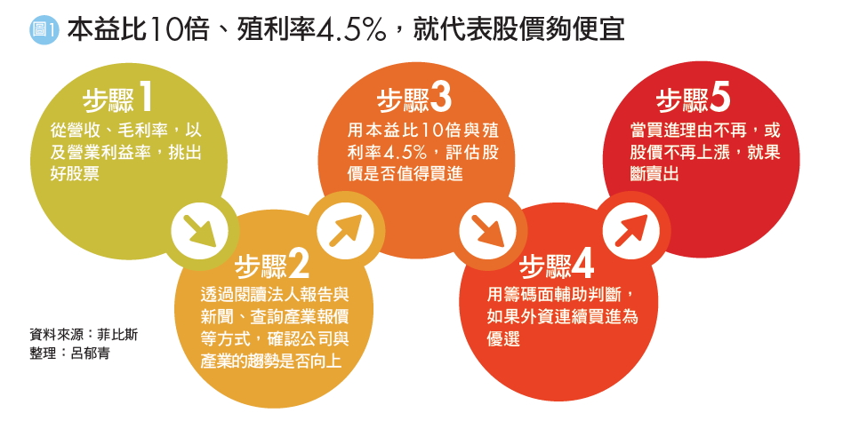
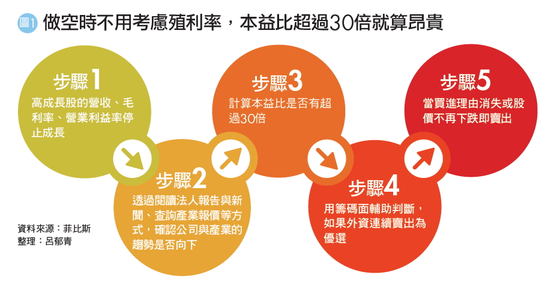
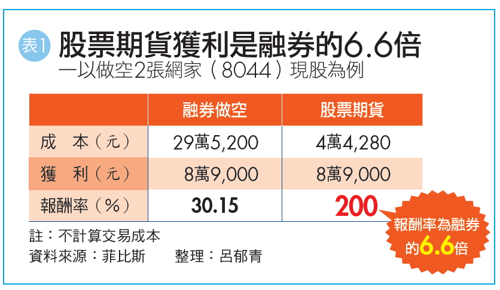

## 多空操作術　7年級生股市提款5千萬

一個大學時期就讀生命科學相關科系、從來沒修過財經課的7年級生，靠著自修理財，打破22K低薪魔咒，5年內在股市提款逾5,000萬元，光是2017年已經賺了3,300萬元。

他的名字叫菲比斯（化名），今年33歲，是PTT股票板上的名人，被網友封為「菲神」，年年在板上公佈對帳單，對帳單上的資產年年成長，讓網友驚呼，更因為進出數據白紙黑字毫無遮掩，所以在PTT股票板上享有高正面人氣。

菲比斯2008年退伍時，遇上金融海嘯。當時失業率攀高、房價居高不下，低薪的22K成為常態，7年級生甚至被笑稱為「三無世代」—無房子、無工作、無婚姻。面對「三無世代」，菲比斯非但沒有默默地接受，反而立志找到更大的出路。他不斷地嘗試再嘗試，終於找到能賴以為生的技能。

菲比斯說：「我是靠著多元策略配置，才讓資產穩穩成長。」近5年來，他三分之二的獲利來自於多空操作術，也就是做多成長股，同時做空衰退股，再用個股期貨等槓桿工具來放大獲利。

**初入職場**
**一退伍就遇到金融海嘯**
**正職難找靠打工勉強度日**
菲比斯原本想從事生技研究的工作，但是，大學入學後發現夢想與現實差異極大，「懷抱夢想念了3年後發現，根本只是『南柯一夢』！」菲比斯說。受到臺灣生技產業環境的影響，大部分的同學畢業後都跑去藥廠當業務，而不是他心目中的專業研究員，因此，他又重拾從小想當個舞臺劇演員、音樂家的夢想，主動延畢一年，準備音樂研究所考試，不過，最後也是無疾而終。

菲比斯退伍時剛好遇上金融海嘯，衝擊全球經濟，他的第一份工作是去速食店賣早餐，「值早班薪水比較高，1小時有140元，每天5點上班，工作到9點，但是後面累到每天早上都快爬不起來了。」菲比斯表示。

# 基本面3指標挑好股　再看籌碼研判上升力道

菲比斯靠著一籃子股票做多，再加上一籃子股票做空的多空操作術，成為年年獲利的主要核心，他認為，這是一般投資人也能自學的獲利模式。散戶不用怨嘆沒有內線，只要勤看財報等基本面數據，也能像他一樣從股市提款。

「很多人花錢上技術分析的課程，但是卻賺不到大錢，原因就在於技術線型只是股價漲跌其中一個判斷依據，並不是全部。」菲比斯說。長期來看，股價一定會反映公司的獲利。雖然會漲的公司不一定有扎實的財報數據，但是，先確認基本面佳，再用技術面、籌碼面輔助判斷，就能避免買到地雷股。

菲比斯是用什麼指標判斷基本面呢？又是用什麼指標判斷股票是否值得納入做多的一籃子投資組閤中呢？以下是菲比斯挑選做多股票的步驟：

**步驟1》觀察營收、毛利率、營業利益率變化**
證交所規定，上市櫃公司每月10日前要公佈前一個月的營收，因此，菲比斯會在每月10日前後，逐一查閱臺股1,600多檔公司的數據，如果是營收由衰退轉為成長，或逐月成長的股票，他就會進一步檢視該公司最新一季財報的毛利率與營業利益率，是否也較去年同期成長。

上市櫃公司每個月10日以前，必須公告前一個月的營收數據。另外，在每年3月31日之前，必須公佈前一個年度的年報，而第1季～第3季季報的公佈期限，分別為每年的5月15 日、8月14日與11月14日。

營收是一家公司最即時的財報數據，可以作為第一步的篩選，但是，如果營收成長是靠殺價競爭或合併而來，就未必能帶動實際獲利的成長。

因此，除了營收成長之外，最好同時看財報中與獲利相關的2大數據－毛利率與營業利益率，如果2個指標都同時成長，就可以優先列入候選名單。

## 做空》無懼大盤驟然轉向、加速財富累積

# 高本益比股獲利停滯　趁評價下修賺波段財

菲比斯透過財報數據選擇做多股的方法，乍看並不難，但是，從財報選股的操作方法，通常給人獲利速度慢的印象，為什麼他的獲利卻這麼快呢？菲比斯說，有2個關鍵的差別，「其他透過財報選股的投資人，通常不會做空，也不會使用槓桿工具。」

菲比斯受到舅舅的影響，除了挑選財報成長的股票做多之外，同時也會挑選財報衰退的股票做空，而且，做多與做空的資金配置會各佔一半，不會特別偏重任何一邊。

**多空資金配置宜各半**
**佈局檔數不要差距太大**
投資人普遍覺得，多頭的時候應該盡量做多、空頭的時候應該盡量做空，順勢而為才會賺更多。菲比斯的父親就是以做多為主，不但聽明牌、重壓單一個股，而且又不懂得避險，導致最後賠光退休金。但是，菲比斯的舅舅同時做空與做多，卻是年年都賺錢。因此，菲比斯體會到，股市瞬息萬變、漲漲跌跌，「同時做多與做空，才可以安心睡好覺。」不僅如此，長期來說，兩邊同時佈局，獲利反而更穩定。

投資新手剛開始進入股市時，可能資金不足，只能買1檔股票，的確無法進行資金配置。不過，菲比斯建議，如果有30萬元至50萬元的本金，就可以開始進行資金配置，選擇股價20元～30元的股票，融資做多，再加上融券做空，已經可以同時操作多檔股票了。另外，如果投資人懂得運用股票期貨這種槓桿工具，更能擴大布局範圍（股票期貨的操作方式，請詳見《Smart智富》月刊的第132頁）。

菲比斯提醒，做多與做多的資金比重，不只市值要接近，兩者的檔數最好也不要差太多。一般來說，做空可以挑選的標的檔數，一定比做多的少。假設同樣佈局市值50萬元的股票，做多股票的檔數可能是5檔，做空的可能只有3檔。雖然做空股票的檔數會比較少，但是，千萬不要集中在1檔，仍然要盡量分散。

# 利用個股期貨3優勢　小資金滾出高報酬

「如果沒有股票期貨，我沒辦法賺這麼多、賺這麼快！」菲比斯說。挑選股票是基本功夫，很多投資人都做得到，但是，這對菲比斯來說僅僅是80分的水準，要從80分進步到100分，需要很大的努力，其中一個很重要的關鍵，就是了解衍生性金融商品。

很多投資人一聽到「期貨」、「槓桿」這些字眼就心生害怕，菲比斯認為：「只要瞭解工具，就知道工具是中性，它不是導致你虧損的原因，會讓你虧損的原因是，選錯股又不懂得停損，或你根本不知道這些工具要怎麼用。」

菲比斯說，如果懂得選股，又對衍生性金融商品有足夠的認識，就能把這些高槓桿的工具，變成加速獲利的助力，而不是阻力。菲比斯透過多與空約略各半的資產配置，來分散市場風險，再透過槓桿工具放大獲利，「這是我提高報酬的核心祕密。」

**每日結算權益數**
**免賣出就能拿到獲利金額**
股票期貨就是以股票為標的所發行的期貨商品，股票漲，股票期貨就會跟著漲；股票跌，股票期貨就會跟著跌。由於股票期貨的跳動單位與股票一樣，因此，股票期貨的操作邏輯很簡單，就是「看漲買、看跌賣」。

菲比斯最愛的衍生性金融商品是股票期貨，因為它有3個優勢，可以快速讓獲利放大，最明顯的例子是菲比斯做空網家（8044）。

**優勢1》槓桿大**
菲比斯在網家現股164元時，做空1口網家的股票期貨（1口股票期貨等於2張現股），他不需要準備16萬4,000元（不考慮交易成本），只需要準備4萬4,280元的保證金，一直等到股價跌到119.5元時出場，價差44.5元，賺到8萬9,000元，報酬率高達200%。

如果菲比斯使用融券做空的話，需要準備9成的資金，做空2張網家現股，就得拿出29萬5,200元，假設一樣賺到價差44.5元，獲利8萬9,000元，換算報酬率只剩下30.15%（詳見表1）。

