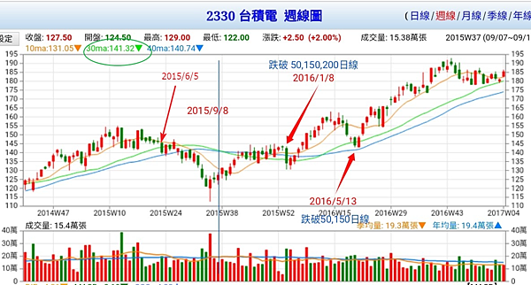
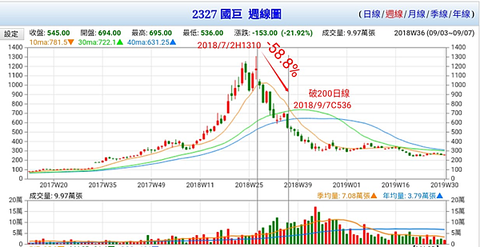
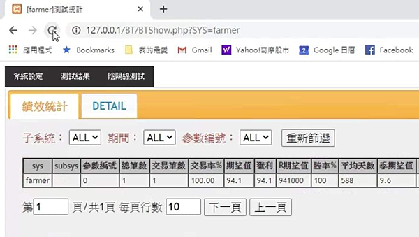

# 如何出場

https://htm0606.pixnet.net/blog/post/405322031-%e5%a6%82%e4%bd%95%e5%87%ba%e5%a0%b4

俗話說得好，會買股票是徒弟，會賣股票才是師傅。飆股人人都買過，但真正賺到大錢的百不得一。

## **多重出場點：單純性與多個出場點**

　　交易系統設計應該採用單純的概念。我們之所以強調單純性，因為這代表相關系統是建構在「瞭解」的基礎上，而不是最佳化。

　　單純的概念可以引用到許多不同市場與不同交易工具。我們雖然強調單純，但交易系統仍然可以設定多個出場點。這是兩個不相互衝突的概念，單純性是交易系統之能夠有效的必要條件，多重出場點則是滿足交易目標的必要條件。出場點雖然有很多個，但每個出場點都可以源自簡單的概念。

　　讓我們看個例子。假定我們想使用順勢系統，而且希望留在市場久一點。我們不相信神奇的進場訊號，所以要留給部位較大的迴旋空間。另外，萬一出現重大不利走勢，系統必須保障資本，部位必須認賠。最後，由於起始停損相當寬鬆，我們將儘可能獲取較大的利潤，當獲利達到4R時，停止點將設定得更緊密一些。因此，我們要根據這些信念，設計一套適用的交易系統。這個例子顯示一項重要觀念:交易系統設計上必須符合個人信念。這也是交易系統設計的秘訣之一。

　　首先，進場點的起始停損必須相當寬鬆，提供充分的迴旋空間，不至於造成訊號反覆而增添交易成本。我們決定採用前文提到的辦法：3倍的價格波動。這是最糟狀況的停損，但也是後續的追蹤型停止點，因為每天收盤價如果朝有利方向變動，我們將依此重新設定停止點。

　　其次，我們相信，如果市場出現強勁的反向走勢，就應該結束部位。所以，我們決定，只要任何一天的價格反向走勢超過每天價格波動的2倍(由前一天收盤價起算)，就結束部位。這個停止點與前一段的停止點是並存的。

　　最後，獲利一旦到達4R，將採用緊密的停止點，避免吐回太多帳面獲利。所以，獲利到達4R之後，停止點將設定為平均真實區間的1．6倍(不是原來的3倍)：從此之後，這也是唯一的停止點。

　　請注意，這些停止設定都很單純，清楚反映我們所想要的目的。沒有經過歷史測試，所以沒有最佳化的問題。完全沒有涉及火箭科學，所以很簡單。總共有3種停止點，但任何時刻都只有一個停止點真正有效，也就是最接近當時市場價格者。

(摘自「交易‧創造自己的聖盃」/ 凡‧沙普)

### **「簡單多重出場策略」摘要**

　　根據上述，它提出的是三個出場點的設計。簡述要點如下：

　　1. 初始停損點：進場點的起始停損必須相當寬鬆，提供充分的迴旋空間。

　　2. 特殊出場點：如果市場出現強勁的反向走勢，就應該結束部位。

　　3. 停利點：獲利一旦到達4R，則採用緊密停止點。

## **我的多重出場點**

　　1. 初始停損點：小於10%。

　　2. 特殊出場點：如果跌破重要支撐。

　　3. 追蹤型停止點：從高點(收盤)回落15%～30%則出場。

　　4. 緊密停利點：獲利一旦到達30%～100%，則採用緊密停止點－－跌破ma5或ma20(不下移)*0.96。

　　5. **彈性原則：浩劫餘生與太空漫步，採取的策略當然有所不同。所以設計有一般波段模式與股災模式。**

### **波段模式**

　　1. 初始停損點為最大虧損 **10%**，越小越好但不能太小。

　　2. 由最高點回落 **20%**。

　　3. 不要求在期限內要漲多少。

　　4. 漲幅達到 **30%** ，改用 max(ma20)*0.96 為浮動停利點。

### **股災模式**

　　1. 初始停損點為最大虧損 **10%**。

　　2. 由最高點回落 **30%**。

　　3. 不要求在期限內要漲多少。

　　4. 漲幅達到 **100%** ，改用 max(ma20)*0.96 為浮動停利點。　　

### **虧損不超過10%**

　　「...限制虧損之後，雖然有些轉敗為勝的成功交易消失了，但這方面的不利影響，遠低於迅速認賠的有利影響。根據這項虛擬測試，整個投資組合的績效改善程度，實在顯著到到令人難以置信。我重複驗證相關的計算程序，數據都是正確的。我的投資組合表現，從原來的兩位數字虧損，變成了獲利超過百分之七十。」(摘自「超級績效－－投資冠軍的操盤思維」/ Mark Minervini)

### **特殊出場點**

　　一般情形下原則上虧損不超過10%，但你可以設定的更緊密一點，然而你永遠無法逃過主力裝死、蹲伏、甩轎、洗盤的磨難，所以必須有所瞭解與對策。

### **交易儘量接近危險點**

　　「...真正優秀的交易者，他知道如何判斷正常的價格拉回整理，以及具有危險的價格行為，他們會把停損設定在正常回檔即將演變為危險走勢的關鍵位置，然後讓交易進場價位儘量接近危險點。...」(摘自「超級績效2」)

### **蹲伏與反轉復甦**

　　「...交易者建立部位之後，皆希望看到股票呈現應有的「行為」，但我們也想避免在不必要的情況下扼殺交易機會。行情沒有立即發動，並不代表相關交易就是失敗。...進場建立部位之後，不妨讓股票保有一、兩個禮拜的時間可以正常波動當然必須維持在停損範圍內。股票如果出線蹲伏情況，不必覺得恐慌，,只要停損沒有被引發，沒有出現主要違例現象，不妨等待看看股票是否會發生反轉復甦走勢。」(摘自「超級績效2」)

### **重新進場**

　　「某些股票可能呈現理想的架構，吸引買盤進場，但走勢很快進行修正或急遽拉回，引發部位的起始停損。這種情況之所以發生，通常是因為大盤走勢轉弱或劇烈波動。一般來說，股票的基本面條件如果優異，價格向下修正或拉回之後，通常會再出現新的買點。這種新的買進架構往往較先前的買進架構更為優異，因為籌碼得到更一進一步的清洗。

　　部位的起始停損遭到引發之後，不能預期該股票絕對會再出現買進架構；換言之，起始停損一旦遭到引發，就必須停損出場。反之，部位遭到停損之後，並不能排除相關股票再度成為買進對象的可能性；只要該股票滿足了所有買進條件，就可以重新進場建立部位，雖然時機可能相對落後。請注意，真正的重大獲利機會，經常是在重新進場兩、三次才得以掌握。可是，這點往往也是區別真正專業玩家的分野。業餘玩家可能被停損一、兩次之後，就不會考慮再進場，但專業玩家則永遠保持客觀立場，他們只考慮進場條件是否滿足，把每個潛在機會都視為全新投資進行評估。」(摘自「超級績效2」)

　　頂尖交易員喬治．席格(George Segal)說：「我相信你想知道，我是如何得知應該何時進場的？在我真正建立部位前可能已出場二、三次(停損出場)；有時我可以一次便成功地建立部位。但通常需要嘗試數次後，我才會覺得對盤。我願意隨情況的需要不斷試盤，這是一種獨特的觀念；多數人在市場中挫敗，因為他們只做一兩次的嘗試，往往在節骨眼上放棄。而我是不斷地回頭嘗試，不斷地敲著大門，直到大口敞開為止。」

## **為什麼不用其他出場法?**

　　以臺積電為例，本文比較型態學出場法、均線出場法、基本面出場法、潛力股出場法。

### **使用形態學出場**

以臺積電為例。[0066_臺積電漲倍圖]

下圖[0067_臺積電型態出場]顯示在2015年，使用型態學出場會被洗出兩次。

但這兩次的振盪在整個上漲中微不足道，可見得型態學並不適合長線操作。

### **使用均線出場**

如果使用長線150日線作為出場條件，下圖顯示至少會被洗出三次。

[0068_臺積電均線出場]

均線眾所週知的缺點就是「太慢」，如下圖，等到出場已經吐回58%以上獲利。

[0069_國巨均線出場太慢]

由從可見，使用均線出場，不是太快就是太慢。

### **使用基本面出場**

以下使用「超級績效－－金融怪傑交易之道」/Mark Minervini舉的例子說明，散戶如果要依據公司的營運狀況變差來出場，那叫作「天方夜談」。

[0070_基本面出場太慢1]

[0071_基本面出場太慢2]

[0072_基本面出場太慢3]

[0073_基本面出場太慢4]

### **使用潛力股投資法股災模式**

下圖顯示使用股災模式出場法有不錯效果。

[0074_股災模式1]

[0075_股災模式2]

 

注意，只有在低檔，你認為有一倍以上的潛力時才使用「股災模式」，如果已經漲到第三波、第四波，就只能使用「波段模式」（預期有30%以上獲利），短線模式不要使用，你應該使用經過驗證過的「短線交易系統」，陰陽線、指標等不是經過驗證的系統，只不過是「見證」，見證與驗證不同，驗證是可複製的科學邏輯，見證大多隻是偶然。

[0076_股災模式3]

## **其他多重出場法**

### **歐尼爾的出場方法**

　　綜觀大多數名家的出場策略，大都包括兩種以上的不同策略。以威廉‧歐尼爾為例，其出場方法其實甚為複雜，如下：

　　1. 初始停損點：8%。2. 停利點：20%。好像很單純，其實不然，因為還有以下幾點；

　　3. 走勢超強的個股，即在8週內上漲20%的股票，則不理會20%獲利了結的規則，至少要繼續持有8週。

　　4. 8個繼續持有的法則

　　5. 36個提早賣出的法則。

### **達華斯的出場方法**

　　這個也許不能謂之為單純了，也許找另一個例子比較好，尼可拉‧達華斯：

　　1. 初始停損點：箱型頂部往下一盤(買進點為往上一盤)，所以其風險報酬率是所有系統中最低的。

　　2. 獲利出場點：當另一個箱型建構完成後，停利點往上移到這個箱形的底部下一檔。

　　真的是再明確不過了，撇開那個停利點似乎有一些問題(不是每個下跌的股票都會先建立箱型)，其實這是一個最佳的範例：多重出場點。