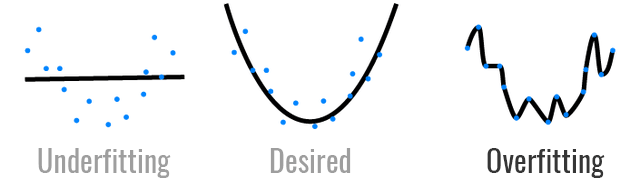
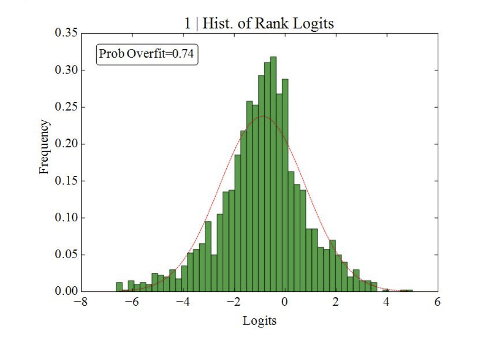

# 策略優化 – 如何避免過擬合？

出處:https://www.finlab.tw/backtesting-overfitting-probability/

當你做回測做久了，就會發現，找到「歷史報酬率」好的策略很簡單，但是找到「未來報酬率」好的策略非常難。原因在於做了過多的參數枚舉與優化，當樣本數夠大，自然會有極端的數據產生，就像是夜路走多了會碰到鬼，人多必有白痴，樹多必有枯枝，就像是量子力學中，波函數坍縮成我們所處的現實，代表著均值，但在極端的多重宇宙樣本中，你也有可能是總統，代表著眾多巧合下的極端事件。

[1 本文就是用口語的方式，帶你瞭解如何判斷過擬合的演算法](https://www.finlab.tw/backtesting-overfitting-probability/#ben_wen_jiu_shi_yong_kou_yu_de_fang_shi_dai_ni_liao_jie_ru_he_pan_duan_guo_ni_he_de_yan_suan_fa)

[2 我們很有可能是優化雜訊，而非優化價格的規律。](https://www.finlab.tw/backtesting-overfitting-probability/#wo_men_hen_you_ke_neng_shi_you_hua_za_xun_er_fei_you_hua_jia_ge_de_gui_lu)

[2.1 要怎麼辨別這兩者的不同呢？](https://www.finlab.tw/backtesting-overfitting-probability/#yao_zen_me_bian_bie_zhe_liang_zhe_de_bu_tong_ne)

[2.2 聽不懂？別走，讓我舉個例子](https://www.finlab.tw/backtesting-overfitting-probability/#ting_bu_dong_bie_zou_rang_wo_ju_ge_li_zi)

[3 回到策略的角度，如何驗證「貨真價實的策略」？](https://www.finlab.tw/backtesting-overfitting-probability/#hui_dao_ce_lue_de_jiao_du_ru_he_yan_zheng_huo_zhen_jia_shi_de_ce_lue)

[4 所以比較好的方法是？](https://www.finlab.tw/backtesting-overfitting-probability/#suo_yi_bi_jiao_hao_de_fang_fa_shi)

[5 1. 確定參數效果真的比較好](https://www.finlab.tw/backtesting-overfitting-probability/#1_que_ding_can_shu_xiao_guo_zhen_de_bi_jiao_hao)

[6 2. 產生多重的 IS 跟 OOS](https://www.finlab.tw/backtesting-overfitting-probability/#2_chan_sheng_duo_zhong_de_IS_gen_OOS)

[7 實驗結果：](https://www.finlab.tw/backtesting-overfitting-probability/#shi_yan_jie_guo)

##### 本文就是用口語的方式，帶你瞭解如何判斷過擬合的演算法

牛頓從蘋果落地的現象，發現了萬有引力，F=ma，因為實驗的雜訊很小（風、熱能散失等等），才能有經典簡潔的公式，然而把牛頓的實驗，換到財經領域時，可能就不是這麼管用了，當我們在建模時，價格的雜訊遠大於規律，

#### 我們很有可能是優化雜訊，而非優化價格的規律。

##### 要怎麼辨別這兩者的不同呢？

我們可以先從直觀的角度出發，究竟歷史上成功的偉人，Bill Gates、Steve Jobs、Elon Musk，這些科技巨擘，他們之所以能夠有今天的成就，是一連串的巧合，還是他們有一些人格特質，促使他們的成功？另一個極端的例子，假如今天某人中了樂透彩而一夕爆富，那很明顯，他很可能是多重宇宙中，非常成功的一個版本，但他的成功，可能並非來自他的人格特質，而是來自運氣。今天就運氣跟命運，來討論策略模型過擬合的問題。

模型的過擬合，就像是簽樂透彩，只要參數夠多了，總會中獎。所以策略績效好，究竟是不是運氣好，最重要的事，就是要確保「實驗是有效的」。如何定義實驗是有效的呢？

樣本內的「最佳參數」在樣本外的「績效」也是顯著的機率是高的

##### 聽不懂？別走，讓我舉個例子

這邊的「樣本內」就是指我們現在的現實世界，已經發生了的事情，例如我們知道 Steve Jobs 是頻果創辦人，將科技與時尚結合，促進科技的進步功不可沒，所以他就是我們在樣本內的「最佳人選」。而「樣本外」就是指那些我們沒見過的多重宇宙，在多重宇宙中，假如都有 Steve Jobs 這個人，而他都有一番豐功偉業，那就代表那是他貨真價實的實力。

### 回到策略的角度，如何驗證「貨真價實的策略」？

最簡單的方式，一般我們會使用 hold-out，將歷史資料分成樣本內（in-sample IS）和樣本外（out-of-sampe OOS）並且在 IS 做最佳化後，再用 OOS 驗證，這樣的方法有幾個缺點：

- 由於 IS 跟 OOS 都是人為定義，所以當重複優化很多次後，還是會對於 OOS 的績效越來越熟悉，最後不免還是用了 OOS 的資訊來設計模型
- 資料量的問題，回測跟驗證都需要一定長度的歷史數據，將歷史數據分成 IS 跟 OOS 顯然有點浪費
- OOS 通常是時間序列的尾端，代表近期的資料，對於策略效能有決定性的影響，然而卻不能拿來開發

### 所以比較好的方法是？

[The probability of backtest overfitting](https://poseidon01.ssrn.com/delivery.php?ID=868103003064115117125100064075098092016007037010053025100075080026029100071001025108063043035060033044107114028094094091106006057048087011059012084117121014084068060040064001077111012024029099081115109104017084001102009126127067113118116067099111100&EXT=pdf)的作者是這樣做的：
Bailey, D.H., Borwein, J., Lopez de Prado, M. and Zhu, Q.J., 2016. The probability of backtest overfitting. Journal of Computational Finance, forthcoming.

### 1. 確定參數效果真的比較好

任何策略都有好與不好的時候，要確定參數效果很好，不是看績效是正的就好，而是要跟其他參數的績效作比較，
例如最近臺股上漲，雞犬昇天，所以任何人投資績效都是正的，但不帶表大家都是投資高手，
所以就算績效是正的，還要看績效的排名才行！

所以論文中的作者，針對所有參數產生出來績效，從「樣本內」找到「最佳參數」，並且將「樣本外的績效」由小到大排名，並且觀察「最佳參數」是否位於前 1/2 的機率

### 2. 產生多重的 IS 跟 OOS

假如只有一組 IS 跟 OOS 實再是太少了，這樣驗證的樣本會不足，
所以作者不使用「歷史數據」來區分 IS 跟 OOS，而是將回測整個跑完後，將績效的時間序列切成 S 份，任選 S/2 份當作 IS，其他當作 OOS，這樣的話可以產生超多種組合

### 實驗結果：

下圖就是作者使用此方法的實驗範例， x 代表「最佳參數」在「樣本外」的效果，越右邊代表效果越好，而 y 軸是樣本的數量
我們會發現，下圖這個例子，整個分佈偏向左邊，也就是 x 軸小於零，代表其實最佳化後，大部分的績效都是比較差的！
每100個樣本，就有74個樣本，最佳化後的效果小於績效的中位數，
所以 74% 的機率，最佳化後的效果比較差

一個比較好的策略，應該會是如下圖，整個
每100個樣本，只有4個樣本，最佳化後的效果小於績效的中位數，
所以只有 4% 的機率，有過擬合的風險，
算是一個很不錯的參數優化過程

結果我上網找了一下，都沒有 python 的程式碼
所以假如大家有興趣，我之後可以提供這篇 paper 的程式碼，
雖然但我不確定大家有沒有興趣就是了XDDD