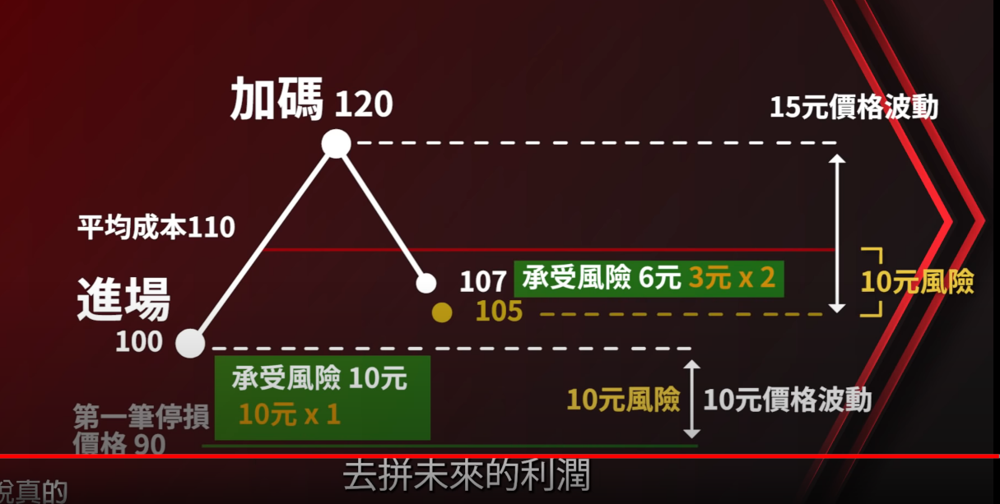
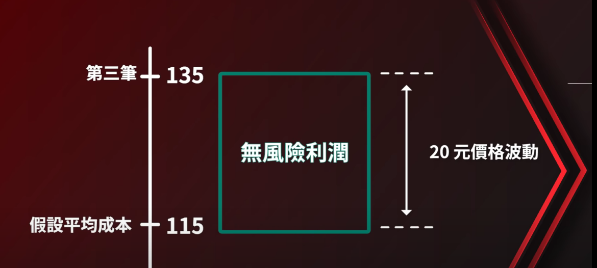
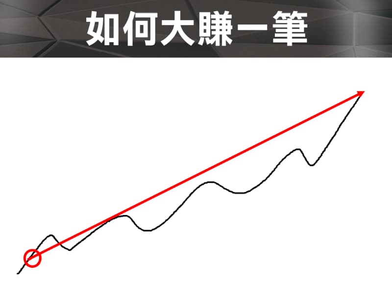
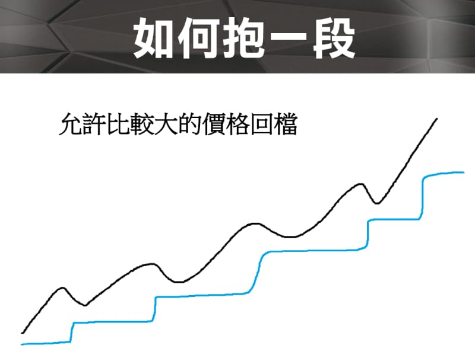
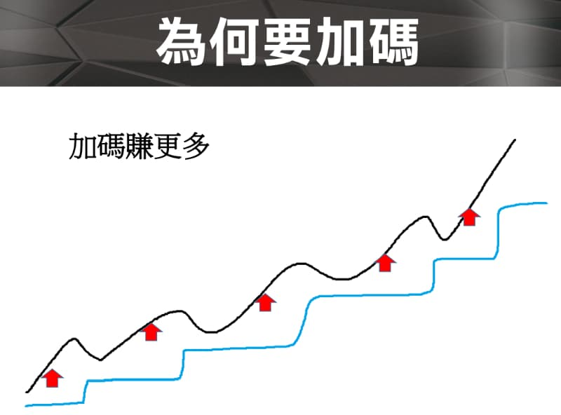
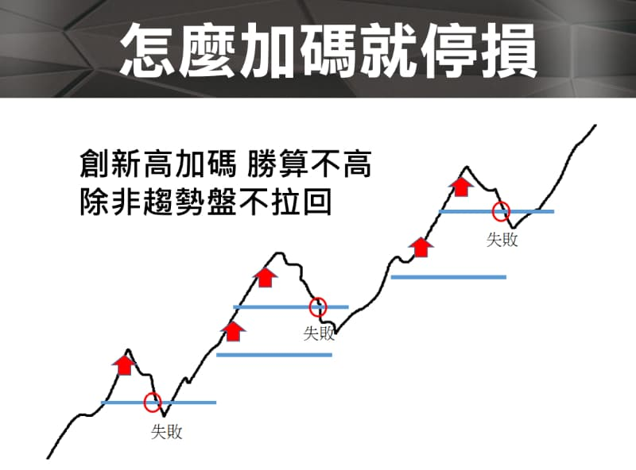
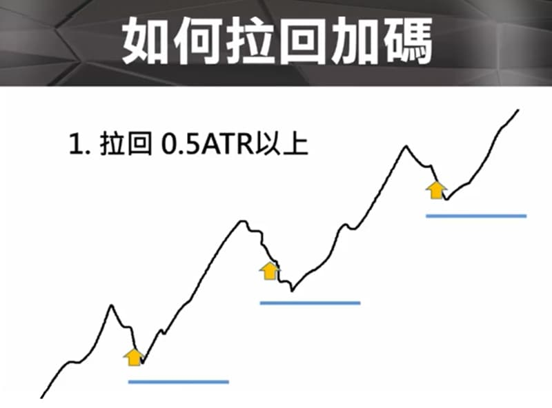
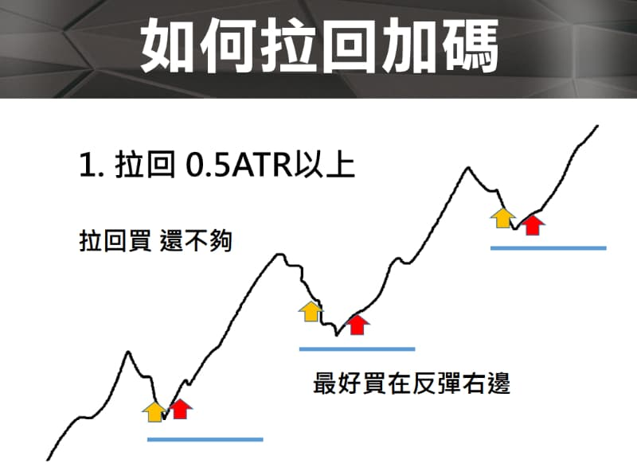
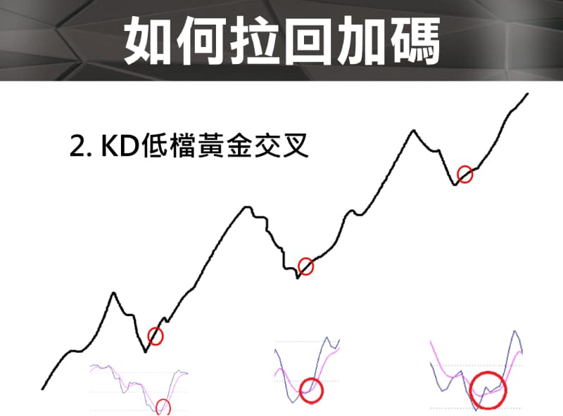

## 分批在操作前期的應用   建倉

- 分批買進，只是建倉，壓低成本，抱得住後面才能暴賺
- 美股要拆太多筆(10筆) ，可以向下分批
- 美股震盪大15~20% 才加碼一次
- 假設分三批進場，在三批全部打進去之前都視為建倉，所以在完成建倉之前，風險都控制在10元，所以在第二筆打進去之後，成本110應該是在105的時候就會止損了，"有賺不能賠"應該是建倉完畢後才開始執行
- 前期建倉完成後是用一個沒有賠到錢心情在拼後面大利潤
- 每後一次進場風險都變小
- 暴賺哲學 選股標的同時持有不同股票

https://youtu.be/dS4VszQ0CbQ?t=428






QA:

```
如果我計劃性向下總共分3批買進，當我決定在100塊進場第一批資金，停損一般都設10%，其實我不太清楚我第二批的進場價位跟停損價位到底是要設在多少比較合理？［假設第三批資金是等股價超過前兩批平均成本再進場。］ 想請教老師下面哪種策略比較好？還是您建議如何改良？ 
A. 93塊入場第二批資金，然後當價位跌到90塊時，第一批資金跟第二批資金一起停損出場，然後再等時機重新入場。 
B. 93塊入場第二批資金，然後當價位跌到90塊時，第一批資金先停損出場，第二批資金當跌到83.7塊時（-10%）才停損出場。然後再等時機重新入場。 C. 第一跟第二批資金平均成本96.5，當股價跌到86.9（-10%），兩批資金一起停損出場。然後再等待時機重新入場。

我選股是以基本面為主，籌碼面為輔，技術分析只看簡單K線而已，因為我不是用技術分析找買點，通常決定進場價位是等股價相對跌一大段進場。
```

```
A.平均成本10%是偏純策略的做法
B.90全出是技術分析關鍵點的做法
C.83.7再出的做法算是有點混合技術+策略的做法
```

---

# 拉回加碼！

獨孤求敗, 加碼, 進場點, 移動停利, 風險控制, 台指期操作, WINSMART, 期貨投資教學

今天要講的主題是【拉回加碼】，買在比較好的進場點。我們從下面的 3 個主題來分享：

1. 如何大賺一筆
2. 為什麼要加碼
3. 怎麼加碼在好的點

### 如何大賺一筆？

我們先來看看如何大賺一票，那麼要大賺一票不是說要下【重注】來去大幹一票，下重注的話如果你看錯也是【大賠一票】。

我們應該應該要怎麼做呢？我們應該要【控制部位】也就是說持有【合理的部位】，然後呢合理的部位如果你做短線那麼你沒有辦法賺到太多的錢。你要怎麼做呢？你應該要【拉長線】才有辦法賺到最多的錢。




```
也就是說，行情出去的時候你要【抱好】你的部位，你可以靠大的價差來賺到財富，大賺一票的思維就是這樣子。
```

### 如何抱一段？

那如何【抱一段】呢？我們都知道行情會上上下下跑來跑去，我們可能行情一拉回就出場了，要怎麼抱一段呢？ 我的答案是：「`允許比較大的價格回檔」你就可以抱一段`」。

我們可以看一下下面的圖，藍色的線就是你【移動停利】的軌跡，沒有跌破藍色的線你就不用出場。如果你的藍色線貼價格貼的非常近，那麼價格拉回 40 點 50 點就出場，那你就不可能抱一段。



你必須要能夠接受比較大的【震蕩】的【回檔】，至少接受震蕩 150 點以上你才比較有機會可以抱一個波段，而且常常在行情大的時候你可能要把震蕩提升到 200 點甚至 300 點、600 點都有可能。

那麼什麼時候會提升到 600 點以上？就是在極端行情發生的時候，例如：2020 崩盤 3 月的時候震蕩的幅度非常非常的大，一天的振幅就有 600 點，那你至少要波段拉大你才有可能抱得住部位，如果你還是在 100 點 200 點的話，你不可能抱得住一段【行情急殺】的大波段行情。

所以，你要看行情幅度大的話，你要忍受比較大的回檔，才能夠抱住這一段大的行情。如果你一拉回一點點就跑掉的話，那你就不可能抱一個波段的。

就是，你要【耐震】。

### `為什麼要加碼？`

其實答案就是「加碼賺更多」啦。



我在講這個主題的時候，曾經有一個同學問我：「如果都已經知道行情會上漲了，為什麼不一開始就買完了，還要中途去打加碼？後面成本是越來越差耶？」。

對，「我們就是不知道行情會走那麼遠，才需要在過程中去放大我們的部位，去打加碼」，而這個放大部位的話，我們可以怎麼樣？我們可以【計算風險】。

我們可以計算你買 4 碼買 5 碼，你買 6 碼，你的風險都是非常非常小的，這是可以透過風險來計算的，透過進場點、出場點來去做計算的，絕對是可以計算的。

例如：你打到最後一碼的時候，你可以決定說「我打到前一碼的進場價，就全部出場」，那如果是這樣子的話你前面的加碼都是賺錢的，你只賠最後一碼，那你還是賺錢的嘛。所以，加碼以後還是可以讓你安全的出場，這個是做得到的，你只需要【精算出場點，精算風險】就可以。

所以，這個賺錢加碼賺更多的邏輯就是，`我們一開始用【最小】的部位去試單，行情出去的時候你要【大賺一票】，你就要敢【加碼】`。

### `違反人性的操作`

其實這個【加碼】你就是跟一般的投資人做反向的，因為一般投資人是行情有賺錢就會想要走，獲利回吐就會想要出，這個就是【人性】。

一般人不是賺夠想走就是獲利回吐馬上想出，怎麼會想到要加碼呢？所以這是一個完全【違反人性】的操作方式，因為加碼代表：別人想出場，你想的是進場，如果行情出去的話，你就有可能賺到最多的錢。

```
因為違反人性，所以大部分的人做不到。
```

### 為什麼一加碼就停損？

有同學問：老師，我也想加碼，但是一加碼就停損。。。

我的答案是這樣：創新高加碼的勝算不高，除非趨勢盤不拉回。



例如上圖，行情上漲過程中，不會走直線上漲的，它會上去下來上去下來刷來刷去的。

如果你在行情出去的時候去【追價】，追價以後設定一個停損點，後面行情掉下來就可能打到你的停損，打到你的停損後，行情又可能又上去。這種情況就是行情在強勢的時候，追高的時候你去做進場那你就可能打到停損後行情又上去了，有時候對有時候錯，所以`追高加碼勝算其實不高應該是低於 5 成，可能是 3 成`。

所以如果你使用追高加碼，是非常有可能常常打到停損的。你想想看你的停損可能設 50 點，進場後行情拉會 100 一定掃到你的停損嘛。

## `如何拉回加碼?`

#### ATR 拉回 0.5 以上

我們去看一天的波動的高低差到底是多大，如果一天的波動是 160 點那麼我建議你，不要去追高。你等行情掉下來 0.5 ATR 的時候你再去做進場，建議是這樣子。



當你不追高，在拉回的時候進場。這樣你就不會買在差的點，這個`前提是要在多方的趨勢盤，當行情正常回檔（次級回檔）的時候`，你來做加碼你可以買在好的位置好的點位。

你要有`耐心的等待行情的拉回`。因為趨勢盤漲個 1 天、2天、3天、5天、7天、8天、10 天，它不會直線漲上去的，如果是當天短線趨勢盤，它可能直線上去，因為當天非常強，如果是長線的趨勢盤，例如台指期 8 天的趨勢盤，就不可能每天都往上衝，一定在中間會有價格回檔的時間點，這個價格回檔的時間點你一定可以【找到更好的位置切入】。

#### 拉回買，還不夠

我們可以有另一種方式進場，如果行情拉回 1 倍 ATR 那我們不是買在半路上嗎？我們可不可以跌完再進場？當然可以！

看行情形態的人可以在行情跌完以後往上打勾（`紅色箭頭`）的地方來去做加碼，也就是說最好買在行情的右邊。



#### KD 低檔黃金交叉

我們可以用許多的技術指標來確認打勾，例如：KD 黃金交叉，KD 在低檔黃金交叉可以買在右邊打勾的位置。如果行情拉回幅度夠大，同時搭配 KD 在低檔黃金交叉的時候，你可以把這個交叉當成參考之一在底下做一個買進的動作。

那麼什麼叫低檔？ 50 以下叫低檔，你也可以說 30、25 以下叫做低檔黃金交叉。



#### 交易範例

我們實際來看一下【拉回加碼】，範例中，WINSMART 幾乎可以幫到你完成整個交易。

 

#### `用 WINSMART 幫你掌握拉回加碼的交易技巧，絕佳進場時機 !`

行情回檔是停利出場還是拉回加碼呢 ? 要如何定義拉回加碼或是反彈空呢 ? 可以用什麼技術指標來定義呢 ? 讓獨大教你掌握拉回買反彈空的技巧，是進場加碼的絕佳時機 ! 讓你避開追高殺低，買在行情噴出前 !
