# 成交量分桶熵因子解析與回測


本文整理自興業證券 2022-08-29 發布的研究報告《高頻研究系列四：成交量分布中的 Alpha》，主題是「成交量分桶熵」因子。這個因子在 2024 至 2026 年版《因子日曆》中多次出現，核心概念是用成交量分布的均勻程度，衡量市場在一段期間內的交易不穩定性。

> 成交量分桶熵（標準差）衡量成交量不穩定性的分散程度。因子值越大，代表個股在近一段時間內的成交量分布越不穩定，價格可能曾經或正在受到知情交易者帶動，整體下行風險也相對較高；若日度成交量分桶熵越大，則日內成交量分布越均勻。

## 因子計算邏輯

先前這個因子最容易卡住的地方，不是熵本身，而是「怎麼分桶」。整理後其流程其實相當直接：

1. 將單日分鐘成交量從最小值到最大值做等距分桶，研究報告預設分成 10 桶。
2. 統計成交量落在各桶中的機率分布。
3. 根據機率分布計算單日熵值。
4. 取近 20 個交易日熵值的標準差，作為最終的低頻因子。

實測上，把桶數改成 5 桶或 20 桶，結果與 10 桶差異不大，因此 10 桶可以視為合理且穩定的預設設定。

## Python 範例

```python
def process_single_day(self, idx):
    # 載入單日分鐘成交量資料
    file_name = self.files[idx]
    full_path = os.path.join(self.file_pth, file_name)
    vol = BaseDataLoader.load_data(
        full_path,
        fields=["volume"],
    ).to_dataframe("volume")

    start = vol.min()
    step = (vol.max() - start) / 10
    bucket_counts = []

    for i in range(1, 11):
        end = start + step
        if i != 10:
            flag = (vol >= start) & (vol < end)
        else:
            flag = (vol >= start) & (vol <= end)
        bucket_counts.append(flag.sum())
        start = end

    prob = pd.concat(bucket_counts, axis=1).T
    prob = prob / vol.count()
    prob = prob[prob > 0]
    entropy = -(prob * np.log(prob)).sum()
    entropy.name = pd.to_datetime(file_name.split(".")[0]) + timedelta(hours=15)
    return entropy
```

這段程式的重點如下：

- 前 6 行負責讀入單日分鐘成交量資料。
- `start` 取成交量最小值，作為第一個桶的起點。
- `step` 代表每個桶的寬度。
- `for` 迴圈逐桶統計成交量筆數。
- 機率分布正規化後，依 `-sum(p * log(p))` 計算熵值。
- 最後將日期轉成因子索引，方便後續合併與回測。


## 因子評估

研究報告以標準差進行降頻。實測比較均值與標準差兩種做法後，標準差版本在 IC 與分層回測上的表現都優於均值版本，因此後續分析以標準差版本為主。

### IC 分析

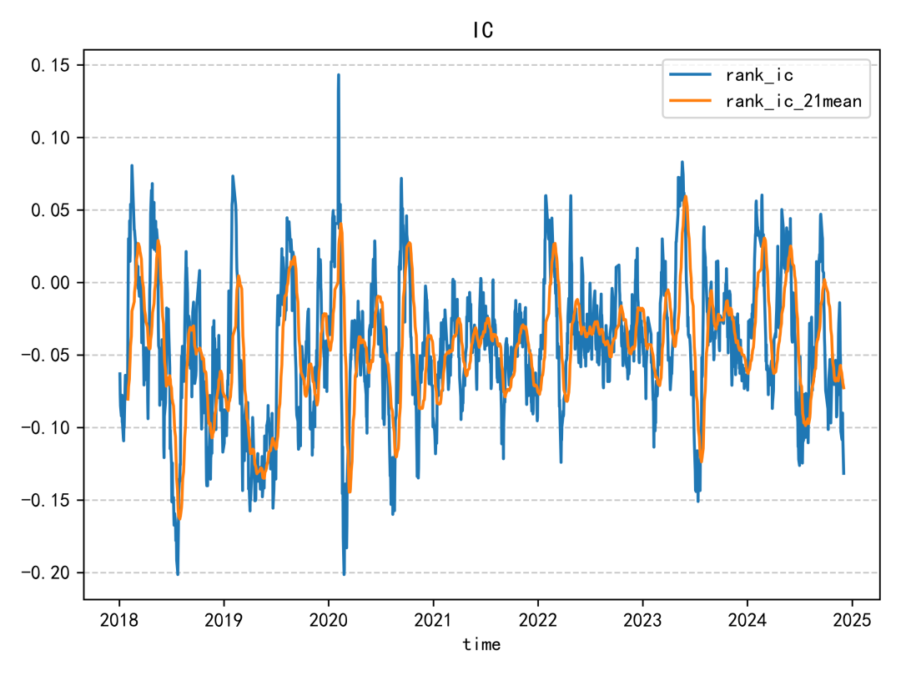

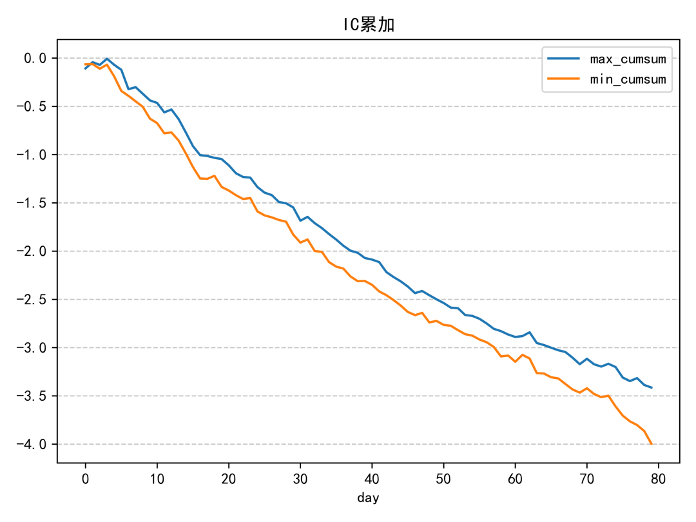

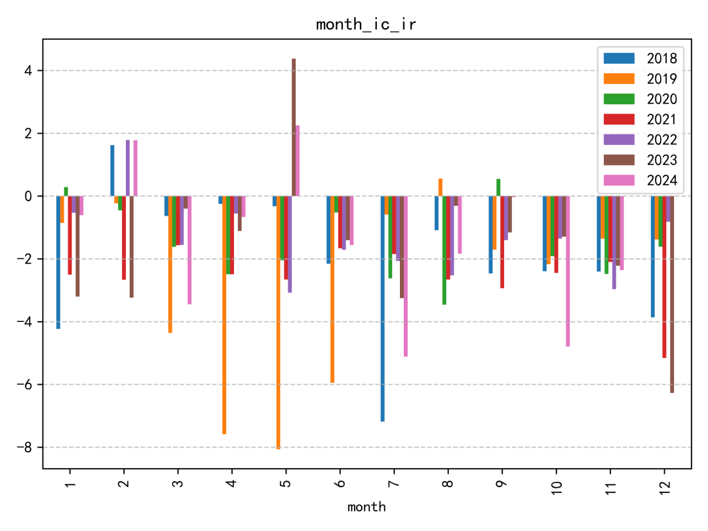

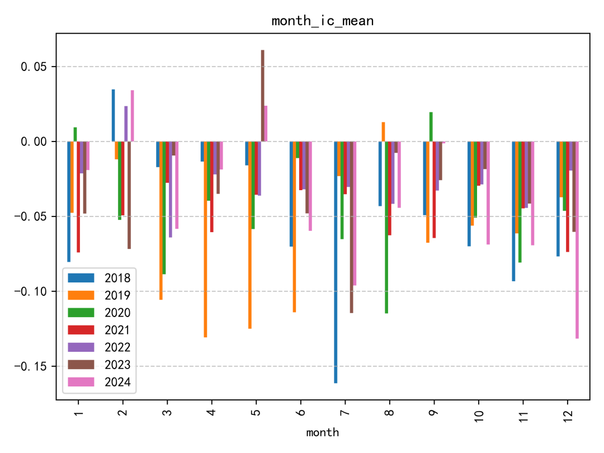

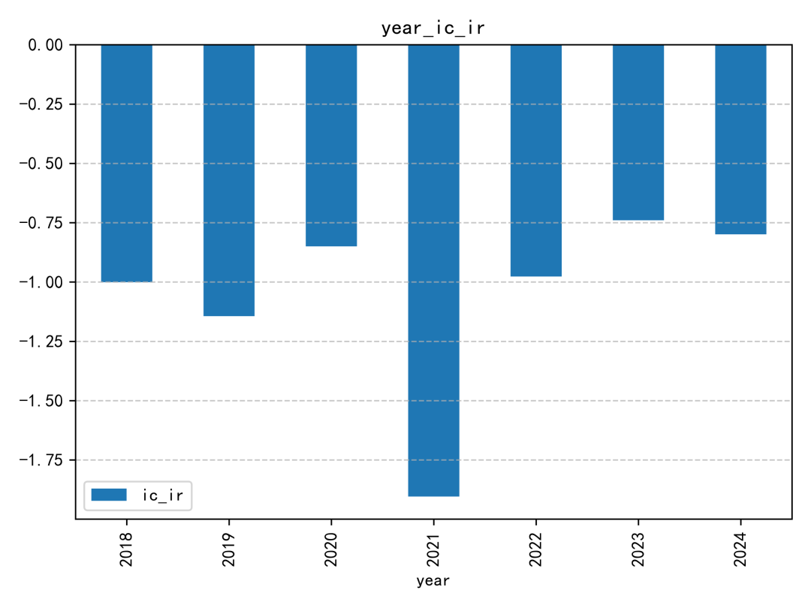

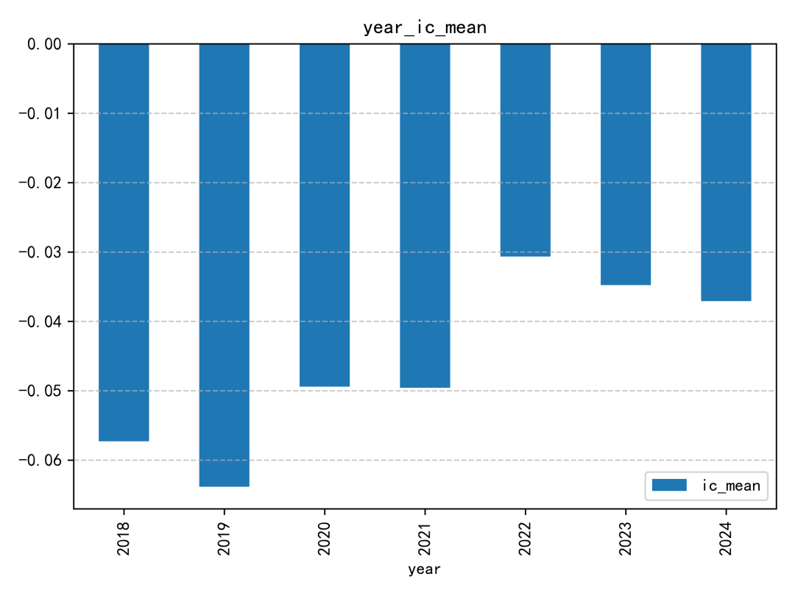

這個因子的 IC 表現整體偏普通。即使放在同一份研究報告的因子集合中，也不算特別突出；IC 絕對值超過 0.06 的年份，幾乎只有 2019 年相對明顯。

### 迴歸分析

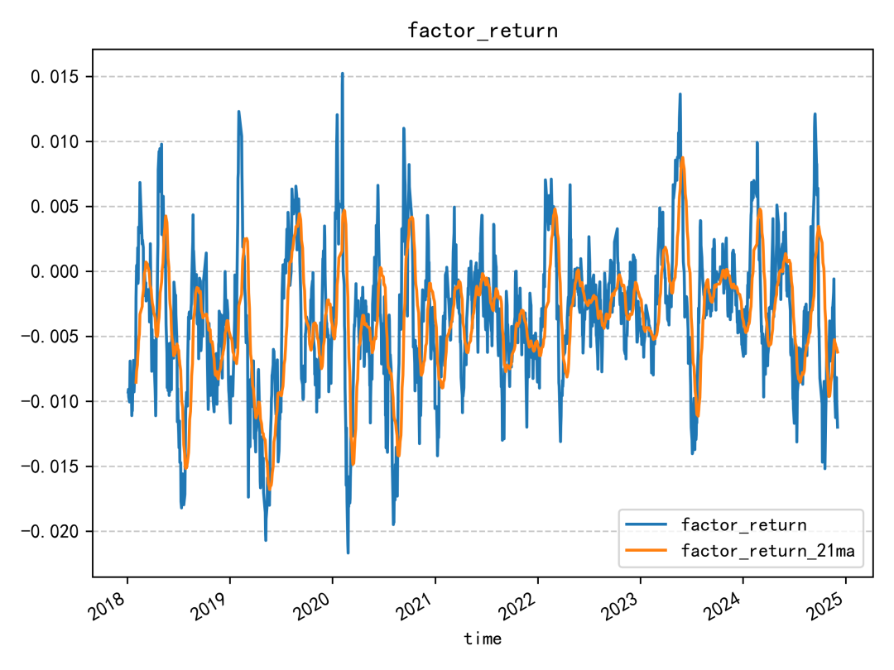

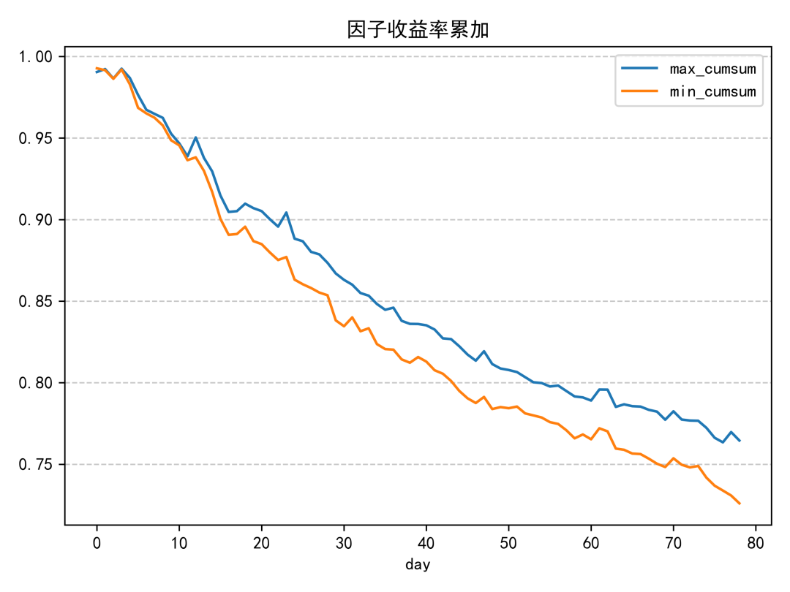

### 週轉率分析

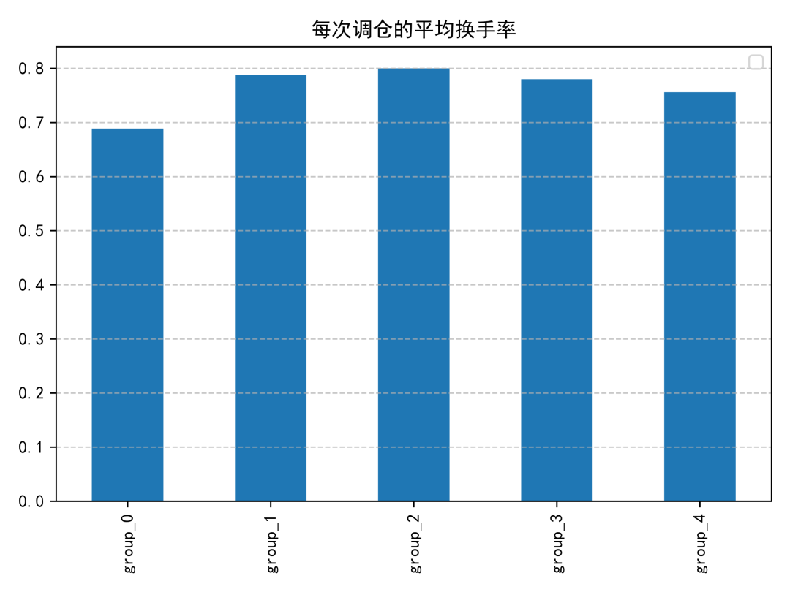

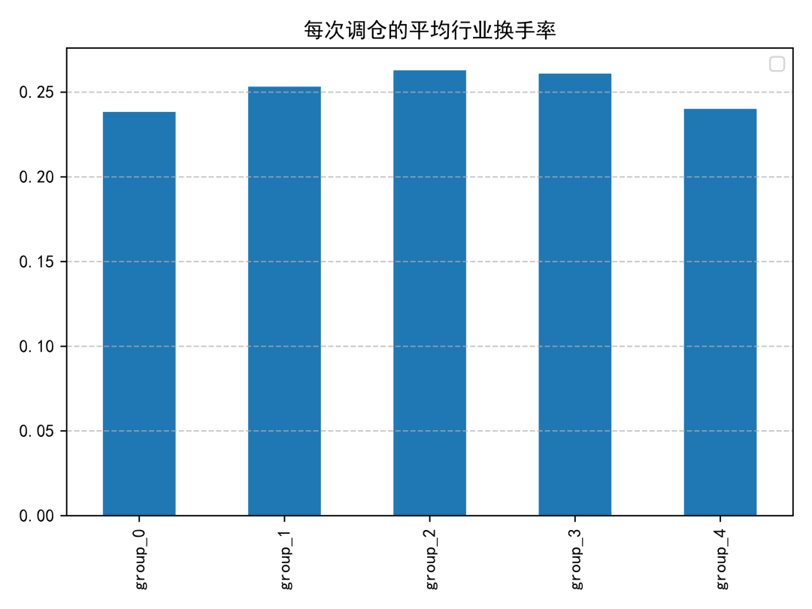

### 報酬分析

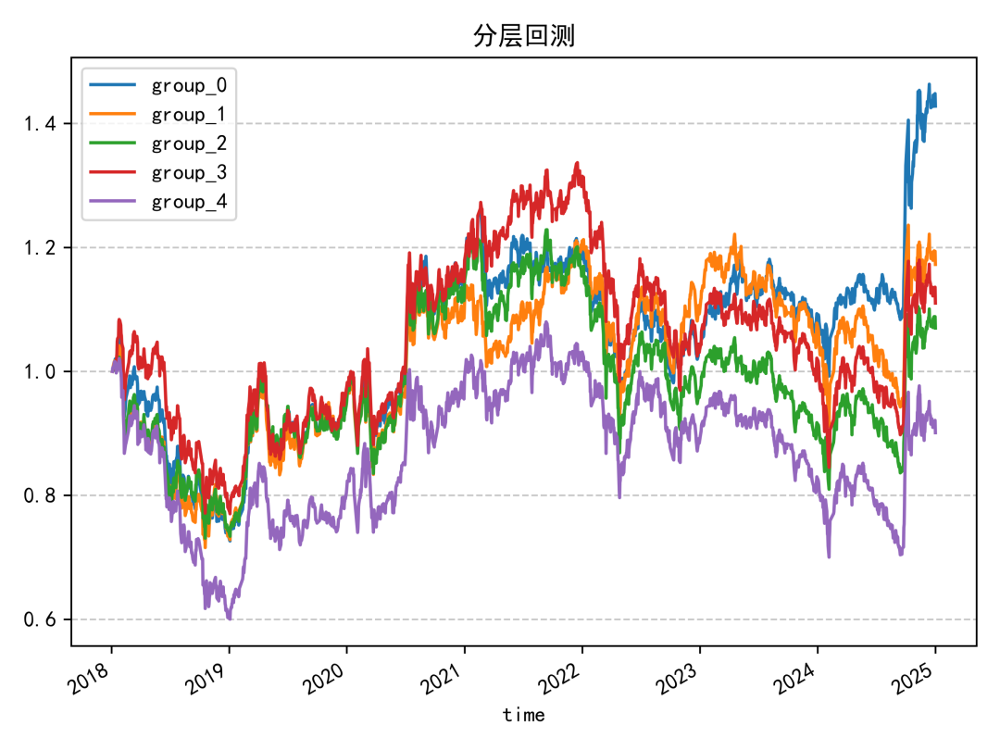

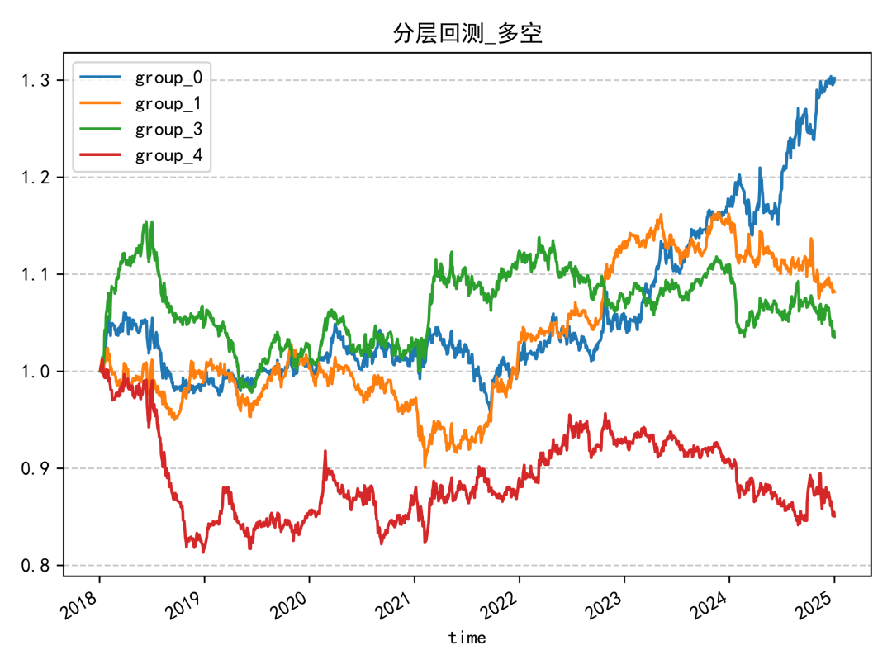

分層回測結果同樣偏中性，單調性不算理想。除了因子值最高的一組明顯落後外，其餘各組之間的區分度沒有拉得很開，代表這個因子單獨使用時的排序能力有限。

## 結論

成交量分桶熵的優點是概念直觀、計算流程不複雜，也容易實作成日頻因子；但從 IC、迴歸與分層回測結果來看，它比較像是可納入因子池的輔助型訊號，而不是單獨就能撐起策略的核心因子。

若要延伸使用，較合理的方向有兩個：

1. 與同一篇研究報告中的其他成交量分布類因子做組合。
2. 搭配流動性、波動度或事件型因子一起做橫截面排序。
