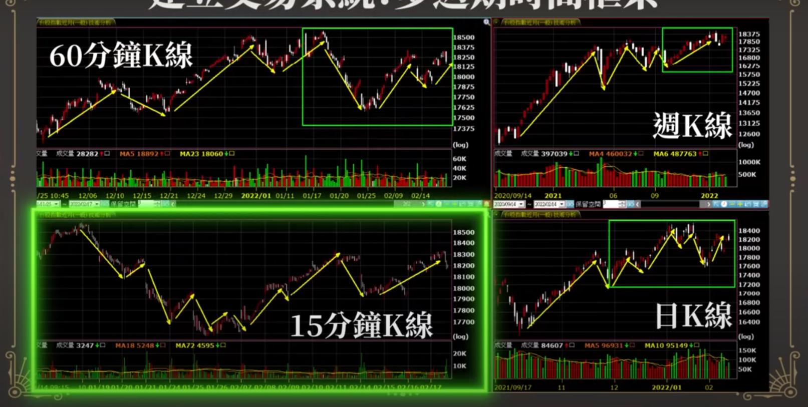
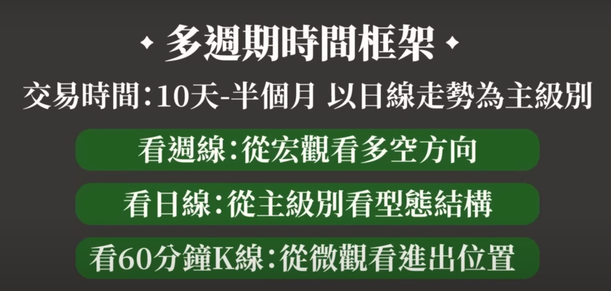
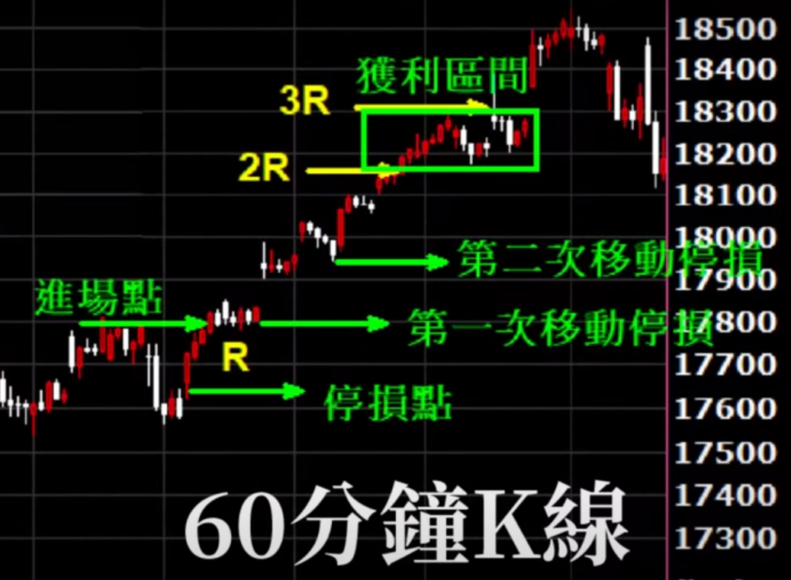

# 拾人牙慧

## 判斷趨勢

- 美股 台股 亞股 歐股 一起看
- 台股上市櫃指數站上月線才做多

## 選股

- 美股會領先反應誰是主流類股 ，當台股某股票發動時去跟美股主流股比較是否是相同類股
  - ex: 2023/01~2023/05  Nvidia 漲100%  ，台股AI相關股票5月發動也是Nvidia 受惠股
- 選產業未來
- 台股找產業未來 or 題材
- 看月K or 周K 長紅棒超過12根漲幅% 該股可能後面有大行情
- 阿魯米
  - 空頭選股跟大盤比，哪些股票先回到起跌時候的股價
  - 個股漲幅需比大盤強，找出強勢股名單

- 張捷
  - 「買對(個股)，押大(部位)，長抱！」
  - 張捷口中的「長抱」，指的是波段投資，個股買進後平均持有時間約3個月，講「長抱」的用意是提醒學員不要做太短，因為當沖的短線交易成本(手續費、證交稅)太高，短線的買賣點也會因誤判而無法精準掌握，賣掉後可能又被迫追高買回來，把自己搞得緊張兮兮，甚至嚴重影響心情，得不償失。
  - 產業趨勢一旦成形，可能持續1、2年，甚至更久，但該產業成長股的股價通常會提前反映，而且漲勢通常會集中在幾個波段，張捷因此認為，投資人若能領先掌握產業及相關個股的成長動能，在相對低檔進場做波段投資，會比買進個股長抱1年以上更有效率。
- 奇正
  - 買進強勢類股中的最強勢股票
    - 依據我多年的觀察與驗證，在強勢類股中，強勢股與弱勢股表現也是差很多；而漲最兇的通常不是基本面最好的，所以你如果以基本面去選，而不是以強弱去選，很可能買到的都不會漲，別人漲一倍兩倍，你是漲１０％，２０％。以近期的「美國寬頻基建概念股」來說，華星光、仲琦是類股中其他股票漲幅的數倍，到底在漲什麼？就像ＡＩ為什麼會漲到緯創，不就是一代工廠嗎？也能飆成就好像它是OPEN AI在台灣上市，總之，股市就是無厘頭啦！簡而言之，股市黃金律就是「買進強勢類股中的最強勢股票」不是買進最好的股票。對於10個裡面有9.9999個不懂得這個道理的股市小白你叫他去開槓桿快速致富，是要害人吧！
  - 專心致力研究當時表現最突出的股票
    - 為什麼李佛摩是投機的祖師爺，因為他所講過的話到最後都被驗證是至理名言。追隨主流股，別不信邪，什麼技術分析、籌碼分析、產業分析、宇宙奧秘、包寧傑通道…，攏總沒路用。唯一有用的就只有，辨識主流股。「…專心致力研究當時表現最突出的股票。假如你無法從表現領先的熱門股身上賺到錢，你就別想從整個股市裡賺到錢。正如女人的服裝、帽子與珠寶永遠都在變一樣，股市中的主流類股也是此起彼落的變換。多年以前的主流類股是鐵路股、美國糖業和煙草類股。再來換成鋼鐵，美國糖業和煙草類股則悄悄走入歷史。按著汽車類股出現，這樣的戲碼至今仍不斷上演。…」

## 當沖 (阿老師)

- 賭紅K 當沖
  - https://www.youtube.com/watch?v=gg2VILaU3jc
  - 開盤價是一個關鍵點
  - V 轉的低點要爆量往上
  - 在開盤價以下不能太久時間 反之賭黑K  也是不能在開盤價之上太久
  - 在開盤價上面遊走很久收紅K機會大

## 隔日沖 (阿老師)

- https://www.youtube.com/watch?v=003FKXkyNII
- 隔日沖屬於波段單的範疇
- 隔日沖位階很重要
- 乖離過大 不要做隔日沖
- 波段單建立部位最好是在短期波段突破不一定要長紅K 只要是紅K 收盤價是最近幾日最高點  (也適合當天收盤買做隔日沖)

## 資金配置 

- https://www.youtube.com/watch?v=mV-hhdsINyI
- 各種資產配置
  - 股票集中管理3~5檔  ，操作不同產業股票或同產業不同屬性
    - ex: 1000萬 分3檔股票操作，資金分10等份 一次丟一份100~150萬
  - 同產業不太一樣～ 或是產業不同

## 暴大量

- 暴大量隔天是觀察日

- 低檔爆量
  - 上攻力道強
- 高檔暴大量
  - 換手失敗長黑K，連續K 可能就是頭部形成，可能要休息一陣子
  - 換手成功上去壓力變支撐

## 進場

- 觀察位階，漲過一波位階高要小心
- 低檔暴大量
- 高檔暴大量換手區，換手成功變支撐
- 發動後第一波沒跟上等盤整後發動第一根尾盤買盈虧比會漂亮
- 多頭股價上漲一般都是走階梯
- 上市櫃指數站上月線 or 10日均線  or 突破盤整
  - 檢視抗跌或率先突破的細產業，並跟大盤比較，找出強勢族群＆又有量  https://www.youtube.com/watch?v=0c4D-3Bh6M0
- 阿魯米
  - 波段單建立部位最好是在短期波段突破收盤價是最近幾日最高點(不一定要長紅K，只要是紅K) 
  - 量縮到極致，之後慢慢出量上漲可能是發動前兆 https://galaxyinvestment.my-galaxy.com.tw/GalaxyAcademy/groupCourse/groupCourse.do?id=20230104464156

## 出場

- 等幅會跟上一波大於等於上波漲幅去觀察
- 進場沒獲利情況設 5~10％停損，當獲利10% 以上移動停利或周K翻黑出場
- 停損設突破長紅棒最低點
- 停損跳空上漲缺口區 (回補缺口代表弱掉)
- 高檔暴大量，換手常常伴隨大黑K
- 期貨當天噴出去瘋狂時候賣

## 加碼(建倉)

- 現股與期貨不同
  - 現貨：需要交割，沒賣出股票之前，錢回不來，資金要分配分批加碼建倉

  - 期貨：期貨只要有交易，保證金可以滾入再交易，可以把賺來錢再加碼

- 當沖加碼不適合加碼太多次 ex:  試單對了之後關鍵點位 all in 再減碼出場 

- 金字塔加碼  https://www.youtube.com/watch?v=JI9uSxGu2_U
  - 做波段資金要分配，所以要分批加碼建倉

  - 正金字塔順勢交易，越買越少，往上加碼越少成本不會墊高太多，底倉比較大  ex:  10口 8口 3口 1口，加碼4次

  - 倒金字塔逆勢交易 (存股族)，越買越多，往下加碼 ex: 指數型 ETF

- 加碼次數跟行情有關係，台股可以預設分三批加碼

- JG
  - 趨勢多頭格局，在拉回收黑都是進場加碼的時候

  - 分批買進，只是建倉，壓低成本，抱得住後面才能暴賺

  - 美股要拆太多筆(10筆) ，可以向下分批

  - 美股震盪大15~20% 才加碼一次

  - 假設分三批進場，在三批全部打進去之前都視為建倉，所以在完成建倉之前，風險都控制在10元，所以在第二筆打進去之後，成本110應該是在105的時候就會止損了，"有賺不能賠"應該是建倉完畢後才開始執行

  - 前期建倉完成後是用一個沒有賠到錢心情在拼後面大利潤

  - 每後一次進場風險都變小

  - 暴賺哲學 選股標的同時持有不同股票

- 10倍股法則 林子揚

  - 金字塔分批，越買越少

## 波段

- 阿魯米
  - 空頭短線必勝法  順勢交易   https://www.youtube.com/watch?v=FF49VYNzFYA
  
    - 要有停損點
    - 要有參考點 (參考點右側是順勢交易，左側是逆勢交易)
      - 確定低點出來才進去買，確定高點出來才去賣
    - 
  
    - 10天以上超過1周就要看周K方向
    - 
  
    - 主級別上一層來判斷方向
      - ex: 做3~10日 <-主級別是60分K
        - 日K方向往上
        - 主級別是60分，上個級別(日)看方向，下個級別(15分)找進場點
        - 小級別是15分，做停損架構，去享受大級別的方向，當它推動走出去是日線的收獲，15分K的停損
        
      - ex:做10~60日 主級別是日K
        - 周K看趨勢方向
        - 主級別看型態結構
        - 小級別從微觀看進出位置
    - 設定R值 
      - R值：進場點 ～ 停損點
      - 目標區: 2~3倍R，在目標區之前設定停損即可，之後 follow trend
      - 
  
  - 買在波段起漲點
  
  - 買在最具有動能的地方
  
  - 盤區偏高地方是危險
  
  - 證偽循環的步驟
    - 趨勢猜測
    - 趨勢證明
    - 追蹤趨勢加減碼
    - 停損價在總部位的均價以上
      - 一旦涉及加碼移動停損點要在成本上面不能虧錢
  
    - 出場原則
  
  - 在不確定性中，尋找確定性
  
- 波段先看大環境 美國  台灣 經濟 ＆ 大盤指數

- 做多:
  - 多頭/空頭/盤整都需要跟大盤相比都要超過大盤
  
- 股票波段噴出大紅K價位點，可能都不容易回來，不會回頭的價位點通常都是噴出的價位點

- 波段加減碼 or 空手 看櫃買指數跟大盤指數
  - 上市上櫃指數站上月線 or 10MA
    - 初升段 -> 主升段力道最強，後面出現盤整可能是末升段，資金要控制縮小，提防回檔修正
  - 波浪理論
    - 初升段跟主升段資金可以放大點
  
- 波段單建立部位最好是在短期波段突破不一定要長紅K 只要是紅K 收盤價是最近幾日最高點

- 想辦法找出當下主流股
  - 真正主流股美股通常先會反應 ex: NVIDIA 2023/01~2023/5 漲100%  台股2023/5月才開始發動
  
- 做短線靠技巧，做波段靠天吃飯

- 做波段沒走出來不知道是波段終點在哪 ～ 波段資金是慢慢加碼不是一次買

- 周K/月K 長紅棒(超過過去12根漲幅) 可能後面有大行情 ，日K級別找進行點

- 發動中股票之後盤整均線糾結後第一根長紅棒尾盤買進， 盈虧比漂亮

## 抄底

- BNF 
- 郭泰小抄底
  - 選找未來3~6個月主流趨勢類股，哪檔最強
  - 皮球理論
- 權證小哥
  - 急跌大綠棒爆大量進場賭反彈
    - 馬丁策略賭10次 ex: 第一次10元  失敗，第二次20元 , 第三次 40元，依此類推

## 實戰

- 股票操作
  - 台股是淺碟型市場，漲時容易超漲，跌時也容易超跌 
  - 一波 週期是 3~8 週走勢就進入盤整
  - RSI 80 連續三天符合的股票檔數多寡判斷大盤強弱
  - 進場  
    - 大盤周K在連續黑K後轉紅K 試單 -> 看對-> 加碼
  - 出場 
    - 周K轉綠 減碼 or 賣出
  
- 選擇權操作
  - 大盤周K 出現轉折  
    - 連續紅or綠轉折
  - 選擇權買價外賭轉折後噴出 
  - 期貨指數 60分60MA 穿越
  - 履約價CALL or PUT 最低價20元左右買

## 總結

- 多頭行情想辦法找出主流股
- 嘗試不斷高檔減碼、低檔買回、高檔減碼、再低檔買回 by JG
- 沒行情 
  - 空手 
  - 盤整小資金練功能獲利
- 大賺小賠 (控制賠)
- 資金配置
- 嚴格停損
- 停利？
- 看對 壓力 抱緊  <- 使用加碼
- 心態 : 資金風控 ＆ 停損  ＆ 紀律 ＆ 停損相關 

