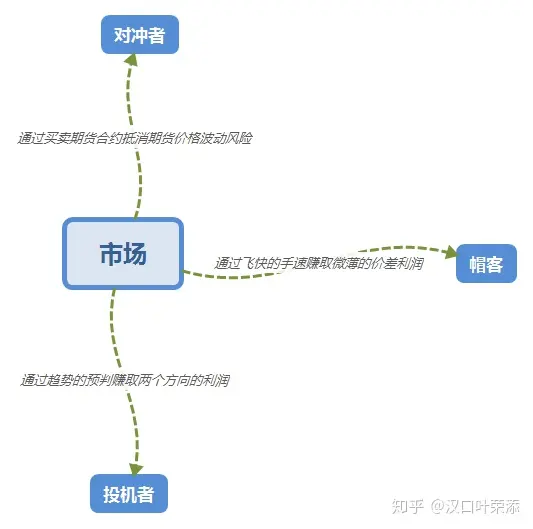
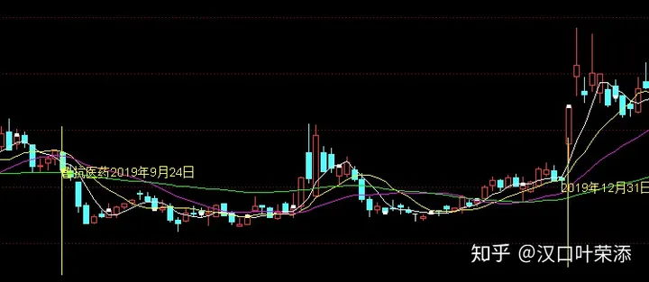
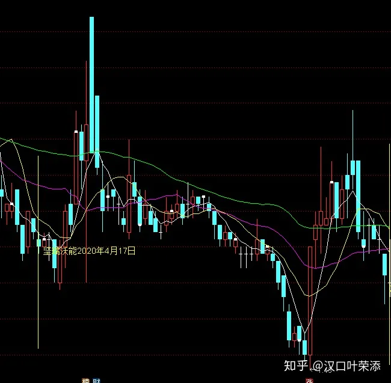
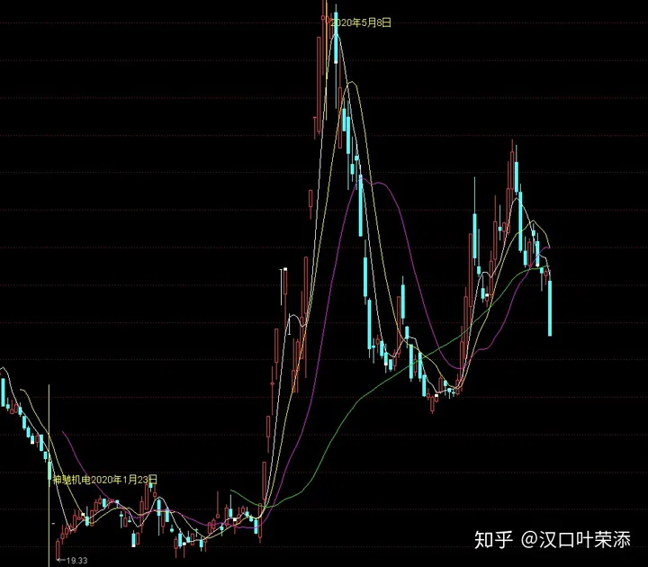
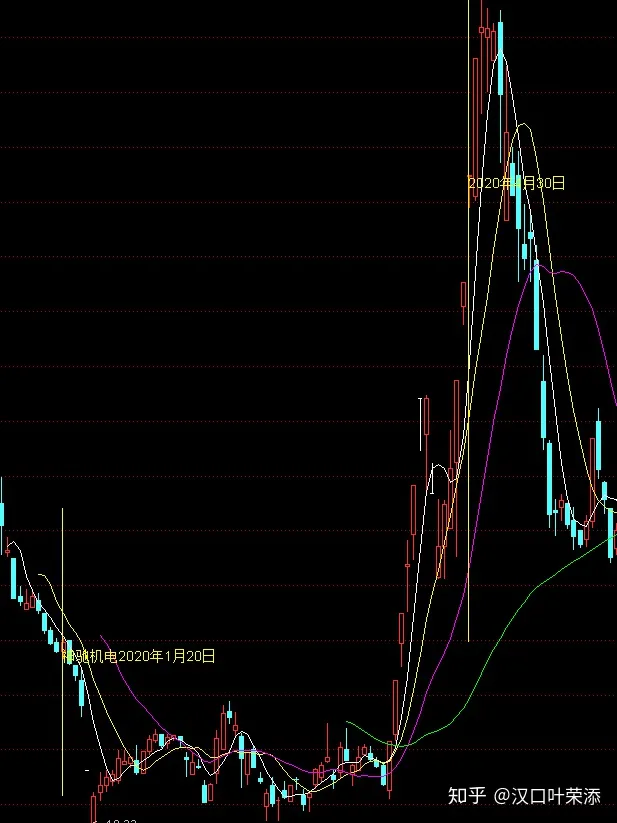
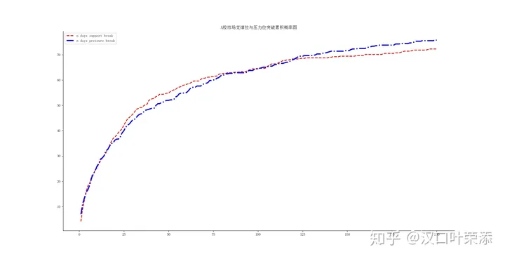
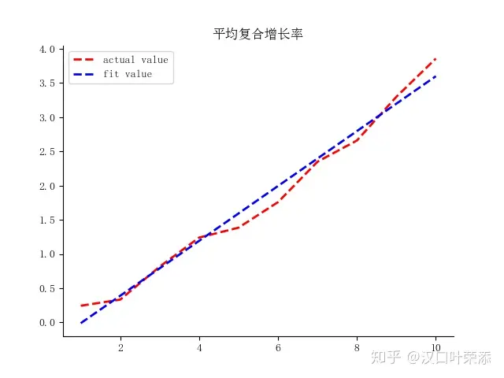
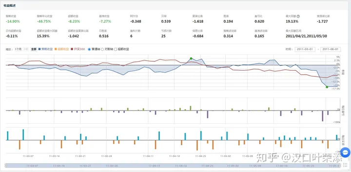
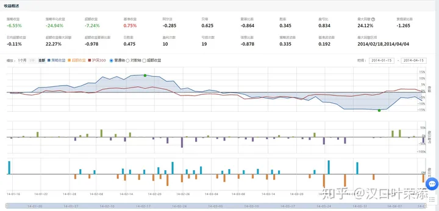

# 史上最詳盡的海龜交易法則筆記

出處 ： https://zhuanlan.zhihu.com/p/158083885


海龜交易的一切都源於全世界最著名的期貨投機家理查德 丹尼斯和他的好朋友比爾 埃克哈特的一場爭論，就是傑出的交易者究竟是天生的還是培養出來的。丹尼斯相信他幾乎可以把任何一個人變為優秀的交易者，埃克哈特則認為這是一種天賦問題，不是培養問題。丹尼斯願意用自己的錢來證明自己的話，於是兩人打了一個賭。

為此，他們在《華爾街日報》、《巴倫週刊》和《紐約時報》上刊登了大幅廣告，宣佈丹尼斯正在招募培訓生，他會把自己的交易方法傳授給這些人，然後給每個人一個100萬美元的交易帳戶。這些培訓生就被叫做海龜。

我認為海龜交易法則是一套投機理念，它的技術規則、操作規則與心理解析共同支撐了這套交易系統，而不是單單根據一些技術資料進行交易，它的技術資料可能在我們自己的市場得不到驗證，但是整個理念適合於所有的投機市場。

《海龜交易法則》這本書的作者就是丹尼斯的門徒之一，他負責丹尼斯最大的一個帳戶，為丹尼斯賺了3100多萬美元。

海龜的思維

三種類型的交易者

對沖者：一般為企業，通過買賣期貨合約抵消期貨價格波動風險。

帽客：經營市場的流動性風險，希望通過快速與對沖者交易賺取價差。他們為市場創造了流動性，因為他們在不停的出價、要價，寄希望於買單和賣單之間的平衡。

投機者：寄希望短期價格的預判。



價格變動取決於市場中所有的買者和賣者的共同態度，這些買賣者就是我們所說的那些帽客、投機者和對沖者：想在一天內反覆賺取微小買賣價差的人（帽客），想投機於一天或幾個星期、幾個月內價格大幅變化的人（投機者），以及想規避經營風險的人。（對沖者）

共同態度變了，價格就會變化。不管什麼原因，一旦賣者不再願意以目前的價格賣出，而是想提高價格，買者又願意接受這個更高的價格時，市場價格就會上漲。反之亦然。

交易過程中出現的情緒：

1. 希望：我當然希望我買了之後，它馬上就漲
2. 恐懼：我再也賠不起了，這一次我得躲得遠遠的。
3. 貪心：我賺翻了，我要把我的頭寸擴大一倍。
4. 絕望：這個交易系統不管用，我一直在賠錢。

在那些較為簡單原始的環境中，人類已經形成的某些特定的世界觀對他們大有幫助，但在交易世界中，這些認識反而成了障礙。人類認識現實的方式可能出現扭曲，科學家們稱之為認知偏差。以下是幾種對交易行為有影響的認知偏差：

**1、損失厭惡：對避免損失有一種強烈的偏好。也就是說，不賠錢遠比賺錢更重要。**

患上損失厭惡症的人對避免損失有一種絕對的偏好，盈利只是第二位的。對大多數人來說，沒有賺到100美元與損失了100美元並不是一回事。但是從理性角度來看，這兩者是一回事：它們都代表著這100美元沒有盈利。

**2、沉沒成本效應：更重視已經花掉的錢，而不是而來可能要花的錢。**

假設ACME公司投入了1億美元開發一種用於生產筆記型電腦螢幕的特殊技術，但在這筆錢已經花掉之後，該公司卻發現另外一種技術明顯更好，而且更有可能及時帶來它所期望的成果。如果從純理性的角度出發，ACME公司應該權衡一下採用這種新技術的未來成本和繼續使用當前技術的未來成本，然後根據未來的收益和支出狀況作出決策，完全不必考慮已經花掉的那些研發投資。

**3、處置效應：早早兌現利潤，卻讓損失持續下去。**

指投資者傾向於賣掉價格正在上漲的股票，卻保留價值正在下跌的股票。有人認為這種效應與沉沒成本效應有關。

**4、結果偏好：只會根據一個決策的結果來判斷它的好壞，而不去考慮決策本身的質量。**

**5、近期偏好：更重視近期的資料或經驗，忽視早期的資料或經驗。**

指一個人更重視近期的資料和經驗。昨天的一筆交易比上個星期或上一年的交易重要。近兩個月的賠錢經歷可能跟過去6個月的賺錢經歷同樣重要，甚至更加重要。於是，近期的一連串不成功的交易會導致交易者懷疑他們的方法和決策程序。

**6、錨定效應：過於依賴容易獲得的資訊。他們可能會盯著近期的一個價位，根據當前價格與這個參考價格的關係來作出決策。**

**7、潮流效應：盲目相信一件事，只因為其它許多人都相信它。**

**8、小數定律：從太少的資訊中得出沒有依據的結論。**

小樣本對總體並沒有太大的代表性。比如，如果一個交易系統在6次測試中有4次成功，大多數人都會說這是一個好系統，但從統計學上說，並沒有足夠多的資訊可以支援這種結論。

## 一些交易風格

**1、趨勢跟蹤**

使用這種方法的交易者檢視利用幾個月內的大趨勢。趨勢跟蹤者在市場處於歷史高位或低位的時候入市，如果市場逆轉並維持了幾個星期，他們就會退出。

**2、反趨勢交易**

與趨勢交易相反，在價格接近新高的時候賣空。他們的理論依據是，新高的突破大多都不會引發市場趨勢。

**3、波段交易**

本質上與趨勢跟蹤交易相同，只不過它瞄準的是短期市場動向。比如，一次成功的波段交易可能只會持續三四天，而不是幾個月。

**4、當日交易**

一個真正的當日交易者總是試圖在每天的交易結束之前退出市場。這樣一來，即使夜間爆發的負面新聞引發了開盤之後的劇烈變化，他們的頭寸也不會受到什麼影響。

## 市場狀態

講技術的書，以下面的描述最為模稜兩可，因為很多參數沒有量化。比如第一個穩定平靜的狀態，較小的範圍是多少就很難界定，而且各人有各人的理解。但是這個問題直接影響到進場的時機，所以又必須進行量化。我不認為所有講述技術的書都是扯淡，也不認為所有講述技術的書都是真實的，最重要的還是得到一種思路，然後通過思路進行實驗，得出一個適合於自己的套路。這個適合於自己包括自己的風險承受能力，自己的資金量和操作手法。為了將下面描述的市場狀態做一個量化，首先假定觀察週期是3個月。

**1、穩定平靜**

價格在一個相對較小的範圍內上下波動，很少超出這個範圍。

量化指標：如果觀察週期內最高價與最低價的波幅不超過20%，以觀察週期的第一天價格為基準價，週期最後一天價格與基準價格波幅不超過10%，則為穩定平靜狀態。



例子：魯抗醫藥2019年9月24日-12月31日

**2、穩定波動**

有大的日間或周間變化，但沒有重大的月際變化。

量化指標：如果觀察週期內最高價與最低價的波幅在20%-50%之間，週期最後一天價格與基準價格波幅不超過20%，則為穩定波動狀態。



例子：堅瑞沃能2020年4月17日-7月24日

**3、平靜的趨勢**

價格在幾個月中呈現出緩慢的運動或趨向，但始終沒有劇烈的回呼或反方向運動。

量化指標：向上趨勢為將週期分為均等的10段，每一段的波幅都不超過-20%，基準價向下波幅不超過-20%，週期最後一天價格幅度超過基準價60%，向下趨勢正好相反



例子：神馳機電2020年1月23日-5月8日

**4、波動的趨勢**

價格有大的變化，偶爾伴有劇烈的短期逆轉。

量化指標：向上趨勢為基準價向下幅度在-20%以下，週期最後一天價格幅度超過60%，向下趨勢正好相反



例子：神馳機電2020年1月20日至4月30日

## 海龜的課程

**1、破產風險**

裡面舉了一個擲骰子的例子，一個骰子6個面，假如你擲出4點、5點或6點，你每押1美元就賠給你2美元，那麼如果你口袋裡有1000美元，你每次會押多少錢？是押1000美元、500美元還是100美元？從機率上來說，如果你一次就all in，那麼你有50%的機率破產，如果你每次押500美元，那麼也有25%的機率破產，如果你每次押100美元，那麼你的破產機率是 0.510 =0.097%

破產風險會隨著賭注的增加而不成比例地迅速增大，這是它最重要的特徵之一。如果你把每次的賭金翻一番，破產風險一般不止翻一番，視系統特性的不同，風險有可能翻上兩番、三番甚至四番。

**2、資金管理**

所謂資金管理，就是指控制市場風險的程度，確保交易者能安然度過每一個交易者都必然要碰到的不利時期。交易者既要讓盈利潛力最大化，又要把破產風險控制在可以接受的水平，資金管理就是這樣一門藝術。

這裡書中的第三章看的不是太明白，所以查閱了知乎上的文章

2.1、首先要計算一個叫做ATR的技術指標，這個技術指標的演算法如下：

2.1.1、當前交易日的最高價與最低價間的波幅

2.1.2、前一交易日收盤價與當前交易日最高價間的波幅

2.1.3、前一交易日收盤價與當前交易日最低價間的波幅

以上三個數取最大值就叫真實波幅，根據迭代演算法，每天都可以取這麼一個真實波幅，比如取14天真實波幅的平均值作為當天的ATR（平均真實波幅），其實就跟移動平均線的演算法是一致的，只不過具體的規則有點區別。

舉個例子：

假設初始資金為init元，讓1個ATR波動表式帳戶的1%，再假設某股票價格為p，當前ATR值為atr，那麼應該買多少股呢？

應該買的股數 = init * 1% / atr

那麼交易的資金 = p * init * 1% / atr= init * 1% * p / atr

如果我們的止損定在1atr，那麼當虧損 = -atr * init * 1% * p / atr = - init * 1% 的時候，就止損

如果我們的止損定在2atr，那麼當虧損 = -2 * atr * init * 1% * p / atr = -2 * init * 1%的時候，就止損。

下面是原版海龜的ATR計算方法

> 原版海龜ATR的計算方法
> 真實波幅 = max(H-L, H-PDC, PDC-L)
> H=當日最高價
> L=當日最低價
> PDC=前一日收盤價
> N = (19 * PDN +TR)/20
> PDN = 前一日的N值
> TR= 當日的真實波動幅度
> 由於公式中需要前一日的N值，你在首次計算N的時候不能用這個公式，只能計算真實波動幅度的20日簡單平均值。

資金管理是海龜交易的精髓所在。

**3、期望值**

運用機率學公式，E= ∑iNp(xi)∗xi ，如果在有限次交易中，最後E的結果為正，那麼表示策略是可行的。所以短期的失利不重要，海龜以這樣的方式看待損失：損失只是做生意的成本，並不代表著一次錯誤交易或一個壞決策。

## **像海龜一樣思考**

**1、避免結果偏好**

好的交易者考慮的是現在，而避免對未來考慮過多。新手則想預見到未來：如果他們贏了，他們會認為自己預測對了，感覺自己像個英雄；如果他們輸了，他們會把自己當成傻瓜。這是錯誤的。

**2、避免近期偏好**

大多數交易者不僅對未來考慮過多，對過去同樣考慮過多。他們會唸唸不忘過去所做的事，過去所犯的錯誤，還有過去那些失敗的交易。

海龜們會從過去的經歷中吸取教訓，但不會為過去而煩惱。他們不會為過去所犯的錯誤而責備自己，也不會對過去的失敗耿耿於懷。他們知道這只是遊戲的一部分。

**3、避免預測未來**

你必須從機率的角度來考慮未來，而不是擺出一副預測的架勢。文中舉的例子為對唐奇安趨勢系統的一次20年間月度回報率的測試結果，並作出了機率密度圖與累積機率圖，類似於常態分配圖。此例子提到了一個參數叫**R乘數**，R乘數等於一筆交易的利潤除以這筆交易的風險投入。風險投入的概念以一個例子說明。如果你在每盎司450美元的價位買了一份8月份黃金合約，止損退出價位是440美元，那麼你的風險投入是1000美元，因為450美元與440美元之差（10美元）乘以一份合約所代表的黃金數量（100盎司），等於1000美元。如果這筆交易賺了5000美元，那麼它就是一筆5R交易。以下是測試結果的機率圖（自己重設的，在資料上與文章的不一樣，意思是一個意思）

## **發現系統優勢**

優勢這個詞借鑑自賭博理論，原本是指賭場所掌握的統計學優勢，它也指21點玩家可能通過記牌而獲得的優勢。在賭局中，如果你沒有優勢，從長期來看你肯定會輸。

交易世界中也是如此。如果你沒有優勢，交易的成本會讓你賠錢。交易中的優勢是指一種可以利用的統計學優勢，它以市場行為為基礎，而這些市場行為是會重複發生的。在交易世界中，最好的優勢來自於人類認知偏差所釀成的市場行為。

**系統優勢三要素**

1、資產組合的選擇：決定應該進入哪些市場的運算系統

2、入市訊號：決定什麼時候開始一筆交易的運算系統。

3、退出訊號：決定什麼時候退出一筆交易的運算系統。

**如何發現優勢**

當某種特定的市場行為發生時，系統會發出入市訊號。當你檢驗入市訊號時，你需要關注的是伴隨這種市場行為而來的價格變動。我們可以把這種價格變動分為兩個部分：好的變動和壞的變動。好的變動就是對你有利的變動。換句話說，如果你買入，那麼市場上漲就是好的變動。壞的變動與之相反。

交易者們把往壞方向的最大變動幅度稱為MAE（maximum adverse excursion），把往好方向的最大變動幅度稱為MFE（maximum favorable excursion）你可以用這些概念來直接衡量一個入市訊號的優勢。觀察一個入市訊號之後的價格變動，如果好的方向的平均最大變動幅度大於壞方向的平均最大變動幅度，說明存在正的優勢。一個真正隨機性的入市策略會帶來大致上相等的好變動和壞變動。比如，如果你用擲硬幣的方式來做出買賣決策，正面朝上就做多，背面朝上就做空，那麼在你入市之後的價格變動中，MFE與MAE應該相等。

MAE=abs(買入價-計算週期內的最低價)

MFE=abs(買入價-計算週期內的最高價)

文中介紹了作者自己開發的一種優勢比較工具，稱之為E-比率，E-比率的計算方式如下：

1、為每一個入市訊號計算指定時間段內的MFE和MAE。

2、將上述各MFE和MAE值分別除以入市時的ATR，這是為了根據波動性做出調整，將不同市場標準化。

3、將上述調整後的MFE和MAE分別求和然後除以入市訊號的總次數，得到調整後的平均MFE和MAE。

4、調整後的平均MFE除以調整後的平均MAE就是E-比率。

MFE= (∑1nMFEi/ATR)/n

MAE= (∑1nMAEi/ATR)/n

n = 入市訊號的總次數

E-比率 = MFE/MAE

擲硬幣的E-比率在n趨近於無窮大的時候應該等於1，所以E-比率等於1時，表明沒有優勢，也沒有劣勢。當E-比率大於1時（樣本量要足夠），說明當前的入市訊號存在優勢。E-比率要結合指定的時間段計算，如果以10個交易日為週期，那麼就稱之為E10-比率。文中將兩個入市訊號結合起來使用獲得了1.33的E-比率，證明通過一些策略是可以在買入時獲得很大優勢的。

**E比率實驗：**

由於A股市場無法做空，所以也無需擲硬幣，我的實驗步驟是這樣的：

1、找出A股的所有股票

2、隨機抽樣100隻股票

3、計算每隻股票從上市到當前時間的ATR值，採用海龜原版的方法計算ATR

4、針對每隻股票隨機選取起始時間（但是要保證往後有50個交易日）

5、計算每隻股票的E-50比率

6、計算這100隻股票的平均E-50比率

7、從第2步開始到第6步，重複100次

8、計算總體平均E-50比率

最後計算出來的E-50比率為1.49

同樣的邏輯計算出：

E-30比率為1.35

E-10比率為1.22

以下是程式碼片段

```python3
"""
根據隨機入市訊號計算E-50比率
"""
def randomERate(self, n=50):
    e_list = []
    st = storage()
    sql = "select symbol from stock_summary where type = 0"
    stockList = self.connect.getAll(sql)
    for _ in range(100):
        mae_list = []
        mfe_list = []
        sample = getSamplePointWithRandom(100, stockList)
        for ss in sample:
            symbol = stockList[ss][0]
            tableName = "stock_history_"+symbol
            if st.isTableExist(tableName):
                sql = "select `close`,`open`,`high`,`low` from "+tableName+" order by timestamp asc"
                dataList = self.connect.getAll(sql)
                if len(dataList) < n: #計算50日E比率，記錄小於50條的過濾掉
                    continue
                atr_list = []
                dList = []
                for idx in range(len(dataList)):
                    close_price = dataList[idx][0]
                    open_price = dataList[idx][1]
                    high_price = dataList[idx][2]
                    low_price = dataList[idx][3]
                    if idx == 0:
                        atr = high_price - low_price
                    else:
                        prev_close_price = dataList[idx-1][0]
                        tr = np.max([high_price - low_price, high_price - prev_close_price, prev_close_price - low_price])
                        atr = (19 * atr_list[idx - 1] + tr) / 20
                    atr_list.append(atr)
                    dList.append({'high': high_price, 'low': low_price, 'close': close_price, 'open': open_price, 'atr': atr})
                stop_num = len(dList) - n
                random_start = random.randint(0, stop_num)
                vList = dList[random_start:random_start+n]
                atr_buy = vList[0]['atr'] #入市時的atr
                v_low_list = []
                v_high_list = []
                for v in vList:
                    v_low_list.append(v['low'])
                    v_high_list.append(v['high'])
                mae = vList[0]['close'] - np.min(v_low_list) #買入價-最低價
                mfe = np.max(v_high_list) - vList[0]['close'] #最高價-買入價
                if atr_buy == 0:
                    continue
                mae_standard = mae/atr_buy
                mfe_standard = mfe/atr_buy
                mae_list.append(mae_standard)
                mfe_list.append(mfe_standard)
        mfe = np.sum(mfe_list)/len(mfe_list)
        mae = np.sum(mae_list)/len(mae_list)
        e = mfe/mae
        e_list.append(e)
    print(np.mean(e_list))
```

*從實驗上可以看到，A股市場上的E比率通常是大於1的，由此可以看出，市場的不同會導致指標值出現較大的差異。至於這個指標對於A股市場，我認為需要辯證的看待。因為指標的演算法是MFE/MAE，而MFE是買入價減週期內最高價的絕對值，MAE是買入價減週期內最低價的絕對值。而我們的市場可能會出現這麼一種情況：在一個週期內出現了一段時間的暴漲和持續的低迷。如果我們的市場普遍存在這種情況，就會出現一個1.4以上的E比率。在《海龜交易法則》這本書中，這個值是一個非常有優勢的入市訊號，因為結合作者的交易策略（一次很大的盈利和N次較小的虧損，但是保證盈利蓋過所有虧損）是非常有效的，而對於A股市場來說，在沒有策略的指引下，這個指標還有意義麼？這是個值得思考的問題。所以對於所謂的技術導向來投機交易，學習指標沒有錯，但是我的意思是不能照本宣科，一是要理解指標的深層次含義，二是要結合具體的市場，三是要結合具體的策略，否則指標對我們來說不僅沒用，而且對我們有害。書中所說的也不能全信，重在理解，學習的只是思路，精髓在於利用思路去創造。*

**退出策略的優勢**

如果有可能的話，即使是系統的退出策略也應該有優勢。遺憾的是，衡量退出策略的優勢更不容易。這是因為退出策略與入市策略和退出訊號都有關係。換句話說，你不能拋開最初建立一個頭寸的緣由而去單獨考察退出策略。這裡面不止有一個系統要素，而是有多個不同要素，而且它們之間有著錯綜複雜的互動作用。

## **尋找交易時機**

優勢是在買者和賣者之間的戰場上發現的。作為一個交易者，你的任務就是找到這些戰場，靜觀誰勝誰敗。

對幾乎所有的交易策略來說，支撐和阻力都是一個基礎概念。所謂支撐和阻力，就是指價格有一種不突破前期水平的傾向。要理解這個概念，最簡單的辦法就是看看價格走勢圖。

支撐和阻力來源於市場行為，而這些市場行為則來源於三種認知偏差：錨定效應、近期偏好和處置效應。

錨定效應是指依賴輕鬆可得的資訊來判斷價格水平的傾向。一個近期的新高或新低變成了一個新的錨，之後的每一個價位都要根據這個錨來衡量和比較。新價格是高還是低，完全取決於它是高於還是低於這個錨定價。近期的高點或低點之所以會成為錨定價，是因為它們在圖表上一眼可見，在心理上對市場參與者有重大的影響。所謂的支撐位與阻力位即是錨定效應的一種表現。

大多數交易者都相信支撐和阻力現象的存在，這又進一步加強了支撐力和阻力，因為對這種現象深信不疑的交易者反過來也會促進這種現象。如果有很多交易者相信價格一旦下跌到某個水平就會有大批買入者接盤，那麼他們就更容易相信價格跌到這個水平時必然會反彈。這種信念將削弱他們在這個價位賣出的意願，因為他們更願意晚些再賣，等價格在這個支撐位反彈後再賣。於是，對支撐和阻力現象的篤定使它成了一種自我實現的機制。

**支撐位和阻力位的突破**

這裡就有趣了，支撐位和阻力位的突破對於兩種不同策略的交易者來說，他們的交易方向是相反的。既然叫阻力位和支撐位，那麼可以說價格在支撐位被支撐的機率比價格在支撐位被突破的機率要大，阻力位同理。那麼如果你是一個趨勢交易者，必然你在阻力位買入後的勝率就比較低，但是如果價格被突破，那麼錨定效應就會失效，此時價格可能會有一個大幅度的上漲。這樣在制定策略時，如果能設定一個低止損和高止盈，那麼你一次的大收益往往能彌補許多次的小虧損並有剩餘，從整體上來說就是盈利的。反趨勢交易者就是完全相反的操作，當你在支撐位買入後，價格反彈的機率會比較高，那麼你的勝率就會比較高，但是價格反彈後通常會馬上到達阻力位，到達阻力位之前你就必須賣掉頭寸，如果在支撐位買入後加個被突破，那麼就會虧損。與趨勢交易者一樣，你的策略也必須設定一個低止損和高止盈，但是這個高止盈不可超過阻力價位，這樣，如果你的止損和止盈是相同的百分比，那麼如果在勝率上有優勢，則總體上仍然是盈利的。



紅色是支撐位向下突破累積機率，藍色是壓力位向上突破累積機率

我在A股市場做了一個關於支撐位與壓力位的累計機率實驗。實驗隨機選取了500個股票樣本，每個股票隨機選取222個連續交易日，前22個交易日當做觀察週期，後200個交易日當做測試週期。先取觀察週期內的最高價和最低價，當做壓力位與支撐位。然後從測試週期的第一天開始測試，檢查當天的收盤價是否突破壓力位或支撐位，如果到測試週期的第三天，那就判斷第一天、第二天、第三天是否突破了壓力位或支撐位，以此類推。從圖中可以看出，12天內突破的機率大概是30%左右，25天內突破的機率大概是40%左右。說明錨定價位是真實存在的，並且支撐位的錨定價要比壓力位的錨定價效果更加顯著。支撐位與壓力位對於短線投機是非常重要的參考。

以下是程式碼片段：

```python
def testSupportAndPress(self, n=1, limit=100):
    st = storage()
    period = self.getPeriod(n)
    sql = "select symbol from stock_summary where `type`=0"
    stockList = self.connect.getAll(sql)
    sample = getSamplePointWithRandom(500, stockList) #隨機抽取500個樣本
    support_result = {}
    press_result = {}
    for ss in sample:
        stock = stockList[ss]
        symbol = stock[0]
        tableName = "stock_history_"+symbol
        if st.isTableExist(tableName) is False: #沒有股票資料跳過
            continue
        sql = "select `low`,`high`,`close` from "+tableName+" order by timestamp asc"
        stockData = self.connect.getAll(sql)
        if len(stockData) < period+limit: #股票資料不符合測試條件跳過
            continue
        support_result[symbol] = {}
        press_result[symbol] = {}
        for day in range(limit):
            support_result[symbol][day + 1] = 0
            press_result[symbol][day + 1] = 0
        start_idx = random.randint(0, len(stockData)-period-limit)
        stockInfo = stockData[start_idx:start_idx+period+limit]
        periodData = stockInfo[0:period]
        obData = stockInfo[period:]
        period_low_list = []
        period_high_list = []
        for pd in periodData:
            low_price = pd[0]
            high_price = pd[1]
            period_low_list.append(low_price)
            period_high_list.append(high_price)
        support_price = np.min(period_low_list)
        press_price = np.max(period_high_list)
        ob_close_price_list = []
        for day in range(len(obData)):
            close_price = obData[day][2]
            ob_close_price_list.append(close_price)
            for ocp in ob_close_price_list:
                if ocp < support_price:
                    support_result[symbol][day+1] = 1
                    break
            for ocp in ob_close_price_list:
                if ocp > press_price:
                    press_result[symbol][day+1] = 1
                    break
    support_fresult = {}
    press_fresult = {}
    x = []
    support_y = []
    press_y = []
    for day in range(limit):
        support_fresult[day+1] = {'sum': 0, 'hit': 0}
        press_fresult[day+1] = {'sum': 0, 'hit': 0}
    for day in range(limit):
        x.append(day+1)
        for symbol in support_result.keys():
            support_fresult[day+1]['sum'] += 1
            support_fresult[day+1]['hit'] += support_result[symbol][day+1]
        for symbol in press_result.keys():
            press_fresult[day + 1]['sum'] += 1
            press_fresult[day + 1]['hit'] += press_result[symbol][day + 1]
        support_y.append(round(support_fresult[day+1]['hit']*100/support_fresult[day+1]['sum'], 2))
        press_y.append(round(press_fresult[day + 1]['hit']*100/press_fresult[day + 1]['sum'], 2))
    import matplotlib.pyplot as plt
    from matplotlib.font_manager import FontProperties
    font_set = FontProperties(fname=r"c:\windows\fonts\simsun.ttc", size=12)
    from pylab import mpl
    mpl.rcParams['font.sans-serif'] = ['FangSong']
    mpl.rcParams['axes.unicode_minus'] = False
    from matplotlib.font_manager import _rebuild
    _rebuild()
    plt.title(u'A股市場支撐位與壓力位突破累積機率圖', fontproperties=font_set)
    ln1, = plt.plot(x, support_y, color='red', linewidth=2.0, linestyle='--')
    ln2, = plt.plot(x, press_y, color='blue', linewidth=3.0, linestyle='-.')
    plt.legend(handles=[ln1, ln2], labels=['n days support break', 'n days pressure break'])
    ax = plt.gca()
    ax.spines['right'].set_color('none')
    ax.spines['top'].set_color('none')
    plt.show()
```

## **衡量風險**

風險有很多種，因此衡量風險的方法也有很多種。有些大風險產生於相對罕見的事件，10年內也碰不到幾次。有的風險較為常見，一年內總會出現幾次。大多數交易者都擔心4種主要的交易風險：

衰落：一連串損失使你的帳戶縮水。

低迴報：回報太低，你賺到的錢微不足道。

價格動盪：一個或多個市場中出現價格的驟然變動，導致無可挽回的重大損失。

系統死亡：市場狀態改變，致使曾經有效的系統突然失效。

當碰到衰落時，往往我們的大腦會產生類似下面的想法：

“萬一這個系統不再管用了，怎麼辦？”

“萬一這只是一個大滑坡的開端，怎麼辦？”

“萬一我之前的測試方法有問題，怎麼辦？”

等等，這些疑慮往往會促使一個新手放棄這個系統，或者開始有選擇的交易，以期“降低風險”。這經常導致交易者錯失本來可以賺錢的機會。在沮喪的情緒下，在看到初始帳戶遭受了1/2甚至更多的損失之後，交易者終於忍無可忍的退出了。這就是新手們即使使用有效的策略也無法賺錢的原因：他們高估了自己在高風險水平下承受巨大波動的能力。

**風險的量化**

**1、最大衰落**

測試期從最高點到最低點的下跌百分比。

**2、最長衰落期**

測試期從一個頂峰到下一個頂峰的時間，衡量一段損失期後需要多長時間才能重新站上新的高點。

**3、回報標準差**

回報標準差可以以不同週期為單位計算期間內平均回報的標準差。衡量回報率的起伏狀態。

**4、R平方值**

這個指標衡量的是實際投資回報率與平均複合增長率的吻合程度。對帶息帳戶這一類的固定收益投資來說，R平方值為1。（其實就是實際投資回報率與平均複合增長率做線性回歸後的R平方值）

**回報的量化**

平均複合增長率

公式： (1+r1)×(1+r2)×...×(1+rn)n−1

n代表有n期

r代表每期的收益率

例如初始投資資金為100元，第一個月收益100元，總資金變為200元，第二個月虧損100元，總資金又變為100元。

那麼如果按月算n = 2

r1 = (200-100)/100 = 100% = 1

r2 = (100-200)/200 = -50% = -0.5

平均複合增長率 = [(1+1)*(1-0.5)]^0.5 - 1 = 0

**衡量風險與回報的綜合指標**

夏普比率

這裡引入聚寬的夏普比率公式： (Rp−Rf)/σp

Rp 為年收益 = (1+P)250/n−1 ，P為週期總收益，n為週期天數

Rf 為無風險收益，如銀行利率，默認設定為0.04

σp 為策略收益波動率（標準差） = 250∗∑1n(rpi−rp)¯2/(n−1)

rp¯=∑1nrpi/n 每日收益率的平均值

rp為每日收益率

例如測算一個週期5天的夏普比率，假設初始資金為100元，第一天後，總資金為120，

第二天後，總資金為110元，第三天後，總資金為130元，第四天後，總資金為140元，第五天後，總資金為135元。

利用Python算算：

```python
def getSharp(self):
    r_f = 0.04
    money = [100, 110, 130, 140, 135]
    r_p = (money[-1] - money[0])/money[0]
    numerator = r_p - r_f
    r_pi = []
    for idx in range(len(money)):
        if idx > 0:
            rp = (money[idx] - money[idx-1])/money[idx-1]
            r_pi.append(rp)
    r_p_mean = np.mean(r_pi)
    r_pi_diff_square = []
    for rp_item in r_pi:
        diff_square = np.square(rp_item - r_p_mean)
        r_pi_diff_square.append(diff_square)
    r_pi_diff_square_sum = np.sum(r_pi_diff_square)
    baidenominator = 250 * r_pi_diff_square_sum / len(r_pi_diff_square)
    sharp = round(numerator/baidenominator, 3)
    print(sharp)
```

最後計算的結果為：0.205

它代表每承受一單位總風險，會產生多少的超額報酬，by the way，上面的結果非常不錯。

MAR比率

MAR比率是Managed Accounts Reports有限公司發明的一個指標，這個公司專門提供對沖基金的業績報告。***MAR比率等於年均回報率除以最大的衰落幅度，衰落是根據月末資料計算的\****（****文中作者是通過整個週期的最高點到最低點的跌幅計算的\****）*。這個比率是風險回報比率的一個相當快捷而又直接的衡量指標。文中作者提到，用它來剔除表現不佳的策略是非常有效的。對粗略的分析來說，它是一個絕好的工具。這句話我是這麼理解的，如果制定的策略MAR比率過低，那麼肯定可以淘汰。如果MAR不低，就可以進一步看別的指標了。

下面的程式碼是我隨機抽取一個三個月的時間段，然後隨機抽取的一些股票在這三個月的MAR比率，結果如下：

> 黑貓股份在時間段2013-12-17到2014-03-17的MAR比率是-0.0553287494628
> 大唐電信在時間段2013-12-17到2014-03-17的MAR比率是0.394967351489
> 永輝超市在時間段2013-12-17到2014-03-17的MAR比率是-0.0531024531025
> 麥捷科技在時間段2013-12-17到2014-03-17的MAR比率是0.00971195898055
> 泰山石油在時間段2013-12-17到2014-03-17的MAR比率是0.440798444327
> 光線傳媒在時間段2013-12-17到2014-03-17的MAR比率是0.0686396712033

MAR比率程式碼

```python
def MAR(self):
    st = storage()
    timeRange = getRandomMonthTimestampRangeForLoopback(3)
    start_timestamp = timeRange[0][0]
    end_timestamp = timeRange[-1][-1]
    start_date = time.strftime('%Y-%m-%d', time.localtime(int(start_timestamp / 1000)))
    end_date = time.strftime('%Y-%m-%d', time.localtime(int(end_timestamp / 1000)))
    sql = "select symbol, name from stock_summary where type = 0"
    rList = self.connect.getAll(sql)
    id_list = getSamplePointWithRandom(10, rList)
    for idx in id_list:
        symbol = rList[idx][0]
        name = rList[idx][1]
        tableName = "stock_history_"+symbol
        if st.isTableExist(tableName) is True:
            sql = "select close, high, low from "+tableName+" where timestamp >= {st} " \
                                                                "and timestamp <= {et}".format(st=start_timestamp, et=end_timestamp)
            stockList = self.connect.getAll(sql)
            if len(stockList) <= 0:
                continue
            high_list = []
            low_list = []
            percent = (stockList[-1][0] - stockList[0][0]) / stockList[0][0]
            for item in stockList:
                high_price = item[1]
                low_price = item[2]
                high_list.append(high_price)
                low_list.append(low_price)
            high = np.max(high_list)
            low = np.min(low_list)
            wave = (high - low) / low
            MAR = percent/wave
            print("{name}在時間段{st}到{et}的MAR比率是{mar}".format(name=name, st=start_date, et=end_date, mar=MAR))
```

**模倣傚應與系統死亡風險**

在風險回報比率上擁有傲人記錄的那些策略往往都是最容易被整個行業群起模仿的策略。她們剛剛嶄露頭角，立即就被數十億美元竟相追隨，結果反而自毀長城，因為它們的規模已經超出了市場的承受能力。到頭來，它們早早就成了系統死亡的犧牲品。

在這一點上，套利策略可能是最好的例子。最純粹的套利實際上是一種沒有風險的交易。你在一個地方買入某個東西，在另一個地方把它高價賣掉，扣掉運輸或倉儲成本，剩下的都是你的李瑞。大多數套利策略都不會完全沒有風險，但有很多接近於沒有風險。問題是，靠這樣的策略賺錢是有前提條件的，那就是不同地方的同一種工具存在價格差，或者一種工具和另一種類似工具之間存在價格差。

使用某一種特定策略的人越多，價格差就消失的越快，因為這些交易者本質上都在爭奪同樣的機會。長此以往，這種效應會毀掉這種策略，因為它會變得越來越無利可圖。

## **風險與資金管理**

文中作者的自己管理方式為

> 我們把頭寸分成一個個小塊，也就是我們所說的頭寸單位。每一個頭寸單位的合約數量是根據這樣的標準確定的：要讓1ATR的價格變動正好等於我們帳戶規模的1%。對一個100萬美元的帳戶來說，1%是10000美元。因此，我們會算出一個市場中代表著每份合約有1ATR變動幅度的美元金額，然後10000美元除以這個金額，得出每100萬美元的交易資本所對應的合約數量。我們把這些數字稱作頭寸單位。

我認為把這段話引用到A股市場應該這麼理解，假設我們的初始資金為20000元，有一隻股票A，當前的價格為P，當前的ATR為N，根據策略，此時股票A發出了買入訊號，那麼我們應該買入多少A呢？

要讓1ATR的價格變動正好等於帳戶規模的1%，我們的帳戶規模是20000，1%就是200。那麼200/N就是我們應該買入的股票數，由於股票買入是以手為單位的，所以如果200/N小於100，那麼我們不應該買入。設R=200/N，那麼R就為1個頭寸單位，不同股票因為價位和買入點的ATR均不同，所以1個頭寸單位所代表的股數也不同。頭寸單位同時受到買入價位和買入點的ATR影響。

通過這種方式，買入和賣出的資金管理可以做到一目瞭然。

## 海龜式交易系統

**ATR通道突破系統**

ATR通道突破系統是一個波幅通道系統，它把真實波動幅度均值（即ATR）用作波動性指標。350日移動平均收盤價加上7個ATR就是通道的頂部，減去3個ATR就是通道的底部。如果前一日的收盤價穿越了通道頂部，則在今日開盤時做多；如果前一日的收盤價跌破通道底部，則在開盤時做空（A股不存在做空）。當收盤價反向穿越了移動平均線，交易者們就會退出。

移動平均收盤價=N日收盤價之和/N

ATR的計算公式上面已經介紹過了，這裡不介紹了。

**布林格（布林線）突破系統**

這個系統的布林線是通過350日移動平均收盤價加減2.5倍標準差而得出的。如果前一日的收盤價穿越了通道的頂部，則在開盤時做多；如果前一日的收盤價跌破通道的底部，則在開盤時做空。

布林線的公式：

首先中間一條線是350日移動平均線MB = \sum_{1}^{n}{close}/n

然後計算校準差std= \sqrt{\sum_{1}^{n}{(close_{i}-mb)^{2}}/n}

頂部 = MB+2.5*std

底部 = MB-2.5*std

**唐奇安趨勢系統**

採用20日突破入市策略，10日突破退出策略。也就是價格向上突破20日均線，則買入。價格向下突破10日均線，則賣出。另外，這個系統規定了2ATR的止損退出點。2ATR的資金管理上面有介紹過，這裡不再贅述。

**定時退出唐奇安趨勢系統**

定時退出唐奇安趨勢系統是唐奇安趨勢系統的一個辯題，它採用的是定時退出策略，而不是突破退出策略。它在80天之後退出，沒有任何形式的止損點。

**三重移動均線系統**

這個系統使用三種移動均線：150日、250日和350日均線。交易者在150日均線穿越250日均線時買入（向上穿）或賣出（向下穿）。最長期的350日均線扮演的是趨勢過濾器的角色。只有150日和25日均線位於350日均線的同一側時才能交易。

## **歷史測試的謊言**

歷史測試結果和實際交易結果的差異主要是由四大因素造成的：

交易者效應：如果一種方法在近期賺了很多錢，那麼其他交易者很可能會注意到它，開始用類似的方法模仿它，這很容易導致這種方法的效果不再想一開始那樣好。

文中有一例子說明：

> 幾年前曾有一個系統因為多年來的優異表現而變得大受歡迎，有很多經紀人開始向他們的客戶提供這個系統。我曾一度聽說已經有數億美元開始追隨這個系統。但就在它的影響力達到巔峰之後沒多久，它的追隨者們遭遇了一次曠日持久的衰落，而這樣長和這樣嚴重的衰落期在它20年的歷史測試中從未出現過。這個系統有一個容易被利用的軟肋。按照它的法則，如果當日的收盤價超過了某個特定水平，那麼就在次日早晨一開盤時買入或賣出。由於其他交易者知道什麼樣的價位會引發這些買單或賣單，那麼狠簡單，他們完全可以趕在當日收盤之前買入，然後在次日開盤之後馬上賣出。賣出價通常比買入價高得多，因為所有在一夜之間生成的買單都是在這個時候入市的，這是由系統的法則決定的。

交易者效應在任何情況下都有可能發生，不一定是某些交易者故意搶先行動的結果。只要有太多的交易者不約而同地試圖利用某種市場現象，這種現象的優勢就會被毀掉，至少在一段時間內不再有效，因為眾多交易者的定單會削弱它的優勢。

隨機效應：歷史測試的結果誇大了系統的內在優勢也可能是純隨機性的現象。

摘抄書中原文可以瞭解到任何系統的短期回測結果與任何基金的近幾年的成績都不足以讓我們做出正確的決策：

> 我曾對一個隨機性入市策略進行了模擬檢驗，這種策略僅根據電腦模擬的擲硬幣結果來決定在開盤時做多還是做空。當時我設計了一個完整的系統，採用以擲硬幣結果為基礎的進入策略和定時退出策略，在入市之後的若干天后退出，天數從20天到120天不等。然後我對這個系統作了100次測試。在這100次測試中，最好的一次獲得了16.9%的年均回報，在10.5年的測試期內把100萬美元變成了550萬美元，但最差的一次測試卻年均虧損20%。這說明，純隨機性事件可以導致巨大的差異。
> 如果加入一點優勢因素，結果會怎麼樣呢？如果我們在這個完全隨機性的系統中加入一個有正優勢的趨勢過濾器，那麼100次測試的平均表現會顯著改善。根據我的測試，平均回報率上升至32.46%，平均衰落幅度下降至43.74%。但即使加入了過濾器，各次測試結果之間仍有相當大的差異。在100次隨機測試中，最好的一次達到了53.3%的年回報率和1.58的MAR比率，最大的衰落只有33.6%；但最差的一次只有17.5%的回報率，最大衰落卻有62.7%之大。
> 當你用業績衡量指標去區分好基金和壞基金的時候，你很容易遭遇隨機效應問題。因為運氣好的平庸交易者要多於運氣不佳的優秀交易者。假設有1000個交易者，其中有80%接近於平均水平，只有五六個真正的高手。那麼，只有五六個人有可能成為運氣不佳的優秀交易者，卻有800個平庸的人有機會擁有好運。如果這800個人裡有2%能幸運的擁有10年的良好記錄，這意味著，擁有良好記錄的固然有21個人，但其中只有1/4的人是真正的優秀交易者。

最佳化矛盾：選擇特定參數的過程（比如選擇25日移動均線而不是30日移動均線），可能降低事後測試的預測價值。

有些交易系統需要用特定的數值進行計算，選擇這些數值的過程就是最佳化。這些數值被稱為參數。比如，長期移動均線的計算天數就是一個參數，短期均線的計算天數也是一個參數。最佳化就是為這些參數選擇最佳或最佳化數值的過程。

所謂的最佳化矛盾是有這麼一個觀點，在做回測時把參數調到最佳（也就是參數調到某個值的時候，回測期間受益最大，衰落較小）並不是最好的選擇，因為這樣可能導致過擬合，導致未來的回報與過去的回報產生相當大的差異。用文中作者的話來說，這個觀點純屬放屁。作者的觀點是應該將最佳參數應用到策略系統中去。作者寫了比較長的篇幅來論證他的觀點，我用幾句話來說明他的觀點：在統計學的角度來看，我們的一次回測結果其實是無數次回測結果中的一個隨機值，這個隨機值是無偏的。因此，我們的回測次數越多，回測結果就越接近真實的平均值。如果我們正在測試一個策略系統的某一個參數，這個參數取了不同的兩個值，每個值分別測試了十次，那麼肯定會有一個值的平均值產生的回報要高於另一個值產生的回報。由於每次回測結果可以看成獨立同分佈的，那麼實際上這個回測結果是一個常態分配，那麼未來利用此參數產生的回報就會落在我們回測結果平均值的某幾個標準差內。為什麼要選擇最佳的參數，因為無論未來回報是怎麼樣的，高回報均值的鄰域永遠比低迴報均值的鄰域要高，所以應該選最佳參數。

過擬合：系統可能太過複雜，以至於失去了預測價值。由於它與歷史資料的吻合度太高，市場行為的一個輕微變化就會造成效果的明顯惡化。

過擬合比較好理解，直接摘抄原文中的一段話即可理解：

> 過度擬合通常發生在系統變得過於複雜的時候。有時候，你可以通過新增法則來提高一個系統的歷史表現，但這僅僅是因為這些法則影響了屈指可數的幾筆重要交易。新增法則會導致過度擬合，這對發生在關鍵時期的交易來說尤其明顯。比如，假如一條法則要求你在接近最高峰的時候退出一個特別大的盈利頭寸，這當然會提高你的系統表現，但如果這條法則對其它情況沒有充分的適用性，這就成了過度擬合。

說簡單點，過擬合就是在回測時為了得到一個好的結果而特意針對某種場景設定一個條件。而通常的策略交易，應該具有普遍適用性。

## 歷史測試的統計學基礎

**測試樣本的有效性**

通過樣本特徵推斷總體特徵是統計學中的一個領域，也是歷史檢驗結果的未來預測價值的理論基礎。其中的核心觀點是，如果你有足夠大的樣本，你就可以用這個樣本的情況去近似推斷總體情況。因此，如果你對某一種特定交易策略的歷史交易記錄有充分的研究，你就可以對這種系統的未來潛力得出結論。

樣本分析在統計學上的有效性受兩大因素的影響：一個是樣本規模，一個是樣本對總體的代表性。

從概念上說，許多交易者和系統測試新手指導樣本規模的意思，但他們以為樣本規模僅指他們所測試的交易次數。他們並不明白，假如某個法則或概念僅適用於少數幾次交易，即使他們測試了上千次交易也不足以確保統計學上的有效性。

系統測試者假設過去的情況對未來的情況有代表性，如果這是事實，而且我們有足夠大的樣本，我們就可以從過去的情況中得出結論，並且把這些結論應用於未來的交易。但如果我們的樣本對未來不具代表性，那我們的測試就毫無用處。比如我們的市場通常有4種狀態，但我們的測試樣本只包含其中的某一種或兩種，那麼我們的樣本就不具有代表性。所以，你的測試方法必須儘可能的提高你所測試的樣本對未來的代表性。

**找出穩健的衡量指標**

在系統測試中，你要做的是觀測相對表現，分析未來潛力，判定一個特定理念是否有價值。但這裡面有個問題，那就是公認的那些業績衡量指標並不是非常穩定，也就是說，它們不夠穩健。這就使評判一個理念的相對優勢變得非常困難，因為寥寥幾次交易中的微小變化就能對這些不穩健指標的值產生巨大的影響。

如果對資料稍作改變並不會顯著影響一個統計指標，我們就說這個指標是穩健的。MAR比率、平均複合增長率（CAGR）和夏普比率用作相對表現的衡量指標。但這些指標並不穩健，因為它們對測試期的起始日和終止日非常敏感。以平均複合增長率為例，可以以時間為橫坐標，平均複合增長率的對數為縱坐標（這樣可以讓平均複合增長率關於時間的函數看起來像一個線性模型）做散點圖，你會發現當擷取不同時間段的時候，時間起止日的不同會使它們的連接線的斜率產生很大的變化，這說明一點點時間上的改變就對複合增長率有顯著的影響。如果我們將這些散點擬合成一條直線（使用一元線性回歸模型），取複合增長率時，我們取不同時間點上的擬合值，那麼這個擬合的複合增長率會穩定很多。文中作者對這個擬合的複合增長率取了一個新名字，叫回歸年度回報率，簡稱RAR。（regressed annual return）



平均複合增長率

> *上圖紅線代表實際的平均複合增長率，藍線是通過最小二乘法擬合的平均複合增長率，也就是RAR，可以看到，對於實際的平均複合增長率，如果拉長或縮短橫坐標的範圍，Y值兩點連線的斜率會有較大的變化，這代表指標是不穩健的，如果將它擬合成一條直線，斜率不變，所以更加穩定。指標值對於實際值的殘差較小，表明擬合值不會有太大的誤差。*

RAR程式碼如下：

```python
def CAGRlog(rate):
    r = []
    for ra in rate:
        r.append(np.log(1+ra))
    return np.sum(r)

def testCAGRLog(self):
    p_list = np.random.rand(10)
    X = []
    Y = []
    for idx in range(1, len(p_list)+1):
        X.append(idx)
        pl = p_list[:idx]
        result = CAGRlog(pl)
        Y.append(result)
    import statsmodels.api as sm
    X_fit = sm.add_constant(X)
    model = sm.OLS(Y, X_fit)
    results = model.fit()
    Y_fit = results.predict()
    import matplotlib.pyplot as plt
    from matplotlib.font_manager import FontProperties
    font_set = FontProperties(fname=r"c:\windows\fonts\simsun.ttc", size=12)
    from pylab import mpl
    mpl.rcParams['font.sans-serif'] = ['FangSong']
    mpl.rcParams['axes.unicode_minus'] = False
    from matplotlib.font_manager import _rebuild
    _rebuild()
    plt.title(u'平均複合增長率', fontproperties=font_set)
    ln1, = plt.plot(X, Y, color='red', linewidth=2.0, linestyle='--')
    ln2, = plt.plot(X, Y_fit, color='blue', linewidth=2.0, linestyle='--')
    plt.legend(handles=[ln1, ln2], labels=['actual value', 'fit value'])
    ax = plt.gca()
    ax.spines['right'].set_color('none')
    ax.spines['top'].set_color('none')
    plt.show()
```

如果將夏普比率的分子替換成RAR，那麼夏普比率同樣變成了穩定性指標。

替換MAR比率的穩健風險回報比率，作者給它起名叫R立方（**r**obust **r**ist/reward **r**atiio）。R立方的分子就是RAR，分母是個新指標，作者稱之為長度調整平均最大衰落。這個分母指標有兩個要素：平均最大衰落和長度調整。

**平均最大衰落**就是5次最大衰落幅度的平均值。**長度調整**就是將這5次衰落期的平均天數除以365天，然後用這個結果乘以平均最大衰落。平均衰落天數的計算原理與平均衰落幅度相同，也就是將5次衰落期的天數相加再除以5。

設5次最大的衰落幅度分別為a, b, c, d, e，那麼平均最大衰落 = (a+b+c+d+e)/5

設5次最大的衰落幅度的天數分別為u, v, w, x, y，那麼長度調整 = (u+v+w+x+y)/(5*365)

穩健風險回報比率的分母 =[ (a+b+c+d+e)/5] * [(u+v+w+x+y)/(5*365)]

**從虛擬測試到實戰交易**

怎麼判斷你在實際交易中可能獲得什麼樣的成果？對歷史測試來說，這或許是最有趣的問題之一。

要想得到有意義的答案，你必須理解影響系統表現的因素，使用穩健指標的必要性，以及採集足夠大的代表性樣本的重要性。一旦你做到了這一點，你就可以開始思考市場變換的潛在影響，思考為什麼連老練的交易者設計的優秀系統也會經歷業績的盛衰起伏。你不可能知道，也不可能預見到一個系統的表現會怎麼樣，這是現實。充其量，你只能借用有效的工具來判斷系統的潛在效果，以及影響這種效果的因素。

如果一個系統在最近一段時間表現得特別出眾，這有可能是個運氣問題，或許市場對這種系統來說正處於理想的狀態中。一般來說，這種冒尖的系統在好時期過後很容易轉入困難時期，不能指望它在未來會重現這種好運的表現。這也許會發生，但你不能寄希望於運氣。你更有可能經歷業績的下滑。

參數檢驗調整

1、在決定採用一個系統之前先體驗一下參數的作用是個好習慣。挑出幾個系統參數，大幅調整參數值，然後看看效果怎麼樣？如果效果顯著，說明系統參數對於系統的影響是顯著的。

2、隨便選擇8-10年前的一天，用這一天之前的所有的資料進行最佳化，當你得出了最佳化參數值後，再用這一天之後兩年內的資料檢驗一下這些參數值。這就跟機器學習中要建立訓練集和測試集一樣的道理。

蒙特卡洛檢驗

摘抄自wiki的對蒙特卡洛檢驗的一個簡單說明：

> 假設我們要計算一個不規則圖形的面積，那麼圖形的不規則程度和分析性計算（比如，積分）的複雜程度是成正比的。蒙特卡羅方法基於這樣的想法：假設你有一袋豆子，把豆子均勻地朝這個圖形上撒，然後數這個圖形之中有多少顆豆子，這個豆子的數目就是圖形的面積。當你的豆子越小，撒的越多的時候，結果就越精確。藉助電腦程序可以生成大量均勻分佈坐標點，然後統計出圖形內的點數，通過它們佔總點數的比例和坐標點生成範圍的面積就可以求出圖形面積。

文中所用的利用蒙特卡洛檢驗思想的一種方法是拼接淨值曲線：在初始淨值曲線中隨機選擇一些小段，然後將它們打亂次序組成一個新的淨值曲線。按如此方式生成幾千個新的曲線，然後計算曲線對應的RAR，通過RAR的直方圖和累積機率圖來找出90%置信區間下的RAR的水平。

以上詳細闡述了《海龜交易法則》這本書的所有觀點、思路及具體操作，下面給出原版海龜交易系統。以下均摘抄原文：

> 入市策略
> 交易者大多從入市訊號的角度來評判一個特定的交易系統。他們相信，入市策略是一個交易系統最重要的一個環節。
> 所以他們可能想不到，海龜們使用的是一個以理查德-唐奇安的通道突破系統為基礎的非常簡單的入市系統。
> 海龜們使用兩個有所差異但也彼此相關的入市系統，我們稱為系統1和系統2。我們可以自由決定如何在這兩個系統之間分配資金。有的海龜只用系統2，有的在兩個系統上各投入50%的資金，還有的採用其他組合。這兩個系統分別是：
> 系統1：以20日突破為基礎的短期系統
> 系統2：以55日突破為基礎的長期系統
> 突破
> 突破是指價格超越了過去一定時期內的最高點或最低點。所以，20日突破就是指價格超越了過去20天的最高或最低點。
> 海龜們總是在突破發生時立即入市交易，不會等到當日收盤或次日開盤時。在跳空開盤的情況下，假如開盤價已經跳過了突破價，海龜們就在開盤時入市。
> **系統1入市法則**
> 只要價格超越20日最高或最低點一個最小單位，海龜們就馬上行動。如果價格超越了20日高點，海龜們就買入1個頭寸單位，開始做多。如果價格跌破了20日低點，海龜們就賣出1個頭寸單位，開始做空。
> 但是，假如上一次突破是一次盈利性突破（也就是可以帶來一次盈利的交易），那麼系統1的當前入市訊號將被忽略。注意：對這一法則來說，上一次突破就是指市場的上一次實際突破，不管交易者當時採取了突破交易還是根據這一法則而忽略了那次突破。那麼什麼是虧損型的突破呢？如果突破日之後的價格在頭寸有機會退出獲利（根據10日突破退出法則）之前發生了2N幅度的不利變動，這就被視為一次虧損性的突破。
> 對這一法則來說，上一次突破的方向並不重要。因此，無論上一次突破是向上突破還是向下突破，只要是虧損型突破，那麼目前的新突破（無論是向上還是向下突破）就會被視為有效的入市訊號。
> 不過，如果一次突破因為這條法則而被忽略，那麼交易者將在55日突破點入市，這是為了避免錯過重大趨勢。這個55日突破點被視為一個保障性突破點。
> 在任何時候，如果一個交易者處於離場等待的狀態，那麼總有某個價位能引發空頭入市訊號，也總有某個更高的價位能引發多頭入市訊號。如果上一次突破是虧損的，那麼新突破（也就是20日突破點）將更接近於當前價格；如果上一次突破是盈利性的，那麼新突破點可能離當前價遠的多，因為那有可能是個55日突破點。
> **系統2入市法則**
> 只要價格超越55日最高點或最低點一個最小單位，我們就入市。如果價格超越了55日高點，海龜們就買入1個頭寸單位，開始做多。如果價格跌破了55日低點，海龜們就賣出1個頭寸單位，開始做空。
> 對系統2來說，所有突破都被視為有效訊號，無論上一次突破是虧損性還是盈利性的。
> 逐步建倉
> 海龜們首先在突破點建立1個單位的頭寸，然後按1/2N的價格間隔一步一步擴大頭寸。這個1/2N的間隔以上一份定單的實際成交價格為基礎。所以，如果最初的突破交易發生了1/2N的成交價偏差，那麼新定單的價格將與突破點相差1N，也就是最初1/2N的偏差加上1/2N的標準間隔。
> 這個過程將繼續下去，一直到頭寸規模達到上限。如果市場足夠活躍，我們有可能在一天內加滿4個頭寸單位。
> 請看下面的例子：
> 黃金
> N=2.5
> 55日突破價=310.00
> 第一個單位：310.00
> 第二個單位：310.00+2.5=311.25
> 第三個單位：311.25+1/22.5=312.50
> 第四個單位：312.50+1/2*2.5=313.75
> 止損標準
> 海龜們根據頭寸風險來設定止損標準。任何一筆交易的風險程度都不得超過2%。
> 由於1N的價格變動代表著帳戶淨值的1%，在2%的風險限制下，價格變動的上限就是2N。海龜們止損標準就是2N：對多頭頭寸來說，止損價比入市價低2N；對空頭頭寸來說，止損價比入市價高2N。
> 為了把整體頭寸風險控制在最低水平，如果我們（按1/2N的價格間隔）後續補充了頭寸單位，那麼之前頭寸單位的止損點將相應的調整1/2N。一般來說，這意味著整個頭寸的止損點將與最新新增的頭寸單位相距2N的距離。不過，如果頭寸補充的價格間隔因為市場變化過快或開盤跳空等情況而大於1/2N，止損標準也會有所變化。
> 下面是一個例子：
> 原油：
> N=1.2
> 55日突破價=28.30
> 入市價/止損價
> 第一個單位 28.30/25.90 diff=2.4=2N
> \---------------------------------------------
> 第一個單位 28.30/26.50 diff=1.8=1.5N
> 第二個單位 28.90/26.50 diff=2.4=2N
> 第一個頭寸單位和第二個頭寸單位買入價相差1/2N=0.6
> \---------------------------------------------
> 第一個單位 28.30/27.10 diff=1.2=1N
> 第二個單位 28.90/27.10 diff=1.8=1.5N
> 第三個單位 29.50/27.10 diff=2.4=2N
> \---------------------------------------------
> 第一個單位 28.30/27.70 diff=0.6=1/2N
> 第二個單位 28.90/27.70 diff=1.2=1N
> 第三個單位 29.50/27.70 diff=1.8=1.5N
> 第四個單位 30.10/27.70 diff=2.4=2N
> 假如第四個單位因為市場跳空高開在每股30.80美元成交，那麼結果將變為：
> 第一個單位 28.30/27.70 diff=0.6=1/2N
> 第二個單位 28.90/27.70 diff=1.2=1N
> 第三個單位 29.50/27.70 diff=1.8=1.5N
> 第四個單位 30.80/28.40 diff=2.4=2N
> 備選止損策略：雙重損失
> 海龜們也學習了另外一種叫做雙重損失的止損策略。
> 在雙重損失策略下，每一筆交易的風險上限不是2%，而是0.5%。也就是說，價格波動的上限是1/2N。在一個頭寸單位止損退出後，交易者將在價格恢復到最初的入市價時重新建立這個單位。
> 比如，如果採用雙重損失止損策略，上述原油交易將變成下面的樣子：
> 原油：
> N=1.2
> 55日突破價=28.30
> 入市價/止損價
> 第一個單位 28.30/27.70 diff=0.6=1/2N
> \---------------------------------------------
> 第一個單位 28.30/27.70 diff=0.6=1/2N
> 第二個單位 28.90/28.30 diff=0.6=1/2N
> \---------------------------------------------
> 第一個單位 28.30/27.70 diff=0.6=1/2N
> 第二個單位 28.90/28.30 diff=0.6=1/2N
> 第三個單位 29.50/28.90 diff=0.6=1/2N
> \---------------------------------------------
> 第一個單位 28.30/27.70 diff=0.6=1/2N
> 第二個單位 28.90/28.30 diff=0.6=1/2N
> 第三個單位 29.50/28.90 diff=0.6=1/2N
> 第四個單位 30.10/29.50 diff=0.6=1/2N
> 退出（止盈和止損雙重標準）
> 系統1採用10日突破退出法則：對多頭頭寸來說，在價格跌破過去10日最低點時退出；對空頭頭寸來說，在價格超過10日最高點時退出。總之，如果價格發生了不利於頭寸的10日突破，所有頭寸單位都要退出。
> 系統2則採用20日突破退出法則：對多頭來說2是日0向下突破，對空頭來說是20日向上突破。只要價格發生了不利於頭寸的20日突破，所有頭寸單位都會退出。

以下是我用系統入市法則2，在A股市場上做的回測。由於原版的海龜交易法則是基於期貨市場執行的，與A股市場有較大的差異，所以我也只能儘量貼合原版的規則，而無法做到一模一樣。以下是我的改編版規則：

假設初始資金為1000000（100萬）

1、找出近55日的最高價。

2、計算當日的ATR值。

3、如果當日收盤價大於55日的最高價一個ATR，就產生一個入市訊號。

4、如果a股產生了一個入市訊號，那麼就買入100萬 * 0.01 / (ATR * 100) 手（向下取整）該股股票。

5、買入的股票不重複，比如頭一天買入了a股，第二天a股繼續突破了55日最高價，那麼將不買入此股票。

6、如果找到了多個產生入市訊號的股票，則按順序買入，直到資金不足為止。

7、退出機制：設自買入之日算起到當前日前一天裡的最高收盤價為H，那麼如果當前收盤價-H <= -1 * ATR，就賣出此股票。

奉上聚寬程式碼

```python
# 匯入函數庫
from jqdata import *
import numpy as np
import math
import copy
# 初始化函數，設定基準等等
def initialize(context):
    # 設定滬深300作為基準
    set_benchmark('000300.XSHG')
    # 開啟動態復權模式(真實價格)
    set_option('use_real_price', True)
    # 輸出內容到日誌 log.info()
    log.info('初始函數開始運行且全域只運行一次')
    # 過濾掉order系列API產生的比error等級低的log
    # log.set_level('order', 'error')
    g.all_stock = get_all_securities(types=['stock'], date=None).index.values
    g.result = []
    ### 股票相關設定 ###
    # 股票類每筆交易時的手續費是：買入時佣金萬分之三，賣出時佣金萬分之三加千分之一印花稅, 每筆交易佣金最低扣5塊錢
    set_order_cost(OrderCost(close_tax=0.001, open_commission=0.0003, close_commission=0.0003, min_commission=5), type='stock')

    ## 運行函數（reference_security為執行階段間的參考標的；傳入的標的只做種類區分，因此傳入'000300.XSHG'或'510300.XSHG'是一樣的）
    # 收盤時運行
    run_daily(market_close, '14:50', reference_security='000300.XSHG')
    
def sellSignal(context):
    for stock in context.portfolio.positions.keys():
        hit_record = None
        for item in g.result:
            if item['stock'] == stock:
                hit_record = item
                break
        if hit_record is None:
            break
        stock_price_info = get_price(stock, start_date=hit_record['t'], end_date=context.current_dt, frequency='daily', fields=['open', 'close', 'high', 'low'], skip_paused=True, fq='pre', fill_paused=False)
        if stock_price_info.empty is True:
            continue
        stock_price_info = stock_price_info.iloc[:stock_price_info.shape[0]-1, ]
        if stock_price_info.empty is True:
            continue
        stock_price_info = stock_price_info.dropna(axis=0, how='any')
        if stock_price_info.empty is True:
            continue
        close_list = stock_price_info['close'].tolist()
        break_price = np.max(close_list)
        cur_price = context.portfolio.positions[stock].price
        #當前價減去買入後的最高價小於或等於1個入市時的ATR時退出
        if cur_price - break_price  <= hit_record['atr'] * -1:
            closeable_amount = context.portfolio.positions[stock].closeable_amount
            order_res = order(stock, closeable_amount * -1)
            if order_res is not None:
                if order_res.status == OrderStatus.held:
                    g.result.remove(hit_record)

def buySignal(context):
    for stock in g.all_stock:
        cpp_value_list = []
        for cpp in context.portfolio.positions.keys():
            cpp_value_list.append(context.portfolio.positions[cpp].value)
        if len(cpp_value_list) > 0:
            if context.portfolio.available_cash < np.min(cpp_value_list):
                break
        position_stock_list = context.portfolio.positions.keys()
        #如果這只股票已經持倉了，則跳過
        if stock in position_stock_list:
            continue
        stock_price_info = get_price(stock, count=100, end_date=context.current_dt, frequency='daily', fields=['open', 'close', 'high', 'low'], skip_paused=True, fq='pre', fill_paused=False)
        sumRow = stock_price_info.shape[0]
        last_stock_price_info = get_price(stock, count=1, end_date=context.current_dt, frequency='1m', fields=['open', 'close', 'high', 'low'], skip_paused=True, fq='pre', fill_paused=False)
        last_stock_close_price = last_stock_price_info.iloc[0,:]['close']
        last_stock_high_price = last_stock_price_info.iloc[0,:]['high']
        last_stock_low_price = last_stock_price_info.iloc[0,:]['low']
        last_stock_pdc = stock_price_info.iloc[stock_price_info.shape[0]-2, :]['close']
        if math.isnan(last_stock_close_price) or math.isnan(last_stock_high_price) or math.isnan(last_stock_pdc):
            continue
        if sumRow - (55 + 1) >= 0:
            start_idx = sumRow - (55 + 1)
            #獲取當前交易日的前一天到前55天的資料
            period_data = stock_price_info.iloc[start_idx:sumRow-1, :]
            #過濾掉停牌的日子
            period_data = period_data.dropna(axis=0, how='any')
            #前55天再往前推20個交易日的資料，用來計算前55天裡，第一天的ATR
            if start_idx - 20 >= 0:
                pre_atr_stock_df = stock_price_info.iloc[start_idx-20:start_idx, :]
            else:
                pre_atr_stock_df = stock_price_info.iloc[:start_idx, :]
            #過濾掉停牌的日子
            pre_atr_stock_df = pre_atr_stock_df.dropna(axis=0, how='any')
            pre_atr_list = []
            for pas_row in range(pre_atr_stock_df.shape[0]):
                high_price = pre_atr_stock_df.iloc[pas_row, :]['high']
                low_price = pre_atr_stock_df.iloc[pas_row, :]['low']
                if pas_row == 0:
                    atr = high_price - low_price
                else:
                    pdc = pre_atr_stock_df.iloc[pas_row-1, :]['close']
                    compare_list = [high_price-low_price, abs(high_price-pdc), abs(pdc-low_price)]
                    atr = np.max(compare_list)
                pre_atr_list.append(atr)
            #第一天的ATR
            start_atr = np.mean(pre_atr_list)
        else:
            #如果沒有前55天的資料，那麼就直接選第一天資料到倒數第二條資料，並且用第一天的最高價-最低價當做ATR
            period_data = stock_price_info.iloc[:sumRow-1, :]
            period_data = period_data.dropna(axis=0, how='any')
            start_atr = period_data.iloc[0, :]['high'] - period_data.iloc[0, :]['low']
        atr_list = [start_atr]
        #算前55天內，每天的ATR
        for prow in range(1, period_data.shape[0]):
            high_price = period_data.iloc[prow, :]['high']
            low_price = period_data.iloc[prow, :]['low']
            pdc = period_data.iloc[prow-1, :]['close']
            tr = np.max([high_price-low_price, abs(high_price-pdc), abs(low_price-pdc)])
            cur_atr = (19 * atr_list[prow-1] + tr) / 20
            atr_list.append(cur_atr)
        #入市時的atr，也就是最後一天的ATR
        last_atr = (19 * cur_atr + np.max([last_stock_high_price-last_stock_low_price, abs(last_stock_high_price-last_stock_pdc), abs(last_stock_low_price-last_stock_pdc)])) / 20
        #55天內的最高價
        high_list = period_data['high'].tolist()
        if len(high_list) > 0:
            break_price = np.max(high_list)
            #如果當前價-55日最高價大於等於1個ATR，則入場
            if last_stock_close_price - break_price >= last_atr:
                #計算頭寸單位
                hand = int(int(context.portfolio.starting_cash) * 0.01/(last_atr * 100))
                order_res = order(stock, hand*100)
                if order_res is not None:
                    if order_res.status == OrderStatus.held:
                        #買入成功後，記錄入市時的ATR等資訊
                        g.result.append({'stock': stock, 't': copy.deepcopy(context.current_dt), 'order_id': order_res.order_id, 'atr': last_atr})
    
def market_close(context):
    buySignal(context)
    sellSignal(context)
        
    
```

由於時間有限，以下是隨機時間段做了兩次回測的結果，時間週期為三個月



2011年3月1日到2011年6月1日



2014年1月15日到2014年4月15日

從結果來看，效果並不理想，說明市場不同，法則也不同，切莫死記硬背，拿來就用。但是海龜的交易思想是值得借鑑的。總結一下海龜交易的思想：

1、制定交易策略，制定交易策略主要分幾個方面：一、發現市場優勢，也就是我們得平衡勝率和單次收益，如果勝率高，對於單次收益的要求就可以適當降低，如果勝率低，則相反，可以通過計算尋找一個好的平衡點。二、使用風險衡量指標，對我們的策略進行風險衡量。三、資金管理，可以使用海龜的ATR法，也可以使用等量資金。資金管理的方式很多，主要的目的就是控制風險，我們能清楚的知道每次虧損的最大額度，我們能清楚的知道我們能承受最大的連續虧損是多少次，我們能清楚的知道我們破產的機率是多大。

2、有效回測，要把回測的時間定在一個較長的範圍內，這樣既可以覆蓋市場所有的狀態，也可以避免前文所說的譬如近期偏好的一些錯誤。然後要進行隨機性的多次測試，用測試的術語來說就是，我們要把用例覆蓋全，儘量做全量測試，儘量把邏輯的每個分支都覆蓋到。用統計學術語來說就是，如果我們的樣本足夠多，我們離真相就越近。這樣我們計算出來的風險指標就更有說服力，我們進行交易時的信心就會更足。

3、也就是心理，在我看來，你說你是價值投資也好，量化交易也罷，投機也行，反正都是炒股，只是流派風格不同，就像有的人使刀，有的人使劍，本身不存在對錯，在各自的領域都有佼佼者，也有垃圾，說到底，價值投資、量化交易只是拿來賺錢的工具。差勁的劍客，活不過幾天；合格的劍客，能立足於江湖；卓越的劍客，能笑傲江湖。如果你有一本劍譜，練熟它，相信它，執行它，那麼起碼能活著，可能還活的不錯。如果你能寫一本劍譜，那就能在這個江湖呼風喚雨，要尊嚴有尊嚴，要女人有女人。我本人也還處於找劍譜的路上，但我相信是這麼個道理，以上。

------

以上內容如有誤歡迎各位指出，本人也是憑自己有限的能力想儘量解釋清楚海龜交易法則的詳細思想和操作方法。