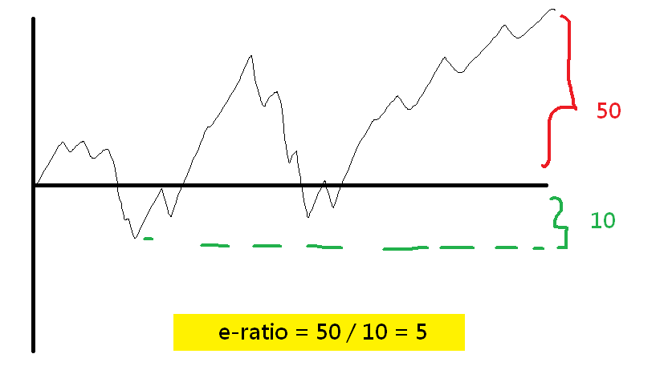
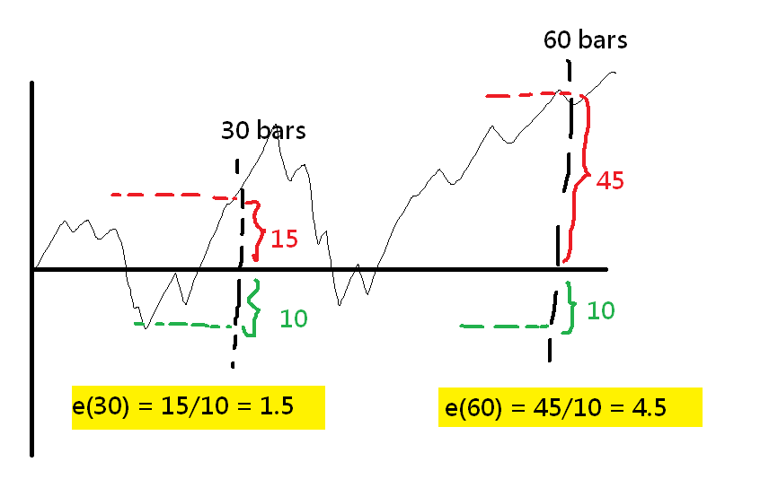

# 我談的 MAE/MFE 與〈海龜投資法則〉的差異

出處：https://www.maemfe.org/2020/01/analyzing-mae-mfe-from-the-time-axis.html

### 我談的 MAE/MFE 與〈海龜投資法則〉的差異

我在 PTT 和人分享 MAE/MFE 的概念的時候，一位網友就和我發想：

我其實非常高興，他在看完我的影片之後，就自發性地想到這個點

也就是說不從價格面（Y 軸）分析 MAE, MFE ，而是從（X 軸）時間面來分析

沒錯，從時間面來分析，正巧就是**《[海龜投資法則](https://www.books.com.tw/products/0010384228)》**一書中

談到的 **優勢比率（Edge Ratio）**！ 

也有人稱呼 Edge Ratio 叫做 e-ratio 或 E 比率

**優勢比率**

在書中作者提出一種評估策略好壞的參考，就是從進場之後 t 個時間單位後的 MAE, MFE

透過計算 MFE 除以 MAE 的值，可以得到 e-ratio

 ](https://imgur.com/APLnQoJ.png)

除此之外，我們還可以計算進場之後不同時間點的 e-ratio ，簡寫成 **e(時間)** 的形式

你會發現，在我錄的許多影片中，我幾乎沒有提到這個時間面的處理方式

原因是時間面的處理方式，是比較進階的主題，外匯市場的波動在一個小尺度比較固定，但交易成本高

但是如果你想要更仔細去挖掘你的策略是否真的給你帶來良好的體質，或是你的交易策略本身交易次數不夠多

尤其是在更高的時間尺度（例如 H12, Daily）使用時間面的分析是很重要的

除此之外，容易受到時間點的影響的標的（例如股票、原物料）

進場時間與進場的時機，為你後續帶來的時間面的 MAE, MFE 就相對比較重要

**最後的碎碎唸**

最後我想講的事情是，我的影片的目的很大程度就是這樣

我要啟發你思考，你其實見解不會輸那些大師，你看在 PTT 很隨意

就有人能從 MAE, MFE 基本觀念，想到海龜投資法則大師的分析想法

所以說，我今天不是在給你一個確定的結論，我是要你更多的去思考

你得到的結論可能會對你有無比的幫助，甚至不輸許多高手

很多時候就是欠缺自信，大家要多加相信自己！努力去研究！不要鑽漏洞！

腳踏實地的修改交易策略和努力分析，我在這和你討論，不是很好嗎～