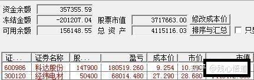
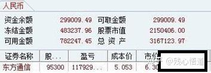

# 炒股養家乾貨合集：主貼與回帖整理

## 簡介

炒股養家

- 席位：華鑫證券有限責任公司上海茅臺路證券營業部、華鑫證券有限責任公司上海淞濱路證券營業部等
- 資金：保守估計數億
- 經歷：90 年代末入市，經歷了從短線到價值投資再回到短線的過程。2008 年開始職業投資，初期從 90 多萬虧到最低不到 40 萬；之後逐漸悟道，2010 年 5 月資金達 200 萬、9 月達 300 萬、11 月達 400 萬，2011 年 1 月達 600 萬。
- 說明：本篇以主貼與回帖節錄為主，保留原始討論脈絡，方便後續查閱與比對。

上士聞道，勤而行之；中士聞道，若存若亡；下士聞道，大笑之。不笑不足以為道。

---

## 乾貨合集

## 主貼——我如何在股市賺了 200 萬

（有沒有發現近期淘X火熱的少年高手自由炒股也起的這個標題，自由一定認真研習過養家的帖子，年少就能夠成功自有其道理的）

**原創：炒股養家 2010-05-25 00:08**

1、今天很高興參加實盤大賽的帳戶踏上了 200 萬整數關，自從職業炒股 2 年以來，扣除生活

開銷，這 200 萬全部是從股市中賺來。

2、非常感謝職業炒手、asking 等短線高手，從閩F到淘X，本人一直默默的潛水，不斷的向前輩們學習，但是從他們身上得到最多的是對於短線操作的信念，因為有了信念，才會全身心的投入。

3、發這個貼，自己作為短線職業炒股的受益者，希望也給一些準備職業炒股的人以信念，關於一些短線的操作技巧，如果有興趣的可以在以後的日子裡一起交流。

4、200 萬在實盤賽的選手裡面算不得什麼，不過這不是一個目標，這只是一個開始，asking 和職業炒手是我們的榜樣。

**原創：炒股養家 2010-05-25 00:34**

多謝龍頭戰法兄和心如止兄的油，和其他朋友的推薦，關於經驗和技巧，其實說來也挺慚愧， 雖然炒股有十多年了，但是前面的十來年基本一直在迷茫和困惑中，所以經歷也不像心如止兄這般跌宕起伏，因為有了信念，職業炒股後，全身心的投入短線操作的研究，有了一個漸悟到頓悟的過程，具體的技巧大部分還是靠自己去領悟的，操作上透過自己領悟的技巧再集百家之所長，把閩F和淘X裡的好手的手法都進行了一番學習，今天先開個貼，日後願同各位短線高手進一步交流。

**原創：炒股養家 2010-05-25 15:22（上面是答案，下面是問題）**

最重要的是信念二字，具體操作上一個是對於熱點的把握，一個是對於大盤和個股分時高低點的把握。

原帖由股海全攻略在 2010-05-25 13:04 發表發了這麼久的帖子，到底怎麼賺的還是不清楚！

**原創：炒股養家 2010-05-25 17:38**

過程可參考實盤賽，4 月中旬之前還是以把握熱點為主，之後以超跌做反彈為主。關於心態，股票做好了，能實現穩定盈利，心態也就不是問題了。

關於模式，這是一個跟隨市場的情況隨時變化的，前階段大盤下跌為主，就以低吸做超跌反彈為主了。

熱點的介入，一種是提前預判埋伏，一種是盤中追擊，隨機應變為主。倉位，讓自己覺得舒服就可以。

談不上指點，一些個人的體會。

原帖由  
ciakgb 在 2010-05-25 15:47 發表  
頂，樓主講講 50-200 的大概過程吧，抓住的幾次大機會，心態變化等等看來樓主主要做低吸的模式了，一般是嚴格隔日交易還是時間不等？  
另外熱點的介入時機一般在什麼階段？例如 482 這個票，是在上週就開始低點埋伏，還是等今天的強勢確立後再找低吸的機會？  
個人感覺熱點把握有了自己的方法，但是具體到操作目標就有了些瞻前顧後，動作變形

**原創：炒股養家 2010-05-25 23:43**

功夫未到時，你即使看了全部實盤，也不能瞭解，功夫到了，隻言片語便知。（這裡指的是

asking 講過的一句話：行情好就多做,行情不好就少做,要做就做最強,選股選大眾情人。）

原帖由  
shouwanzhe21 在 2010-05-25 22:38 發表  
請教一下 LZ：怎樣才能找到 asking 和職業炒手這些高手的實盤或階段性實盤？  
有的話麻煩給個連結，謝了。

**原創：炒股養家 2010-05-26 17:40**

魔腦兄也是我比較欣賞的短線選手，看過你的隻言片語，覺得我們的方法應該大同小異

原帖由魔腦在  
2010-05-25 21:33 發表  
（魔腦兄也是一位大神）  
兄臺的手法很穩定，回撤小，攻擊力也不弱。是我很欣賞的手法。  
油推，等你的心得。

**原創：炒股養家 2010-05-26 22:18**

1、根據不同階段有所不同，如是強勢階段，就學習鈣片兄的做最 nb 個股的主升浪，可以多拿幾天，如是弱勢階段，可以學炒手的超跌反彈方法，做反彈為主，大盤超跌的時候買超跌的股 票，大部分第二天衝高就走，不要有太多想法，如果情況出現不利，虧錢也走，如是這兩天的平 衡格局，就部分持有熱點板塊觀察變盤方向，學習先手兄的試錯，加倉，向上買，爭取順勢而為。

2、成功率有多大，我也沒有統計過，總之根據不同的市場階段的情況，選擇適合的方法，所以我的方法就是集百家之所長，壇中諸多高手的手法都為我所用。

3、在此也像這些高手們表示感謝！

原帖由股者忍心在 2010-05-26 20:58 發表多謝養家兄。  
兄的手法成功率（風報比）有多大？  
或者說是賺的時候儘量賺足，虧的時候就跑，還是就是隔日短線？

**原創：炒股養家 2010-05-29 20:00**

1、關於超跌度的把握，大盤的角度，連續下跌一段後，再出現大陰線，指數遠離 5 日線；板塊的角度，超跌的板塊在連續下跌一段後，再次出現集體性的大幅殺跌，當兩者結合的時候， 便是超跌的出擊時刻。

2、有賺錢效應的情況下，做熱點為主；有恐慌效應的情況下，做超跌為主。

3、根據市場的賺錢效應和恐慌效應來判斷大勢。

4、外圍通常隻影響開盤，因此部分情況下可以利用外圍股市做反向操作。

5、關於什麼時候能成為職業股民，資金方面，如果股市的收入能夠超過開銷即可；收益率方面，至少跑贏最優秀的公募基金和大多數私募基金；志向一定要遠大，操作務必要穩健。

以上一些個人經驗，不知對這位朋友是否有些幫助

> 原帖由 yhj1984 在 2010-05-27 00:35 發表  
> 養家兄能否多談點具體如何做強勢追擊熱點和做超跌，個人覺得尤其是超跌非常難把握，超跌的度很難把握？再能否延展開來什麼樣的大勢做強勢熱點股和什麼樣的大勢做超跌股？再展開一點，如何判斷大勢？繼續展開，外圍股市和 A 股的相互影響？嘿嘿，問題提多了一點，萬望養家兄不要嫌煩。對養家兄非常敬佩，什麼時候我也能成為職業股民啊，呵呵，羨慕！自由之精神，獨立之人格，嚮往啊！

**原創：炒股養家 2010-05-29 20:02**

超跌的品種穩住了，強勢的個股機會就大些，超跌的品種繼續創新低，強勢的個股補跌在即。

原帖由  
ciakgb 在 2010-05-27 16:04 發表  
請教個問題，強勢股票補跌情況一般是怎麼表現？是否一跟中陰甚至盤中下探就完成？ 這次被別人強勢股補跌的說法忽悠到了，錯失稀有資源一波行情  
謝謝！

**原創：炒股養家 2010-05-31 21:13**

1、我追求不斷穩定的盈利，不確定時，採取偏保守的策略，儘量規避大的回撤，所以平時以小陰小陽為主，

2、偶爾出現確定性較高的機會時，也會奮力出擊，博取大陽，

3、操作模式決定市值曲線，讓自己覺得舒服就好。

原帖由學前街在 2010-05-26 07:38 發表進攻、防守、倉控都很好。  
倉位，隨市、隨勢而變，  
小陰、小陽，盤整，偶爾有幾個大陽，一路上升，市值曲線是個超級大牛股。 很有錢途。

**原創：炒股養家 2010-07-17 00:23**

技巧性的東西，asking 和炒手基本都說了，我能反覆強調的就是信念二字。

原帖由按圖索驥在 2010-07-16 23:43 發表這位兄臺怎麼不說話了？

**原創：炒股養家 2010-07-17 10:10**

炒股也有十幾年了，相對穩定盈利也就是這一年多

原帖由風雲雷電在  
2010-07-17 07:59 發表  
冒味問一下， 炒股養家兄是什麼時候開始炒股的，用了多久才達到穩定賺錢。

**原創：炒股養家 2010-07-17 10:12**

最早是做短線的，後來又搞價值投資，後來又搞回短線，不是反對其他方法，只是目前我們的市場比較適合短線

原帖由真誠在  
2010-07-17 09:27 發表  
順便問一下：樓主專門做短線有多長時間？

**原創：炒股養家 2010-07-17 19:28**

我覺得現在的職業炒股，好比 80 年代的下海，當時很多人對於下海也不置可否，結果很多人成為萬元戶，當然也可能被淹死，能不能成功，是很多因素共同構成的。現在的職業炒股，同樣面臨這樣的問題，肯定會有很多人成就千萬、億萬身家，當然也可能失敗，能不能成功，也是諸多因素。就個人而言，當時決定辭職也是有較大風險的，因為以現在的角度看，好比跳下水的時候還沒有學好游泳，但是在嗆水的過程中，透過不斷的學習，也學會了一些適合自己的方法。

這是一場賭博，沒有人能告訴你是不是一定會成功，就看你自己覺得是不是值得。

原帖由為自由而戰在  
2010-07-17 10:58 發表  
炒股養家,兄好。本人炒股 9 年了，由於資金少，所以這些年小打小鬧學技術練技術（上班一族），這麼  
長的時間虧損不過  
3 萬元，我權當這些是學費。現在覺得技術已經穩定下來了，心態也穩定了。目前  
40  
歲的我想辭職作職業炒股，這一天我盼了快  
10 年了。可惜家裡人不支援，我無語凝囈，我不求什麼，只求隨己心願炒股養家而已，甚至養家也不是我的真實目的，只想隨己心性，自由自在，寂寂無為。現在我很茫然 ，望兄能指點

**原創：炒股養家 2010-07-17 19:42**

1、友利的一字板，只要提前掛都會買到，但是這樣的操作通常也帶有較大的風險，問題在於如何度量收益和風險，這裡是需要些經驗和對市場充分的理解。

2、我的操作裡面含有很多的試錯單，這些單子的結果大多是小贏小虧，到底是賺是虧不重要， 重要的是在於我能借此感受到市場的情緒，從而判斷收益和風險，以決定是否奮力一擊，那才是關鍵。就好比拳擊的時候很多的刺拳是為了試探對手，這些刺拳有沒有打中不重要，重要的是借這個試探判斷何時該出重拳，那才是關鍵。至於大盤是如何看的，個人而言是反對預測的， 即便心中有預測也是為了應變做準備。

原帖由先勝而後求戰在 2010-07-17 17:10 發表  
兄在 7.15 日那天還是有多單買入，但當時大盤看起來風險極大，兄是如何決策的呢，兄對當天的大盤是如何看的，盼回覆，感謝！

**原創：炒股養家 2010-08-20 22:18**

追求技術的量化，曾經讓我大量的時間鑽這個牛角尖，還是有太多的人執迷於此，炒股若是這樣可行的話，那些基金經理們應該比炒手們更有優勢了。（市場理解力和技術手法，一個內功一個外功，沒有內功，強練外功，容易走火入魔）

原帖由天地英豪在 2010-08-20 02:49 發表沒看到一點技術含量的說法，  
多是誇誇其談的假話。  
一種技術，如果不能量化， 純粹是屁話，蒙人的話， 然後可以隨便解釋。  
下面的話，全是空話，  
有點腦子的人都會說。  
大盤超跌，板塊超跌，買啊？  
俺考，這是人話嗎？  
老子也說，高拋低吸必能賺錢。哈

**原創：炒股養家 2010-08-20 22:28**

1、關於倉位，有好機會就重點搞，沒有好機會就拿著錢耐心等待或者輕倉練盤感，總之讓自己覺得舒服就可以了。

2、關於止損、止盈，目前我的操作中不考慮這兩件事情，買入機會，賣出風險，何必用止損止盈來束縛自己。

3、教條主義真是害人不淺啊.

原帖由天地英豪在 2010-08-20 02:59 發表是全倉殺入還是分幾倉殺入？  
如果全倉殺入？虧多少止損。賺多少止盈？  
如果是分倉殺入，分幾倉？第一倉虧多少的時候加二或者三倉？

**原創：炒股養家 2010-08-20 22:49**

1、成交量，主要是看成交量的變化。

2、追板，主要看市場環境、熱點。

3、成交量再結合價格的變化，揣摩場內和場外人心的變化

原帖由 mgarden 在 2010-08-20 22:26 發表  
成交量具體怎麼看？另外對於追板，樓主有什麼心得嗎？漲停板與成交量結合可以對於後面的走勢有所揭示嗎？

**原創：炒股養家 2010-08-20 23:10**

雖然付出的時間肯定比打工時花在工作上的時間多，但是是自己愛好的東西，就不覺得累。而且從心裡狀態來說，比起工作的時候，更是覺得輕鬆、自由多了，錢也賺的多了，還充滿著夢想。

**原創：炒股養家 2010-08-22 08:19**

雖然賺的部分，做的不錯，但是今年 1 月到 7 月虧損 50%，這對於短線選手來說是無法容忍的，說明你的模式中存在很大的問題，這樣的話大大的影響了整體收益率。

個人而言，喜歡的模式是重點把握好的機會，輕倉試驗普通的機會，規避大盤下跌的風險，從這個角度，整體收益率的曲線應該是穩步向上的。

原帖由 qd986 在 2010-08-21 23:06 發表  
請教你個問題，我也努力學習了  
3 年，看了很多書，很多高手的帖子。09 年我的短線帳戶漲了 60%,今年從 1 月到 7 月 2 號這個帳戶又虧了  
50%，從 7 月 2 號到現在，我把這個帳戶又翻了一倍。高手感覺我現在處在一個什麼階段的水平

## 主貼——科達股份後面還有 5 個漲停

**原創：炒股養家 2010-11-09 17:49**

1、市場環境：既然是牛市，就會有超出預期的熱點龍頭。

2、資金面：稀土資源的資金，需要查詢新的方向。

3、基本面：知名券商廣發說，價值 16-17 元，目標價 16 元。

4、人氣：股神 asking 今天買入

天時地利人和，接下來就是見證奇蹟的時刻，區別是直接拉到位，還是洗一下在拉。

**原創：炒股養家 2010-11-09 21:42**

我的風格是穩健型的，追求確定性高的操作。

操作模式上是集百家之所長，目前位置買入科達股份，看似瘋狂，但個人以為在目前的市場狀況下，卻是確定性較高的操作。

原帖由貝式弧線在 2010-11-09 19:08 發表  
不像炒股養家的風格

**原創：炒股養家 2010-11-09 21:46**

我們這個市場，有大量的短線客，做短線的想的都是要做龍頭，只要被市場確定為龍頭，賣給誰就不再是問題，相反問題變成要買的人很多，籌碼有限，所以就造成連續漲停的結果。

原帖由骨仙在 2010-11-09 18:35 發表買了一半成交量，明天賣給誰？

**原創：炒股養家 2010-11-09 21:52**

個人覺得徐鎖倉未必是好事，賣出未必是壞事。

如果鎖倉，雖然容易走成縮量板，由於其他遊資忌憚徐的出貨，容易造成高位震盪，

如果徐先賣出，盤面上先洗一下，則後面的遊資會有較大的熱情做第二波，後面的拉昇到反而輕鬆。

原帖由兔十哥在 2010-11-09 18:48 發表徐明天肯定鎖倉，參考新希望。  
買二不知是誰，徐的分倉？

**原創：炒股養家 2010-11-09 22:14**

關於長線和短線，我不否認長線的賺錢模式，但是在當前的 a 股市場中，短線模式確實是效率較高的一種，百萬實盤賽中眾多的好手就是最好的證明，其複利的增長速度讓很多投資者難以相信。

**原創：炒股養家 2010-11-10 20:29**

原帖由希望工程  
1976 在 2010-11-09 21:59 發表  
我和別人爭論長線和短線收益時，就拿出您的帖子，不到半年 50%的收益率，還是在大盤震盪的前提下， 他們就啞口無言了。佩服！

1、昨天買入的前三佔了約 4 成，今天悉數賣出，造成今天的洗盤走勢，作為 igbt 題材龍頭， 後市遊資少了忌憚，衝擊願望會有所加強。

2、廣發 16 元的目標評級給予場內客較高的預期，部分會進行鎖倉，同時也給予在下跌時低吸的勇氣。

3、後市預期會在市場合力的引導下繼續推升，近日內或又可看到漲停。

**原創：炒股養家 2010-11-13 08:39**

其實我的看法沒有大的變化，從整個市場的主線來看，主流熱點不外乎新興產業和資源類，那麼具體來看：

1、資源類的一是稀土等國家政策的支援，二是外圍期貨的上漲，現在外圍期貨出現大陰走勢， 資源類的炒作底氣就會受到影響，部分中線盤的籌碼鬆動也是正常的，除非期貨後市又創新高， 但是這個相對是不確定的。

2、新興產業是跨年度的主線，今年以來大部分牛股都來自這裡，今天這樣的大陰線下，漲停的新大陸、浙江陽光、維科精華都是在這條主線下，即使太原剛玉、961 等炒的稀土本質也是新興產業。

3、可以預期，大盤下跌以後，未來能夠起來的品種還會在這個圈子裡面，科達股份未必是最好的，但是至少也是好的選擇之一，低價、小盤、價格遠低於券商估值，這些優勢還在。

原帖由 zfl581 在 2010-11-12 14:11 發表養家兄來說句話吧,你的看法比較全面;

**原創：炒股養家 2010-11-14 21:26**

1、從風險的角度，由於突如其來的大陰線，整個市場短期會變的相對謹慎，科達股份還沒有走完主升的時候，被大盤大陰線阻礙，短期可能有所震盪。

2、從機會的角度，大陰線後，短線資金部分短暫撤離，但是一旦企穩後，又會重新回來，那麼他們最有可能選擇的標的是什麼？通常情況下，往往還是主流品種的機會大些，目前不外乎資源和新興產業，像新大陸這樣的只要有點訊息刺激還能逆勢漲停，就說明資金對此的認可， 科達股份這樣的低價小盤龍頭品種，本來主升就沒有走完，一旦有遊資重新衝擊，相對更容易獲得資金的響應。

原帖由 kwokh  
在 2010-11-14 17:04 發表  
樓主的意思是不是基本放棄了還有 5 個漲停的判斷？

## 主貼——我如何在股市賺了 400 萬

**原創：炒股養家 2010-11-17 17:12**

大盤弱勢，更須堅定短線炒股的信念

**原創：炒股養家 2010-11-17 19:24**

1、發那個貼，雖然有些誇張，但是把時間倒退 1 周，當時市場處於極度的瘋狂中，科達股份當時的情況，在我看來就是一次確定性非常好的機會，後來的一週，大盤跌的一塌糊塗，即便如此，科達今天的價格仍然在我當時發帖的附近，並且期間還有一個漲停，另外我目前仍然重倉持有這個，說明我到現在還是看好，我只是表達我的觀點，有人能一起賺錢更好。

2、招會員的事情，我沒這閒心，這裡有人是我的會員嗎？

原帖由彪義丞在 2010-11-17 19:01 發表  
不像以前的炒股養家了  
要招會員了？

**原創：炒股養家 2010-11-17 23:09**

現在不再參加實盤賽，但是這個整點打卡還會保留，留待以後看看自己成長的軌跡。

理念的東西，簡單說就是把握市場熱點，實際操作中，預判、試錯、確認、加倉等，不過我始終覺得此地高人甚多，不是我來多講什麼，如果有興趣的朋友可以跟帖提問，有空的話，我儘量回答我的觀點。

原帖由快樂有多遠在  
2010-11-17 20:39 發表  
養家兄 還是像  
200 萬那個帖子 多傳授些實際理念好點  
300 萬那個 什麼都沒講 不像你的風格

**原創：炒股養家 2010-11-17 23:14**

最艱苦的是第一個百萬，10 多年的迷茫與摸索，如果早幾年有人發類似的帖子，讓我堅定信念，現在應該已經走的更遠，可惜時間已經不能倒流，我的經驗很多也是虧出來的。（正因為有了養家、瑞鶴仙等前輩們的發帖，極大降低了後輩們試錯的時間成本，再加上某些後輩自身的勤奮努力，成長所花的時間越來越短）

原帖由 wang3704522 在 2010-11-17  
17:36 發表  
牛逼，200 萬到 300 萬，花了  
4 個月，300 萬到 400 萬，花了 1 個半月，估計 400  
萬到 500 萬，這個月底就能到了

**原創：炒股養家 2010-11-17 23:18**

不過還是要感謝 asking 和炒手他們，使他們讓我在研究了 10 年價值投資後，才知道原來中國股市要這樣炒的，不然的話，現在可能還在迷茫中。

**原創：炒股養家 2010-11-17 23:37**

1、短的一兩日，長一點的話 5-10 天也有

2、試錯對映的是預判，預判不成立，就走，預判確認再加倉，和下跌多少無關，和判斷的動態變化過程有關。

原帖由mgarden 在 2010-11-17 23:26 發表  
樓主短線一般持有多久？試錯的話，下跌多少算作是錯呢,或者還有別的什麼標準？

**原創：炒股養家 2010-11-18 12:53**

1、關於熱點，有長期的主流，也有短期的支流，長期的主流能持續，可以反覆做，短期的支流，爆發力強，都有可操作性。

2、具體技術的東西，個人不怎麼注重，雖然做的是短線，但是看的是更大的局。

3、止損，不看好了就賣出，管他是不是止損。

原帖由zhouyuwei128 在 2010-11-18 12:22 發表  
“理念的東西，簡單說就是把握市場熱點，實際操作中，預判、試錯、確認、加倉等，不過我始終覺得 此地高人甚多，不是我來多講什麼，如果有興趣的朋友可以跟帖提問，有空的話，我儘量回答我的觀點。”  
針對以上的你的一些技術，我有一些觀點和問題：  
1\. 把握市場熱點板塊，然後找市場龍頭一直是我信奉的觀點。但是對於龍頭板塊的拿捏是個經驗活，得看你對市場的嗅覺能力到底如何。就好比前期的迪斯尼版塊週末漲了兩天，浦東建設和陸家嘴領漲，自認為會成為龍頭。但是到了第二週初就開始滯漲並且隨著大盤大幅下跌一起下跌，反而又開始補跌了。。。  
所以對於熱點板塊初現你嗅覺靈敏是好事，但是如果該板塊的形成胎死腹中，那就沒有意義了；同時很多人發現熱點真的能起來的時候很多票都已近高了反而被動,只能吃到魚身子或者買了就大陰倒灌然後是未知的盤整期。 ... 不知道你怎麼看。

2\. 預判還是很需要技巧的，什麼位置能建倉，加倉，止損等等。每個人都需要根據自己的風格來建立一 套自己的股票作業系統來首先規避自己的風險其次賺錢，我現在貼出自己的系統，拋磚引玉吧：  
相對激進的抓漲停，但只適用於大盤上攻趨勢形成：  
1。 跳空炮彈漲停票（就是跳空光頭陽線），但是量能比前一天縮小的追進 （掃描漲停股）  
2\. 跳空過前期長期壓力位  
保守型打法  
2.找至少 4 天斜面連續推高的小陽票，且屬於初漲的票，斜面上縮量回檔 5 日線後買入  
3.找下跌回檔的票，回檔 20 日線縮量的票買入比較保險  
止損:  
破 5 日線減一半, 破 20 日線清倉  
希望各位能給出自己的一些好的實際操作理念

**原創：炒股養家 2010-11-18 17:29**

以前比較講究，現在比較隨意，就幾百萬，滿倉和空倉都是幾分鐘的事情，有機會就上，覺得風險大就撤

原帖由 kanba 在 2010-11-18 14:24 發表炒股養家兄;  
能講講你的資金管理嗎/，分散還是集中，倉位的配比，手中的現金比率等等。。。。

**原創：炒股養家 2010-11-18 18:05**

和買入是一樣的，先預判減倉，再確認賣出。

預期也是動態的變化過程，要結合大盤和整個市場狀況。

原帖由  
invest 在 2010-11-18 18:01 發表  
請問養家兄，短線賣點你如何把握？是看分時圖形？還是根據心中對個股的預期來？能展開談談嗎？謝 謝。

**原創：炒股養家 2010-11-19 20:15**

1、反彈之前，我不確定誰是反彈的龍頭，但是相對來說新興產業的機會大些，這是跨年度的 主流，不管是誰先走出來，科達股份作為曾經的分支龍頭，都有跟隨衝擊的機會，實際情況來看， 這兩天先走出來的是觸控式螢幕，科達股份也有所呼應。

2、所謂動態的判斷，和技術這類關係不大，以這兩天來說，觸控式螢幕為主賺錢效應明顯，那麼盤中即可作出判斷及時介入，但是大盤下跌之前是很難預判的，這便是盤中動態的判斷過程。

原帖由 gl 斌在 2010-11-19 18:08 發表  
養家兄好，有個問題問下。986 前幾天你說要衝擊前高，這是怎麼看出來的？ 原帖由 oldyoung 在 2010-11-19 19:07 發表  
判斷的動態變化過程  
這個主要靠什麼？盤感還是技術比如成交量、macd 啥的？

**原創：炒股養家 2010-11-19 20:42**

大方向的問題，或許就是 asking 說的一張紙的意思，懂了就懂了，不懂的多說也無用，用我的話說，就是做的是短線，但是看的是更大的局。（asking 的這張紙前面備註過了）

原帖由 gl 斌在  
2010-11-19 20:38 發表  
1、反彈之前，我不確定誰是反彈的龍頭，但是相對來說新興產業的機會大些，這是跨年度的主流，不管  
是誰先走出來，科達股份作為曾經的分支龍頭，都有跟隨衝擊的機會，實際情況來看，這兩天先走出來的是觸控式螢幕，科達股份也有所呼應。  
養家兄好  
這個是大方向，主要是想知道從資金上能看出來嗎？（郵資為什麼要反覆的做他，就好比你做  
T 一樣））

**原創：炒股養家 2010-11-20 21:29**

通常情況下，在下跌過程中，操作可採用兩種模式

1、超跌反彈模式，選擇標的通常為超跌品種，就是近期的稀土為主的資源類，難點在於時機的把握，過早介入容易吃套，所以原則上寧願慢三分錯過，並且注意倉位的控制，反彈後快進快出。

2、有新的高強度熱點的繼續做主升品種，此輪為例，觸控式螢幕強度較高，有一定的可操作性， 因此可以放棄超跌模式，而直接進行攻擊性的熱點操作，難點在於熱點的判斷，一旦判斷錯誤， 形成補跌，損失也會較大。

3、目前的情況看，有色的一輪反彈已經完成，而新熱點強度較高，應該及時換入新熱點勝算更大。

原帖由 geqianjun 在 2010-11-20 10:39 發表炒股養家兄，有個問題想請教一下。  
像這種的大盤反彈，我覺得空倉的是應該介入新的熱點。  
但如果持倉是跌幅大的（比如有色），這個時候是繼續持股呢還是換倉？  
我自己目前就是持股有色，套了有６，７個點，導致收益在反彈的時候很差。

**原創：炒股養家 2010-11-20 21:41**

往大了說是綜合素質，什麼都要知道點，但是實際上到後來，什麼技術啊，基本面的都不重要， 到了那個階段，k 線看一眼，就決定操作了。

原帖由  
stianying88 在 2010-11-20 17:49 發表  
咱小散能不能學點皮毛，基礎功在哪裡？技術素養哪些要學習。

**原創：炒股養家 2010-11-20 21:56**

通常情況下，直接追龍頭，或者買漲幅不大的有潛力的都可以，具體看你的判斷了，不過下週才開始追，至少你的反應已經慢了一拍了，風險自然也相應加大。

原帖由 nahaehc 在 2010-11-20 21:43 發表炒股養家兄，想問一個買點的問題  
像這次的觸控式螢幕板塊，2106，2289，3088 漲幅已經很大，如果想下週介入該如何查詢買點，是繼續漲停追嗎？  
謝謝！

**原創：炒股養家 2010-11-20 23:03**

1、心態問題，我只能說，情緒是情緒，操作是操作，獲利兌現和恐懼虧損是人的天性，但是 作為職業投資應該克服，迫切也好恐懼也好，操作該怎麼還是怎麼，如果讓情緒影響了操作， 便不該了，你說的這兩種到還好些，我覺得其中最大的忌諱就是虧錢了就急於翻本，亂操作一氣， 容易錯上加錯，後果嚴重。

2、以你舉例的兩個操作來說，我覺得沒有什麼大的問題，當時有色整體下跌嚴重，961 雖然還能漲停，屬於個案，操作不具有代表性，而 152 的逆勢上漲沒有板塊效應，這種個股行為也不具有代表性，考慮到系統性風險，及時賣出時對的，事後的補跌也是慘烈的，倒是如果因為你這兩個賣的好了，以後行情走壞的時候手中持股還有所期待，反而可能錯失出逃機會，造成大的損失。

原創: 黃洋界 2010-11-20 22:27  
再一個，有獲利就急於兌現，這個心態特別迫切；而且，恐懼虧損，有時明明知道沉住氣，忍住一時半會就會有利潤，但控制不住，保本或微虧都出，臭透了。比如上週四板上  
19.33 打的 961，，雖然看週五當天早上上海期貨幾乎全線跌停，但有色龍頭怎麼也會有衝高，還是怕了開盤 19.37 出；再比如上週五板上 8.16 上的 152，指數暴跌還一直封板，應該很強，到了本週一，看集合競價這麼弱，8.17 就跑。961 和 152 收盤都板，錯過了很大一筆利潤，心態真差。  
如何克服，向兄求教。

**原創：炒股養家 2010-11-24 17:24**

這個我以前在帖子中講過，我沒有止損這個概念，不看好了賣出就是了，3%這樣的過於教條。

原帖由熊市看空在  
2010-11-24 14:47 發表  
請問養家兄設止損線嗎？這輪行情以來，自己都是由於眼睜睜的看著一步一步的下跌，最終導致虧損擴 大後，忍痛割肉的。  
我現在想完善一下系統，加一個 3%的止損線，請養家兄多講講這塊的經驗。

**原創：炒股養家 2010-11-24 23:15**

我倒也不反對長線和價值投資，效率的問題，目前國內股市比較適合短線，你說的朋友的兩招， 第一招，2000 點多少年才一次，青春有限等不急啊，第二招，普通小老百姓沒有啥內幕訊息， 不過也好，賺的錢安心。

做短線的，這波調整中觸控式螢幕和抗癌中機會多多，幾乎感覺不到大盤的下跌，當然關鍵是要能及時把握這些熱點。

原帖由 famis  
在 2010-11-24 23:00 發表  
恩,從價值投資改短炒了,看來市場裡賺錢的方式真是不少,各取所需,不錯,頂 LZ.  
有意思的是,我有個朋友,在券商幹了十多年了,還時不時給客戶做個報告什麼的,幾年前從短炒改價值投資了,呵呵,剛好和 LZ 反著做.他跟我說,看技術圖表短炒那活成不了大事,錢來的快去的也快.要在中國的股市裡活下來很簡單,就兩招:一招是在市盈率極低的時候比如 2000 點時買入好公司的股票,市盈率過高時絕不入場相反還減持,平時一年交易不了一次;還有一招就是旁門左道了,就是有內幕,不管是基本面還是資金面 的,只要比普通散戶早 3  
分鐘到 3 天,你就有戲.這娃娃把這風馬牛不及的兩招給結合起來猛用,以第一招為主,簡直不得了.  
我看了看身邊的比較成功的其他朋友,深以為然,都不出這兩招的範圍. 可是人性決定了第一招很少人能堅持住,第二招,很少人有這個門道.就是有了,結果也是對半,有內幕也不見得能盈利最後,以前有內幕的倒下莊家還少了? 至於普通的投資者,就是賭場裡來往不絕的賭客,不是給莊家送錢就是給其他出老千的賭客送錢.

**原創：炒股養家 2010-11-27 18:55**

1、9:30 買股，前一天封死漲停買不到的龍頭品種，或者利好訊息刺激的品種，前一種需要對熱點的持續性有判斷，後一種需要對訊息敏感。

2、尾盤買股，預期熱點第二天持續的品種，需要對熱點的持續性有判斷。

3、如何提高成功率？做的是短線，看的是更大的局。

原帖由自由王國在 2010-11-27 18:07 發表 首先感謝養家兄發這樣的帖子讓我等受益匪淺。有幾個問題向養家兄請教：  
1、早盤利用集合競價查詢強勢股，於 9：30 買入時要注意什麼才能提高成功率？  
2、下午 2 點之後至尾盤買入的個股，希望第二天上午延續衝高慣性獲利出局，這樣的個股有什麼特點？  
尾盤買的時候要注意什麼才能提高成功率？

**原創：炒股養家 2010-11-27 20:15**

1、更大的局，簡單說，就是一個股票 10 元買的時候，看的應該是 15 或者 20 元甚至更高， 實際操作中，可能賺了三五個點就走了，或者割肉走了。

2、具體技術的東西我不太關心

原帖由自由王國在  
2010-11-27 20:05 發表  
養家兄，您說的更大的局是指什麼？是指操作週期以上更大的週期？還是上升趨勢的延續？  
開盤前選股，對於近期首次放量的個股今日能夠保持強勢，量比多大合適？尾盤買進的股換手率多少為 宜？

**原創：炒股養家 2010-11-27 20:26**

1、已經賣出了，賺我該賺的就可以了，有時候賣出未必不看好，只是有更好的品種。

2、做短線追求的是買入後短期就能爆發上漲的品種，經緯電材最近的漲停前有 5 個交易日的整理，而這期間市場機會較多。

3、目前已經換成認為後市有 50%以上漲空間的品種。

原帖由希望工程 1976 在 2010-11-27 20:17 發表養家兄，300120 是什麼題材？您還持有嗎？

**原創：炒股養家 2010-11-27 21:09**

熱點、政策、人氣、。。。多因素的集合

原帖由  
zhanbiqiang 在 2010-11-27 20:58 發表  
養兄好，經常看您的帖子，很受教，謝謝！請教您上漲空間是根據什麼判斷的？

**原創：炒股養家 2010-11-27 22:33**

1、在指數高位迷戀價值投資，越跌越買，結果遭遇暴跌，最後損失慘重。

2、在短線初級階段迷戀技術，經常買突破新高的股，結果賺麼賺點小錢，碰到幾個假突破就虧大了。（沒有市場理解力，沒有內功，只迷戀浮於表面的技術終究不行）

原帖由阿古在  
2010-11-27 21:21 發表  
炒股兄,想聽聽你捅破窗戶紙之前,也就是十年摸索階段,經常會犯哪些錯誤,印象最深的有嗎

**原創：炒股養家 2010-11-27 22:44**

原來是把簡單的變複雜，現在是把複雜的變簡單。

股市帶給我的一方面是自由的生活，不斷豐富的物質，另一方面就是技術水平不斷提高後思想境界的昇華。

原帖由  
HYG7517 在 2010-11-27 22:03 發表  
感覺養家兄操作上與原來相比有些更上一層樓的變化，視野更開。

**原創：炒股養家 2010-11-27 23:28**

1、擺脫教條主義的束縛，實踐才是檢驗真理的唯一標準，多思考和總結自己成功例子的共性和失敗例子的共性，成功的例子裡面再思考能不能更早一點下手，未必要等突破以後。

2、突破買入雖然也不失為一種不錯的方法，但是還處在見招拆招的階段，如果你能看到更大的局，應該追求未出招已應招的境界。

原帖由臨涯羨漁在  
2010-11-27 23:03 發表  
啊哦，我屬於第二種，一直覺得突破新高（其實應該是突破壓力位更好）是好買點，養家兄這個說法顛 覆了我的經驗  
迷惑中，很想知道養家兄大致的操作思路，除了突破，還有更好的介入時機？

## 主貼——我如何在股市賺了 500 萬

**原創：炒股養家 2010-11-29 11:25**

甲流超菌萬口傳，萊茵聯環不新鮮，抗癌待有強牛出，各領風騷數十天。

**原創：炒股養家 2010-11-29 17:45**

1、操作應簡單化，你的字裡行間透露出你想法太多，臨盤難免猶豫，另外有太重的成本障礙， 這些都於操作不利。

2、先克服心理障礙，之後多操作，多思考，機率會告訴你以後應該怎麼做，如果不能克服心理障礙，再多的失敗也不能轉化為經驗。

原帖由鐵馬秋風在  
2010-11-29 12:06 發表  
繼續學習，有個問題想謫教養兄，懇謫回覆！問題是這樣的，當你在摸索階段時，你有沒有發生以下類似似情況？你是如何處理的？  
當買入一個股票時，原先由於自己的判斷和對盤面量能變化很有把握，所以順勢加倉，但有一天發現橫著不動了，希望自己能夠快速獲利瞭解，但是堅信有買點會出現，但到了好的買點出現後自己又無法看盤而錯過，手中的頭寸發生垂直打擊，盈利變成虧損，也就是次曰跌停，作為一個有一定市場經驗的人來汫，一般會透過反彈走人，但是市場卻不給機會，遲遲不反彈，遇到這種情況，你是如何處的？萬分感謝

**原創：炒股養家 2010-11-30 09:07**

不要光盯著我的帳戶，看我的操作理念，看帳戶，我都不信這樣的增長速度，看理念，如果你有好的理念，賺再多都沒什麼好奇怪的。

以前我也不信 asking 是億萬身家的，後來領會了他的隻言片語，恍然大悟，只恨看到的太晚。

原帖由圓圓滿滿在 2010-11-30 07:28 發表以前我還相信炒股養家  
現在不得不懷疑了，在這種市況下還敢於滿倉，而且恰巧你拿的股猛漲！

**原創：炒股養家 2010-11-30 23:20**

行情好，多做，行情不好，多休息，選股大眾情人（這句話養家提過三次了，重要性大家可以自己揣摩。而且這句話趙老哥也曾說過，原話是“別打亂七八糟的東西 呵呵 要玩大眾情人”）

原帖由先勝而後求戰在 2010-11-30 23:17 發表  
養家兄來了，呵呵，兄能否談談不知道 asking 兄觸醒你的隻言片語是哪些話？

**原創：炒股養家 2010-12-01 17:17**

1、預判 買入

2、確認加倉

3、熱點轉換 換股

4、不再看好 賣出

操作還是一樣，和套幾個點沒有關係，如果你還是看好，那就等等，不看好就賣出或者換股。

原帖由人在江在  
2010-12-01 12:57 發表  
冒昧問句。萬一發現買錯怎辦，當天套 4 個點，第二天又低開 4-5 點，如何處理？

**原創：炒股養家 2010-12-01 17:38**

因為簡單，所以果斷，最忌自己都不看好了，只是因為套了幾個點，還在猶豫。

原帖由小不在 2010-12-01 17:31 發表簡單明瞭。

**原創：炒股養家2010-12-01 23:39**

1、多看漲幅榜和異動榜的共性

2、倉位和風險收益比有關，機會越大倉位越高，風險越大倉位越低

原帖由若瑜在 2010-12-01 23:31 發表請問炒股養家兄，我想請教兩個問題。  
一個是，熱點如何能第一時間發現並且判斷？  
第二是，關於倉位問題。用多少倉位這個是以什麼為標準呢。 這兩點一直在琢磨，沒什麼好的方法。

**原創：炒股養家 2010-12-03 21:48**

大盤與個股是相輔相成的，大盤不看好的情況下，注重的是風險，有高強度的板塊的情況下， 注重的是機會，如果既不看好大盤，又沒有熱點，就多休息吧，如果有強熱點，則仍可參與操作， 這輪調整以來，觸控式螢幕和抗癌概念即是，相對來說我更看重熱點。

原帖由來到人間在  
2010-12-03 15:55 發表  
養家兄弟請教個問題，是大盤和個股的問題，你在不看好大盤的情況下會不會繼續操作

**原創：炒股養家 2010-12-03 22:33**

1 萬

原帖由有恆無益在  
2010-12-03 17:26 發表  
樓主，你穩定盈利前投入本金是多少？讓我堅信超短的信念啊

**原創：炒股養家 2010-12-04 11:29**

我喜歡用更大的局來看待合力，352 和 2135 這樣的更多的是個股行為，本身具有較大的不確定性，我也不好做出判斷。

636 與 160 同一概念，上衝過程中，160 已經開始拖累，出現這樣的狀況，及時賣出規避風險是合理的，除非你對這個局有較大的預判。

原帖由戚九在  
2010-12-04 10:29 發表  
實盤中,發現市場合力有一個由形成到最大,然後衰竭的大致過程,  
近期的幾個票如352,636 都是合力形成中沒下單,加大後下單反而衰竭的情況出現.002135 也在週五出現了衰竭,週四的打板是相當的漂亮,籌碼穩定.  
由此有一問請教養家兄,如果買點提前,於合力形成中就介入,但因為合力形成也會有中途夭折的情況出現, 如何規避此種風險?或者說如何判斷第二天的合力是否會加大或者持續?

**原創：炒股養家 2010-12-04 17:17**

1、認同這個觀點，我認為衡量一個職業選手最重要的指標就是盈利的穩定性，你的狀況在短線選手中具有普遍性，如何減少回落幅度應該是未來重點考慮的問題，11 月開始明顯行情偏弱，應該注意控制風險，如果有較大的回落說明你需要注重弱勢階段的風險控制。

2、以月度來說，儘量爭取 1 年中 10 個月以上的盈利，就本人而言如果我沒記錯的話，去年到現在，只有去年因為特停造成過一次單月虧損，今年到現在所有的月份全部實現盈利，正是因為這種穩定性，才是我資金不斷增長的根本，對此我非常注重。

（控制回撤是職業選手第一要務,複利是世界第八大奇蹟)

原帖由有恆無益在 2010-12-04 11:49 發表  
我感覺只有賺的錢是自己明明白白看的懂了才是真到賺到手了，不然還得還回去，我  
10 月雖然賺了 45%， 但 11 回去了好多啊，只有不管行情好壞，資金能不斷創新高了，我覺得才是可以加大投資的時候了，不知對不對，我在 養家兄的貼裡班門弄斧了。

**原創：炒股養家 2010-12-04 17:23**

這個局，是個綜合因素，政策面、技術面、基本面、資金面、人氣面。。。等集合與一身是形成的共振。

原帖由簡簡單單在  
2010-12-04 13:14 發表  
養家兄說的局我的理解是對爆發性板塊題材背後基本面的理解。就此理解合力形成的是否強大。比如：  
1、2166 時的甲流爆發的基本面  
2、2190 時的新能源汽車鋰電的基本面  
3、259 時的稀土行業的基本面養家兄是否這樣？

**原創：炒股養家 2010-12-05 09:25**

5 天線兄，剛參賽時我也注意過你，兄也是高手啊，正常 8 位數的話應該就是明年的事情了， 看誰先到了，到時喊一聲，共同成長也是一種緣分。

原帖由 5 天線在 2010-12-04 19:49 發表  
呵呵，有幸跟炒股養家兄在三、四、五屆職業炒手杯同臺競技，因為與兄初始資金比較接近，在後兩屆比賽中一直把兄當作追趕的目標，雖然很湊巧跟兄在同一天收盤市值突破 500 萬，但看了本帖後面兄的一些操作和回覆，感覺自己在眼光理念、臨場反應上面跟兄還是差了一截，打心眼裡佩服兄進步神速， 以兄現在的境界，我想追上是很難了，期望能不被落太遠就行！\*\_\*  
祝兄早日能突破 8 位數大關！^\_^

**原創：炒股養家 2010-12-05 22:19**

1、政策面相對是獨立，市場會相對圍繞政策反覆炒作，這是中國股市的特色。

2、人氣面也是一個迴圈的過程，這個和市場的賺錢效應有關，股神遍地的時候就是人氣最旺的時候，顯然目前當下不是。

3、不知道上漲原因的股票要麼就找他上漲的原因，找不到就不用管它，賺自己看到懂的錢就夠了。

**原創：炒股養家 2010-12-05 22:32**

002289 的背後有整個觸控式螢幕題材的支撐，當時走的是板塊支援下的主升。

2471，這種更多的可能是炒形態，類似的還有聖萊達，在一輪上漲行情結束後，總會有一些前期沒有表現的個股，姍姍來遲的進行補漲。

同樣的技術形態，後期的走勢確可能完全不同，這可能也是長久困擾很多技術派選手的問題， 但是如果能夠把局看的更大一些，也許很多問題就迎刃而解了。

原帖由火雨在  
2010-12-05 11:16 發表  
炒股兄上午好 請教您個問題 002471 這種小盤次新股 走出底部小平臺 然後換手率突然放大那麼多 周 5 尾盤迴落 而且我看分式圖 下午回落的時候 底下那小黃線 都特別小 而且還很均勻  
到是在分時圖早盤那出了好幾跟大黃線 這樣是在出貨還是在震倉呢？為什麼換手率 43.66%那麼高啊 ？我之前看過一隻002289 也是小盤股起來的時候也是換手率 20 左右% 是不是幾千萬的小盤股還手率大點也沒關係 如果是盤子大的股還手率很高的是不是要警惕了呢 ？

**原創:炒股養家2010-12-05 22:35**

1、一言難盡，有機會慢慢說。

2、股票方面的書，看過的非常非常多，不過以現在的理解，絕大部分都是誤人子弟的，所以也不多說了。

原帖由有恆無益在  
2010-12-05 14:19 發表  
養家兄，能說說你這些年做股票的經歷和心理路程嗎？看過些什麼書啊？

**原創：炒股養家 2010-12-05 22:44**

1、知己知彼，百戰百勝，成交回報是股市資訊的一部分，有助於心理分析，你對對手的心理足夠的瞭解，操作上就更容易把握主動。

2、有用，但要瞭解的更全面，光靠這個來判斷操作是不夠的。

原帖由草本茶在 2010-12-05 16:12 發表  
諮詢一下您也看成交回報嗎？買入賣出的席位有用嗎？謝謝

**原創：炒股養家 2010-12-05 23:08**

我是做短線的，所指的賺錢效應，以短為主，大致展開如下：

1、這個市場上有大量的短線選手，很多人其實對市場理解的不夠，但是他們在階段也會賺錢， 這種賺錢會階段增加自信，進而快速的投入到下一個品種上，當這種行為產生群體效應時，這種背景下熱點就容易有持續性。

2、相反的，如果短線追漲的那些，接二連三的失手，導致資金大幅回落，他們就會進入反思， 從而減少操作，當這種行為產生群體效應時，一些強勢股沒有後繼者，就容易形成補跌。

3、這兩種心理變化過程，不斷迴圈往復，踏準了節奏，就能分辨出機會的大小，進而決定進出的倉位。

原帖由一切皆有可能在 2010-12-05 22:09 發表  
請教，兄的賺錢效應能否展開來說，賺錢效果可長可短，短的像前期 2 股上漲，還是以板塊的前景來看呢？謝謝。

**原創：炒股養家 2010-12-06 22:34**

為什麼高點買入後碰到大跌，就拿著中線不動，這是一個心理障礙，說好聽點是不願意認輸， 覺得賣出了就是輸錢了，說不好聽點是虛榮心在作怪，操作上應該用理性來應對：

1、大盤還有個股所在的板塊是階段見頂還是上漲中繼？如果判斷階段見頂，應該果斷賣出。

2、如果看反彈，則預判反彈的熱點還是手上的股票所在的板塊嗎？如果不是，應該果斷賣出， 換入新的熱點。

3、很多人套牢了總是想著反彈，但是實際情況往往即使反彈了，手上的股票也未必能反彈多少，以 11 月為例，即使遭遇大盤大跌，割肉賣出後，如果能及時把握觸控式螢幕和抗癌的機會， 資金仍有能力創新高，如果你有時間關心自己套著的股票什麼時候解套，不如關心下一個熱點是什麼。

原帖由再戰一城在 2010-12-06 21:42 發表  
養家兄，你上次說過的經歷中有在高位買入搞價值投資，越跌越買，然後損失慘重的過程，我現在的情況經常會出現行情好時短線操作，而到行情高點時往往買入碰到大跌，就拿著中線不動，這樣，一輪行 情還是賺不到錢，甚至還虧錢！請教怎麼處理這種情況？

## 主貼——虧了錢，心情不好的朋友看過來

**原創：炒股養家 2010-12-25 00:02**

1、心情歸心情，操作歸操作，這是兩碼事，千萬不要因為心情影響操作。

2、重新振作起來，用新的眼光來審視這個市場，而不是拘泥於自己套牢的股票。

3、關於大盤的判斷，其實不重要，重要的是操作，職業炒手和 just999 這樣的高手在股指期貨虧損嚴重，他們對大盤的判斷一塌糊塗，然而即便這樣，他們仍然是股市的提款機。

4、你拿著股票期待這裡是底，即便這裡真的是底又如何，未來領先反彈的股票也未必是你手上的股。

5、學會一套完善的系統，才能做永遠的贏家，我沒法知道明天大盤是漲是跌，但好的操作可 以做到的是，如果大盤上漲，我的股票大漲，如果大盤下跌，我的股票不跌或者小跌，如此反覆， 積小勝為大勝。

6、是贏是虧有時候不重要，重要的是做對，盈虧的事情交給機率。

先寫這些，以鼓勵近期在股市中虧錢心情不順的以及還在迷茫中的朋友，望早日找到成功的方法。

**原創：炒股養家 2010-12-25 17:52**

1、不用客氣，我寫的東西能對大家有幫助，我也覺得開心

2、大盤不好的時候，不做也可以，小倉做也可以，如果你是老手了，不做光看也可以感受市場的變化，如何你是新手，多虧些或許能增長點經驗也好，看你的具體情況了。

3、貪念這個，既然知道就要去克服，賺錢的人說白了賺的就是這樣人的錢，克服的一個方法就是時刻提醒自己，操作是操作，情緒是情緒，永遠不要讓情緒來影響你的操作。

原帖由若瑜在 2010-12-25 01:31 發表炒股養家兄，聖誕快樂。  
兄的 200 萬帖子開始我都做成了文件，認真看了。真的是有很大的幫助，感謝炒股養家兄。趁著聖誕節，這感恩的心還是要表達的。  
有一點，我想請教。這大盤明顯不好的時候，就像近期，是乾脆徹底不做的好，還是小倉位的一直做的好呢？只要做了，不管倉位大小總會激發貪念，做錯的機率會高。徹底不做，又可能會失去感覺，等真的行情 來的時候反應不過來。

**原創：炒股養家 2010-12-25 17:54**

1、我是做短線的，所以選股而言，要麼是當前的熱門，要麼是預判會成為熱門的品種

2、基本不看任何技術指標。

原帖由  
stq111 在 2010-12-25 09:46 發表  
看了樓主的很多帖子，感覺樓主是論壇少數有耐心的高人！頂養兄，能不能談如何選入，以及買股時看 的指標！

**原創：炒股養家 2010-12-25 18:05**

1、有些強勢票是個股行為，往往有較大的不確定性，對於板塊性的行為，大體上有個規律， 如果你有心人，耐心總結，你會發現這樣的規律，以後自然知道要怎麼做（比如論壇上貔貅御龍、板塊共振這樣的對漲停的分析和總結，我覺得就很好）

2、關於補倉以及止損這樣的問題，我的回答是，你還有補倉或者止損的想法，就說明你的心理還有成本這個障礙，好的操作，應該是最簡單的，只有買入或者賣出。

原帖由 ch88 在 2010-12-25 10:13 發表  
模式在哪，我看有個兄弟買得強勢股都漲，我就跟著他買了一隻，當天盤中衝高漲  
5 個點，收盤平盤， 第二天下跌，沒跑，我知道錯了，沒跑就是錯，可是偶只想賺點啊，怎麼做，企穩補倉行不？資產注入一票

**原創：炒股養家 2010-12-25 18:23**

1、概念的挖掘我覺得要有一個綜合性的考量，包括政策面、資金面、人氣面、技術面、基本面，目前市場的資金和人氣較弱，難以啟用主升浪的品種，所以這些相對高位的品種，較難得到市場的任何，操作上應該謹慎。

2、目前的情況和 5 月份完全不同，雖然當時大盤指數也是較弱，但是市場之後不乏廣晟有色、成飛整合這樣超級牛股，在當時的環境下，很多符合主流熱點的品種，有主升浪的動力，自然一呼百應，目前的市場需要等待，什麼時候你看到下一個廣晟有色或者成飛整合苗頭出現的時候，才是重要的機會。而對於目前的銀行和地產而言，本質是超跌後的反彈，因為處於相對低位，有一定的操作機會，但不是主升浪，這有本質區別。

原帖由 shede09 在 2010-12-25 11:23 發表  
老師聖誕快樂！  
開新帖了！  
趕快提問：  
1、關於概念的挖掘。我最近關注到中投 2 號成立，從市場情況看，20 日五礦發展漲停，帶動珠冶集團， st 關鋁，等漲勢較好。21 日是地產天下。22 日，冠豪高新，金馬集團，有研矽股，北礦磁材等漲停或者漲幅居前，控股股東都是國資委，23 日，方興科技漲停，雖說是觸控式螢幕投產，但也是國資委股東，比較牽強。24 日，有研矽股盤中摸到漲停價，進了被套，但還是覺得很強。  
我這樣做思路對嗎？除了看公告，老師是否還看機構的報告呢？  
2、我記得《200 萬》那個帖上，時間大概是 5 月中，“板塊上，以地產股為風向標，等地產股企穩時， 操作新能源等熱點題材，地產股回落時就減倉”，和現在的情況不一樣，現在是否在拉藍籌，掩護 8 股  
撤退，也就是說，短期內 8 股還會大幅撤退？反而藍籌有機會。

**原創：炒股養家 2010-12-25 23:00**

以個人而言，儘管一再控制風險，難免也有重倉失手的時候，此時情緒有所波動是人之常情， 對此我的方法就是問自己，如何我現在是空倉的話，我會怎麼辦？

1、如果我是空倉我就什麼也不買，那麼就賣出手上的個股。

2、如果我是空倉我會買其他的股，那麼就換股。

3、如果我是空倉我還是會買自己手上的股，那麼就不要賣了。

當然以上問題只是方向性的問題，還有個量化的要求，比如如果空倉也只是考慮少量買自己手上的股的話，那麼至少現在是重倉的話也要減倉。

原帖由再戰一城在 2010-12-25 18:39 發表  
聖誕快樂！養家兄總結的好，受教了！但自己問題總是多，事後總結都能知道錯了，可盤中操作卻錯了， 真想狠抽自己，為什麼很多次總是重複同樣的錯誤，尤其是弱市強行操作問題，每一次很難逃過，前三天還能近市值高點，後三天一下子就下去了。難啊。想問問養家兄，操作時心態，習慣，思維需要平時多培養還是在操作時特別提醒自己呢？

## 主貼——我如何在股市賺了 600 萬

**原創：炒股養家 2011-01-24 15:44**

1、今年開始分了兩個帳戶操作

2、出售一套房產，拿到下家首付並還清貸款後，股市本金增加 20w 左右先發個主貼，後市談談如何應對當前市場的操作策略

**原創：炒股養家 2011-01-24 17:31**

由於行情不好，這第 6 個一百萬，頗顯艱難，主要盈利還是由之前的觸控式螢幕和抗癌概念完成， 之後大部分時間休息為主，或者操作地產等超跌類品種互有勝負，直到上週四利用大盤跳水之機較大倉位伏擊了東方通訊，僥倖得手，資金達到了 600 萬。

原帖由 gcydcd 在 2011-01-24 17:20 發表期待樓主把個人操作公告一下。

**原創：炒股養家 2011-01-24 18:07**

當前市場的判斷和策略：

1、下跌趨勢，謹慎為上，保住本金為主，等市場由弱轉強時才是奮力搏擊利潤的時候。

2、下跌趨勢各階段的炒作模式

2.1 、初期，以仍有主升能力之品種，如當時的觸控式螢幕、抗癌，並且可以等回落後再做一波

2.2 、第二階段，大部分強勢品種已經在高位且有二次確認見頂嫌疑，選擇大週期超跌品種， 如之前的地產

2.3 、第三階段，強勢品種大幅回落，大週期超跌品種完成反彈，即當前市場階段，參與部分個股性機會，耐心等待市場由弱轉強時的暴利機會。

2.4 、末段，市場恐慌心理極度擴散，談股色變，大部分個股下跌慘重，之後會出來一個有持續性的熱點領導市場上漲，現在是什麼不確定，但是這個板塊要求同時在政策面、技術面、資金面形成共振，例如 1664 之後的水泥，這個由弱轉強的階段，將是短線投資者奮力博取利潤的絕佳機會，之後若市場確認進入上升趨勢，則開始熱點間的滾動操作。

**原創：炒股養家 2011-01-24 19:19**

1、個人覺得炒股應有大局觀，站在更高的角度來審視市場，選擇機會大於風險的股票進行操作，而不是拘泥於止損止盈這類。

2、你在我帖中較為活躍，應該知道本人是反對止盈和止損這類的說法的，看好買入，不看好賣出或則換股，操作越簡單越好。

原帖由 ch88 在 2011-01-24 18:58 發表  
一張紙得事情，其實好難哦，養家兄，看到你成功很開心，現在我得想法是能小虧少掙就是贏 止損需要勇氣，破了點就出，不知道對不對？止盈也很難，養家兄能給講講麼？  
另外強勢弱勢階段止損止盈有什麼不同嗎？

**原創：炒股養家 2011-01-24 20:25**

1、對於新手而言，沒有捷徑，只有經歷過才能理解，至少完整的經歷過一輪牛熊，最好兩輪或以上，然後自行歸納總結。

2、對於個股，不應拘泥於自己手中所持品種，而應最大限度的觀察各板塊走勢，要對各個週期的領漲和領跌品種進行重點關注。

3、對於操作，不要一味的追求個別技術指標，或者短期的所謂資金流進流出，主力莊家這些。

4、對於大盤，不要過多依賴於預測什麼點數頂底這些，而應多關注哪些在漲，哪些在跌，那些先前漲的或者跌的後來又怎麼走了。

5、大局觀是一種感覺，或許有時候不明白，但是儘量多嘗試讓自己站在更高的高度來看待整個市場，一旦明白了，將受益無窮。

原帖由  
ffffffaa 在 2011-01-24 20:00 發表  
樓主說 1.個人覺得炒股應有大局觀，這非常同一，但大局觀很難很難。。。。如何才做到？

**原創：炒股養家 2011-01-24 20:49**

和個人的操作模式有關，下跌趨勢階段，通常是大跌小回，最為緊要的原則就是要規避大盤大跌帶來的系統性風險，因此選擇在大盤大跌，股指遠離 5 日線時進行買入操作，再結合大盤下跌所處的階段，查詢相應的標的進行出擊。

原帖由股者忍心在  
2011-01-24 20:39 發表  
養家兄您敢於在星期四伏擊，難道僅僅是想賭運氣，第二天走穩買不是更有把握嗎？還是您的交易規則 就是這樣的？

**原創：炒股養家 2011-01-24 21:57**

1、局就是政策面、技術面、資金面、基本面的綜合，相輔相成。

2、完善自己的系統，輸贏交給機率，看不準的時候割肉就可以了，不必拘泥。

原帖由 ch88 在 2011-01-24 21:47 發表  
偶覺得大哥對局得看法很深刻，為什麼你看得局就是市場最認可得，為是麼有得人看得板塊就不能漲起 來，到底是技術指標顯現去看這個局，還是想到了局拿指標去確認，我不知道大哥是不是每局都能看得 那麼準，不準怎麼辦

**原創：炒股養家 2011-01-27 23:53**

市場在不斷下跌的時候，會有一些股票還能創新高，這些冒頭的如果被殺了，其他人看著腳也會發軟，但是這些冒頭的不斷的賺錢，後面就會有資金開始前赴後繼，此時介入相對安全。

那些成批的創新高的或則近期連續大漲的股票所具有的最多的共性就是熱點。晉億實業、晉西車軸、中國一重、太原重工、中集集團、廣船國際。。。。

原帖由泡菜菜鳥在 2011-01-27 23:39 發表養家怎麼判斷一個主流熱點或短期熱點？

**原創：炒股養家 2011-01-30 21:37**

1、股市的真理個人認為在於價值投資，在任何市場，只有價值投資才是致勝的唯一方法。在最初的短線迷茫後，有 5 年多的時間，我認同上述觀點，後來看到 asking、炒手等人覺得我們這裡不能搞價值投資。但當我有一天覺得可以短線穩定賺錢的時候，發現還是價值投資的理念還是對的。

2、問題在於對於價值的認知，據說在民國時期一根金條可以買一個四合院，現在可能買一個衛生間都困難，那房子和金條到底什麼樣的比例才符合價值，把眼光看的更長久一點，價值是人心定的，而人心是會變化的。

3、就股票而言，茅臺酒本質是水，但是大家喜歡喝，所以可以賣高價，現在買 1636 億的茅臺是價值投資，是因為認為這個水未來會有更多的人喜歡。現在買高鐵人，同樣可以因為認為未來有更多的人喜歡買高鐵的股票，本質是一樣的，區別在於時間的長短。

4、我做短線，並不否認長線，我學習 asking，我也崇拜巴菲特。長線和短線都可以賺錢，重要的是你對市場真理的理解，不過當前市場而言個人覺得更適合短線，10 年 20 年後的市場又會變的怎樣，未知，但是有一點事肯定的，價值投資是唯一不變的真理。

原帖由盛唐在 2011-01-30 18:08 發表  
俺持有股票三個年頭沒動過，至今還是微利。樓主短短几個月，資金如火箭發射般增長。是不是因此俺就沒有資格上來批評樓主？  
俺說了真話，不怕任何人來反對。網路虛名，就如狗屎一般。  
但投資的真理在哪裡？  
巴菲特，彼得林奇，李嘉誠，段永平。這些成功者有沒有熱衷交易？  
謊言，終究不長久。

**原創：炒股養家 2011-01-30 21:50**

關於投資和投機，長線和短線，在很長的一段時間內都是讓我困惑的一個問題，後來這個問題想通了，徐翔勝過但斌，不是敢死隊勝過巴菲特，而是徐翔比但斌更懂在中國什麼才是巴菲特， 上述回答不知道能不能同樣和我當初一樣在困惑中的人一點幫助。

## 主貼——股市人生路，短線伴我行

**原創：炒股養家 2011-02-20 11:26**

個人短線淺見：

1、短線是一種綜合技能，很多人花了大量的時間研究技術或者政策面或者基本面等等，結果都不得其門而入，天道酬勤，但也應懂得如何綜合使用。

2、善於做短線的人，應該清楚自身的特點，查找出適合自己的方法。

3、當時機不成熟或者市場對自己不利時，理性的面對風險，宕機會來臨時，全力拚取。這句話理解不難，做到卻不易，很多人往往因為虧錢就想著急於扳回，一再對抗風險，機會來臨時卻又麻木於自己深套中的個股。

4、當市場的發展和自己的判斷不一致時，要重新審視，越是關鍵時刻，越要冷靜處理，平穩的心態是做短線的根本。

5、信念，曾經很長的時間迷茫過，所以懂得信念的重要，自強不息，百折不回。

**原創：炒股養家 2011-02-20 23:27**

1、在辭掉工作以後，又面臨 08 年的大熊市，上有老下有小，股市資金不斷縮水，同時還要從股市中不斷提出生活費，心理上揹負著壓力時信念受到挑戰，說服自己要堅持信念的正是asking，炒手等榜樣的力量，但是我挺過來了，所以我也希望自己能給同樣經歷著的人信念。

2、出擊倉位和贏面的關係大致如下

贏面 60%以下觀望

贏面 60%-70%小倉出擊贏面 70%-80%中倉出擊贏面 80%-90%大倉出擊贏面 90%以上滿倉

這個贏面包括勝率和漲跌空間比

譬如滿倉出擊時，對我來說必須滿足以下兩個條件才會做這樣的決策，一方面是勝率要求 90% 以上，另一方面是上漲的空間和下跌的空間比率，上漲的空間至少要看到 30%-50%以上，而下跌的空間應該在 3%-5%以內。

盡力把握好操作，勝負的事情交給機率，不管結果如何坦然面對，冷靜處理。

（這點跟我個人的模型一樣，先看下跌空間，然後再考慮上漲空間，再根據贏面分配倉位）

原帖由 jiushiwo 在 2011-02-20 23:02 發表  
問一下養家老師：你的貼中反覆提到：要堅定信念，堅定短線的信念。說明曾經這個信念經常受到你自  
己的挑戰。我想問一下，在什麼情況下，你懷疑了這個信念，你又怎樣克服或說服自己要堅持信念的？ 還有我現在總是不敢下大倉位，更不敢滿倉，怕大虧，你是如何克服這個心理階段的？

**原創：炒股養家 2011-02-20 23:58**

市場弱勢時自然機會就少，市場強勢時，60%以上贏面的機會較多，接近每天交易。

重倉出擊相對少些，平均一年 10 幾次左右，其中 4-5 次 10%以上的獲利包括 1-2 次 20%以上，虧損 10%控制在 1 次或杜絕。沒有具體統計過，感覺大致如此，反應在收益率曲線上， 就是平時穩攀升為主，偶爾跳躍式上揚，極少大幅回落。

原帖由若瑜在 2011-02-20  
23:43 發表養家兄是否交易的次數相對比較少呢？ 還是基本上每天都在交易？  
想要符合養家兄說的那些條件，按說交易機會並不多才是吧。

**原創：炒股養家 2011-02-21 00:03**

知易行難，我有個朋友也做短線，追龍頭為主，剛開始大家都是幾十萬，行情好的時候，他主動和我比收益率，經常超過我，行情不好的時候就聽不到他的聲音，現在他還是幾十萬。

原帖由三葉知秋在  
2011-02-20 23:37 發表  
做到以上要求，不贏也難！致敬！！！

## 主貼——關於幾個站內信幾個問題的回答

**原創：炒股養家 2011-03-04 23:30**

隨著自己交易模式的不斷最佳化，確實操作上略有變化，不過絕對不能算做龍頭股和強勢股的旗幟，本人風格偏保守，不願意承擔高風險，不過在自認為確定性和持續性較高的主流熱點機會面前才會重倉參與所謂的龍頭股。

原帖由龍頭戰法在  
2011-03-04 23:23 發表  
以上看過炒股養家的參加比賽的交割，除了一字板這個絕招外，基本上做的都是非主流、非強勢股。 為何後來只發帖不發連續交割時就成了做龍頭股，強勢股的一面旗幟了~  
一直有些迷惑，但一直也不敢問，怕冒犯~  
今天看兄高興，提一提，不算質疑吧，望答覆~

**原創：炒股養家 2011-03-04 23:35**

**1、1 萬**

2、你能每個月穩定盈利 5%，已經非常之好了，先保持，不用更激進，不斷最佳化自己的模式， 根據不同階段按照不同方法操作就可以，目標太高，一旦不能達成，會影響情緒。

原帖由查詢股神在  
2011-03-04 23:30 發表  
請問養家兄您在股市是多少錢開始起步的做到了 600 萬？我 10 萬資金是選擇每個月賺 5%，還是選擇做主流龍頭？目前我能每個月穩定盈利 5%，但是我又想更激進些。

**原創：炒股養家 2011-03-05 00:10**

1、對於企業價值的研究，和那些經濟學博士碩士的基金經理相比，他們有團隊，資訊豐富及時，還能去上市公司調研，如果你也搞這個你的優勢在哪裡？

2、短線的話，如果你對市場理解夠深，資金量越小，受益率越高，1000w 以下的，做的好的， 都可以輕鬆超過國內所有的公募基金，也許你喜歡你理解的價值分析，但是我們當前這個市場做短線相對有利。

原帖由小樹騎牆在  
2011-03-04 23:58 發表  
價值投資是企業不斷增長結果，相對泡沫少，短線投機一般是熱點題材的爆發，賺短線散戶手慢人的錢。 模式和方法都應該有所區別吧？你認為價值投資和短線投機的優勢和劣勢是什麼？像我這樣 2 年股齡，  
啟用資金 10 萬，對技術分析一知半解，偏重價值分析的人適合哪種模式好？

**原創：炒股養家 2011-03-05 17:24**

1、先預判熱點性質，是主流熱點，還是次主流熱點還是非主流熱點

2、預判可以先試錯輕倉買入，確認後再追漲加倉

3、對於主流熱點，實盤操作中可以直接買相對確定的龍頭也可以買後發品種，倉位稍重些也無妨，以新三板為例，2 月 23 日確定新三板為階段主流，當天先部分買入龍頭蘇州高新，熱點強度超預期後，午後再加倉天地源，2 月 24 日逢高賣出天地源，2 月 25 日再加倉蘇州高新， 之後衝高過程中分批賣出。

4、若是次主流，有絕佳機會也可以重倉搏殺，若是非主流，輕倉參與，隔日賣出。

原帖由股者無疆在 2011-03-05 09:58 發表  
炒股養家兄，對於每天的強勢股我有一個實盤操作中的困惑，一般盤中才發現哪個板塊走強，這個時候  
強勢板塊的個股可能已經四五個點以上了，這個時候追進風險也較大，不追吧去做別的個股感覺又放棄 了強勢原則，很二難，請問炒股兄，強勢股操作是以前期強勢股（前幾天顯強）的後續切入點為主，還  
是以當天的強勢股為主？或者說是收集每天的強勢股，然後觀察、跟隨、切入後續買點。還是就只是操 作每天出現的最強板塊。

**原創：炒股養家 2011-03-05 17:36**

好的短線操作，人氣高的時候，重倉操作無妨，若是市場強勢依舊，可獲取暴利，若是市場恰巧面臨轉折，也可全身而退。

參考去年 11 月 9 日第四個板上加滿倉買入科達股份便是經典案例，之後大盤暴跌，不但毫髮無損還略有盈利。

原帖由股者無疆在 2011-03-05 12:04 發表  
炒股兄，有一個問題再次請教，您常說合力、人氣等，但市場從弱轉強再到形成人氣有一個過程，等市  
場人氣很高的時候，往往大盤或很多個股已經有較大幅上漲？這之間一直輕倉操作嗎？等人氣高的時候 重倉操作，往往這時市場也面臨轉折，請幫忙理一下這中間的邏輯，謝謝炒股兄。

**原創：炒股養家 2011-03-05 19:23**

買入機會，賣出風險，沒有周期 （對映養家心法：永不止盈、永不止損）

原帖由一直笑到最後在 2011-03-05 18:58 發表養家兄你進出以哪個週期為標準？謝謝。

**原創：炒股養家 2011-03-07 21:06**

1、風險控制意味著放棄機會，看舍與得的衡量，以最近的操作來說，上週五我是等華髮股份、

格力地產、世榮兆業三個都漲停的時候，確認強度再排隊買股，所幸買到了格力地產，今天漲停全出，因為有確定性，所以風險小，缺點是可能買不到而失去機會，比如今天的煤炭股，看著中國神華漲停，但是等確認的時候，封單已經達到 36w 手，之後排隊，至收盤未成交。

2、一字板重倉是我另一個殺手鐧，我的保守策略恰好又為我提供了一字板重倉買入的機會， 這一方法在比賽期間也是屢試不爽，近期的迪康藥業就是案例

3、最銳的矛（一字重倉）+最強的盾（放棄風險，確定買入），我的兩個強項正好互相搭配， 在很大程度上幫助我既能穩定獲利，又能控制回撤，但是未必適合所有人。

原帖由心如止在  
2011-03-06 18:23 發表  
炒股養家兄從實盤賽的 80 萬到 200 萬的整個過程我仔細研究了好久  
發現您的一個致命特質是我無法企及的，就是您控制資金回撤的能力太強大了  
我承認我學不來。我做強勢股的攻擊力一直都還馬馬虎虎，但帳戶市值回撤過大這個問題我一直解決不 了  
雖然在第五屆百萬實盤賽（2010 年 4~6 月）我的收益率比養家兄還要高點  
當時您剛從 80 萬做到 200 多萬，但半年多下來您已經從 200 多做到 700 萬以上了，而我還在 70~80  
的原地打轉。  
問題出在哪裡？一直不得要領啊！  
養家兄能指導指導嗎？  
不勝感激！！！

**原創：炒股養家 2011-03-07 21:21**

大局觀，這是道的作用域，儘量培養自己站在更高的高度看整個市場。

原帖由潮平兩岸闊在  
2011-03-07 17:27 發表  
熱點的強度把握最關鍵。到底哪個熱點會持續，哪個熱點是一日遊？怎麼看這個問題？這是最迫切需要 知道的。

## 主貼——股票交易的最佳化模式的個人淺見

**原創：炒股養家 2011-04-13 17:52**

1、各市場高手所完成階段資金積累需要的年限

| 型別 | 十萬 | 百萬 | 千萬 | 億 | 十億 | 百億 |
| --- | --- | --- | --- | --- | --- | --- |
| 長線價值 | 0 | 10 | 10 | 10 | 12 | 15 |
| 短線投機 | 0 | 2.5 | 3 | 4.5 | 15 | 100 |

2、所謂長線與短線，價值與投機，在本人的認識中，是可以統一的，考慮市場大眾對此的區分理解，暫對此分拆分析。

3、表格假設投資者以十萬起家，長線價值投資者收益率參考巴菲特，短線投機者收益率參考a 股短線高手。

4、短線投機者在初始階段有較高的效率，高手十萬到億，可以在 10 年內達成，但在後期資金規模會大大影響到收益率，十億之後若不及時轉型，收益率將大為遲滯。

5、長線投資者衝擊成本相對較低，在後期仍可以保持相對的複利，完成百億積累大致需要 57

年，有生之年有望達成。

6、短線收益率目前僅對國內 a 股有效，不適用其他市場，長線收益率適用於全球任何市場。

7、國內 a 股投資者，若有較高的目標，較好的策略是先讓自己快速成長為短線高手，然後用

10 年左右時間完成上億的積累，之後轉型中長線，謀求更好的發展。

8、長線價值投資者需要有企業家的素質，對於宏觀和微觀有敏銳的洞察力，很多草根出身的短線高手長時間關注市場後可能勉為其難。

9、對於入市不長的短線愛好者先潑些冷水，純 k 線技術的打板，統計勝率約在 45%左右，簡單所謂的追龍頭模式，勝率也大抵如此，大致於澳門賭場，如此反覆只會吞噬你的本金。

10、短線操作需要較強的綜合素質，包括冷靜理智的心理，良好的大局觀，完善的交易系統， 一些具體操作方法本人前文中多有提及，不再重複，如有意探討可在貼中回覆交流。

11、以上為個人淺見，僅供參考

**原創:炒股養家2011-04-13 18:35**

1、n 不符合和主流熱點的

2、不明原因的

3、累計漲幅過大的

原帖由  
LXLMC936 在 2011-04-13 18:06 發表  
請問，什麼樣的漲停板容易被砸啊，可舉例說明

**原創：炒股養家 2011-04-13 19:10**

1、個人炒股以來一直致力於交易模式的最佳化，經歷十餘年，有幸一朝頓悟。

2、連續低迷階段確實難有作為，但是碰上好的光景，一年十倍也有機會，不一概而論了。

3、確實不知道，不過博弈的本身就是在動態的變化過程中，時刻尋求最佳化的策略。

原帖由金陵股樂在 2011-04-13 18:36 發表有幾個重要的東西你沒有提  
一是形成自己的系統能穩定贏利,你需要多少年?  
二是在系統整體低迷的話,短線暴利也是難有作為,如  
01---04 年三是你永遠不知道以後是啥樣

**原創：炒股養家 2011-04-13 19:24**

買入機會，賣出風險，只做對的交易，勝負交給機率，多一份淡定，少一分勝負心。

原帖由深圳黃金牛在  
2011-04-13 18:59 發表  
弱弱的問偶像一句，選到好股，總拿不住為啥呀。每天不交易心裡就不踏實，什麼原因。請大師賜教！ 不勝感激！

**原創：炒股養家 2011-04-13 19:45**

只是技術形態看好，就算買，也是輕倉，放棄也不可惜。

看的越多，自然機會就越多，一年把握 4-5 次重倉必殺，再加上平時小機會累計，翻番自然不是問題，如何無用。

原帖由東南西北中在 2011-04-13 18:54 發表技術形態看好  
但基本面不咋滴 訊息上也沒有  
你是否會買進? 不買短線機會稍縱即失  
如果你也買 一天看那麼多的報告 有什麼用

**原創：炒股養家 2011-04-13 20:52**

交易的本質是群體博弈，追根溯源的話，就是隨時衡量，場外的潛在買入者的錢的數量和買入傾向，與場內籌碼的數量和賣出傾向，當前者大於後者就買入，當後者大於前者就賣出。

買入傾向的推理，大多來自賺錢效應，賣出傾向的推理，大多來自虧錢效應。

然後再結合大盤，主流熱點這些，進行瞬間的操作判斷，操作是瞬間的，判斷是動態的。

原帖由  
zhaowei274 在 2011-04-13 19:30 發表  
養家兄，想請教個問題，你選股是盤中動態選股，還是盤後靜態選股， 買股時機是如何把握的，盤中如何把握買點，賣出呢？謝謝

原帖由 tj520 在 2011-04-13 20:25  
發表  
養家兄。請教，短線買賣，要細分大盤的狀態後來進行操作嗎，這樣會不會錯過很大一截利潤。 另外，短線大的思路、框架是什麼？

**原創：炒股養家 2011-04-13 21:03**

1、板上買票的操作基本佔了本人操作的一半，統計的勝率低只是針對純技術的行為，但是不能否定，這種方法仍然是短線切實有效的方法之一。

2、要有大局觀，特別重倉買入的一剎那要有後市還有 3 到 5 個漲停空間的判斷，巴菲特說如

果你一直股票沒有打算持有 10 年，那麼一分鐘也不要持有。我說一隻股票如果你沒有後市 3-5

漲停空間的判斷，那麼一個板也不要重倉買入。

原帖由怡樂在  
2011-04-13 19:39 發表  
9.對於入市不長的短線愛好者先潑些冷水，純 k 線技術的打板，統計勝率約在 45%左右，簡單所謂的追龍頭模式，勝率也大抵如此，大致於澳門賭場，如此反覆只會吞噬你的本金。  
打板的勝率這麼低，平時你會算擇這種打板法短炒嗎？什麼樣的板可以追才勝算呢？

**原創：炒股養家 2011-04-13 21:21**

1、各種現象，並不一定都能得到解釋，但是有些是有普遍規律性的，例如我之前說過左側交易的好時機是連續一段下挫後的集體大幅下挫，那麼對於連續上漲一段後的集體漲停就要小心了，比如近期的鋼鐵，雖然後期或許部分個股仍有反覆，但是如果昨天大幅追高則相應需要承擔一定的風險。

2、聯動說明市場資金的關注度高，但是賺錢效應才是激發資金不斷進場的最大動力。

原帖由唐門在  
2011-04-13 20:47 發表  
請教養家兄，很多時候某個版塊也出現了強勢上行，其中也出現了漲停股，但是這種股票會出現當日漲 停開啟，或者出現一日遊，其版塊很快會萎縮掉，對於這種情況養家兄是怎麼看的？  
現在遊資做板塊聯動的也很多，以前板塊聯動的成為今後龍頭股的機率較大，但現在並不能單單從這個 方面下定論，是否欠缺對於時機的出現，市場的認同，以及大局觀的思考？還請養家兄解答。

**原創：炒股養家 2011-04-13 21:38**

1、先判定是否主流熱點，如是，不必等漲停也可隨時先買入，等確認強度後再行加倉。

如果不是主流熱點，等，如果強度夠高 ，就排隊龍頭，大幅度超過預期，就同時排，但同時仍需注意倉位控制。

2、早期作為試錯出擊，隨著整體資金的增大目前基本全部放棄，因為分散精力，同時即使有

賺對整體收益率也無大益。

3、強勢階段，一種直接買強勢標的，另一種買低位未啟用的。

4、小資金倉位變動通常較大，在強勢階段，可不必過於在意資金管理，不過如果有意為未來做準備，也可當做大資金來練習分倉操作。

5、強勢階段，買股得邏輯是因為賺錢效應下的資金不斷進入，那麼強的標的被後來資金選中 的機率大，所以選強。弱勢階段，買股的邏輯是因為市場虧錢效應的擴散導致恐慌盤的不斷宣洩， 那麼宣洩待盡的，只要少量買盤就可以推動上漲，所以低吸。

原帖由股者無疆在 2011-04-13 20:47 發表  
養家兄，請教，我一直以短線交易為主，但模式較多，一直不穩定，感覺自己還沒有形成一致化的系統， 有幾個問題想請教：  
1、當天盤中的熱點板塊，已經有明顯的板塊聯動，此時龍頭已經八九個點，接近漲停或漲停，而板塊其 他個股也正在聯動上漲，但有很多漲幅還較小，比如三四個點，這時，是否寧願漲停打龍頭也不去低位買跟風？ 另外，如果龍頭還沒有漲停，但已經六七個點了，是等漲停再排確定性大，還是預判當天有可能漲停，  
追漲進去，當天有盈利保證第二天確定性更大？  
2、純技術形態好票或分時表現較好的票，有時候也能賺一票，感覺自己有時候受這點影響較大，盤中老 是去翻股票找這類票，您的系統是否會放棄這些非主流熱點的形態票，會一定程度上分散精力。  
3、短線操作標的是否以當前強勢股和近階段強勢股為標的？在這些裡面找機會？  
4、我看到您講到一些資金管理的東西，針對不同的機會出擊倉位可能不一樣，甚至空倉，對資金量比較  
少的短線手來說，資金快速增值是第一位，記的 A 神好像說過，小資金要博，對於小資金，您有什麼好的資金管理方法？  
5、記的您說過，強勢追漲，弱勢低吸，我在想，弱勢就能低吸，強勢中強勢股低吸是否勝算更高？ 謝謝炒股兄，問題有點多。

**原創：炒股養家 2011-04-15 13:52**

技術圖形相對次要，對於市場情緒的把握才是重點，但是這個沒有圖表，很難量化，卻可以揣摩。

原帖由裡二泗在 2011-04-15 13:45 發表  
請教養家兄：技術圖形選股，你是不是買點都經過量化的？當然如何量化出買點且準確率高低，要看個  
人對市場的理解和走勢規律的查詢；另外，這種選股方式可取嗎？如果同類買點用公式選出幾十只，應 該怎樣挑選？謝謝！

**原創：炒股養家 2011-04-15 23:23**

沒有對錯，看你對市場的認知。就像價值投資者認為，短期的市場是不確定的。但作為短線選手，我認為短期的市場情緒是有規律可循的，長期是無法預料的，於是就演變出不同的操作。

至於做 t，我會做，但是我不是為了做而做，當中的加倉和減倉，是依據我對市場變化後，受益風險重新衡量後的決策。也許為此錯失了很多大牛股，但也規避很多風險。

原帖由職業割手在 2011-04-15 19:11 發表炒股兄好，，，，請教一個問題：：  
大投機家，利物費爾說看到一個大行情，就會確認買入後安坐不動，絕不會放棄他的倉位， 在面對大行情（像之前的稀土），炒手到底應不應做 T，謀取差價，做  
T 是對的嗎？

**原創：炒股養家 2011-04-17 23:42**

你的交割單所在的時期，是市場熱點明確，資金進入的上漲段，能夠把握熱點賺取盈利固然好， 但是在熱點退散、資金退散的下跌段的交易才是短線好手與普通選手的區別。

短線選手幾乎不會出現季度性虧損，盈利從杜絕虧損開始。你的問題是防守，不是進攻。

原帖由 shede09 在 2011-04-16 14:48 發表養家兄好!  
本來應該尊稱老師的，因為聽說在股市裡“老師”就是大騙子的代名詞，因此按照淘股吧的慣例稱 “兄”。  
我今年以來，按照您的教導，按照“小資金，多炒作，多領悟”的原則，每天打漲停板，1 季度，虧損  
5.5%，但在 3 月 15 日後，好像有所領悟，15 日到 28 日，大盤震盪，反而盈利了 7%左右。其中操作  
297，加深了對您所言的理解。

## 主貼——論反彈

**原創：炒股養家 2011-06-14 13:15**

1、職業炒股以來，一直查詢針對股市不同階段下同時兼顧安全與效率的最佳策略。

2、目前是弱勢，就大致說下弱勢中的反彈策略。

2.1 、初期，選擇做強勢股的回撥反抽，或者新熱點。

2.2 、中期，選擇做超跌股，重點在時機，一般是連續下跌一段後的再度猛跌時。

2.3 、末期，選擇做符合主流熱點有爆發力的強勢股。

3、心理分析

3.1 、下跌初期，市場並不完全認同，仍然期待會有新高，因此對於新熱點和強勢股的回撥

的反抽仍然有新高的慾望。

3.1 、中期，市場已經認同弱勢，強勢股的反彈往往遭到更多的拋壓，而超跌股伴隨著崩潰盤得出現，拋壓稍顯緩解，此時稍有部分買盤便有機會推動超跌股進行一定的反彈

3.2 、末期，由於市場對弱勢的認同，使得很多資金處於在外觀望狀態，隨著市場出現部分賺錢效應，這部分外部資金在個別股票上會展現出強大動力。

4、對於目前的格局，初步判定為弱勢末期，市場最弱的創業板已經有 10 天以上的相對橫盤期，出現部分強度較高的強勢品種如天業股份，昨天五礦發展、中國鋁業這樣的大塊頭也有漲停表現，今天早盤的金地也是。

5、對於階段的判斷本身也是一個動態的過程，可能會錯，但是好的策略，就是在判斷錯誤的時候仍然可以佔有一定的應變優勢.

6、也許後市還有低點，但是我相信隨著盤面出現的一些新的變化，那些在場外觀望已久的遊資心中那份被隱藏多日的激情又會被重新點燃，此時好的策略就是把籌碼放在最有爆發力的個股上。

**原創：炒股養家 2011-06-14 13:36**

1、初期做強勢股的回撥，選股已在過去上漲過程中有強大號召力和人氣的品種為主，而在進入弱勢初期出現較大幅度的回撥，asking 在包鋼上的操作就是經典的例子

2、中期，找那些跌的最慘的就是，重點在於選時，炒手的漢王科技就是，不過這個對時機的把握相對有較高的難度，沒有特別好的機會時，寧願放棄。

3、末期，符合主流熱點的新故事是較好的選擇，例如萬澤股份，雖然說的簡單點是追漲，但是不同階段下的把握和後續的應變策略才是重點。

原帖由明天 666  
在 2011-06-14 13:26 發表  
2.2. 中期，選擇做超跌股，重點在時機，一般是連續下跌一段後的再度猛跌時。

弱勢初期，強勢股比較好。弱勢中期，有什麼好的選股方式？  
2.3. 末期，選擇做符合主流熱點有爆發力的強勢股。  
就是追漲，追主流，不知道理解正確否？

**原創：炒股養家 2011-06-14 14:23**

1、其實兩天前我也是這樣想的，當時創業板新底，覺得大盤還要再下臺階。

2、昨天五礦發展和中國鋁業的漲停，讓我改變判斷，嘗試買入萬澤股份，千金撥四兩。

3、今天的金地集團的漲停，改變原先繼續低吸萬澤的計畫，改為加倉追漲。

4、判斷是動態的，操作也是動態的應變。

5、弱勢考慮安全也是對的，不過用好的策略應變也可以在適當的規避風險的前提下，追求效率。

原帖由  
exlmail 在 2011-06-14 13:30 發表  
我的理解是弱勢初期,連中期都沒到,怎麼可能是末期?

**原創：炒股養家 2011-06-14 15:36**

1、短期高換手後，又會重新面臨方向的選擇

2、如果大盤進入確實進入反彈，且礦業類仍然成為主流，不排除仍有繼續向上的動力

3、而如果大盤要再下臺階的話，則要小心補跌風險

4、此類個股對我來說具有參考價值，而操作上我會選擇認為更好的標的，試想如果都漲的 4

個漲停的股，還能繼續新高的話，那對下面的那些剛啟用的就會有很好的示範效應。

原帖由  
xghwjj 在 2011-06-14 15:25 發表  
養家兄，我對  
600807 的後市很迷茫，能點評一二嗎？謝謝

**原創：炒股養家 2011-06-14 18:46**

1、我以前提到的這個方法是我對市場心理演變揣摩後的運用，這一招實用性很強，即可在下跌中規避風險，同時又爭取較大的獲利效率。

2、去年的下跌勢中，地產股始終領先下跌，而主流熱點則圍繞新興產業，我記得應該說過地產股不再創新低的時候就圍繞新興產業的強勢股操作。

3、時間過了一年，操作還是這樣，不過品種換了，現在領跌的是創業板，而主流是稀土為主的礦業股，那麼操作策略就變成，創業板不再創新低的時候，圍繞礦業股操作。

4、未來的領跌股會變，主流熱點會變，但是好的策略仍然受用。

原帖由 yu1yu2yu3yu 在 2011-06-14 16:00 發表  
謝謝養家兄的回覆，受教了。  
您關於弱勢的反彈講得很到位了。  
記得您以前提到以超跌的品種為參考（地產），現在是否有如此的標的，如興業銀行？  
從去年鋰電以來，題材很猛了，您覺得會持續還是要轉換到績優週期？中小板還是主要標的嗎？ 如果抄中期業績，請教機械您怎麼看？  
再次感謝！祝財源廣進。

**原創：炒股養家 2011-06-14 21:44**

1、如果從事後看，確實不管在任何階段都有漲的好的票，但是這也恰恰是讓很多純技術派人士吃藥的地方，在主跌段，領跌股加速下跌，此時的強勢股的補跌所造成的風險，可能導致一兩天內 10 個點以上的市值回落，對於職業選手而言這是難以容忍的，應該予以迴避。

2、每個人根據自己的經驗和對市場的理解都會有自己的操作，喜歡滿倉的，他們用滿倉換股的方式，根據市場的變化，將資金失蹤放在更有利的籌碼上。而我大部分時間空倉，因為我根據市場的變化，放棄不確定的和看不懂的，選擇贏面較大的機會進行操作。反應在市值曲線上， 始終滿倉的可能是波段上揚，我的方法則更平滑，不斷複利新高，在心理上後者讓我更舒服些， 因為我是風險極度厭惡型。

3、通常情況下右側的較重，左側的因為把握難度較大而選擇輕倉，具體倉位則根據當時情況下風險收益比所決定。

原帖由熱點定焦在 2011-06-14 16:05 發表養家兄好。  
對兄總結的不同階段的操作策略我覺的相當不錯，自己也有同樣的一些體會，只是沒有這麼清晰的文字 表述。  
我有幾個問題想請教一下：  
1、初期、中期、末期都有一直走上升趨勢的票，也就是相對強勢的票，兄是否在中期都回避這類票，防 止補跌？但這類票的確在中期可能還是漲的很好。  
2、看了第 9 屆的比賽，很多高手都在三個階段（初、中、末）滿倉交易，其實從您提到的三階段操作策略來說，應該大部分時間空倉等待，您如何看這種操作。  
3、能談談三種階段資金管理的一些方法嗎？  
，  
謝謝養家兄。

**原創：炒股養家 2011-06-14 23:50**

確實，從實際統計中，個人收益的 95%以上來自於右側交易，左側模式漸漸如同雞肋，但是為了保持對盤面的敏感度，我仍然會在一些特殊階段，進行小倉位出擊，其實這部分操作的輸贏已經不重要，重要的是由此感受到的市場情緒。

關於中報的機會，如果有符合熱點的當然好，不過一些中報預增出乎市場意料之外的小盤低價

品種也是關注重點。

原帖由森之千手在 2011-06-14 23:34 發表  
先拜神！！前段時間就被養家兄所說的第二階段給搞的很慘，依我看作為小散，第二階段弱勢中期最好 的策略就是空倉，具有操作價值的是第一階段和第三階段。判斷第二階段來臨最好的標誌就是第一階段 中強勢股反彈完畢，就應該開始空倉。除非是養家兄這樣的高手，或者確實出現一些經典的可遇不可求 的機會。我已經領略了第二階段的威力，苦楚實在難以訴說。我看中報機會在化工和機械，機械中還可  
能會衍生出軍工板塊的機會。化工還是找漲價題材的，機械暫看反彈。創業板沒啥好股，目前看只有  
300091、300068 好些，化工板塊金子多些。

**原創：炒股養家 2011-06-18 20:09**

1、其實你說的這個狀況，我也一樣經常發生的，操作只能根據當時的盤面情況，客觀的衡量風險和收益後進行相應的應變。

2、做短線的追求在控制風險的前提下，把握爆發力品種的機會，為了控制風險，有時確錯失牛股，為了把握爆發品種，有時承擔風險，但是如果你對風險和收益的判斷越客觀越準確，時間會展現複利。的威力。

3、錯失牛股沒有關係，偶爾承擔風險也沒有關係，對於不同狀況下風險和收益的衡量才是根本，但是這本身也取決於對你市場的深刻理解。

4、熊市空倉，牛市操作，說起來簡單，實際操作時不可能的，從實盤賽的高手也可以看出， 他們在熊市多也反覆操作，區別在於高手們通常牛市階段的操作，不斷盈利，熊市階段的操作， 則盈虧接近於平衡，實際上在操作的那一刻，很多高手對於大盤的判斷也是不確定，是良好的操作策略使然。

5、對於市場的深刻理解無法簡單的說清楚，我用了大量的篇幅也只能表達一二，兄還須自行修煉。

原帖由老虎扁武松在 2011-06-18 19:07 發表又趕上直播，要打擾下養家兄。。  
近期碰到的問題，  
3.31 日，因為看好澄星，所以 10.30 進場。但當天下午及次日都有跳水，最低到了 9.88，我雖然很看好它的後勢，但不敢作死多，怕自己看錯了。所以  
10 塊出局。。後面的走勢讓我吐血。。  
4.15 日，19.30 進大成股份。今天略一翻紅後，直線下栽。。只好 18.53 出局。。。現在先不去猜它後市會怎麼走了。  
透過以上二例，得到的問題是，如果看好一個股票，可是進場後出現與預期不同的下跌，怕跌幅擴大， 覺得應該要止損出局了。可又覺得後面應該還有肉吃，又不甘心出局。那該怎麼辦？是守是出？ 以前在這個問題上猶豫過，個股殺中陰沒走，想等等，結果虧損擴大。也碰到及時止損出局，但後面爆 拉。。。個人功力不夠，一直無法恰當處理。。望指點。。。謝謝。。  
打字很多，只是為了詳細點說出心中苦惱。。

## 主貼——後市最具暴發力個股探討

**原創：炒股養家 2011-06-26 12:34**

主流，通常是漲幅大，跨度時間長，操作策略是反覆做，第一波趕上的話就做足，沒趕上的等回落後還能再做下一波。

支流，各支流循序輪動，漲幅各異，時間上契合主流，直至主流完結，策略上，在主流不倒的情況下，按照以主流為中心的邏輯逐步挖掘。

次主流，漲幅和時間跨度上少於主流，但是仍然具有一定的可操作性，策略上，以圍繞龍頭操作為主。

非主流，時間短，但是因為技術面或者訊息面等因素短期會有一定的爆發力，策略上，快進快出，隔日超短為主，爆發初期可參與，後市不追高。

原帖由先勝而後求戰在 2011-06-26 11:26 發表  
我想問的是，您所提到的更大的局，這個更大的局是市場合力的選擇還是短線主力的意圖或長線主力意 圖？  
雖然市場合力的選擇和短線主力意圖可能很多時候都是一樣的選擇，但是我在想我從哪個角度去分析熱 點的更大的局才能更契合市場的實際情況呢？  
還是要具體情況具體分析呢，因為確實市場有的時候是完全是市場合力的結果，有的確實短線主力在引 導的結果，這兩種情況我覺得應該都是有的吧！

**原創：炒股養家 2011-07-12 11:17**

1、不盡然，弱勢和強勢也有不同階段，模式也各異

2、心理層面的研究在我看來至關重要，我的操作策略基礎便來源於此。

3、有人說天下武功唯快不破，我說天下股市唯心法不破。

原帖由 saint  
華舞在 2011-07-12 10:54 發表  
（華舞，也就是小鱷魚，90 後，15 年資金上億，成功者自有成功的道理，多年來一直不斷潛心努力學習。整理瑞鶴仙的帖子時也發現現在成功的資金多年前也在瑞仙的帖子下面跟帖交流。）  
弱勢就應該低吸止損，強勢的時候追高也可！不知說的對否？養家兄是股市心裡博弈的高手，謝謝！！

**原創：炒股養家 2011-07-13 00:30**

1、我的有些看法可能對你來說是顛覆性的，比如對於莊家和散戶，我認為好的股票，主力是散戶，而所謂莊家反而是跟風的。

2、追漲也好，低吸也好，問題不在模式，而在何種階段應用，以及火候。

3、不刻意反向操作，市場做多，我可能做多，也可能謹慎，單一的理解都可能有失偏頗。

原帖由 saint  
華舞在 2011-07-12 22:32 發表  
（小鱷魚又來了）  
養家兄的策略兩個字，博弈。我們是在買賣股票，和股票博，孰不知股票背後是人，所以心的博弈很重 要，莊家的思維也就是這樣把，所以有了一買就調整，一賣就漲的情況，只有揣摩出市場的情緒的時候 才可以和主力同步。。。差距太大了，非常想請教養家一件事情，我操作上還習慣追漲，然後買了就調  
整， 最近盤面一直誘高，各種爛板，所以前期利潤全部虧完，傷心啊。什麼時候又該和市場的情緒進行 反向操作呢？比如市場要做多，你是做多還是高拋呢？是根據做多的強度嗎？謝謝！！

**原創：炒股養家 2011-07-30 20:14**

1、早年我研究技術分析時，也終始為此類問題所困惑，純技術有其侷限性，同一張 k 線圖， 在不同時期不同背景下，其背後所參與的投資者的心理狀態也大不相同。

2、這個帖子發帖初期，整個市場經歷恐慌盤的釋放，市場孕育的一輪反彈的機會，所在強勢板塊強勢個股，再後面抄底資金不斷湧入下，不斷走高，而近期市場雖然和月初指數臨近，心理狀態確已大不相同，目前更傾向於恐慌初期，許多強勢個股補跌機率大為增加。

3、如果你能對市場心理有個大致的把握，再來看技術，許多問題就迎刃而解。

原帖由彪義丞在  
2011-07-29 19:47 發表  
養家兄好，有 2 個問題困擾我很久了，請指教。  
1、為什麼有些強勢股放量後可以高位橫盤震盪，甚至最後繼續突破，如 7 月初的 2233，7 月 26 日的  
600072，即使如  
600242 從 7.15 到 7.28 也是給了充足保本出逃機會。可是我高位 7.21 參與 600085  
和 7.27 參與的 000975 卻大虧。同樣是強勢股差別為什麼那麼大？  
2、為什麼有些強勢股會經常出現逆大盤的走勢？600072 在 7.4 進的，7.7 丟擲，主要原因就是長時間橫盤不突破，擔心會與大盤共振下跌，但結果就是在 7.8 漲停，百萬大賽的東珠就是一直拿著吃到了漲  
停。正是因為受了剛賣出但 600072 卻在弱勢時漲停的刺激，幻想 600085 也會逆大盤，所以才在高位  
介入後大虧。最近的 000975 也是在 7.27 介入半倉，今天再次割肉出局！ 想不明白啊，希望養家兄可以談談自己的看法，謝謝！

**原創：炒股養家 2011-08-09 11:42**

1、左側交易重點是時機的掌握，今日早盤低點市場恐慌情緒得到較好的釋放，敢於買入的大多有較好的贏面，短期內市場已經不具備連續大幅殺跌的動力了，可以保有一定倉位靈活應對， 爭取擴大盈利。

2、作為一個短線交易者，規避弱勢大幅回撥是重中之重，如果能採取好的策略，事實上這是完全可行的，重點在於對市場情緒的把握，規避崩潰盤帶來的傷害，反而轉化為自己的利潤。

**原創：炒股養家 2011-08-09 15:28**

1、職業之前以為自己懂了，現在想想其實不懂，之前的所賺大部分拜 07 年大牛市所賜，08 年進入職業，從 90 多萬，最低被打到 40w 不到，面對房貸、車子油錢、小孩奶粉錢。。。， 所帶來的迷茫和壓力只有經歷過的人能懂。

2、迷茫困惑的之後支援我的是信念，職業炒手、asking 這些人可以從股市賺上千萬上億，是什麼讓他們獲得如此的成就，股市既然是一個群體博弈，其背後參與者的行為模式一定有其規律，透過對心理模式的不斷深入研究，終於發現是可行的。

3、職業一年確實頂過十年，至少我是這樣的，08 年的一輪熊市若不是職業，恐怕受教也不會這麼深刻，之後頓悟，此後 3478 至今，所有的大跌全部規避，知道夢想就在眼前了。

4、只是在岸上是很難學會游泳的，但是下水了難免也要被嗆到，至於是否職業，這本身也是一次賭博，每個人的情況不一樣。

5、如果你決定職業的話，祝好運。

原帖由追瘋在  
2011-08-09 13:28 發表  
養家兄，能談談你剛剛開始職業炒股的情況麼？ 你剛剛開始職業的時候，就贏利了嗎？  
還是你職業之前已經能穩定贏利了？  
當你面對股市困惑而不得其解的時候，當你躊躇滿志，但又一次次被股市擊敗的時候，當你感到迷茫困 惑的時候，  
你是怎麼走過來的呢？  
炒手說職業一年頂業餘十年，  
你覺得如果沒能穩定獲利之前，職業可否？  
畢竟興趣之所至，如果職業一年的確頂業餘十年的話，那也是很好的。 我是個屢戰屢敗，屢敗屢戰的小散，目前處在穩定虧損階段。

**原創：炒股養家 2011-09-27 21:43**

1、當前處於不穩定平衡狀態，偏空的因素有之前領跌的保險銀行等存在進一步下跌，從而引發傾向於崩潰的連鎖反應，偏多的因素有場外資金大量集結，空倉者眾，而新材料為主的新興產業等品種產生一定的賺錢效應，一旦這種因素佔據上風，市場也容易引發階段性的具備可操作的反彈機會。

2、雖然我提出大盤在不同階段的不同的操作策略，但是本意是根據不同階段人的心理狀態進而決定不同的操作，以使自己在交易的過程中始終佔據主動有利的位置，所以有時候大盤在什麼階段並不是重點，因為這個本身就是一個動態的判斷過程，而多空雙方的心理狀態才是重點， 我建立了下跌 3-4 階段的模型本意也是輔助對於市場心理的理解，而過於在意這個忽略了心理分析，反而是捨本求末之道。

原帖由穿越無邊在 2011-09-27 15:39 發表養家在臨走前能否談下大盤?

**原創：炒股養家 2011-10-19 13:53 1、是**

2、收益不是不要求高，是要求高，關鍵戰役的把握很重要，力求利潤最大化，雖然很多單子實際結果是賺一兩個點，但是買入的那一刻絕不是隻衝著一兩個點去的。

原帖由小貓咪在  
2011-10-19 12:59 發表  
多謝養兄，請教一下養家兄兩個問題，你今年這麼高的收益率，是不是要做到以下兩點：  
1、資金很少回撤，且即使有回撤回撤幅度也非常小；  
2、是不是很多時候單次操作收益不用求高（比如賺一兩個點），但由於成功率高資金回撤少，操作次數 多，資金不斷累積，收益率也就很高了。

**原創：炒股養家 2011-12-14 23:41**

我買的時候當然想過這個問題，我的回答是，如果今天再跌，我再買。如果你要再問，如果又跌怎麼辦，我只能說我的操作是按照大機率贏面的角度出發，如果市場一定要連續下跌讓我虧一筆錢也無妨，等反抽賣出就是了。只要我的出擊是符合大機率贏面，並不影響整體的收益。

原帖由 saint  
華舞在 2011-12-14 23:29 發表  
（又是小鱷魚）  
做超跌反彈最怕還沒跌透，養家兄昨日低吸 51 的時候，不怕今天再跌嗎？是不是從個股盤面上看？個人琢磨超跌反彈有兩種確定性比較大，崩潰型和止跌型都是可以做的。

## 回帖——炒股養家理念與其實盤差別很大呀

**原創：炒股養家 2012-08-18 09:57**

1、建議不必過於關注期間的一些零碎單子，這裡面有幾個組成，有試錯單、有分時超跌單， 如果你不瞭解我當時的想法，無法與我當時的理念結合。

2、比如分時超跌單，我當時沒有多說，因為還在勝率統計過程中，具體是我個人自己編了公式，可以即時選出盤中分時價格偏離當天均價最大的一些個股，因為這些個股可能和熱點無關， 所以只看交割單無法理解，現在這種方法我已基本放棄，多研究也無益。

3、一些重倉出擊品種基本還是體現我的理念的，把握好關鍵戰役，是帳戶快速增長的關鍵。

原帖由閃電手在  
2012-08-18 00:06 發表  
首先，我要說的是，我是非常敬佩和尊重炒股養家，其理論讓我學到不少東西，非常感謝。  
但有一點我也不明白，最近，我回頭看了養家兄，在四五六屆比賽時的交割單，感覺其操作手法和理論 差別相當大，其理論基本是圍繞熱點展開，但其幾屆比賽感覺很多交易和理念完全不同。這個問題我記 的有人也問過養家兄本人，他說他隨著交易的成熟他有不斷的完善，自己也承認也有一些變化。

**原創：炒股養家 2012-08-18 11:19**

1、分析市場情緒可以參考類似柏拉愛空一樣的對於異動個股的及其第二天走勢分析統計，個人還會對各個階段的一些板塊變化也進行類似分析，儘可能讓自己的觀點保持客觀。（現在可以參考昨日漲停今日表現這個指標）

2、賺自己該賺的部分，我也經常被洗，但也因此規避了很多回調的風險，然後在此基礎上偶爾把握幾次大賺的機會。

原帖由 warning 在 2012-08-18 10:49 發表非常佩服炒股養家兄，請教：  
1、兄分析市場情緒，大致會有什麼手法？比如早盤最早漲停的幾隻股，根據什麼判斷其明天后天能延續 升勢？且這種股很難買到，兄是如何提前捕捉到這些情緒的？  
2、看兄今年主要參與的都是連續上升的板塊，有的是連續漲停，那麼兄是如何在上升過程中不被洗出呢？  
這些板塊上升或連扳過程中往往洗盤力度很大，很容易把人的信心搓揉掉。  
多謝！

**原創：炒股養家 2012-08-18 14:56**

1、如果一個市場的熱點還沒有出現前就埋伏，幾乎是不可能的，大多還是對於現有熱點的回檔，或者是有待挖掘的品種，比如說現在火熱的頁岩氣，有些品種再回檔一段後，或者有些可能現在還沒有被市場挖掘出來。

2、更多的還是透過市場情緒的判斷，有時候我會問自己手上的股票覺得明天漲停的可能大不大，跌停的可能大不大，如果覺得漲停完全沒可能，而又有跌停的可能，那就儘快迴避，如果漲停有可能，而跌停完全沒可能，那就拿一拿。

原帖由閃電手在  
2012-08-18 14:45 發表  
難得養家兄今天有空現身，哈，把握機會，多請教幾個問題。  
1、你說的預判埋伏，是指一個市場還沒有出現的熱點的提前埋伏，還是指近階段已經走出來的熱點，在 其上漲過程中的節奏的預判，然後低位埋伏等上漲；如果是前者，即提前於熱點埋伏，作為非主導性資金，是否可能很多時候埋伏進去沒有形成熱點，小資金是否仍以已走出的熱點跟隨為主？  
2、對於第一波連續上漲後近高位可能接下來的調整，有二種策略，一是先主動退出，待大盤和個股調整 結束後再視熱點變化情況考慮是否重新介入或把握新熱點；二是繼續透過加減倉高拋低吸隨大盤調整到位視情況再作處理。這二者兄如何看？  
很多時候，我在第一波高位，由於大過擔心其下跌（往往幾天跌百分之一二十），在高位分時震盪或調 整容易出現止損傾向，對這點把握較難

**原創：炒股養家 2012-08-18 15:14**

1、接近空倉，一方面是覺得大盤經過一輪反彈後，有存在進一步崩潰的可能，所以需要回避這可能的系統性風險。

2、如果明知沒有賺錢效應，那麼控制倉位和心態是自然而然的事情。

3、頁岩氣雖然我判斷仍有一定持續性，但是後面的可能會有新的領漲品種出現，隨時關注。

原帖由職業化是理想在 2012-08-18  
14:55 發表  
養家兄，你現在是接近空倉，是在等待市場一波破位下跌後，選擇能帶起大盤反彈的熱點再進，其實我也知道大盤還要一跌，現在沒有熱點，沒有量能，沒有賺錢效應，必須一跌，但是很多時候判斷是對的， 臨盤就是控制不住，這個控制力怎麼就這麼難，你是如何控制心態和臨盤的？後市我還看好頁岩氣，我認為這也是一個國家層面的題材，持續性可以期待，你怎麼看待

**原創：炒股養家 2012-08-18 15:40**

1、我的方法是從個股到板塊到大盤整體，感受場內的籌碼是等著反彈要賣出，和場外的資金等著進一步下跌後買入，兩種情緒的對比，哪種更強烈，佔得比例更高。

2、通常的結果是籌碼都等著反彈賣，就沒有反彈，或者資金都急不可耐的想等回撥進場，那麼就難回撥，如果能體會到這種情緒，自然知道怎麼做才會讓自己更主動。

原帖由彎月在 2012-08-18 15:29 發表  
2、對於第一波連續上漲後近高位可能接下來的調整，有二種策略，一是先主動退出，待大盤和個股調整  
結束後再視熱點變化情況考慮是否重新介入或把握新熱點；二是繼續透過加減倉高拋低吸隨大盤調整到位視情況再作處理。這二者兄如何看？  
這是閃電兄的提問，我也有類似疑問  
就是追龍頭後，遇到高位調整，是先退出，然後擇機進入，還是依然持有不動，根據判斷做 T，然後在調整幾天後賣出？？

## 主貼——養家心法論股市

含金量最高的帖子，彙集了養家最重要的心法理念，回帖裡面高手薈萃，異常精彩，本主貼除了摘錄養家的回帖，也會摘錄這些精彩回帖。

**原創：炒股養家 2012-08-18 22:13**

1、本人理論體系的核心思想是基於對市場情緒的揣摩，進而判斷風險和收益的比較，並指導實際操作，故暫名曰心法。

2、高手買入龍頭，超級高手賣出龍頭。

3、別人貪婪時我更貪婪，別人恐慌時我更恐慌。

4、敢於大盤低位空倉，敢於大盤高位滿倉；心中無頂底，操作自隨心。

5、永不止損，永不止盈。

6、得散戶心者得天下；人氣所向，牛股所在。

7、先這些，說到哪裡是哪裡，願與各股市愛好者討論。

（養家所有的精華理念都在此）

**原創：魔腦 2012-08-18 22:24**

_5.永不止損，永不止盈。_

\========================

請教養家是不是這個意思？

我的理解是------ 只有進場，出局。 買入機會，賣出不確定。 出局就是出局，管她止損還是

止盈？（正解）

**原創：炒股養家 2012-08-18 22:28**

1、大多數人對於高低的判斷往往依據歷史，事實上我們的股票歷史只有短短的二十多年，這種依據是缺乏科學統計的。

2、比如現在感覺大盤是低位，有人就會覺得已經這麼低了還能跌到哪裡去，恰恰這樣的想法是危險之極的。

3、股票操作是門科學，我們就要要以科學的態度來面對。

原帖由東北偏東方向在 2012-08-18 22:17 發表  
敢於大盤低位空倉，敢於大盤高位滿倉——是順應市場趨勢，可以這樣理解嗎？

**原創：炒股養家 2012-08-18 23:07**

22 年的歷史太短，尤其早期的歷史總市值與當下不可同日而語，放在一起衡量實在沒有可比性。要比的話，我寧願與數千年的人心來比。（這句話特別有共鳴，道出了投機的最本質，華爾街沒有新鮮事，人性永不變）

原帖由楊毅田在  
2012-08-18 22:52 發表  
想和《養家》探討一個問題：2105.19 點到底是 22 年以來何位置？

**原創：炒股養家 2012-08-18 23:16**

1、不完全，這裡用敢於是因為一定程度上違背常識，所以需要科學的勇氣。

2、短線好手倉位的高低通常會與市場整體交易量呈現一定的正相關性。

3、機會多時多操作，機會少時少操作。

原帖由黑飛馬在 2012-08-18 22:52 發表4. 敢於大盤低位空倉，敢於大盤高位滿倉； 請教養家兄，這個是否可理解為：  
下跌勢空倉，上漲勢滿倉？ 或根據趨勢的方向決定倉位？ 或市場情緒高漲時滿倉，  
市場情緒低落時空倉？

**原創：小芳草 2012-08-18 23:33**

試著解讀一下養家大哥的心法，希望得到指正：2.高手買入龍頭，超級高手賣出龍頭：既然是龍頭，當然是指已經積聚人氣，已有一段漲升且仍在漲升途中的股票，此時的高手會迅速介入， 吃後半段的漲勢，而超級高手因為在揣摩了市場的情緒和動向後，已經打了提前量介入，當氣勢形 成，成為公眾的龍頭之後，風險也在悄然而至，所以超級高手是越漲越拋，直至清倉；第4 句解釋了第 3 句，即是：別人貪婪時我更貪婪，是指敢於大盤高位滿倉，讓利潤最大化；別人恐慌時我更恐慌，是指敢於大盤低位空倉，將風險降到最低；心中無頂底，操作自隨心，自然就是要永不止損，永不止盈，止損、止盈是相對於買入成本而言的，所以買入之後，心中要在無多少成本的概 念，操作唯有根據大勢、盤面，順勢而為，操作自隨心的心，並不是隨心所欲的心，這顆心是經過多年磨練，已經無慾無懼，此心順應趨勢，操作隨心而至;第 6 句得散戶心者得天下，自然是在傳媒、政策等的引導下，製造題材，積聚人氣，在達成共識的領域裡找出牛股，也就是養家大哥的核心思想：揣摩市場情緒，進而判斷風險和收益的比較，我以為操作中最難做到的就是“心中無頂底，操作自隨心”了

**原創：炒股養家 2012-08-18 23:37**

1、柏拉愛空每天的收評中都有個統計指標，是以前一天漲幅前 20 名的個股第二天的表現為基準，類似這樣的統計指標就是市場情緒的一部分。

2、本人對於類似的統計，另外新增領跌品種，包括各個週期階段的領漲領跌板塊。

3、以波拉愛空的指標而言反應的是這個市場上喜歡追漲的一批人的盈虧狀況，通常而言喜歡追漲的人能賺錢，他們會傾向於再次重複追漲的動作，當此動作一再重複並多或賺錢後，便會影響到周圍人群，而自身甚至產生埋怨出擊倉位太少的心態，以至於逐步將行情推向高潮，直到這種賺錢效應告一段落；而如果追漲的人開始逐步虧錢，他們便會出現自我懲罰心理，操作上則趨於謹慎，反應在盤面上則是活躍度逐步下降。

4、同樣，這個市場上也存在一批喜歡逢下跌抄底的人，如果抄底的人能賺，則他們仍會繼續抄底，反應在盤面上就是大盤難以大幅下跌，而一旦抄底的人開始虧錢，他們同樣也會出現自我懲罰心理，操作上則減少抄底的動作，而一旦抄底的人開始減少，部分股票稍有賣壓便產生無抵抗式下跌，這即是逐步引發崩潰的前兆，直到賣出者無以為繼。。。。

原帖由失憶的狙擊手在 2012-08-18 22:33 發表對市場情緒的揣摩主要觀察哪些方面？請指教。

**原創：炒股養家 2012-08-19 00:00**

1、若以字面之意理解並非難事，就像人盡皆知的得民心者的天下的帝王之術，千百年來能真正領悟併發揮作用的卻屈指可數。

2、若能將股市心法融會貫通並用作實戰亦非一朝一夕之功。

此貼是回覆上面的小芳草

**原創：十萬起家 2012-08-19 00:25 （又一位大神）**

1、本人理論體系的核心思想是基於對市場情緒的揣摩，進而判斷風險和收益的比較，並指導實際操作，故暫名曰心法。

2、高手買入龍頭，超級高手賣出龍頭。

3、別人貪婪時我更貪婪，別人恐慌時我更恐慌。

4、敢於大盤低位空倉，敢於大盤高位滿倉；心中無頂底，操作自隨心。

5、永不止損，永不止盈。

6、得散戶心者得天下；人氣所向，牛股所在。

7、先這些，說到哪裡是哪裡，願與各股市愛好者討論。

\=====================================================

1、市場氛圍與情緒是本，K 線與技術是未

2、高手只做龍頭，超級高手比高手更有悟性，在龍頭有所跡象時已經買入，等待著賣給高手

3、順勢，跟隨

4、不猜頂，不炒底

5、只有買與賣，沒有成本一說

6、人氣是超短的命根

7、睡覺了，晚安

**原創：追漲熟練工 2012-08-19 09:56**

這個貼不是來證明什麼，而是思想交流，有人一無所獲，有人滿載而歸。（不笑不足以為道）

原帖由 shnr 在 2012-08-19 09:47 發表  
我只相信一點 ,真高手從來不馬後炮 , 有本事 事前說個看看 ,你敢嗎?

**原創：piyosara 2012-08-19 11:19**

忍不住說句

首先謝謝養家兄的真知灼見 渡人是一種美德

但這是心法 是最高境界 強行去理解心法的每一句話 最終都是死路一條過這些是不能學的

能懂的已經不需要看此貼 心中自然明瞭

懂的看此貼也沒有用 如果強行套用 最終是更深的迷惘校長說過 絕知此事要躬行

惟有實踐 反思 實踐 反思 勤奮的 踏實的才能走上真正的聖途用崇拜 浮躁的心態 以為得到真經的 最終都必定是自我毀滅

**原創：陰陽占卜師 2012-08-19 14:22**

1、本人理論體系的核心思想是基於對市場情緒的揣摩，進而判斷風險和收益的比較，並指導實際操作，故暫名曰心法。

萬法歸宗，心法為上，如果是具體指標統計，這個錢豈不是任何人都能賺，練葵花寶典切jj 就可以天下無敵，那只是小說裡才有。

2、高手買入龍頭，超級高手賣出龍頭。

龍頭都是在猶豫中出現，當所有人都知道是龍頭了，這個龍頭在以後的該題材的行情中， 基本上要交出寶座了。

事實上，聚集當前市場最大認可的題材個股，才是當前題材龍頭，而在不同大盤點位，市場氣氛，以及題材類個股不同價格的情況下，市場認可的龍頭股是不同的。就行成了所謂龍頭切換。其實背後是市場情緒的切換。

3、別人貪婪時我更貪婪，別人恐慌時我更恐慌。

這大概就是所謂的操作上永遠領先市場一步吧，永遠走在市場更前端。

4、敢於大盤低位空倉，敢於大盤高位滿倉；心中無頂底，操作自隨心。

大盤低位，人氣渙散，套你沒商量，當然要空倉。大盤高位，人氣鼎沸，正是賺錢良機， 當然要滿倉。短線投資高手可以在第一時間覺察市場情緒，當然無懼大盤高低位，俺玩的是最強的票，都有緩衝帶的。

5、永不止損，永不止盈。

以市場情緒指導操作，當然無所謂止損止盈。人多就玩，人少就走，很簡單。

6、得散戶心者得天下；人氣所向，牛股所在。

玩股玩大眾情人，人人都認可的，不用擔心成交回報，不用擔心大小非解禁，炒作情緒在， 就永遠有接力盤，還有啥可怕的。

7、先這些，說到哪裡是哪裡，願與各股市愛好者討論。

先理解這些，理解說到哪裡是哪裡，願與養家兄討論。請指教。

**n 原 創 : ttcgt 2012-08-19 16:23**

心法 其意在心 很多人都說簡單 沒什麼高明的地方 但真正能理解透又能做到做好的人有多少古語有云 真傳一句話 假傳萬卷書 真正有用的東西實際上就是那麼一兩句話 這是個看山是山的過程 入門了看透了就那麼回事 像我等在門外徘徊的自覺能看透的做起來反而只著其形 不意其神 這就是悲劇 就像 asking 說的 有行情多做 沒行情少做不做 這個聽起來夠簡單吧 然後真正到了拼刀槍的時候大都只管和丫死磕 這就是真正的悲劇

**原創：最後的籌碼 2012-08-19 19:35**

沒什麼理解不理解的，樓主說的絕大部分短線老手都能理解，而且大部分都是這個操作模式

論壇裡這型別的“心法”，比較多，也沒什麼區別。所以個人感覺有點老生常談，僅透過這個“心法”看，個人感覺一般，

我理解的短線，其實就是查詢確定性，順水推舟做個價值或者趨勢或者情緒的推動+延續者， 合格的推動延續，市場同樣回給我們回報，

至於牛股，打板啊，本質上也是找確定性，這 2 類確定性相對做其他模式確定性更大，所以短線選手，都愛這麼搞！

就我個人而言，不要為了操牛股而操牛股，不要為了打板而打板，否則就是技術性投機了！

希望以後我自己，沒啥龍頭不龍頭的，只要確定性大，不管你是 3 板還是 4 板，只要我理解了確定性大阻力小，我就操。

什麼是優質的確定性，小阻力的確定性？市場上確定性的種類很多，短期價值發現的，趨勢性的，情緒性的，太多了，做那種更適合自己？

怎麼發現確定性？怎麼甄別，這些都需要勤奮，覆盤 ，看盤，經驗，悟性，背後一系列的支撐，，

錯了怎麼辦？以及前面有什麼預防措施，發展到最後，一系列簡單重複的動作，找確定性 — 買入

— 賣出，不斷迴圈.. 如何 知行合一。。。

短線沒這麼簡單的。。。光知行合一都很難，，

酒後胡言 ，一個後腿建全沒了，白寫，重寫，TGB 有個自動儲存就好了。

**原創：炒股養家 2012-08-19 22:14**

1、數百萬年的人類進化歷史程序中，為了不斷進化大腦，產生了多巴胺，神經元之所以會這樣突然釋放出更多的多巴胺，是為了讓大腦對新奇的、具有潛在重要性的刺激分配更多的注意力，這原本是進化的產物，但是數百萬年後同樣因為多巴胺又束縛了很多人，而其中一部分人為此付出慘痛待價甚至傾家蕩產卻還不知所以。

2、中國股市 22 年的歷史相對整個人類歷史實在渺小，但是優勝劣汰的過程已經不斷殘酷的展開，進化從現在開始。

原帖由  
ouwenlee 在 2012-08-19 00:07 發表  
炒股還是得看控制力，聽說徐老大去澳門賭錢輸到 10 萬就不玩了，他那麼多錢 10 萬應該小意思吧，這個就是控制力，可惜我做不到。  
原帖由  
sweeperman 在 2012-08-19 00:09 發表  
我也認為控制力是第一的，忍不住，在不是機會的或者看不清楚的時候貿然出手，往往失敗。

**原創：炒股養家 2012-08-19 23:07**

1、人貪婪是因為他賺錢了，一個充斥賺錢效應的市場通常機會多過風險，此期間力求更大限度博取利潤。

2、人恐慌是因為他虧錢了，一個充斥虧錢效應的市場通常風險多過機會，此期間力求更大限度迴避風險。

原帖由  
marklxx500 在 2012-08-19 22:50 發表  
養家兄，“別人貪婪時我更貪婪，別人恐慌時我更恐慌。”到底是什麼意思呢？我想了一天了！可否擴  
展一點。

**原創：炒股養家 2012-08-19 23:55**

1、市場很多人討論的是如何克服貪婪和恐慌，雖然不錯，但是著眼點在僅在自身，難免侷限。

2、高手進出，買賣的一刻力求淡定，藉助市場的貪婪和恐慌反過來指導決策，著眼點在整個市場，境界自然高了一層。

原帖由 davvv  
在 2012-08-19 23:38 發表  
3.別人貪婪時我更貪婪，別人恐慌時我更恐慌。

運氣不錯，得遇佳文。讀文有感：第三條妙味無窮，看上去是一個簡單的排比句，實際上還是在講市場  
人氣，市場情緒，不同的是此處是對以前這一核心理念的深化、細化，人氣所聚，高手所聚，這時比的 是細微之處見功夫，細微之處見高下。

**原創：炒股養家 2012-08-20 14:02**

1、板塊向上，大盤向下的時候，實際上也是賺錢效應和虧錢效應相對共存的期間，但是之後市場會逐步趨向於一致，部分具有同類題材的個股走勢可能並沒有跟隨板塊向上，反而跟隨大盤下跌，他們便產生了一定的套利效應。

2、今天漲停的寶莫股份就是這種套利效應下的案例之一，寶莫股份在之前頁岩氣的行情中並沒有太大表現，反而屢創新低，在頁岩氣一再活躍的背景下，終於被市場挖掘出來，但是這幾天的上漲除了低價填權的因素外，似乎並沒有特別的催化劑因素，那麼導致他上漲的動因很大程度上便是對於山東墨龍等的補漲效應，這就是我說的套利性機會。

原帖由陰陽占卜師在  
2012-08-20 13:31 發表  
謝謝了，養家第一次回覆我的話，挺高興的，呵呵。  
亦或者頁岩氣相關品種出現超預期上漲後引發情緒逆轉產生的套利性機會。這句倒是不太懂，能否解釋 下？

**原創：炒股養家 2012-08-22 11:44**

1、所謂的龍頭理論實際並不科學，雖然很多做短線對此篤信不疑，這也是導致長期迷茫和不能穩定獲利的本源。

2、股票走勢本質是持幣者與持籌者的博弈產生，應該多揣摩兩者之心，讓自己站在主動的這一方即可。

3、今天深天馬和華東科技兩者走勢正是案例之一。

原帖由海平面在 2012-08-21 22:19 發表  
養家兄好，如兄所說的超預期引發的套利性機會的思路，類似於山東墨龍--寶莫股份 深天馬 A--華東科技龍頭搭臺跟風的唱戲按此思路操作把握的是跟風者的快速反應套利機會而放棄龍頭，那麼如果大盤盤 中轉弱或龍頭開版，龍頭或許第二日保本或微虧出局的機會更大些，跟風者也許要大幅低開，而如果大  
盤向好直接把握主龍頭的獲利空間肯定大於跟風者。請問養家兄是如何平衡龍頭

**n 原 創 : gzpeggy 2012-08-22 22:51**

呵呵，養家的帖子，只能給知音人聽啊。如果想看到純技術的東西，養家這裡沒有。心乃道之主宰。你不能用心去感應市場，也就不能懂養家在說什麼。

養家說做過的幾個板塊，恰恰也是我給朋友說過有持續性的主流題材。因此養家此貼，我深以為然哉！

此法，只能給能用心傾聽市場脈搏的人讀懂的。一個題材剛剛有龍頭的時候，你最重要的是判斷 出來這個題材能否講出大故事，能否擴散熱點，能否抓住散戶的心理讓他日後高位買單，只有 這樣，你才能在龍頭剛冒尖的時候抓住，等散戶都相信故事追入，而你又發現其力已衰時候離場， 這就完成了一次戰役。

樓主以為然哉?

**原創：炒股養家 2012-08-22 23:17**

1、深以為然，本篇帖子，有些語言貌似玄乎，實乃本人多年心得的整合，亦力求更科學的解釋股市。

2、不求無非議，但求有知音。

此貼是回覆是上面這位 gzpeggy

**原創：炒股養家 2012-08-22 23:48**

1、或許你需要解決的不是有膽做龍頭的問題，而應領會龍頭和跟風品種間的套利關係。

2、有時買龍頭不是因為膽子大，而是根據板塊整體動能，龍頭有相應溢價，而股價尚未反應溢價時介入；有時買跟風，不是因為膽子小，是因為龍頭賺錢效應十足，而部分跟風品種尚處低位，有隨時受龍頭激發而具備向上潛力（論壇名 id 職業炒手正是此路好手）。(炒手專做同題材補漲低位第一板)

原帖由極速傳說在  
2012-08-22 23:22 發表  
請教養家兄 我有個毛病  
每次操作主流都做跟風品種 沒做過龍頭 雖然也有賺錢 但是賺不多 比如這次做了金洲管道(股吧) 就沒膽子去做山東墨龍(股吧) 請問怎麼解決這個問題

**原創：炒股養家 2012-08-23 11:29**

1、掌握市場之心，勝利接踵而至；心被市場掌握，失敗連綿不絕。

2、買賣那一刻的淡定自如，亦是自身境界的提升，恭喜。

原帖由小芳草在 2012-08-23 09:11 發表  
養家大哥，看過你的心法之後，我有茅塞頓開的感覺，操作中不在患得患失，心態開始輕鬆自然起來， 謝謝哈

n 原創: 炒股養家 2012-08-24 13:54

1、領跌品種中，部分是近期強勢股，這會在一定程度上打擊後市追漲的熱情，同時也說明賺錢效應有一定程度降低。

2、更為重要的，90-120 天週期級別的，煤炭水泥等品種今天再度有領跌傾向，比較有代表性的冀東水泥，山煤國際等，這回讓一部分喜歡抄底的資金陷入被套局面，而抄底的人也虧錢的話，繼續抄底的就會減少，這種狀況就可能引發崩潰。

3、這種盤面現象表示後市有一定崩盤的機率，不過這本身也是一個動態的判斷過程，只是當下先空倉或低倉位迴避這種機率，會使自己操作上更為主動。

原帖由  
anyfly 在 2012-08-24 13:45 發表  
養家兄是如何判斷大盤要崩潰，特別是前幾天一些熱點還有持續性的時候

**原創：炒股養家 2012-08-27 11:37**

1、如果上週五是醞釀的話，那麼現在就是開展了，之後有個逐步蔓延的過程，場內籌碼的情緒部分從下跌空間有限轉向失望離場。

2、不過這個過程同時也是場外資金逐步累積的一個過程，當市場情緒逆轉那一刻來臨的時候， 資金又會蜂擁而入，如此不斷往復。

3、如果說股市有什麼規律的話，這種情緒轉變的過程就是規律，而且可以預期的一千年內， 這種規律亦不會有大的改變。

原帖由菜鳥的春天在 2012-08-27 09:59 發表養家兄，現在這種情況算崩潰了嗎？

**原創：炒股養家 2012-09-02 20:48**

1、控制回撤，最重要的就是迴避系統性崩潰風險，事實上絕大部分崩潰都有前兆，從賺錢和虧錢效應的演變過程可以進行推斷，不過為此可能也會放棄很多機會。

2、看看天氣，如果覺得要下雨了，就早點回家，不要貪玩，天氣好了再出來，說簡單點就這樣。

原帖由海浪的聲音在 2012-08-31 15:48 發表  
最好還是不要輕易職業化。我去年 5 月份開始職業的，20 萬到現在剩 3 萬，都搞不清楚怎麼沒的。想職業化也可以，第一個條件是資金有一定規模，這樣你不會因為生活壓力陷入泥潭  
第二就是確實能穩定盈利，人有時候很容易被自己騙過，尤其在股市面前很容易高估自己的能力。多學習養家兄控制回撤的本領，發現養家兄能夠甩開大部分人進入更高一層就在於其強大的防守能力還是希望養家兄對防守方面有所指點啊。

**原創：炒股養家 2012-09-02 21:34**

開始職業的時候接近 3500 點，回撥到 1664 的時候，帳戶也接近腰斬，這種痛苦經歷過的都懂的。。。

原帖由太古在  
2012-09-02 21:22 發表  
記得養家兄是 08  
年開始職業的，當時資產有多少？在穩定獲利之前是否有過類似的回撤？

**原創：炒股養家 2012-09-02 22:40**

讓自己處於主動的一方，持籌者在下跌過程中想想同樣和你持籌的人怎麼想，如果他們想著給個反彈我就走，那你最好儘快走，如果他們想讓我解套我就走，那你就在他們解套之前走，再想想持幣的人的想法。。。如果下跌會不會買。。。如果反彈會不會買。。。。

原帖由月月紅在  
2012-09-02 22:33 發表  
養家兄好，關於持籌者和持幣者的心理在具體操作中是如何應用的呢？特別是持籌時在分時下跌過程中 如何操作呢？

**原創：炒股養家 2012-09-02 23:15**

1、確實，除了家庭，一段時間有脫離社會的感覺，所幸我身處鬧市，3 點之後，可以選擇去附近公園走走，也可以行走於熙熙攘攘的人群中。

2、如果經濟允許，每年多幾次國外跟團旅遊也是不錯的選擇，旅遊的過程即是自己新的體會過程，也是與團友交流的過程。

3、另外多上淘股吧來隨便聊聊也不錯，畢竟這裡多是聊股票為主，我們別的未必善於聊，股票總會說的吧。

原帖由穿過迷霧在 2012-09-02 22:50 發表哇，趕上樓主直播，感謝交流經驗!  
我想問，你如何化解職業人的孤獨感？有時覺得很享受孤獨的感覺，可也有是快讓孤獨逼瘋了：）

## 回帖——養家兄，關鍵時刻出來說幾句

**原創：炒股養家 2013-07-26 08:59**

1、不應過於拘泥於創業板或者主機板，這段時間網路金融、資訊消費等為主的新經濟板塊帶來大量賺錢效應，此種賺錢效應的傳遞在可以預期的一段時間內仍然會持續。

2、前期大量新經濟品種的上漲，後市分化是必然，有機會，有風險。未來的機會可以在兩個 方面，一個是前期漲幅不大的新品種的深入挖掘，另一是第一波人氣品種深度回撥後的反抽機會。風險來自於漲幅過大的高位品種和近期部分投機資金情緒逆轉的拋壓。

3、週期類品種如果沒有場外資金大體是震盪結構，如果有崩潰機會也可參與，整體空間不大。

**原創：炒股養家 2013-09-09 17:50**

1、市場樂觀情緒發展中，賺錢效應良好，別人貪婪我更貪婪原則，主動積極把握核心。

2、國家戰略改革，自貿改革先鋒，金融改革核心，儘量把握自貿區金融第一股。

3、後續繼續關注改革東向及細則。

**原創：炒股養家 2013-09-10 00:09**

1、每個人有心中有各自不同的第一股，真正的第一股始終是市場決定的，而市場本身又也是不斷動態變化的。

2、我們操作的本身就是追求在這個動態變化的過程中使自己的籌碼儘量在相對有利的方向上。
