## 為什麼要做資產配置?

許多觀眾詢問，他們遇到以下問題，希望能獲得我們的建議：

1. 雖然有買不同的標的、甚至還買了美股，但大盤不好的時候還是全部一起下跌。當崩盤時，對於平時沒有太多時間鑽研股票的觀眾來說，雖然心裡明白下跌是暫時的，但還是會忍不住慌張，導致無法全心投入在本業上，也很難繼續紀律執行自己的買賣策略，甚至會恐慌性的全部賣出。想請問有沒有辦法，能夠降低這個最大回檔的幅度，到一個自己能接受的範圍、卻還是能獲得報酬率?
2. 手上同時看好幾支股票想要長期持有、或是想要同時運行好幾支選股策略，但往往不知道該在哪支股票/策略上分配更多的資金，最後往往採用平均分配的方式，但總覺得有更好的、客觀的方式來決定這個資金比重。

### 介紹什麼是資產配置、怎麼靠資產配置解決上述問題

- 同漲同跌是因為股票之間存在”相關性”，完全一樣的話相關性就是1、完全相反相關性則為-1。正是因為資產間的相關性有高低正負之分，所以我們可以利用資產配置的技巧，讓不同的資產彼此間的波動被抵銷掉一部分，達到降低波動率、減少下跌幅度的效果。

  - 舉一個極端的例子，假設兩支股票年報酬都是20%、但高度負相關，採取50/50的配置後，以圖說明平均報酬率不變，但是波動下降非常多。

- 資產配置就是將上述例子做更嚴謹的假設、推導，透過計算資產間的相關性、並透過一定的公式去分配各種資產的資金，藉由犧牲少部分的報酬來降低不確定性風險(波動度、最大下跌幅度)。這支影片會先帶大家認識最具開創性、獲得諾貝爾獎的資產配置方法 – 效率前緣，並實作進一步改進的現代資產配置模型 – 

  Hierarchical Clustering Models。

  - 若想更深入瞭解資產配置，可以閱讀市場先生的[這篇文章](https://rich01.com/how-asset-allocation-1/)

## **分析即將使用的FinLab策略**

### 將選股策略視為資產

- 每個資產有自己的預期報酬率、波動度，資產與資產之間可以計算相關性；同樣地每個選股策略也有各自的預期報酬率、波動度，選股策略間一樣可以計算相關性。因此我們可以將不同的選股策略視為不同的資產，透過資產配置分配要給每個策略的資金比重。

### 介紹FinLab的策略

- 使用了13個FinLab策略當作是不同的資產，大家可以到官網的[策略頁面](https://ai.finlab.tw/strategies?tab=FinLab策略)查看每支策略背後的開發邏輯是什麼。
- 可以發現不同的策略都是在不同的邏輯下設計的，有的看月營收、有的追突破、看現金流、看負債、看本益比等等。因此呈現出來的策略特性也不盡相同。

### 分析FinLab策略

#### 針對波動度&報酬作圖

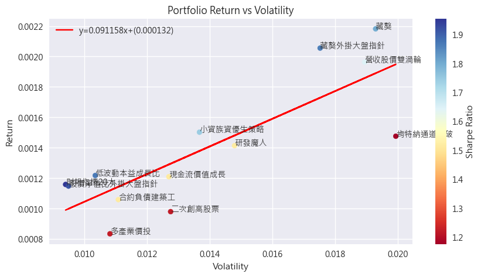

x軸是波動度、y軸是平均報酬，紅線則是回歸直線，代表大部分的策略都分佈在這條線附近。

紅線可以觀察到: 隨著風險的上升，報酬也會逐漸升高。

每一單位風險(波動度)，所能得到的報酬就是夏普比例(sharpe ratio)。夏普比例較高，也就是報酬跟風險的交換比較有CP值(每一單位風險，能換到更多報酬)，圖中點的顏色就代表夏普比率。

有了這張圖之後，就可以根據夏普比例，跟自己的風險偏好(波動度)去選擇適合自己的策略。譬如喜歡低風險的，就挑左下角的，喜歡刺激、發大財的，就可以往右上角去做選擇。

#### 針對MDD&報酬作圖

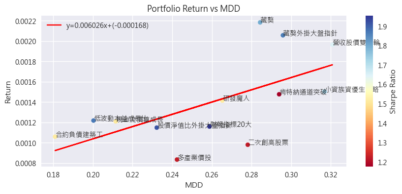

#### 相關性分析

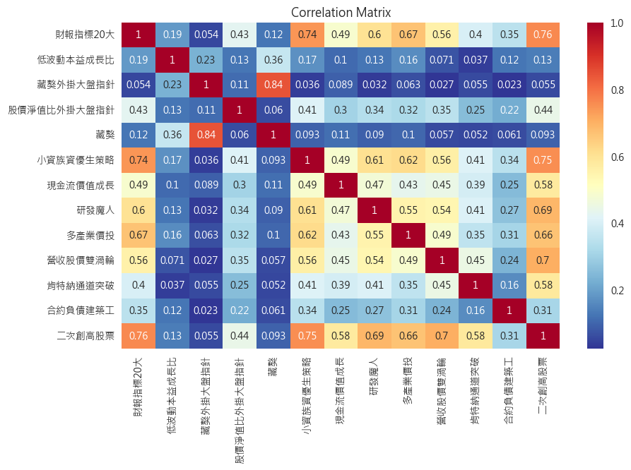

- 針對策略相關性作圖 
  - 前面是對每一支策略作單獨的分析，現在我們來分析策略之間的相關性。
  - 策略背後的選股邏輯不同，相關性就低。我們可以藉由這張圖片去選擇彼此相關性比較低的策略同時持有，來減少同漲同跌的狀況發生。
    - 舉藏獒跟藏獒外掛大盤指針為例子，因為藏獒外掛大盤指針是藏獒修改而成，因此兩者的相關性很高(可以對比藏獒與其它策略的低相關性)，如果只持有兩支策略，最好就不要同時挑這兩支策略。 

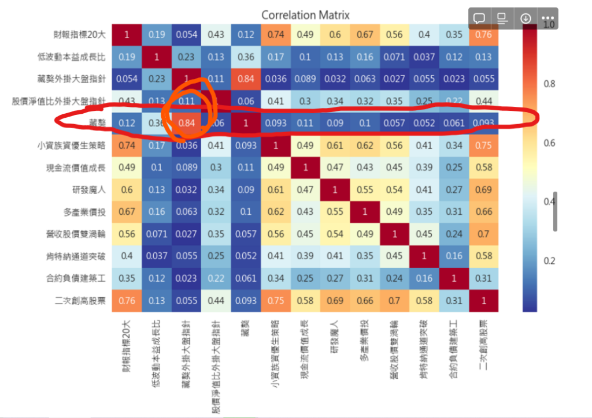

## 介紹效率前緣(Efficient Frontier)

### 簡介

- 前面都是透過視覺化的觀察，然後進行人為分析，有沒有更嚴謹、更科學的方式呢?
- 介紹資產配置的先驅、獲得過諾貝爾獎的效率前緣。假設今天隨機給予資產們不同的資金權重，來組成成千上萬種不同的策略(就是下圖中的每一個點)，我們會發現這些隨機的策略被一條隱形的曲線所限制住。這條藍色的曲線就是效率前緣，透過這條曲線我們就可以
  1. 在給定的風險(給定x值)，求出藍色線上對應的y座標(預期能獲得的最好報酬)，並按照那個點的資產配置權重進行投資。
  2. 我們可以找出最佳收益和風險比的投資組合，也就是圖中的星星，有最高的Sharpe Ratio，也就是先前所說CP值最高的投資組合。

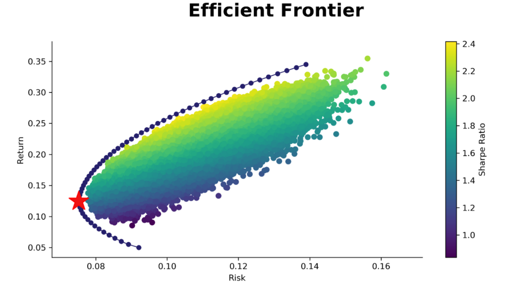

### 實作

- 用FinLab Strategy所畫出來的效率前緣 

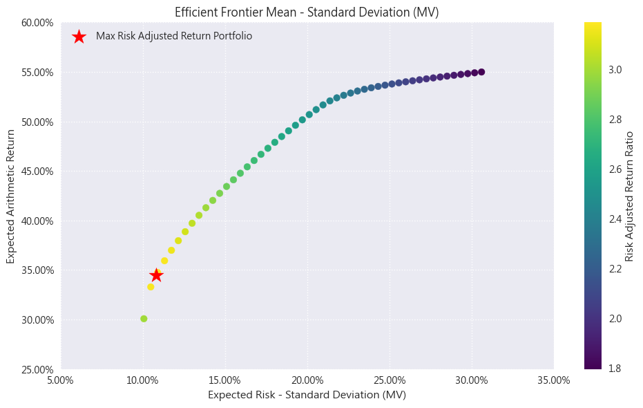

- 理想最佳權重(highest sharpe ratio)，也就是上圖中的星星處，但一樣要記得這是根據過去所算出來的效率最優配置，不代表未來這個配置仍然會是最優的。 

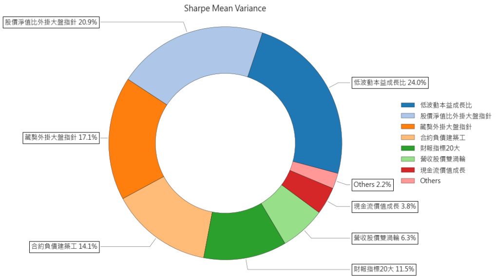

- 隨著給定的風險水準上升，資產配置權重的變化。當給定的風險越來越高時，資產的多樣性就迅速減少，越來越朝向持股單一化(all in)前進，失去了分散投資、降低風險的本意。 

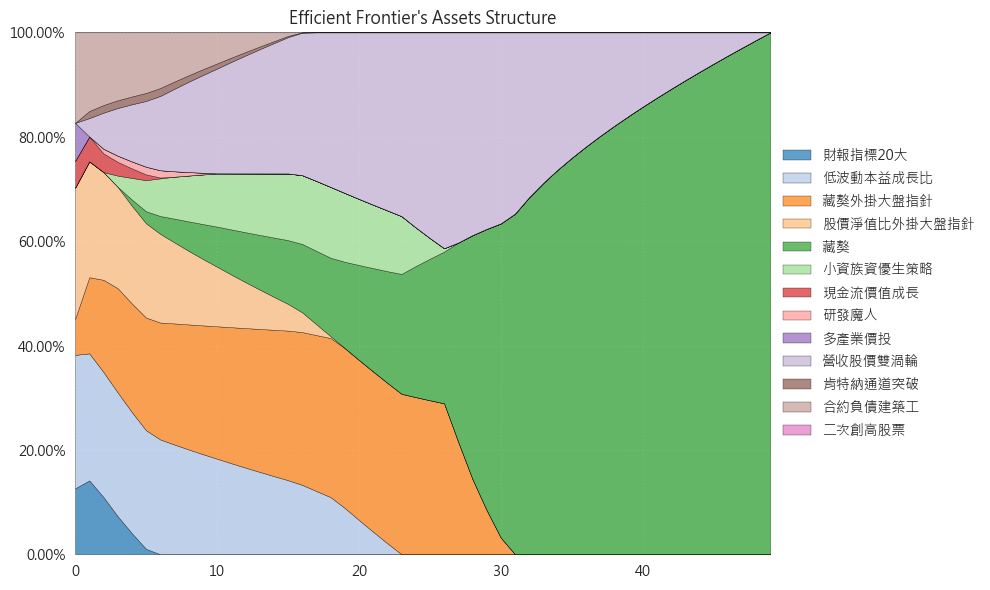

### 缺點

- 效率前緣聽起來雖然很夢幻，在當時被譽為「華爾街的第一次革命」、「投資界的大爆炸理論」，但實際上拿來使用會發現有許多待解決的問題。
  1. 效率前緣是基於歷史至今為止的資料(歷史報酬率、波動度)所畫出來的，但過去這樣投資好，無法保證未來會一樣好。市場通常是漲跌互見的，因此按照過去歷史所畫出來的效率前緣去做配置，很可能與未來的實際情況有所不同。
  2. 效率前緣的算法可能過度集中在過去報酬率最好的資產上，可以看到將投資組合移到效率前緣上時，資產的多樣性大幅度減少，這反而失去分散投資的本意。 
  3. 很容易過擬合(overfitting)：效率前緣透過每一種資產跟其他所有的資產去計算相關性，因此對參數非常敏感。只要上週跟這周的資產價格有些為的改變，藉由效率前緣計算出來的投資組合就可能會大幅度變化，這在實際運用上也非常難以執行。

## **介紹 Hierarchical Clustering Models**

### Hierarchical Cluster的精神

- 在眾多資產中，有些資產會比較相關。以股票舉例，就可能會分為不同地區的股票如臺股、美股，往下又可以區分出不同的類股，如金融股、科技股、生技股等等。資產也是如此。因此我們可以透過多次的分類，先將資產劃分為大大小小的類別。

### 優點

- 透過 Hierarchical Cluster 的分群方法，有以下優點：
  1. 降低複雜度(不用再計算每個資產跟所有資產的相關性了，只要計算自己類別理的就好)，提升模型穩定度。
  2. 加上分類後，可以根據不同種類、層級去進行風險的平衡。譬如可以確保同層級間的所承受的風險是相同的，也就是美股跟臺股承受同樣的風險，在臺股之中金融股、科技股、生技股又都承受一樣的風險……以此類推，藉由這種方式也可以達成更穩定的風險平衡。

### 實作

- FinLab策略的Hierarchical Cluster的結果
- 不同的相關性計算方法，有可能會產生不同的分類結果，再這邊我們使用pearson算法做示範
  - 不瞭解也不用緊張，我們後面會教大家怎麼在不懂各種算法情況下，一樣能分辨出算法的好壞。
  - 下圖我們可以觀察到幾點：
    - 藏獒跟藏獒外掛大盤指針的確非常像
    - 合約負債工、股價淨值比外掛大盤指針的選股邏輯類似，一個挑選營建股在營收尚未認列時的低基期作買入、另一個則是股價淨值低的時候若買入，都是挑好股票在便宜的時候去做買入，因此也被分在同一類。

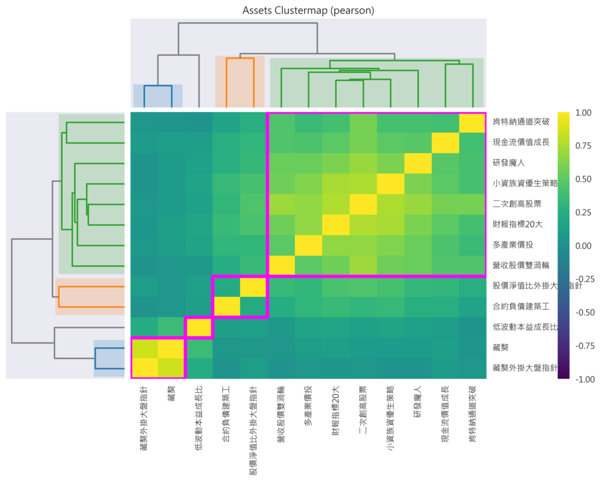

### 參數總覽

- 完整的**Hierarchical Clustering  Models包含各式各樣的參數，像是如何分類的演算法、分類時所採用的相關性的計算方法、該使用哪種模型來平衡風險等等，共有六個重要的參數(model,covariance,linkage,codependence,rm,obj)，而每一個參數又有多達數十種的演算法選擇。別說是一般投資人，就算是專業的投資人也很少有人能研究完各種參數，更別說參數之間的排列組合了。** 註：對參數**有興趣的可以點擊**[連結](https://riskfolio-lib.readthedocs.io/en/latest/hcportfolio.html#HCPortfolio.HCPortfolio.optimization)查看更細節的資訊。
- 但別擔心，接下來就會教大家用有效率的方法，在不用瞭解各種參數的情況下，找出適合的參數組合

## **Random Search & Grid Search**

### 直覺想法 測了好用就用 窮舉所有

- 最直覺的想法，就是窮舉所有的參數組合一個一個測，並找出所有組閤中最好的一個。我們稱這種方法為 Grid Search 網格搜索 

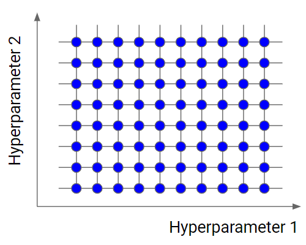

- 缺點：當參數較多時，排列組合的數量會非常大，導致搜索的時間變長花費資源也變大，在比較複雜的實務中很難達成。
- 以此次實驗為例，6個參數就共有4 x 12 x 14 x 4 x 28 x 8 = 602112種組合要測試，用家裡的電腦可能要跑一年才測的完。

### 參數太多冊不完怎麼辦？RandomSearch

- 因此我們使用Random Search來解決這個問題，從每一個參數中隨機選出一個參數，最終形成一個參數組合。反覆這個隨機選取的動作，也可以找到非常不錯的參數組合。
- Random Search 的優點
  1. 可以根據自己能接受的時間長短，來決定隨機形成參數組合的次數。
  2. 相對Grid Search來說，Random Search在同樣次數的參數組合測試下，更有效率，這是因為參數間的重要性往往有高有低。  以下圖為例，x軸是相對重要的參數、y軸則是不太重要的參數，也就是說參數組合的好壞取決於隨機選取的點的x座標，因此我們希望能選出越多x座標不同的點。 Grid Search(網格搜索)的方式，在取樣9次的情況下，只會有三個不同的x座標，然而Random  Search則可以取樣到不同的9個x座標點。 

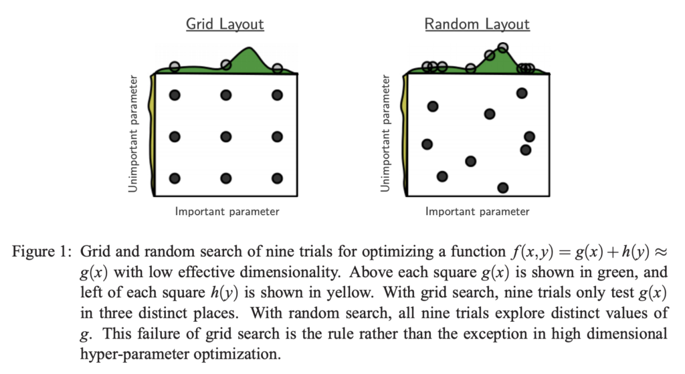

(論文出處: [Random Search for Hyper-Parameter Optimization](https://www.jmlr.org/papers/volume13/bergstra12a/bergstra12a.pdf))

### 結果

以下就是我們對這六種參數所形成的參數組合，進行了5000次Random Search的結果，大約耗時5天。我們會把測試過的參數組合以及對應的結果，免費開放給大家下載，以節省大家的測試時間 (可能轉成共享的csv檔案)

- 報酬 

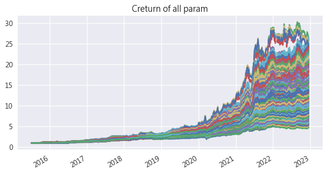

- MDD 

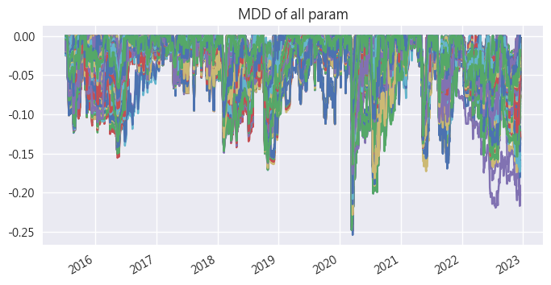

## **透過 Random Search 劃出 Efficient Frontier**

### 該怎麼從5000種不同的參數組合，找出適合的組合呢?

- 若單純挑選報酬率最高的參數組合使用，有以下缺點:
  1. 這個參數組合雖然報酬率最高，但可能波動很大、下跌風險也很大，並不符合我們的資產分配的本意。
  2. 我們對於參數本身特性完全不瞭解，沒辦法按照自己的偏好(風險偏好、追求高夏普、低迴徹等等)，舉一反三去找出其他的優秀的參數組合。
  3. 測試了5000次之後，之前從裡面挑選最好的參數組合來使用，很容易產生overfitting的現象。  Overfiiting：過度學習訓練集中的資料，導致於沒法順利分辨在訓練集外的其他資料。就像是學生靠死背題目答案來作答，而不是真正去理解題目。這樣的學生雖然在有看過的題目一定能拿滿分，但實際上了考場遇到了自己沒看過的題目，就會考的一蹋糊塗。
     - 下圖中，黑線是我們希望學到的、綠線則是overfitting後所學到的結果

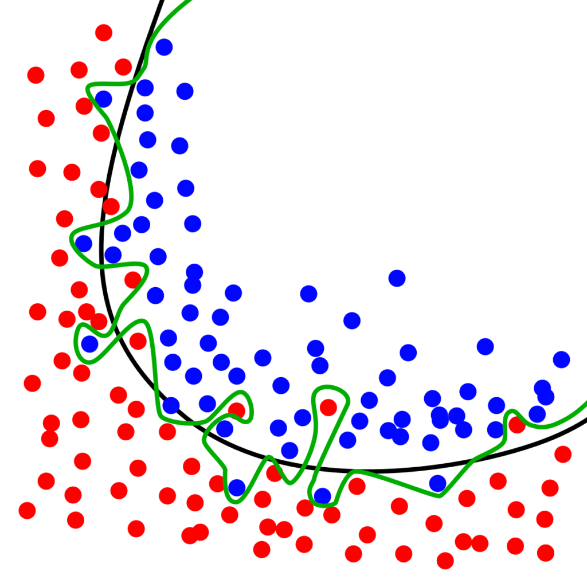

### **透過 Random Search 劃出 Efficient Frontier**

以x軸為波動度(風險)、y軸為報酬，可以發現一條明顯的效率前緣。 

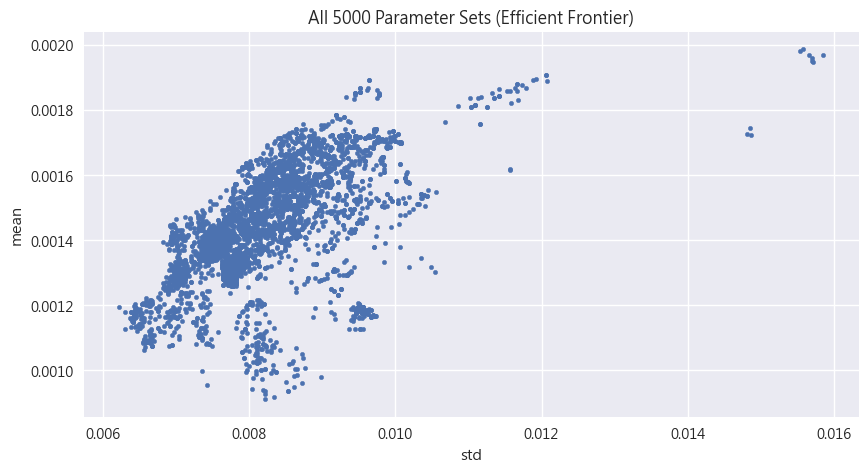

進一步，我們可以分別針對個別參數作圖，也就是將在該個參數中，類別一樣的都顯示為同一個顏色。以下圖(參數: model)為例，HRP這個model就會都是呈現出藍色的點，用這個方式我們就可以一目瞭然的瞭解這些模型參數的特性。 

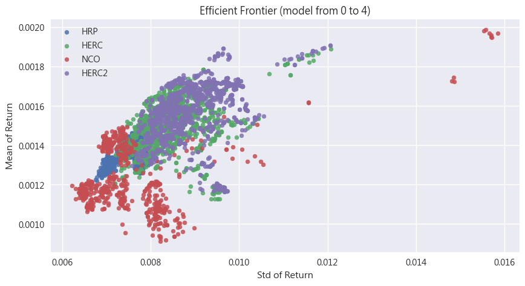

### 如何判斷參數好壞 & 特性

- 判斷三要點:
  - 是否貼合(隱形的)效率前緣：越貼近，代表參數越有效率；若大部分都在效率前緣內部，就代表有其他更好的參數選擇。
  - 同參數的點分佈是否集中：判斷參數穩定性，分佈的點越集中，代表該參數的穩定性越高。
  - 分佈位置：說明參數特性，譬如越偏左下角風險報酬都比較低，是比較溫和穩定的策略；在右上角風險和報酬則都較高，是比較激進的策略，這邊的選擇可依據個人偏好，沒有好壞之分。
- 以Model參數示範 
  - HERC & HERC2 這兩個模型在表現上很類似，大部分也都貼齊效率前緣
  - HRP的表現非常穩定(點幾乎都聚集在一起，不像其他參數般分散)
  - NCO有最高的Sharpe Ratio資料點，同時可以再大致區分成三個子類別

若點都混雜在一起

代表該參數可能不重要，沒有顯著的影響性，可以略過

可能是分的種類太多，可以分成幾張圖來查看 

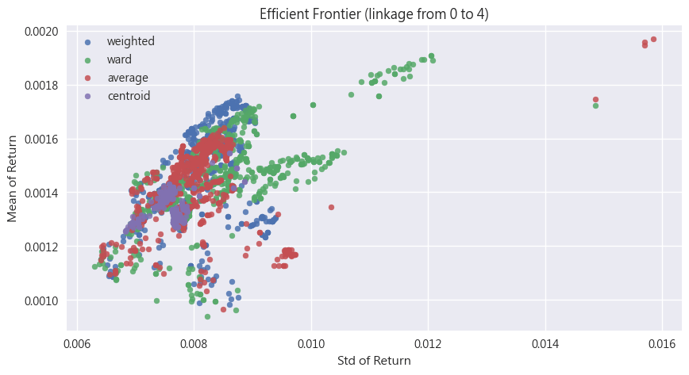

### 透過分析，選出穩定的適當參數組合

首先針對Model部分，由於obj(objective function)是NCO  Model的子分類，代表NCO這個model其實可以衍伸出四個子model，因此要搭配一起看。可以發現NCO對應的三個子分類，第一個子分類是NCO+ERC，剩餘的兩個子分類則是NCO+Utility/MinRisk。在所有的Model裡，NCO+ERC是最穩定的，並且Sharpe Ratio也十分高，作為我們選擇的參數。 

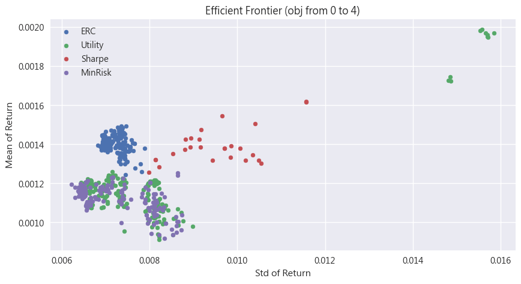

linkage選擇ward，因為點大多分佈在效率前緣上，代表在各個不同的風險、參數組合下，都有不錯的表現。 

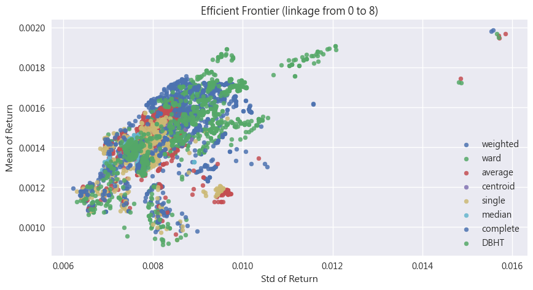

剩餘的三個參數(covariance codependence rm)相對來說就沒有特別明顯的分佈，為了降低參數過擬合的機率，就沒有必要繼續進行參數最佳化，因此剩下三個參數皆使用預設值即可。(以下簡稱此投資組合為Final Portfolio)

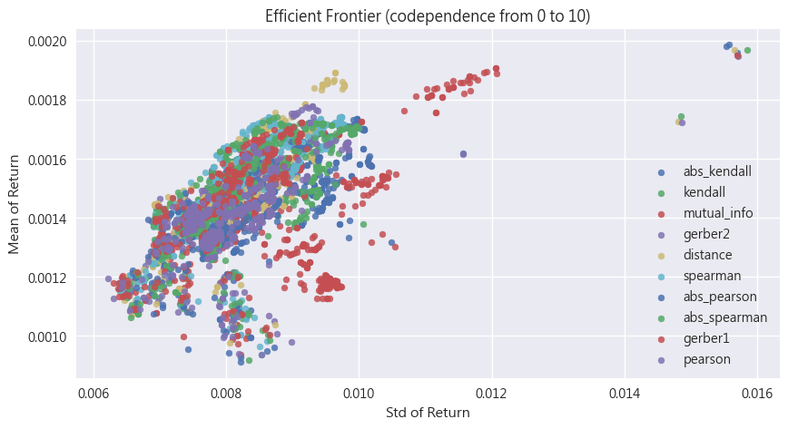

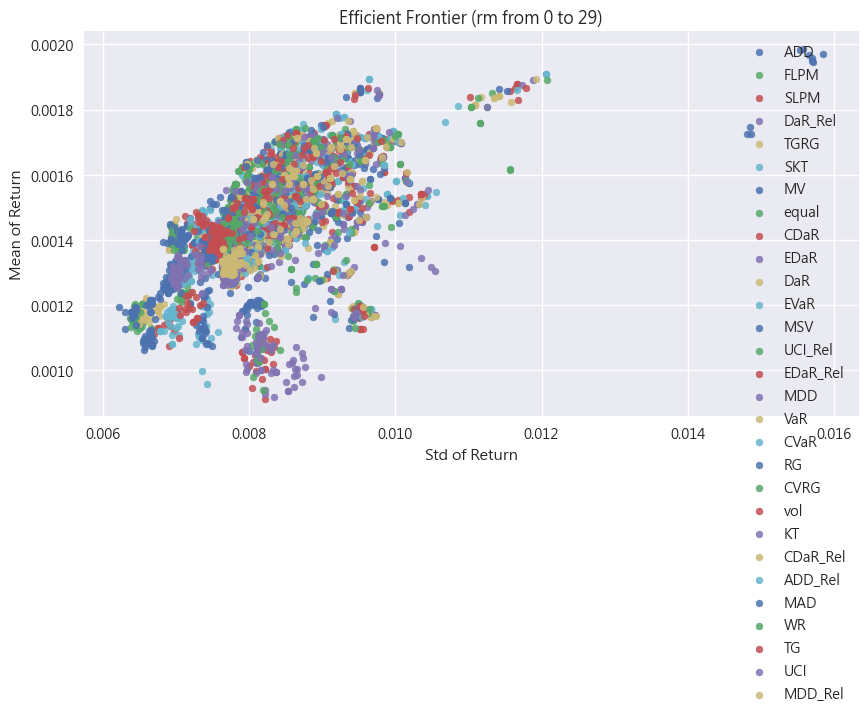

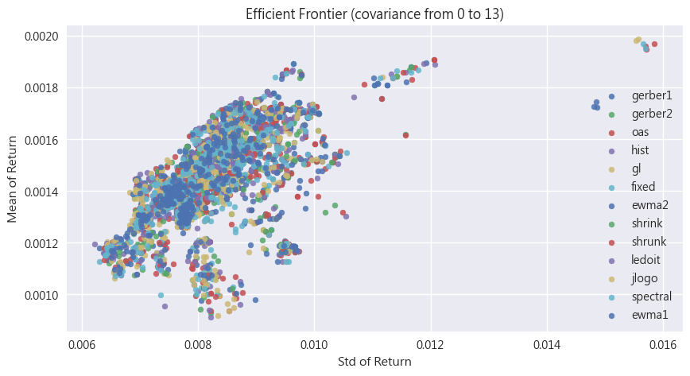

   

## 對選定的參數組合進行詳細回測，結果呈現

### Cumulative Return Curve

- 績效曲線非常平穩，平均年報酬為40%

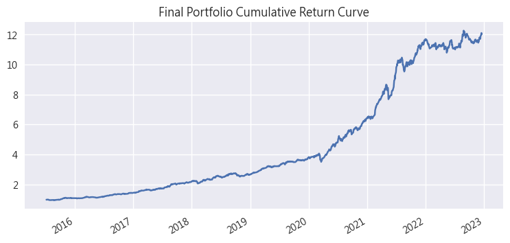

### Drawdown Curve

- 最大MDD為-13.75%，遠小於一開始的FinLab策略

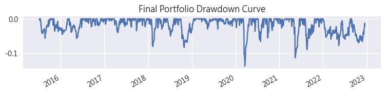

### 月報酬分佈圖

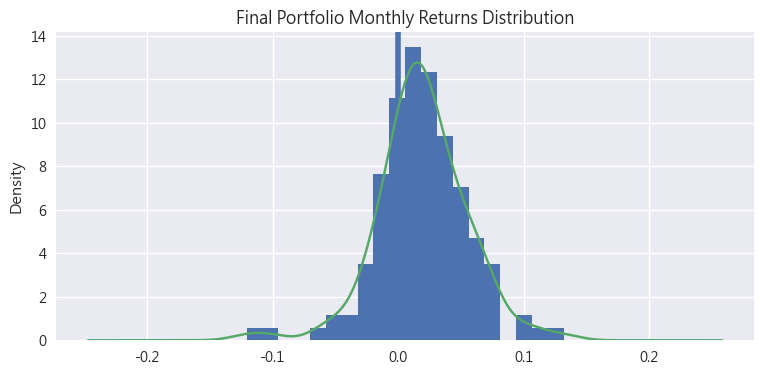

### 逐月return

- 每年皆為正報酬，即便2022年空頭年也有勉強守住
- 最大單月虧損為-8%

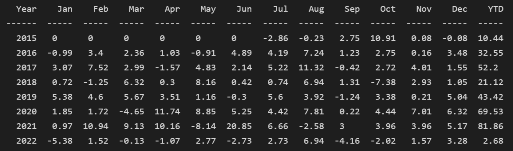

### 資產配置隨時間作圖

- 可發現投資組合確實會隨著時間變化而動態調整(20天調整一次)，且主要由合約負債建築工、低波動本意成長比、股價淨值比外掛大盤指針這些比較穩健的策略佔投資組合的大部分。

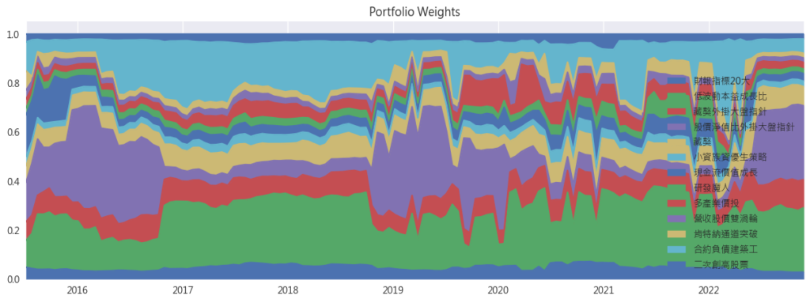

### 結論

首先受限於策略皆為近幾年開發，沒辦法只拿開發後的時間段來進行資產配置，因此策略本身績效有一部分是來自訓練集的資料，實際上線的績效理論上會稍微下降。

但用肉眼就可以觀察到，整個投資組合的走勢相當平穩，回檔幅度也非常小，常常創新高。

### 完整 Portfolio Stats Summary (素材、有需要可自由取用)

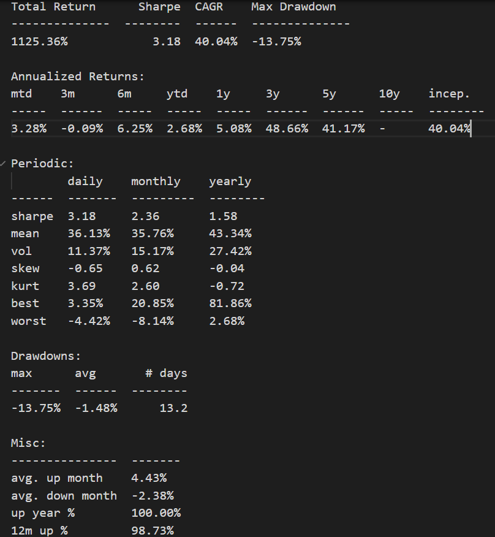

## 與原FinLab策略比較 & 槓桿效果分析

### 當日報酬波動程度對比

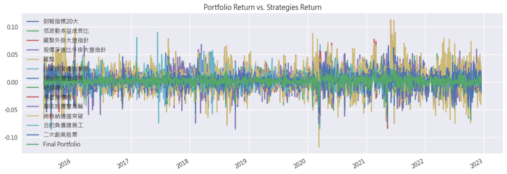

- 平均持有所有策略 vs Final Portfolio，可以看出來每日的波動度也稍微贏過平均持有 

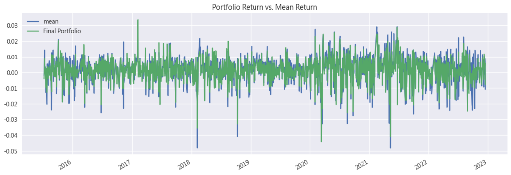

### 槓桿的作用

- 我們的資產配置是一個高Sharpe Ratio的投資組合，策略本身比較穩定，因此風險、報酬都比較低。但如果願意承受風險更多的風險，我們可以藉由槓桿來等比例的放大我們的投資組合。
- 在同樣程度的風險(波動率)下，Final Portfolio可以獲得三者之中的最高報酬。同時斜率的傾斜角度其實就是Sharpe  Ratio，在我們假設無風險利率為0的時候，夏普比例就等於報酬率/標準差，也就是圖中藍/綠斜線的斜率。從這個角度來理解，就能很明顯的看出Final Portfolio > 平均持有 >>  單一策略。因此即便你是想追求高報酬的投資人，也可以透過好的資產配置方式和適當的槓桿，來讓自己的投資更上一層樓。

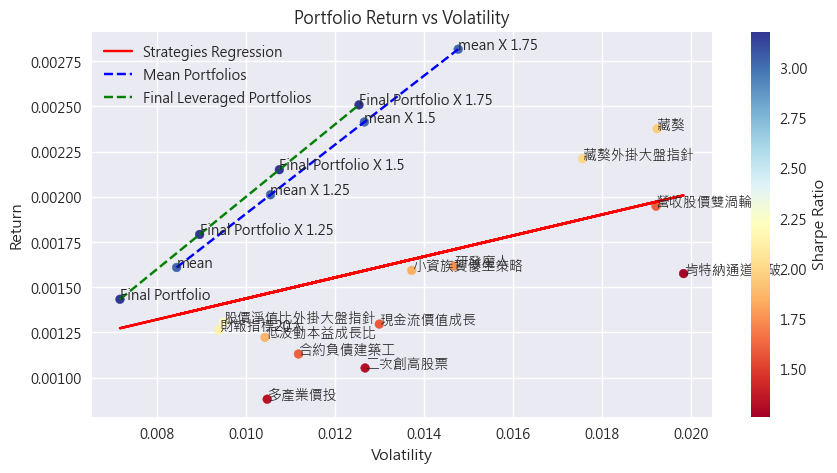

- 同上，若將風險改成MDD的情況下，Final Portfolio表現一樣為三者最佳，而且差距更加顯著。

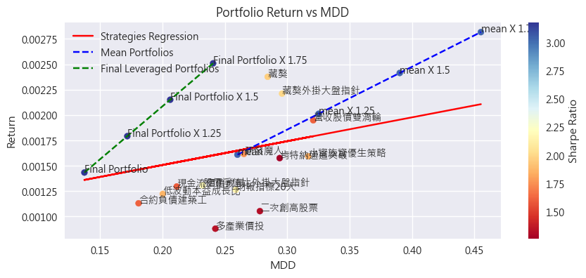

## 個人化槓桿試算器

### 該如何得知該開的槓桿比例呢?

如果想要開槓桿的話，要怎麼知道自己適合開多少倍的槓桿呢? 我們提供一個簡單的試算小程式！藉由輸入能接受的最大下跌幅度 / Final Portfolio的預期最大下跌幅度，我們就可以得出理想的槓桿倍數。

舉例：若我認為自己最多可以承受20%的最大下跌幅度，而Final Portfolio的最大下跌幅度為13.75%，兩者相除之後便能得到我的槓桿倍數為145.74%

註：還要考慮到槓桿所需的資金借貸利息、以及未來MDD有超出預期的可能，建議謹慎衡量後將最後得到的槓桿倍數再稍微往下降一些

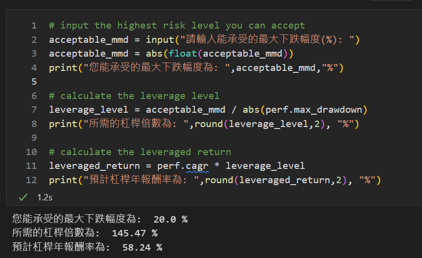

