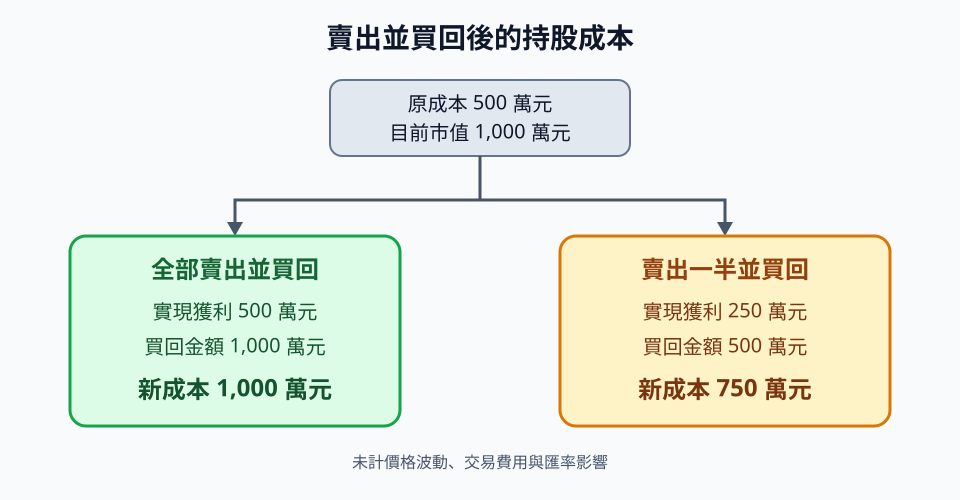

# 美股複委託洗成本完整說明

「洗成本」是指賣出持股、實現損益後，再買回相同標的，藉此調整券商帳面上的持股成本。若要讓**全部持股成本**接近目前市值，原則上必須全部賣出，再全部買回；只賣出一部分，只會調整該部分的成本。

> 本文說明的是臺灣投資人透過複委託交易美股時，常說的「洗成本」。這不等同於美國稅法中，因繼承等原因產生的 step-up in basis。



## 核心公式

假設目前總成本為 \(C\)、市值為 \(V\)，賣出並買回的持股比例為 \(p\)，且暫不考慮價格變動與交易成本：

- 實現獲利：\((V - C) \times p\)
- 買回後總成本：\(C + (V - C) \times p\)

當 \(p = 100\%\) 時，新成本等於目前市值 \(V\)；當 \(p < 100\%\) 時，新成本仍低於目前市值。

## 範例一：成本 500 萬元，市值 1,000 萬元

未實現獲利為：

```text
1,000 萬元 - 500 萬元 = 500 萬元
```

### 全部賣出並買回

賣出全部持股會實現 500 萬元獲利，再以 1,000 萬元買回後：

```text
新成本 = 1,000 萬元
```

### 賣出一半並買回

賣出市值 500 萬元的持股，其中成本為 250 萬元、獲利為 250 萬元。再投入 500 萬元買回後：

```text
未賣部分成本 250 萬元 + 新買回成本 500 萬元 = 750 萬元
```

因此，新成本只有 750 萬元，不是 1,000 萬元。

## 範例二：成本 1,000 萬元，市值 1,500 萬元

未實現獲利為 500 萬元。

### 全部賣出並買回

賣出全部持股會實現 500 萬元獲利，再以 1,500 萬元買回後，新成本為 1,500 萬元。

### 賣出一半並買回

持股成本占市值的比例為：

```text
1,000 ÷ 1,500 = 66.67%
```

賣出市值 750 萬元的持股，對應成本約為 500 萬元、實現獲利約為 250 萬元。再投入 750 萬元買回後：

```text
未賣部分成本 500 萬元 + 新買回成本 750 萬元 = 1,250 萬元
```

新成本會提高到 1,250 萬元，但不會等於 1,500 萬元。

## 結果比較

| 原成本 | 市值 | 賣出並買回比例 | 買回後總成本 |
| ---: | ---: | ---: | ---: |
| 500 萬元 | 1,000 萬元 | 100% | 1,000 萬元 |
| 500 萬元 | 1,000 萬元 | 50% | 750 萬元 |
| 1,000 萬元 | 1,500 萬元 | 100% | 1,500 萬元 |
| 1,000 萬元 | 1,500 萬元 | 50% | 1,250 萬元 |

## 稅務重點：海外所得門檻不等於免稅額

洗成本會實現損益，可能影響臺灣的個人基本所得額與基本稅額（Alternative Minimum Tax，AMT）。

依財政部目前公開說明：

- 中華民國境內居住者，同一申報戶全年海外所得未達新臺幣 100 萬元，無須將海外所得計入個人基本所得額。
- 全年海外所得達 100 萬元時，應將海外所得全數計入基本所得額，而非只計入超過 100 萬元的部分。
- 海外所得達 100 萬元，**不代表一定要繳基本稅額**。仍須合併其他應計入項目，計算基本所得額，再與一般所得稅額比較。
- 115 年度（2026 年度）個人基本所得額的扣除金額為 750 萬元，基本稅額原則上以超過部分乘以 20% 計算。

實際稅額還會受到綜合所得淨額、其他基本所得額項目、一般所得稅額及海外已納稅額扣抵等因素影響。門檻與規定也可能調整，交易前應查閱適用年度規定，必要時諮詢合格稅務專業人士。

參考資料：

- [財政部稅務入口網：最低稅負制](https://www.etax.nat.gov.tw/etwmain/tax-info/understanding/tax-saving-manual/national/individual-income-tax/6xKrvGR)
- [財政部稅務入口網：海外所得達 100 萬元者是否必須繳納基本稅額](https://www.etax.nat.gov.tw/etwmain/tax-info/understanding/tax-q-and-a/national/individual-income-tax/basic-tax-question/oversea-income/awYgOG9)
- [行政院公報：115 年度個人基本所得額扣除金額](https://gazette.nat.gov.tw/EG_FileManager/eguploadpub/eg031218/ch04/type3/gov30/num13/Eg.htm)

## 執行前應評估的風險與成本

- **價格波動：**賣出至買回期間，股價可能上漲或下跌。
- **買賣價差：**成交價可能受 bid-ask spread 影響。
- **交易費用：**複委託手續費及最低收費可能侵蝕效益。
- **匯率影響：**所得計算與資金換匯可能採用不同匯率。
- **交割與購買力：**賣出款項未必能立即用於買回，須確認券商規則。
- **成本認定：**券商顯示的帳面成本，不一定等於申報所得時可直接採用的稅務成本。
- **損益資料：**應保留成交紀錄、費用、匯率與券商年度對帳單。

## 結論

若要把全部持股的帳面成本調整到接近目前市值，通常要全部賣出再全部買回。只處理部分持股，只能提高部分成本。

不過，帳面成本提高不代表交易一定有利。實現損益、稅務影響、價格波動及交易費用，都應納入決策。
