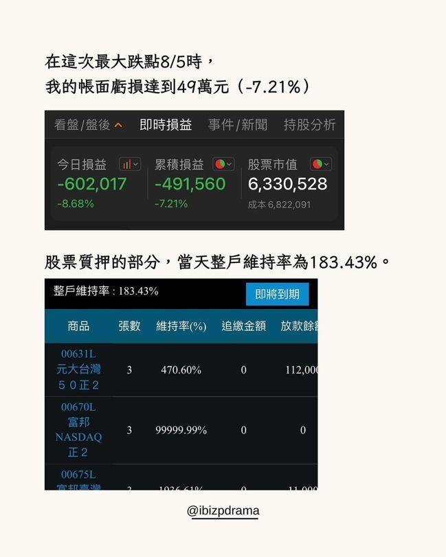
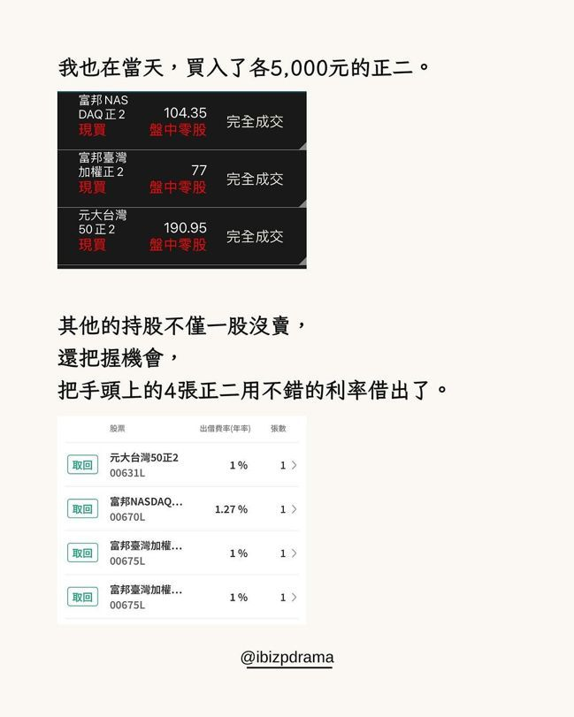
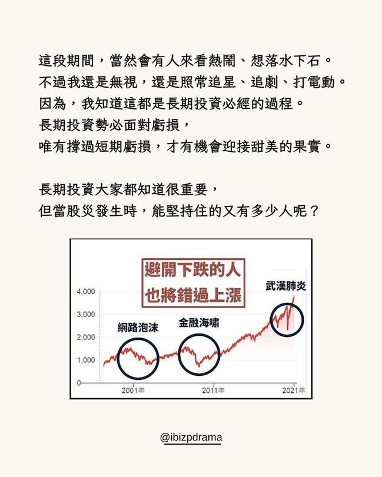
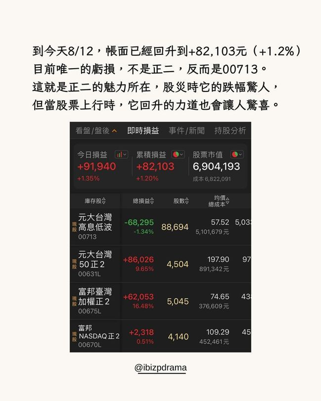

# 質押00713+正二臺股大跌帳面虧損49萬...達人「照樣買進」：遲早會翻紅

至於還處在虧損狀態的00713，我是完全不擔心它。我相信多給它一點時間，它的帳面遲早會翻正。

我對它有信心，不然也不會把它買到88張。至於這次00713的表現就不用多說了，本次大盤最大跌幅達19.47%，00713最大跌幅為8.68%，甚至不到大盤的一半。

00713在2020、2022年股災表現都很穩，這次大跌依舊展現它的抗跌能力。

可能很多人認為我買正二又[**質押**](https://udn.com/search/tagging/2/質押)，這次肯定會很慘。但其實我在6月19日就說了，我現在的00713／正二比例為7：3。我的操作方式其實偏保守。

再加上我質押的是00713，所以這次整戶維持率最低都還有183.43%。

此外，我手上還有4張正二，若整戶維持率持續下跌，都可以把這4張正二用質押不借款的方式，提高整戶維持率。

不過後續股市反彈上漲，所以我的4張正二就讓他們出去借券賺零用錢羅。

這次大跌，其實是讓我們都有一個反思的機會。

開槓過大的人經過這次大跌，就能明顯感受到壓力。曝險過高的人，可能也會承受不住龐大的心理折磨。

不過其實這些都不用苛責自己，畢竟誰不是從經驗中學習成長？遇到了，就慢慢調整就好了，沒什麼大不了的。
