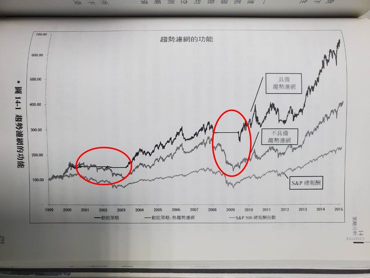

現在市場中各熱門題材持續火熱，這時候再多的選股策略似乎顯得累贅，
想到國外有一本書叫做《賺贏大盤的動能投資法》，
書中講的贏家策略只有一個，就是~買進價格上漲的股票!!

書中闡述的原理是，動能效應在股票市場上不可能消失，因為在人性的驅使下，贏家總能循著正確的足跡前進。

所以呢，我們這次利用XQ全球贏家的【量化積木模組】，鎖定周轉率、成交量（值）較高的股票，且大盤在多頭行情底下(大盤在5日均線之上)，當行情正在發動的時候(盤中開高3%)，動能投資法就會選擇進場參與，所以會享受到較大的價格波動。相關設定與績效如下圖：

績效圖如書中所述，真的可以打敗大盤呢!!

動能投資法有兩個好處：
1、減少資金閒置時間成本：
2、果斷停損：動能投資法以股價的動能作為進出場訊號，當股價失去上漲的動能，就果斷出場。不像價值投資法需要等待基本面修正，那可能要等很久呢！

然而，動能投資法也有兩個缺點：相比起價值投資，動能投資法更能利用資金，因為我們不停買進有漲勢的股票，賣出沒動力的股票，讓資金一直跟著行情動盪，不讓它閒著發霉。
1、高周轉率增加交易成本：動能投資法的特點是頻繁進出市場，那交易成本也就提高了。相比起價值投資那種長期持有，我們得更頻繁地操作，這是它的必要之惡啊。
2、進場時機較晚：動能投資法不像價值投資法那樣會看基本面估值，而是等到盤面顯示進場訊號才進場。所以我們進場的時機往往相對晚，可能會買在股價基期較高的位置，也就是「買貴賣更貴」的意思。

在使用動能投資法時，別忘了這兩個缺點哦。要謹慎管理交易次數，避免頻繁進出帶來的成本增加。同時，可以嘗試結合基本面估值分析，以降低進場基期較高的風險。

瞭解動能投資法的優缺點有助於更明智地運用這個策略。根據自己的風險承受能力和投資目標，選擇合適的投資方法，同時採用適當的風控策略，才能獲得穩定的投資回報。

以上分享，希望對各位有幫助。

---

動能投資法是一本實戰策略書，雖然裡面的策略看起來應該算是初步策略，策略建立該思考的地方都講得非常完善，很值得發一篇文章來討論這本書的策略寫法。也希望能對正在學習建立策略的人有幫助。

## 動能投資法策略細談

1.空頭市場不買進股票（SP500跌破200 MA），增持現金部位。

2.股票排序以90日股價為基準，利用指數回歸計算出每天漲跌幅，再換算成YoY。(圖1)

圖1、線性回歸作法

3.排序會剔除跳空走勢，提出方法是利用勢配率（R^2）來看指數回歸的相關性，R^2越小，就代表指數迴歸結果參考性越低。

4.為了兼具動量與品質，最終排序方式使用指數回歸斜率YoY*R^2，進行排序，符合策略的股票，計算結果也越高。(圖2)

圖2、策略指標示意圖

5.買進部位使用波動率作為計算基準，波動率指標採用ATR，當20日平均ATR越高，買進部位越低，盡可能維持每一檔標的每日的指數波動相近，平滑波動性。

6.策略將從標普500挑選，不限制挑選出來的股票族群占比，只以排序為主，並從排序最高的個股一路買，直到用盡現金。

7.為增加成功率，外卡兩道濾網，包含個股股價要高於100 MA，以及90天內沒有出現超過15%以上跳空缺口。

8.買進成分股後，不會設定停損點，而是利用汰弱留強的方式，每週固定一天檢視新的SP500成分股排序，若個股排序低於前20%，或是股價跌破100 MA，就全數出場。

9.除了檢視機制，投資組合也會定期進行再平衡，每隔兩周的檢視日進行調整，利用新的ATR與收盤價重新計算。(圖3)

圖3、策略流程圖

## 策略實測結果

策略從1999年測試到2014年，每一年都會分別話說SP500 VS 策略的績效，以及持有現金比例。同時也會檢討當年度操作比較有代表性的個股，很適合讀者一步一步觀察策略實際實行後會發生的問題：(圖4)

圖4、1999~2014年逐月績效

1.在多頭時期，是策略最穩定的狀況，當SP500一直處在200 MA之上時，就代表策略可以不斷運行，藉由每周更新的策略清單換股，以及每兩周依照ATR進行部位調控。在這個階段，很容易就得到比指數更好的報酬率，也達到策略設計的目標。(圖5)

圖5、多頭行情當年報酬圖

2.在空頭時期，是策略持有現金最高的時期，當SP500沒有突破200 MA，策略就不會買進股票，當成分股跌破100 MA就會執行出場策略。經由實測，虧損可以非常有效的控制住，績效也顯著勝過SP500。然而，缺點是長時間都不會執行策略，這樣的空洞期不太容易忍住，也會產生質疑策略的心態。(圖6)

圖6、空頭行情當年報酬圖

3.策略在高波動時期，績效表現最為震盪。動能投資最怕的就是在判斷基準線上來來回回，低於基準線就要出場，高於基準線又要入場。這樣反覆來回很容易出現買高賣低的情況，績效會非常容易落後大盤。作者認為不應該根據事後的狀況改變參數設定。但我認為，應該思考該如何判斷目前是高波動盤，同時該如何保留獲利，避免不斷的買高賣低。以增加策略靈活性，而非一直想維持策略的一致性。(圖7)

圖7、策略在波動性高的報酬圖

4.從策略在空頭的績效來看，持有現金量過高會是一個問題，進階的策略操作者會設計另一種因應這類情況的策略來補強績效，同時也讓資金使用率上升。這也是從第一個策略建立後，開始向外開枝散葉的起點

5.一周只進出一次會出現無法及時進出的問題，我自己會朝向在SP500跌破200 MA時同時調整部位。不過依照清單的操作周期來看，或許績效提升不是這麼的大。

6.從結果來看，回測結果會很明確地告訴策略制定者，他的策略會在哪些狀況中表現好，哪些狀況中表現不好。而策略修正就會由這些績效圖中切入，進而發展擴充策略，或是補強策略。所以，對於會回測的策略交易者而言，回檔並不是多可怕的事情，Overfitting才是。

7.這類型的替換策略，會出現一個問題。就是選到的標的有可能不會漲，或者是當動能排序落後而被替換的股票開始上漲。這種狀況就是策略必須付出的成本，這部分除非再添加更嚴格的濾網，不然他就是必然發生的狀況，重點在於整體績效是否如預期的上升。

8.使用排序策略會遇到的問題是，當市況下跌時，手中的個股齊跌，部分個股本來獲利，但其他個股跌得太慘，導致這些有獲利的個股動能排序還是非常前面，無法停損。最終觸碰到出場條件時，大多都轉為虧損。這也是策略者需要注意的問題，策略的靈活性很重要，單一策略一定會在某些情況適應不良。

9.對於動能交易者而言，有一點非常重要，通常會挑選高Beta的個股作為投資標的。這類標的會在行情劇烈時表現更大的波動，讓短期投資績效劇烈震盪。這也是動能交易者必須要做的功課，究竟要將策略補強，還是直接透過大濾網，篩出單邊上漲的有利局勢?

10.作者制定的動能策略在2008大幅下跌後的反彈遭遇到問題。由於他卡了一個90天內有出現跳空15%將不被採納，所以在反彈時，出現資金無法買滿的情況。這點很有趣，在極端條件中才有可能遇到。若反彈確立，那也代表他在2009年的表現會大幅落後指數，事實也是如此。(圖8)

圖8、策略在極端狀況可能會出現問題

11.作者在書中模擬的動能策略，在實際操作上會遇到一種狀況，也就是下跌破200 MA後，急遽反彈。依照一般動能投資者，應該要抓的到這一整波的利潤，但作者設立了200 MA以上才買股這個限制，導致指數只要低於200 MA，後續到200 MA以上的反彈波段，就會全部都吃不到。這部分也是策略可能要進行強化的部分。(圖9)

圖9、策略遇到大盤大幅下跌後的反彈的報酬圖

## 策略分析

1.作者首先針對大濾網(200 MA)進行分析，探討是否有設立的必要(圖10)。策略執行的15年內，趨勢濾網發揮兩次功用，確實可以阻止大幅下跌的狀況，這也使得最終績效的差異。作者認為，千萬不要為了某些情況做最佳化改善，他會使結果變的不切實際。針對概念進行交易，需要某種形式的長期趨勢濾網，但如何設定這個濾網，則不太重要。

圖10、趨勢濾網設立與否之績效圖

2.作者使用風險平價指標來設計部位控制是很有趣的做法，一般而言都會以市值大小來設定持股比例，或者是平均部位規模。這樣的作法會導致整個投資報酬被少數高波動的個股牽著走。使用風險平價，目的就是希望每檔個股每天波動都是接近的，並透過再平衡不斷調整，以免讓整個投資組合績效走偏。

3.指標挑選的區間要有建設性，書中以90個交易日作為區間，進行動能計算與排序。他可以反映中期動能，策略的合理性很重要，而非花大把時間追求最佳化。

4.部位規模也具有重要性，當投資組合中的成分股過少，受到事件交易的風險會太高，提高投資組合的績效波動性。但也不需要過多，會有管理方面的困難，作者經由回測建議，投資組合中持有約20~30檔即可。

## 我的看法

對於策略制定，我很推崇作者的想法。在設計策略的開頭，追求的是「合理性」而非「最佳化」。例如你該如何使用一個大濾網區分熊牛、你該如何設立一個參數來排序股票清單，以及進出場的邏輯。方法簡單沒關係，重點是有邏輯。

作者認為所有參數挑個大概就好，不用再進行調整，不用汲汲營營進行最佳化，最後得到的報酬率與MDD或許差異不大。而我看完的想法是，初代策略必定會在某些情況中表現很差，回測的功能是藉由形貌來確認表現優異與表現不足的地方，並且透過策略擴充或是策略補強來改善績效。

在第一次設計策略，幾乎會走彎路，但最重要的是先做出一套骨架，接著再進行雕琢，或許策略不是沒用，而是不適用於所有情況。找到策略最適合的情況，就是策略交易者必須要做的功課。

---

# [賺贏大盤的動能投資法] 讀書心得及實驗

作者Andreas F. Clenow是避險基金經理人, 在這本著作裡, 示範如何回測並建構一支動能交易策略, 並打敗大盤.

書中在建構模型的過程非常強調”**資料的正確性**“回測大盤最好要考慮現金股利、下市, 和股票分拆.”及持股的分散性, 大概20~30支, 作者覺得差不多, 再多就會和大盤表現貼近, 若太少5~10支則容易受到個股的風險影響(美股沒有漲跌幅限制的….有可能會殺很大..)

“**S&P500本身就是一個動能策略**“

蛤? 我看錯了嗎? 作者說, 因為要入S&P500必須市值成長到53億美元以上(也就是漲很久了..), 並且在NASDAQ或NYSE掛牌交易, 也就是要漲一段時間才會被選入, 這點也就是動能策略的主要元素”**買進上漲中的股票.**“

注意”趨勢策略(Trend following)”和”動能策略(Momentum)”還是不同的, 趨勢策略通常會有一條或二條或三條均線去給他當基準, 而均線在盤整時是會失效的, 因此比較適合放在多個相關性低的市場, 互相Cover,

而動能策略就主要是把最會漲的挑出來, 然後加上一個大盤大跌的卡關, 避免大盤走空的時候還持續買股.

**作者策略是這樣的:**

1. 用90日漲幅、迴歸斜率及R2找出S&P500中的動能前30名.(也可以是S&P 400, S&P600, 總之要有一個股票池.)
2. 取前20支持有, 部位大小以ATR決定.
3. 如果大盤在200日均線以下, 不買股.
4. 如果個股跌穿100日均線/90日內有跳空15%/從S&P500剔除, 砍!
5. 每2週(或一個月)再平衡一次.(20支個股要再平衡, 要費一點工夫.)

書中有教怎麼做第1點的Excel表格, 要撈500支S&P500個股的過去90日報價, 再分別計算出斜率和R2, 最好還是要會寫程式比較好.

有趣的是, 作者有比較過**只取過去90日漲幅最大的個股, 其實績效和算斜率的個股沒什麼差別**, 不過還是嚴謹一點用有斜率和R2的資料, 目的是抓到走勢一致, 沒有暴衝的個股, 作者在**平衡波動性**這點上很謹慎….若是一般投資人要簡單作就是90日漲幅前20名去買就好了.

個人覺得和Gary Antonaci的Daul momentum滿像的, 就有**某種機制挑出強勢股持有, 然後會有一個切換點, 不管是12月報酬還是大盤的200日均線也好, 就是會有一個在大盤不好時跳脫的機制.**

總體來說, 阿批還是比較喜歡這種能夠量化的交易手法, 點到出手, 沒有模稜兩可, 也不用去找護城河、經理人品格這種比較難界定的東西,

不過相對而言, 對資料蒐集、資料分析、策略建構的要求就比較高, 程式的能力還是練一下好些, 不然像阿批就有很時候必須靠別人的報告, 或是要牽就網站的格式, 自己想知道的東西就比較不能隨心所欲的去了解….

但量化策略也不是萬能就是了, 回測結果也不見得就一定代表未來, 也是會有過度配適, 或者因為市場改變, 策略失效的問題, 最好還是有多支策略搭在一起用.

不論如何, 任何的投資方式都好, 會長期賺錢就是王道.

## [冠軍策略](https://hahow.in/courses/5d04aa998834eb002271ba29/main?mts_s=ap&mts_m=ha&oasId=5d8ccc01a7e8fe0020d73c64)的隨機選股測試

書中有一個很帥氣的回測, 作者把**S&P500****裡的個股****,****每月隨機挑****50****支持有****,** **結果竟可以穩定的打盤大盤****, “****要打敗市場如此簡單****,** **你確定還要指數報酬嗎****?”**

阿批不禁好奇起來, 如果在台灣50和台灣中100中就給他挑過去90天最強的20支來抱, 每月更新, 會不會也能海放大盤? 畢竟買高賣更高、強者恒強, 這樣的動能現象在市場裡不是什麼新聞, 也有研究報告指出動能因子能夠長期打盤大盤.

基於工具的限制, 阿批決定用[冠軍策略](https://hahow.in/courses/5d04aa998834eb002271ba29/main?mts_s=ap&mts_m=ha&oasId=5d8ccc01a7e8fe0020d73c64)來作實驗.

### 股票池

阿批依作者的建議, 把自己的[冠軍策略](https://hahow.in/courses/5d04aa998834eb002271ba29/main?mts_s=ap&mts_m=ha&oasId=5d8ccc01a7e8fe0020d73c64)投資組合, 以MTUM為股票池, 從裡面隨機拉出來50支, 原因是Portfolio visualizer的限制是50支.

**延伸閱讀: [真的假的? 真的假的? 1個年複利報酬60%的懶人美股及美股ETF投資組合!?](https://yyp-fire.com/dm-application-with-smart-beta-etf/)**

MTUM本身就是動能型ETF, 從美國大型及中型個股中挑出6個月及12個月內表現強勢的股票, 經過波動性調整後給一個動能分數, 再用市值加權, 決定持股比例, 最大不超過5%, 每半年再平衡一次.

然後再使用[冠軍策略](https://hahow.in/courses/5d04aa998834eb002271ba29/main?mts_s=ap&mts_m=ha&oasId=5d8ccc01a7e8fe0020d73c64), 從50支裡面每月拉最強的12支出來(理由是Portfolio visualizer的限制是50支/12支, 程式段位不夠的悲哀..)

歷史持股資料不可得, 不過可以像作者一樣玩, 阿批把MTUM的121支持股篩選後, 留下2014年前上市的79支(原因是有的2020年才上, 就只有一年資料.., 回測結果就會是一年, 用2014年有7年, 不長不短.).

2021/2 MTUM全121支持股如下, 紅色部份是2015以後才上市的股票, 仔細看還不少是近期的飆股, 像Paypal, Zoom, Roku…等等.

去掉紅字後剩79支如下, 再從79支中隨機挑50支當股票池, 每月持有最強的12支.

### 測試條件及參數

以下[冠軍策略](https://hahow.in/courses/5d04aa998834eb002271ba29/main?mts_s=ap&mts_m=ha&oasId=5d8ccc01a7e8fe0020d73c64)實驗均使用單一絕對動能: MTUM, 出場持有資產: VGLT, 持股數:12

切換參數同[原版冠軍策略](https://hahow.in/courses/5d04aa998834eb002271ba29/main?mts_s=ap&mts_m=ha&oasId=5d8ccc01a7e8fe0020d73c64).

### 實驗一:

挑選的50支股票以藍色標示如下:

**Portfolio visualizer回測結果:**

毫無懸念的海放大盤, 而且標準差及MDD都很夠水準.

### 實驗二:

挑選的50支股票以藍色標示如下:

**Portfolio visualizer回測結果:**

### 實驗三:

挑選的50支股票以藍色標示如下:

**Portfolio visualizer回測結果:**

### 實驗四:

挑選的50支股票以藍色標示如下:

**Portfolio visualizer回測結果:**

### 實驗五:

挑選的50支股票以藍色標示如下:

**Portfolio visualizer回測結果:**

### 實驗六:

挑選的50支股票以藍色標示如下:

**Portfolio visualizer回測結果:**

### 實驗七:

挑選的50支股票以藍色標示如下:

**Portfolio visualizer回測結果:**

### 實驗八:

挑選的50支股票以藍色標示如下:

**Portfolio visualizer回測結果:**

### 實驗九:

2007年以前上市的共62支, 挑紅字的50支.

**Portfolio visualizer回測結果:**

由於想看一下策略在金融海嘯時的表現, 阿批把單一絕對動能換成VFINX(S&P500的美國境內基金), 出場持有資產換成VUSTX(美國長期債券基金).

結果, 經歷海嘯不論在報酬率和年報酬都很堅挺, 同時期原版冠軍策略的複合年報酬率是15.94%, MDD是-19.67%, 標準差13.61%.

### 實驗十:

挑選的50支股票以藍色標示如下:

**Portfolio visualizer回測結果:**

## 結論

在股票池裡隨機選股, 真的隨便都可以海放大盤ㄟ….

這樣我想可以一定程度的證明動能策略的是有作用的, 在**適當的股票池**裡去隨機選股的確能幹掉大盤, 特別作者是有考慮到S&P 500的持股變化, 那麼回測的效度就更高.

但MTUM是每半年調一次持股, 這回持股121支中近3年上市(2019,2020,2021)的個股就有17支, 佔14.05%, 在這樣的狀況下, 2014年的MTUM持有的強勢股到底和現在有多大的不同無從得知, 只能說這個實驗是假設股票池從2014年就是一樣的, **從裡面隨機挑股還是能夠有不錯的績效, 讓阿批確認了相對動能的有效性.**

**2021/11/14 補注: 請注意本篇在撰寫當時的假設是用MTUM的”現有持股”去做回測, 但MTUM每半年都會換股, 建議到黑石的網站找每月的持股來回測, 結果會大不同.**

考量[冠軍策略](https://hahow.in/courses/5d04aa998834eb002271ba29/main?mts_s=ap&mts_m=ha&oasId=5d8ccc01a7e8fe0020d73c64)本身自帶的擇強持有、閃避空頭盤的能力, 以及不管MSCI, 亦或本書的作者的對動能策略回測, 亦或阿批自己的實驗及回測經驗, **我想這個模式還是值得一試的**, 歐印…沒啦…就倉位不要太大, 風控做好就可以了.

最後警世一下, 如同作者說的, **組合太少會有個股風險, 也確實看到了, 在沒有漲跌幅限制的美股**….滿恐怖..買進個股時永遠要記得考慮風險, 適度分散才是.

前一篇的組合正犯了欠缺分散性的誤區, 在此也把他修正過來.
