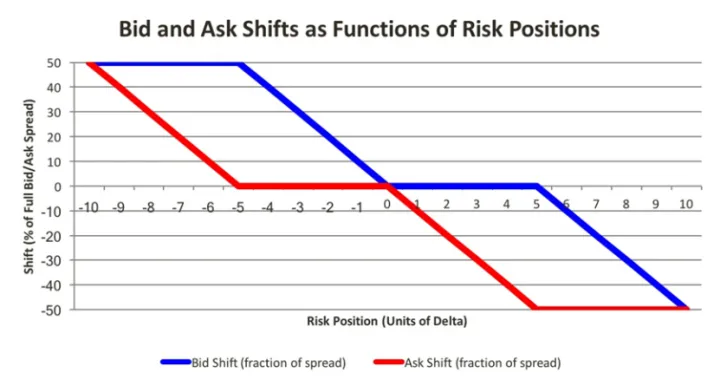
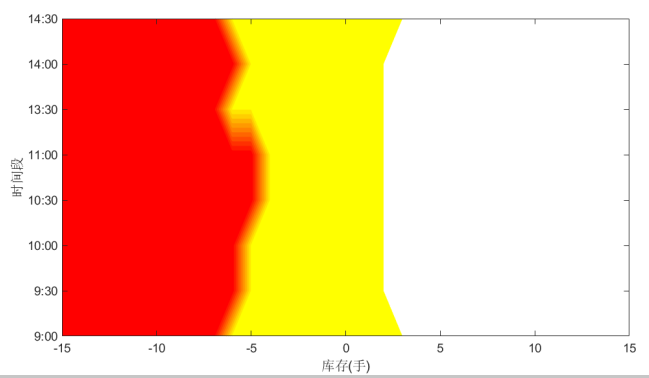

# 淺析經典高頻做市策略

引言：做市策略指的是一種分別建立限價買賣單，利用標的價格的上下波動觸發限價單，通過買賣單的差價獲取交易收益的策略。做市策略中重點關注的是限價單的數量和以及買賣單報價與中間價距離的設定，因而在各類經典的做市策略中，主要研究的是中間價的估算，進而在中間價兩邊合適的位置設定買單和賣單。本文將介紹做市的基本概念以及兩大經典高頻做市策略。

## **第一章：做市的基本概念**

在一些流動性較好的標的資產的交易活動中，普通投資者可以通過提交市價單或者直接買賣標的資產或者相關衍生標的直接參與市場交易。這樣的市場中存在較多的投資者，資產流動性好。只要投資者在合理的價位出價，很快就可以找到交易對手。通過連續不斷的交易活動，資產的價值也可以逐漸反映在價格中，從而使得標的資產的價值得到充分的體現。這一方面促進了標的資產的價值實現，另一方面推動了市場整體資金的流動，一定程度上提高了市場投資活動的積極性，為市場經濟注入活力。

但在一些流動性較差的資產上，由於種種原因，參與這些資產投資活動的交易者較少，想要對這些資產展開買賣活動的投資者很難正確認識到資產的真實價值，也很難找到合適的對手進行成交，這時候就需要藉助做市商來為市場提供流動性了。

## **1.做市的定義**

什麼是做市？簡而言之，做市就是製造市場流動性。股票市場的驅動方式分為報價驅動和訂單驅動。在訂單驅動的市場上，做市商有幾種不同的形式：交易所可以與指定做市商達成協議，在保證市場公平有序的前提下提供更多買賣報價，指定做市商必須在開盤和收盤時參與競價並在規定時間內保證一定比例的報價。非交易所指定的做市商則不必承擔上述義務，只是作為流動性提供者。採用做市策略的高頻交易者便是如此，在高頻交易資料的基礎上圍繞標的資產的價格在不同價位掛出限價單，當標的資產價格在不斷波動時會觸發做市商掛出的低價買單和高價賣單，做市商借此實現低買高賣，並賺取差價。而在報價驅動的市場上，做市商就是交易商，他們提供通過報價向其他市場參與者提供流動性。做市商通過賺取買賣價差獲利，每個做市商就像一個小的交易所。

## **2.做市策略的收益來源**

由此可見，做市商在依賴於資產價格波動中高低價之間的差價獲得收益。那麼，這種買賣價差是如何形成的？Harold Demsetz, 1968研究了紐約股市的交易成本，研究中首次闡述了做市商買賣報價差的形成過程：供求的不平衡會導致價差產生，“買賣報價價差是有組織的市場為交易的即時性（immediacy）支付的加成”。做市策略通常在雙邊報價，通過成交價格在價差間的窄幅波動獲利，而這裡的窄幅一般只有1-2個價位，而非大方向性變化。根據市場有效理論，股票價格在市場有效的狀態下為“隨機遊走”，價格的走向不可預測。然而長期跟蹤研究發現，價格的長期走勢具有“均值回歸（Mean Reversion）”的特點。均值回歸在理論上具有必然性，價格走勢不可能只升不降或者只降不升，價格保持正收益率或負收益率稱之為均值迴避（Mean-aversion）。在均值回歸理論中，均值迴避的現像是暫時的，均值回歸是必然的。資產價格偏離其內在價值的程度影響均值回歸週期的長短。

Tanmoy Chakraborty and Michael Kearn, 2011通過理論和公式推導，進一步明確了做市策略的絕對收益。假設所有的市場事件出現在離散的時間點位 0，1，2 直到時刻T，在收盤時刻 T ，做市策略必須平掉所有的單方向淨頭寸。文章中證明瞭做市策略的理論收益為12(K−z2)，其中K=∑t=1T|Pt+1−Pt|表示價格波動的絕對幅度， z=PT−P0 表示收盤後平掉淨頭寸產生的淨盈虧。研究也進一步證明瞭在均值回歸的條件下，該理論收益的期望為正，也就是說在均值回歸的假設下，做市策略確實可以產生絕對收益。通過這個理論收益公式，我們也可以發現做市商需要儘可能捕捉價格的窄幅波動，而清除庫存以減低庫存風險的操作則會對做市商的絕對收益產生一定削減效應。

## **3.做市v.s.統計套利**

在做市中，做市商不總是提交最優價格的買單或賣單，並且會儘量保持買賣單的平衡，減少庫存風險。由於庫存風險的存在，即做市商的庫存端可能會面臨反向的上漲趨勢，從而使其擔憂在標的資產上的淨空頭或淨多頭暴露，此時做市商會盡快做出反方向的買賣單從而降低庫存風險。另外有時為了防止買賣單被打穿，做市商也會在更深的價位做單。而統計套利策略的投資者則會故意做出方向性的交易，直到標的價格回歸到合理價格區間，因此在套利操作中存在在某個標的上的淨多頭或空頭是十分常見的。當然，做市商和套利交易者都持有中長期趨勢回歸的觀點——做市商在中間價基礎上在兩端建立買賣單，認為標的資產的價格會在中間價兩側上下波動，從而觸發買單和賣單，而做市商從中賺取差價；而套利投資者則是從標的資產的相對價值或者絕對價值出發，認為一定時間內，價格會回歸到相對價值或者絕對價值區間，因此當套利投資者發現某標的資產價格或者某組標的的相對價值脫離合理區間時，他們就會通過淨持倉，等待價格回歸到合理的價值區間，從而獲得策略收益。

## **4.做市策略的風險管理**

在做市中，主要包括三類成本——指令處理成本、存貨成本、資訊成本，一般交易所指定的做市商會得到一定比例的手續費返還，因此做市商在建構做市策略中常常關注後兩種交易成本，在此基礎上，形成了兩類做市模型——存貨模型和資訊模型。

**（1）指令處理成本**

指在交易指令發生時做市商所承擔的如印花稅、過戶費等成本（早期還包含人工下單的人力成本）。

**（2）存貨成本**

指做市商在向市場提供買賣報價時而保有一定數目的證券等頭寸而產生的成本。因為標的物的價值會不斷變動及價格和交易數量的不確定性，有可能帶來的成本損失。通常來說，交易量的不確定性越高則做市商保持的存貨越多；標的物的價格不確定性越高，存貨成本則越高。做市商期望通過買賣價差來獲取利潤。做市商如果不同時買賣，就會產生庫存成本。做市商面臨的最核心問題就是如何在有多空庫存暴露的風險下更加精準地報價，避免積累大量的多空頭寸（圖1）。Smidt, 1971指出被動報價的做市商假設不能夠解釋價差隨著股票價格的波動而變化，做市商作為市場的理性參與者，也不會被動地進行報價，而是根據自己的庫存情況主動地調整報價，控制庫存風險和提高庫存的周轉率。

圖1：存貨模型對於買賣報價的調整（來源：加密資產衍生品新藍海，期權交易詳解,2020.）

做市商往往根據收益最大化和風險最小的原則來決定買賣報價，做市商控制自身的初始財富以及任一給定時間點手中所持有的資金和存貨。Garman , 1976首次提出了基於庫存的做市商報價決策模型。此後，庫存模型從單個做市商的情況發展至多個做市商的情形（Ho and Stoll, 1983），由單期模型擴展至多期決策，並引入了風險係數來研究不同風險偏好程度的做市商的決策（Stoll, 1978, Ho and Stoll, 1981）。但Madhavan and Smidt, 1991也通過實證表明庫存風險並不能完全解釋對做市商的收益。

**（3）資訊成本**

資訊成本是未知情交易者對知情交易者付出的成本。如果在市場上存在資訊知情者，那麼在這種資訊不對稱的場景下，做市商如果選擇和資訊知情者交易，將會承擔一定的損失。Treynor, 1971指出在交易中，做市商根據委託訂單的情況來區分具備和不具備資訊優勢的交易者的交易動機對交易決策有重要的作用。因此，如何通過對訂單流的分析來獲取隱藏的交易資訊，成為做市商報價模型的新的發展發向。Stoll, 1989利用NASDAQ資料將市場實際的交易價差分解為訂單處理成本（45%）、庫存成本（10%）和資訊不對稱成本（45%），發現資訊不對稱成本和訂單處理成本是影響做市商行為的最重要的兩個因素。

Bagehot, 1971提出資訊模型，當下隨著交易資訊公開化和電子交易的推動，投資者大量使用限價單。做市商也會分析市場微結構，研究訂單簿波動性來預測價格的短期變化。

------

**第二部分：經典高頻做市策略**

接下來，我們將簡單介紹兩大經典的高頻做市模型——AS模型（Avellaneda, M., and S. Stoikov, 2008）和GP模型（Fabien Guilbaud and Huyen Pham, 2011）。

## **經典高頻做市策略之一：AS模型**

Avellaneda, M., and S. Stoikov, 2008在庫存風險管理的基礎上建立了高頻做市的AS模型。AS模型的理論基礎源於Ho and Stoll, 1980和Ho and Stoll, 1981這兩篇文章的研究結論，前者分析了在競爭環境中，做市商的報價與所有代理商的無差別報價相關；而後者則研究了一個做市商在考慮了存貨風險的前提下，單項標的資產報價中的最優決策——即在資產的“真實價格”兩側建立最優買賣單。AS模型在此基礎上，研究了市場中單個做市商的最優決策行為，並用市場中間價代表所謂的“真實價格”。模型建立主要分為兩個步驟：首先，做市商在給定庫存下，計算出自身對資產的無差異估值，即中間價格；其次，根據報價單與中間價之間的距離推算報價單被執行的機率，在此基礎上結合市場環境和做市商的風險承受能力建立效用函數，推匯出做市商的最優報價。

### **第一部分：模型推導**

（1）中間價格

做市商對於標的資產的無差異估值由下式給出：

dSu=σ∗dWu

中間價格的初始值St=s，上式中Wu表示一維標準布朗運動。

（2）效用函數

做市商的目標是為了在時間T實現損益最大化，為了研究做市商的效用函數，Avellaneda, M., and S. Stoikov首先以不活躍的交易者為例考察了做市商的效用函數。

不活躍的交易者指的是尚未提交報價任何報價單，在投資期間標的資產上有固定持有庫存q的投資者。假設該交易者原來持有現金x，當其庫存為q時，該投資者的效用函數為v，使用凸函數度量風險，此時交易者的效用函數如下式所示：

v(x,s,q,t)=E[−exp⁡(−γ(x+q∗ST)]⇒v(x,s,q,t)=−exp⁡(−γ(x+q∗s))∗exp⁡(γ2q2σ2(T−t)2)

對於不活躍的交易者，當他們願意以一單的價格買入一單位標的資產，成交後該交易者持有現金x−rb，庫存增加一單位，若此交易行為對該交易者的效用不產生影響，則rb表示該交易者的無差異買價（reservation bid price），即rb應當滿足：

v(x−rb,s,q+1,t)=v(x,s,q,t)

通過同樣的方式我們也可以建立無差異賣價（reservation ask price）ra的等量關係式，解得：

ra(s,q,t)=s+(1−2q)γσ2(T−t)2rb(s,q,t)=s+(−1−2q)γσ2(T−t)2r(s,q,t)=s−qγσ2(T−t)

其中r(s,q,t)表示買賣價的均價。

上述討論是針對有限的投資期間T−t展開的，若從無限的時間長度來討論，該投資者的效用函數為

v¯(x,s,q)=E[∫0∞v(x,s,q,t)dt]ω=γ2q2σ22⇒v¯(x,s,q)=E[∫0∞−exp⁡(−ωt)∗exp⁡(−γ(x+qSt))dt]

其中ω將決定投資者允許持有庫存量的上界，一般設定為

ω=12γ2σ2(qmax+1)2

（3）建構限價單

為瞭解決最優報價決策的問題，模型進一步研究了可以通過限價單交易參與市場投資的做市商的行為。

A.限價單報價及執行數量

做市商在中間價兩端分別以pa和pb的價格分別報單，假設做市商可以連續無成本報價，報價單與中間價之間的距離δa=pa−s、δb=pb−s，以及當前限價單的結構決定了該做市商限價單被執行的優先順序。具體來說，以限價買單為例，若市價賣單數量為Q，當這批賣單最深的價位pQ低於做市商限價買單報價pb時， 限價單被擊穿成交。而實證研究表明市價賣單最深價位與中間價的差價Δp與市價賣單數量的對數值成正比，即

Δp=pQ−s∝ln⁡(Q)

經過時間t後，做市商分別持有Nta手空單，Ntb手多單。根據研究，假設Nta、Ntb分別服從速率為λa和λb的泊松過程，λa和λb表示限價單分別被市價點選穿的機率，當δ超出Δp時，限價單將不會被擊穿，得到λ(δ)=Aexp(−kδ) 。

B.最佳化問題

經過時間t後，做市商持有現金Xt，滿足

dXt=padNta−pbdNtb

淨庫存為qt=Ntb−Nta。此時做市商面臨的最佳化問題是：

u(s,x,q,t)=maxδa,δbE[−exp⁡(−γ(XT+qTST))]

上述等式也需要同時滿足

u(x,s,q,t)=u(x−rb,s,q+1,t)=u(x+ra,s,q−1,t)

我們可以通過求解上述價值函數的Hamilton-Jacobi-Bellman偏微分方程解得 ra 和 rb 的均值即中間價以及 δa 和 δb 的和：

r(s,q,t)=ra+rb2=s−qγσ2(T−t)δa+δb=2γln⁡(1+γk)

### **第二部分：實證研究**

圖2.1：圍繞中間價格進行報價的做市收益（來源：華泰期貨研究院）

圖2.2：使用AS模型的做市收益（來源：華泰期貨研究院）

華泰期貨，190425對比了圍繞中間價進行報價（圖2.1）和參照AS模型圍繞無差別價格進行報價（圖2.2）這兩種方式進行做市的策略收益，可以發現兩種方法在賬面上都能產生盈利，但AS模型的策略收益要顯著高於直接圍繞中間價進行報價的策略收益，並且前一種方法在限倉後明顯產生了收益的下滑，而AS模型的收益則在限倉前後持續上漲。從返傭比例的臨界點來看（圖3），使用AS模型僅需要57.22%的手續費返還就可以實現盈虧平衡，而直接在中間價兩端進行報價則需要返還84.51%的手續費才能扭虧為盈。

圖3：策略收益對比（來源：華泰期貨研究院）

### **第三部分：拓展與推廣——ASQ模型**

華泰期貨，190520指出AS模型能有效模擬市價單的成交情況，但是沒有對庫存風險進行有效管理，因此該研究在AS模型模型的基礎上加上了對庫存最值的限制，當庫存達到最值時，立即停止相應端的報價，只做反方向報價，以期減少庫存，降低庫存風險。通過實證結果的對比（圖4.1、圖4.2），我們可以發現，AS模型和加上庫存限制的ASQ模型策略收益幾乎相當，但ASQ模型下手續費用更低，也因此使得ASQ模型對返傭比例的要求更低，最大持倉也更小。

圖4.1：AS模型v.s.ASQ模型做市策略收益（來源：華泰期貨研究院）

圖4.2：策略收益對比（來源：華泰期貨研究院）

------

## **經典高頻做市策略之二：GP模型**

Fabien Guilbaud and Huyen Pham, 2011根據動態規劃原理在不同的庫存條件以及成交機率下，在一檔掛限價單，對比以最優買價、最優買價+一個跳價，最優賣價、最優賣價+一個跳價這四種掛單方式中的最優選擇。

GP模型假設做市商的目標是通過市價單和限價單，控制庫存數量，實現在某個短期區間的收益最大化。通過Markov過程模擬中間價的變動，使用Cox過程模擬給定價差和限價時做市商的限價單成交情況，並結合Calibration程序估計轉移矩陣和價差的密度參數等，最終形成一個以庫存和價差變數為基礎執行的動態作業系統。

### **第一部分：模型推導**

（1）中間價格和價差

GP模型使用外生的Markov過程來模擬標的資產中間價的變化。

對於使用限價單參與交易的投資者而言，隨機買賣價差是市場參與者的投資結果，會在隨機的時間點發生跳動，並且這些價差只能是單個跳價的整倍數，因此研究中使用Cox過程模擬價差的變動，即分別使用獨立的泊松過程模擬市場上的買價和賣價，並通過實際資料估計價差的轉移矩陣：

ρij:=P[Sn+1=jσ∣Sn=iσ]ρij:=∑n=1K1{(S^n+1,S^n)=(jσ,iσ)}∑n=1K1{S^n=iσ}

（2）建構限價單

在價格選取的過程中，做市商需要在當前的最優報價或者相對最優報價差一個跳價的報價之間做出抉擇，後者在實際應用中主要是為了提高將當前限價單在限價單序列中的位置提前，從而提高該限價單被執行的機率。在限價單建構這一步中，做市商的限價單策略可以被描述為

αtmake=(Qtb,Qta,Ltb,Lta)

其中L=(La,Lb)表示的限價單量，Q=(Qa,Qb)表示限價單報價決策。對於限價買單，做市商可以選擇最優買價，或者最優買價+一個跳價，即

Qb=(Bb,Bb+),Bb+=Bb+tick

同樣的，做市商也可以選擇在最優賣價或者最優賣價-一個跳價上報出限價單，即

Qa=(Ba,Ba−),Ba−=Ba−tick

在以下幾種特殊情況下，做市商的限價單報價是確定的：

A.初始報價時：直接選擇最優報價，即

Qb=Bb,Qa=Ba

B.當差價為一個跳價時：直接選取最優報價，即

Qb=Bb,Qa=Ba

由於此時差價為一個跳價，Bb+=Ba ，Ba−=Bb。

根據之前的研究，我們已經得到了中間價和價差，當進一步確定了選取最優報價還是次優報價（即比最優報價差一個跳價的報價）時，做市商就可以報出限價單的價格π(q,p,s)，當價差 s=i∗δ 時，定義

πi(p,q)=π(q,p,i∗δ)

接下來，使用Cox過程模擬限價單被執行的過程，即分別用獨立的泊松過程Na和Nb表示市價買單和市價賣點選中限價單，這兩個過程的密度參數分別為λa(Qta,St)和λb(Qtb,St)。相應地，我們可以建構出庫存Y和現金X的微分方程：

dYt=Ltb∗dNtb−Lta∗dNtadXt=−πb(Qtb,Pt−,St−)Ltb∗dNtb+πa(Qta,Pt−,St−)Lta∗dNta

（3）利用市價單減少庫存

為了降低庫存風險，GP模型也通過引入市價單來減少庫存，市價單部分的決策包括市價單下單量和執行時間，

αtake=(τn,ζn)

其中，τn表示市價單的執行時間序列，ζn則表示每次市價單執行時觸發的單量，ζn>0 表示在最優賣價買入，ζn<0表示在最優買價賣出，那麼隨之產生的庫存Y和現金序列X分別滿足：

Yτn=Yτn−+ζnXτn=Xτn−−c(ζn,Pτn,Sτn)c(e,p,s)=ep+|e|∗s2+ε

其中c表示做市商執行市價單的成本，ε表示固定費用。

（4）最佳化

綜合上述步驟，做市商的目標是通過限價單和市價單為基礎的綜合做市策略α=(αmake,αtake)，實現效用函數最大化：

maxE[U(L(XT,YT,PT,ST))−γ∫0Tg(YT)dt]L(x,y,p,s)=x−c(−y,p,s)=x+yp−|y|s2−ε

其中 L 表示做市商持有的流動性函數，U表示做市商持有的流動性為其帶來的效用，庫存則在效用函數中則表現為懲罰，從而使得效用函數在達到最優時，把庫存風險降低到可容忍範圍內。

在Fabien Guilbaud and Huyen Pham的研究中，他們考察了兩種方式來度量流動性為做市商帶來的效用：U(x)=x;U(x)=−exp(−ηx)，並通過分離變數的方法將整體效用函數的最佳化問題簡化為

U(x)=x,g(y)=y2vi(t,x,y,p):=v(t,x,y,p,s=iδ)vi(t,x,y,p)=x+yp+ϕi(t,y)

同樣通過求解上述效用函數的Hamilton-Jacobi-Bellman偏微分方程，可以得出做市商的最優策略。研究發現在兩種效用函數下，最優決策均與市場價格無關，與庫存水平和價差相關。

### **第二部分：實證研究**

華泰期貨，190730通過實證探究了最優掛單策略的分佈規律。圖5表示的是買賣價差狀態為1時最優買單掛單的位置分佈，可以發現當空頭庫存較高時，最優策略傾向於在次優買價掛單，以減少庫存風險；隨著空頭庫存單的減少或者多頭庫存的上升，由於庫存偏向性不高，最優策略偏向於在買一價掛單；當多頭庫存上升到一定程度時，庫存風險較高，做市商停止掛單。

圖5：2017 年 8 月 14 日買賣價差狀態為 1 時，最優買單位置（來源：華泰期貨研究院）

*註：圖中紅色表示在次優價掛單，黃色表示在最優價掛單，白色表示停止掛單。*

通過在滬銅期貨日盤上的回測研究發現，GP模型的做市收益十分穩定，但是做市策略的盈利大概是手續費的10%，並且與手續費高度相關（圖6）。因此手續費的返還水平需要達到90%以上才能實現盈利，也就是說GP模型的整體收益十分依賴於手續費的返還水平。同時，高成交量導致的高手續費與高撤單量也是GP模型的一大缺陷，由於GP模型採取在買一賣一或者更差的價位上報價的方式，多數情況限價單成交都只有跳價的一半，導致每次成交產生的利潤都十分有限。

從整體來看，GP模型的優勢在於充分考慮了庫存風險的管理，並且考慮了市場上報價的跳價現象，在離散報價的基礎上進行最優策略的研究，但從實證結果來看，GP模型的策略收益很大程度上依賴於手續費返還的比例，並且對手續費返還的要求較高。

圖6：GP 模型做市策略收益（來源：華泰期貨研究院）

------

## **參考文獻**

[1] Demsetz H. The cost of transacting[J]. The quarterly journal of economics, 1968, 82(1): 33-53.

[2] Chakraborty T, Kearns M. Market making and mean reversion[C]//Proceedings of the 12th ACM conference on Electronic commerce. 2011: 307-314.

[3] Smidt S. Which road to an efficient stock market: free competition or regulated monopoly?[J]. Financial Analysts Journal, 1971, 27(5): 18-20.

[4] Garman M B. Market microstructure[J]. Journal of financial Economics, 1976, 3(3): 257-275.

[5] Ho T S Y, Stoll H R. The dynamics of dealer markets under competition[J]. The Journal of finance, 1983, 38(4): 1053-1074.

[6] Stoll H R. The pricing of security dealer services: An empirical study of NASDAQ stocks[J]. The journal of finance, 1978, 33(4): 1153-1172.

[7] Ho T, Stoll H R. Optimal dealer pricing under transactions and return uncertainty[J]. Journal of Financial economics, 1981, 9(1): 47-73.

[8] Madhavan A, Smidt S. A Bayesian model of intraday specialist pricing[J]. Journal of Financial Economics, 1991, 30(1): 99-134.

[9] Bagehot W. The only game in town[J]. Financial Analysts Journal, 1971, 27(2): 12-14.

[10] 加密資產衍生品新藍海，期權交易詳解,2020.[https://www.odaily.com/post/5146681](https://link.zhihu.com/?target=https%3A//www.odaily.com/post/5146681)

[11] Avellaneda M, Stoikov S. High-frequency trading in a limit order book[J]. Quantitative Finance, 2008, 8(3): 217-224.

[12] Guilbaud F, Pham H. Optimal high-frequency trading with limit and market orders[J]. Quantitative Finance, 2013, 13(1): 79-94.

[13] 華泰期貨-股指期貨高頻做市策略的政策性影響-190425

[14] 華泰期貨-股指期貨高頻做市策略的庫存風險管理-190520

[15] 華泰期貨-量化專題報告：基於離散報價的高頻做市策略-190730

*市場有風險，投資需謹慎。以上陳述僅作為對於歷史事件的回顧，不代表對未來的觀點，同時不作為任何投資建議。*