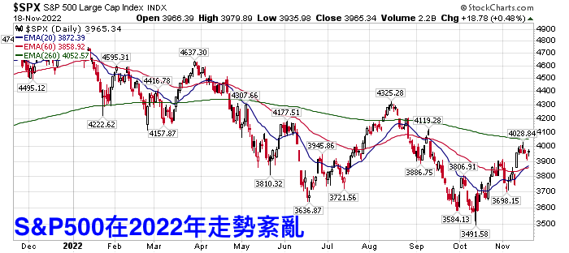
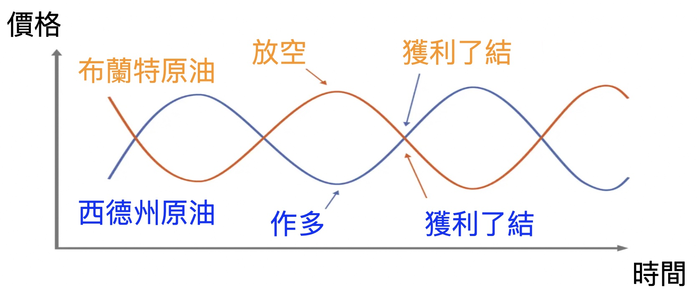
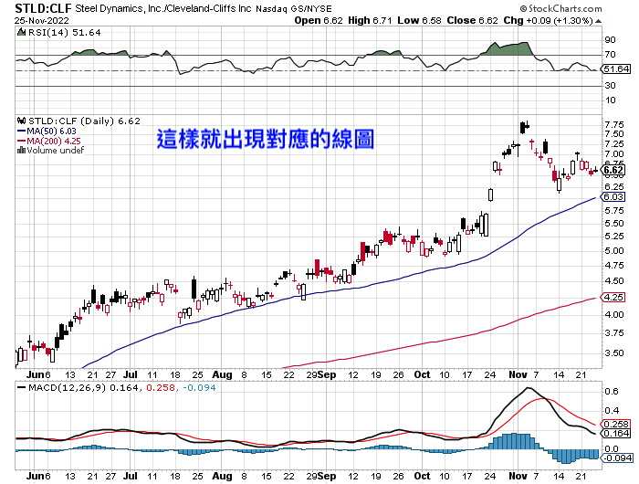

# 配對交易

## 本益比配對

「多頭市場容易炒高本益比，到了空頭市場就會現出原形。因此，買進低本益比個股，再同時放空同等金額的高本益比個股，不論市場大漲大跌，都有賺錢機會。」鄭廳宜舉例，像東洋（4105）今年每股盈餘（EPS）有機會挑戰7元以上，本益比約10倍。反觀，第一銅（2009）今年第一季EPS僅為0.02元左右，本益比30倍以上。

以目前東洋約67元，第一銅約32元配對，就可買進一張東洋，同時放空2張第一銅。同樣的道理，鄭廳宜的多空配對交易，還包括做多目前本益比不到9倍的明安（8938），同時放空一張本益比約90倍的怡利電（2497）。「就像科斯托蘭尼提出的主人與狗理論，股價終究會回歸基本面，利用這種多空配對方式度過空頭市場，心才不會慌。」

## 股市多空不明時的投資技巧 – 配對交易（或稱價差交易）解析

https://usstockinvesting.com/what-is-pairtrade/

2022年投資很難，因為S&P500的走勢紛亂。要跌跌不了太久、要漲又只漲一下下。如果你跟我一樣習慣順著趨勢做，那今年真的不容易。這時候，可以參考「配對交易（Pair Trade）」（或稱價差交易）。因為大環境雖然趨勢不明顯，但產業中仍有一些趨勢。配對交易藉由一多一空而抵銷掉大環境的紛亂，凸顯出產業中的差異。

內容目錄[2022年大盤雖然紛亂，但還是有「價差趨勢」](https://usstockinvesting.com/what-is-pairtrade/#2022年大盤雖然紛亂，但還是有「價差趨勢」)[配對交易 – 把資金分成兩半，一半買進、一半放空](https://usstockinvesting.com/what-is-pairtrade/#配對交易_–_把資金分成兩半，一半買進、一半放空)[配對交易第一種 – 價差收斂型 – 利用價差縮小而獲利](https://usstockinvesting.com/what-is-pairtrade/#配對交易第一種_–_價差收斂型_–_利用價差縮小而獲利)[收斂型配對交易 – 慎防價差突然變化！](https://usstockinvesting.com/what-is-pairtrade/#收斂型配對交易_–_慎防價差突然變化！)[配對交易第二種 – 發散型 – 利用價差擴大賺錢](https://usstockinvesting.com/what-is-pairtrade/#配對交易第二種_–_發散型_–_利用價差擴大賺錢)[發散型配對交易的好處 – （理想情況下）股市大漲大跌都能賺錢](https://usstockinvesting.com/what-is-pairtrade/#發散型配對交易的好處_–_（理想情況下）股市大漲大跌都能賺錢)[如何畫出股價比例圖 – 用Stockcharts](https://usstockinvesting.com/what-is-pairtrade/#如何畫出股價比例圖_–_用Stockcharts)[配對交易組合參考 – 作多那斯達克證交所集團，放空那斯達克100指數](https://usstockinvesting.com/what-is-pairtrade/#配對交易組合參考_–_作多那斯達克證交所集團，放空那斯達克100指數)[ETF的配對交易組合參考 – 作多標準普爾500，放空那斯達克100指數](https://usstockinvesting.com/what-is-pairtrade/#ETF的配對交易組合參考_–_作多標準普爾500，放空那斯達克100指數)[結論：股市多空不明時，可以掌握兩組價差逐漸擴大的股票組合，順著趨勢交易](https://usstockinvesting.com/what-is-pairtrade/#結論：股市多空不明時，可以掌握兩組價差逐漸擴大的股票組合，順著趨勢交易)

## 2022年大盤雖然紛亂，但還是有「價差趨勢」

2022年的大盤走勢紛亂，下圖是S&P500今年的走勢圖：

雖然現在回過頭看好像是越走越低，似乎有個趨勢，但之前可沒那麼明顯（也可能是我功力還不夠😆）如果你跟我一樣，那今年就很辛苦了，買進也不是、放空也不是，動不動就觸發停損。

但今年也有像下圖這樣的組合，五月後價格一路向上，趨勢非常明顯，很適合我們這樣習慣順著趨勢操作的人：

或許有人問：「這是哪檔股票？」，或者有人想：「經濟這麼亂的時局這種股票很危險啦，不知道什麼時候會掉下來。」

但還好，它不是股票，而是兩檔鋼鐵公司相除的比率，分別是Steel Dynamic（股票代號：STLD）和克里夫蘭鋼鐵（股票代號：CLF），我們可以「買進STLD、放空CLF」來獲利。這就是「配對交易」。

（**2022年12月23日更新：這檔組合已因克里夫蘭鋼鐵談到大單而改變趨勢、跌破季線停損**）

## 配對交易 – 把資金分成兩半，一半買進、一半放空

配對交易又有人稱作價差交易，英文是Pair Trade，也有人稱「L / S策略（Long / short）」，不管名稱如何，概念都是「把資金分成兩半，一半做多，一半放空」。

「一半做多、一半放空」可以抵銷掉大環境的風險，只留下兩個不同標的之間的價差，然後利用價差的變化來賺錢。也因為配對交易不論大環境好壞都能賺錢，所以屬於絕對報酬型策略。

然而，配對交易並不是毫無缺點，**它最大的缺點就是「賺得較少」**。

在股市一直漲、套牢也只要幾週就能獲利的大好時期，配對交易不受青睞。因為配對交易一半資金一定要做空，所以賺得絕對沒有單純買進來得多。只是，在2022年這種多空不明、股市紛亂的時期，配對交易就有用了。

但要做多什麼？放空什麼？這就因不同的哲學而異了。配對交易有兩種類型…

## 配對交易第一種 – 價差收斂型 – 利用價差縮小而獲利

這是許多避險基金在用的方式，他們尋遍市場，找到兩個價差穩定的股票或者標的，比方說布蘭特原油和西德州原油。理論上，布蘭特原油和西德州原油價差變化不大，畢竟都是石油嘛，價格應該會有個固定的範圍。

下圖是「西德州原油/布蘭特原油」的線圖，可以看到，這兩種油價的比例變動不大：

所以，當布蘭特原油跟西德州原油價差拉大的時候，我們就能賭它的價差會縮小，就可以放空上漲的標的、作多下跌的標的，像下圖這樣：

資料來源：百舜整理

只要價差最終真的會回到固定的比例，這樣就能穩定獲利。但是，世界上沒那麼好的事…

## 收斂型配對交易 – 慎防價差突然變化！

收斂型配對交易有個問題，你得緊跟這個產業、掌握這兩個標的的價差才行，免得有些事情發生了不知道，還傻傻以為未來會像過去一樣，都會回到以前的比例。結果卻越差越遠、多空都賠。

下圖一樣是西德州原油和布蘭特原油的價格比例，但時間是2008~2015年：

可以看到，當時的價差沒什麼固定範圍，十分紊亂。

因為那時候頁巖油崛起，新開採技術改變了很多事情，價差就一直變動、不再是固定比率了。這時候如果還一直想著「反正最終會回到固定範圍」，然後去放空或者作多，那就是兩邊都賠，甚至可能一次賠掉好幾年的利潤。

所以，如果你不是專業的交易員，我實在不建議你用「收斂型的配對交易」。比較適合我們的是這一種：

## 配對交易第二種 – 發散型 – 利用價差擴大賺錢

這是我今天想討論的主題，也是文章開頭那兩檔鋼鐵股組合「STLD / CLF」大漲的原因，這也最接近「順勢交易」的哲學 – 讓趨勢向前奔跑。只要趨勢還在，我們抱著這個組合即可賺錢。

為什麼兩間公司的價差會逐漸擴大呢？這要從股價的組成說起。會影響股價的因素很多，但可以概分為兩大類：「大環境」跟「公司營運」。所有同產業的公司都面臨相同的大環境，比方說疫情時各國封鎖國境，所有旅行社都很慘；或者像2021年上半年供應鏈吃緊、鋼價大漲時，所有鋼鐵廠都受惠。

只是相同的大環境下，有的公司就是比較強壯，有的就是比較慘一點，這就取決於各公司的營運狀況了。而這個時候，他們的股價雖然都下跌，但可能A公司跌10%、B公司跌20%；而當大盤大漲的時候，可能變成A公司漲15%、B公司漲10%。

大環境不會一夕之間轉變，公司營運狀況也不會突然改變。因此隨著時間過去，價差可能會越拉越開，就會像「STLD/CLF」的組合一樣，有明顯的趨勢。

（想詳細瞭解為什麼STLD / CLF會上漲的話，可以參考這篇文章：[<美股分析> 2022年至今還漲70%左右的美國 鋼鐵 股票是誰？未來鋼鐵 股票 還有機會嗎？我認為有些疑慮，因為這個原因….](https://usstockinvesting.com/us-steel-sector-introduction-and-analysis/)）

## 發散型配對交易的好處 – （理想情況下）股市大漲大跌都能賺錢

當大盤趨勢不明顯時，買進容易停損，放空也很容易被反彈給弄到停損，因此很容易兩邊都賠錢，吃力不討好。

但如果是用配對交易，理想情況下，當大盤上漲時，作多那一半會賺錢，放空那一半會賠錢，而**作多那一半的獲利，會超過放空那一半的虧損**；當大盤下跌時，作多的那一半會賠錢，放空的那一半會賺錢，此時，**做空那一半的獲利，會超過作多那一半的虧損**。

所以，大盤上漲或下跌，發散型的配對交易都可能賺錢。

只可惜，這種好事無法長久，就跟再會漲的股票總會漲完一樣。很可能價差擴大的趨勢突然變了，本來很弱的公司扭轉頹勢、沒那麼弱；本來很強的公司突然碰上麻煩、變弱了。任何情況都有可能。

**但就像傳統的順勢交易也要跌破某個條件時停損一樣（比方說跌破季線停損之類的），當兩間公司的價差趨勢改變時，同時賣出作多和做空部位，出場就好，一樣可以「截斷虧損，讓利潤向前奔跑。**」

## 如何畫出股價比例圖 – 用Stockcharts

那麼，要怎麼畫出兩個標的的價差線圖呢？用Stockcharts就可以了。

（延伸閱讀：[免費、有各種技術指標、能同時瀏覽多檔線圖的網站 – 「StockCharts」！(內附技術指標名詞中英對照)](https://usstockinvesting.com/stockcharts/)）

只要在平常輸入股票代碼的地方，輸入想配對的兩組股票代碼，然後中間用冒號隔開：

這樣就會出現線圖了：

此時就能夠加上你熟悉的指標、用你習慣的方式進出場了。

## 配對交易組合參考 – 作多那斯達克證交所集團，放空那斯達克100指數

配對交易非常靈活，除了個股之外，也可以用「強勢股vs. 大盤指數」來配對。如果某個公司就是比大盤強勢，那可以考慮「作多強勢股，放空大盤ETF」的配對組合，像是「作多那斯達克證交所集團，放空那斯達克100指數」。

那斯達克100指數（ETF股票代號：QQQ）2022年慘兮兮，因為很多半導體公司2022年都說庫存過多，3C賣得不好；其他科技股也因為升息關係跌得很兇，但那斯達克證交所集團（股票代號：NDAQ）卻好多了。

因為，那斯達克證交所不是靠賣晶片和賣軟體賺錢，而是靠成交量和大數據賺錢。當股票忽漲忽跌時，表示波動很大，對做短線的人來說反而是好事，所以成交量不會跟著掉（但是當經濟衰退、資金離開股市時成交量也會大幅下滑，此時證交所股票一樣很慘，千萬要留意）。

（延伸閱讀：[美國股市指數中的四大指數有兩個是它的 – 那斯達克證券交易所集團](https://usstockinvesting.com/introduction-of-ndaq/)）

下圖是NDAQ / QQQ的線圖，可以看到，NDAQ/QQQ在2022年下半年一路往上漲：

資料來源：Stockchart

此時我們就可以用以往股市大漲時期的習慣方式來交易它，然後等到趨勢反轉時停損。如果你有心目中的強勢股，也可以拿來和放空大盤的ETF作配對交易組合。

## ETF的配對交易組合參考 – 作多標準普爾500，放空那斯達克100指數

除了個股之外，ETF也可以配對交易。像2022年科技股因為半導體庫存增加和解封等關係而大跌，科技股就比其他類股弱勢許多。2022年SPY / QQQ的線圖就像下圖這樣，一路往上漲：

此時，可以考慮把資金分兩半，一半作多標準普爾500指數ETF（股票代號：SPY），一半放空那斯達克100指數ETF（股票代號：QQQ）（或者直接買一倍放空QQQ的ETF，股票代號：PSQ），等到SPY / QQQ的走勢轉變時停損。

至於為什麼SPY / QQQ會一路上漲呢？是因為指數計算方式的關係，科技股佔QQQ的權重比SPY大多了，所以科技股弱勢時，對QQQ的影響比SPY大。想詳細瞭解，可以參考這篇文章：「[美國 股市 指數 懶人包，一文解析及比較道瓊工業指數、S&P500指數、那斯達克指數](https://usstockinvesting.com/blog-post_8/)」。

## 結論：股市多空不明時，可以掌握兩組價差逐漸擴大的股票組合，順著趨勢交易

大盤（像美股就是S&P500）多空不明、趨勢不明顯，但產業中卻仍有明顯的趨勢。所以可以挑選價差逐漸擴大的兩檔股票，作多強勢股、放空弱勢股，然後搭配習慣的交易技巧進出場（像我的話就是跌破季線賣出、或者跌破前波低點賣出）。

至於利用價差收斂賺錢的配對交易，就留給專業的交易員們吧！那個要時時刻刻注意產業變化才行，如果平常還有其他工作，很可能會多空雙賠，吃力不討好。

---

## 【觀念分享】
交易策略有很多類型，除了上次介紹的單邊方向性策略之外，還有配對交易、套利交易、資產配置等等。
從廣義上來說，方向性交易是指做單一方向，像是做多臺指期，需100%承受反向波動的風險；配對交易是指同時做多A商品+做空B商品，像是作多臺指期+做空電子期。這時可能有人會想，既然看多臺指，為何還要多此一舉？從我的觀點來看，主要有幾個理由：
一、避開系統性風險
二、單商品行情不明確，不過商品間強弱勢明確
三、高相關性商品之間偏差值高，有套利空間
以下簡單介紹幾種配對交易策略

- 兩個商品之間做發散：做多強勢+做空弱勢，相關係數最好在0.6~0.8之間比較適合這種做法。
- 兩個商品做收斂：做空強勢+做多逆勢。收斂是一種逆勢思維，適合在高度相關性的商品上，像是臺灣期交所的臺指期與新加坡交易所的摩臺指，兩者的標的物極類似，且相關係數長年保持在0.9以上。
- 套利策略：當商品之間出現價格不合理的狀況，就可以在無風險的狀況下套取利潤。最常見的就是利用選擇權的Black-Scholes Model來做。
- 上下游產品之間的價差：原油的裂解價差(crack spread)與黃豆的榨壓價差(Crush Spread)，由於臺灣較少人做這類型策略，有興趣的可以自行google。
  下次將介紹投資組合與資產配置，敬請期待