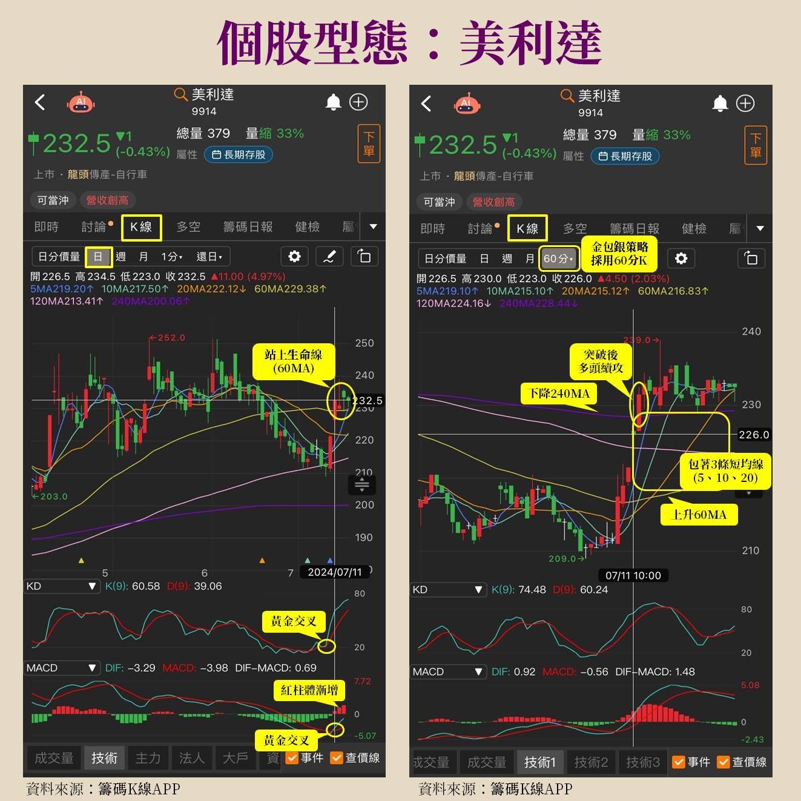

# 金包銀策略（莎拉 Sara Wang・新式型態學）

> 資料來源：《財經鈔能力》20261005 趙慶翔 ft. 莎拉 節目逐字稿 + 網路公開資料（見文末）
> 整理日期：2026-10-07

---

## 1. 背景

- **創作者**：莎拉（Sara Wang），自稱股市新手時期一年虧約 500 萬，2019–2021 自創「新式型態學」，2022 年起開始推廣。
- **著作**：《新式型態學：175張圖×22種多空K棒組合×8種獨創型態》（2024/07 出版）。
- **新式型態學的 8 種獨創型態**
  - 多方 5 種：**金包銀**、湯姆士迴旋、N字勾、小碎步、有底撐
  - 空方 3 種：穿心箭、下樓梯、打地鼠
- **節目中的宣稱**：「大盤好的時候，勝率甚至可以到八九成」，且需「週線／日線都在相對低檔」時出現（**作者自述，無公開回測佐證**）。

---

## 2. 名稱由來

> 「長天期包這個短天期，把 K 棒包在中間，錢就來了，所以叫做金包銀。」

- 「金」：上方的長天期均線（120MA／240MA）＋下方的生命線（60MA）
- 「銀」：被夾在中間的短均線（5／10／20MA）與 K 棒

---

## 3. 均線定義

| 名稱 | 均線 | 角色 |
| --- | --- | --- |
| 短均線 | 5MA、10MA、20MA | 被包在中間的「銀」 |
| **生命線** | **60MA**（一般稱季線） | 多空分界：跌破＝空方思考、站上＝可能轉多 |
| 半年線 | 120MA | 上方壓力 |
| 年線 | 240MA | 上方壓力 |

---

## 4. 型態條件（以 60 分 K 為主）

CMoney 官方文章的定義：

> 「需採用 **60 分 K** 資料頻率來觀察，主要特徵為：**上方有下降趨勢壓力線（240MA 或 120MA）**，**下方有正在往上勾的生命線（60MA）**，中間包著**三條短均線（5、10、20MA）**。」

節目逐字稿補充的辨識步驟：

1. **前段下跌**：股價先經歷一段下降，跌到某位置「好像跌不動」。
2. **生命線走平上彎**：60MA 由下彎轉為「趨平、準備上彎」（**要記得均線要上彎**）。
3. **K 棒站上生命線**。
4. **頭上有長天期均線**：120MA 或 240MA 仍在上方（且往下）。
5. **來回震盪**：K 棒在 60MA 與 120/240MA 之間「來回來回」、震盪向上 → 進入「金包銀範圍」，代表準備進入起漲。
6. **突破**：最後往上突破長天期均線，之後「長出一大段」。

### 示意圖



圖片來源：[CMoney〈第一屆籌碼 K 線投資競賽：Sara Wang 新式型態學實戰教學〉](https://cmnews.com.tw/article/cmoney-0ee87bbd-d95e-11ef-b194-c4a84676081f)。

```text
  ────────────────╲______________  ← 120MA / 240MA（下降壓力）
         ╱╲  ╱╲ ╱╲  ╱  ← 突破進場
   K棒 ╱  ╲╱  ╲╱  ╲╱       5/10/20MA 被包在中間
  ______________╱────────────────  ← 60MA 生命線（走平上彎）
```

---

## 5. 進場、確認與出場

### 進場

- **進場訊號**：短均線（5/10/20MA）**多頭排列**並**突破 240MA**（CMoney 文章）。
- 節目中說法：K 棒進入生命線、開始金包銀時即可留意，「不用等起噴」，可抓到「起漲中的起漲」。

### 確認指標

- KD 黃金交叉、MACD 黃金交叉。

### 風險／出場

- 留意 **KD 高檔死亡交叉**。
- **股價跌破 60MA（生命線）**。
- 型態完成後回測：觀察回測是否守住生命線／240MA，「回測不破生命線位置，會是一個多方時機」。

---

## 6. 多週期搭配（節目重點）

| 週期 | 用途 |
| --- | --- |
| **60 分 K** | 找金包銀（第一時間卡位） |
| **日 K** | 金包銀之後是否走成「**正多頭開花**」（均線由短到長依序排列並發散，像花盛開） |
| **週 K / 月 K** | 判斷位階：股價相對高時「一定要轉到週去看」 |

- **低檔出現金包銀**（週線也在底部剛起漲）→「後面一定會噴一大段」，勝率最高。
- **高檔出現金包銀** → 可能只走一段就休息。
- **乖離過大**（均線很發散、正乖離大）→ 不宜再進場。
- 金包銀**不只出現一次**，上漲過程中也可能再出現，需看位階高低。

---

## 7. 搭配的其他觀念

### 型態對比

- **同一檔不同時期**走法相似。
- **同產業不同個股**：例如南亞科 vs 華邦電（記憶體）、大立光／先進光／玉晶光（光學）。
  若同產業同時都出現金包銀 → 可能整個族群發動；只有一檔獨強 → 可能是個別故事。

### 上升通道

- 漲一段休息、跌不破又往上 → 可沿通道來回操作。

### 基本面／籌碼／消息面

- 新式型態學強調型態需搭配基本面、籌碼面（例：大立光老闆釋出正面看法、聯電發可轉債＋與英特爾合作題材）。
- CMoney 文章：進場時機找「**型態完成 + 籌碼集中**」雙重訊號。

---

## 8. 出場判斷（節目以國巨為例的「起跌點」）

1. **高檔爆大量黑 K**：之後 **3–4 天內必須再創高「表態」**。
2. 若 3–4 天無法創高、連續黑 K → **5 日均線下彎**。
3. K 棒落到 5MA 下方 → **蓋頭反壓**（支撐變壓力）→ **跌破後一定要出場**。
4. 之後可能形成 **A 型反轉**（怎麼上去、怎麼下來）。
5. 反彈時改看**壓力**：能否站回生命線（60MA）；站不回去 → 再下跌機率高。
6. 指標：KD 未黃金交叉只低檔鈍化，或反彈到生命線附近 KD 死亡交叉 → 短線反彈結束。

---

## 9. 節目提及的案例（僅為節目內容，非建議）

| 個股 | 節目描述 |
| --- | --- |
| 群創 | 60 分 K 金包銀 → 日線正多頭開花；週／月線仍在上升通道 |
| 大立光 | 與群創型態相似，60 分金包銀突破後日線正多頭開花 |
| 環球晶 | 漲價題材，有出現金包銀；之後走上升通道，6 月底 7 月初乖離過大後回落 |
| 聯電 | 之前已發生金包銀，目前休息降溫；可轉債＋英特爾合作題材 |
| 南亞科／華邦電 | 同產業型態對比，同時出現金包銀 |
| 先進光 | 進入金包銀後噴一大段 |
| 國巨 | 先日線金包銀上漲，後爆量、跌破 5MA 走 A 型反轉（出場範例） |
| 長榮／陽明 | 航運類股，同樣用金包銀策略；注意除息跳空需看還原日線 |

---

## 10. 可量化版本（自行整理，供回測參考）

```text
週期：60 分 K（或日 K 簡化版）
條件 A  前段下跌：60MA 在 N 根前為下彎
條件 B  生命線上彎：MA60[t] > MA60[t-k]（剛轉正斜率）
條件 C  上方壓力：MA120 或 MA240 > 收盤價，且該長均線斜率 < 0
條件 D  被包住：MA60 < MA5, MA10, MA20 < max(MA120, MA240)
條件 E  震盪：K 棒在 [MA60, MA120/240] 區間停留 ≥ M 根
進場  ：MA5 > MA10 > MA20 且收盤突破 MA240（或 MA120）
確認  ：KD / MACD 黃金交叉（選用）
出場  ：收盤跌破 MA60；或高檔爆量黑K後 3–4 根未創高且跌破 MA5
濾網  ：週線位階低（例如收盤距 52 週低點 < X%）、大盤多頭
```

> ⚠️ 上述量化參數（N、k、M、X）為整理者自訂，原作者未公開精確數值；「勝率八九成」為作者自述，未經獨立回測驗證。

---

## 參考資料

- 節目逐字稿：《1招抓飆股勝率九成！這訊號進場2個月賺400萬！》財經鈔能力 20261005（本資料夾 `.txt`）
- [TVBS 新聞：1招抓飆股勝率九成！這訊號進場2個月賺400萬！](https://news.tvbs.com.tw/money/4031871)
- [CMoney：第一屆籌碼K線投資競賽 DAY2 Sara Wang 新式型態學實戰教學](https://cmnews.com.tw/article/cmoney-0ee87bbd-d95e-11ef-b194-c4a84676081f)（金包銀定義來源）
- [CMoney：新式型態學+籌碼K線，選股操作密技 - Sara Wang](https://cmnews.com.tw/article/sara-591754e1-d8cb-11ef-8f0a-a4905e7d8ab8)
- [鉅亨網：莎拉 韭菜翻身技術分析達人 靠新式型態學 每年翻倍賺](https://news.cnyes.com/news/id/5619060)
- [金石堂：《新式型態學》書籍頁](https://www.kingstone.com.tw/basic/2015630790144/)
- [博客來：《新式型態學》](https://www.books.com.tw/products/0010993178)
- [莎拉 Sara・新式型態學（CMoney）](https://sara.cmoney.tw/)
- [新式型態學 學院](https://saraacademy.org/)
