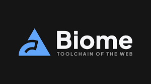

# 2026 年將佔據主導地位的頂級開源專案

**2025 年已經夠瘋狂了。2026 年？只會更瘋狂。**

開源生態系統正蓬勃發展，創新層出不窮。人工智慧正在重塑開發工作流程。新的框架正在挑戰傳統模式。開發者們正在建構各種工具，讓我們的生活變得無比輕鬆、方便。

以下是 2026 年你需要關注（並可能需要貢獻）的頂級開源專案。

## Biome——一款基於 Rust 的工具鏈，它正在吞噬 JavaScript

[Biome](https://biomejs.dev/) 不僅僅是另一個程式碼檢查工具。它完全可以取代 ESLint、Prettier 以及你一半的建置流程。

**重要性**：速度比 ESLint 快 100 倍。用 Rust 編寫。零配置。JavaScript 生態系統亟需一場效能革命，而 Biome 正引領這場革命。

**值得關注**：各大框架和公司對緩慢的持續整合管道的需求日益增長。

## Bun——Node.js，但要快速執行

[Bun](https://bun.com/) 在 2023 年達到 1.0 版本。到 2026 年，它將走向主流。

**重要性**：速度比 Node.js 快 3 倍。內建打包器、轉譯器和套件管理器。許多公司已經開始遷移生產工作負載。

**值得關注**：主流框架的支援與企業級應用。Node.js 的壟斷時代即將結束。

## Deno 2.0——王者歸來

[Deno](https://deno.com/) 並沒有消亡，它正在進化。2.0 版本帶來了 NPM 相容性、效能提升，並更加重視開發者體驗。

**重要性**：TypeScript 優先。預設安全。零配置。Node.js 本該具備的一切。

**值得關注**：在無伺服器和邊緣運算環境中的應用日益廣泛。

## Zed——專為人工智慧打造的程式碼編輯器

[Zed](https://zed.dev/) 由 Atom 的開發者打造，一款專為人工智慧時代設計的多人程式碼編輯器。

**重要性**：速度極快（基於 Rust）。內建 AI 協作。即時結對程式設計。這就是如今 VS Code 的雛形。

**關注**：GitHub Copilot 整合和使遠距辦公真正發揮作用的企業功能。

## Turso——邊緣 SQLite

[Turso](https://turso.tech/) 正在將 SQLite 打造成分散式應用程式的一等公民。

**重要性**：原生邊緣資料庫。多區域複製。具備 SQLite 的全球擴充效能。無廠商鎖定。

**值得關注**：人工智慧應用和邊緣運算平台的採用。資料庫層正在向邊緣遷移。

## Ollama——本地執行 LLM 課程

[Ollama](https://ollama.com/) 讓您可以在筆記型電腦上執行 Llama 3、Mistral 和其他 LLM 程式。無需 API 金鑰，也無需支付雲端費用。

**重要性**：以隱私為先的人工智慧。零延遲。完美適用於開發和敏感資料處理。人工智慧的未來是混合型的。

**請關注**：與開發工具和完全離線執行的 AI 驅動型編碼助理整合。

## Ruff——以 Rust 速度進行 Python Linting

[Ruff](https://docs.astral.sh/ruff/) 之於 Python，就像 Biome 之於 JavaScript——一個用 Rust 寫的超快程式碼檢查工具。

**重要性**：比 Flake8 快 10-100 倍。可直接替換。Python 的工具鏈長期以來速度太慢。

**敬請期待**：它將成為 Python 專案的預設程式碼檢查工具。Python 生態系統終於迎來了快速工具。

## Astro——內容管理的 Web 框架

[Astro](https://astro.build/) 發布了 4.0 版本，重新定義了我們建立內容豐富的網站的方式。

**重要性**：預設不使用 JavaScript。相容於所有框架。非常適合部落格、行銷網站和文件。速度才是王道。

**關注**：大型企業從笨重框架遷移的情況。內容網站不需要 React 水合。

## Continue——開源副駕駛替代方案

[Continue](https://www.continue.dev/) 為任何編輯器、任何 LLM、任何程式碼庫帶來 AI 編碼輔助功能。

**重要性**：開源。注重隱私。支援本地模型。不局限於單一供應商的生態系統。

**注意**：無法將程式碼傳送給第三方的公司對自訂模型進行微調以及企業採用該模型的情況。

---

## 共同點

看規律了嗎？**效能、開發者體驗和 AI 整合**

2026 年的獲獎專案並非只是略有改進，而是**提升了十倍**。它們挑戰現有格局，讓開發變得更快、更簡單、更方便。
