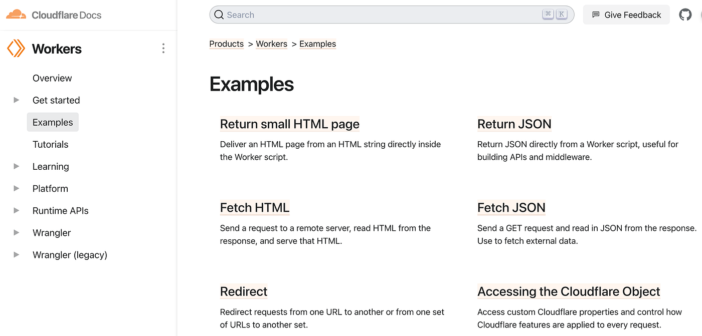
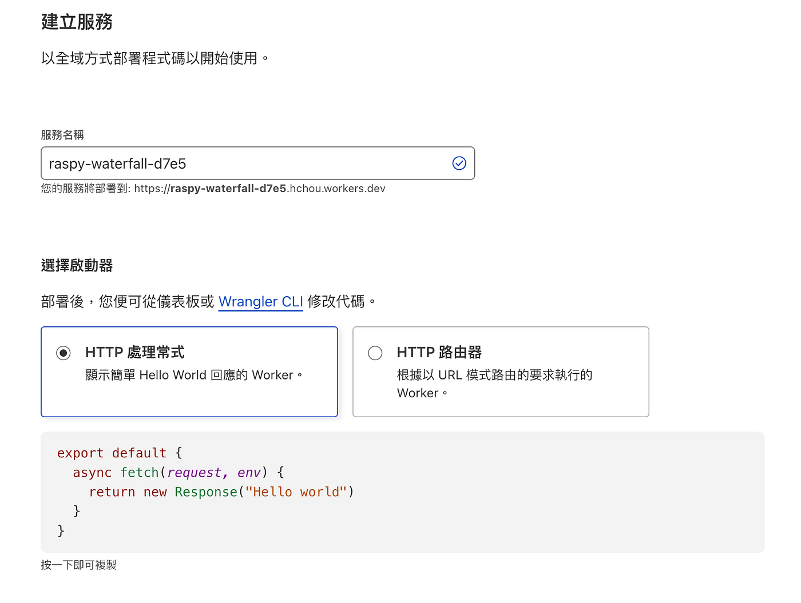
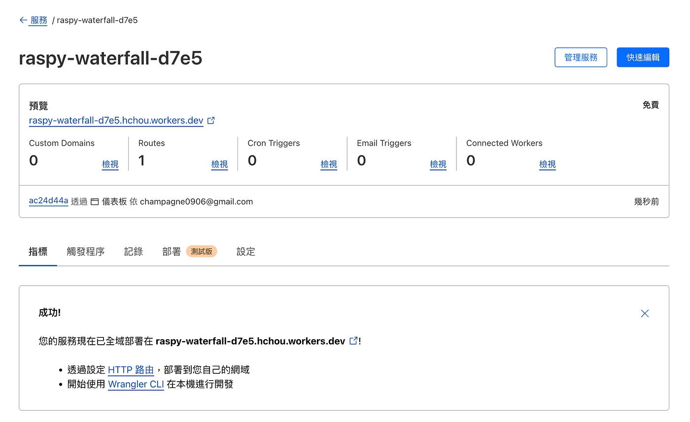
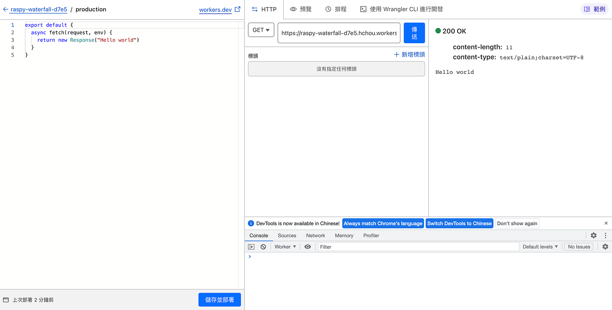
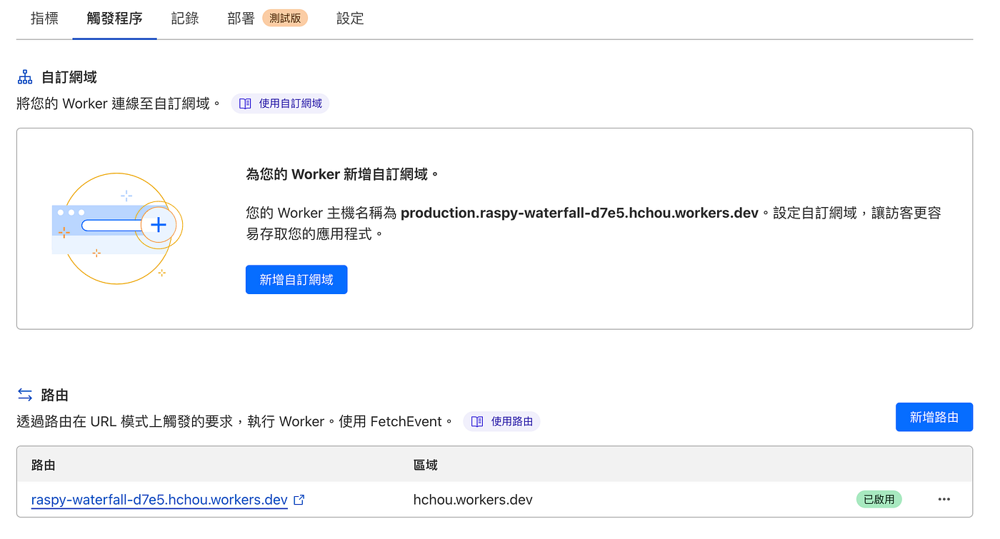
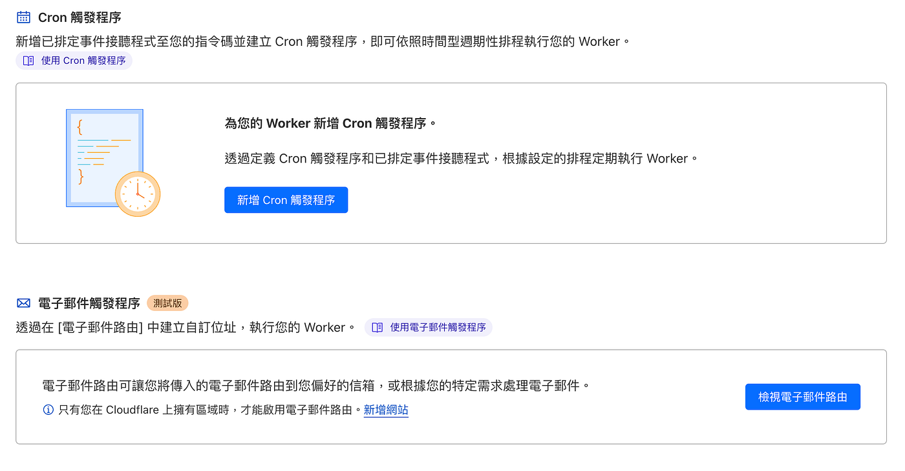
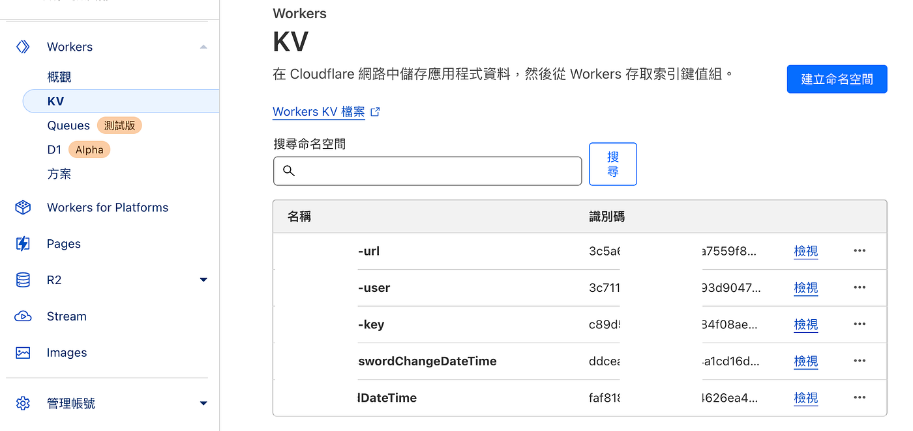
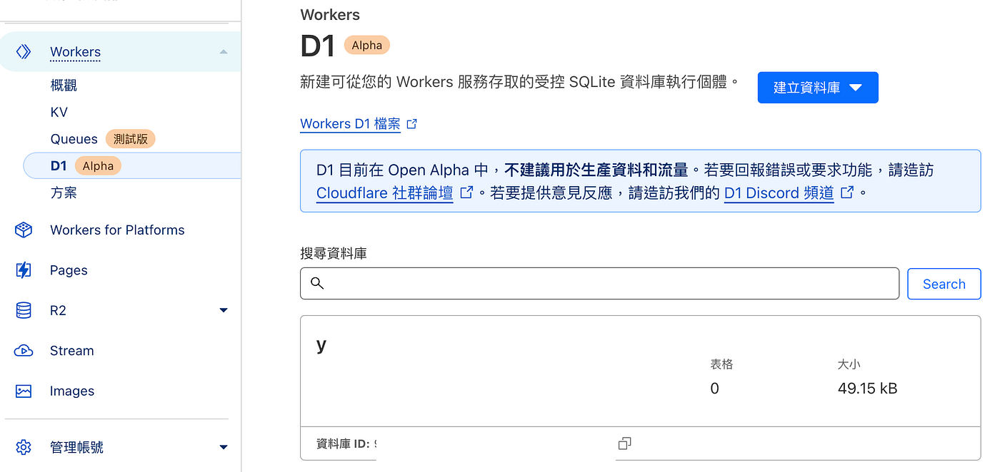

# [Day23] Workers — 30 天入門 Cloudflare

Cloudflare Workers 是一個 serverless 運算平台，能讓開發人員使用 V8 引擎的 JavaScript 來撰寫和部署網站的腳本，並且能夠在 Cloudflare 網路中執行這些腳本。

Workers 具有以下功能：

1.  無伺服器運算：使用 Workers 可以省去搭建伺服器的複雜性，並且僅在需要時使用運算資源，有效地降低了成本。
2.  全球節點：Cloudflare 在全球設有超過 200 個節點，能夠為使用者提供快速的全球網路連線。
3.  簡單易用：Workers 非常容易上手，並且具有豐富的 API 和工具，讓開發人員能夠更加輕鬆地編寫腳本。
4.  安全可靠：Workers 執行於 Cloudflare 的安全環境中，提供強大的安全性能和 DDoS 防護，確保您的應用程式在網路上安全可靠。

使用 Workers 可以幫助開發人員實現很多功能，例如：

1.  **CDN 邊緣緩存**：使用 Workers 可以自定義網頁緩存規則，以加速網站的載入速度。
2.  **API 閘道器**：使用 Workers 可以輕鬆實現 API 網關和轉換器，以提高 API 的效率和安全性。
3.  **網路安全**：使用 Workers 可以實現自定義的安全策略，包括濾波、黑名單、IP 防火牆等，以保護您的應用程序免受攻擊。
4.  **動態內容**：使用 Workers 可以動態地生成網頁內容，實現更加靈活的內容交付方式。

### Workers Playground

Cloudflare 提供 [Workers Playground](https://cloudflareworkers.com/?_ga=2.113416773.375518394.1682868071-1311208282.1674225029#36ebe026bf3510a2e5acace89c09829f:about:blank) 可以在線上練習與嘗試 Workers，如這是一個小練習，使用者瀏覽網站的時候都會回傳 Hello World。

### 語法範例

[Cloudflare Workers 文件](https://developers.cloudflare.com/workers/examples/)提供大量的範例，讓我們可以學習如何撰寫 Cloudflare 語法，並可以看看範例可以做到哪些功能，比方說可以用來做反向代理、回傳 JSON、自動跳轉、身份驗證等功能。

### Workers 設定

我們到 Cloudflare 後台選擇「Workers」中「建立服務」。

選擇一個服務類型，隨便選一個，因為之後可以再改程式碼就好，這裡只是給一個初始範例。

跟 Cloudflare Pages 一樣，Cloudflare 會提供服務一個網誌 .workers.dev 結尾，我們點選右上角「快速編輯」。

接下來就可以撰寫程式碼，並進行線上測試。

### 觸發程序

撰寫完成程式碼後，就可以用 Workers 提供的網址進行測試。我們到觸發條件可以自訂網域與設定路由，兩者差異在自訂網域是整個 Domain 綁到 Workers 上；路由則是該網域原本已經有網頁服務，將特定路徑的路由改到 Workers 上。

另外也可以撰寫 Cron 定時觸發與 Email 觸發等功能。

與 Cloudflare Pages 相同可以自訂義變數。

### KV

Cloudflare Workers KV 是 Cloudflare Workers 所提供的一項服務，讓使用者可以透過這個 Key-Value 存儲系統來儲存和讀取資料，並且支援標準的 GET, PUT, LIST 和 DELETE 操作。

這個服務的優勢在於它能夠快速地讀寫和儲存大量資料。使用者可以透過 Cloudflare Workers KV API 來進行操作，並且可以與 Cloudflare Workers 一起使用，使得開發者可以建立出高效能且即時的網站。

### D1

Cloudflare Workers D 是基於 SQLite 的關聯式資料庫。通過導入數據或定義表並在 Worker 中或通過我們的 API 編寫查詢，只需幾個快速步驟即可創建整個資料庫。D1 目前在 Open Alpha 中，不建議用於生產資料和流量。

### 結語

Cloudflare Workers 是一個強大而靈活的運算平台，能夠幫助開發人員實現很多功能，可以結合 KV、D1 進行開發，並且提供了快速、安全、簡單易用的開發體驗，是一個值得開發人員學習和使用的工具。

**▶ 閱讀更多本系列文：**[**30 天入門 Cloudflare**](https://medium.com/chouhsiang/cloudflare-30-days/home)

**▶ 下一篇：**[**[Day24] R2, Stream, Images — 30 天入門 Cloudflare**](https://medium.com/chouhsiang/30%E5%A4%A9%E6%90%9E%E6%87%82cloudflare-24-r2-stream-images-36701c3e7f81)