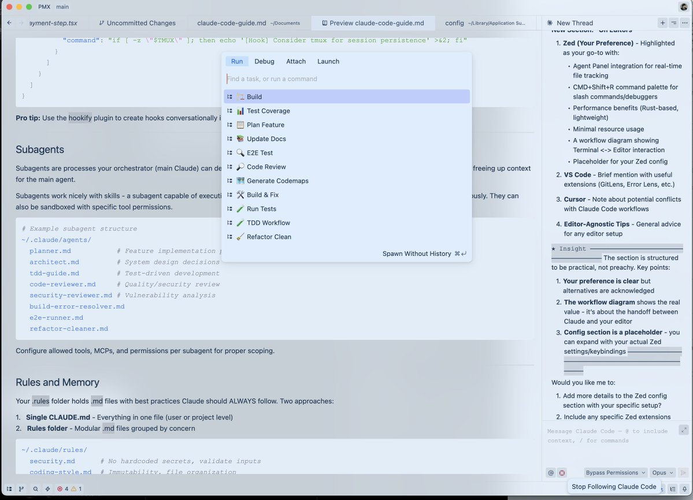

# Claude Code 简明指南


***

**自 2 月实验性推出以来，我一直是 Claude Code 的忠实用户，并凭借 [zenith.chat](https://zenith.chat) 与 [@DRodriguezFX](https://x.com/DRodriguezFX) 一起赢得了 Anthropic x Forum Ventures 的黑客马拉松——完全使用 Claude Code。**

经过 10 个月的日常使用，以下是我的完整设置：技能、钩子、子代理、MCP、插件以及实际有效的方法。

***

## 技能和命令

技能就像规则，受限于特定的范围和流程。当你需要执行特定工作流时，它们是提示词的简写。

在使用 Opus 4.5 长时间编码后，你想清理死代码和松散的 .md 文件吗？运行 `/refactor-clean`。需要测试吗？`/tdd`、`/e2e`、`/test-coverage`。技能也可以包含代码地图——一种让 Claude 快速浏览你的代码库而无需消耗上下文进行探索的方式。


*将命令链接在一起*

命令是通过斜杠命令执行的技能。它们有重叠但存储方式不同：

* **技能**: `~/.claude/skills/` - 更广泛的工作流定义
* **命令**: `~/.claude/commands/` - 快速可执行的提示词

```bash
# Example skill structure
~/.claude/skills/
  pmx-guidelines.md      # Project-specific patterns
  coding-standards.md    # Language best practices
  tdd-workflow/          # Multi-file skill with README.md
  security-review/       # Checklist-based skill
```

***

## 钩子

钩子是基于触发的自动化，在特定事件发生时触发。与技能不同，它们受限于工具调用和生命周期事件。

**钩子类型：**

1. **PreToolUse** - 工具执行前（验证、提醒）
2. **PostToolUse** - 工具完成后（格式化、反馈循环）
3. **UserPromptSubmit** - 当你发送消息时
4. **Stop** - 当 Claude 完成响应时
5. **PreCompact** - 上下文压缩前
6. **Notification** - 权限请求

**示例：长时间运行命令前的 tmux 提醒**

```json
{
  "PreToolUse": [
    {
      "matcher": "tool == \"Bash\" && tool_input.command matches \"(npm|pnpm|yarn|cargo|pytest)\"",
      "hooks": [
        {
          "type": "command",
          "command": "if [ -z \"$TMUX\" ]; then echo '[Hook] Consider tmux for session persistence' >&2; fi"
        }
      ]
    }
  ]
}
```


*在 Claude Code 中运行 PostToolUse 钩子时获得的反馈示例*

**专业提示：** 使用 `hookify` 插件以对话方式创建钩子，而不是手动编写 JSON。运行 `/hookify` 并描述你想要什么。

***

## 子代理

子代理是你的编排器（主 Claude）可以委托任务给它的、具有有限范围的进程。它们可以在后台或前台运行，为主代理释放上下文。

子代理与技能配合得很好——一个能够执行你技能子集的子代理可以被委托任务并自主使用这些技能。它们也可以用特定的工具权限进行沙盒化。

```bash
# Example subagent structure
~/.claude/agents/
  planner.md           # Feature implementation planning
  architect.md         # System design decisions
  tdd-guide.md         # Test-driven development
  code-reviewer.md     # Quality/security review
  security-reviewer.md # Vulnerability analysis
  build-error-resolver.md
  e2e-runner.md
  refactor-cleaner.md
```

为每个子代理配置允许的工具、MCP 和权限，以实现适当的范围界定。

***

## 规则和记忆

你的 `.rules` 文件夹包含 `.md` 文件，其中是 Claude 应始终遵循的最佳实践。有两种方法：

1. **单一 CLAUDE.md** - 所有内容在一个文件中（用户或项目级别）
2. **规则文件夹** - 按关注点分组的模块化 `.md` 文件

```bash
~/.claude/rules/
  security.md      # No hardcoded secrets, validate inputs
  coding-style.md  # Immutability, file organization
  testing.md       # TDD workflow, 80% coverage
  git-workflow.md  # Commit format, PR process
  agents.md        # When to delegate to subagents
  performance.md   # Model selection, context management
```

**规则示例：**

* 代码库中不使用表情符号
* 前端避免使用紫色色调
* 部署前始终测试代码
* 优先考虑模块化代码而非巨型文件
* 绝不提交 console.log

***

## MCP（模型上下文协议）

MCP 将 Claude 直接连接到外部服务。它不是 API 的替代品——而是围绕 API 的提示驱动包装器，允许在导航信息时具有更大的灵活性。

**示例：** Supabase MCP 允许 Claude 提取特定数据，直接在上游运行 SQL 而无需复制粘贴。数据库、部署平台等也是如此。


*Supabase MCP 列出公共模式内表的示例*

**Claude 中的 Chrome：** 是一个内置的插件 MCP，允许 Claude 自主控制你的浏览器——点击查看事物如何工作。

**关键：上下文窗口管理**

对 MCP 要挑剔。我将所有 MCP 保存在用户配置中，但**禁用所有未使用的**。导航到 `/plugins` 并向下滚动，或运行 `/mcp`。


*使用 /plugins 导航到 MCP 以查看当前安装了哪些插件及其状态*

在压缩之前，你的 200k 上下文窗口如果启用了太多工具，可能只有 70k。性能会显著下降。

**经验法则：** 在配置中保留 20-30 个 MCP，但保持启用状态少于 10 个 / 活动工具少于 80 个。

```bash
# Check enabled MCPs
/mcp

# Disable unused ones in ~/.claude.json under projects.disabledMcpServers
```

***

## 插件

插件将工具打包以便于安装，而不是繁琐的手动设置。一个插件可以是技能和 MCP 的组合，或者是捆绑在一起的钩子/工具。

**安装插件：**

```bash
# Add a marketplace
# mgrep plugin by @mixedbread-ai
claude plugin marketplace add https://github.com/mixedbread-ai/mgrep

# Open Claude, run /plugins, find new marketplace, install from there
```


*显示新安装的 Mixedbread-Grep 市场*

**LSP 插件** 如果你经常在编辑器之外运行 Claude Code，则特别有用。语言服务器协议为 Claude 提供实时类型检查、跳转到定义和智能补全，而无需打开 IDE。

```bash
# Enabled plugins example
typescript-lsp@claude-plugins-official  # TypeScript intelligence
pyright-lsp@claude-plugins-official     # Python type checking
hookify@claude-plugins-official         # Create hooks conversationally
mgrep@Mixedbread-Grep                   # Better search than ripgrep
```

与 MCP 相同的警告——注意你的上下文窗口。

***

## 技巧和窍门

### 键盘快捷键

* `Ctrl+U` - 删除整行（比反复按退格键快）
* `!` - 快速 bash 命令前缀
* `@` - 搜索文件
* `/` - 发起斜杠命令
* `Shift+Enter` - 多行输入
* `Tab` - 切换思考显示
* `Esc Esc` - 中断 Claude / 恢复代码

### 并行工作流

* **分叉** (`/fork`) - 分叉对话以并行执行不重叠的任务，而不是在队列中堆积消息
* **Git Worktrees** - 用于重叠的并行 Claude 而不产生冲突。每个工作树都是一个独立的检出

```bash
git worktree add ../feature-branch feature-branch
# Now run separate Claude instances in each worktree
```

### 用于长时间运行命令的 tmux

流式传输和监视 Claude 运行的日志/bash 进程：

https://github.com/user-attachments/assets/shortform/07-tmux-video.mp4

```bash
tmux new -s dev
# Claude runs commands here, you can detach and reattach
tmux attach -t dev
```

### mgrep > grep

`mgrep` 是对 ripgrep/grep 的显著改进。通过插件市场安装，然后使用 `/mgrep` 技能。适用于本地搜索和网络搜索。

```bash
mgrep "function handleSubmit"  # Local search
mgrep --web "Next.js 15 app router changes"  # Web search
```

### 其他有用的命令

* `/rewind` - 回到之前的状态
* `/statusline` - 用分支、上下文百分比、待办事项进行自定义
* `/checkpoints` - 文件级别的撤销点
* `/compact` - 手动触发上下文压缩

### GitHub Actions CI/CD

使用 GitHub Actions 在你的 PR 上设置代码审查。配置后，Claude 可以自动审查 PR。


*Claude 批准一个错误修复 PR*

### 沙盒化

对风险操作使用沙盒模式——Claude 在受限环境中运行，不影响你的实际系统。

***

## 关于编辑器

你的编辑器选择显著影响 Claude Code 的工作流。虽然 Claude Code 可以在任何终端中工作，但将其与功能强大的编辑器配对可以解锁实时文件跟踪、快速导航和集成命令执行。

### Zed（我的偏好）

我使用 [Zed](https://zed.dev) —— 用 Rust 编写，所以它真的很快。立即打开，轻松处理大型代码库，几乎不占用系统资源。

**为什么 Zed + Claude Code 是绝佳组合：**

* **速度** - 基于 Rust 的性能意味着当 Claude 快速编辑文件时没有延迟。你的编辑器能跟上
* **代理面板集成** - Zed 的 Claude 集成允许你在 Claude 编辑时实时跟踪文件变化。无需离开编辑器即可跳转到 Claude 引用的文件
* **CMD+Shift+R 命令面板** - 快速访问所有自定义斜杠命令、调试器、构建脚本，在可搜索的 UI 中
* **最小的资源使用** - 在繁重操作期间不会与 Claude 竞争 RAM/CPU。运行 Opus 时很重要
* **Vim 模式** - 完整的 vim 键绑定，如果你喜欢的话


*使用 CMD+Shift+R 调出带有自定义命令下拉菜单的 Zed 编辑器。右下角的靶心图标表示跟随模式已启用。*

**编辑器无关提示：**

1. **分割你的屏幕** - 一侧是带 Claude Code 的终端，另一侧是编辑器
2. **Ctrl + G** - 在 Zed 中快速打开 Claude 当前正在处理的文件
3. **自动保存** - 启用自动保存，以便 Claude 的文件读取始终是最新的
4. **Git 集成** - 使用编辑器的 git 功能在提交前审查 Claude 的更改
5. **文件监视器** - 大多数编辑器自动重新加载更改的文件，请验证是否已启用

### VSCode / Cursor

这也是一个可行的选择，并且与 Claude Code 配合良好。你可以使用终端格式，通过 `\ide` 与你的编辑器自动同步以启用 LSP 功能（现在与插件有些冗余）。或者你可以选择扩展，它更集成于编辑器并具有匹配的 UI。


*VS Code 扩展为 Claude Code 提供了原生图形界面，直接集成到你的 IDE 中。*

***

## 我的设置

### 插件

**已安装：**（我通常一次只启用其中的 4-5 个）

```markdown
ralph-wiggum@claude-code-plugins       # 循环自动化
frontend-design@claude-code-plugins    # UI/UX 模式
commit-commands@claude-code-plugins    # Git 工作流
security-guidance@claude-code-plugins  # 安全检查
pr-review-toolkit@claude-code-plugins  # PR 自动化
typescript-lsp@claude-plugins-official # TS 智能
hookify@claude-plugins-official        # Hook 创建
code-simplifier@claude-plugins-official
feature-dev@claude-code-plugins
explanatory-output-style@claude-code-plugins
code-review@claude-code-plugins
context7@claude-plugins-official       # 实时文档
pyright-lsp@claude-plugins-official    # Python 类型
mgrep@Mixedbread-Grep                  # 更好的搜索

```

### MCP 服务器

**已配置（用户级别）：**

```json
{
  "github": { "command": "npx", "args": ["-y", "@modelcontextprotocol/server-github"] },
  "firecrawl": { "command": "npx", "args": ["-y", "firecrawl-mcp"] },
  "supabase": {
    "command": "npx",
    "args": ["-y", "@supabase/mcp-server-supabase@latest", "--project-ref=YOUR_REF"]
  },
  "memory": { "command": "npx", "args": ["-y", "@modelcontextprotocol/server-memory"] },
  "sequential-thinking": {
    "command": "npx",
    "args": ["-y", "@modelcontextprotocol/server-sequential-thinking"]
  },
  "vercel": { "type": "http", "url": "https://mcp.vercel.com" },
  "railway": { "command": "npx", "args": ["-y", "@railway/mcp-server"] },
  "cloudflare-docs": { "type": "http", "url": "https://docs.mcp.cloudflare.com/mcp" },
  "cloudflare-workers-bindings": {
    "type": "http",
    "url": "https://bindings.mcp.cloudflare.com/mcp"
  },
  "clickhouse": { "type": "http", "url": "https://mcp.clickhouse.cloud/mcp" },
  "AbletonMCP": { "command": "uvx", "args": ["ableton-mcp"] },
  "magic": { "command": "npx", "args": ["-y", "@magicuidesign/mcp@latest"] }
}
```

这是关键——我配置了 14 个 MCP，但每个项目只启用约 5-6 个。保持上下文窗口健康。

### 关键钩子

```json
{
  "PreToolUse": [
    { "matcher": "npm|pnpm|yarn|cargo|pytest", "hooks": ["tmux reminder"] },
    { "matcher": "Write && .md file", "hooks": ["block unless README/CLAUDE"] },
    { "matcher": "git push", "hooks": ["open editor for review"] }
  ],
  "PostToolUse": [
    { "matcher": "Edit && .ts/.tsx/.js/.jsx", "hooks": ["prettier --write"] },
    { "matcher": "Edit && .ts/.tsx", "hooks": ["tsc --noEmit"] },
    { "matcher": "Edit", "hooks": ["grep console.log warning"] }
  ],
  "Stop": [
    { "matcher": "*", "hooks": ["check modified files for console.log"] }
  ]
}
```

### 自定义状态行

显示用户、目录、带脏标记的 git 分支、剩余上下文百分比、模型、时间和待办事项计数：


*我的 Mac 根目录下的状态行示例*

```
affoon:~ ctx:65% Opus 4.5 19:52
▌▌ plan mode on (shift+tab to cycle)
```

### 规则结构

```
~/.claude/rules/
  security.md      # Mandatory security checks
  coding-style.md  # Immutability, file size limits
  testing.md       # TDD, 80% coverage
  git-workflow.md  # Conventional commits
  agents.md        # Subagent delegation rules
  patterns.md      # API response formats
  performance.md   # Model selection (Haiku vs Sonnet vs Opus)
  hooks.md         # Hook documentation
```

### 子代理

```
~/.claude/agents/
  planner.md           # Break down features
  architect.md         # System design
  tdd-guide.md         # Write tests first
  code-reviewer.md     # Quality review
  security-reviewer.md # Vulnerability scan
  build-error-resolver.md
  e2e-runner.md        # Playwright tests
  refactor-cleaner.md  # Dead code removal
  doc-updater.md       # Keep docs synced
```

***

## 关键要点

1. **不要过度复杂化** - 将配置视为微调，而非架构
2. **上下文窗口很宝贵** - 禁用未使用的 MCP 和插件
3. **并行执行** - 分叉对话，使用 git worktrees
4. **自动化重复性工作** - 用于格式化、代码检查、提醒的钩子
5. **界定子代理范围** - 有限的工具 = 专注的执行

***

## 参考资料

* [插件参考](https://code.claude.com/docs/en/plugins-reference)
* [钩子文档](https://code.claude.com/docs/en/hooks)
* [检查点](https://code.claude.com/docs/en/checkpointing)
* [交互模式](https://code.claude.com/docs/en/interactive-mode)
* [记忆系统](https://code.claude.com/docs/en/memory)
* [子代理](https://code.claude.com/docs/en/sub-agents)
* [MCP 概述](https://code.claude.com/docs/en/mcp-overview)

***

**注意：** 这是细节的一个子集。关于高级模式，请参阅 [长篇指南](the-longform-guide.md)。

***

*在纽约与 [@DRodriguezFX](https://x.com/DRodriguezFX) 一起构建 [zenith.chat](https://zenith.chat) 赢得了 Anthropic x Forum Ventures 黑客马拉松*
