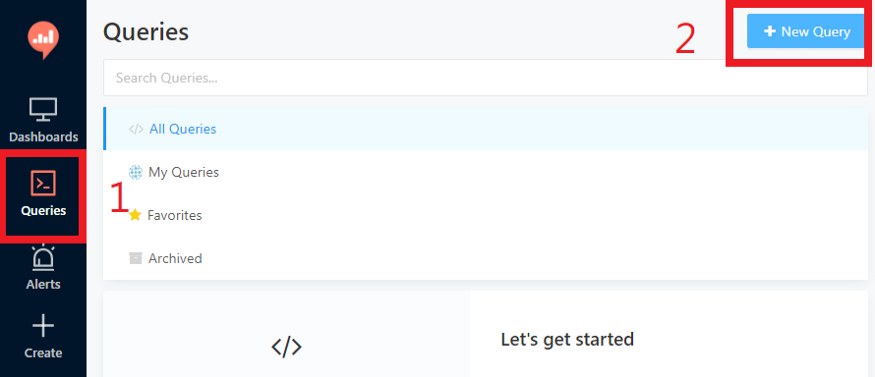
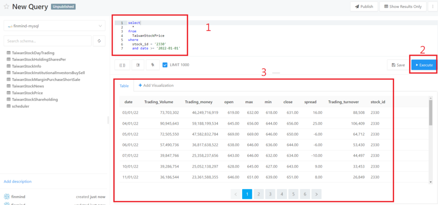

# 製作個人專屬看盤軟體

https://medium.com/finmind/%E8%A3%BD%E4%BD%9C%E5%80%8B%E4%BA%BA%E5%B0%88%E5%B1%AC%E7%9C%8B%E7%9B%A4%E8%BB%9F%E9%AB%94-%E4%BA%8C-27081ce44689


首先，將以下專案 clone 下來

https://github.com/FinMind/finmind-visualization

（需要使用 docker 技術，請先確定你安裝了 docker）

# 1. 建立 docker network：

```
docker network create finmind_network
```

# 2. 建立相關的 services，包含 MySQL 資料庫、RabbitMQ、Redash：

```
docker-compose -f mysql.yml up -d
docker-compose -f rabbitmq.yml up -d
docker-compose -f redash.yml up -d
```

# 3. 建立 FinMind 工具，將使用 FinMind Data 進行視覺化：

如果你有 FinMind Api Token，使用以下指令

```
FINMIND_API_TOKEN=your_token docker-compose -f finmind.yml up -d
```

如果沒有 Token，使用以下指令（沒有 token，資料會更新比較慢）

```
docker-compose -f finmind.yml up -d
```

邏輯上是，拉 FinMind Data，做視覺化，也就是說，如果是會員，更新資料速度會比較快，如果非會員，資料也是會更新，只是比較慢一點。

# 4. 建立完成後，以下是相關 services 連線資訊

```
mysql: http://localhost:8080/
    user : finmind
    password : test
flower: http://localhost:5555/
rabbitmq: http://localhost:15672/
    user : worker
    password : worker
visualization: http://localhost:5000/
finmind-visualization-api: http://localhost:8888/docs
```

# 5. 建立 MySQL Table

進入以下連結，http://localhost:8888/docs，


成功後，就會建立相關 Table 了，可以到以下連結查看，[http://localhost:8080](http://localhost:8080/)，帳號密碼是，finmind／test。


# 6. 拉取歷史資料

目前 MySQL 資料庫都是空的，因此需要拉取 FinMind 資料，方式如下。

一樣進入以下連結，http://localhost:8888/docs，並根據下圖，選擇 dataset，以 TaiwanStockPrice 為例


# 7. 拉取資料方式

是透過 RabbitMQ 進行，可以使用以下連結進入，http://localhost:15672/，帳號密碼，worker／worker。


等待 queues 消化完成歸 0 後，跳轉到 MySQL，可以看到都已經成功拉取 TaiwanStockPrice 歷史資料了，如下


其他的 Data，也可以用一樣的方式更新歷史資料。

# 8. 如何定時更新資料？

這時會有讀者想問，如何定時更新資料，首先，跳轉到 scheduler 的 table


預設都是不要定時更新，這部分留給使用者自行決定。

# 9. 開始建立視覺化

前置工作都準備完成後，資料會定時更新了，開始進入主題，視覺化工具，進入以下連結，http://localhost:5000/，按照下圖步驟，帳號密碼讀者可自行設定


建立 Data Source，與 MySQL 做連結


連線參數


以上成功後，開始建立，第一個 Query

# 10. 建立第一個 Query

步驟如下圖



輸入以下 SQL

```
select
  *
from
  TaiwanStockPrice
where
  stock_id = '2330'
  and date >= '2022-01-01'
```



到這就完成了基本設定，下一篇文章將介紹，如何進行視覺化做圖，如何做出第一篇文章中的圖表。


# 

