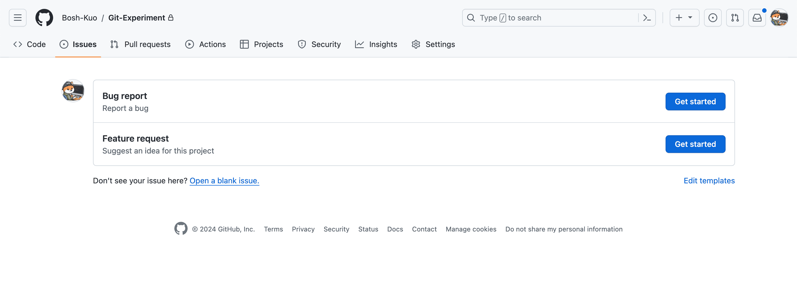
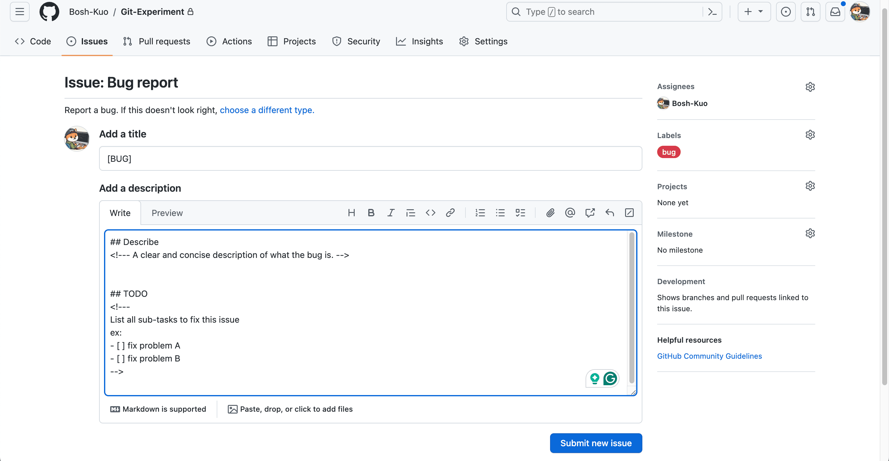
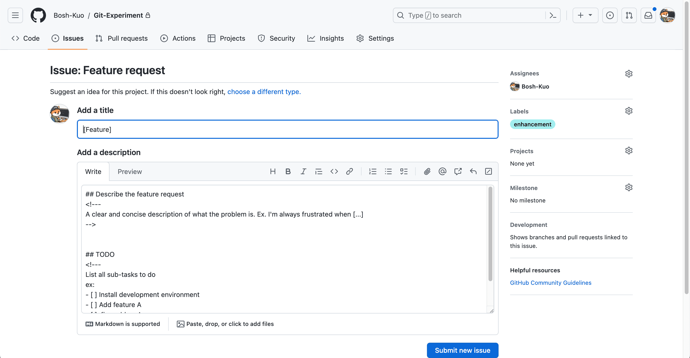
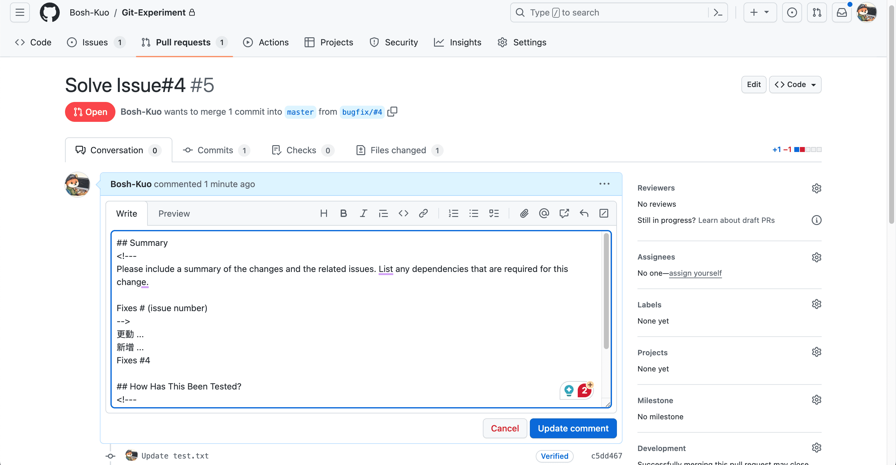
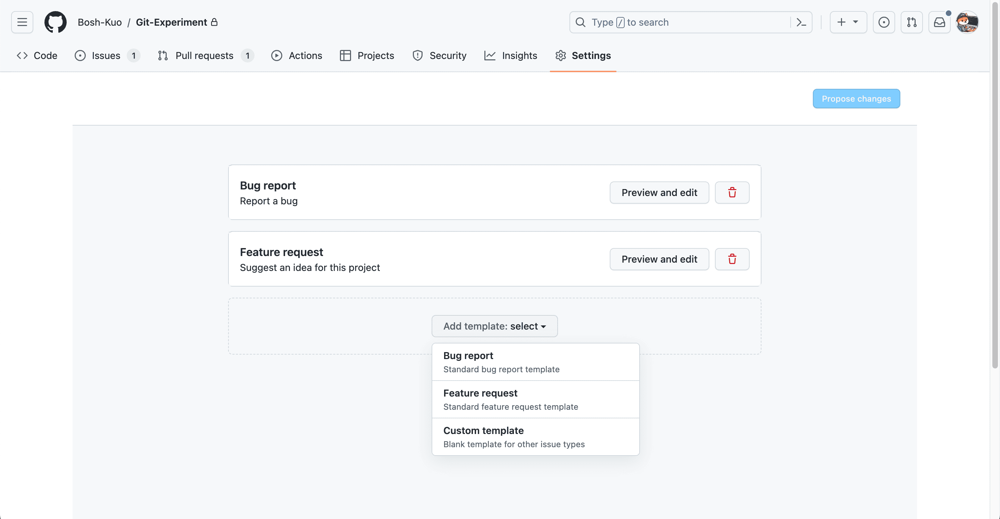

# 使用 GitHub Issues 與 PR 模板組織專案工作流

## GitHub Issues、Pull Requests 與開發工作流的關係

當多人共同開發一個缺乏管理的 GitHub 專案時，常會遇到下列情境：

- 「這個 PR 解決了哪些問題？問題記錄在哪裡？」
- 「功能 A 修好後，功能 B 又冒出新 Bug。」
- 「這個問題我已經在修了。」

如果專案缺乏有效的規劃、控制與溝通，修問題的過程很容易再製造新問題。因此，多數有經驗的開發者會在專案初期先定義協作規範，例如：

- Issues、PR 的內容格式
- 分支命名原則
- 分支合併規範

這能讓所有協作者以一致規則記錄與推進工作，提升團隊效率。

我在前公司實習時，團隊採用 **GitHub Flow**：以 **Issues** 記錄待解問題，並要求每個 **PR** 清楚描述變更內容、解決方式、測試結果，且必須關聯對應的 issue 編號。即使是個人專案，這套流程仍可幫助你追蹤每次變更的目的、內容與驗證方式；若發生問題，也能快速追溯。

以下是使用工作流的主要好處：

- **開發記錄清晰：** 可追蹤每次變更的目的、內容、測試與關聯議題。
- **問題追蹤容易：** 能快速掌握每個問題的狀態、進度與對應 PR。
- **團隊協作順暢：** 成員可快速理解彼此進度並協助。
- **變更可追溯：** 發生問題時，能快速回溯根因。

## 為何需要 GitHub Issues 與 Pull Requests 模板？

善用 GitHub Issues 與 Pull Requests 的模板功能，可以更有效率地組織專案工作流。模板提供結構與一致性，讓提交者更容易補齊必要資訊，也讓維護者更容易審查與追蹤。

### Issues 模板

以下示範兩種 **Issue 模板**，分別用於「回報問題」與「提出功能建議」。



透過模板，你可以統一 issue 標題格式、預設標籤，並要求提交內容包含摘要與待辦事項。





### PR 模板

在 PR 模板中，可以提醒開發者連結相關 Issue，並要求描述變更項目、實作方法與測試結果。

GitHub 提供了方便的關聯機制：當 PR 以預設分支為合併目標（base）時，可以使用 `close`、`fix`、`resolve` 等關鍵字連結特定 issue，並在合併後自動關閉該 issue。

> 關鍵字列表參考：[Linking a pull request to an issue](https://docs.github.com/en/issues/tracking-your-work-with-issues/linking-a-pull-request-to-an-issue)



## 如何建立 GitHub Issues 與 Pull Requests 模板？

### 手動新增檔案

Issue、PR 模板通常放在預設分支的 `.github` 目錄下。若在非預設分支建立，其他協作者通常無法直接使用。

- 多模板
  - Issue：在 `.github/ISSUE_TEMPLATE/` 下建立 `.md` 檔
  - PR：在 `.github/PULL_REQUEST_TEMPLATE/` 下建立 `.md` 檔
- 單模板
  - Issue：在 `.github/` 下建立 `ISSUE_TEMPLATE.md`
  - PR：在 `.github/` 下建立 `PULL_REQUEST_TEMPLATE.md`

### 透過 GitHub 介面新增

使用 GitHub 介面新增模板相對更方便，但目前只能直接新增 Issue 模板，PR 模板仍需手動建立檔案。步驟如下：

1. 點擊儲存庫頁面的 **Settings**。
2. 在 **Features** 區塊找到 Issues，點擊 **Set up templates**。
3. 點擊 **Add template**，選擇 GitHub 預設模板或空白模板。



### GitHub Issues Template 範例

```markdown
<!-- .github/ISSUE_TEMPLATE/bug_report.md -->
---
name: Bug report
about: Report a bug
title: "[Bug]"
labels: bug
assignees: Bosh-Kuo
---

## Describe
<!-- A clear and concise description of what the bug is. -->

## TODO
<!--
List all sub-tasks to fix this issue
ex:
- [ ] fix problem A
- [ ] fix problem B
-->
```

### GitHub Pull Requests Template 範例

```markdown
<!-- PULL_REQUEST_TEMPLATE.md -->

## Summary
<!--
Please include a summary of the changes and the related issues.
List any dependencies that are required for this change.

Fixes # (issue number)
-->

## How Has This Been Tested?
<!--
Please describe in detail how you tested your changes.
Include details of your testing environment and the tests you ran.
-->
```
