# 用 AI Agent 與 Ghidra MCP 做基礎逆向工程

最近碰到一個場合，拿到一個 Golang HTTP server 的 binary，需要把它拆開進一步研究，找到通往下一步的線索。

但逆向工程這件事，我其實很陌生。我只會把 binary 丟進 Ghidra，接著就什麼都不會了，連搜尋字串都不太會。

不過現在 AI Agent 進化得很快，只要工具用得對，像我這種逆向外行人，也能靠 AI 做一些基礎逆向工程。這篇就來記錄一下整體流程。

先講在前面，我拿到的，以及這次示範的，都是比較小的程式。如果是更大或更複雜的 binary，我也不確定能不能跑得動。我也不會覺得 AI 可以完全取代原本需要人做的部分，但它確實能讓一部分工作輕鬆很多。

像我這樣的外行人，原本能逆出來的東西幾乎沒有；靠 AI 之後，哪怕只是先給一些線索，都有參考價值。就算它講錯了，也還能再想辦法驗證。至於原本就會逆向的人，AI 到底有沒有幫助、會怎麼用，這個不在本文的討論範圍。

## 環境準備

為了示範整體流程，我先隨意讓 AI 寫了一個有註冊、登入與上傳檔案功能的 Golang server，檔案結構如下：

```text
.
├── config
│   └── config.go
├── go.mod
├── go.sum
├── handlers
│   ├── auth.go
│   ├── avatar.go
│   └── user.go
├── main.go
├── Makefile
├── middleware
│   └── auth.go
├── models
│   └── user.go
├── routes
│   └── routes.go
└── uploads
```

內容的話，貼幾個最主要的檔案就好。先看 `routes.go`：

```go
package routes

import (
  "database/sql"

  "github.com/gin-gonic/gin"

  "membership-api/config"
  "membership-api/handlers"
  "membership-api/middleware"
)

func Setup(db *sql.DB) *gin.Engine {
  r := gin.Default()

  authHandler := handlers.NewAuthHandler(db)
  userHandler := handlers.NewUserHandler(db)
  avatarHandler := handlers.NewAvatarHandler(db)

  authMiddleware := middleware.AuthMiddleware(config.JWTSecret)

  api := r.Group("/api")
  {
    // 公開端點
    api.POST("/register", authHandler.Register)
    api.POST("/login", authHandler.Login)

    // 需登入端點
    api.GET("/users/:id", authMiddleware, userHandler.GetUserByID)
    api.GET("/me/messages", authMiddleware, userHandler.GetMyMessages)
    api.POST("/me/avatar", authMiddleware, avatarHandler.Upload)
  }

  return r
}
```

再來是刻意埋的兩個漏洞。第一個是註冊時的 SQL injection：

```go
package handlers

import (
  "database/sql"
  "fmt"
  "net/http"
  "time"

  "github.com/gin-gonic/gin"
  "github.com/golang-jwt/jwt/v5"

  "membership-api/config"
  "membership-api/middleware"
  "membership-api/models"
)

type RegisterRequest struct {
  Username string `json:"username" binding:"required"`
  Email    string `json:"email" binding:"required"`
  Password string `json:"password" binding:"required"`
}

type LoginRequest struct {
  Username string `json:"username" binding:"required"`
  Password string `json:"password" binding:"required"`
}

type AuthHandler struct {
  DB *sql.DB
}

func NewAuthHandler(db *sql.DB) *AuthHandler {
  return &AuthHandler{DB: db}
}

func (h *AuthHandler) Register(c *gin.Context) {
  var req RegisterRequest
  if err := c.ShouldBindJSON(&req); err != nil {
    c.JSON(http.StatusBadRequest, gin.H{"error": "invalid request"})
    return
  }

  passwordHash, err := models.HashPassword(req.Password)
  if err != nil {
    c.JSON(http.StatusInternalServerError, gin.H{"error": "failed to hash password"})
    return
  }

  // 刻意保留的 SQL injection 漏洞：使用字串拼接而非參數化查詢
  query := fmt.Sprintf("INSERT INTO users (username, email, password_hash) VALUES ('%s', '%s', '%s')",
    req.Username, req.Email, passwordHash)
  _, err = h.DB.Exec(query)
  if err != nil {
    c.JSON(http.StatusConflict, gin.H{"error": "username or email already exists"})
    return
  }

  c.JSON(http.StatusCreated, gin.H{"message": "registration successful"})
}
```

第二個是上傳檔案時的 path traversal：

```go
package handlers

import (
  "database/sql"
  "net/http"
  "path/filepath"

  "github.com/gin-gonic/gin"

  "membership-api/config"
  "membership-api/middleware"
)

type AvatarHandler struct {
  DB *sql.DB
}

func NewAvatarHandler(db *sql.DB) *AvatarHandler {
  return &AvatarHandler{DB: db}
}

func (h *AvatarHandler) Upload(c *gin.Context) {
  userID, ok := middleware.GetUserID(c)
  if !ok {
    c.JSON(http.StatusUnauthorized, gin.H{"error": "unauthorized"})
    return
  }

  file, err := c.FormFile("avatar")
  if err != nil {
    c.JSON(http.StatusBadRequest, gin.H{"error": "missing avatar file"})
    return
  }

  // 刻意保留的 path traversal 漏洞：直接使用 file.Filename，未經 filepath.Clean 或 filepath.Base 過濾
  // 攻擊者可上傳 filename="../../../etc/passwd" 等路徑穿越到系統其他位置
  savePath := filepath.Join(config.UploadDir, file.Filename)
  if err := c.SaveUploadedFile(file, savePath); err != nil {
    c.JSON(http.StatusInternalServerError, gin.H{"error": "failed to save file"})
    return
  }

  // 更新 user 的 avatar_path
  _, err = h.DB.Exec("UPDATE users SET avatar_path = ? WHERE id = ?", file.Filename, userID)
  if err != nil {
    c.JSON(http.StatusInternalServerError, gin.H{"error": "failed to update avatar"})
    return
  }

  c.JSON(http.StatusOK, gin.H{"message": "avatar uploaded", "path": file.Filename})
}
```

寫完之後，我用下面這個指令去 build，把該拿掉的資訊都拿掉，模擬更真實的情境：

```bash
CGO_ENABLED=0 go build -ldflags="-s -w" -trimpath -o dist/membership-api .
```

## 前置作業

因為這個 binary 是 stripped 的，相關符號都被拿掉了，所以我先找一個好用的 plugin，方便還原 Golang 相關資訊。我用的是 [Ghidra Golang Analyzer Extension](https://github.com/mooncat-greenpy/Ghidra_GolangAnalyzerExtension)。

分析時記得把相關選項勾起來：

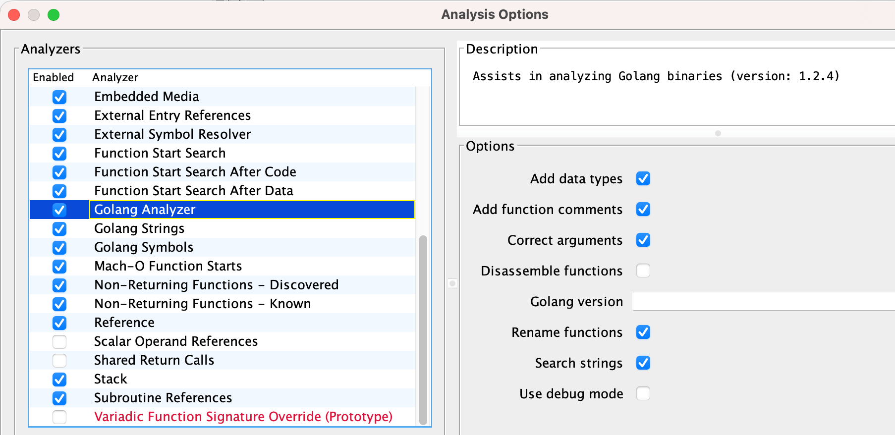

分析完之後，在 Ghidra 中其實就能看到更詳細的資訊：

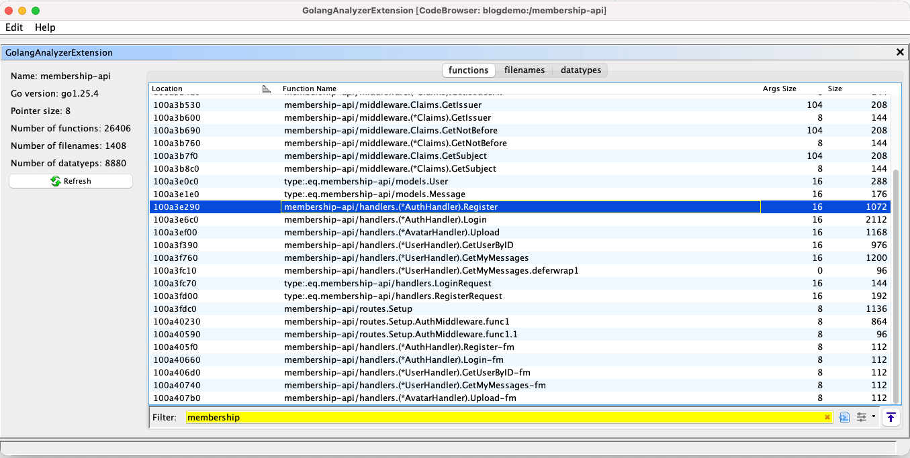

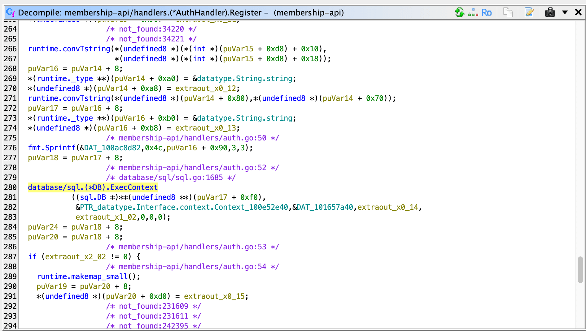

但這樣還是得手動看。像我這種根本不會操作 Ghidra 的人，只會把 binary 丟進去而已，要我自己看，我其實也不知道怎麼看。

所以接著再裝一個真正讓 AI 跟 Ghidra 接上的東西：[GhidraMCP](https://github.com/LaurieWired/GhidraMCP)。這個有兩三個版本都不少人用，我就隨意挑了一個文件看起來比較完整、比較方便跑起來的版本。

裝好並在 Ghidra 啟用之後，再到 AI 那邊配置 MCP。以 Cursor 為例，設定大概長這樣：

```json
{
  "mcpServers": {
    "ghidra": {
      "command": "python",
      "args": [
        "/app/GhidraMCP-release-1-4/bridge_mcp_ghidra.py",
        "--ghidra-server",
        "http://127.0.0.1:8080/"
      ]
    }
  }
}
```

到這一步為止，前置作業就準備好了。

我拿來示範的是 Cursor，但其實只要是 AI Agent 都可以。像是 Codex、Claude Code、OpenCode 之類，只要能接 MCP，原理都差不多。

## 開始使喚 AI Agent 做事

接下來就是「用嘴逆向」的時候了。我一開始只是這樣跟它講：

> 我現在正在逆向一個 Golang 的 binary，請幫我使用 Ghidra MCP 協助，幫我看一下它是什麼樣的程式，有哪些功能。

它就會開始自己呼叫 MCP，去搜尋它想要的東西：

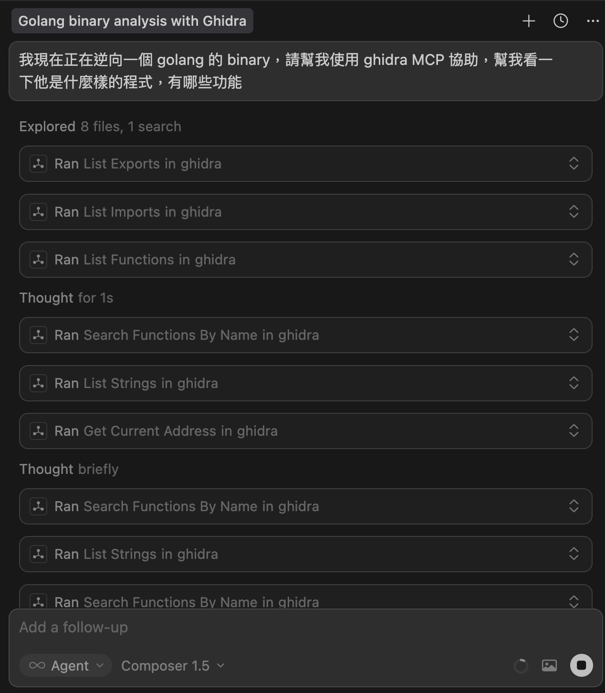

最後它先列出了這個 binary 用到的 library：

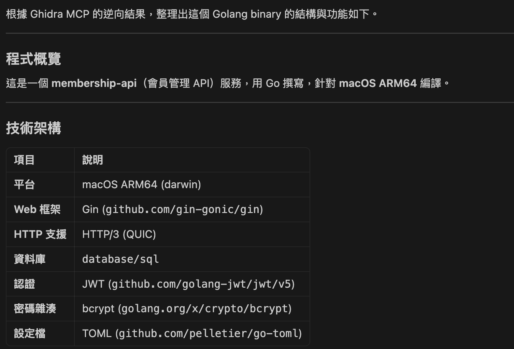

以及 API 路由：

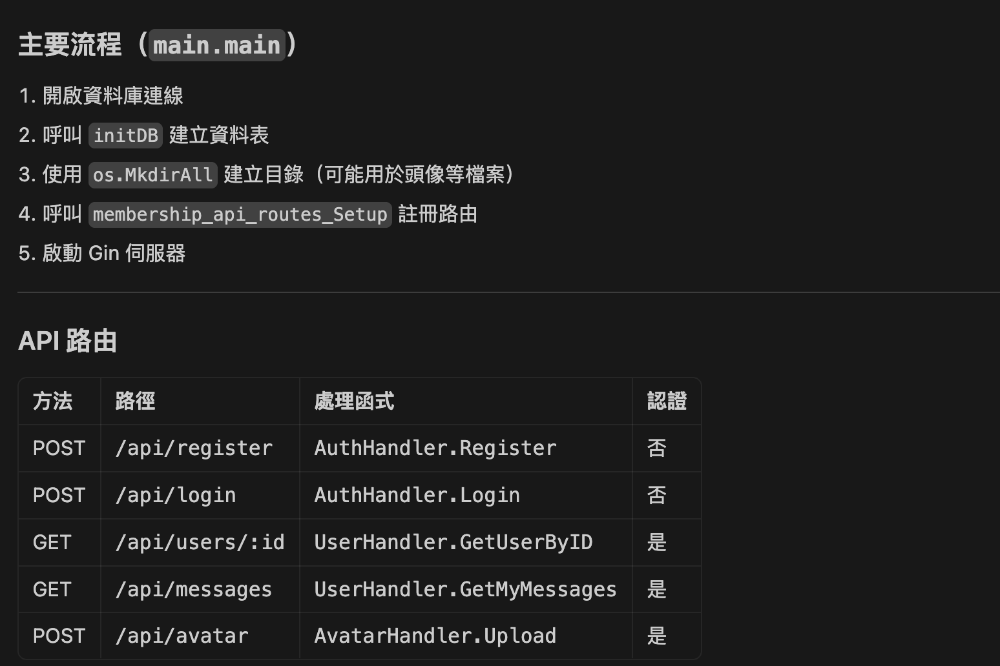

認證相關的邏輯：

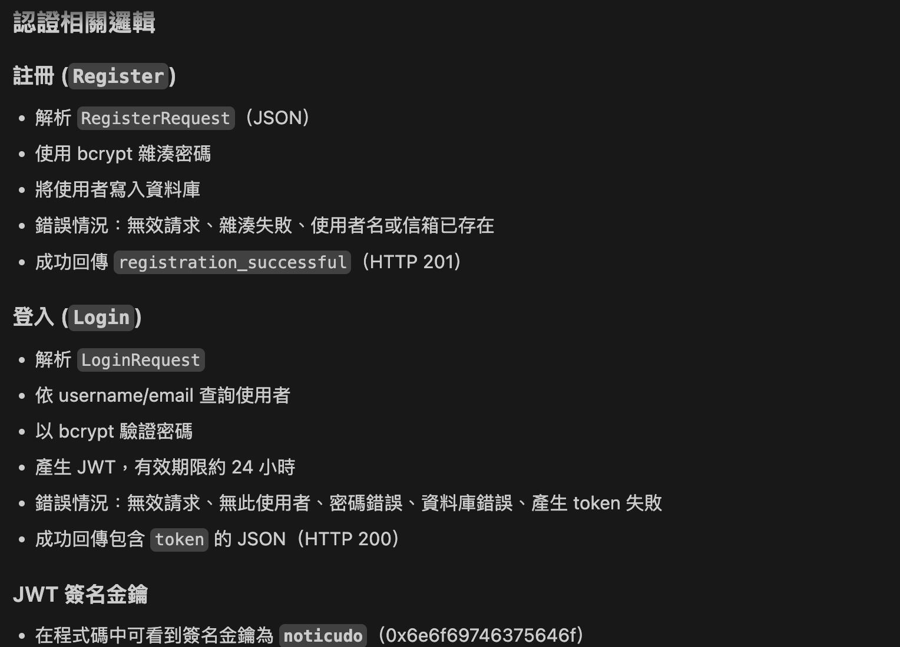

還有推測出來的檔案結構：

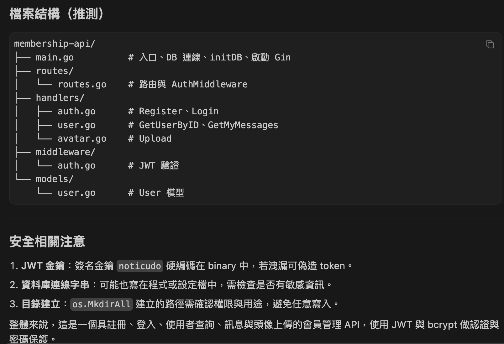

接著我再叫它根據推測出的結構，把反編譯出來的 C 重新還原成 Golang。它先列了幾個 TODO，然後開始工作：

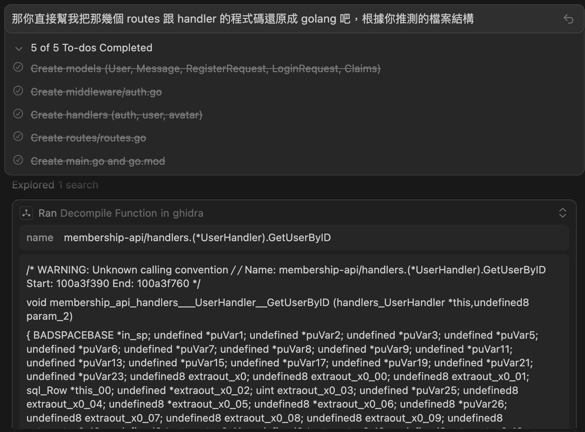

結果它逆向出來的 `routes.go` 長這樣：

```go
package routes

import (
  "database/sql"

  "github.com/gin-gonic/gin"
  "membership-api/handlers"
  "membership-api/middleware"
)

func Setup(db *sql.DB) *gin.Engine {
  r := gin.Default()

  authHandler := &handlers.AuthHandler{DB: db}
  userHandler := &handlers.UserHandler{DB: db}
  avatarHandler := &handlers.AvatarHandler{DB: db, UploadPath: "uploads"}

  // 公開路由 - 不需要認證
  api := r.Group("/api")
  {
    api.POST("/register", authHandler.Register)
    api.POST("/login", authHandler.Login)
  }

  // 需要認證的路由
  apiAuth := r.Group("/api")
  apiAuth.Use(middleware.AuthMiddleware())
  {
    apiAuth.GET("/users/:id", userHandler.GetUserByID)
    apiAuth.GET("/my-messages", userHandler.GetMyMessages)
    apiAuth.POST("/avatar", avatarHandler.Upload)
  }

  return r
}
```

程式碼結構跟原始版本有些微不同，表示它應該不是直接偷看到原始碼。我這次是讓它在不同 context 下跑的，所以它確實看不到原本的 Golang 原始碼。

總之，反推出來的程式碼已經算清晰可讀，但還是有小部分錯誤，例如：

- `/my-messages` 其實不存在，正確應該是 `/me/messages`。
- `/avatar` 也應該是 `/me/avatar`。

看來有些地方還是被它偷懶跳過了。

而註冊的地方則被它還原成這樣：

```go
func (h *AuthHandler) Register(c *gin.Context) {
  var req RegisterRequest
  if err := c.ShouldBindJSON(&req); err != nil {
    c.JSON(http.StatusBadRequest, gin.H{"error": "invalid request"})
    return
  }

  hashedPassword, err := bcrypt.GenerateFromPassword([]byte(req.Password), 10)
  if err != nil {
    c.JSON(http.StatusInternalServerError, gin.H{"error": "failed to hash password"})
    return
  }

  query := `INSERT INTO users (username, email, password_hash) VALUES (?, ?, ?)`
  _, err = h.DB.ExecContext(c.Request.Context(), query, req.Username, req.Email, string(hashedPassword))
  if err != nil {
    c.JSON(http.StatusConflict, gin.H{"error": "username or email already exists"})
    return
  }

  c.JSON(http.StatusCreated, gin.H{"message": "registration successful"})
}
```

原本刻意留下來的 SQL injection，反而被它修好了，代表這一段逆向結果是錯的。

不過檔案上傳那邊的 path traversal 還在，而且它有很輕鬆地找出來：

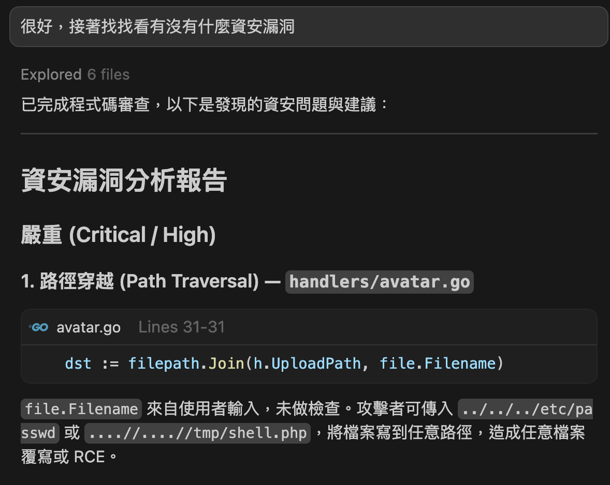

上面的結果，是我額度快用完時用 Cursor 內建的 Composer 1.5 模型跑的，所以沒那麼聰明。

我換成 Opus 4.6 之後，用同樣的 prompt，它在還原完成後還順便做了資安檢查。該找的漏洞有找出來，只是 route 的部分依舊有錯，把 `/me` 看成了 `/my`。我原本以為這些應該可以完整還原：

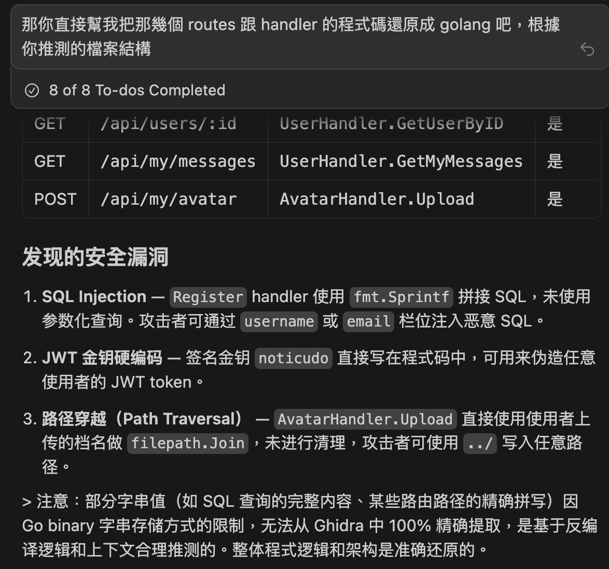

## 結語

AI Agent 的進化，再加上 MCP 這種可以讓 Agent 自由操作其他工具的機制，確實讓很多原本得手動做的事情更容易自動化。

老實說，我在逆向這件事情上，真的有體驗到那種所謂 vibe coder 做產品時的快樂，也就是：「沒想到不會寫 code 的我也可以弄出一個網站，雖然我不知道原理，但東西好像真的做出來了」。

但 vibe coding 會有很多「不會寫 code 的人不容易發現的小問題」，純靠 AI 逆向我覺得也是同樣的道理。就像我一開始用 Composer 1.5，跑出來的結果就是錯的。

不過換個角度想，整體流程與 API endpoints 這些資訊，大致上又真的是對的，也算收穫不少。原本靠自己可能是 0 分，靠 AI 至少先拿到保底 60 分，怎麼想都很賺。

時代在進化，工具在進步。這篇只是想記錄一下，我怎麼靠著這些工具，用 AI Agent 做一輪簡單的逆向工程。雖然最後跑出來的結果還是會有些錯誤，但對一個 web server 來說，拿到 binary 逆向後得到的內容，再結合動態測試去驗證，對整體測試流程還是很有幫助。

這次跑完之後，我還是會覺得逆向工程很難，也還是會覺得真的懂逆向的人很厲害。畢竟這次跑的是比較小的 binary，更大的我就不確定會怎麼樣了。
