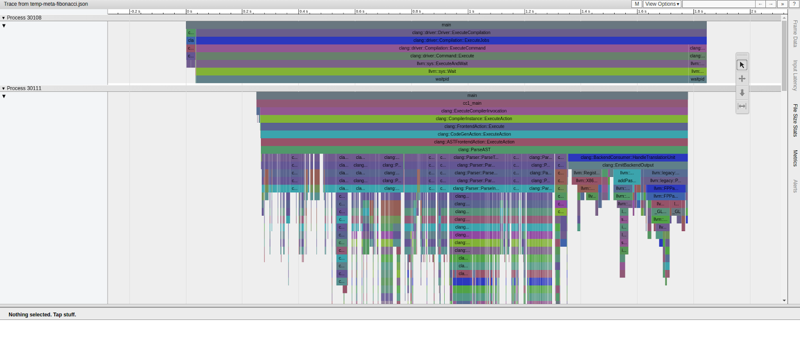

# uftrace 使用指南

`uftrace` 是 Linux 上相當實用的函式追蹤工具，適合用來觀察程式的呼叫路徑、執行時間、函式參數與回傳值。對 C、C++ 這類需要做函式級分析的情境特別好用。

官方資源：

- 原始碼：<https://github.com/namhyung/uftrace>
- 文件目錄：<https://github.com/namhyung/uftrace/tree/master/doc>

## 1. 安裝

### Ubuntu / Debian

```bash
sudo apt update
sudo apt install uftrace
```

### CentOS / RHEL

```bash
sudo yum install uftrace

# 較新的發行版可改用 dnf
sudo dnf install uftrace
```

### 從原始碼編譯

```bash
git clone https://github.com/namhyung/uftrace.git
cd uftrace
make
sudo make install
```

## 2. 使用前準備

`uftrace` 通常需要搭配編譯期插樁資訊，常見作法如下：

```bash
gcc -pg -o program source.c

# 或者
gcc -finstrument-functions -o program source.c
```

若你要分析的程式比較複雜，建議保留除錯資訊，後續輸出會比較好讀：

```bash
gcc -g -pg -o program source.c
```

## 3. 基本工作流程

### 3.1 記錄執行軌跡

```bash
# 基本用法
uftrace record ./your_program

# 指定輸出目錄
uftrace record -d trace_data ./your_program

# 記錄函式參數
uftrace record -A main ./your_program
```

### 3.2 重播追蹤結果

```bash
# 直接重播
uftrace replay

# 從指定目錄讀取
uftrace replay -d trace_data

# 顯示函式參數與回傳值
uftrace replay -A main -R main
```

### 3.3 產生報表與呼叫圖

```bash
# 函式統計報表
uftrace report

# 依呼叫次數與總耗時排序
uftrace report -s call,total

# 顯示呼叫關係
uftrace graph
```

## 4. 常用選項

### 4.1 `record` 常見參數

```bash
# 限制追蹤深度
uftrace record -D 5 ./program

# 只追蹤特定函式
uftrace record -F main,func1,func2 ./program

# 排除雜訊函式
uftrace record -N printf,malloc,free ./program

# 只記錄耗時超過 1ms 的函式
uftrace record -t 1ms ./program

# 記錄核心函式
sudo uftrace record -k ./program

# 記錄回傳值
uftrace record -R func_name ./program
```

### 4.2 `replay` 常見參數

```bash
# 顯示時間戳
uftrace replay -t

# 顯示耗時
uftrace replay -T

# 僅顯示指定函式
uftrace replay -F main,important_func

# 顯示參數與回傳值
uftrace replay -A main -R main
```

## 5. 實作範例

### 5.1 範例程式

```c
#include <stdio.h>
#include <unistd.h>

void func_c(void) {
    printf("In function C\n");
    usleep(1000);
}

void func_b(void) {
    printf("In function B\n");
    usleep(2000);
    func_c();
}

void func_a(void) {
    printf("In function A\n");
    usleep(3000);
    func_b();
}

int main(void) {
    printf("Starting program\n");
    func_a();
    printf("Program finished\n");
    return 0;
}
```

### 5.2 編譯與追蹤

```bash
gcc -g -pg -o test test.c
uftrace record ./test
uftrace replay
```

### 5.3 輸出範例

`uftrace replay` 實際輸出：

```text
# DURATION     TID     FUNCTION
   0.221 us [3407146] | __monstartup();
   0.061 us [3407146] | __cxa_atexit();
            [3407146] | main() {
   4.018 us [3407146] |   puts();
            [3407146] |   func_a() {
   0.080 us [3407146] |     puts();
   3.064 ms [3407146] |     usleep();
            [3407146] |     func_b() {
   0.360 us [3407146] |       puts();
   2.062 ms [3407146] |       usleep();
            [3407146] |       func_c() {
   0.381 us [3407146] |         puts();
   1.056 ms [3407146] |         usleep();
   1.057 ms [3407146] |       } /* func_c */
   3.121 ms [3407146] |     } /* func_b */
   6.185 ms [3407146] |   } /* func_a */
   0.140 us [3407146] |   puts();
   6.190 ms [3407146] | } /* main */
```

`uftrace report` 實際輸出：

```text
Total time   Self time       Calls  Function
  ==========  ==========  ==========  ====================
    6.190 ms    0.361 us           1  main
    6.185 ms    0.320 us           1  func_a
    6.183 ms    6.183 ms           3  usleep
    3.121 ms    0.563 us           1  func_b
    1.057 ms    0.330 us           1  func_c
    4.979 us    4.979 us           5  puts
    0.221 us    0.221 us           1  __monstartup
    0.061 us    0.061 us           1  __cxa_atexit
```

`uftrace graph` 實際輸出：

```text
# Function Call Graph for 'uftrace_test' (session: b7df94d7ada96d79)
========== FUNCTION CALL GRAPH ==========
# TOTAL TIME   FUNCTION
    6.190 ms : (1) uftrace_test
    0.221 us :  +-(1) __monstartup
             :  |
    0.061 us :  +-(1) __cxa_atexit
             :  |
    6.190 ms :  +-(1) main
    4.158 us :     +-(2) puts
             :     |
    6.185 ms :     +-(1) func_a
    0.080 us :        +-(1) puts
             :        |
    3.064 ms :        +-(1) usleep
             :        |
    3.121 ms :        +-(1) func_b
    0.360 us :           +-(1) puts
             :           |
    2.062 ms :           +-(1) usleep
             :           |
    1.057 ms :           +-(1) func_c
    0.381 us :              +-(1) puts
             :              |
    1.056 ms :              +-(1) usleep
```

> **注意**：`printf` 會被 glibc 最佳化為 `puts`（不含格式字串時），所以輸出中看到的是 `puts` 而非 `printf`。`__monstartup` 和 `__cxa_atexit` 是 gprof 插樁的初始化函式，正常出現。

## 6. 進階功能

### 6.1 使用腳本自訂分析

```bash
uftrace script -S analyze.py
```

```python
def uftrace_entry(ctx):
    print(f"進入: {ctx['name']}，時間戳: {ctx['timestamp']}")


def uftrace_exit(ctx):
    print(f"離開: {ctx['name']}，耗時: {ctx['duration']}")
```

### 6.2 匯出 Chrome Trace

```bash
uftrace dump --chrome > trace.json
```

之後可在 Chromium / Chrome 的追蹤檢視工具中載入 `trace.json` 進行視覺化分析。



### 6.3 匯出 Graphviz 呼叫圖

```bash
uftrace graph --graphviz | dot -Tpng -o callgraph.png
```

### 6.4 產生 Flame Graph 資料

```bash
uftrace dump --flame-graph > flamegraph.txt
./flamegraph.pl flamegraph.txt > flamegraph.svg
```

## 7. 除錯與調整技巧

### 7.1 過濾雜訊函式

```bash
uftrace record -N "malloc,free,printf,puts" ./program
uftrace record -F "main,func*" ./program
```

### 7.2 設定合理門檻

```bash
# 只觀察耗時超過 100us 的函式
uftrace record -t 100us ./program
```

### 7.3 控制追蹤資料量

```bash
uftrace record --max-stack 100M ./program
uftrace record -t 1ms -D 10 ./program
```

## 8. 常見問題

### 8.1 看不到函式呼叫

通常是因為編譯時沒有加上 `-pg` 或 `-finstrument-functions`。

```bash
gcc -g -pg -o program source.c
```

### 8.2 追蹤核心函式失敗

這類操作通常需要 `root` 權限：

```bash
sudo uftrace record -k ./program
```

### 8.3 想把預設參數固定下來

可建立 `~/.uftrace`：

```ini
record = -t 100us -D 20
replay = -T -t
```

## 9. 與其他工具比較

| 工具 | 優勢 | 適用情境 |
| --- | --- | --- |
| `uftrace` | 函式層級追蹤細節完整，能看呼叫關係 | 函式耗時分析、呼叫鏈追蹤 |
| `strace` | 系統呼叫層級觀察清楚 | 系統互動、I/O 問題排查 |
| `perf` | CPU 取樣與硬體事件分析能力強 | 整體效能瓶頸分析 |
| `gprof` | 傳統插樁式效能分析 | 舊專案或基本函式統計 |

## 10. 小結

如果你想知道「哪個函式被誰呼叫、花了多久、順序是什麼」，`uftrace` 會比單純的取樣式工具更直觀。它特別適合拿來理解大型 C / C++ 程式的執行路徑，也能和 Chrome Trace、Graphviz、Flame Graph 一起搭配使用。

---

## 11. 測試驗證

### 11.1 驗證安裝是否正常

```bash
# 確認版本
uftrace --version
# uftrace v0.15 ( x86_64 dwarf python3 luajit tui perf sched dynamic kernel )

# 確認 uftrace 在 PATH 中
which uftrace
# /usr/bin/uftrace 或 /usr/local/bin/uftrace
```

括號內列出的是編譯時啟用的功能模組；`kernel` 表示支援核心函式追蹤，`python3` 表示支援 Python 腳本分析。

### 11.2 最小可驗證範例

使用第 5 節的範例程式進行完整流程驗證：

**步驟 1：建立測試程式**

```bash
cat > /tmp/uftrace_test.c << 'EOF'
#include <stdio.h>
#include <unistd.h>

void func_c(void) {
    printf("In function C\n");
    usleep(1000);
}

void func_b(void) {
    printf("In function B\n");
    usleep(2000);
    func_c();
}

void func_a(void) {
    printf("In function A\n");
    usleep(3000);
    func_b();
}

int main(void) {
    printf("Starting program\n");
    func_a();
    printf("Program finished\n");
    return 0;
}
EOF
```

**步驟 2：編譯（必須加 `-pg`）**

```bash
gcc -g -pg -o /tmp/uftrace_test /tmp/uftrace_test.c
```

**步驟 3：錄製追蹤資料**

```bash
cd /tmp
uftrace record ./uftrace_test
```

預期畫面：

```text
Starting program
In function A
In function B
In function C
Program finished
```

**步驟 4：重播追蹤結果**

```bash
uftrace replay
```

驗證重播輸出中應出現以下特徵：

- 每一行有 `DURATION`、`TID`、`FUNCTION` 三欄
- 函式以縮排形式呈現巢狀呼叫（`main → func_a → func_b → func_c`）
- 耗時數字與 `usleep` 呼叫的微秒值大致吻合

**步驟 5：確認報表輸出**

```bash
uftrace report
```

預期輸出欄位：`Total time`、`Self time`、`Calls`、`Function`，且四個函式（`main`、`func_a`、`func_b`、`func_c`）都應出現在清單中。

**步驟 6：確認呼叫圖**

```bash
uftrace graph
```

預期輸出中，`main` 應位於最頂層，並依序展開到 `func_a → func_b → func_c`。

### 11.3 驗證參數與回傳值追蹤

```c
// /tmp/uftrace_args.c
#include <stdio.h>

int add(int a, int b) {
    return a + b;
}

int main(void) {
    int result = add(3, 4);
    printf("result = %d\n", result);
    return 0;
}
```

```bash
gcc -g -pg -o /tmp/uftrace_args /tmp/uftrace_args.c
uftrace record -A 'add@arg1/i32,arg2/i32' -R 'add@retval/i32' /tmp/uftrace_args
uftrace replay
```

實際輸出：

```text
# DURATION     TID     FUNCTION
   0.401 us [3407716] | __monstartup();
   0.061 us [3407716] | __cxa_atexit();
            [3407716] | main() {
   0.712 us [3407716] |   add(3, 4) = 7;
   4.919 us [3407716] |   printf();
   6.091 us [3407716] | } /* main */
```

`add(3, 4) = 7` 出現在追蹤輸出中，確認 `-A` 和 `-R` 選項生效。

### 11.4 驗證深度限制

```bash
uftrace record -D 2 /tmp/uftrace_test
uftrace replay
```

實際輸出（`-D 2` 只記錄到第 2 層，`func_b`、`func_c` 被截斷，`func_a` 顯示為葉節點）：

```text
# DURATION     TID     FUNCTION
   0.601 us [3407861] | __monstartup();
   0.141 us [3407861] | __cxa_atexit();
            [3407861] | main() {
   3.386 us [3407861] |   puts();
   6.147 ms [3407861] |   func_a();
   0.281 us [3407861] |   puts();
   6.151 ms [3407861] | } /* main */
```

`func_a` 後方沒有 `{`，表示其內部呼叫未被記錄。

### 11.5 驗證時間門檻過濾

```bash
uftrace record -t 2ms /tmp/uftrace_test
uftrace replay
```

實際輸出（耗時不足 2ms 的函式被過濾，`puts` 和 `func_c` 消失；`usleep` 因呼叫本身超過門檻而保留）：

```text
# DURATION     TID     FUNCTION
            [3408022] | main() {
            [3408022] |   func_a() {
   3.058 ms [3408022] |     usleep();
            [3408022] |     func_b() {
   2.056 ms [3408022] |       usleep();
   3.113 ms [3408022] |     } /* func_b */
   6.172 ms [3408022] |   } /* func_a */
   6.178 ms [3408022] | } /* main */
```

`func_c`（約 1ms）和所有 `puts`（微秒級）均不出現，驗證門檻過濾生效。

### 11.6 驗證 Chrome Trace 匯出

```bash
uftrace record /tmp/uftrace_test
uftrace dump --chrome > /tmp/trace.json

# 確認 JSON 檔案格式正確
python3 -c "import json; data=json.load(open('/tmp/trace.json')); print('事件數:', len(data['traceEvents']))"
```

實際輸出：

```text
事件數: 30
```

JSON 格式合法，可直接載入 Chrome 追蹤檢視工具（chrome://tracing 或 Perfetto）。

### 11.7 常見驗證失敗原因

| 現象 | 可能原因 | 解法 |
| --- | --- | --- |
| `replay` 顯示空白或只有 `main` | 未加 `-pg` 編譯 | `gcc -g -pg -o ...` |
| `record` 執行時立即報錯 | uftrace 版本過舊或不支援 | `uftrace --version` 確認，必要時從原始碼編譯 |
| 函式名稱顯示為 `??` | 缺少除錯符號 | 加上 `-g` 編譯選項 |
| 核心函式追蹤失敗 | 需要 root 權限 | 改用 `sudo uftrace record -k ...` |
| 參數顯示 `<unknown>` | 型別標記語法錯誤 | 確認 `-A` 格式：`func@argN/type` |

### 11.8 快速驗證腳本

可將以下腳本存為 `verify_uftrace.sh`，一鍵執行所有驗證步驟：

```bash
#!/usr/bin/env bash
set -e

echo "=== uftrace 安裝驗證 ==="
uftrace --version

echo ""
echo "=== 編譯測試程式 ==="
cat > /tmp/uft_verify.c << 'EOF'
#include <stdio.h>
#include <unistd.h>
void inner(void) { usleep(500); }
void outer(void) { inner(); }
int main(void) { outer(); return 0; }
EOF
gcc -g -pg -o /tmp/uft_verify /tmp/uft_verify.c
echo "編譯成功"

echo ""
echo "=== 錄製與重播 ==="
cd /tmp
uftrace record ./uft_verify
uftrace replay | grep -E "(main|outer|inner)" | head -5

echo ""
echo "=== 報表輸出 ==="
uftrace report | head -6

echo ""
echo "=== 驗證完成 ==="
```

```bash
chmod +x verify_uftrace.sh
./verify_uftrace.sh
```

正常情況下最後一行應印出「驗證完成」，且中間各步驟無錯誤訊息。
