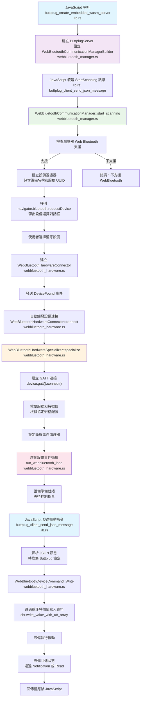
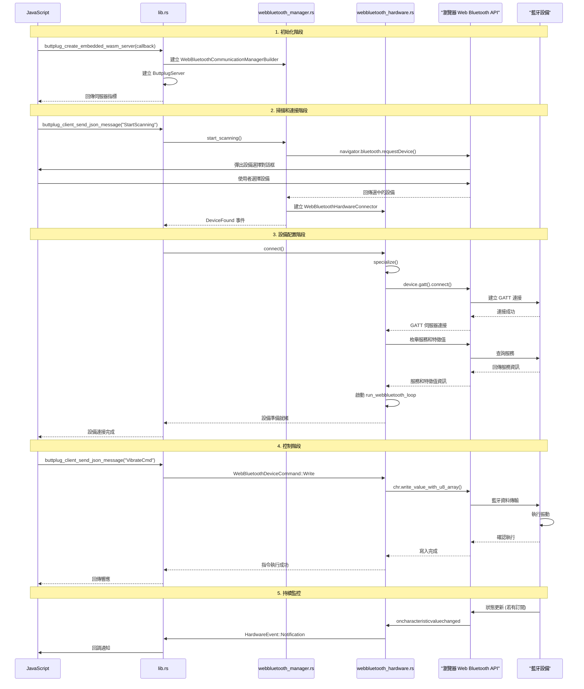

# Buttplug WASM 藍牙設備控制流程說明

## 概述

本文件說明 Buttplug WASM 庫如何透過 Web Bluetooth API 掃描、配對藍牙設備並控制按摩棒振動的完整流程。

## 主要組件和函數（附檔案名稱）

### 1. 初始化伺服器
**函數**: `buttplug_create_embedded_wasm_server` **(📁 lib.rs)**
- 建立 `ButtplugServer` 實例
- 設定 `WebBluetoothCommunicationManagerBuilder` **(📁 webbluetooth_manager.rs)**
- 設置事件流監聽器
- 回傳伺服器指標供後續使用

### 2. 藍牙掃描流程
**核心函數**: `WebBluetoothCommunicationManager::start_scanning` **(📁 webbluetooth_manager.rs)**

掃描流程：
1. 檢查瀏覽器是否支援 Web Bluetooth API
2. 從設備配置管理器獲取所有支援的藍牙設備規格
3. 建立掃描過濾器（根據設備名稱和服務UUID）
4. 呼叫 `navigator.bluetooth.requestDevice()` 彈出設備選擇對話框
5. 使用者選擇設備後，建立 `WebBluetoothHardwareConnector`
6. 發送 `DeviceFound` 事件

```rust
// 關鍵程式碼片段
let nav = web_sys::window().unwrap().navigator();
match JsFuture::from(nav.bluetooth().unwrap().request_device(&options)).await {
    Ok(device) => {
        let bt_device = BluetoothDevice::from(device);
        let device_creator = Box::new(WebBluetoothHardwareConnector::new(bt_device));
        sender_clone.send(HardwareCommunicationManagerEvent::DeviceFound {
            name, address, creator: device_creator,
        }).await;
    }
}
```

### 3. 設備連接和配置
**主要類別**: `WebBluetoothHardwareSpecializer` **(📁 webbluetooth_hardware.rs)**

連接流程：
1. `connect()` - 建立GATT連接
2. `specialize()` - 根據協定規格配置設備：
   - 連接到GATT伺服器
   - 枚舉所需的服務和特徵值
   - 設定斷線事件處理器
   - 建立 `WebBluetoothHardware` 實例

### 4. 設備控制
**核心函數**: `run_webbluetooth_loop` **(📁 webbluetooth_hardware.rs)**

這是設備控制的事件循環，處理以下指令：

#### 寫入指令（控制振動）
```rust
WebBluetoothDeviceCommand::Write(write_cmd, waker) => {
    let chr = char_map.get(&write_cmd.endpoint()).unwrap().clone();
    JsFuture::from(chr.write_value_with_u8_array(&mut write_cmd.data().clone())).await;
}
```

#### 讀取指令
```rust
WebBluetoothDeviceCommand::Read(read_cmd, waker) => {
    let read_value = JsFuture::from(chr.read_value()).await;
    // 處理讀取的資料
}
```

#### 訂閱通知
```rust
WebBluetoothDeviceCommand::Subscribe(subscribe_cmd, waker) => {
    // 設定特徵值變化回調
    chr.set_oncharacteristicvaluechanged(Some(onchange_callback));
    JsFuture::from(chr.start_notifications()).await;
}
```

### 5. 訊息處理
**函數**: `buttplug_client_send_json_message` **(📁 lib.rs)**
- 接收來自JavaScript的JSON訊息
- 反序列化為Buttplug協定訊息
- 透過伺服器處理訊息
- 回傳響應

## 主要流程圖



## 詳細時序圖



## 關鍵檔案功能說明

| 檔案 | 主要功能 |
|------|----------|
| **📁 lib.rs** | WASM 介面層，處理 JavaScript 與 Rust 之間的通訊 |
| **📁 webbluetooth_manager.rs** | 藍牙設備管理器，負責掃描和發現設備 |
| **📁 webbluetooth_hardware.rs** | 藍牙硬體抽象層，負責設備連接和控制 |
| **📁 mod.rs** | 模組定義檔案，匯出公共介面 |

## 振動控制範例

當你想控制設備振動時，會發送類似這樣的JSON訊息：

```json
{
  "VibrateCmd": {
    "Id": 1,
    "DeviceIndex": 0,
    "Speeds": [{"Index": 0, "Speed": 0.5}]
  }
}
```

這個訊息最終會轉換為藍牙寫入指令，透過 `WebBluetoothDeviceCommand::Write` 發送到設備的相應特徵值。

## 技術特點

- **異步架構**: 使用 Tokio 的 mpsc 通道在不同組件間傳遞訊息和事件
- **Web Standards**: 基於 Web Bluetooth API 標準
- **類型安全**: 透過 Rust 的類型系統確保記憶體安全
- **跨平台**: 支援所有相容 Web Bluetooth 的瀏覽器

## 錯誤處理

系統包含多層錯誤處理：
1. **瀏覽器支援檢查**: 確認 Web Bluetooth API 可用性
2. **設備連接錯誤**: 處理 GATT 連接失敗
3. **通訊錯誤**: 處理藍牙讀寫操作失敗
4. **協定錯誤**: 處理訊息序列化/反序列化錯誤

整個系統設計允許 JavaScript 應用程式透過 WASM 介面安全且高效地控制藍牙按摩棒設備。