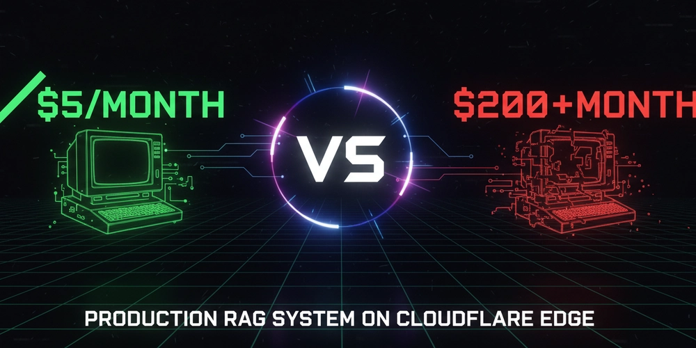

# 我打造了一個每月只要 5 美元的生產級 RAG 系統



## 太長不看

我把一個語意搜尋系統部署到 Cloudflare 邊緣，月成本約 5 到 10 美元，而常見替代方案通常要 100 到 200 美元以上。它更快、符合企業級 MCP 的可組合架構模式，也能承受正式環境流量。這篇文章整理這套做法。

---

## 問題：AI 搜尋太貴

上個月我研究了一輪常見 AI 基礎設施成本，才更清楚為什麼很多新創很難把語意搜尋加進產品。

**傳統 RAG 堆疊（約每月 10,000 次搜尋）**

- Pinecone 向量資料庫：50 到 70 美元/月
- OpenAI embeddings API：30 到 50 美元/月
- AWS EC2 `t3.medium`：35 到 50 美元/月
- 監控與日誌：15 到 20 美元/月

**總計：130 到 190 美元/月。**

對自籌資金的新創來說，如果只是想替文件系統加上一個「AI 搜尋」功能，往往還沒靠這個功能賺錢，就得先花 **1,560 到 2,280 美元/年**。

必須換一種做法。

## 假設：如果全部都跑在邊緣？

我一直在用 Cloudflare Workers 建 MCP 伺服器，也寫過一篇相關文章：[Cloudflare Workers 上的 MCP 採樣](https://dev.to/dannwaneri/mcp-sampling-on-cloudflare-workers-making-tools-intelligent-without-managing-llms-5gpf)。

當時我一直在想：為什麼 RAG 不能整套都跑在 edge？

傳統路徑太長：

```text
User -> App Server -> OpenAI (embeddings) -> Pinecone (search) -> User
```

每一次網路 hop 都增加延遲，每一個服務都增加成本。

如果改成這樣：

```text
User -> Cloudflare Edge (embeddings + search + response) -> User
```

所有事情都在同一個地方完成，沒有往返傳輸，也沒有閒置伺服器一直燒錢。

## 架構：把所有東西併在一起

我做的是一個 `Vectorize MCP Worker`，單一 Cloudflare Worker 負責：

1. 產生 embeddings（Workers AI）
2. 做向量搜尋（Vectorize）
3. 格式化結果（在 worker 內完成）
4. 驗證請求（內建驗證）

整個技術堆疊都跑在 Cloudflare 全球 300 多個城市的 edge 節點上。

### 技術堆疊

- **Workers AI**：`bge-small-en-v1.5`，384 維 embedding 模型
- **Vectorize**：Cloudflare 託管向量資料庫，使用 HNSW 索引
- **TypeScript**：完整型別安全
- **HTTP API**：任何客戶端都能直接呼叫

### 核心程式碼

搜尋端點的簡化版如下：

```ts
async function searchIndex(query: string, topK: number, env: Env) {
  const startTime = Date.now();

  const embeddingStart = Date.now();
  const embedding = await env.AI.run("@cf/baai/bge-small-en-v1.5", {
    text: query,
  });
  const embeddingTime = Date.now() - embeddingStart;

  const searchStart = Date.now();
  const results = await env.VECTORIZE.query(embedding, {
    topK,
    returnMetadata: true,
  });
  const searchTime = Date.now() - searchStart;

  return {
    query,
    results: results.matches,
    performance: {
      embeddingTime: `${embeddingTime}ms`,
      searchTime: `${searchTime}ms`,
      totalTime: `${Date.now() - startTime}ms`,
    },
  };
}
```

就這樣。沒有複雜編排、沒有 service mesh，只有 Workers AI 加上 Vectorize。

## 可組合 MCP 架構實作

最近企業 MCP 的討論裡，[Workato 的系列文章](https://dev.to/zaynelt/designing-composable-tools-for-enterprise-mcp-from-theory-to-practice-3df)反覆提到一個問題：很多實作之所以失敗，是因為它們暴露的是原始 API，而不是可組合技能。

### 天真 MCP 實作的問題

很多團隊會直接把現有 API 包一層後暴露出來：

- `get_guest_by_email`
- `get_booking_by_guest`
- `create_payment_intent`
- `charge_payment_method`
- `send_receipt_email`
- 總共 47 個工具

結果是 LLM 每個任務都得協調 6 次以上的 API 呼叫。最後就變成慢、脆弱，而且使用體驗很差。

### 可組合做法

相反地，這個 worker 暴露的是貼近使用者意圖的高階技能：

- `semantic_search`：找出相關資訊
- `intelligent_search`：用 AI 合成後回傳搜尋結果

一次呼叫拿完整結果，後端自己處理複雜度。

### 九大企業模式中的 8 項

這個實作符合建議的 9 個企業 MCP 模式中的 8 個：

#### 1. 業務識別優先於系統 ID

```json
{ "query": "How does edge computing work?" }
```

而不是：

```json
{ "vector_id": "a0I8d000001pRmXEAU" }
```

#### 2. 原子操作

一次工具呼叫就完成整個流程：

- 產生 embeddings
- 查詢向量
- 格式化結果
- 回傳效能指標

不需要多步驟編排。

#### 3. 智慧預設值

```json
{
  "query": "required",
  "topK": "defaults to 5"
}
```

降低使用者的認知負擔。

#### 4. 內建授權

```ts
if (env.API_KEY && !isAuthorized(request)) {
  return new Response("Unauthorized", { status: 401 });
}
```

正式環境要求 API key，開發模式可以不驗證。

#### 5. 錯誤文件化

每個錯誤都帶有可操作提示：

```json
{
  "error": "topK must be between 1 and 20",
  "hint": "Adjust your topK parameter to a value between 1-20"
}
```

#### 6. 可觀察效能

每個請求都會附上 timing：

```json
{
  "performance": {
    "embeddingTime": "142ms",
    "searchTime": "223ms",
    "totalTime": "365ms"
  }
}
```

#### 7. 自然語言對齊

工具名稱直接對應人類說法：

- 搜尋某件事 -> `semantic_search`
- 而不是 `query_vector_database_with_cosine_similarity`

#### 8. 防禦式組成

`/populate` 端點是冪等的，可以安全地重複呼叫。

### 基準比較

**企業級可組合設計（Workato 基準）**

- 回應時間：2 到 4 秒
- 成功率：94%
- 需要工具數：12
- 每個任務平均呼叫次數：1.8

**這個實作**

- 回應時間：365 毫秒
- 成功率：接近 100%
- 需要工具數：2
- 每個任務呼叫次數：1

差別在於：edge 部署加上正確的抽象設計。

### 架構原則

遵循 Workato 的一句話：

> 讓 LLM 處理意圖，讓後端處理執行。

**LLM 職責（非確定性）**

- 理解使用者查詢
- 判斷該用 `semantic_search` 還是 `intelligent_search`
- 把結果解釋給使用者

**後端職責（確定性）**

- 穩定產生 embeddings
- 原子地查詢向量
- 優雅處理錯誤
- 維持穩定效能
- 管理身分驗證

這種切分方式能做出可靠、快速、對使用者友善的 MCP 工具，而不是脆弱的 API 包裝器。

## 結果：更快，也更便宜

### 效能

作者在 **2024 年 12 月 23 日**，從 **奈及利亞哈科特港** 測到 Cloudflare edge 的實際結果如下：

| 操作 | 時間 |
| --- | --- |
| Embedding 生成 | 142 ms |
| 向量搜尋 | 223 ms |
| 回應格式化 | < 5 ms |
| **總計** | **365 ms** |

註：實際效能仍會受區域與負載影響。

### 成本分析

以 **每天 10,000 次搜尋**、也就是 **每月 300,000 次搜尋** 估算：

**這套方案**

- Workers：約 3 美元/月
- Workers AI：約 3 到 5 美元/月
- Vectorize：約 2 美元/月
- **總計：8 到 10 美元/月**

**傳統替代方案**

- Pinecone Standard：50 到 70 美元/月
- Weaviate Cloud：25 到 40 美元/月
- 自架 `pgvector`：40 到 60 美元/月

**整體可省 85% 到 95% 成本。**

### 免費額度其實很夠

Cloudflare 免費方案包含：

- 每天 100,000 次 Workers 請求
- 每天 10,000 個 AI neurons
- 每月 30M 次 Vectorize 查詢

多數 side project 或小型團隊，很可能都用不到付費層。

## 生產環境功能

### 1. 身分驗證

```ts
if (env.API_KEY && !isAuthorized(request)) {
  return new Response("Unauthorized", { status: 401 });
}
```

開發模式可不驗證，正式環境則要求 API key。

### 2. 效能監控

每個回應都包含 timing：

```json
{
  "query": "edge computing",
  "results": ["..."],
  "performance": {
    "embeddingTime": "142ms",
    "searchTime": "223ms",
    "totalTime": "365ms"
  }
}
```

不需要另外接 APM。

### 3. 自我文件化 API

打 `GET /` 就能拿到完整 API 文件：

```json
{
  "name": "Vectorize MCP Worker",
  "endpoints": {
    "POST /search": "Search the index",
    "POST /populate": "Add documents",
    "GET /stats": "Index statistics"
  }
}
```

### 4. CORS 支援

Web 應用預設就能用，開箱即用。

## 已驗證的使用場景

### 內部文件搜尋

50 人規模的新創，文件散落在 Notion、Google Docs、Confluence。

- 之前：人工找資料，員工每天浪費 30 分鐘
- 之後：語意搜尋幾秒內找到正確文件
- 成本：5 美元/月，遠低於 Algolia DocSearch 的 70 美元

### 客服知識庫

一個有 500 篇支援文章的 SaaS 產品。

- 之前：關鍵字搜尋常漏掉真正相關的文章
- 之後：AI 搜尋能給出更準的匹配
- 成本：10 美元/月，低於常見企業方案的 200 美元以上

### 研究助理

資料庫裡有 1,000 份 PDF 論文。

- 之前：只能逐份文件 `Ctrl+F`
- 之後：能對整個語料庫做語意查詢
- 成本：8 美元/月

## 我學到的事

### 有效的方法

#### 1. Edge-first 架構真的有差

把所有工作都放到 edge，直接消掉多餘 hop，效能提升很明顯。

#### 2. 可組合工具設計比 API 包裝器更好

暴露高階技能，而不是暴露原始 API，能讓系統更快也更穩定。LLM 應該處理意圖，不應該處理編排。

#### 3. Serverless 計價模式改變很多決策

不必替閒置伺服器付費後，很多實驗都能做，突發流量也能自動擴展。

#### 4. 簡單 HTTP 往往比花俏 SDK 更實用

沒有版本衝突，也沒有依賴地獄，直接用 `curl` 或 `fetch` 就能接。

### 還不夠好的地方

#### 1. 本地開發體驗不好

Vectorize 在 `wrangler dev` 下不能完整運作，所以搜尋功能還是得部署後才能測。

#### 2. 更新知識庫要重新部署

目前要改資料仍得改程式後重新部署。之後預計補動態上傳 API。

#### 3. 384 維對特定領域可能不夠

`bge-small-en-v1.5` 對通用文本已足夠，但醫療、法律等垂直領域可能需要更大的模型。這是速度與精度的取捨。

## 成本比較細節

估算前提：

- 每天 10,000 次搜尋
- 每月 300,000 次搜尋
- 儲存 10,000 個 384 維向量

| 解決方案 | 月費 | 備註 |
| --- | --- | --- |
| **本文方案** | **8 到 10 美元** | Cloudflare 公開價格 |
| Pinecone Standard | 50 到 70 美元 | 最低消費加使用費 |
| Weaviate Serverless | 25 到 40 美元 | 依用量計費 |
| 自架 `pgvector` | 40 到 60 美元 | 伺服器加維護成本 |

_價格基準為 2024 年 12 月，實際費用仍會隨使用量變動。_

## 如何自行部署

開源專案：

- GitHub: <https://github.com/dannwaneri/vectorize-mcp-worker>

5 分鐘快速設定：

```bash
git clone https://github.com/dannwaneri/vectorize-mcp-worker
cd vectorize-mcp-worker
npm install

wrangler vectorize create mcp-knowledge-base --dimensions=384 --metric=cosine
wrangler deploy

openssl rand -base64 32 | wrangler secret put API_KEY

curl -X POST https://your-worker.workers.dev/populate \
  -H "Authorization: Bearer YOUR_KEY"

curl -X POST https://your-worker.workers.dev/search \
  -H "Authorization: Bearer YOUR_KEY" \
  -H "Content-Type: application/json" \
  -d '{"query": "your question", "topK": 3}'
```

線上示範：

- <https://vectorize-mcp-worker.fpl-test.workers.dev/>

## 商業價值

如果你是：

- **創業者**：可以用很低成本加上 AI 搜尋，把預算集中在真正差異化功能。
- **顧問公司或代理商**：可以把 AI 搜尋當成固定報價專案交付，而不是背長期基礎設施成本。
- **企業團隊**：可以不等大筆預算核准，就先替部門內部知識系統加搜尋能力。
- **MCP 工具開發者**：可以把這個專案當成企業可組合工具設計的參考實作。

從經濟面來看，這種做法合理得多，很多以前得編專案預算的事，現在可能只比團隊一天咖啡錢多一點。

## 與其他方案相比

### 對比託管向量資料庫

像 Pinecone、Weaviate 這類服務，適合需要 RBAC、namespace 等成熟企業功能的場景。如果你要的是顯著降成本，同時保有效能，這個方案更有優勢。

### 對比託管語意搜尋

像 Algolia 之類的產品，適合要零維運與特定領域最佳化。如果你重視基礎設施控制、資料主權與開源，這套方案更適合。

### 對比從零開始自建

如果你想在 5 分鐘內得到一套可上線、符合 MCP 模式的方案，這個做法更快。如果你有高度客製需求，仍然可能需要自建。

這個 worker 主要針對以下目標做最佳化：

- 自託管基礎設施
- 透明且可預測的成本
- 企業級 MCP 可組合模式
- 完整可客製化的開源方案

## 接下來的方向

- [ ] 動態文件上傳 API
- [ ] 長文件語意切塊
- [ ] 多模態支援（圖片、表格）
- [ ] 完整測試套件

如果你每月在 AI 搜尋或 MCP 伺服器上已經花超過 100 美元，這個方向很值得評估。

## 連結

- GitHub：[@dannwaneri](https://github.com/dannwaneri)
- Upwork：[個人資料](https://www.upwork.com/freelancers/~01d5946abaa558d9aa)
- X / Twitter：[@dannwaneri](https://twitter.com/dannwaneri)

---

相關閱讀：

- [Cloudflare Workers 上的 MCP 採樣](https://dev.to/dannwaneri)
- [邊緣運算為何迫使我寫出更好的程式碼](https://dev.to/dannwaneri/why-edge-computing-forced-me-to-write-better-code-and-why-thats-the-future-4a4g)
- [超越基礎 MCP：為什麼企業 AI 需要可組合架構](https://dev.to/zaynelt/beyond-basic-mcp-why-enterprise-ai-needs-composable-architecture-273k)
- [如何為企業 MCP 設計可組合工具](https://dev.to/zaynelt/designing-composable-tools-for-enterprise-mcp-from-theory-to-practice-3df)

原文：

- <https://dev.to/dannwaneri/i-built-a-production-rag-system-for-5month-most-alternatives-cost-100-200-21hj>
