# Web3 全端工程師的技術養成之路（30 天完整章節整理）

- 系列頁：https://ithelp.ithome.com.tw/2020-12th-ironman/articles/6262
- 整理時間：2026-02-14
- 說明：章節內容完整展開，內文圖片已下載至本地 `ironman-6262-assets/images/`。

## DAY 1｜Day 1 - 前言

- 原文：https://ithelp.ithome.com.tw/articles/10314442
- 發佈時間：2023-09-10 21:32:14

### 章節內容

#### 1. 簡介

大家好，我是 KryptoGO 的 Harry，今天先聊一下為什麼想寫這系列的文章，還有預計會涵蓋哪些內容。我遇過許多人對 web 3 與區塊鏈相關技術感興趣，卻又因為專有名詞太多而不知道要從什麼方向開始學習。在網路上找到 web 3 技術的資源大部分是關於智能合約、去中心化應用程式（DApp）的開發，但 web 3 的技術範圍遠不止這些。加上這個領域的變化太快，很多教學過了一兩年就已經失效（像以太坊常用的測試網在幾年內從 Rinkeby 轉到 Goerli 再到 Sepolia），或是流行的開發工具、環境甚至區塊鏈底層的機制都發生一些改變，因此我們需要對 web 3 技術的本質有更多認識，才能幫助我們快速學習新知

本系列文章希望讓讀者對 web 3 技術的全景有基本的認識，我會從區塊鏈的基礎知識講到在前端、後端及 App 端是如何整合 web 3 技術開發出實際的應用，因此適合已經對軟體開發有一定的了解，想要學習 web 3 技術並與自己所學過的技術結合的讀者。

#### 2. 包含範圍

本系列會包含以下這些主題，會假設讀者對 Web 3 相關技術和操作是完全沒有經驗的：

* 區塊鏈基礎：錢包、智能合約、交易、簽名、密碼學
  * 前端（React JS）：DApp 開發並與區塊鏈互動
  * 後端（Golang）：如何管理錢包、發送交易與整合鏈上資料
  * App 端（Flutter / Dart）：開發區塊鏈錢包所需要的技術

也會從我們公司開發區塊鏈錢包的經驗分享實務上遇到的問題與解法，並在最後帶到關於 web 3 技術更廣泛的議題，如 DeFi、NFT、帳戶抽象、資安、ZK、Layer 2、MPC 等等，盡可能包含當今最前沿的技術主題。

#### 3. 中心化 vs 去中心化

在 Web 3 中，有分成中心化（Centralize）和去中心化（Decentralize）兩大塊，當然這不是二分法而比較像是一個光譜。可以簡單把他們理解為：

* **中心化** ：如虛擬貨幣交易所，會把用戶的錢包餘額、交易紀錄等資料記在中心化的資料庫，目的是提高交易速度並降低交易手續費，而相對應的風險就是交易所本身管理資金的風險（去年倒閉的 FTX 就是屬於這類）
  * **去中心化** ：所有的帳號、資產都是記錄在區塊鏈上的，只要使用者保管好自己的私鑰，不管任何公司 / 國家倒了都不會受到損失。像非託管錢包（Non-custodial wallet）、去中心化應用 （Decentralized App 或簡稱 DApp）、去中心化金融 （Decentralized Finance 簡稱 DeFi）、NFT（非同質化代幣），以及以太坊、Polygon 等這些區塊鏈本身都算是去中心化的領域

在本系列文章我們會專注在去中心化的技術領域，比較不會探討到虛擬貨幣交易所是怎麼運作的

#### 4. 學習方式

跟學習任何技術一樣，最好的方式就是實作。除了實際把文章中程式碼跑起來玩玩看之外，透過實際操作各種錢包、DApp 可以更深入從中探索背後的原理和機制。鼓勵大家在看到任何新的 web 3 應用時多多嘗試，會有意想不到的收穫。

以上是第一天的內容，請大家期待接下來的系列文章！

## DAY 2｜Day 2 - 基礎：區塊鏈錢包

- 原文：https://ithelp.ithome.com.tw/articles/10316715
- 發佈時間：2023-09-11 00:31:46

### 章節內容

#### 1. 未分章內容

今天的內容會帶大家實際安裝一個區塊鏈錢包，這會在後續的內容中使用，也簡單介紹區塊鏈錢包背後的運作原理，以及市面上有哪些不同種類的錢包。

#### 2. 安裝 MetaMask

[MetaMask](https://metamask.io/) 是目前最受歡迎的區塊鏈錢包之一，我們馬上來安裝瀏覽器 Extension 版本的 Metamask：

1. 前往 Metamask [官方下載頁面](https://metamask.io/download/)，找到你使用的瀏覽器進入 Extension 商店

     * 以 Chrome 為例，按下 Add to Chrome 就可以了

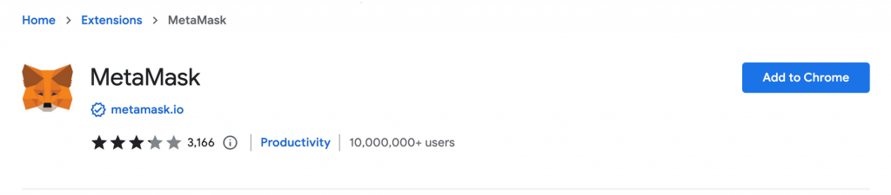

  2. 完成安裝後，會引導進行初次設定，如果還沒有用過 Metamask 的人就選擇 Create a new Wallet 即可

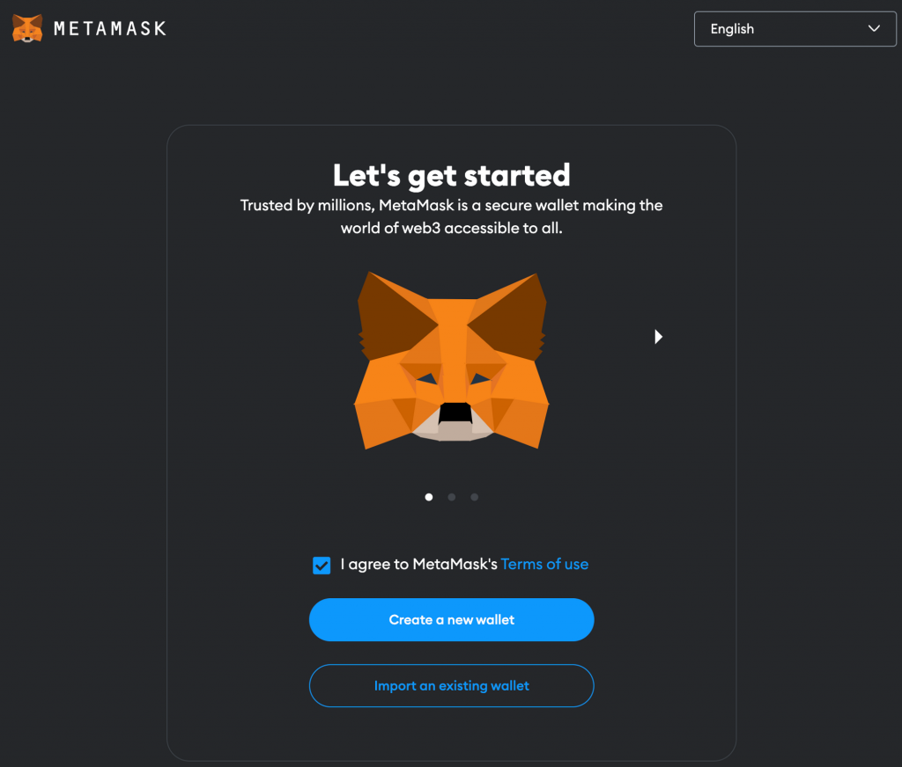

  3. 接下來他會要你輸入密碼，這個密碼是用來加密錢包私鑰的，如果洩露可能會導致資產被盜，所以盡量設定沒有在其他地方用過的長一點的密碼會比較好

  4. 接下來他會問你是否要備份「註記詞」，也就是 12 個字的英文單字，這 12 個單字就會對應到你錢包的私鑰，必須妥善記錄下來保存在安全的地方。

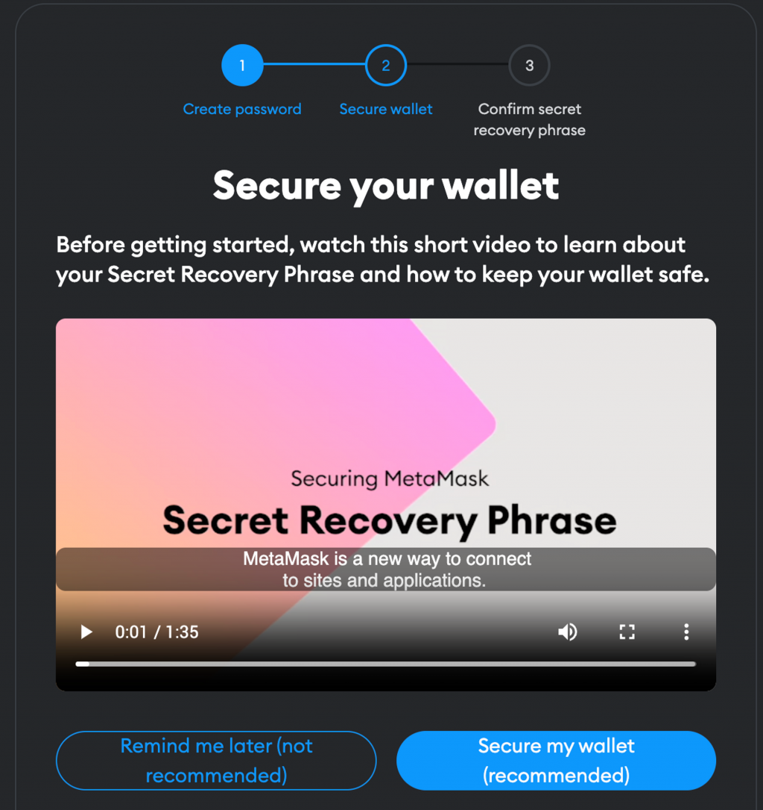

  5. 在這個頁面把 12 個英文單字的註記詞紀錄下來

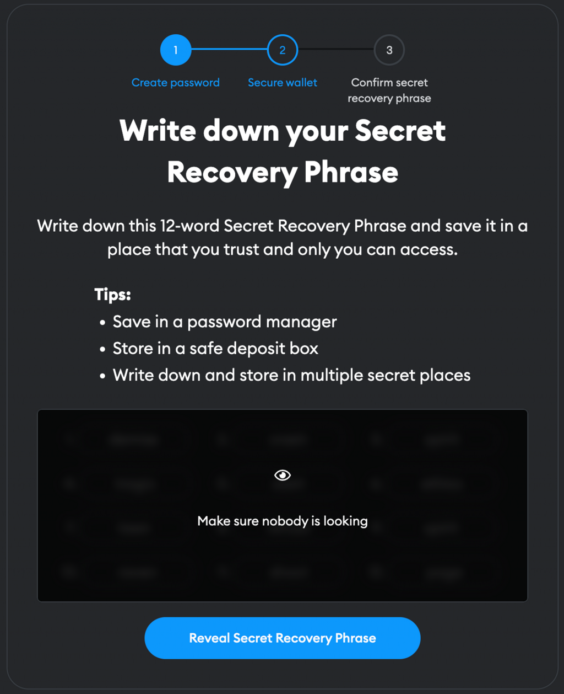

按照指示完成後續步驟後，就可以開始使用 MetaMask 錢包了。

#### 3. 初探 MetaMask

打開 Metamask 後會看到像這樣的介面：

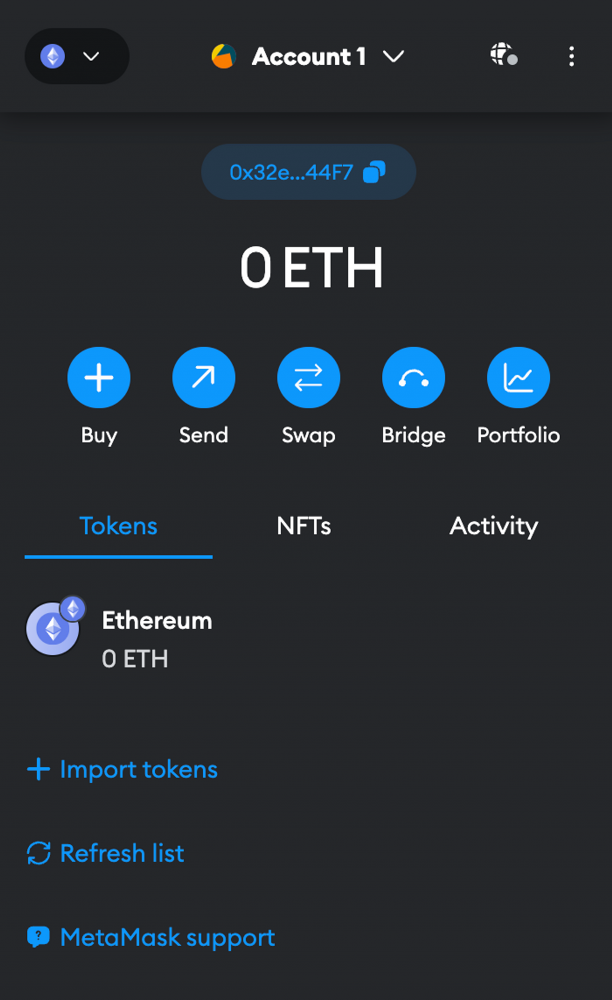

* 左上角的按鈕可以切換不同的區塊鏈網路。預設是以太坊（Ethereum），點進去可以看到不同的區塊鏈（如 Linea，或是勾選 Test networks 後可以看到 Goerli、Sepolia 等等鏈）
  * 在 Account 下方是你的錢包地址，他會是一串十六進制的文字，所以之後如果別人要把幣打給你，只要把這個地址給他就可以了
  * 下面會顯示錢包的餘額、持有的代幣以及交易歷史。但因為是全新的錢包，所以還不會有任何代幣跟交易紀錄

#### 4. 區塊鏈與私鑰

在創建完 Metamask 錢包後，來講解一下前面提到的許多專有名詞，以及到底什麼是區塊鏈錢包。

區塊鏈的本質其實就是一個帳本，紀錄著每個帳戶（也就是地址）上持有多少資產的資訊。比較特別的是這些資訊會被公開並備份到大量的電腦上（稱為區塊鏈的節點），透過密碼學的機制確保這個帳本是無法竄改的。

而我要怎麼從一個帳戶（地址）轉帳出去，就必須證明我擁有這個地址的使用權，這就是透過這個地址背後對應的一把「私鑰」，透過私鑰與一系列密碼學的計算產生「簽章」後廣播給全世界的人，別人就可以透過這個「簽章」來驗證這筆交易是否真的是由擁有私鑰的人簽名出來的。如果驗證通過，這筆轉帳的交易才會成立並被包含到區塊鏈的帳本中。因此掌握了私鑰就等於掌握了一個區塊鏈地址的所有資產。後續會提到更多關於區塊鏈背後的密碼學機制，這邊只要先學習初步的概念即可。

至於「註記詞」與「私鑰」的差別，私鑰的格式是長得像這樣的十六進制字串：

[code]
    37d2a4f8651d1b46bfb42e5b1fe7f6e910342c2e7aa64d1c55e37d8a70df6e12

[/code]

至於註記詞則是長得像這樣的 12 個英文單字

[code]
    toe little globe cousin miss wink thank vibrant arrive any clump hockey

[/code]

在其他錢包中可能會看到 24 個英文單字的版本，這兩者之間的關聯是私鑰可以從註記詞計算出來，因此兩者都有完整錢包的控制權，註記詞是讓人更方便抄寫、紀錄的格式。詳細的計算方式可以參考 [BIP-32, BIP-39, BIP-44 等標準的介紹](https://medium.com/taipei-ethereum-meetup/%E8%99%9B%E6%93%AC%E8%B2%A8%E5%B9%A3%E9%8C%A2%E5%8C%85-%E5%BE%9E-bip32-bip39-bip44-%E5%88%B0-ethereum-hd-%EF%BD%97allet-a40b1c87c1f7)

如果要了解更多關於區塊鏈的機制，推薦可以看 [3Blue1Brown 影片的解說](https://www.youtube.com/watch?v=bBC-nXj3Ng4)，裡面有更完整的解釋

#### 5. 錢包的種類

所以區塊鏈錢包的本質就是一個管理私鑰的工具，並可以對使用者想執行的交易產生簽名，將其廣播到區塊鏈上。而錢包又有分幾個種類：

1. **瀏覽器錢包** ：許多錢包都可以透過瀏覽器的擴充套件進行安裝，這樣在操作去中心化應用（DApp）時可以輕易地連接錢包。當你按下連接錢包的按鈕，透過瀏覽器擴充套件就可以連接你已安裝的錢包。它們會把私鑰保存在瀏覽器擴充套件的 local storage 裡，透過一些安全措施確保私鑰和助記詞不會被破解或被其他應用取得。類似的錢包還有像 [Rabby](https://rabby.io/)、[Coinbase Wallet](https://www.coinbase.com/wallet) 等等。
  2. **手機 App 錢包** ：本質上跟瀏覽器錢包做的事情一樣，在 App 內管理使用者的私鑰、地址、資產以及交易紀錄。很多錢包商也會同時推出 App 錢包與瀏覽器錢包，讓使用者可以在所有平台都有一致的體驗。Metamask 錢包也有手機 App 的版本，類似的錢包還有像 [Trust Wallet](https://trustwallet.com/)、[Rainbow](https://rainbow.me/)、[KryptoGO](https://www.kryptogo.com/wallet) 等等（我們也有[瀏覽器錢包](https://chrome.google.com/webstore/detail/bgaihnkooadagpjddlcaleaopmkjadfl)）。
  3. **冷錢包** ：冷錢包是一種更安全的私鑰保管方式。它是一個類似於 USB 的獨立的硬體裝置，當使用者想進行交易時，要把冷錢包裝置連接到電腦並執行交易，交易內容會被送到冷錢包硬體上讓使用者確認並計算簽章，完成後再送回電腦。過程中私鑰會保存在這個裝置裡並且不會與外部環境互動，也就是私鑰不會出現在電腦的記憶體或硬碟空間中，把私鑰外洩的風險降得更低，當然這樣也降低了一些方便性。
  4. **代管錢包** ：是比較新的一種錢包類型，他們雖然也提供去中心化的錢包地址，但私鑰其實是由第三方幫使用者管理。這種服務通常是可以讓使用者用社交帳號（Google、Facebook 等）登入，便可以直接操作這個錢包和查看資產，並且不用記任何註記詞或私鑰，但這種便利性帶來的代價是必須信任這間公司管理你的私鑰。類似的錢包有 [Magic](https://magic.link/) 和 [Web3Auth](https://web3auth.io/)

#### 6. 小結

市面上許多區塊鏈錢包都各有不同的特色，對不同區塊鏈/代幣的支援度也不同，選擇是非常多樣的，大家也可以多下載不同的區塊鏈錢包體驗看看。明天我們會開始使用錢包操作測試鏈上的應用。

## DAY 3｜Day 3 - 基礎：操作測試鏈應用

- 原文：https://ithelp.ithome.com.tw/articles/10316725
- 發佈時間：2023-09-12 06:21:57

### 章節內容

#### 1. 未分章內容

今天我們會講解主網跟測試網的區別，並帶大家領取測試網上的代幣，來實際操作一個區塊鏈應用。

#### 2. 主網與測試網

在區塊鏈的世界中，我們有兩種不同的網絡：**主網** (Mainnet) 和**測試網** (Testnet)。主網是真正的金融交易發生的地方，如各種 DeFi 和 NFT 活動。而所有在主網上的代幣（如以太幣 ETH），都是真實有價的代幣。

相對於主網，測試網是為開發者提供的環境，用於測試智能合約和應用程序。因為如果每次測試智能合約都要部署到主網，就會花一筆費用，尤其在以太坊這種手續費較高的鏈上更是成本高昂，因此才會需要有測試鏈，讓開發者不需要花費真正的資金。

以太坊目前的主要測試網是 **Sepolia** ，在 Metamask 中可以方便地切換主網和測試網，只要先點擊左上角的切換網路按鈕，並開啟「Show test networks」後選擇 Sepolia，就可以成功切換到 Sepolia 測試鏈了。

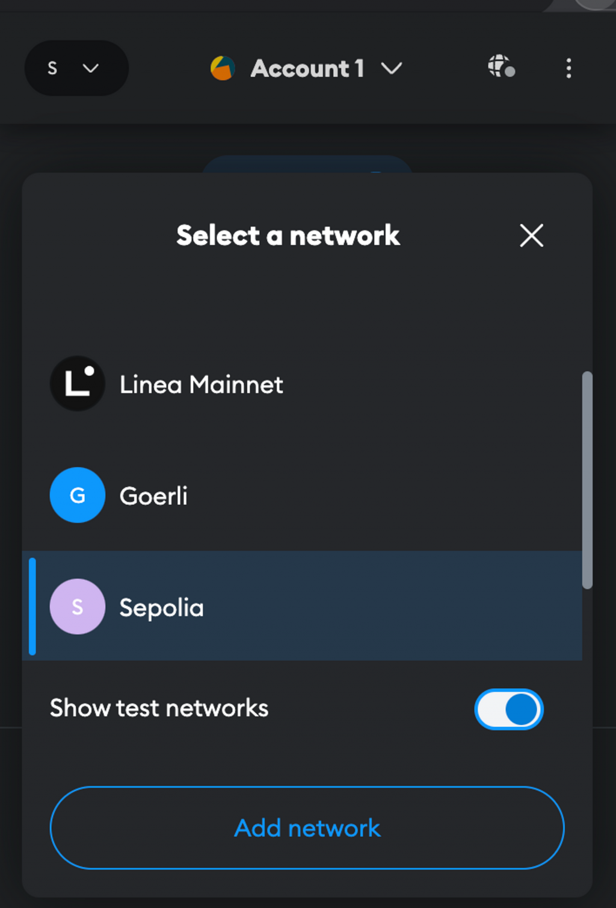

值得注意的是在 Metamask 中不管切換到哪條鏈，對應的錢包地址都不會改變，這是因為這些鏈都跟以太坊的底層機制相容，他們的許多邏輯（如產生錢包、簽名交易等等）跟以太坊都是相同的，因此會把他們稱為 EVM Compatible 的鏈（EVM 指的是 Ethereum Virtual Machine，可以想像成運行以太坊帳本的虛擬機）。之後我們也會看到更多的 EVM Compatible 的鏈。

#### 3. 區塊鏈瀏覽器 (Explorer)

由於 Metamask 錢包中只能看到自己錢包地址的餘額與交易紀錄，但大家常會聽到說區塊鏈的帳本是公開透明、任何人都可以查詢的，那要怎麼看其他錢包地址的交易紀錄呢？這就要提到區塊鏈的「瀏覽器」（或稱為 **Explorer** ），不過這個瀏覽器跟我們平常聽到的瀏覽器概念不太一樣，他不是用來瀏覽網頁的，而是用來查詢區塊鏈上的任何資料。對於以太坊主網，最常用的 Explorer 是 [Etherscan](https://etherscan.io/)。你可以使用它來查看以太坊上所有的交易、地址餘額和區塊資訊。點進去可以看到許多關於以太坊網路最即時的資訊（如交易量、最新的區塊以及交易紀錄、手續費多高等等）

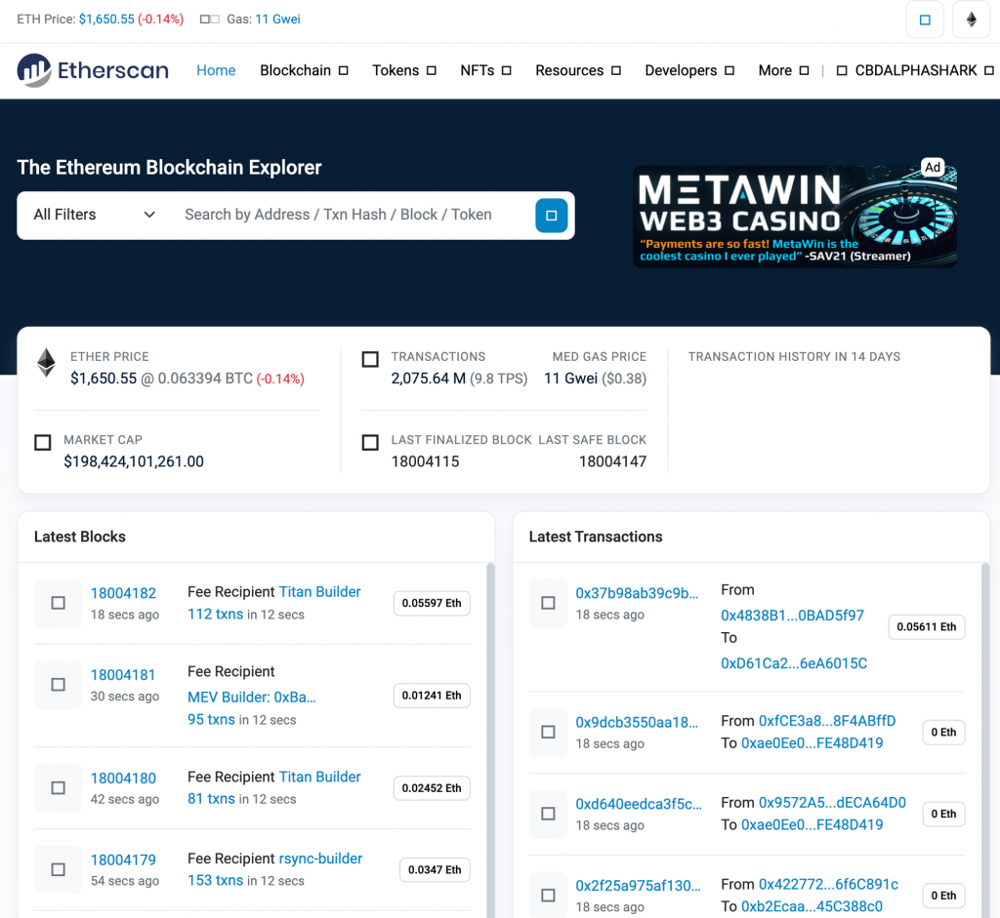

每條區塊鏈通常都會有對應的 Explorer，這樣才能方便大家查詢自己發出的交易的狀態，而不需要自己打 API 查詢。所以像 Sepolia 測試網也有他對應的 Explorer：**[Sepolia Etherscan](https://sepolia.etherscan.io/)** ，或是像 Polygon 這條 EVM Compatible 的鏈也有對應的 Explorer：[**Polygonscan**](https://polygonscan.com/)

| Explorer URL
---|---
Ethereum | <http://etherscan.io/>
Polygon | <http://polygonscan.com/>
BNB Chain | <https://bscscan.com/>
Arbitrum | <https://arbiscan.io/>
Optimism | <https://optimistic.etherscan.io/>

#### 4. 獲取測試幣

由於測試網上的代幣不具有真實價值，開發者可以透過水龍頭服務（Faucet）免費獲得它們。這些 Faucet 服務通常會要求進行一些基本驗證，例如通過 Twitter 或 Email，就會發放一定數量的測試代幣到指定的地址。

很多 Faucet 常常會被領到乾掉，所以有時需要多搜尋一下才能找到還能用的。Sepolia 官方的 [Github repo](https://github.com/eth-clients/sepolia) 內有幾個連結，其中一個實際可用的是 [Alchemy](https://www.alchemy.com/) 這間公司維護的 [Sepolia Faucet](https://sepoliafaucet.com/)，只要註冊 Alchemy 的帳號就可以領取測試幣。後續的文章也會用到 Alchemy 的服務，所以可以先註冊起來。接下來我們實際用它來領取 Sepolia 鏈上的原生代幣 ETH。

首先我們到 [Sepolia Faucet](https://sepoliafaucet.com/) 網站，點擊註冊或登入 Alchemy

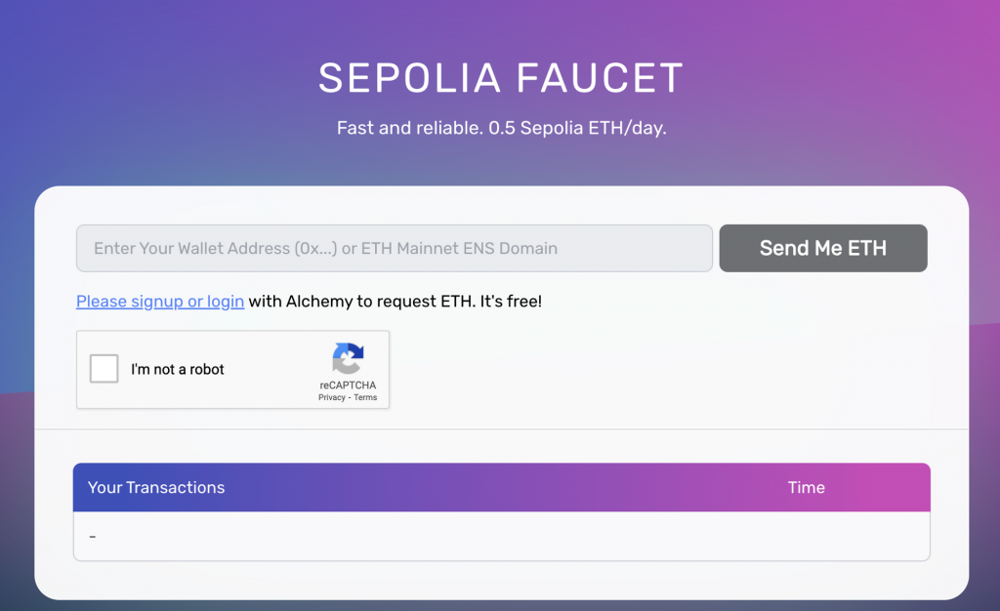

按照指示創立完帳號並登入後，就可以輸入地址領取 Sepolia 鏈上的測試用 ETH 了。這邊要輸入的地址是 Metamask 內的「Account 1」下方可以找到。點擊 Send Me ETH 送出後就可以看到成功的訊息

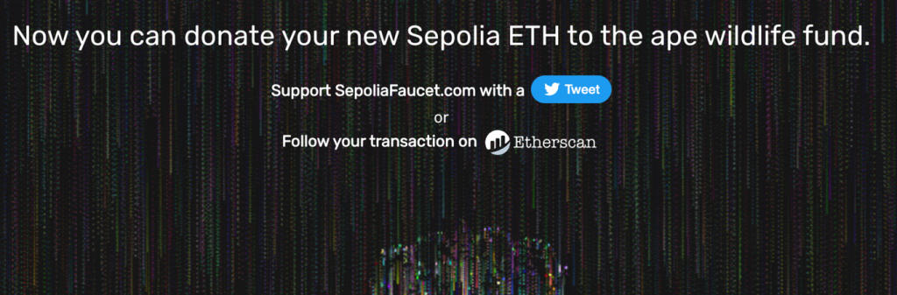

如果點擊進去上方 Etherscan 的連結，可以看到長得像這樣的頁面，而這就是上面提到的區塊鏈瀏覽器。剛才從 Alchemy 轉移測試用 ETH 給我的這筆交易已經成功上鏈，他對應的交易就是這一筆，可以看到 To 的那欄就會是剛才輸入的錢包地址，他打了 0.5 ETH 給我。

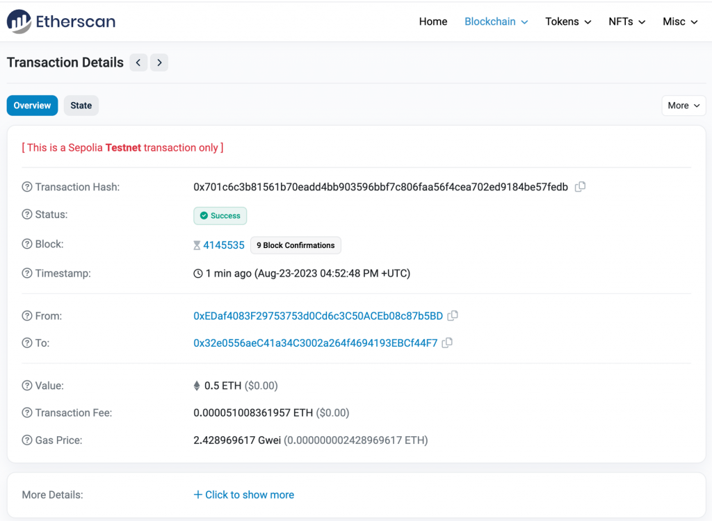

這時再回到 Metamask 中，就可以看到錢包已經收到 Sepolia 的 ETH 了！

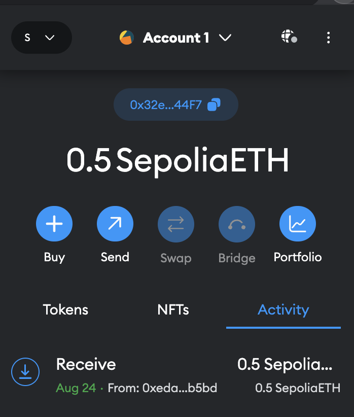

#### 5. 使用 Uniswap

接下來我們會實際在測試鏈上操作一次區塊鏈上的應用，使用的是 [Uniswap](https://uniswap.org/) 這個 DeFi 應用，他是最廣為人知的做代幣交易的去中心化交易所，可以在上面買賣各種代幣，這類交易所就是 Decentralized Exchange（簡稱 DEX）。有別於中心化交易所的掛單簿形式（也就是我可以指定要掛買單或賣單後等待他成交），目前主流的去中心化交易所都是採取「Swap」（兌換）的機制，也就是只要指定我想從哪個幣換到哪個幣、換多少量，這時交易所就會提供一個報價，只要使用者接受這個報價就可以直接交易。最近 Uniswap 即將要推出 V4 的協議，加入了限價單的機制，也許未來會成為主流。

可以前往 [Uniswap](https://app.uniswap.org/) 體驗實際的操作，點擊右上角的 Connect 按鈕並選擇 Metamask 就可以連接上錢包了，因為我們剛剛已經在 Metamask 中切換到 Sepolia 鏈，所以 Uniswap 會自動偵測現在我在使用的是 Sepolia 鏈。而在測試網能選擇的幣別比較少，這裡我們選擇從 ETH 兌換成 UNI 這個 Uniswap 服務自己發行的代幣，並輸入一個比較小的數字作為測試

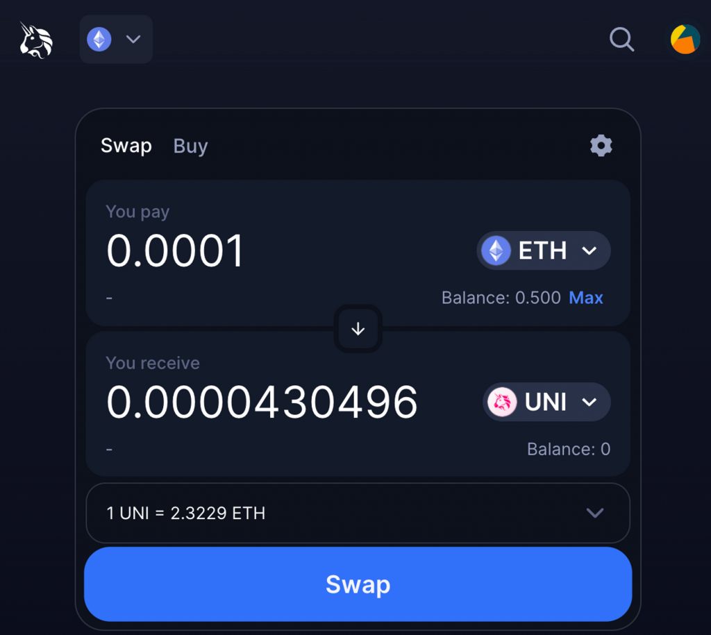

點擊 Swap 並按下確認後，Uniswap 就會跟 Metamask 請求錢包操作，並跳出一個 Metamask 的視窗要求你確認交易，裡面會顯示交易的細節、要執行的操作以及會花多少手續費（Gas Fee）

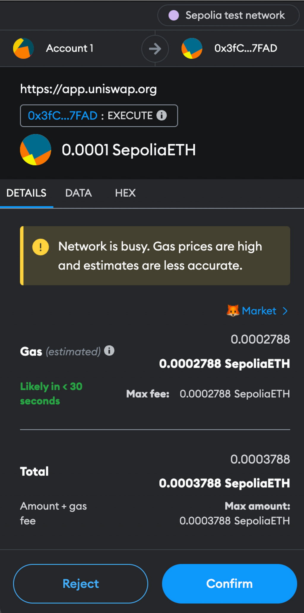

按下確認後交易就成功被送出了，一樣可以點擊 View on Explorer 會連到 Sepolia Etherscan 上的這筆交易，等個幾秒交易成功後，就會在 Uniswap 的介面上看到帳戶餘額的變化。這樣就完成我們第一次的 DApp 操作了！

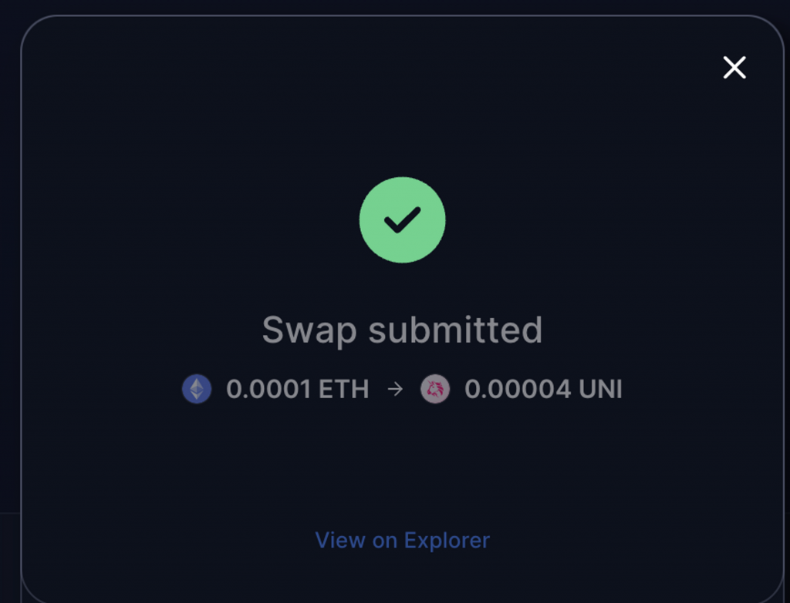

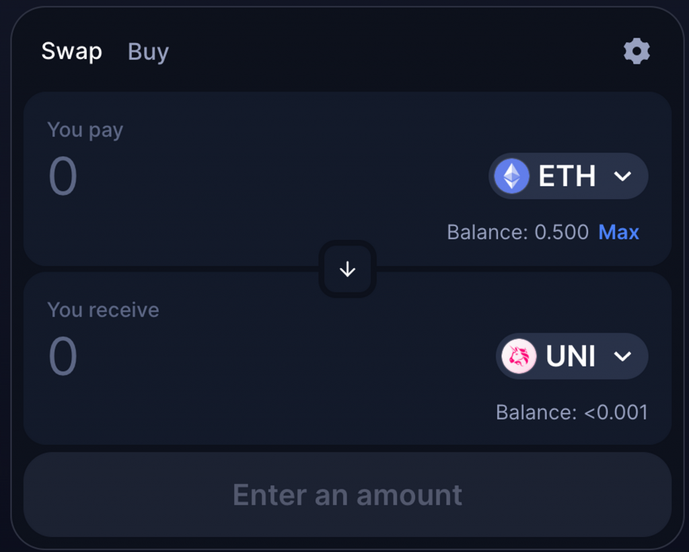

#### 6. 小結

今天我們了解了主網跟測試網的差異，並實際操作一次測試網上的應用，這樣的基礎知識就已經足夠進入前端的開發了。接下來幾天我們會開始介紹如何開發基本的 DApp 前端應用，以及如何跟區塊鏈互動。

## DAY 4｜Day 4 - Web3 與前端：實作第一個 DApp

- 原文：https://ithelp.ithome.com.tw/articles/10317706
- 發佈時間：2023-09-13 19:26:31

### 章節內容

#### 1. 未分章內容

今天我們會用 React 實作一個最簡單的去中心化應用，也就是 Decentralized App（簡稱 DApp）。許多區塊鏈應用之所以只需要前端的技術，是因為可以直接把區塊鏈本身當成後端來用，因為區塊鏈就支援讀寫的操作。

#### 2. 區塊鏈節點服務介紹

對於「讀取」操作可以透過區塊鏈的節點服務提供商，得到區塊鏈上的即時資料。對於「寫入」操作則可以透過發送一個交易請求給錢包，讓使用者在錢包內確認交易後，把交易送到區塊鏈節點，等待交易被寫入區塊鏈。由於請求的格式都是 [JSON RPC](https://www.jsonrpc.org/)，所以節點也被稱為 RPC Node。

上面提到不管是讀取或寫入操作，都會依賴「區塊鏈節點」服務提供商，因此他們是區塊鏈應用中非常重要的角色。回顧我們之前提過的概念：

> 區塊鏈的本質其實就是一個帳本，紀錄著每個帳戶（也就是地址）上持有多少資產的資訊。比較特別的是這些資訊會被公開並備份到大量的電腦上（我們把它稱為區塊鏈的節點），透過密碼學的機制確保這個帳本是無法竄改的。

當我們想開發一個 DApp 時，如果還要自己架設區塊鏈節點，並且把所有區塊鏈的歷史資料全部同步下來，那勢必會花很高的儲存空間與網路頻寬成本，例如截至今天比特幣的歷史資料已超過 500GB，以太坊則超過 1000GB，而且每個節點要能即時跟其他節點同步資料。因此最簡單的作法是使用別人已經建好的節點服務，而上次介紹的 [Alchemy](https://www.alchemy.com/) 則是市面上最有名的節點服務提供商之一（另外還有像 [Infura](https://www.infura.io/)、[Quicknode](https://www.quicknode.com/) 等等），接下來會假設大家已經註冊 Alchemy 服務。另外對自建節點這個主題有興趣的話也可以參考 Ethereum 的 [Run a node 教學](https://ethereum.org/en/run-a-node/)。

#### 3. 今日目標

前一天我們操作了測試鏈的 Uniswap，可以看到一進入 Uniswap 介面會有連結錢包的功能，連結上了之後介面會顯示當下錢包地址、連接的鏈、這個地址的餘額，以及點擊鏈的圖示可以切換不同的鏈。今天我們的目標是能把這些功能的雛形完成。

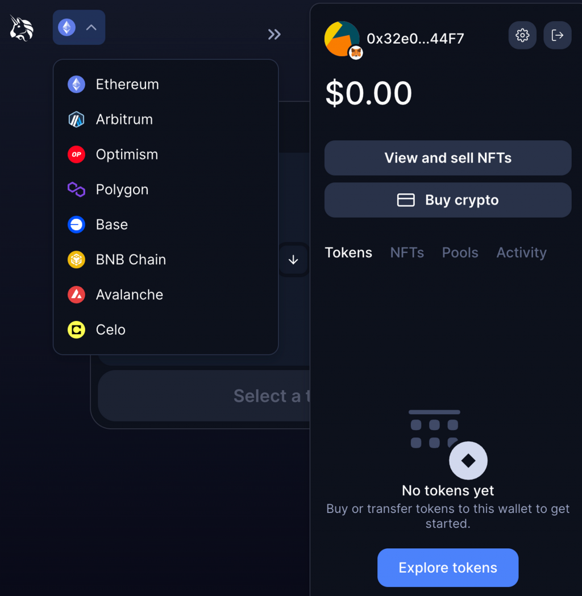

#### 4. 準備工作

首先到 Alchemy 的 [Apps dashboard](https://dashboard.alchemy.com/apps) 建立一個新的 App，這樣才能拿到 API Key 做後續的操作。由於我們會在測試鏈上開發，Chain 跟 Network 就選擇 Ethereum Sepolia，名字隨意填就好

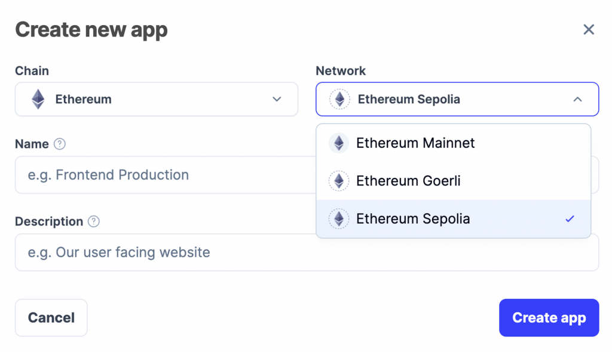

建立後點擊 View Keys 就可以看到這個 App 的 API Key 跟串接的方式，先紀錄 API Key 即可

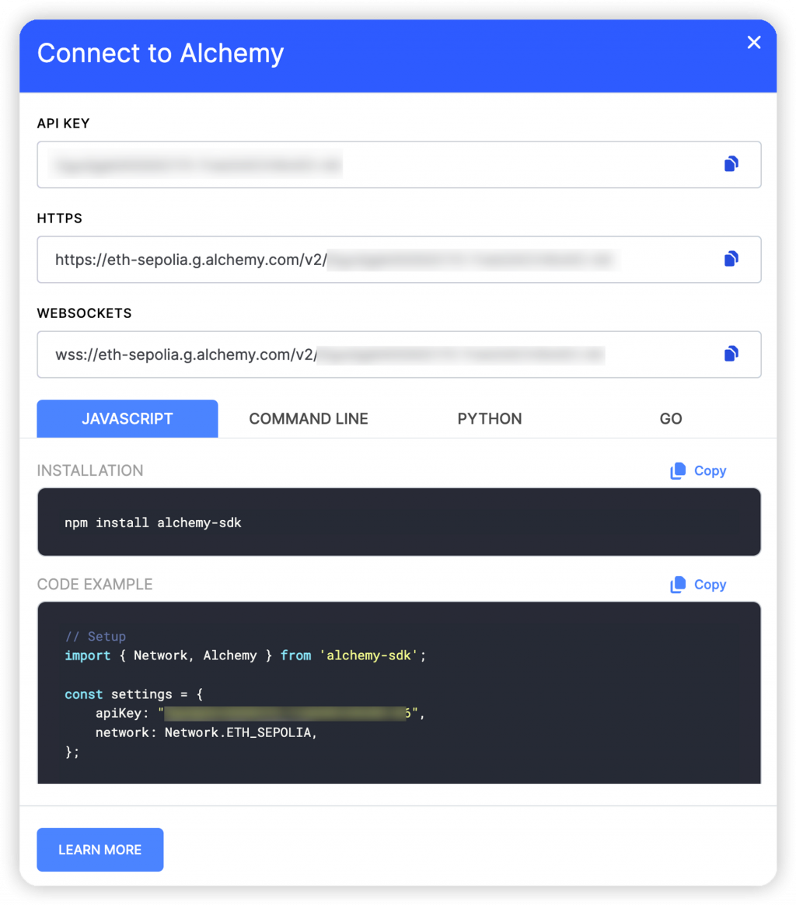

另外也需要創一個新的前端專案，我個人是使用 `pnpm create next-app` 指令建立，讀者也可以選擇自己熟悉的套件管理器或 bundler, css 設定等等。

#### 5. WAGMI

我們會使用 [wagmi](https://wagmi.sh/) 這個套件來實作今天需要的功能。wagmi 提供完整的 hooks 可以用來跟錢包、Ethereum 互動，我們就不用自己用更底層的 [ethers.js](https://github.com/ethers-io/ethers.js) 或 [viem](https://github.com/wagmi-dev/viem) 甚至 JSON-RPC 開始寫。安裝方式也很簡單：

[code]
    pnpm i wagmi viem

[/code]

而因為 wagmi 套件還蠻常改版，有時會造成套件不相容的問題（v1 也是最近才推出），現在我安裝的版本是 viem v1.9.0 以及 wagmi v1.3.10，如果未來看到的介面不同可能是這個原因。

另外有趣的一個小知識是 wagmi 是 We All Gonna Make It 的簡寫，主要是因為 NFT 流行的早期一群早期使用者會很常在 Discord, Twitter 等地方刷 WAGMI 很期待 NFT 項目的前景，就成為了一個 web3 的迷因。

#### 6. 連接與查看錢包餘額

安裝好之後就可以先貼上官方的範例程式碼來使用：

[code]
    "use client";

    import {
      WagmiConfig,
      createConfig,
      useAccount,
      useConnect,
      useDisconnect,
      mainnet,
    } from "wagmi";
    import { createPublicClient, http } from "viem";
    import { InjectedConnector } from "wagmi/connectors/injected";

    const config = createConfig({
      autoConnect: true,
      publicClient: createPublicClient({
        chain: mainnet,
        transport: http(),
      }),
    });

    function Profile() {
      const { address, isConnected } = useAccount();
      const { connect } = useConnect({
        connector: new InjectedConnector(),
      });
      const { disconnect } = useDisconnect();

      if (isConnected)
        return (
          

            
Connected to {address}

            <button onClick={() => disconnect()}>Disconnect</button>
          

        );
      return <button onClick={() => connect()}>Connect Wallet</button>;
    }

    export default function App() {
      return (
        <WagmiConfig config={config}>
          <main className="flex min-h-screen flex-col items-center justify-between p-24">
            <Profile />
          </main>
        </WagmiConfig>
      );
    }

[/code]

使用 `pnpm run dev` 跑起來後就可以看到畫面上出現 Connect Wallet 的字，點擊後就會跳出 Metamask 的連接錢包視窗，同意後畫面上就會顯示錢包地址跟 Disconnect 按鈕了。

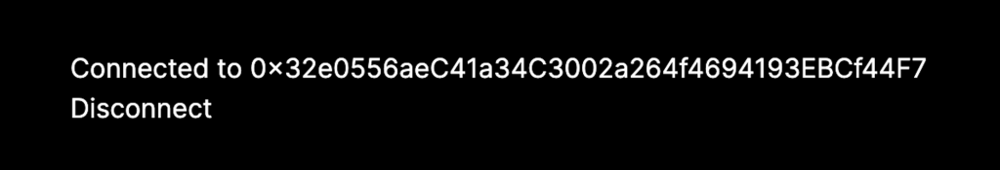

用法很簡單，使用 `createPublicClient` 跟 `createConfig` 來建立 wagmi config 後，用 `<WagmiConfig>` 把整個 App 包起來，就可以使用它提供的各種 hooks 了，包含 `useAccount`, `useConnect` 及 `useDisconnect`，分別對應到拿連接的錢包地址、Connect、Disconnect 的操作。另外可以看到 `createPublicClient` 中傳入的是 mainnet 代表我們指定要連接以太坊的主網，以及 public client 的意思是使用公開、任何人都可以打的 ETH 節點服務網址，而這種公開服務就會有 rate limit，因此後面我們會把 public client 改成使用 Alchemy 的服務

接下來我們加上顯示餘額的功能，只要在 `Profile()` 中使用 `useBalance` 即可：

[code]
    // ...
    const balance = useBalance({ address });

    if (isConnected)
        return (
      // ...
      
Balance: {balance.data?.formatted}

    // ...

[/code]

#### 7. 顯示與切換鏈

完成上述步驟後會看到 Balance 顯示為 0，這是因為我們的地址在以太坊上還沒有 ETH，而是在 Sepolia 鏈上有 ETH，因此接下來我們需要顯示已經連上的鏈跟我們的 DApp 總共支援哪些鏈，並讓使用者可以方便地切換。在這之前順便把 public provider 換成 alchemy provider 來避免後續的 rate limit。把前面宣告 config 的部分改成以下程式碼即可：

[code]
    import { alchemyProvider } from "wagmi/providers/alchemy";
    import { publicProvider } from "wagmi/providers/public";

    const { chains, publicClient, webSocketPublicClient } = configureChains(
      [mainnet, sepolia],
      [
        alchemyProvider({ apiKey: process.env.NEXT_PUBLIC_ALCHEMY_KEY }),
        publicProvider(),
      ]
    );

    const config = createConfig({
      autoConnect: true,
      publicClient: publicClient,
    });

[/code]

並且在 `.env.local` 檔（會被 git ignore 掉）加上剛才在 Alchemy 拿到的 API Key

[code]
    NEXT_PUBLIC_ALCHEMY_KEY=key

[/code]

可以看到前面改成用 `configureChains` 先指定這個 DApp 支援的鏈，以及要用哪些節點服務即可，在 wagmi 套件中是把節點服務稱為 provider。

再來是顯示鏈，從 `configureChains` 拿到的 `chains` 就是我們 DApp 支援的鏈，並使用 `useNetwork` 及 `useSwitchNetwork` 拿到當下連接的鏈跟切換鏈的 function

[code]
    import {
      useSwitchNetwork,
      useNetwork,
    } from "wagmi";

    // ...
    const { chain } = useNetwork();
    const { switchNetwork } = useSwitchNetwork();

    // ...
    {chain && 
Connected to {chain.name}
}
    {chains.map((x) => (
      

        <button
          disabled={!switchNetwork || x.id === chain?.id}
          onClick={() => switchNetwork?.(x.id)}
        >
          {x.name} {x.id === chain?.id && "(current)"}
        </button>
      

    ))}

[/code]

這樣就能顯示所有 DApp 支援的鏈以及點擊觸發切換鏈的功能了！

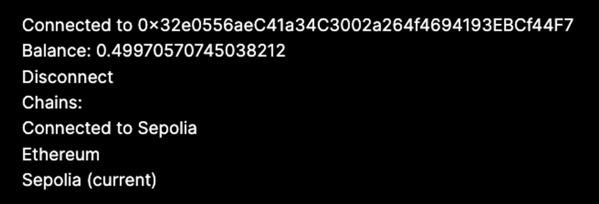

另外如果使用者在跳出錢包切換鏈的請求時拒絕，在 `useSwitchNetwork` 裡也有 `error` 可以用來顯示拒絕的錯誤訊息，以及 `isLoading` 代表是否正在切換網路等等。

#### 8. 小結

今天我們實作了一些基本的 DApp 功能，包含連接錢包、顯示地址與餘額、切換鏈等功能。詳細的程式碼會放在[這裡](https://github.com/a00012025/ironman-2023-web3-fullstack/tree/main/frontend/day4)，在後續的內容如果有程式碼我也會盡量放到同個 repo 中。接下來我們會持續加入新的功能到 DApp 中。

## DAY 5｜Day 5 - Web3 與前端：幫 DApp 加功能

- 原文：https://ithelp.ithome.com.tw/articles/10317865
- 發佈時間：2023-09-14 01:08:14

### 章節內容

#### 1. 未分章內容

昨天我們的 DApp 已經有簡單的讀取功能，因此今天會開始實作較進階的讀取跟簡單的寫入的功能，也就是發送交易。例如錢包餘額現在可以顯示 ETH 的餘額，而在 Day 3 時已經透過測試鏈上的 Uniswap 獲得一些 UNI 幣，因此第一個目標是把這個幣的餘額顯示出來，再來就可以實際送出一個轉出 UNI 幣的交易到區塊鏈上。

#### 2. UNI 幣的原理

UNI 幣本質上背後就是一個智能合約，可以先把智能合約理解成跑在區塊鏈上的程式。只是 UNI Token 的智能合約符合 [ERC20](https://docs.openzeppelin.com/contracts/4.x/erc20) 標準，這個標準是最廣泛被應用來實作代幣的標準（像以太坊上常見的 USDT, USDC, DAI, UNI 都是），[這裡](https://docs.openzeppelin.com/contracts/4.x/api/token/erc20#IERC20)可以看到 ERC20 定義了什麼 function 以及相關細節：

[code]
    totalSupply()
    balanceOf(account)
    transfer(to, amount)
    allowance(owner, spender)
    approve(spender, amount)
    transferFrom(from, to, amount)

[/code]

今天我們不會細講太多關於 ERC20 以及智能合約的細節，不過可以大致猜到幾個 function 的作用： `totalSupply()` 代表這個代幣的總發行量， `balanceOf(account)` 可以拿到一個地址的代幣餘額， `transfer(to, amount)` 可以指定要把我的代幣轉多少給誰。其他 function 今天還不會用到，有興趣的讀者可以先自行研究。

所以只要 UNI 的智能合約實作了這些 function，他就可以被稱為符合 ERC20 標準的智能合約，並且就支援一個代幣所需要的基本功能。讀到這邊大家可能也理解到了在以太坊上只有 ETH 是以太坊的「原生」代幣，其他代幣都是用智能合約實作出來的，透過把各個地址的代幣餘額紀錄在智能合約上，來模擬一個代幣的帳本。有些人會用 Coin 跟 Token 來區分這兩個概念，Coin 指的是這個區塊鏈原生的幣，Token 則指的是在這個鏈上透過智能合約模擬出來的幣，例如可以說 Polygon 這條鏈的 Coin （原生代幣）是 MATIC，而在 Polygon 鏈的 [ETH 幣](https://polygonscan.com/token/0x7ceb23fd6bc0add59e62ac25578270cff1b9f619)是 Token。

#### 3. 取得 Token Balance

要取得當下地址的 UNI Token Balance，我們需要用到 wagmi 的 `useContractRead` hook，可以用來讀取任意智能合約中 view function 的結果。所以首先需要用它來呼叫 `balanceOf(account)` 並帶入當下連接的錢包地址：

[code]
    import { useContractRead } from "wagmi";

    const UNI_CONTRACT_ADDRESS = "0x1f9840a85d5aF5bf1D1762F925BDADdC4201F984";
    const NULL_ADDRESS = "0x0000000000000000000000000000000000000000";

    // inside Profile()
    const { data: balanceData } = useContractRead({
      address: UNI_CONTRACT_ADDRESS,
      abi: abi,
      functionName: "balanceOf",
      args: [address || NULL_ADDRESS],
    });

[/code]

其中 `UNI_CONTRACT_ADDRESS` 指的是 UNI 這個代幣背後的智能合約，找到他的方式是在上次執行的 [Swap 交易](https://sepolia.etherscan.io/tx/0xe9e3ba1bd7a867782f5507ba492ceaef338b426575982f18a7fcd3d396e4482a)中可以看到我收到的 UNI Token 數量，點進去就有他的[合約地址](https://sepolia.etherscan.io/address/0x1f9840a85d5af5bf1d1762f925bdaddc4201f984)了

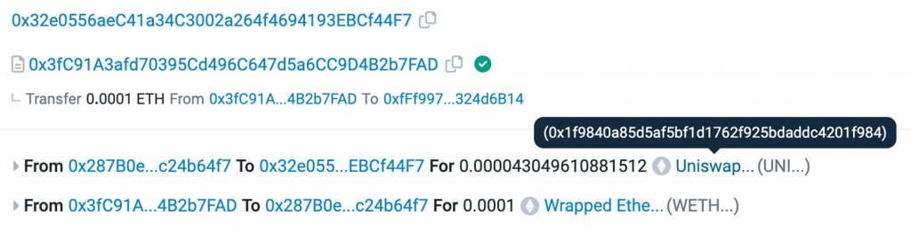

可以看到我們透過 `useContractRead` 呼叫這個合約的 `balanceOf` function 並帶入 `address` 參數（如果尚未連接錢包就先給他一個 0x0 的地址字串），就可以拿到 balance 資料。其中還有一個參數是 `abi`，這裡就要介紹到 [ABI (Application Binary Interface)](https://www.alchemy.com/overviews/what-is-an-abi-of-a-smart-contract-examples-and-usage) 的概念。簡單來說他就是任何人要跟智能合約互動時的介面定義，就像 RESTful API 介面一樣，把這個介面的輸入跟輸出格式定義清楚，包含 function name、參數及型別、回傳值等等。為了跟 UNI Token Contract 互動並呼叫他的 function，需要先定義跟他互動的介面，長得像這樣：

[code]
    const abi = [
    	{
    	  inputs: [
    	    {
    	      internalType: "address",
    	      name: "account",
    	      type: "address",
    	    },
    	  ],
    	  name: "balanceOf",
    	  outputs: [
    	    {
    	      internalType: "uint256",
    	      name: "",
    	      type: "uint256",
    	    },
    	  ],
    	  stateMutability: "view",
    	  type: "function",
    	},
    ] as const;

[/code]

直接閱讀就能猜到大部分的意思，像是他定義清楚了 `balanceOf` 這個 function 的 input output 以及他是一個 view function（不會改變智能合約的狀態）。後面加上 `as const` 是因為這樣才能讓 Typescript 幫我們做 Type inference，從傳入 `useContractRead` 的 `functionName` , `abi`自動推斷出 `args` 跟 return value 的型別。最後就可以把拿到的 `balanceData` 顯示出來

[code]
    {balanceData !== undefined && 
UNI Balance: {balanceData.toString()}
}

[/code]

結果如下：

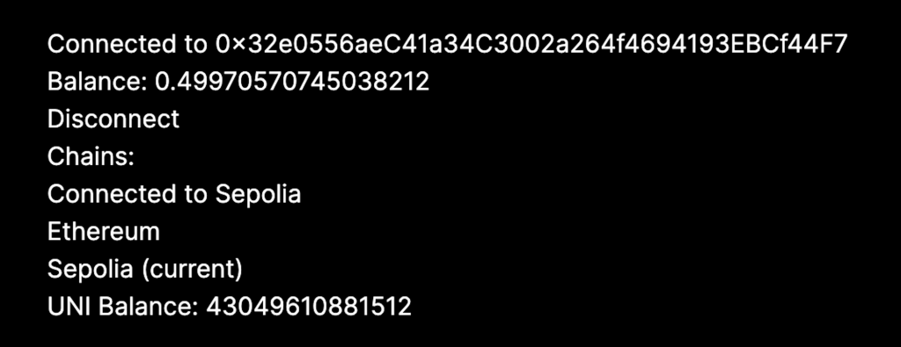

#### 4. Token Decimals

上述的程式碼跑出來會看到 UNI Token Balance 是一個很大的數字，但其實我只有 0.000043 個 UNI 而已。這背後其實是因為智能合約上儲存的都是 Token Balance 乘上 10 的幾次方的結果，這就是為什麼 ABI 裡 `balanceOf` 定義的 output 類別才是 `uint256`而不是浮點數。這也跟以太坊當時設計 EVM 的考量有關，因為浮點數的計算常有精度誤差，這對極嚴格要求在所有電腦上都要有一致性的區塊鏈來說，原生支援浮點數計算會有比較高的風險。

至於要乘上 10 的幾次方，ERC20 合約也有一個 `decimals()` function 可以用來查詢這個數值，方便大家把智能合約上讀出來的數字轉換成讓人類可以理解的數字，因此我們補上對應的 ABI 跟 contract read，就能算出最終要顯示的結果：

[code]
    import { formatUnits } from "viem";

    // abi definition
    {
      inputs: [],
      name: "decimals",
      outputs: [
        {
          internalType: "uint8",
          name: "",
          type: "uint8",
        },
      ],
      stateMutability: "view",
      type: "function",
    }

    // inside Profile()
    const { data: decimals } = useContractRead({
      address: UNI_CONTRACT_ADDRESS,
      abi: abi,
      functionName: "decimals",
    });
    const uniBalance =
      balanceData && decimals ? formatUnits(balanceData, decimals) : undefined;

    // inside return
    {uniBalance && 
UNI Balance: {uniBalance}
}

[/code]

很多代幣的 decimals 會是 18，因為以太坊原生的 ETH 最小單位也是 10^-18 ETH，也被稱為 wei。不過也有蠻多 decimals 是 6 的 token，所以每次都從鏈上查詢是最精準的。這樣就能顯示正確的餘額了！

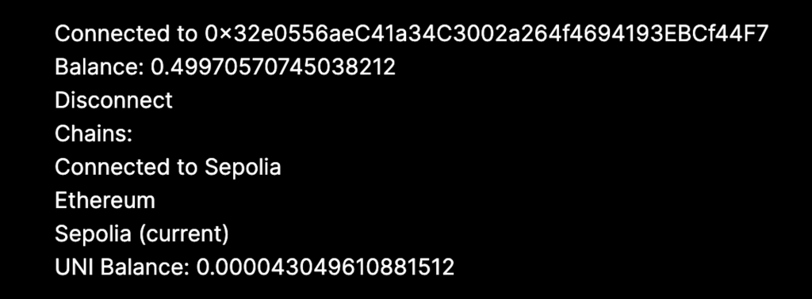

#### 5. 送出交易

再來是送出 Transfer UNI Token 的交易，會用到 `useContractWrite` hook 搭配智能合約上的 `transfer(to, amount)` function 達成。一樣先補上需要的 import 跟 ABI：

[code]
    import { useContractWrite } from "wagmi";

    // abi
    {
    	inputs: [
    	  {
    	    internalType: "address",
    	    name: "recipient",
    	    type: "address",
    	  },
    	  {
    	    internalType: "uint256",
    	    name: "amount",
    	    type: "uint256",
    	  },
    	],
    	name: "transfer",
    	outputs: [
    	  {
    	    internalType: "bool",
    	    name: "success",
    	    type: "bool",
    	  },
    	],
    	stateMutability: "nonpayable",
    	type: "function",
    },

[/code]

並從 `useContractWrite` 拿到需要的 write function 跟資料呈現在畫面上，其中第一個參數是要轉去的地址，可以在 Metamask 中再新增一個錢包地址來使用，第二個參數則是要轉出的數量（也就是在智能合約上紀錄的值，型別是 [bigint primitive](https://developer.mozilla.org/en-US/docs/Web/JavaScript/Reference/Global_Objects/BigInt)）

[code]
    // inside Profile()
    const {
      data: txData,
      isLoading,
      isSuccess,
      write: sendUniTx,
    } = useContractWrite({
      address: UNI_CONTRACT_ADDRESS,
      abi,
      functionName: "transfer",
      args: ["0xE2Dc3214f7096a94077E71A3E218243E289F1067", 100000n],
    });

    // inside return
    {uniBalance && (
      <>
        
UNI Balance: {uniBalance}

        <button onClick={() => sendUniTx()}>Send UNI</button>
        {isLoading && 
Check Your Wallet...
}
        {isSuccess && 
Transaction Hash: {txData?.hash}
}
      </>
    )}

[/code]

實際跑起來點擊 Send UNI 後，就會跳出 Metamask 的視窗，確認後交易就成功送出了！畫面上會顯示對應的 Transaction Hash

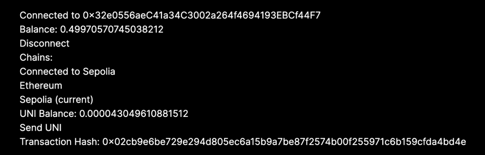

再來就可以到 Sepolia Etherscan 上查看交易結果，在這個網址後面貼上 Tx Hash 即可：`https://sepolia.etherscan.io/tx/`

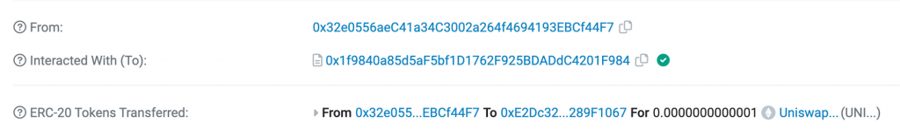

交易成功上鏈後，重新整理畫面也可以看到顯示的 UNI Token Balance 已經有減少了。

#### 6. 補充說明

這裡補充一些前面沒有提到的細節。首先是如何知道合約的 ABI 是什麼？這個其實可以到 Etherscan 的智能合約頁面，點 Contract tab 後往下拉就可以看到合約的完整 ABI。UNI 智能合約的網址在[這裡](https://sepolia.etherscan.io/address/0x1f9840a85d5af5bf1d1762f925bdaddc4201f984#code)

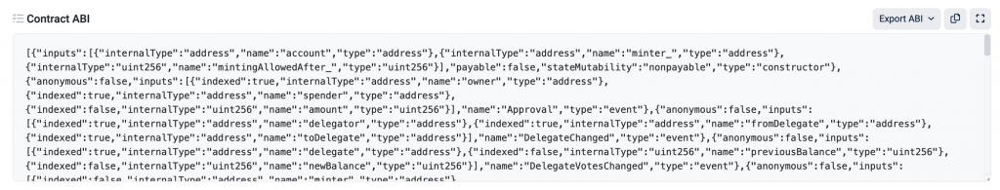

整份複製下來也可以，他就會包含所有這個合約定義的 function，只是今天的內容為了簡單就沒有把整份 ABI 複製出來。

再來如果有讀者實際把程式跑起來，可能會注意到按下 Send UNI 到跳出錢包中間會有一兩秒的延遲，而這是因為 wagmi 需要計算當下送出交易要用多少 gas fee、設定的 nonce 要是多少等等（未來會更深入講解）。為了提升使用體驗 wagmi 建議使用 [usePrepareContractWrite](https://wagmi.sh/react/prepare-hooks/usePrepareContractWrite) hook 來預先抓好這些資料。詳細可以參考 [wagmi prepare hooks](https://wagmi.sh/react/prepare-hooks) 介紹跟這個 hook 的用法。

最後一個是如果在送出交易時馬上到 Sepolia Etherscan 上查看這筆 Tx Hash 的資料，可能會發現大概過了 10 秒到 30 秒左右這筆才會成功上鏈，因為從送出交易到上鏈中間需要經過礦工的驗證、按照手續費排序、打包進區塊等等，才能真正在區塊鏈上確認。為了呈現這個狀態 wagmi 也提供 [useWaitForTransaction](https://wagmi.sh/react/hooks/useWaitForTransaction) hook 來查詢一個 Tx Hash 的最新狀態，包含是否已確認、交易成功還是失敗等等。這樣才能知道何時要重拉 UNI Token Balance 資料，以在畫面上呈現最即時的餘額。

#### 7. 小結

今天我們學到了更多關於智能合約的知識，以及和智能合約互動的方式，包含讀跟寫的操作，完整程式碼放在[這裡](https://github.com/a00012025/ironman-2023-web3-fullstack/tree/main/frontend/day5)。明天我們會介紹一個好用的 library 來大幅提升連接錢包的體驗，也就是 RainbowKit。

## DAY 6｜Day 6 - Web3 與前端：RainbowKit + Wallet Connect

- 原文：https://ithelp.ithome.com.tw/articles/10318382
- 發佈時間：2023-09-15 02:21:38

### 章節內容

#### 1. 未分章內容

前兩天我們把 DApp 的一些基礎功能開發出來了，但還沒有在 UI/UX 上著墨太多。今天要介紹的 Rainbow Kit 就是可以用來快速開發一個好看的連接錢包功能的 library，包含多種錢包連接選項、更改主題顏色等等，從這裡也會延伸介紹他支援的 Wallet Connect 協議，並實際串上 Wallet Connect 協議來發送交易。

#### 2. Rainbow Kit

[Rainbow Kit](https://www.rainbowkit.com/) 是由 Rainbow 錢包開發的 Web SDK，許多 DApp 都有使用，主要是因為他的 UI/UX 做得很好，整合上也很容易。要看呈現效果的話可以在他的官網右上角點擊 Connect Wallet 看到連接錢包的列表

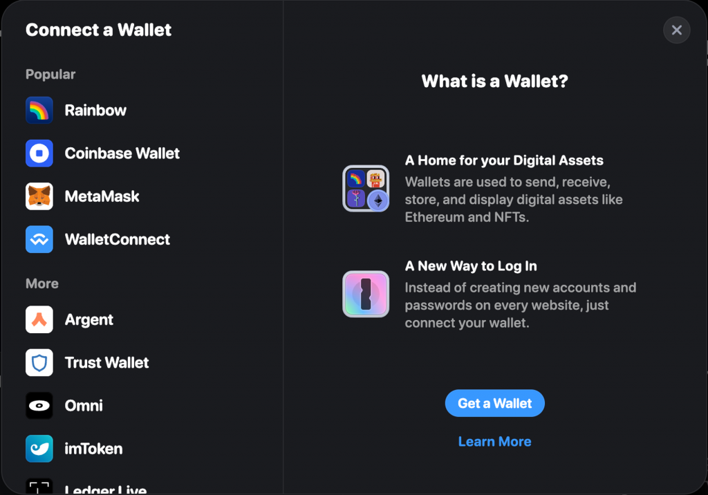

點擊 Metamask 並在 Metamask 的彈窗中確認後就成功連接上了，右上角的 Connect Wallet 按鈕會變成顯示選擇的鏈、地址跟 ETH 餘額

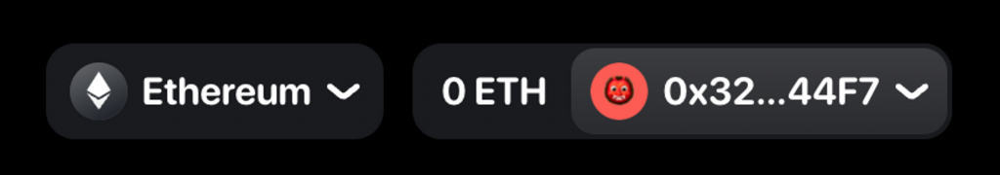

這裡面有許多可以更改的選項，接下來就直接按照官方的[安裝步驟](https://www.rainbowkit.com/docs/installation)用 rainbowkit 建立一個新的 [wagmi](https://wagmi.sh/) \+ [Next.js](https://nextjs.org/) app：

[code]
    pnpm create @rainbow-me/rainbowkit@latest

[/code]

照著 cli 指示就能建立好一個新的專案了。進到剛創立的資料夾執行 `pnpm dev` 就可以把它跑起來：

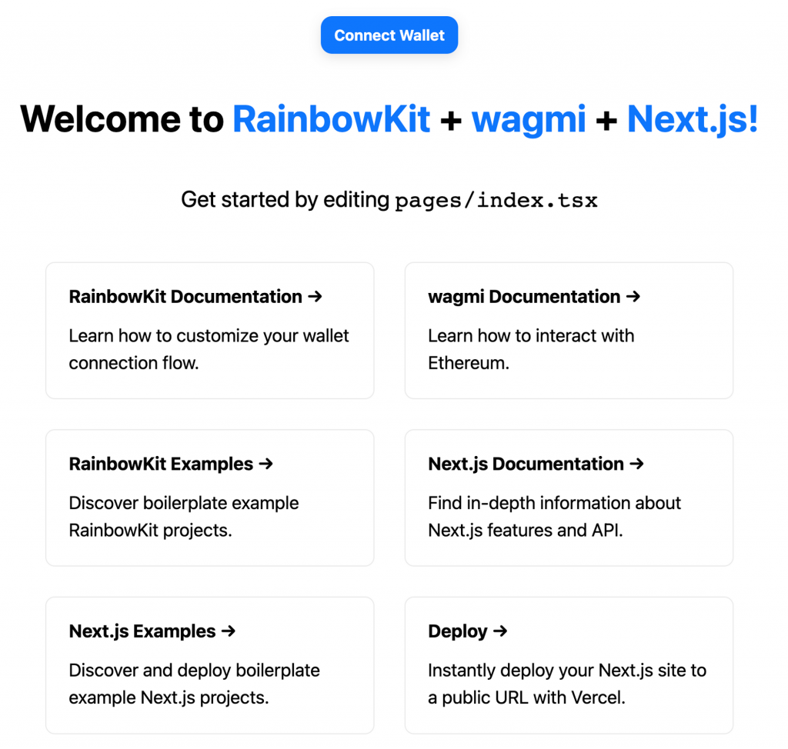

在 `_app.tsx` 裡可以看到詳細的用法，前面的 `configureChains` 之前有介紹過，再來用 `getDefaultWallets` 拿到預設的錢包列表（包含 Rainbow, Coinbase Wallet, Metamask 等等），用它建立 wagmi config，並把整個 App 包在 `RainbowKitProvider` 底下，就可以在任何地方使用 Rainbow Kit 提供的 Components。

[code]
    const { chains, publicClient, webSocketPublicClient } = configureChains(
      [
        mainnet,
        polygon,
        optimism,
        arbitrum,
        base,
        zora,
        ...(process.env.NEXT_PUBLIC_ENABLE_TESTNETS === 'true' ? [goerli] : []),
      ],
      [publicProvider()]
    );

    const { connectors } = getDefaultWallets({
      appName: 'RainbowKit App',
      projectId: 'YOUR_PROJECT_ID',
      chains,
    });

    const wagmiConfig = createConfig({
      autoConnect: true,
      connectors,
      publicClient,
      webSocketPublicClient,
    });

    function MyApp({ Component, pageProps }: AppProps) {
      return (
        <WagmiConfig config={wagmiConfig}>
          <RainbowKitProvider chains={chains}>
            <Component {...pageProps} />
          </RainbowKitProvider>
        </WagmiConfig>
      );
    }

[/code]

這樣在 `index.tsx` 中使用 Rainbow Kit 的 `ConnectButton` 元件就可以了。

#### 3. Rainbow Kit 客製選項

Rainbow Kit 也支援許多靈活的客製化，像 [ConnectButton](https://www.rainbowkit.com/docs/connect-button) 可以指定是否要顯示 ETH 餘額、鏈的名稱、地址等等，例如以下寫法可以呈現比較簡易的錢包樣式

[code]
    <ConnectButton
      chainStatus={"icon"}
      accountStatus={"avatar"}
      showBalance={false}
    />

[/code]

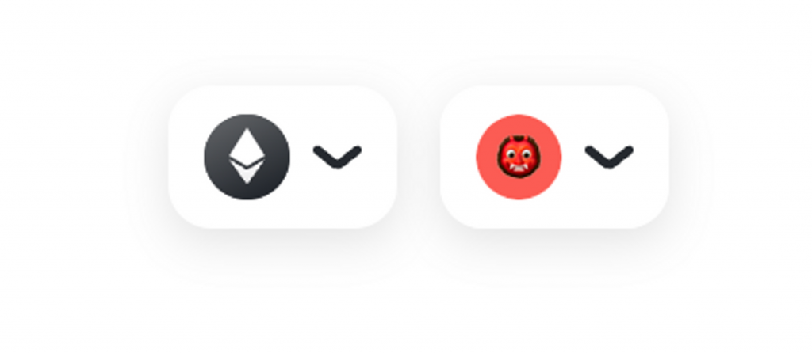

也可以指定不同的螢幕大小下用不同的選項

[code]
    <ConnectButton
      chainStatus={{
        largeScreen: "full",
        smallScreen: "icon",
      }}
      accountStatus={{
        largeScreen: "full",
        smallScreen: "avatar",
    	}}
      showBalance={false}
    />

[/code]

也有自訂 theme 的選項，包含 light & dark theme、主題色、border radius 等等

[code]
    import { darkTheme } from "@rainbow-me/rainbowkit";

    // ...
    <RainbowKitProvider
      chains={chains}
      theme={darkTheme({
        accentColor: "#7b3fe4",
        accentColorForeground: "white",
        borderRadius: "large",
        fontStack: "system",
        overlayBlur: "small",
      })}
    >

[/code]

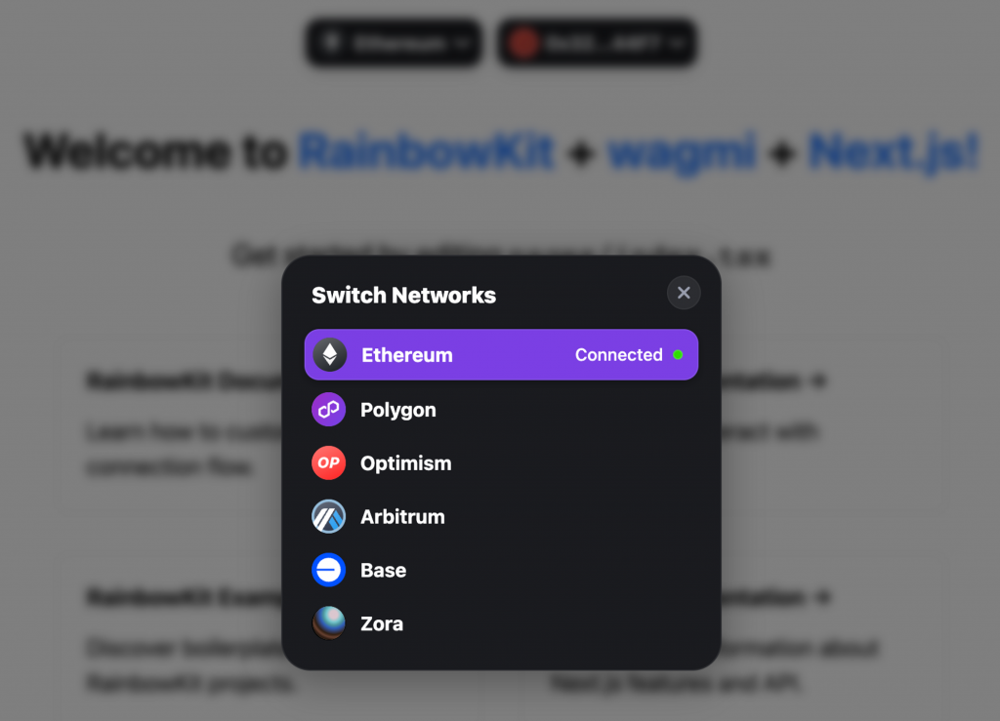

另外在按下 Connect Wallet 後的錢包列表也可以客製化，只要把預設使用 `getDefaultWallets` 拿到的 `connectors` 換成用 `connectorsForWallets` 並指定要呈現哪些 wallets 即可

[code]
    import {
      connectorsForWallets,
    } from "@rainbow-me/rainbowkit";
    import {
      injectedWallet,
      rainbowWallet,
      walletConnectWallet,
      trustWallet,
    } from "@rainbow-me/rainbowkit/wallets";

    // ...
    const projectId = "YOUR_PROJECT_ID";
    const connectors = connectorsForWallets([
      {
        groupName: "Recommended",
        wallets: [
          injectedWallet({ chains }),
          rainbowWallet({ projectId, chains }),
          walletConnectWallet({ projectId, chains }),
          trustWallet({ projectId, chains }),
        ],
      },
    ]);

[/code]

這樣就可以呈現以下效果：

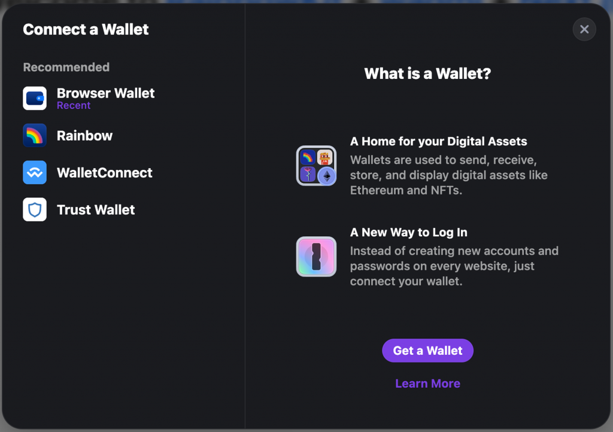

其中的 `projectId` 設定稍後會講到，至於 `injectedWallet` 指的是如果使用者有在瀏覽器安裝像 Metamask 的這種錢包 Extension，錢包就會對瀏覽器 inject 一個 `window.ethereum` object，因此使用 `injectedWallet` 就可以自動連上這種透過瀏覽器 Extension 安裝的錢包。Rainbow Kit 提供許多錢包選項（[官方文件](https://www.rainbowkit.com/docs/custom-wallet-list)），有興趣的話可以任選幾個放進錢包列表中看看效果。

另一個 Rainbow Kit 做得很方便的點是在手機上的體驗，因為在手機上的錢包 App 跟我們瀏覽 DApp 時可能會不一樣，例如大家可能用 Chrome 或 Safari 瀏覽 DApp，但需要連接到 Metamask 的錢包 App，所以當按下 Metamask 時就會透過 Deep Link 的方式跳轉到 Metamask 中詢問是否要連接。可以用手機體驗看看 [RainbowKit 官網](rainbowkit.com)的連接錢包功能（前提是要先安裝 Metamask App，讀者可以把電腦上的 Metamask 註記詞匯入到 Metamask 手機 app 上，這樣就能讓兩邊的錢包地址一致）。

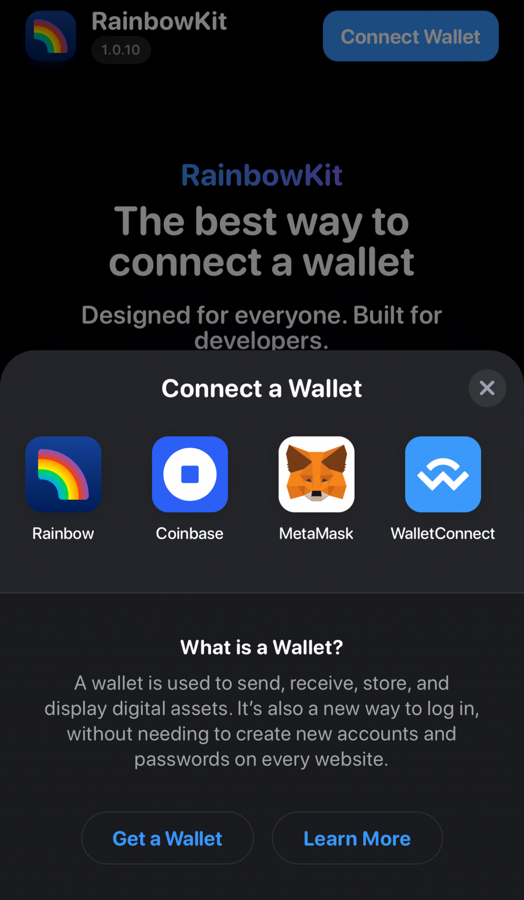

#### 4. Wallet Connect 協議

在預設的錢包列表中有個選項是 Wallet Connect，點擊後會看到一個 QR Code，這個是方便使用者在不同裝置上使用錢包跟 DApp 的協議，例如蠻多人常用手機錢包來連接電腦上開的 DApp。有安裝 Metamask App 的話可以透過右上角的掃瞄功能來掃這個 QR Code，就會跳出連接錢包的選項。

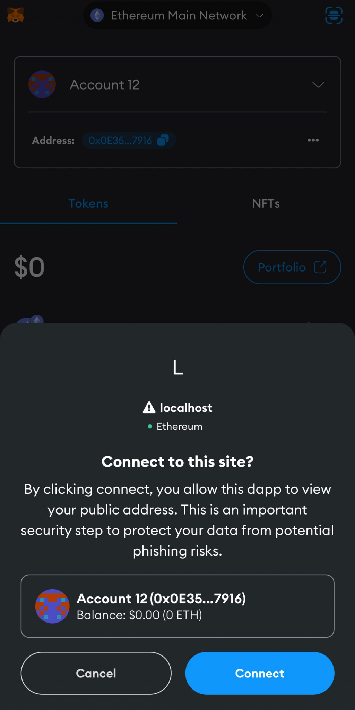

這樣後續只要 DApp 發出任何交易簽名的請求，錢包 App 就會跳出來讓使用者確認，並處理確認或拒絕相對應的行為，這個在一般錢包 App 中已經算是標配的功能。Wallet Connect 也有提供對應的 SDK 讓 DApp 方便整合這個功能（[Github 連結](https://github.com/walletconnect/walletconnect-monorepo)），一樣是有考慮到 Desktop 跟 Mobile 裝置上的不同。預設的樣式長得像這樣，也算是蠻常在其他 DApp 連接錢包時看到的畫面

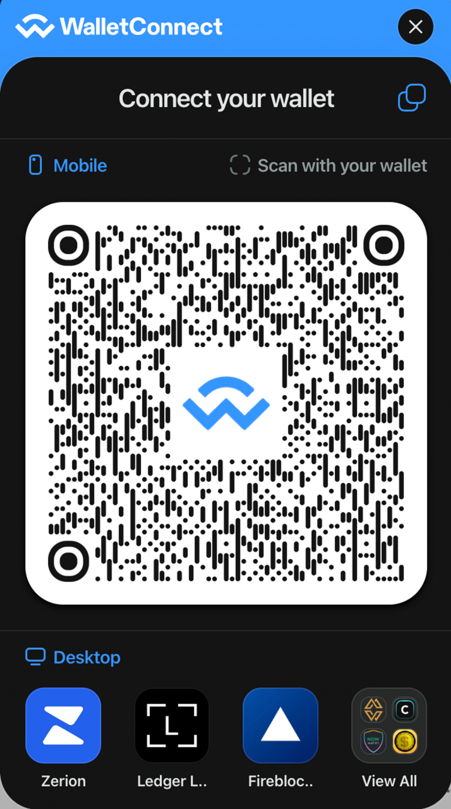

不過目前 DApp 如果要支援 Wallet Connect （目前最新版是 v2），就要先到 [Wallet Connect Cloud](https://cloud.walletconnect.com) 註冊一個自己的 DApp 才能正常使用。照著指示註冊後建立一個新的 Project，就會在裡面看到你的 Project ID，這個 ID 就是前面 `projectId` 所需要的值了。

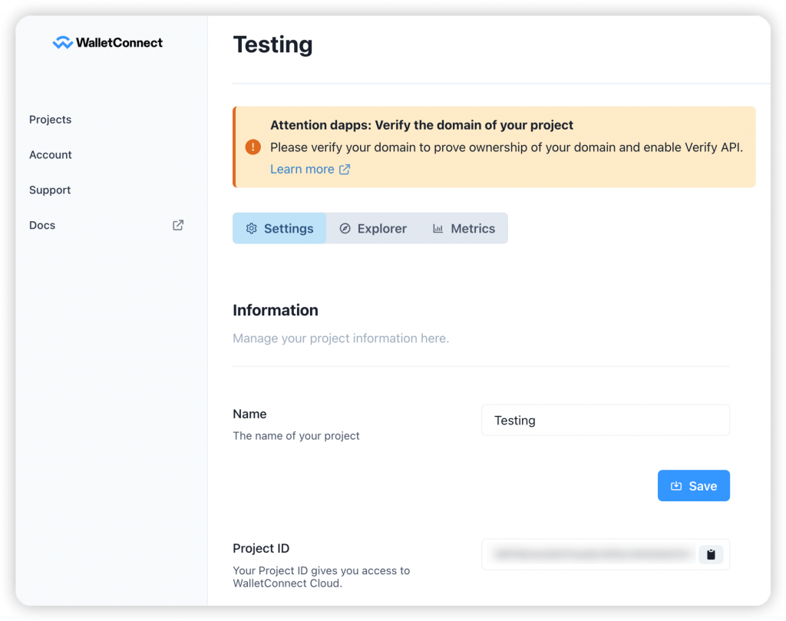

#### 5. Rainbow Kit + Wallet Connect

有了 Rainbow Kit 以及 Wallet Connect，就可以把前一天的 DApp 改寫成使用 Rainbow Kit 的方式，這樣像連接錢包、顯示餘額、顯示及切換鏈等等功能就都不用自己做了，因為 `ConnectButton` 已經內建這些功能，只需要留下顯示 UNI Token Balance 的部分即可。以下是 `profile.tsx` 改寫後的內容（為求簡短只留 return 的部分）

[code]
    return (
      

        <ConnectButton />
        {uniBalance && (
          <>
            
UNI Balance: {uniBalance}

            <button onClick={() => sendUniTx()}>Send UNI</button>
            {isLoading && 
Check Your Wallet...
}
            {isSuccess && 
Transaction Hash: {txData?.hash}
}
          </>
        )}
      

    );

[/code]

以及在 `_app.tsx` 呼叫 `configureChains` 時多給他 `sepolia` 這條鏈

[code]
    const { chains, publicClient, webSocketPublicClient } = configureChains(
      [
        mainnet,
        sepolia,
        polygon,
        optimism,
        arbitrum,
        base,
        zora,
        ...(process.env.NEXT_PUBLIC_ENABLE_TESTNETS === "true" ? [goerli] : []),
      ],
      [
        alchemyProvider({ apiKey: process.env.NEXT_PUBLIC_ALCHEMY_KEY! }),
        publicProvider(),
      ]
    );

[/code]

這樣就可以用 Metamask App 搭配 Wallet Connect 來連接這個 DApp 了。首先把 Metamask App 中的鏈切換成 Sepolia（一樣要開啟 Show test networks 的選項）

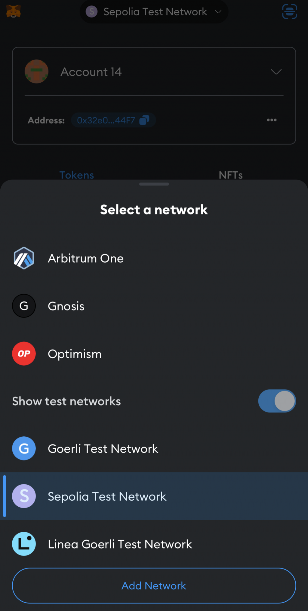

再到 `[localhost:3000/profile](http://localhost:3000/profile)` 頁面按下 Connect Wallet，用跟前面一樣的步驟讓 Metamask 透過 Wallet Connect 連上，就可以看到 UNI Token Balance 了

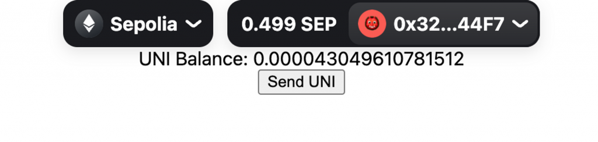

再按下 Send UNI 後，Metamask App 裡就會跳出交易的請求，按下確認就能成功送出交易了！

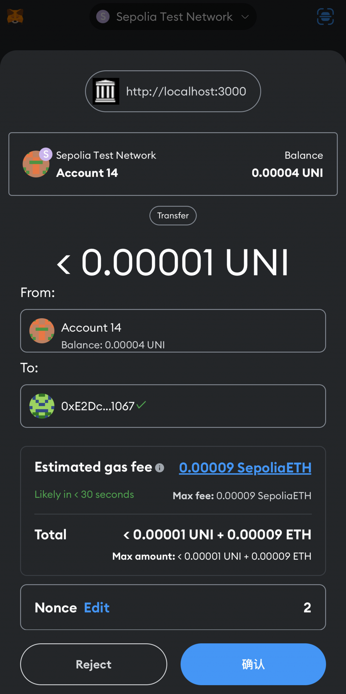

#### 6. 小結

今天我們使用 Rainbow Kit 來方便的實現連接錢包的功能，也了解 Wallet Connect 的運作方式並實際把前一天實作的 DApp 用 Rainbow Kit 改寫，支援多個錢包以及 Wallet Connect 協議，並在最後成功送出了交易，完整的程式碼在[這裡](https://github.com/a00012025/ironman-2023-web3-fullstack/tree/main/frontend/day6)。明天會開始實作一個 DApp 常見的功能，它跟前後端都會有關係，也就是「錢包登入」。敬請期待！

## DAY 7｜Day 7 - Web3 與前端：實作錢包登入 Part 1

- 原文：https://ithelp.ithome.com.tw/articles/10319096
- 發佈時間：2023-09-16 01:40:01

### 章節內容

#### 1. 未分章內容

今天我們會進入到錢包登入的實作。很多 DApp 如 [Blur](https://blur.io/)（NFT marketplace）、[Lenster](https://lenster.xyz/)（Web3 社群平台）都是使用錢包地址作為唯一識別使用者的 ID，這樣的好處是在 Web 3 的世界就不需依賴任何 Web 2 世界的登入方式（Google, Facebook 等等），是個純去中心化的登入方式，而且只有知道私鑰的人才能掌握這個錢包並登入。而這個登入機制由於涉及簽名的概念跟前後端的實作，今天會先帶大家了解以太坊簽名的幾種類型與機制，再講到前端需要提供怎樣的資料給後端，最後介紹 Sign in with Ethereum 這個登入的標準。

#### 2. 錢包簽名

在開始講登入機制前，首先要了解簽名的作用以及種類。回顧一下 Day 2 我們提到簽章的概念：

> 而我要怎麼從一個帳戶（地址）轉帳出去，就必須證明我擁有這個地址的使用權，這就是透過這個地址背後對應的一把「私鑰」，透過私鑰與一系列密碼學的計算產生「簽章」後廣播給全世界的人，別人就可以透過這個「簽章」來驗證這筆交易是否真的是由擁有私鑰的人簽名出來的。如果驗證通過，這筆轉帳的交易才會成立並被包含到區塊鏈的帳本中

所以簽名（Sign）就是產生簽章（Signature）的過程，本質上簽名機制在密碼學中要做到的事情就是要證明我的身份。在以太坊的世界裡，除了發送交易時要簽名給區塊鏈節點驗證之外，也有一些場景是不需要發送交易的，只是透過簽名一個訊息讓別人（服務）相信我擁有這個地址的私鑰。這裡我不會細講簽名背後的數學原理，有興趣的話可以查 ECDSA （橢圓曲線密碼學）的機制。

接下來要介紹兩種簽名訊息的方式：Sign Personal Message 以及 Sign Typed Data。這兩種方法都是可以從 DApp 發起請求給錢包來要求簽名的方式。發請求的通訊方式也是透過 JSON RPC 傳送，他們分別對應到 `personal_sign` 跟 `eth_signTypedData_v4` 這兩個 JSON RPC Method。

#### 3. Sign Personal Message

首先介紹 Sign Personal Message (`personal_sign`)，如果讀者嘗試進到 [Blur](https://blur.io) 並連結錢包登入，就會跳出這樣的畫面：

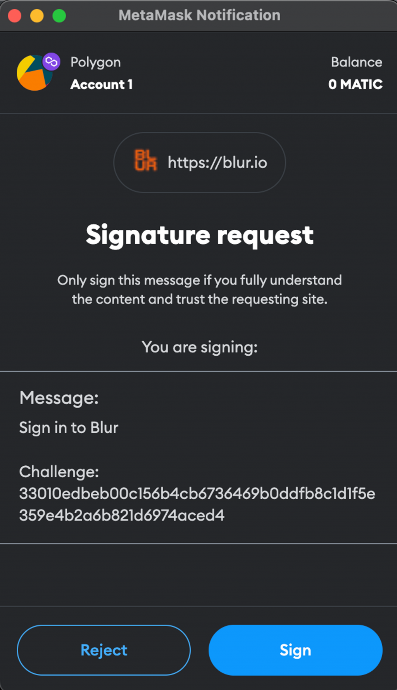

這代表 Blur 這個 DApp 要求 Metamask 簽名了一個訊息，內容就是 `Message:` 以下的所有文字。而這就是 Sign Personal Message 要做的事情：簽名任何一個字串。這個字串的內容可以由 DApp 自己決定，只要 DApp 在收到使用者的錢包簽名後，能夠驗證這個簽名是否真的是這個地址的私鑰簽名出來的東西即可。當 DApp 使用這個方法要求簽名時，通常都會給出可讀的訊息，讓我們看得懂正在簽的東西，常見的就是呈現我正在登入什麼服務的資訊，並加上一個隨機的字串（以 blur 的例子就是 challenge 後的那一串東西），來避免別人拿到我過去對某個訊息的簽名就能以我的身份登入這個服務。

Metamask 有個 [demo DApp](https://metamask.github.io/test-dapp) 可以讓我們實際操作 Sign Personal Message 以及還原。進到以上的 DApp 中連接錢包並點擊 Personal Sign 底下的 Sign 按鈕，就可以看到自己錢包簽名出來的訊息。簽出來的東西會是一個總共 65 bytes 的 hex 字串，像我的是：

[code]
    0x88d498fb089272381fdb088b1c4c43ce47d787abd91f0745d47edc0c90dcfa396714c3aa1becf6bf308a47dcfc7046d2daba2373c1c8bfbb9f69550b496921811b

[/code]

他是我對以下訊息的簽章

[code]
    Example `personal_sign` message

[/code]

接下來按下 Verify 按鈕他就會再基於這個簽章計算出原本簽名的錢包地址，可以看到算出來的地址跟我的地址是吻合的，背後用的是 [@metamask/eth-sig-util](https://www.npmjs.com/package/@metamask/eth-sig-util) 這個套件裡的 [recoverPersonalSignature](https://metamask.github.io/eth-sig-util/latest/functions/recoverPersonalSignature.html) 方法。特別要注意的是這個 recover 的過程必須擁有簽章跟當初簽名的訊息，才能還原出這個簽章是誰簽的。

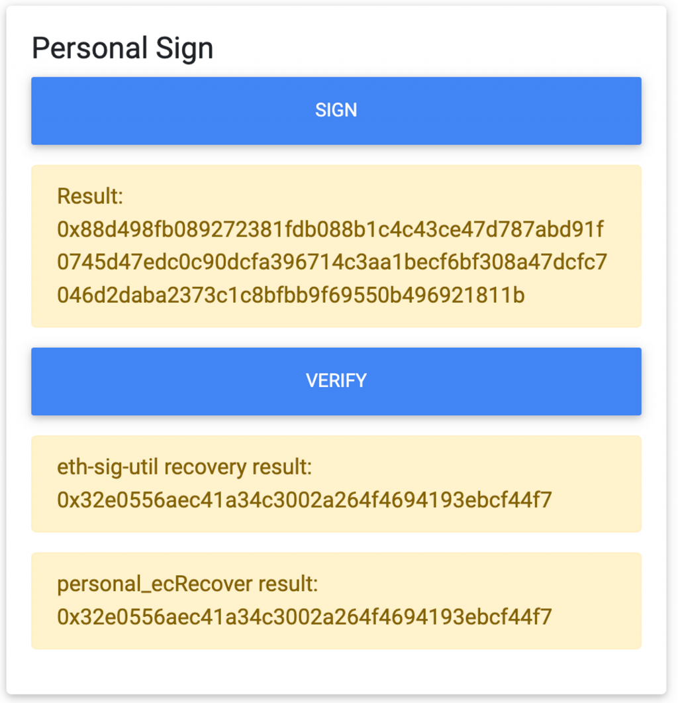

#### 4. Sign Typed Data

再來要介紹 Sign Typed Data (`eth_signTypedData_v4`)，顧名思義就是對某個型別的資料做簽名。想像一下如果我有以下的資料類型：

[code]
    type Address = string;

    interface Person {
        name: string;
        wallets: Address[];
    }

    interface Group {
        name: string;
        members: Person[];
    }

    interface Mail {
        from: Person;
        to: Person[];
        contents: string;
    }

[/code]

並且我想要對以下這個 `Mail` 資料簽名

[code]
    {
      contents: 'Hello, Bob!',
      from: {
        name: 'Cow',
        wallets: [
          '0xCD2a3d9F938E13CD947Ec05AbC7FE734Df8DD826',
          '0xDeaDbeefdEAdbeefdEadbEEFdeadbeEFdEaDbeeF',
        ],
      },
      to: [
        {
          name: 'Bob',
          wallets: [
            '0xbBbBBBBbbBBBbbbBbbBbbbbBBbBbbbbBbBbbBBbB',
            '0xB0BdaBea57B0BDABeA57b0bdABEA57b0BDabEa57',
            '0xB0B0b0b0b0b0B000000000000000000000000000',
          ],
        },
      ],
    }

[/code]

這樣要怎麼做呢？一個直觀的想法是直接把這個資料做 JSON stringify，然後使用 Sign Personal Message 簽下去就好了。但這樣做法的缺點是如果這個簽章要在鏈上的智能合約中被驗證，就會花費太多 gas fee，因為要解析和驗證 JSON 字串需要複雜的計算和操作。使用 Sign Typed Data 方法的話則是會先把這個 Typed Data 透過一個既定的算法產生 hash，再去簽名這個 hash，這樣在鏈上就可以用更有效率的方式驗證他。這背後用的是 [EIP-712](https://eips.ethereum.org/EIPS/eip-712) 這個標準來定義一個 typed data 的 hash 應該要如何計算。

至於什麼場景會需要在鏈上驗證 Sign Typed Data 的結果？一個例子是像 Opensea 這樣的 NFT Marketplace，為了做到賣家可以方便掛單、買家可以方便購買 NFT，會讓賣家在掛單時簽名長得像這樣的掛單資料（三張圖是同一個簽章，參考[官方文件](https://support.opensea.io/hc/en-us/articles/4449355421075-What-does-a-typed-signature-request-look-like-)）：

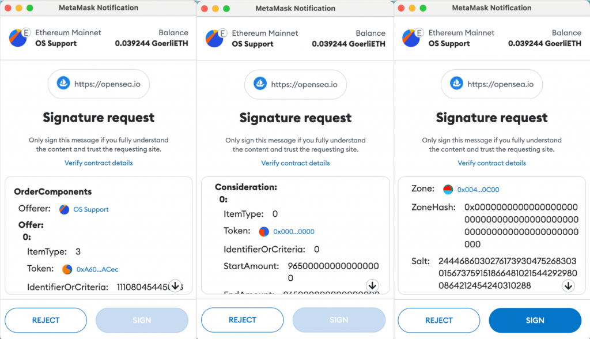

注意到跟 Sign Personal Message 的畫面不太一樣，是比較有結構的資料。賣家簽完名就代表他已經同意以某個固定的價格出售此 NFT，這樣當買家願意成交的時候，就只要在發出購買交易時把賣家的簽章送到智能合約上，並支付對應的價格，在合約中驗證通過就能自動完成這筆交易了（賣家的 NFT 轉給買家、買家的錢轉給賣家）。在 [Metamask 關於 Sign Data 的文件](https://docs.metamask.io/wallet/how-to/sign-data/)中有更多關於實際使用 Sign Typed Data 時的細節（例如還需要提供 domain 資料），有興趣的讀者可以再深入了解。

#### 5. 錢包登入

了解前面兩種簽名方法後，就可以來介紹錢包登入時前端所需傳送給後端的資料了。由於這個簽章沒有要在鏈上驗證，可以使用 Sign Personal Message 方法即可。這個簽章要讓後端進行驗證，所以前後端就必須約定好一個訊息的格式，就像最前面 blur 的登入訊息都有固定的格式一樣（只有最後的 challenge 字串會變），後端才能透過訊息內容跟簽章來還原出是哪個地址簽的名，進而比對還原結果跟使用者宣稱的地址是否為同一個。

爲了避免別人只要拿到我過去對某個訊息的簽名就能以我的身份登入這個服務（又稱為 Replay Attack），需要設計一個簽名不能被重複使用的機制。以下先示範一個最簡單的作法，透過組合錢包地址跟當下的 timestamp 來產生唯一的訊息，這樣後端也能在驗證簽章的同時驗這個 timestamp 是否已經太舊，來避免 Replay Attack。

要簽 Personal Message 就可以使用 wagmi 的 `useSignMessage` hook，搭配 `useAccount` 拿到當下登入的錢包地址，基於錢包地址跟 timestamp 算出要簽名的訊息，使用者點擊 Sign 後呼叫 `signMessage()` 就可以把簽章顯示在畫面上了。另外為了讓簽名訊息更加唯一，通常會放一些這個應用專屬的字串（例如應用名稱、網址、歡迎訊息等等）

[code]
    import { useAccount, useSignMessage } from "wagmi";
    import { ConnectButton } from "@rainbow-me/rainbowkit";
    import { useEffect, useState } from "react";

    function SignIn() {
      const { address } = useAccount();
      const [message, setMessage] = useState("");
      useEffect(() => {
        if (address) {
          const timestamp = Math.floor(new Date().getTime() / 1000);
          // set msg based on current wallet address and timestamp, with unique application string
          setMessage(
            `Welcome to myawesomedapp.com. Please login to continue. Challenge: ${address?.toLowerCase()}:${timestamp}`
          );
        }
      }, [address]);

      const {
        data: signature,
        isError,
        error,
        signMessage,
      } = useSignMessage({ message });

      return (
        

          <ConnectButton />
          <button onClick={() => signMessage()}>Sign Message</button>
          
Message: {message}

          
Signature: {signature}

          {isError && 
Error: {error?.message}
}
        

      );
    }

[/code]

呈現效果如圖，這樣後續只要把錢包地址、timestamp 跟 signature 送到後端，後端就能自己組出簽名的訊息並驗證簽章是否有效了。如果有成功跑到這裡的讀者可以把 message 跟 signature 記錄下來，會在後續的後端開發中用來確認驗簽章的 function 是否運作正常。

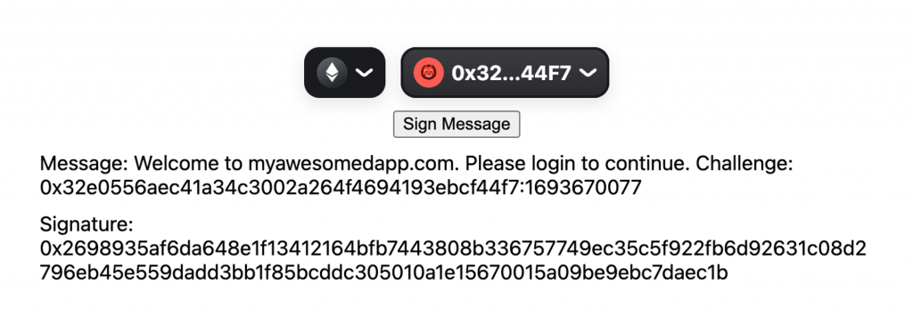

#### 6. Sign in with Ethereum (SIWE)

提到錢包登入就必須提到已經成為以太坊標準的 [Sign in with Ethereum](https://login.xyz/)（SIWE）協議。這個是 [ERC-4361](https://eips.ethereum.org/EIPS/eip-4361) 所定義的，因為大家在實作用錢包簽名登入時，會發明很多各式各樣的訊息格式，不夠謹慎的話可能有安全性不足的問題。所以 Sign in with Ethereum 標準就是想統一登入時簽名訊息的格式。依據官方文件，以下是一個範例的 SIWE 訊息：

[code]
    service.org wants you to sign in with your Ethereum account:
    0xc02aaa39b223fe8d0a0e5c4f27ead9083c756cc2

    I accept the ServiceOrg Terms of Service: https://service.org/tos

    URI: https://service.org/login
    Version: 1
    Chain ID: 1
    Nonce: 32891756
    Issued At: 2021-09-30T16:25:24Z
    Resources:
    - ipfs://bafybeiemxf5abjwjbikoz4mc3a3dla6ual3jsgpdr4cjr3oz3evfyavhwq/
    - https://example.com/my-web2-claim.json

[/code]

可以看到裡面包含了 domain, wallet address, URI, Chain, Nonce, timestamp 等等資訊，非常完整且安全性更高，像是他寫清楚了應用的 domain name 來避免使用者被釣魚、透過 Nonce 來確保每次簽名的訊息都不一樣、透過 Issued At 來紀錄 timestamp 等等。

使用方式只要先跑 `pnpm i siwe` 來安裝 `siwe` 套件，並使用 `new siwe.SiweMessage()` 來產出 SIWE Message 即可

[code]
    import * as siwe from "siwe";

    function createSiweMessage(address: string): string {
      const siweMessage = new siwe.SiweMessage({
        domain: "localhost:3000",
        address,
        statement: "Welcome to myawesomedapp. Please login to continue.",
        uri: "http://localhost:3000/signin",
        version: "1",
        chainId: 1,
        nonce: "07EwlNV39F7FRRqpu",
      });
      return siweMessage.prepareMessage();
    }

[/code]

再來就可以在畫面上加入對應的 SIWE message 與 signature

[code]
    // SignIn()
    const [siweMessage, setSiweMessage] = useState("");
    useEffect(() => {
      if (address) {
        setSiweMessage(createSiweMessage(address));
      }
    }, [address]);
    const { data: siweSignature, signMessage: signSiweMessage } = useSignMessage({
      message: siweMessage,
    });

    // in return
    <ConnectButton />
    <button onClick={() => signMessage()}>Sign Message</button>
    <button onClick={() => signSiweMessage()}>Sign SIWE Message</button>
    
Message: {message}

    
Signature: {signature}

    {isError && 
Error: {error?.message}
}
    
SIWE Message: {siweMessage}

    
SIWE Signature: {siweSignature}

[/code]

點擊 Sign SIWE Message 就會呈現這樣的效果，可以注意到 Metamask 有針對 SIWE Message 特別顯示更好看的格式，而不是直接呈現 Sign Personal Message 的效果

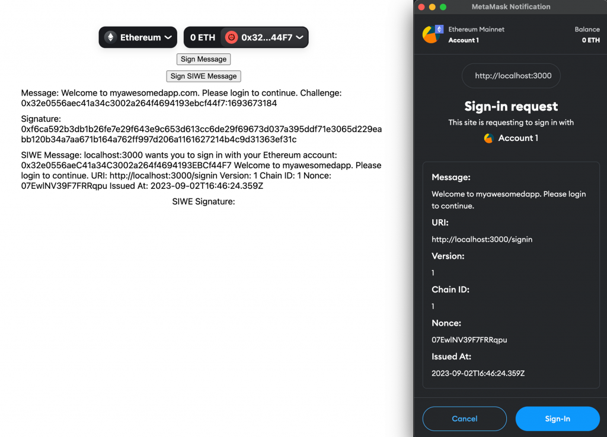

另外一個值得提的功能是，Metamask 就有內建防止 SIWE 簽名釣魚的機制。如果把 `new siwe.SiweMessage()` 中的 `domain` 換成非 `localhost:3000` 的值（例如 `localhost:3001`），再按一次 Sign SIWE Message 的話，Metamask 就會偵測到 domain name mismatch 並跳出釣魚的警告，因為以這個例子來說很有可能是使用者進到 `localhost:3000` 這個釣魚網站，想要竊取他在 `localhost:3001` 網站的簽名。效果類似以下的圖（取自 [Metamask SIWE 文件](https://docs.metamask.io/wallet/how-to/sign-data/siwe/)）

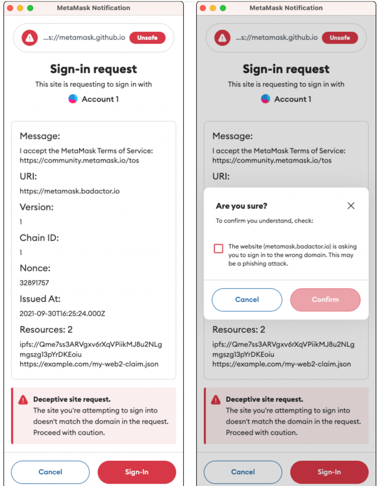

#### 7. 小結

今天我們詳細介紹以太坊中 Sign Personal Message 跟 Sign Typed Data 的概念，並使用 Sign Personal Message 來實作錢包登入的前端部分，拿到 Signature 以便未來傳給後端做驗證。最後介紹並實作了 Sign in with Ethereum 標準來統一錢包登入的訊息規格。Sign in with Ethereum [官方文件](https://docs.login.xyz/sign-in-with-ethereum/quickstart-guide)已經有很完整的各語言的實作，有興趣的讀者可以往下研究。以及像 Rainbow Kit 中也有 [Authentication 模組](https://www.rainbowkit.com/docs/authentication)，是使用 Next Auth 來實作 SIWE 登入，都是很好的資源。

今天的程式碼都放在[這裡](https://github.com/a00012025/ironman-2023-web3-fullstack/tree/main/frontend/day7)。Web3 與前端基礎部分的文章就到這邊，接下來就會開始進入 Web3 與後端的主題囉！

## DAY 8｜Day 8 - Web3 智能合約基礎

- 原文：https://ithelp.ithome.com.tw/articles/10320152
- 發佈時間：2023-09-17 00:20:56

### 章節內容

#### 1. 未分章內容

由於 Web3 與前端的主題暫時告一段落（後續會再有進階的 Web3 前端主題），作為到後端主題的銜接，如果對智能合約相關概念有更多理解的話會很有幫助，像前面我們有初步了解 ERC-20 的標準，不過還沒深入了解裡面的機制。因此今天會先從智能合約的開發語言與框架開始介紹，透過 ERC-20 作為範例講解一個代幣的實作邏輯，再介紹 NFT 的概念與機制。由於本系列文章不會專注於教大家如何寫智能合約，今天會是系列中唯一講到智能合約開發的。

#### 2. 智能合約

智能合約的定義其實很單純，如同 Ethereum 官方文件描述的：

> A "smart contract" is simply a program that runs on the Ethereum blockchain. It's a collection of code (its functions) and data (its state) that resides at a specific address on the Ethereum blockchain.

所以其實嚴格來說他不是合約也沒那麼智能，Vitalik （以太坊的創始人）就提過應該要把它取名為 Persistent Scripts，不過既然已經廣為流傳，大家還是習慣叫他智能合約。以下是一個由 Solidity 寫的最簡單的智能合約，可以做到用 set 把一個資料存在這個合約上，並用 get 拿到這個資料。

[code]
    // SPDX-License-Identifier: MIT
    pragma solidity ^0.8.0;

    contract SimpleStorage {
        uint256 private storedData;

        function set(uint256 _data) public {
            storedData = _data;
        }

        function get() public view returns (uint256) {
            return storedData;
        }
    }

[/code]

#### 3. 智能合約開發

最廣為人知的智能合約開發語言就是 Solidity，他的寫法類似 Javascript 所以還算好上手。除了 Solidity 外也還也不少其他語言：

* [Vyper](https://vyper.readthedocs.io/en/stable/index.html): 可以用類似 Python 的語法來寫智能合約，他的語法比較高階因此也蠻多人喜歡，按照 DeFi TVL 的統計數據目前是第二名（僅次於 Solidity）的語言。
  * [Yul](https://docs.soliditylang.org/en/latest/yul.html): 寫法比較像組合語言，在 Solidity 中有時需要做底層的 gas fee 優化時會使用 inline assembly 的方式，Yul 就可以跟 Solidity 很好的結合
  * [Huff](https://huff.sh/): 近期開始有不少討論度的底層語言，宣稱如果精通 EVM 的話可以寫出比 Yul 更省 gas fee 的合約。

更多關於這些語言的比較可參考：[Solidity vs. Vyper: Which Smart Contract Language Is Right for Me?](https://blog.chain.link/solidity-vs-vyper/)

再來是開發框架的簡介，以下幾個都是開發 Solidity 可以使用的框架：

* [Remix](https://remix.ethereum.org/)：較老牌的基於瀏覽器的 IDE，適合在雲端上快速實作原型。
  * [Truffle](https://trufflesuite.com/)：流行的開發框架，有內建的智能合約編譯、部署、測試的工具。
  * [Hardhat](https://hardhat.org/)：較新也比 Truffle 靈活的框架，更易於用來寫測試及 debug，像是有內建在合約中執行 console log 的 debug 方式。
  * [Foundry](https://book.getfoundry.sh/)：更新也比 Hardhat 更快的開發框架，提供純用 Solidity 寫的測試方式（相較於 Truffle Hardhat 都是用 Javascript 寫測試），許多人已經從 hardhat 換成使用 foundry。

關於這四個開發框架實際應用的方式，可以參考 [Remix vs Truffle vs Hardhat vs Foundry](https://ethereum-blockchain-developer.com/124-remix-vs-truffle-vs-hardhat-vs-foundry/00-overview)。我個人學習的開發框架主要是 Hardhat 跟 Foundry，因為我比較喜歡學習新的框架跟體驗它的好處，讀者可以挑有興趣的框架學習，網路上都有大量相關的資源，或是從官方文件一個一個爬文就是很好的起點。

至於 Vyper 可以使用 [brownie](https://github.com/eth-brownie/brownie) 來輔助開發跟測試，有學習 Vyper 的讀者也可以一併學。

#### 4. ERC-20 Token Contract 實作

接下來選一個 ERC-20 Token 我們實際來看他智能合約的實作。到 [Etherscan](https://etherscan.io) 上搜尋 USDT 這個幣，就可以找到他的智能合約地址：[0xdAC17F958D2ee523a2206206994597C13D831ec7](https://etherscan.io/address/0xdac17f958d2ee523a2206206994597c13d831ec7)

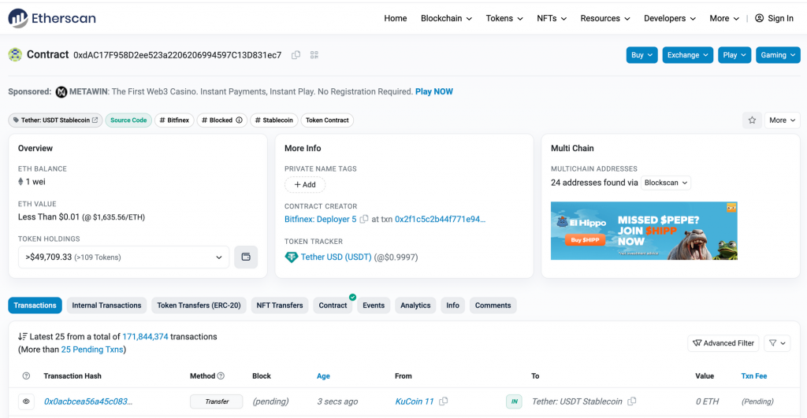

點擊中間的 Contract Tab 就可以看到這個智能合約完整的程式碼。因為所有智能合約都是在區塊鏈上，所以合約的執行邏輯也是公開透明的。只是會有智能合約是否開源的區別，像 USDT 的合約程式碼就有開源，任何人都可以查看是否有漏洞，智能合約開發者如果希望獲得社群的信任，通常就會把合約程式碼開源出來。至於沒有開源的合約會長得像這樣：

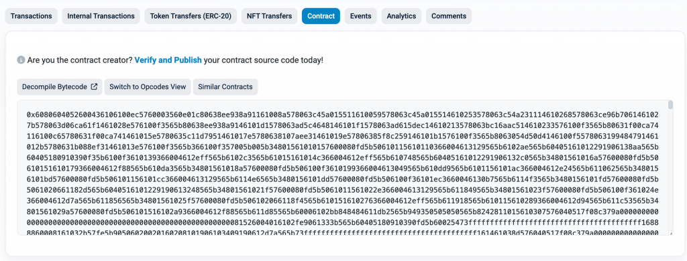

是一串看不懂的 bytecode，當然這個智能合約的執行邏輯還是公開透明的，因為 bytecode 就包含所有合約執行的邏輯，但這樣的缺點是不可讀也很難做審計，所以主要是用在要保護關鍵的邏輯不被別人知道時，例如一些套利程式的合約，或是一些惡意的合約可能刻意藏漏洞在裡面不讓別人發現。

回到 USDT 的合約，往下滑可以看到完整的程式碼，或是點擊 Read Contract 及 Write Contract 分別可以看到這個智能合約提供哪些讀取跟寫入方法。而因為在 Etherscan 上查看程式碼比較不方便（有時程式碼會分成多個檔案不好查詢），推薦使用 [deth code viewer](https://github.com/dethcrypto/dethcode) 來看合約的程式碼。只要把原本的智能合約網址中 `etherscan.io` 改成 `etherscan.deth.net` 就可以了，也就是把 [`https://etherscan.io/address/0xdac17f958d2ee523a2206206994597c13d831ec7`](https://etherscan.io/address/0xdac17f958d2ee523a2206206994597c13d831ec7) 改成 [`https://etherscan.deth.net/address/0xdac17f958d2ee523a2206206994597c13d831ec7`](https://etherscan.deth.net/address/0xdac17f958d2ee523a2206206994597c13d831ec7) ，就可以看到以下類似 VS Code 的畫面

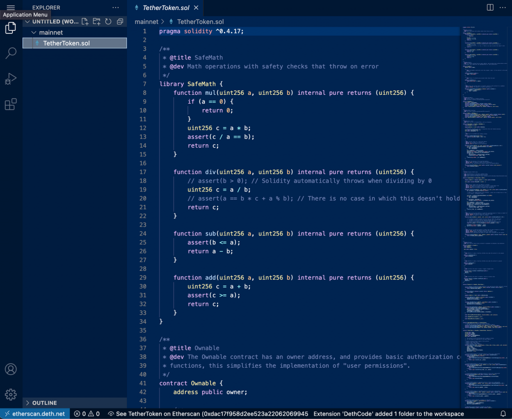

deth code viewer 也支援許多主流的 EVM chain explorer（[支援列表](https://github.com/dethcrypto/dethcode/blob/main/docs/supported-explorers.md)），非常方便。

裡面可以看到一些關鍵的 ERC-20 function 的實作，包含 `transfer()`, `approve()`, `transferFrom()`, `balanceOf()`, `allowance()` 等等，先挑最簡單的 `balanceOf()` 來看

[code]
    /**
    * @dev Gets the balance of the specified address.
    * @param _owner The address to query the the balance of.
    * @return An uint representing the amount owned by the passed address.
    */
    function balanceOf(address _owner) public constant returns (uint balance) {
        return balances[_owner];
    }

[/code]

可以看到一個地址的 balance 就是直接從 `balances` 這個 map 中取得，他的定義是

[code]
    mapping(address => uint) public balances;

[/code]

因此 `balances` 這個 map 就是一般 ERC-20 合約最核心的資料，儲存所有地址的餘額。所以就很好理解 `transfer()` 裡做的事：

[code]
    /**
    * @dev transfer token for a specified address
    * @param _to The address to transfer to.
    * @param _value The amount to be transferred.
    */
    function transfer(address _to, uint _value) public onlyPayloadSize(2 * 32) {
        uint fee = (_value.mul(basisPointsRate)).div(10000);
        if (fee > maximumFee) {
            fee = maximumFee;
        }
        uint sendAmount = _value.sub(fee);
        balances[msg.sender] = balances[msg.sender].sub(_value);
        balances[_to] = balances[_to].add(sendAmount);
        if (fee > 0) {
            balances[owner] = balances[owner].add(fee);
            Transfer(msg.sender, owner, fee);
        }
        Transfer(msg.sender, _to, sendAmount);
    }

[/code]

先忽略收取手續費的部分，最核心的邏輯就只是把 `msg.sender` （也就是發送交易的地址）的餘額減少 `_value`，並讓 `to` 地址的餘額增加 `_value` 而已。

再來介紹 `approve()`, `allowance()`, `transferFrom()`方法。因為有時在操作智能合約時，可能會遇到需要讓另一個智能合約把我的 USDT 轉走的情況，例如當我想在 Uniswap 上用 USDT 換成 ETH，其實我是跟 Uniswap 的合約互動，過程中 Uniswap 的合約會主動把我的 USDT 轉走並轉對應數量的 ETH 給我，因此才需要 `transferFrom()` 方法。來看一下裡面的實作：

[code]
    /**
    * @dev Transfer tokens from one address to another
    * @param _from address The address which you want to send tokens from
    * @param _to address The address which you want to transfer to
    * @param _value uint the amount of tokens to be transferred
    */
    function transferFrom(address _from, address _to, uint _value) public onlyPayloadSize(3 * 32) {
        var _allowance = allowed[_from][msg.sender];

        // Check is not needed because sub(_allowance, _value) will already throw if this condition is not met
        // if (_value > _allowance) throw;

        uint fee = (_value.mul(basisPointsRate)).div(10000);
        if (fee > maximumFee) {
            fee = maximumFee;
        }
        if (_allowance < MAX_UINT) {
            allowed[_from][msg.sender] = _allowance.sub(_value);
        }
        uint sendAmount = _value.sub(fee);
        balances[_from] = balances[_from].sub(_value);
        balances[_to] = balances[_to].add(sendAmount);
        if (fee > 0) {
            balances[owner] = balances[owner].add(fee);
            Transfer(_from, owner, fee);
        }
        Transfer(_from, _to, sendAmount);
    }

[/code]

這個方法就是由發送交易的人把 `_from` 地址身上的 USDT 轉給 `_to` 地址。一樣先忽略計算 fee 的邏輯，由於不可能任何人都能把其他人的 USDT 轉走，第一行就是先去 `allowed` map 中看 `_from` 地址允許 `msg.sender` 使用多少 USDT，並在後面的 `_allowance.sub(_value)` 這行驗證 `_value` 是否小於等於 `_allowance` ，有的話就把他扣掉並設成新的 allowed 值（否則他會自動 throw exception 讓交易失敗）。所以只要我曾經允許過別的地址轉走我多少 USDT，那個地址隨時可以呼叫 `transferFrom()` 來把我的 USDT 轉走。因此通常只會允許智能合約來轉走自己的 USDT 而不會允許終端的錢包地址（Externally Owned Account, 又稱 EOA），因為智能合約只會在特定的邏輯中呼叫 `transferFrom()` 方法，不會隨便呼叫。

至於如何設定我要授權給該地址使用多少我的 USDT，就必須呼叫 `approve()` 方法：

[code]
    /**
    * @dev Approve the passed address to spend the specified amount of tokens on behalf of msg.sender.
    * @param _spender The address which will spend the funds.
    * @param _value The amount of tokens to be spent.
    */
    function approve(address _spender, uint _value) public onlyPayloadSize(2 * 32) {

        // To change the approve amount you first have to reduce the addresses`
        //  allowance to zero by calling `approve(_spender, 0)` if it is not
        //  already 0 to mitigate the race condition described here:
        //  https://github.com/ethereum/EIPs/issues/20#issuecomment-263524729
        require(!((_value != 0) && (allowed[msg.sender][_spender] != 0)));

        allowed[msg.sender][_spender] = _value;
        Approval(msg.sender, _spender, _value);
    }

[/code]

可以看到當我呼叫 `approve()` 時就是去改動 `allowed` map，把這個資訊存進合約供未來 `_spender` 可以呼叫 `transferFrom()`。而查詢我對特定地址的 USDT 授權數量則是使用 `allowance()`

[code]
    /**
    * @dev Function to check the amount of tokens than an owner allowed to a spender.
    * @param _owner address The address which owns the funds.
    * @param _spender address The address which will spend the funds.
    * @return A uint specifying the amount of tokens still available for the spender.
    */
    function allowance(address _owner, address _spender) public constant returns (uint remaining) {
        return allowed[_owner][_spender];
    }

[/code]

以上講解了 ERC-20 合約中最關鍵的幾個方法，而 USDT 還有其他關於黑名單的變數與方法（`addBlackList()`, `isBlackListed` 等等）是用來封鎖駭客或是洗錢者的地址，他們的程式碼就留給讀者自行理解。

#### 5. 智能合約的 Event

在智能合約中除了變數與方法，還有一個概念沒有介紹到，也就是 Event。例如 `transferFrom()` 方法的最後一行其實會發出一個像這樣的 event: `Transfer(_from, _to, sendAmount)` ，在智能合約裡可以找到他的定義：

[code]
    event Transfer(address indexed from, address indexed to, uint value);

[/code]

而 `Transfer` 也是 ERC-20 標準中定義的 Event。Event 可以用來方便查詢關於一個智能合約的歷史交易中，大家感興趣的事件。像當我想列出我的地址過去所有 USDT 的轉帳歷史時，如果要一個一個查詢我過去有跟 USDT 合約互動的紀錄會很麻煩，而且這還沒考慮到別人用 `transferFrom()` 把我 USDT 轉走的情況，就變成要看完所有跟 USDT 合約互動的交易才不會遺漏，而現在這些交易已經高達 1.7 億筆！

有了 Event 的機制，當 USDT 合約中有發生任何 Token Transfer 都發出 `Transfer` event 的話，等於是讓以太坊節點幫我們做 indexing，讓任何人可以直接 filter 出這個合約中特定內容的 event 有哪些。例如我想知道從我地址轉入或轉出 USDT 的所有記錄，就只要 filter 出 USDT 合約上 `from` 或是 `to` 的值等於我的地址的 Transfer Event 就可以了。後續會在後端的內容中介紹如何拿到 Token Transfer 的資料。

在 Etherscan USDT 介面上的 [Events Tab](https://etherscan.io/address/0xdac17f958d2ee523a2206206994597c13d831ec7#events) 可以看到近期這個智能合約發出的 Events，以及每筆交易的 Logs Tab 可以看到該筆交易觸發了哪些智能合約中的哪些 Event（例如上次轉出 UNI token 的[交易 Logs](https://sepolia.etherscan.io/tx/0x8778dfe09585097badb32951bc34a1cb41c166045bd37f6b92885b40f5c26bfc#eventlog)）。

#### 6. FT vs NFT

介紹完了 ERC-20 Token 接下來就能介紹更多的代幣標準，包含 ERC-721 及 ERC-1155。這裡就要講到 Fungible Token（FT） 跟 Non-Fungible Token（NFT） 之間的差別。

Fungible Token 又稱同質性代幣，前面介紹的 ERC-20 Token 就是屬於 Fungible Token，因為每一單位的 USDT 都是一樣的，如果 A 跟 B 都有 1 USDT，A 把他的 1 USDT 轉給 B，B 就會有兩個 USDT，代表 A 身上的 USDT 跟 B 身上的 USDT 是同質、沒有差異的。Fungible Token 的特性就是可以任意合併或拆分，適合用來實作貨幣的智能合約。

與之相對的就是 Non-Fungible Tokens，又稱非同質性代幣，代表每個 Token 都是獨一無二、不同質的。例如知名的 [Bored Ape Yacht Club (BAYC)](https://boredapeyachtclub.com/) NFT 就是由一萬張 Ape 的圖片組成，每個 Ape 都有他對應的 ID、圖片、特色，因此就算我有兩個 BAYC NFT 他們也無法合併，而是兩個分開的 Token 並且可以各自被交易、轉移。NFT 也是無法分割的，沒辦法像 FT 一樣轉出 0.5 個 NFT。最知名的 NFT 標準包含 ERC-721 與 ERC-1155，常被用來實作像數位收藏品、遊戲道具、抽獎券等等可以對應到現實世界中「物品」或「資產」的概念。科普的介紹推薦看[老高關於 NFT 的介紹影片](https://www.youtube.com/watch?v=cDk1FPoCfqI)。

至於 ERC-721 跟 ERC-1155 有怎樣的差別，簡單來說 ERC-721 代表的是每個 Token 都是獨一無二的 NFT，如數位藝術品每一件都是獨一無二的。ERC-1155 則是代表有部分 Token 是一樣的 NFT，例如遊戲中可能會有不同種類的藥水，但每種藥水本身是同質的沒有任何差異。背後的技術細節可以參考 [ERC-721](https://docs.openzeppelin.com/contracts/4.x/api/token/erc721) 及 [ERC-1155](https://docs.openzeppelin.com/contracts/4.x/api/token/erc1155) 的介面定義，可以更了解這兩個標準的合約支援的操作。

#### 7. 小結

今天我們介紹了關於智能合約的開發、ERC-20 的實作與智能合約的 Event，以及在以太坊上實作 NFT 的兩個標準，接下來就會正式進入 Web3 與後端的開發了，會先延續前一天的錢包登入功能把它實作完成。

## DAY 9｜Day 9 - Web3 與後端：實作錢包登入 Part 2

- 原文：https://ithelp.ithome.com.tw/articles/10321485
- 發佈時間：2023-09-18 13:56:25

### 章節內容

#### 1. 未分章內容

今天我們正式進入 Web3 與後端的開發，在 Day 7 的前端程式已經準備好了簽名的訊息及簽章結果，因此後端需要提供一個 API 來驗證這個簽名，若驗證通過就可以任意選擇一種 Session 的實作方式來讓前端維持這個登入狀態。今天會示範用 golang 實作 Personal Message 以及 SIWE Message 的簽名驗證功能。

#### 2. 準備資料

在 Day 7 我的地址（`0x32e0556aeC41a34C3002a264f4694193EBCf44F7`）使用 Sign Personal Message 簽名的第一個訊息為

[code]
    Welcome to myawesomedapp.com. Please login to continue. Challenge: 0x32e0556aec41a34c3002a264f4694193ebcf44f7:1693724609

[/code]

簽章結果為

[code]
    0x53dd5375da3fb1cadb5b5bd27c6ee7a23c715ff6be1c8001a52b4d1e2bb206e078f337645e223899b38a908a68d19c71850e4a48dc8753de1c3c8cd401c72bbf1b

[/code]

還有簽名 SIWE 的訊息內容為

[code]
    localhost:3000 wants you to sign in with your Ethereum account:
    0x32e0556aeC41a34C3002a264f4694193EBCf44F7

    Welcome to myawesomedapp. Please login to continue.

    URI: http://localhost:3000/signin
    Version: 1
    Chain ID: 1
    Nonce: 07EwlNV39F7FRRqpu
    Issued At: 2023-09-03T06:41:21.941Z

[/code]

對應的簽章結果為

[code]
    0xf90048971fd8e50e1768386ea28139d9cc708d60b2b475407f6c1fb9bcad34df48f0d310d5eaf7a99b30f518ade8d712637f73681a372b461519c38ef3ab9f8e1b

[/code]

這些資料就可以作為後續核心驗證邏輯的測試資料，來確保實作的 function 正確。

#### 3. 驗證 Personal Message Signature

[go-ethereum](https://github.com/ethereum/go-ethereum) 是以太坊官方使用 golang 來實作整個以太坊協議的 repo，它提供了讓每個人都能把以太坊節點跑起來的功能，因此這個 golang package 裡也有非常完整的以太坊相關 utils function 可以用，包含今天需要的驗證簽章的 function。因此我們在初始化 golang project 時先安裝好 go-ethereum

[code]
    go mod init github.com/a00012025/ironman-2023-web3-fullstack/backend/day9
    go get github.com/ethereum/go-ethereum

[/code]

接下來最核心要實作的驗證邏輯是：當拿到錢包地址、簽名訊息以及 signature 時，要能判斷這個簽章是否真的是這個錢包地址簽名出來的。而因為簽名 Personal Message 背後的機制是他也會先基於這個訊息去算出一個 hash，再用私鑰簽名這個 hash，因此這裡也需要先算出對應的 hash 再做還原。function 定義及步驟大致長這樣：

[code]
    // VerifySignature checks the signature of the given message.
    func VerifySignature(from, sigHex, msg string) error {
    	// input validation
    	// calculate message hash
    	// recover public key from signature and verify it matches the from address
    }

[/code]

因此會需要 go-ethereum 中的關於計算 message hash 以及 recover public key 的兩個 function，他們分別是 `[accounts.TextHash()](https://pkg.go.dev/github.com/ethereum/go-ethereum@v1.12.2/accounts#TextHash)` 以及 `[crypto.SigToPub()](https://pkg.go.dev/github.com/ethereum/go-ethereum@v1.12.2/crypto#SigToPub)`

[code]
    // TextHash is a helper function that calculates a hash for the given message that can be
    // safely used to calculate a signature from.
    //
    // The hash is calculated as
    //
    //	keccak256("\x19Ethereum Signed Message:\n"${message length}${message}).
    //
    // This gives context to the signed message and prevents signing of transactions.
    func TextHash(data []byte) []byte

    // SigToPub returns the public key that created the given signature.
    func SigToPub(hash, sig []byte) (*ecdsa.PublicKey, error)

[/code]

從 `TextHash()` 的註解可以看到其實這個 hash 的計算方式是會把一個固定的字串（`\x19Ethereum Signed Message:\n`）以及訊息的長度加在這個 message 前面，再用 `keccak256` （也就是 SHA-3）做 hash，這個恰好就是 [ERC-191 簽名標準](https://eips.ethereum.org/EIPS/eip-191)的實作方式。另外`keccak256` 是在以太坊中被廣泛應用的 hash function，在很多地方都可以看到他。`SigToPub()` 則可以從一個被簽名的 hash 跟簽出的 signature 來計算這個簽名對應的 Public key 身份，而 Public key 就會對應到錢包地址。有了這兩個 function 就能看懂 `VerifySignature()` 的實作：

[code]
    // verify.go
    package main

    import (
    	"fmt"
    	"strings"

    	"github.com/ethereum/go-ethereum/accounts"
    	"github.com/ethereum/go-ethereum/common/hexutil"
    	"github.com/ethereum/go-ethereum/crypto"
    )

    // VerifySignature checks the signature of the given message.
    func VerifySignature(from, sigHex, msg string) error {
    	// input validation
    	sig, err := hexutil.Decode(sigHex)
    	if err != nil {
    		return fmt.Errorf("failed to decode signature: %v", err.Error())
    	}
    	if len(sig) != 65 {
    		return fmt.Errorf("invalid Ethereum signature length: %v", len(sig))
    	}
    	if sig[64] != 27 && sig[64] != 28 {
    		return fmt.Errorf("invalid Ethereum signature (V is not 27 or 28): %v", sig[64])
    	}

    	// calculate message hash
    	msgHash := accounts.TextHash([]byte(msg))

    	// recover public key from signature and verify it matches the from address
    	sig[crypto.RecoveryIDOffset] -= 27 // Transform yellow paper V from 27/28 to 0/1
    	recovered, err := crypto.SigToPub(msgHash, sig)
    	if err != nil {
    		return fmt.Errorf("failed to recover public key: %v", err.Error())
    	}
    	recoveredAddr := crypto.PubkeyToAddress(*recovered)
    	if strings.EqualFold(from, recoveredAddr.Hex()) {
    		return nil
    	}
    	return fmt.Errorf("invalid Ethereum signature (addresses don't match)")
    }

[/code]

前面先做的驗證包含以太坊的簽章長度必須為 65 bytes ，且最後一位的值會是 27 或 28，這些數字以及為何要減去 27 跟橢圓曲線密碼學的細節有關就不在這邊展開（有興趣可以參考[這篇文章](https://medium.com/mycrypto/the-magic-of-digital-signatures-on-ethereum-98fe184dc9c7)），除此之外的程式碼都算是很好理解的。

#### 4. 寫測試

接下來就可以用前面拿到的簽章作為測試來驗證這個 function 是否正常了。要特別注意的是 `siweMessage` 由於是 multi line string，中間不能有多餘的空白，否則簽章會驗不過。

[code]
    package main

    import (
    	"testing"

    	"github.com/stretchr/testify/assert"
    )

    const address = "0x32e0556aeC41a34C3002a264f4694193EBCf44F7"
    const msg = "Welcome to myawesomedapp.com. Please login to continue. Challenge: 0x32e0556aec41a34c3002a264f4694193ebcf44f7:1693724609"
    const msgSignature = "0x53dd5375da3fb1cadb5b5bd27c6ee7a23c715ff6be1c8001a52b4d1e2bb206e078f337645e223899b38a908a68d19c71850e4a48dc8753de1c3c8cd401c72bbf1b"

    const siweMessage = `localhost:3000 wants you to sign in with your Ethereum account:
    0x32e0556aeC41a34C3002a264f4694193EBCf44F7

    Welcome to myawesomedapp. Please login to continue.

    URI: http://localhost:3000/signin
    Version: 1
    Chain ID: 1
    Nonce: 07EwlNV39F7FRRqpu
    Issued At: 2023-09-03T06:41:21.941Z`

    const siweSignature = "0xf90048971fd8e50e1768386ea28139d9cc708d60b2b475407f6c1fb9bcad34df48f0d310d5eaf7a99b30f518ade8d712637f73681a372b461519c38ef3ab9f8e1b"

    func TestVerifySignature(t *testing.T) {
    	err := VerifySignature(address, msgSignature, msg)
    	assert.Nil(t, err)

    	err = VerifySignature(address, siweSignature, siweMessage)
    	assert.Nil(t, err)
    }

[/code]

執行 `go test ./...` 就可以看到測試成功通過，代表 `VerifySignature` 的實作沒有問題。

#### 5. 驗證 SIWE Signature

由於 SIWE Message 中設計了一些安全機制，除了驗 Signature recovery 後的地址一致之外還有其他需要驗證的點，像是 domain 的值是否跟後端預期的一致，以及如果訊息中有包含 Expiration Time 或是 Not Before 欄位的話，要驗證當下的時間是否在 Expiration Time 之前，且在 Not Before 之後。這些機制可以使用 [siwe-go](https://github.com/spruceid/siwe-go) package 提供的 `message.Verify` function 做到，他的用法如下：

[code]
    var publicKey *ecdsa.PublicKey
    var err error

    // Optional domain and nonce variable to be matched against the
    // built message struct being verified
    var optionalDomain *string
    var optionalNonce *string

    // Optional timestamp variable to verify at any point
    // in time, by default it will use `time.Now()`
    var optionalTimestamp *time.Time

    publicKey, err = message.Verify(signature, optionalDomain, optionalNonce, optionalTimestamp)

    // If you won't be using domain and nonce matching and want
    // to verify the message at current time, it's
    // safe to pass `nil` in these arguments
    publicKey, err = message.Verify(signature, nil, nil, nil)

[/code]

因此可以選擇性驗證訊息內的 domain 及 nonce 值是否跟後端預期的值相同。這樣就可以用來實作 `VerifySiweSignature` function：

[code]
    import (
      "fmt"
    	"strings"

    	"github.com/ethereum/go-ethereum/crypto"
      "github.com/spruceid/siwe-go"
    )

    // VerifySiweSignature checks the signature of the given SIWE message. It returns the nonce of the message if it's valid
    func VerifySiweSignature(from, sigHex, msg, domain string) (string, error) {
    	message, err := siwe.ParseMessage(msg)
    	if err != nil {
    		return "", fmt.Errorf("failed to parse SIWE message: %v", err.Error())
    	}

    	publicKey, err := message.Verify(sigHex, &domain, nil, nil)
    	if err != nil {
    		return "", fmt.Errorf("failed to verify signature: %v", err.Error())
    	}

    	recoveredAddr := crypto.PubkeyToAddress(*publicKey)
    	if strings.EqualFold(from, recoveredAddr.Hex()) {
    		return message.GetNonce(), nil
    	}
    	return "", fmt.Errorf("invalid Ethereum signature (addresses don't match)")
    }

[/code]

會設計讓這個 function 回傳訊息中的 Nonce 是因為 Nonce 是前端自己產生的隨機字串，為了避免 replay attack 其實後端還需要驗證這個 Nonce 是否已經被用過，如果有的話也算驗證失敗。因此就需要有個紀錄所有過去用過的 Nonce 的機制，不管是透過任何 Database 或 Cache 來保存狀態都可以。由於篇幅關係就不在這裡實作完這個機制。

最後也加上 `VerifySiweSignature` 的測試，確保我們真的有驗證到訊息中的 domain：

[code]
    func TestVerifySiweSignature(t *testing.T) {
    	nonce, err := VerifySiweSignature(address, siweSignature, siweMessage, "localhost:3000")
    	assert.Nil(t, err)
    	assert.Equal(t, "07EwlNV39F7FRRqpu", nonce)

    	_, err = VerifySiweSignature(address, siweSignature, siweMessage, "localhost:3001")
    	assert.NotNil(t, err)
    	assert.Contains(t, err.Error(), "Message domain doesn't match")
    }

[/code]

再執行一次 `go test ./...` 成功通過，這樣就完成今天的實作內容了！

#### 6. 小結

今天我們實作了驗證簽章的核心功能，完整的程式碼在[這裡](https://github.com/a00012025/ironman-2023-web3-fullstack/tree/main/backend/day9)。而如果要前後端完整接起來的話，還必須完成 API 層的邏輯，包含從 HTTP request 中拿到 message, address, signature 、交由 `VerifySignature` function 驗證、驗證成功後用某種 Session 的設定方式回傳給前端（例如 JWT、Session Cookie）讓前端能維持這個登入狀態。由於篇幅關係這些邏輯可以留給讀者當做後端實作的練習（還有前面提到儲存並比對 Nonce 的機制也是）。

另外 day 7 中的 SIWE 相關資源像是 SIWE 的[官方文件](https://docs.login.xyz/sign-in-with-ethereum/quickstart-guide)跟 Rainbow Kit 的 [NextAuth 實作](https://www.rainbowkit.com/docs/authentication)，裡面也有關於 SIWE 後端的完整實作可供讀者參考。明天我們就會進入如何在後端產生、管理錢包的主題。

## DAY 10｜Day 10 - Web3 與後端：建立錢包與取得 Token Balance

- 原文：https://ithelp.ithome.com.tw/articles/10322595
- 發佈時間：2023-09-19 19:09:16

### 章節內容

#### 1. 未分章內容

前一天已經實作完錢包登入的雛形，這個錢包在使用者的瀏覽器 Extension 內管理的。而有些時候也會需要在後端管理錢包，例如當使用者要把幣打到中心化交易所的入金地址時，交易所會產生一個錢包地址給使用者，並保管好這個錢包的私鑰，使用者入金完成後再自動把這個錢包內的幣轉到歸集錢包中（這樣就能統一把使用者的資金放在幾個大錢包中）。

因此今天我們會來實作產生註記詞、私鑰及錢包地址的功能。有了地址後就能取得他在鏈上的代幣餘額、持有的 NFT 數量等資訊，這樣才能基於這些資訊來自動發送轉出代幣的交易。不過今天我們會先專注在讀取資料的階段，明天才會進到發送交易的實作。

#### 2. 註記詞與 HD W allet

要介紹如何產生錢包就必須細講一下註記詞跟私鑰之間的關係，以及私鑰是如何從註記詞被產生的。回顧一下註記詞的樣子長這樣：

[code]
    proof auction tissue south fold inhale tag fresh marriage enroll siren critic

[/code]

這邊先只考慮 12 個字的註記詞（12 ~ 24 個字都有可能）。這個格式就是 [BIP-39](https://github.com/bitcoin/bips/blob/master/bip-0039.mediawiki) 標準定義的，寫清楚了要用哪些英文單字以及為何選擇這些字等等。在 BIP-39 中總共有 2048 個英文單字，也就是 2 的 11 次方，代表一個單字內會有 11 bits 的資訊量，而 12 個字加起來總共就有 132 bits，這樣就剛好可以對應到一個 128 bits 的隨機數（剩下的 4 個 bits 是會是前 128 bits 的 checksum 來提高容錯率）。這個 128 bits 的隨機數就是能用來產生大量錢包私鑰的根源，也被稱為 seed （因此註記詞又被稱為 seed phrase）

有了這個 128 bits 的隨機數後，接下來就可以透過 [BIP-32](https://github.com/bitcoin/bips/blob/master/bip-0032.mediawiki) 標準定義的演算法從他衍生出大量的錢包。他會先從 seed 算出一個 master key （對應到下圖中的 Master Node），接下來就可以產生一整個樹狀結構的錢包們，每個點都是一個錢包（因此有對應的公私鑰）。所以當沿著這棵樹往右邊走的時候，選擇不同的路徑（分支）就會產生不同的錢包，而且他的特點是只要 seed 跟路徑參數是固定的，就會產生確定的錢包公私鑰，所以這個標準才被稱為 Hierarchical Deterministic Wallet（階層式確定性錢包），簡稱 HD Wallet。至於路徑參數會是長得像 `m/0/1/1` 的字串，代表每一步往右走時選擇的分支是什麼。

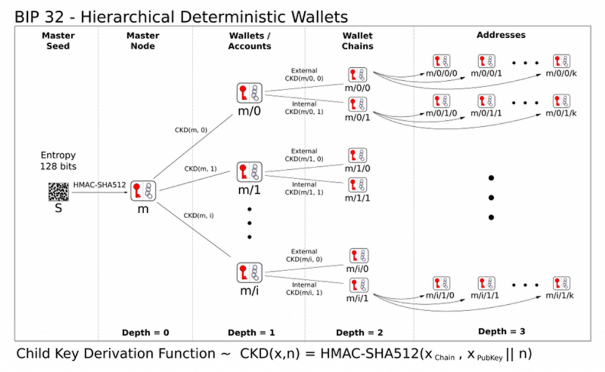

但是一個 seed 可以產生太多的錢包公私鑰了，對以太坊來說要怎麼知道一個註記詞預設產生的錢包是哪個呢？這就是 [BIP-44](https://github.com/bitcoin/bips/blob/master/bip-0044.mediawiki) 定義的內容了。它規定如果要從 seed 產生預設的比特幣錢包，就要使用 `m/44'/0'/0'/0/0` 這個路徑參數。而如果要產生預設的以太坊錢包，就要使用 `m/44'/60'/0'/0/0` ，他們的差別在路徑的第二個數字不同，這就是 BIP-44 中定義不同的鏈必須要用他對應的數字來產生錢包（[定義列表](https://github.com/satoshilabs/slips/blob/master/slip-0044.md)）。

有了第一個錢包後，第二個錢包就只要對路徑的最後一個數字 +1 就能從 seed 算出來了，後續的錢包就可以以此類推。另外在路徑上有個 `'` 代表這是 hardened derivation，是個提高安全性的機制，有興趣的讀者可以再深入研究。

#### 3. 產生註記詞與錢包

了解以上概念後就能理解接下來的程式碼。以下會使用 [go-bip39](github.com/tyler-smith/go-bip39) 套件來產生註記詞，以及 [go-ethereum-hdwallet](https://github.com/miguelmota/go-ethereum-hdwallet) 套件來產生這個註記詞對應的兩個預設錢包。直接來看實作：

[code]
    package main

    import (
    	"fmt"
    	"log"

    	"github.com/ethereum/go-ethereum/accounts"
    	"github.com/ethereum/go-ethereum/common/hexutil"
    	"github.com/ethereum/go-ethereum/crypto"
    	hdwallet "github.com/miguelmota/go-ethereum-hdwallet"
    	"github.com/tyler-smith/go-bip39"
    )

    // GenerateMnemonic generate mnemonic
    func GenerateMnemonic() string {
    	entropy, err := bip39.NewEntropy(128)
    	if err != nil {
    		log.Fatal(err)
    	}
    	mnemonic, err := bip39.NewMnemonic(entropy)
    	if err != nil {
    		log.Fatal(err)
    	}
    	return mnemonic
    }

    // DeriveWallet derive wallet from mnemonic and path. It returns the account and private key.
    func DeriveWallet(mnemonic string, path accounts.DerivationPath) (*accounts.Account, string, error) {
    	wallet, err := hdwallet.NewFromMnemonic(mnemonic)
    	if err != nil {
    		return nil, "", err
    	}
    	account, err := wallet.Derive(path, false)
    	if err != nil {
    		return nil, "", err
    	}
    	privateKey, err := wallet.PrivateKey(account)
    	if err != nil {
    		return nil, "", err
    	}
    	privateKeyBytes := crypto.FromECDSA(privateKey)
    	return &account, hexutil.Encode(privateKeyBytes), nil
    }

    func main() {
    	mnemonic := GenerateMnemonic()
    	fmt.Printf("mnemonic: %s\n", mnemonic)

    	path := hdwallet.MustParseDerivationPath("m/44'/60'/0'/0/0")
    	account, privateKeyHex, err := DeriveWallet(mnemonic, path)
    	if err != nil {
    		log.Fatal(err)
    	}
    	fmt.Printf("1st account: %s\n", account.Address.Hex())
    	fmt.Printf("1st account private key: %s\n", privateKeyHex)

    	path = hdwallet.MustParseDerivationPath("m/44'/60'/0'/0/1")
    	account, privateKeyHex, err = DeriveWallet(mnemonic, path)
    	if err != nil {
    		log.Fatal(err)
    	}
    	fmt.Printf("2nd account: %s\n", account.Address.Hex())
    	fmt.Printf("2nd account private key: %s\n", privateKeyHex)
    }

[/code]

可以看到在使用 `GenerateMnemonic()` 內的 `bip39.NewMnemonic()` 產生註記詞後，搭配 `m/44'/60'/0'/0/0` 以及 `m/44'/60'/0'/0/1`的 derivation path 就可以產生前兩個以太坊的錢包地址與私鑰，中間使用了 hdwallet 的 `Derive()` 來達成目的。執行結果如下：

[code]
    mnemonic: proof auction tissue south fold inhale tag fresh marriage enroll siren critic
    1st account: 0x196d9Dae4d97571A044d7D7FbB718d76aB4017bd
    1st account private key: 0x59ba9cff17bc1bf2c77b3b241797fe25ba57b0f76c2707f620b9e557b55c5638
    2nd account: 0xBA4727A784461a6bF96925ecbCE66Dc68b0A670c
    2nd account private key: 0xa7c289eb432a3e771568d508690bb791a404090d16ac5dffb4d53796e8b36277

[/code]

至於驗證這個結果是否正確的方式，可以到 [Mnemonic Code Converter](https://www.iancoleman.net/bip39/) 輸入這個產生的註記詞，並在 Coin 欄選擇 Ethereum，往下滑就可以看到預設產生的地址與私鑰是跟上面的程式碼吻合的。如果把這個註記詞導入一個錢包 app 中，預設顯示的前兩個地址也會跟上面產生的一致。

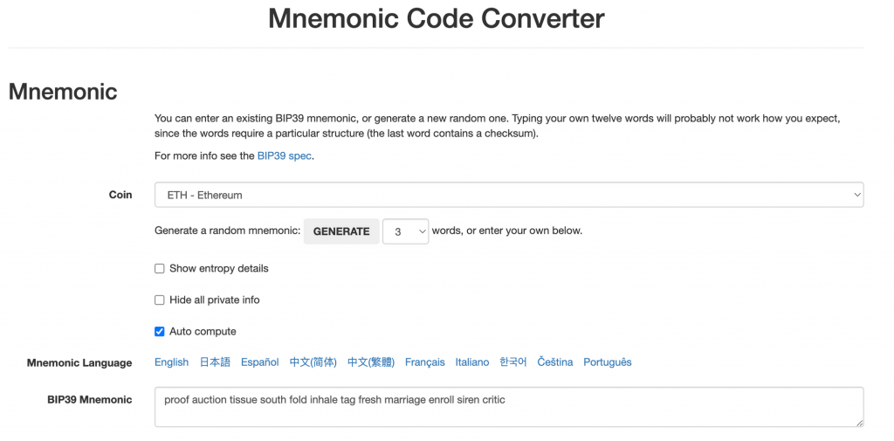

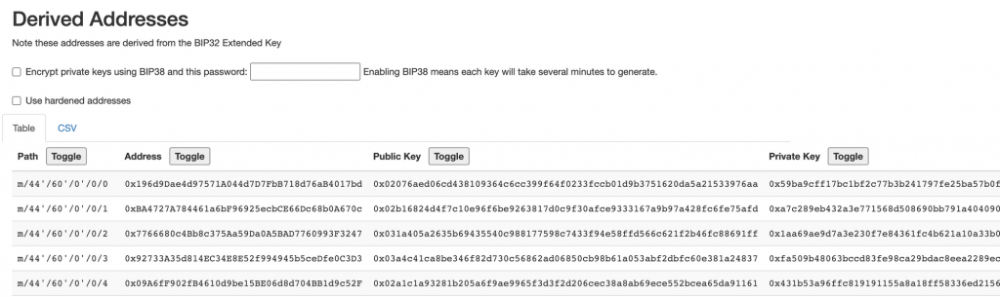

#### 4. 取得 Token Balance

有了錢包地址後下一步要來實作取得這個地址的所有 ERC-20 Token。在 Day 5 時我們實作了取得單一 Token 的 Balance 資訊，但要怎麼知道一個地址有哪些 ERC-20 Token 呢？所有資料一定都紀錄在區塊鏈上，但這個功能如果要自己實作整理鏈上資料的話會比較複雜，我會放到後面的 Web3 與進階後端的主題再講。

好消息是有一些區塊鏈的資料提供商已經幫我們做好區塊鏈地址持有 Token 的資料 indexing 了，比較有名的網站有 [Debank](https://debank.com/), [Zerion](https://zerion.io/) 以及 [Metamask Portfolio](https://portfolio.metamask.io)，都可以在上面輸入一個地址查詢這個地址有的 Token Balance。在 Etherscan 的 [Accounts 頁面](https://etherscan.io/accounts)可以找到一些以太坊上大戶的錢包，隨便拿一個地址 `0x4Ed97d6470f5121a8E02498eA37A50987DA0eEC0` 來測試這三個網站的結果：

* Debank: <https://debank.com/profile/0x4ed97d6470f5121a8e02498ea37a50987da0eec0>
  * Zerion: <https://app.zerion.io/0x4ed97d6470f5121a8e02498ea37a50987da0eec0/overview>
  * Metamask Portfolio: 需前往網站手動加入該錢包地址

以下是依序的呈現結果，可以看到他們呈現的結果不完全相同（這裡只先過濾出以太坊鏈的餘額，因為預設會顯示多鏈的 Token）：

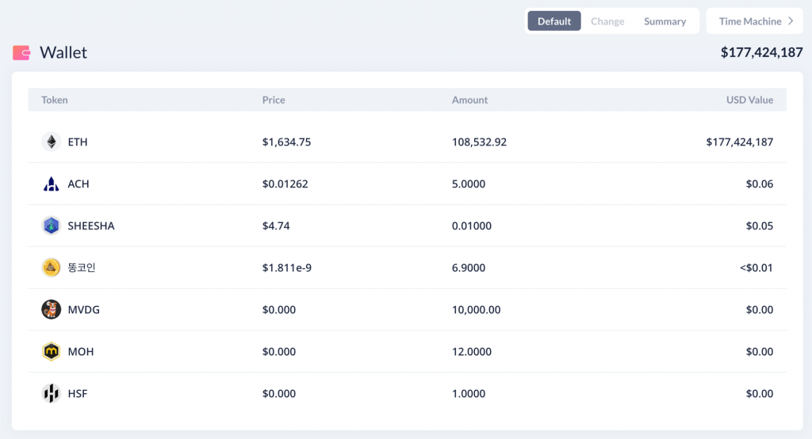

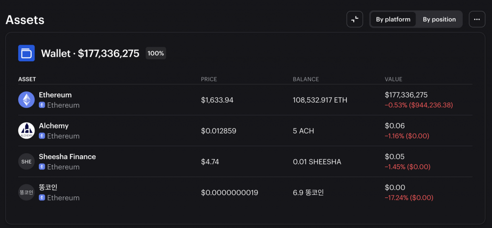

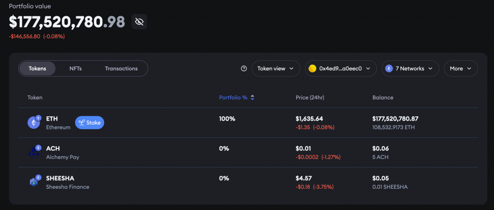

會有這些差異主要是因為不同服務在判斷一個 ERC-20 Token 是否有效的標準不同。因為區塊鏈上很常出現詐騙的 Token 以及合約，會透過偽造 Smart Contract Event 來誤導使用者或是誘導點擊進入釣魚網站，不同服務會實作自己過濾詐騙代幣的方式，因此是個複雜的議題。

接下來以下示範用 Metamask Portfolio 的 API 來實作取得地址的 Token Balance。這個 API 雖然不在公開文件中，但因為 Metamask Portfolio 網站打的 API 沒有做太多限制，可以簡單的從 Browser Network Tab 看到請求的細節。稍微找一下就可以找到請求的網址是 [`https://account.metafi.codefi.network/accounts/0x4ed97d6470f5121a8e02498ea37a50987da0eec0?chainId=1&includePrices=true`](https://account.metafi.codefi.network/accounts/0x4ed97d6470f5121a8e02498ea37a50987da0eec0?chainId=1&includePrices=true)

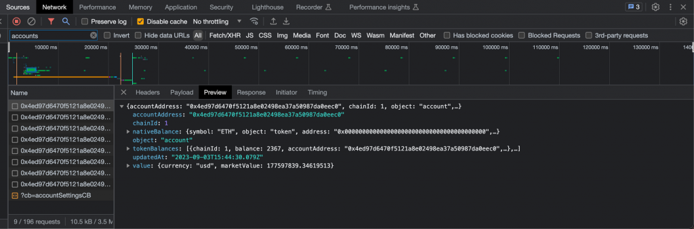

展開對應的欄位如 `nativeBalance`, `tokenBalances` 可以看到更多細節。因此就可以基於這個 API 來實作了：

[code]
    // balance.go
    package main

    import (
    	"fmt"
    	"log"

    	"github.com/go-resty/resty/v2"
    )

    type AccountPortfolioResp struct {
    	AccountAddress string         `json:"accountAddress"`
    	ChainID        int            `json:"chainId"`
    	NativeBalance  TokenBalance   `json:"nativeBalance"`
    	TokenBalances  []TokenBalance `json:"tokenBalances"`
    	Value          struct {
    		Currency    string  `json:"currency"`
    		MarketValue float64 `json:"marketValue"`
    	}
    }

    type TokenBalance struct {
    	Address     string  `json:"address"`
    	Name        string  `json:"name"`
    	Symbol      string  `json:"symbol"`
    	IconURL     string  `json:"iconUrl"`
    	CoingeckoID string  `json:"coingeckoId"`
    	Balance     float64 `json:"balance"`
    }

    func AccountPortfolio(address string) (*AccountPortfolioResp, error) {
    	respData := AccountPortfolioResp{}
    	_, err := resty.New().
    		SetBaseURL("https://account.metafi.codefi.network").R().
    		SetPathParam("address", address).
    		SetQueryParam("chainId", "1").
    		SetQueryParam("includePrices", "true").
    		SetHeader("Referer", "https://portfolio.metamask.io/").
    		SetResult(&respData).
    		Get("/accounts/{address}")

    	if err != nil {
    		return nil, err
    	}
    	return &respData, nil
    }

    func GetWalletBalance(address string) {
    	resp, err := AccountPortfolio(address)
    	if err != nil {
    		log.Fatal(err)
    	}
    	fmt.Printf("Account address: %s\n", resp.AccountAddress)
    	fmt.Printf("Chain ID: %d\n", resp.ChainID)
    	fmt.Printf("ETH balance: %f\n", resp.NativeBalance.Balance)
    	for _, token := range resp.TokenBalances {
    		fmt.Printf("Token balance of %s: %f\n", token.Name, token.Balance)
    	}
    }

[/code]

實作方式就是單純的打 API 拉資料後印出來。其實這個 API 裡面還有很多豐富的資料，由於篇幅關係沒有全部寫出來，讀者可以從 API response 細看還有哪些資料可以用。而要整理到那麼多完整的資料是有難度的，因為有些資料在區塊鏈上沒有（如代幣的價格、Icon URL、Coingecko ID 等等），就要想辦法跟鏈下的資料對應起來。而且不同的鏈資料來源可能不同，實作的複雜度就會體現在這邊。

一樣寫個測試用剛才找到的大戶地址來測 `GetWalletBalance` function：

[code]
    package main

    import (
    	"testing"

    	"github.com/stretchr/testify/assert"
    )

    func TestGetWalletBalance(t *testing.T) {
    	GetWalletBalance("0x4Ed97d6470f5121a8E02498eA37A50987DA0eEC0")
    	assert.True(t, true)
    }

[/code]

執行 `go test -v ./...` 後結果如下，這樣就有成功抓到這個地址的 ETH Balance 以及 Token Balance 了！只是其中一個 Token Name 是空字串，可能是因為 Metamask 在 index 資料時沒抓到。

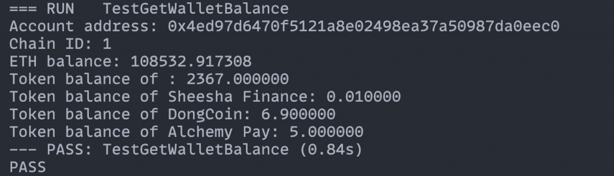

#### 5. 小結

今天帶大家了解在後端如何從註記詞產生錢包，以及如何拿到一個錢包地址的所有 ERC-20 Token Balance，完整程式碼在[這裡](https://github.com/a00012025/ironman-2023-web3-fullstack/tree/main/backend/day10)。其實 Debank 跟 Zerion 的 API 也可以拿到類似的結果，但欄位跟 Metamask API 也不完全相同。另外如果要拿一個錢包地址的所有 NFT（包含 ERC-721 及 ERC-1155）也已經有對應的 API 可以使用，像是 [Alchemy](https://docs.alchemy.com/reference/getnfts) 跟 [Quicknode](https://www.quicknode.com/docs/ethereum/qn_fetchNFTs_v2) 都有提供，實際的串接跟能取得什麼資料內容就留給讀者練習。明天就會進入到後端管理的錢包如何送出交易的實作。

## DAY 11｜Day 11 - Web3 與後端：簽名與發送交易

- 原文：https://ithelp.ithome.com.tw/articles/10323062
- 發佈時間：2023-09-20 02:38:16

### 章節內容

#### 1. 未分章內容

前一天我們完成在後端產生錢包註記詞、私鑰、讀取代幣餘額的實作，今天就會來實作簽名並發送交易的功能，才能完成在區塊鏈上的寫入，作為 Web3 與後端第一部分的結尾。為了產生完整的交易，除了 from address, to address, value 之外，還有像是 nonce, gas price, gas limit, chain ID 等等元素是不可或缺的，在前端的部分沒有講到是因為 wagmi 與 Metamask 已經幫我們處理好這些資料的計算，而在後端這些數值就需要自己算出來。

#### 2. 取得 Nonce

Nonce 的概念是對於一個固定的錢包地址來說，他發送的第一個交易 Nonce 就必須為 0，第二個 Nonce 為 1 以此類推，因此 Nonce 是嚴格遞增且不能被重複使用的。這個機制也是為了避免 replay attack。想像一下如果 A 簽名了一個轉移 1 ETH 給 B 的交易並廣播出去，如果這個交易的簽章還能重複使用的話，B 就能再廣播一次這個交易讓 A 多轉 1 ETH 給他。有的 Nonce 機制就可以確保 A 要送出的下一個交易的簽名一定跟之前交易的簽名不一樣（因為 Nonce 不一樣就會讓整個交易 hash 出來的結果不一樣）

以[我的地址](https://sepolia.etherscan.io/address/0x32e0556aec41a34c3002a264f4694193ebcf44f7)為例，如果拉到最早以前的交易紀錄，這四筆交易從下往上的 Nonce 分別是 200334, 0, 1, 2，最下面那筆的 Nonce 值很大因為這是水龍頭轉 ETH 給我的交易，代表這個水龍頭地址已經發出超過 20 萬筆交易。再來三筆是我做的前三個操作，因此 Nonce 分別是 0, 1, 2。

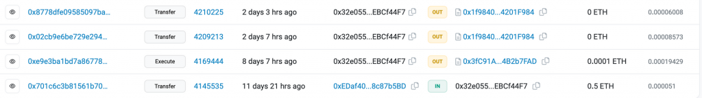

至於要怎麼從鏈上取得一個錢包地址的 Nonce 呢？可以使用 go-ethereum 中的 [`github.com/ethereum/go-ethereum/ethclient`](http://github.com/ethereum/go-ethereum/ethclient) 來連到一個以太坊的 JSON RPC node，並透過 `PendingNonceAt` function 來拿到下一筆交易應該要用什麼 Nonce。這裡的 JSON RPC 一樣使用前面註冊的 Alchemy 即可，並從環境變數載入 `ALCHEMY_API_KEY` 。

[code]
    // connect to json rpc node
    client, err := ethclient.Dial("https://eth-sepolia.g.alchemy.com/v2/" + os.Getenv("ALCHEMY_API_KEY"))
    if err != nil {
    	log.Fatal(err)
    }

    // get nonce
    nonce, err := client.PendingNonceAt(context.Background(), common.HexToAddress(account.Address.Hex()))
    if err != nil {
    	log.Fatal(err)
    }
    fmt.Printf("Got nonce: %d\n", nonce)

[/code]

#### 3. 取得 Gas Fee

在以太坊上執行任何交易、智能合約操作時，都需要支付一定的費用，這個費用被稱為 Gas Fee。在發送交易時，他是由 Gas Price 及 Gas 數量這兩個數值相乘算出來的。

在以太坊上進行任何操作時，這些操作其實是由底層的 [EVM code](https://www.evm.codes/) 所組成，這是以太坊中類似組合語言的存在。而每個操作都有他對應的 Gas 數量作為這個操作的費用，例如 ADD 指令（加法）花費 3 個 gas、MUL 指令（乘法）花費 5 個 gas。而一筆交易中會執行到的所有指令的 Gas 總合就是這筆交易需花費的 Gas 數量。例如一筆簡單的轉帳交易需要的 Gas 數量通常是 21000，複雜的智能合約操作就需要更多的 Gas。

Gas Price 指的是你願意為每單位的 Gas 支付多少金額，通常以 Gwei 來表示（Wei 是 ETH 的最小單位也就是 `10^-18 ETH`，因此 `10^9 Wei = 1 Gwei` ，`10^9 Gwei = 1 ETH`）。交易指定的 Gas Price 越高，交易確認的速度通常也越快，因為礦工更願意優先確認這筆交易以獲得更高的獎勵。

因此在發送交易時我們需要指定 Gas Limit 跟 Gas Price，Gas Limit 指的就是這筆交易最多只能使用多少個 Gas 單位，因此這樣就能算出一筆交易最多會花多少手續費。例如假設進行一個 Swap 交易要花 80,000 個 Gas，而當下以太坊的 Gas Price 為 20 Gwei，那就可以計算出這筆交易的手續費會是 `80000 * 20 * 10^-9 = 0.0016 ETH` ，再乘上當下 ETH 的價格 1629 USD 就可以算出大約要花 2.61 USD 的手續費。

若設定的 Gas Limit 太低，交易可能因為沒有足夠的 Gas 而失敗，但還是需要支付已經消耗的 Gas 費用（交易會上鏈但在 Etherscan 上會顯示交易失敗，而且 Gas Fee 照扣）。若 Gas Price 設定的太高可能會花不必要的錢，但太低又可能會讓交易要等很久才上鏈，因此正確設定 Gas 的參數非常重要。

在 `ethclient` 物件中可以使用`SuggestGasPrice`方法來查詢當前的 Gas Price，以及 `EstimateGas` 方法可以估算這筆交易大約會花多少 Gas，而有時為了確保交易成功會再基於這個值往上加一些 Gas。

[code]
    // get gas price
    gasPrice, err := client.SuggestGasPrice(context.Background())
    if err != nil {
    	log.Fatal(err)
    }
    fmt.Printf("Got gas price: %d\n", gasPrice)

    // estimate gas
    amountToSend := big.NewInt(1000000000000000) // 0.001 eth in wei
    estimateGas, err := client.EstimateGas(context.Background(), ethereum.CallMsg{
    	From:  common.HexToAddress(account.Address.Hex()),
    	To:    nil,
    	Value: amountToSend,
    	Data:  nil,
    })
    if err != nil {
    	log.Fatal(err)
    }
    fmt.Printf("Estimated gas: %d\n", estimateGas)

[/code]

#### 4. 取得 Chain ID

當我們說一條鏈是 EVM 相容時（例如以太坊主網、Sepolia 測試網、Polygon、Arbitrum 等鏈），代表像私鑰格式、地址、交易簽名方式、智能合約的程式碼等等執行層的機制都是跟以太坊幾乎一樣的（差異可能較多是在共識層也就是節點之間如何達成共識、挖礦機制等等），一個很大的好處是開發者可以在不同的鏈上都部署相同的智能合約，而不需要做任何修改，甚至部署的合約地址在各條 EVM 相容的鏈都可以一模一樣。

但為了確保交易的安全性（避免 replay attack），每條 EVM 相容的鏈需要有自己獨特的 Chain ID，才能用來在交易中區分不同的 EVM 鏈。而 Chain ID 的概念是在 [EIP-155](https://eips.ethereum.org/EIPS/eip-155) 中定義的，他讓交易的簽名計算中多包含了 Chain ID，這樣即使交易在以太坊主網上有效，它也不能被重放到其他鏈上，因為每個鏈的 Chain ID 都是獨特的。

[chainlist](https://chainlist.org/) 是一個知名的網站，上面列出了許多 EVM 相容的鏈，並提供了他們的節點 JSON-RPC 網址、Chain ID、區塊鏈瀏覽器（Explorer）連結等資訊。對於要新增 EVM 相容鏈到錢包 Extension 時是個很有用的工具。在裡面搜尋 Sepolia 並勾選 Include Testnets 就可以看到他對應的 Chain ID 是 11155111。

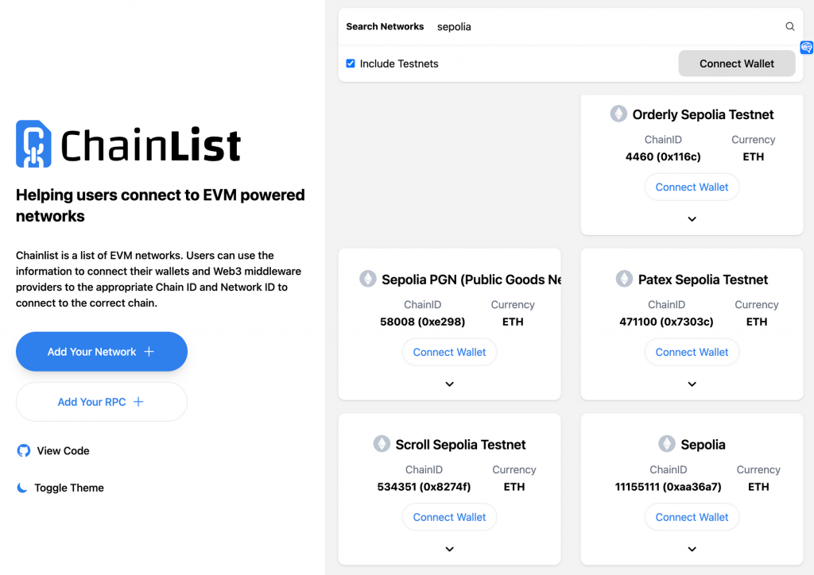

#### 5. 簽名與發送交易

接下來是組出交易並用私鑰簽名的過程，以下先考慮最單純的送出 ETH 給另一個地址的交易，簽名過的交易可以被廣播到區塊鏈上，就會有礦工負責將其包入新的區塊做確認。因此程式碼中主要分成四步：

1. **建立交易:** 根據前面取得的值設定交易參數，如目標地址、金額、Gas Limit 和 Gas Price
  2. **簽名交易:** 使用 `NewEIP155Signer` 簽名交易
  3. **廣播交易:** 將簽名的交易廣播到 Sepolia 鏈上。
  4. **等待交易確認:** 透過檢查該交易 hash 的 Transaction Receipt 來查詢交易是否已被確認。

[code]
    // create transaction
    tx := types.NewTransaction(
    	nonce,
    	common.HexToAddress("0xE2Dc3214f7096a94077E71A3E218243E289F1067"),
    	amountToSend,
    	estimateGas,
    	gasPrice,
    	[]byte{},
    )
    chainID := big.NewInt(11155111)
    signedTx, err := types.SignTx(tx, types.NewEIP155Signer(chainID), privateKey)
    if err != nil {
    	log.Fatal(err)
    }

    // broadcast transaction
    err = client.SendTransaction(context.Background(), signedTx)
    if err != nil {
    	log.Fatal(err)
    }
    fmt.Printf("tx sent: %s\n", signedTx.Hash().Hex())

    // wait until transaction is confirmed
    var receipt *types.Receipt
    for {
    	receipt, err = client.TransactionReceipt(context.Background(), signedTx.Hash())
    	if err != nil {
    		fmt.Println("tx is not confirmed yet")
    		time.Sleep(5 * time.Second)
    	}
    	if receipt != nil {
    		break
    	}
    }
    // Status = 1 if transaction succeeded
    fmt.Printf("tx is confirmed: %v. Block number: %v\n", receipt.Status, receipt.BlockNumber)

[/code]

在用 `types.NewTransaction` 建立交易時，data 的欄位先給他空陣列，未來會再講到更複雜的交易要如何組出 data。有了這些程式碼後，再記得用 `export ALCHEMY_API_KEY=xxx` 來設定環境變數，以及加上註記詞的輸入機制來指定錢包，就可以成功發出交易了！

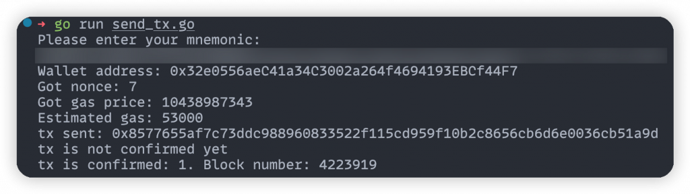

到 Sepolia Etherscan 上查看，可以確實看到這筆交易被包含在第 4223919 個區塊中： <https://sepolia.etherscan.io/tx/0x8577655af7c73ddc988960833522f115cd959f10b2c8656cb6d6e0036cb51a9d>

#### 6. 小結

今天我們已經釐清發送一個交易到以太坊上所需知道的細節，計算出所有需要的值並成功發送交易、等待上鏈，完整的程式碼在[這裡](https://github.com/a00012025/ironman-2023-web3-fullstack/tree/main/backend/day11)。第一部分後端與 Web3 的介紹就先告一段落，未來的內容會再介紹要如何發出更複雜的交易。明天開始會進入到 Web3 與 App 端的開發相關技術，也預告一下會介紹 EVM 以外的鏈如何產生錢包與簽名，畢竟除了 EVM 鏈以外還是有很多常用的鏈。

## DAY 12｜Day 12 - Web 3 與 App：創多鏈錢包與發送交易

- 原文：https://ithelp.ithome.com.tw/articles/10324026
- 發佈時間：2023-09-21 09:56:25

### 章節內容

#### 1. 未分章內容

今天我們正式進入到 Web3 與 App 開發的主題，使用的框架/語言是 Flutter/Dart，對於 Flutter 及 Dart 不熟悉的讀者可以先參考官方的介紹與教學：https://flutter.dev/ 。接下來會跳過初始化一個 Flutter App 的過程，直接進入錢包相關功能的實作。今天的目標是做到多鏈錢包的管理，包含 Bitcoin, Ethereum, Tron 的多鏈錢包，以及在這些鏈上如何發出交易。之前的內容較專注在 Ethereum 鏈的機制，因此也會稍微介紹 Bitcoin, Tron 與 Ethereum的不同。

#### 2. 創建錢包

要實作 Bitcoin, Ethereum, Tron 的多鏈錢包，最方便的作法還是使用 HD Wallet，因為這樣使用者只要記一個註記詞，就能用他計算出 Bitcoin, Ethereum, Tron 鏈的錢包（不熟悉的讀者可以回去看 Day 10 的內容），而且每條鏈還能產生多個錢包，可以說光一個註記詞就能儲存一個人在任何區塊鏈上的資產了（只要任何新的公鏈都選擇好在 BIP-44 標準中要用什麼 Coin Type 即可）

可以安裝 [bip39](https://pub.dev/packages/bip39) 跟 [flutter_bitcoin](https://pub.dev/packages/flutter_bitcoin) 套件來透過註記詞產生 HD Wallet，並按照 [BIP-44 標準](https://github.com/satoshilabs/slips/blob/master/slip-0044.md)查到 Bitcoin, Ethereum, Tron 各自對應的 Coin Type 為 0, 60, 195，因此就可以 Derive 出對應的公私鑰：

[code]
    import 'package:bip39/bip39.dart' as bip39;
    import 'package:flutter_bitcoin/flutter_bitcoin.dart';

    final mnemonic = bip39.generateMnemonic(strength: 128);
    final seed = bip39.mnemonicToSeed(mnemonic);
    final hdWallet = HDWallet.fromSeed(seed);
    btcWallet = hdWallet.derivePath("m/44'/0'/0'/0/0");
    ethWallet = hdWallet.derivePath("m/44'/60'/0'/0/0");
    tronWallet = hdWallet.derivePath("m/44'/195'/0'/0/0");

[/code]

這時 `btcWallet`, `ethWallet`, `tronWallet` 都是 `HDWallet` 這個 class 的物件，裡面儲存這個錢包的公鑰跟私鑰，但要計算出錢包地址的話還需要做一些轉換，因為公鑰跟私鑰都只是長度 256 bits 的 hex 字串。前面 HD Wallet 使用的套件是 `flutter_bitcoin` ，預設他就有個 `address` 欄位可以拿到 Bitcoin 的地址：

[code]
    final btcAddress = btcWallet.address;

[/code]

再來是 Ethereum 的地址，[web3dart](https://pub.dev/packages/web3dart) 是方便我們產生與管理 Ethereum 錢包、跟區塊鏈互動、發送交易的套件，裡面也提供了從 private key 轉成以太坊地址的 function：

[code]
    import 'package:web3dart/web3dart.dart';

    final ethPriKey = EthPrivateKey.fromHex(ethWallet.privKey!);
    final ethAddress = ethPriKey.address.hex;

[/code]

至於 Tron 則可以使用 [wallet](https://pub.dev/packages/wallet) 套件來作轉換：

[code]
    import 'package:wallet/wallet.dart' as wallet;

    final tronPrivateKey =
        wallet.PrivateKey(BigInt.parse(tronWallet.privKey!, radix: 16));
    final tronPubKey = wallet.tron.createPublicKey(tronPrivateKey);
    tronAddress = wallet.tron.createAddress(tronPubKey);

[/code]

結果如下：

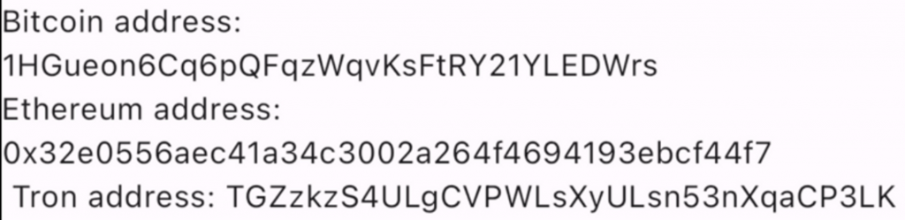

這三條鏈從 private key 轉成地址的定義都不一樣：

* Bitcoin 會先對公鑰做 SHA256 hash 再做 RIPEMD160 hash，在前後加入一些版本與 checksum 資訊後用 Base58 編碼得出
  * Ethereum 是取公鑰做 keccak256 hash 後拿最後 20 bytes 作為地址
  * Tron 則是先對公鑰經過跟 Bitcoin 一樣的 hash 方式（SHA256, RIPEMD160），但最後用的是 [Base58Check](https://en.bitcoin.it/wiki/Base58Check_encoding) 編碼方式

因為生成方式不同，Bitcoin 地址通常會以 1 或 3 開頭（在一些比較新的地址版本如 SegWit 或 Taproot 可能會是 bc1 開頭），而 Tron 則是 T 開頭，這樣也有個好處是看到地址就能大致知道是什麼鏈的地址。

#### 3. 交易簽名

有了私鑰與地址後就可以來實作交易簽名與送出。Ethereum 的作法大家應該已經熟悉，指定好 from address, to address, value（要送出多少 ETH）, chain ID 後用 web3dart 提供的 `signTransaction()` ，會自動從鏈上查詢當下的 gas price, gas limit, nonce 等資訊，簽名完後就可以使用 `sendRawTransaction()` 送出交易：

[code]
    const alchemyApiKey = '...';
    final web3Client = Web3Client('https://eth-sepolia.g.alchemy.com/v2/${alchemyApiKey}', Client());

    Future<String> signTransaction({
      required EthPrivateKey privateKey,
      required Transaction transaction,
    }) async {
      try {
        final result = await web3Client.signTransaction(
          privateKey,
          transaction,
          chainId: 11155111,
        );
        return HEX.encode(result);
      } catch (e) {
        rethrow;
      }
    }

    // sign and send transaction
    final ethPriKey = EthPrivateKey.fromHex(ethWallet.privKey!);
    final tx = await signTransaction(
      privateKey: ethPriKey,
      transaction: Transaction(
        from: ethPriKey.address,
        to: EthereumAddress.fromHex("0xE2Dc3214f7096a94077E71A3E218243E289F1067"),
        value: EtherAmount.fromBase10String(EtherUnit.gwei, "10000"),
      ),
    );
    final txHash =
        await web3Client.sendRawTransaction(Uint8List.fromList(HEX.decode(tx)));
    print(txHash);

[/code]

前面一樣要先建立跟 RPC node（也就是 Alchemy）的連線才能從鏈上查詢當下的資料，整體程式碼應該算好理解。

再來由於 Tron 的簽名與發送交易在 Dart 中還沒有好用的 library，這裡先只介紹比特幣的交易簽名機制。對 Tron 交易機制有興趣的讀者可以參考官方的 JS Library 中的作法：https://developers.tron.network/v3.7/docs/tronweb-transaction-builder

Bitcoin 的設計方式跟 Ethereum 不太一樣，在 Ethereum 中是使用「帳戶模型」，意思是每個地址都是一個帳戶，區塊鏈中直接紀錄了每個帳戶的 ETH 餘額，並且每個帳戶都對應一個 Nonce 代表他已經發送過幾個交易。

但 Bitcoin 中是使用「UTXO 模型」，也就是 Unspent Transaction Output （未花費的交易輸出）的簡稱，例如 B 曾經轉給 A 一個 BTC、C 曾經轉給 A 兩個 BTC，這時區塊鏈上會紀錄 A 有兩個 Unspent Transaction Output：1 BTC 跟 2 BTC，用這些 UTXO 的總和可以算出 A 的餘額有 3 BTC。

假設接下來 A 要送出 2.5 BTC 給 D，那麼這個交易的結構會長得像這樣：

[code]
    Inputs:
    - 1 BTC from B
    - 2 BTC from C

    Outputs:
    - 2.5 BTC to D
    - 0.5 BTC to A

[/code]

這邊忽略了礦工費，所以實際 A 剩餘的 BTC 數量會少於 0.5。所以 A 其實是拿他過去的兩個 UTXO 來組合出 2.5 BTC 的 output 送給 D，再把找的零錢（0.5 BTC）給自己，來完成這筆 UTXO 交易。因此一個 Bitcoin 的交易可以有任意多個 inputs / outputs，而越多 inputs / outputs 也就需要越高的 gas fee。Bitcoin 是用 Satoshi per Byte 乘上 Transaction Bytes 來算出最終的礦工費（Satoshi 是比特幣的最小單位，1 Bitcoin = 10^8 Satoshi），可以各自想像成 Ethereum 中的 Gas Price 以及 Gas Limit，詳細可以參考官方的解說：https://en.bitcoinwiki.org/wiki/Transaction_commission

有了這些概念後，就可以來看範例的 Bitcoin 交易簽名如何實作：

[code]
    String sampleBitcoinTx(HDWallet btcWallet) {
      final txb = TransactionBuilder();
      txb.setVersion(1);
      // previous transaction output, has 15000 satoshis
      txb.addInput(
          '61d520ccb74288c96bc1a2b20ea1c0d5a704776dd0164a396efec3ea7040349d', 0);
      // (in)15000 - (out)12000 = (fee)3000, this is the miner fee
      txb.addOutput('1cMh228HTCiwS8ZsaakH8A8wze1JR5ZsP', 12000);
      txb.sign(vin: 0, keyPair: ECPair.fromWIF(btcWallet.wif!));
      return txb.build().toHex();
    }

[/code]

只要使用 `flutter_bitcoin` 套件提供的 `TransactionBuilder()` 並加上對應的 inputs, outputs 即可。但以上的程式碼還不夠完整，因為有個問題是要如何知道當下地址有哪些 UTXO 來作為 inputs？這個就需要使用第三方的 API 來查詢了，像 [QuickNode](https://www.quicknode.com/) 跟 [Blockchair](https://blockchair.com/) 等服務都有提供，完整實作就不在這裡展開。

#### 4. 完整應用

有了以上程式碼就可以來完成一個簡單的應用：輸入註記詞後產生對應的 Bitcoin, Ethereum, Tron 地址、簽名出 Bitcoin, Ethereum 的交易，以及送出 Ethereum 的交易。這裡沒有示範送出 Bitcoin 的交易是因為還需要領取測試網上的幣，讀者可以自行嘗試。以下是這個應用送出 Ethereum 交易後的樣子：

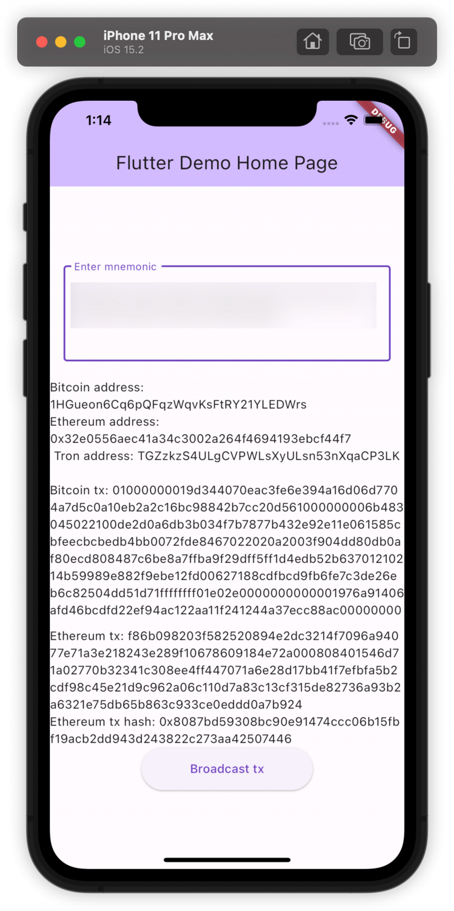

#### 5. 小結

今天我們稍微介紹了 Bitcoin, Tron 與 Ethereum 的差別，包含地址與交易的生成方式，並使用 Dart 來實作他們。完整的 Flutter 應用在[這裡](https://github.com/a00012025/ironman-2023-web3-fullstack/tree/main/mobile/day12)，有安裝好 Flutter 以及 Android/iOS 模擬器的讀者可以使用以下指令把他跑起來：

[code]
    flutter pub get
    flutter run

[/code]

今天的知識已經足以在 Flutter 中實作一個基本的多鏈錢包了，而且只要修改 HD Wallet 的 Derive Path 參數的最後一個數字，就能產生一條鏈上的多個錢包。接下來我們會介紹 Flutter 中如何發送 Token Transfer 的交易，以及 Gas Fee 的進階設定方式：EIP 1559。

## DAY 13｜Day 13 - Web 3 與 App：代幣轉移、Call Data 與 EIP-1559

- 原文：https://ithelp.ithome.com.tw/articles/10324716
- 發佈時間：2023-09-22 01:02:38

### 章節內容

#### 1. 未分章內容

昨天我們完成了在 Flutter 中的多鏈錢包生成與交易簽名，今天會來實作 Ethereum 中的 ERC-20 Token Transfer 以及介紹交易中的 Call Data 是如何運作的，以及在進階的交易中會使用到的 Gas Fee 設定方式：EIP-1559。

#### 2. 代幣餘額與轉移

在取得代幣餘額跟轉移代幣的操作，概念上跟 day 5 前端的實作很像。在前面的內容已經解釋過這兩個的概念，這段主要是讓讀者理解套件的應用方式，因此會直接給出程式碼。首先需要 ERC-20 的 ABI，以下只列出我們會用到的 function：

[code]
    const abi = [
      {
        "inputs": [
          {"internalType": "address", "name": "account", "type": "address"}
        ],
        "name": "balanceOf",
        "outputs": [
          {"internalType": "uint256", "name": "", "type": "uint256"}
        ],
        "stateMutability": "view",
        "type": "function"
      },
      {
        "inputs": [],
        "name": "decimals",
        "outputs": [
          {"internalType": "uint8", "name": "", "type": "uint8"}
        ],
        "stateMutability": "view",
        "type": "function"
      },
      {
        "inputs": [
          {"internalType": "address", "name": "recipient", "type": "address"},
          {"internalType": "uint256", "name": "amount", "type": "uint256"}
        ],
        "name": "transfer",
        "outputs": [
          {"internalType": "bool", "name": "", "type": "bool"}
        ],
        "stateMutability": "nonpayable",
        "type": "function"
      },
    ];

[/code]

於是就可以使用 web3dart 提供的 `DeployedContract` 來呼叫 `balanceOf` 以及 `decimals`，並計算 raw token balance 除以 10 的 decimals 次方後的結果：

[code]
    Future<double> readTokenBalance(
        String contractAddress, String walletAddress) async {
      try {
        final contract = DeployedContract(
          ContractAbi.fromJson(jsonEncode(abi), 'ERC20'),
          EthereumAddress.fromHex(contractAddress),
        );
        final balanceFunction = contract.function('balanceOf');
        final balance = await web3Client.call(
          contract: contract,
          function: balanceFunction,
          params: [EthereumAddress.fromHex(walletAddress)],
        );
        final rawBalance = BigInt.parse(balance.first.toString());
        final decimanls = await web3Client.call(
          contract: contract,
          function: contract.function('decimals'),
          params: [],
        );
        final decimals = int.parse(decimanls.first.toString());
        return rawBalance / BigInt.from(10).pow(decimals);
      } catch (e) {
        rethrow;
      }
    }

[/code]

可以看到 `DeployedContract` 提供了取得單一 Contract function 並呼叫他的方法，只要依序在 `call` 中帶入對應的 Contract function 跟參數的 array，就能簡單的呼叫任何智能合約的方法。

再來是 Send Token 的實作，可以使用 `Transaction.callContract` 搭配 `parameters` 來產生任何智能合約寫入的 Transaction，再搭配昨天實作的 `signTransaction` 及 `sendRawTransaction` 就能把 Send Token 的交易送出：

[code]
    Future<String> sendTokenTransaction({
      required EthPrivateKey privateKey,
      required String contractAddress,
      required String toAddress,
      required BigInt amount,
    }) async {
      try {
        final contract = DeployedContract(
          ContractAbi.fromJson(jsonEncode(abi), 'ERC20'),
          EthereumAddress.fromHex(contractAddress),
        );
        final transferFunction = contract.function('transfer');
        final transferTx = Transaction.callContract(
          contract: contract,
          function: transferFunction,
          parameters: [EthereumAddress.fromHex(toAddress), amount],
        );
        final tx = await signTransaction(
          privateKey: privateKey,
          transaction: transferTx,
        );
        final txHash = await sendRawTransaction(tx);
        return txHash;
      } catch (e) {
        rethrow;
      }
    }

[/code]

#### 3. Calldata

送出交易後可以在鏈上看到已經確認的交易。那麼這個 Transfer Token 的交易是如何在區塊鏈上被表示的呢？這就要講到 Call Data 的概念。以[我的交易](https://sepolia.etherscan.io/tx/0x1d56a55bfc9b0ac0250832ba7aa6442dc64614deda308973d11d35a3ab7d3cad)為例，往下滑點擊 Show More 後可以看到 Input Data 這個區域：

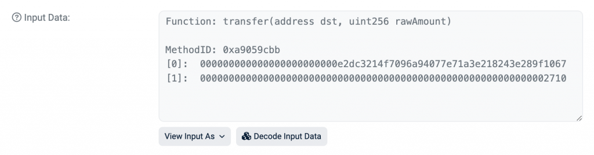

這其實就是發出一個交易時的 `data` 欄位會帶入的值，也就是交易的 Call Data。如果點擊 View Input As 選擇 Original 的話，可以看到以下的內容：

[code]
    0xa9059cbb000000000000000000000000e2dc3214f7096a94077e71a3e218243e289f10670000000000000000000000000000000000000000000000000000000000002710

[/code]

這個就是 Ethereum 的交易中帶入的 Call Data 最原始的樣子，它包含了這筆交易要呼叫智能合約上的哪個 function、用什麼參數呼叫的資訊。以這個例子來說他主要分成三部分：

[code]
    0xa9059cbb -> Signature
    000000000000000000000000e2dc3214f7096a94077e71a3e218243e289f1067 -> dst
    0000000000000000000000000000000000000000000000000000000000002710 -> amount

[/code]

前 4 個 bytes 是 function signature，用來指定要呼叫哪個 function，而這是透過計算 `keccak256(”transfer(address,uint256)”)` 並取前 4 個 bytes 得到的，讀者可以到[這個網站](https://emn178.github.io/online-tools/keccak_256.html)驗證計算結果。這個計算方式的好處是只要 function name 跟輸入參數的順序/型別有不一樣，就會算出不一樣的 function signature，就可以用來區分一個智能合約中的不同 function（當然也有少部分情況會有 hash collision 的問題，解法涉及智能合約底層的機制，就不在這邊展開）。

再來 Call Data 中會依序 encode 每個參數的值，所以接下來的 32 bytes 就會對應到 `transfer(address,uint256)` function 中的第一個參數 `dst`，也就是 Token 要被轉到哪個地址上。在接下來的 32 bytes 就對應到第二個參數 `rawAmount`，也就是要轉多少 Token 出去。所以其實 web3dart 或 wagmi 這些 package 就是有幫開發者把比較 high level 的 function 呼叫方式轉換成智能合約看得懂的 Call Data，就不用自己寫 hex 字串的操作了。

另外也有一些線上工具可以方便的把 function name 加上參數 encode 成最終的 call data 結果，甚至也可以把 call data 做反向解析轉換出 function name 跟參數。由於 call data 中的前四個 bytes 是把 function signature hash 的結果，這種服務通常會維護一個常見的 function signature 以及前四個 bytes 之間的對應，這樣看到前 4 個 bytes 就能高機率的猜到他對應的 function signature 是什麼。相關的工具可以使用 [Openchain](https://openchain.xyz/) 的 [ABI Encode/Decode](https://openchain.xyz/tools/abi) 工具，例如試著把上面的 Call Data 輸入進去他就能猜到是 transfer function 的 call data 並解析出對應的參數：

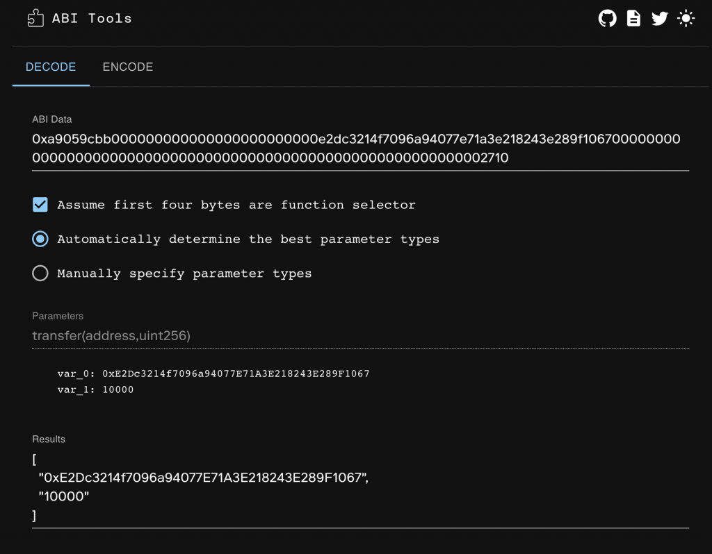

#### 4. EIP-1559

接下來要介紹進階的 Gas Fee 設定選項：[EIP-1559](https://eips.ethereum.org/EIPS/eip-1559)。他的由來是因為過去以太坊網路的 Gas Fee 是比較難預估的，例如前一個 block 的 gas fee 如果是 50 gwei，下一個 block 可能變高到 80 gwei，但這樣按照上一個 block 的 gas fee 去估計交易要設定的 gas fee 時，可能會估出太低的 gas fee，導致這筆交易被卡在鏈上沒辦法成功被礦工打包（因為礦工一定都是從 gas fee 高的交易打包才有更高的利潤）。

因此在 2021 年的倫敦硬分叉（London Hard Fork），EIP-1559 這個升級提案正式被部署到以太坊主網，來解決以上 Gas Fee 的問題。他把原本交易中的 Gas Price 拆成以下兩個費用的總和：

* **基本費用（Base Fee）** : 是由協議自動在每個 block 調整的費用，它會根據網路的壅塞情況來變化，如果上一個 block 被塞得比較滿（大於 50%），下一個 block 的 Base Fee 就會增加。而如果區塊沒有被充分利用，Base Fee 就會減少。
  * **優先費用（Priority Fee）** : 代表用戶為了讓礦工優先處理他的交易而支付的額外費用。

因此當 Base Fee 的計算方式固定下來後，發送交易時就更能預測接下來的 Gas Fee 可能會如何變化，也提供更高的 Gas Fee 設定彈性。

另一個 EIP-1559 帶來的影響是：由於手續費中的 Base Fee 會被銷毀（或是說被「燒掉」），礦工只會拿到 Priority Fee 的部分，這讓 ETH 這個幣的總供應量有機會持續下降，因為當越多人在以太坊上發交易時，Base Fee 就會越高並促進更多的 ETH 被燒掉，就會產生通貨緊縮的效果。不過對礦工來說的收益就會降低，畢竟他們原本能拿到完整的 Gas Fee 但現在只能拿到 Priority Fee，因此當時也有部分礦工反對這個提議。

要查看當前 Ethereum 網路的 Base Fee 以及 Priority Fee，可以到 Etherscan 的 [Gas Tracker](https://etherscan.io/gastracker) 頁面：

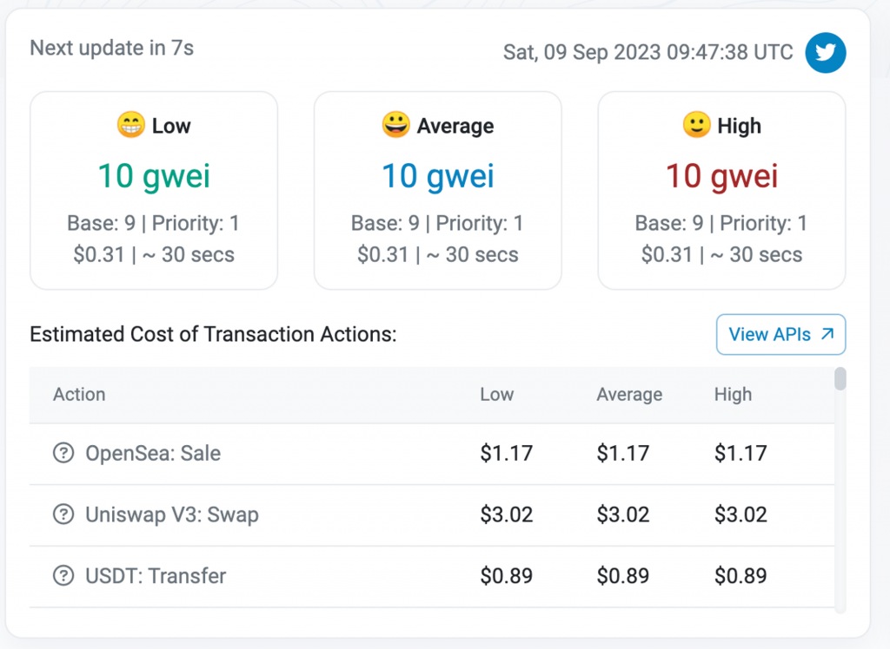

Gas Tracker 會顯示快中慢三個選項的設定，因為如果想要越快讓交易確認，就需要付越高的 priority fee，所以一般錢包應用在發送交易時也會提供不同 Gas Fee 的選項讓使用者選擇。

#### 5. EIP-1559 實作

進到 Flutter 中的實作，EIP-1559 所需的兩個參數就會對應到 `Transaction.callContract` 中的 `maxFeePerGas` 跟 `maxPriorityFeePerGas`，前者代表這筆交易使用的 Gas Fee 上限（也就是 base fee + priority fee），後者代表最多願意出多少 Priority Fee。 Base Fee 的估計可以使用 `web3dart` 中已有的 `getGasPrice()` 來取得，但 `maxPriorityFeePerGas` 就沒有可以直接使用的 function，這是因為 `web3dart` 提供了比較 general 的面向 EVM 鏈都能使用的 Web3 Client，而並不是所有 EVM 鏈都支援 EIP-1559 的 Gas Fee 設定方式，因此沒有提供這個介面，需要我們自己打 Alchemy 的 [eth_maxPriorityFeePerGas API](https://docs.alchemy.com/reference/eth-maxpriorityfeepergas) 來實作：

[code]
    Future<EtherAmount> getMaxPriorityFee() async {
      try {
        final rpcUrl = 'https://eth-sepolia.g.alchemy.com/v2/${alchemyApiKey}';
        final response = await post(
          Uri.parse(rpcUrl),
          body: jsonEncode({
            "jsonrpc": "2.0",
            "method": "eth_maxPriorityFeePerGas",
            "params": [],
            "id": 1,
          }),
        );
        final json = jsonDecode(response.body);
        final result = json['result'];
        return EtherAmount.fromBigInt(EtherUnit.wei, BigInt.parse(result));
      } catch (e) {
        rethrow;
      }
    }

    // get transaction
    final transferTx = Transaction.callContract(
      contract: contract,
      function: transferFunction,
      parameters: [EthereumAddress.fromHex(toAddress), amount],
      maxFeePerGas: await web3Client.getGasPrice(),
      maxPriorityFeePerGas: await getMaxPriorityFee(),
    );

[/code]

另外在簽名交易時，如果是 EIP-1559 的交易，還需要在簽出來的交易前面補上 0x02，代表是新版的交易（這是由 [EIP-2718](https://eips.ethereum.org/EIPS/eip-2718) 定義的）

[code]
    Future<String> signTransaction({
      required EthPrivateKey privateKey,
      required Transaction transaction,
    }) async {
      try {
        var result = await web3Client.signTransaction(
          privateKey,
          transaction,
          chainId: 11155111,
        );
        if (transaction.isEIP1559) {
          result = prependTransactionType(0x02, result);
        }
        return HEX.encode(result);
      } catch (e) {
        rethrow;
      }
    }

[/code]

其他的程式碼都沒變。讀者可能會注意到 `callContract` 其實還有一個參數是 `gasPrice` ，如果單獨使用 `gasPrice` 參數的話預設就會送出非 EIP-1559 (legacy type) 的交易，不過因為這個升級是向後相容的，所以 legacy 類型的交易也還是能正常送出。

#### 6. 完整應用

基於昨天的產生錢包與地址的實作加上以上程式碼，就可以完成顯示 UNI Token Balance 以及發送 EIP-1559 的 Token Transfer 交易的簡單應用了！

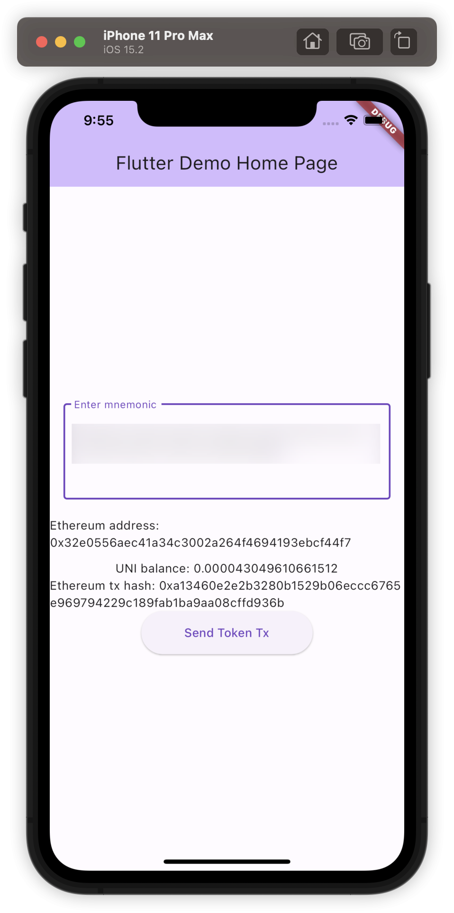

成功發出後的 Transaction 在[這裡](https://sepolia.etherscan.io/tx/0xa13460e2e2b3280b1529b06eccc6765e969794229c189fab1ba9aa08cffd936b)，如果點 Show more 就可以看到這筆交易的確有指定到 EIP-1559 的 Max Fee 以及 Max Priority Fee

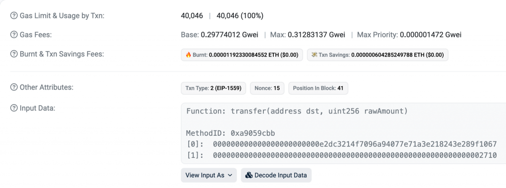

值得注意的是底下還有兩欄 Burnt Fee 跟 Txn Savings，前者指的是這筆交易燒掉了多少 ETH（也就是 ETH 的供應量減少），他的值會是 Base Fee 乘上 Gas Limit。至於 Transaction Savings 指的是 EIP-1559 這個交易類型為使用者省下了多少 Gas Fee，因為如果不指定 Max Priority Fee 只有指定 Max Fee（0.3128 Gwei），那礦工一定會想把 Max Fee 扣掉 Base Fee 的數量作為礦工獎勵取走，大約是 0.3128 - 0.2977 = 0.0151 Gwei。但因為我們指定了 Max Priority Fee = 1472 wei，所以礦工只能拿走 1472 wei（per gas），這樣就可以算出 EIP-1559 為我省下了 (0.3128 - 0.2977 - 0.000001472) * 40046 這麼多的 Gas Fee，也就剛好等於畫面上 Transaction Savings 的值。

#### 7. 小結

今天我們介紹了如何在 Flutter 上對區塊鏈讀寫，以及講解 call data、EIP-1559 的機制，並把他應用在發送 Token Transfer 的交易，完整的程式碼在[這裡](https://github.com/a00012025/ironman-2023-web3-fullstack/tree/main/mobile/day13)。一般錢包 App 在發送交易時會提供快中慢的三個選項讓使用者選擇，這可以從 Etherscan 的 [Gas Oracle API](https://docs.etherscan.io/api-endpoints/gas-tracker#get-gas-oracle) 拿到像這樣的資料，因篇幅關係就不在這裡實作。

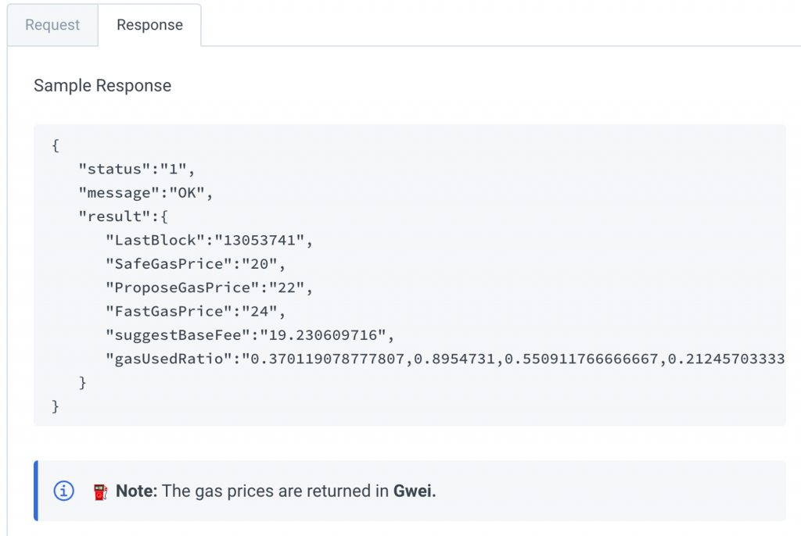

另外如果想深入了解快中慢的 Gas Fee 是如何計算出來的，可以參考 Alchemy 關於 [Gas Fee Estimator 的文章](https://docs.alchemy.com/docs/how-to-build-a-gas-fee-estimator-using-eip-1559)。這樣我們已經學會如何在 Flutter 中送出任意 EVM 的交易了，明天會來介紹一個有趣的 DApp 應用也就是 ENS (Ethereum Name Service)，來探索除了 Token Swap 之外區塊鏈上還能有怎樣的 DApp。

## DAY 14｜Day 14 - Web 3 與 App：ENS 域名與反向查詢

- 原文：https://ithelp.ithome.com.tw/articles/10325709
- 發佈時間：2023-09-23 11:37:33

### 章節內容

#### 1. 未分章內容

今天要來介紹一個 Ethereum 上有趣的 DApp：ENS，以及如何使用 Dart 去查詢 ENS 相關的資料，也就是 Domain name 跟地址之間的轉換，並且為了取得完整資料會介紹 The Graph 這個區塊鏈資料的 Protocol。

#### 2. ENS 介紹

ENS 的全名是 Ethereum Name Service，他主要的目的是讓以太坊的使用者可以不用記憶複雜的以太坊地址（也就是長度 40 的 hex 字串），而只要記得好懂的名稱就好，像是 `yourname.eth`, `nike.eth` 等等，這就類似 DNS 可以讓人們不用記得 IP 而只要記 [google.com](http://google.com) 這樣的域名。因此 ENS 設計了一套機制把 `.eth` 結尾的這種 domain name 轉換成以太坊地址，任何人都可以去註冊新的域名來對應到自己的地址。

讀者可以直接到 [ENS 的官網](https://ens.domains/)來註冊一個屬於自己的 domain name，價格跟 Web 2 的 DNS 比起來算是便宜的（不過越短的 domain name 越貴），例如下面這個未被註冊的 domain 如果註冊十年的話要花 0.037 ETH，大約是 60 USD。

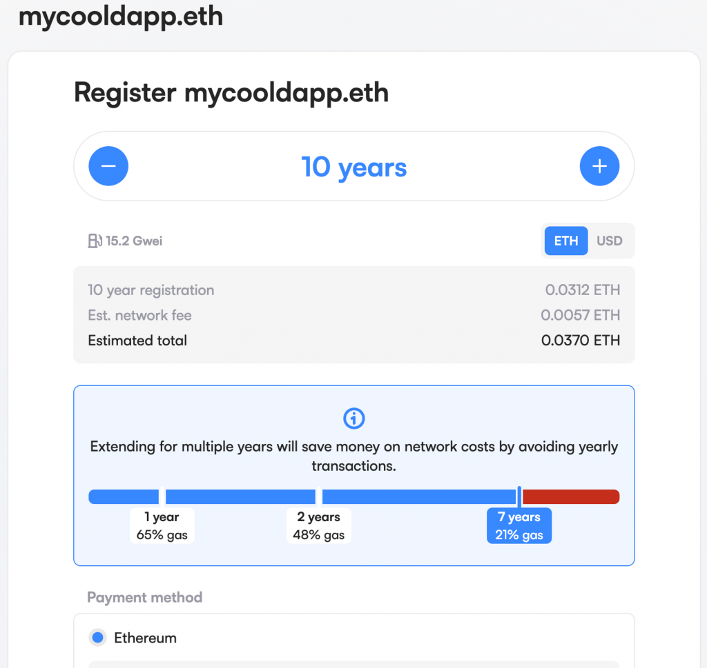

特別的是 ENS 把每個域名都變成了一個 NFT，這樣就自動讓域名可以在像 Opensea 這樣的 NFT 二手市場上交易（對應的 [Opensea Collection](https://opensea.io/collection/ens)），這就消除了在 Web 2 的域名交易成本太高的問題。因此如果在二手市場有看到自己喜歡的 domain name，直接購買後也會成為自己的 domain。

#### 3. 正向與反向解析

在 ENS 的機制中，會把從 domain name 轉換成地址的過程稱為正向的解析（Domain name resolution），因為這就是註冊這個 domain 的目的。而在註冊 domain 後他會問你是否要將這個 domain name 設成自己的 Reverse Lookup Domain Name，這是因為一個地址可以有多個 domain name，所以 Reverse Lookup 代表設定從地址轉成預設的 domain name 的機制，一個地址也就只會對應到一個 Reverse Lookup Domain Name，這個過程也被稱為反向解析。

而在 Dart 中已經有 [ens_dart](https://pub.dev/packages/ens_dart) 這個套件可以幫我們做正向跟反向的 ENS 解析。以下拿 [vitalik.eth](https://etherscan.io/name-lookup-search?id=vitalik.eth) 為例，只要用一個 `Web3Client` 去初始化 `Ens` 他就能去 ENS 的智能合約上做正向跟反向的 domain name resolution：

[code]
    import 'package:ens_dart/ens_dart.dart';
    import 'package:web3dart/web3dart.dart';

    final rpcUrl = 'https://eth-mainnet.g.alchemy.com/v2/${alchemyApiKey}';
    final web3Client = Web3Client(rpcUrl, Client());
    final ens = Ens(client: web3Client);

    final resolvedAddress = await ens.withName("vitalik.eth").getAddress();
    print('resolvedAddress: ${resolvedAddress}');

    final reverseEnsName = await ens
        .withAddress("0xd8da6bf26964af9d7eed9e03e53415d37aa96045")
        .getName();
    print('reverseEnsName: $reverseEnsName');

[/code]

實際執行後可以得到以下結果

[code]
    resolvedAddress: 0xd8da6bf26964af9d7eed9e03e53415d37aa96045
    reverseEnsName: vitalik.eth

[/code]

但由於在 [pub.dev](http://pub.dev) 上的套件如果直接使用的話會遇到 http 套件版本的問題，我們各自 fork 了一個自己的版本來解決這個問題，因此在 `pubspec.yaml` 中的套件依賴要改成以下套件才會成功

[code]
    dependencies:
      web3dart:
        git:
          url: https://github.com/kryptogo/web3dart.git
          ref: main
      ens_dart:
        git:
          url: https://github.com/kryptogo/ens_dart.git
          ref: master

[/code]

另外一個 domain name 除了可以對應到地址外，其實上面還可以儲存其他 metadata ，例如 email、網址、大頭貼等等，這些在 ENS 的網頁上都可以設定，這些紀錄稱為 Text Record，可以使用 `getTextRecord()` 拿到：

[code]
    final textRecord = await ens.withName("vitalik.eth").getTextRecord();
    print('textRecord: $textRecord');

[/code]

實際執行後可以得到以下結果

[code]
    textRecord:     EnsTextRecord {
      email: ,
      url: https://vitalik.ca,
      avatar: eip155:1/erc1155:0xb32979486938aa9694bfc898f35dbed459f44424/10063,
      description: ,
      notice: ,
      keywords: ,
      com.discord: ,
      com.github: ,
      com.reddit: ,
      com.twitter: ,
      org.telegram: ,
      eth.ens.delegate:
    }

[/code]

可以看到 `vitalik.eth` 這個 domain 還設定了網址跟大頭貼，而這個大頭貼是指向一個 NFT 的圖片，這個字串的格式是在 ENS 相關的標準中定義的（[ENSIP-12 Avatar Text Records](https://docs.ens.domains/ens-improvement-proposals/ensip-12-avatar-text-records)）。至於這個 NFT 對應到什麼圖片，就留給讀者到 `0xb32979486938aa9694bfc898f35dbed459f44424` 這個智能合約查詢 `10063` 這個 Token ID 對應到的 NFT 圖片是什麼了。

有了正向與反向解析的結果後，我們還差一個資訊目前沒辦法拿到，那就是一個地址對應的所有 ENS Domain 有哪些？這就要介紹到 The Graph 來協助我們拿到資料。

#### 4. The Graph

[The Graph](https://thegraph.com/) 這個協議可以幫助開發者更方便地從區塊鏈上取得更複雜的資料。以 ENS 應用為例，可以想像一個地址註冊的所有 ENS 資訊一定都紀錄在鏈上，畢竟只要去看所有他在鏈上的紀錄就可以了。但因為無法直接從智能合約的 read function 中拿到，就需要有人幫我們先 index 好這些資料，才能快速查詢。而 The Graph 就是將這件事標準化的協議。

在 The Graph 協議中，開發者可以創建 Subgraph 來對區塊鏈上的資料即時做 indexing，並讓其他開發者用 Graph QL 的 API 來獲取資料（對 Graph QL 不熟悉的讀者可參考[官方文件](https://graphql.org/)）。這背後需要 The Graph 的節點來 index 資料，不過細節的機制以及他的經濟激勵模型如何設計今天就不會講到。在他官方有個 [Subgraphs 頁面](https://thegraph.com/hosted-service)可以看到許多別人建立好的 Subgraph，裡面有關於一些 DeFi Protocol 的協議資料可以用。而今天需要的資料就要從 [ENS Subgraph](https://thegraph.com/hosted-service/subgraph/ensdomains/ens) 拿到。

ENS Subgraph 有個可以線上測試的 [Graph QL 介面](https://api.thegraph.com/subgraphs/name/ensdomains/ens/graphql)，進去後點 Explorer 就可以看到所有支援的 GraphQL Query:

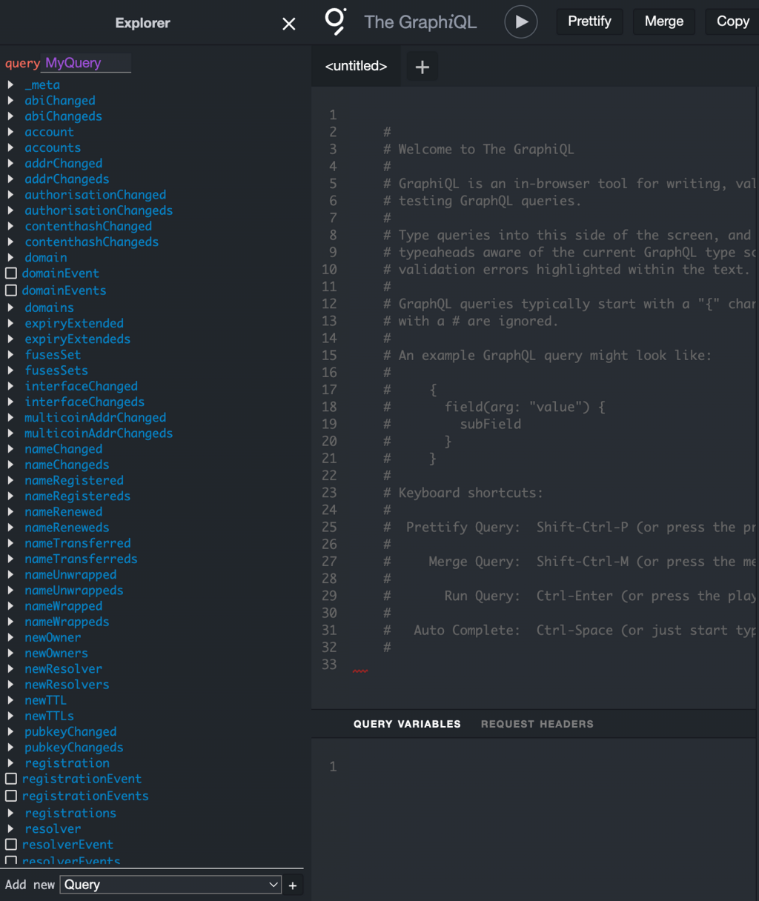

這裡有許多豐富的 ENS 相關資料，今天會用到的是 domains 的資料，這裡可以查到哪個地址註冊了哪個 ENS domain，例如在介面上試著抓出 owner 與 name 就可以拿到這樣的資料：

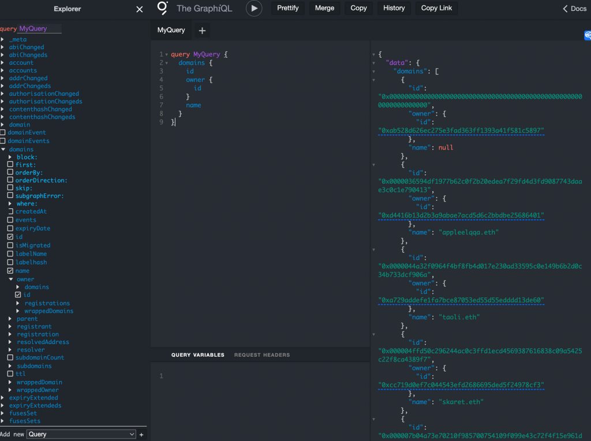

因此只要能 filter 出 owner address 是特定地址的所有記錄，就能拿到他對應的所有 ENS Domain 了。而這只要用 Graph QL 的 where 語法就可以做到：

[code]
    query MyQuery {
      domains(where: {owner_in: ["0xd8da6bf26964af9d7eed9e03e53415d37aa96045"]}) {
        name
      }
    }

[/code]

實際執行結果如下

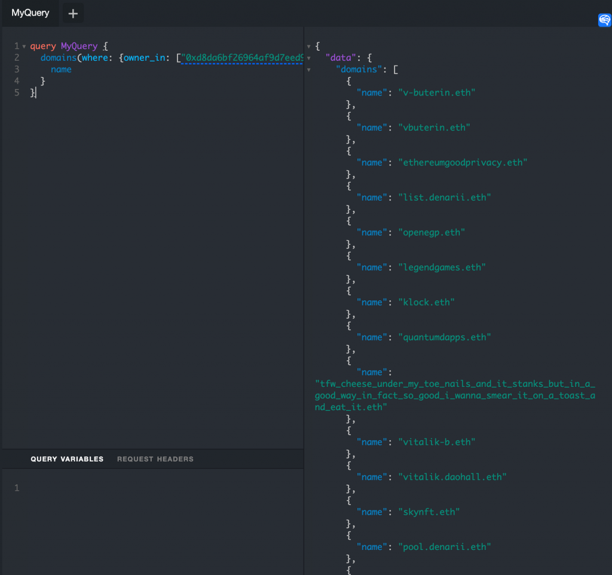

這樣只要把這個查詢方式用 Dart 實作出來就好了。以下是用 Dart 實作打 ENS Subgraph API 的程式碼：

[code]
    Future<List<String>> getENSNames(String wallet) async {
      final query = '''
        query {
          domains(where: {owner_in: ["${wallet.toLowerCase()}"]}) {
              name
          }
        }
      ''';

      final response = await Client().post(
        Uri.parse('https://api.thegraph.com/subgraphs/name/ensdomains/ens'),
        headers: {'Content-Type': 'application/json'},
        body: jsonEncode({
          "query": query,
        }),
      );

      if (response.statusCode >= 400) {
        throw Exception(response.body);
      }
      final parsedData = jsonDecode(response.body);
      final responseData = parsedData['data'];

      var ensNames = <String>[];
      if (responseData['domains'] != null) {
        for (final v in responseData['domains']) {
          ensNames.add(v['name']);
        }
      }
      return ensNames;
    }

    // main
    final allEnsNames =
        await getENSNames("0xd8da6bf26964af9d7eed9e03e53415d37aa96045");
    print('allEnsNames: $allEnsNames');

[/code]

最後把以上程式碼結合起來，執行結果會像以下這樣，成功拿到地址跟 domain 之間的一對多對應了！

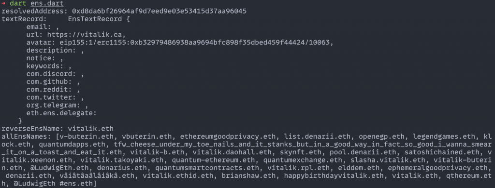

#### 5. 小結

今天介紹了 ENS 的應用以及如何透過 ENS package、The Graph Protocol 來拿到 ENS 協議的相關資料，完整程式碼在[這裡](https://github.com/a00012025/ironman-2023-web3-fullstack/tree/main/mobile/day14)。如同文中所說 The Graph 的 ENS Subgraph 其實還有很多有趣的資料，包含 domain 註冊時間、domain 轉移紀錄等等，還有其他 Subgraph 的資料可以供讀者探索。今天的內容就作為第一部分 Web3 與 App 開發的結尾，接下來會再回到 Web3 與前端來探討更進階的主題。

## DAY 15｜Day 15 - Web3 與進階前端：Revoke Cash 與 Logs 查詢

- 原文：https://ithelp.ithome.com.tw/articles/10326582
- 發佈時間：2023-09-24 14:40:29

### 章節內容

#### 1. 未分章內容

我們又回到了 Web3 與前端的主題，今天會介紹一個實用的查看地址所有 Token Approval、方便撤銷授權的網站 revoke.cash，以及它背後的實作原理，也就是 Event Log 的查詢方式，可以讓我們對區塊鏈上的資料有更深入的了解。

#### 2. Token Approval 的危險

若是使用 EVM 鏈一段時間後的使用者，可能會授權過許多 DApp 使用自己的 Token，例如要做 Token 交易時需要授權 Uniswap, 1inch 等 DEX 智能合約使用自己的 ERC-20 Token，或是如果要掛賣 NFT 就要授權 Opensea, blur 等合約使用自己的 ERC-721, ERC-1155 Token，累積久了之後可能就不記得自己曾經 Approve 過什麼合約了。

但這就會有個風險：萬一某個合約被駭客發現漏洞，那駭客可能可以用這個合約的身份，轉走所有 Approve 過這個合約的地址的 Token。因為只要駭客能發送惡意交易讓合約內的程式碼執行到去轉移 ERC-20 Token 的那行邏輯（例如 `token.transferFrom(user, to, amount)` ），並且控制 to address 為自己的地址，那就能把那些地址的 token 轉走。

一般智能合約當然會在這個邏輯附近做嚴格的檢查，但有時還是會有意想不到的漏洞產生。例如[這裡](https://revoke.cash/exploits)列出了許多因為合約被駭加上 Token Approval 導致使用者的錢被轉走的事件，甚至連知名的 Sushiswap 也有[被駭過](https://rekt.news/sushi-yoink-rekt/)。

因此如果是常使用的地址，一個好的習慣是常去確認自己的地址有沒有 Approve 過一些目前已經根本用不到的合約，趁 gas fee 低的時候把授權 Revoke 掉，就可以降低被駭客事件影響到的機率。有幾個服務都有提供授權查詢的工具，包含：

* [Revoke.cash](https://revoke.cash/)
  * [Etherscan Token Approval Checker](https://etherscan.io/tokenapprovalchecker)

#### 3. Revoke Cash

進到 [Revoke.cash](https://revoke.cash/) 網站後可以隨便搜尋一個地址或域名（或是連接自己的錢包也可以），例如 `doge.eth` 這個 ENS domain，可以看到像這樣的畫面：

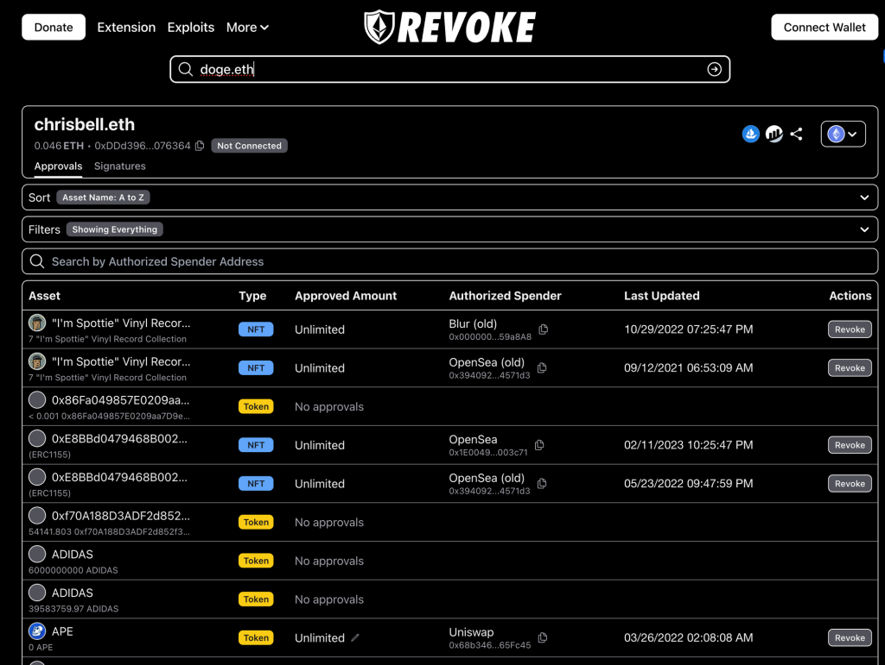

他會把所有這個地址曾經持有過的 Token，以及使用者是否有 Approve 過這些 Token、Approve 給哪個合約、上次操作日期等等資訊全部展示出來，也在最後有個 Revoke 的按鈕可以方便取消授權。所以像圖中有些舊的合約（Blur old, Opensea old）如果用不到了就可以撤銷掉。另外他也支援切換不同的 EVM 鏈查看授權，只要按右邊的鏈的 icon 就可以選擇。

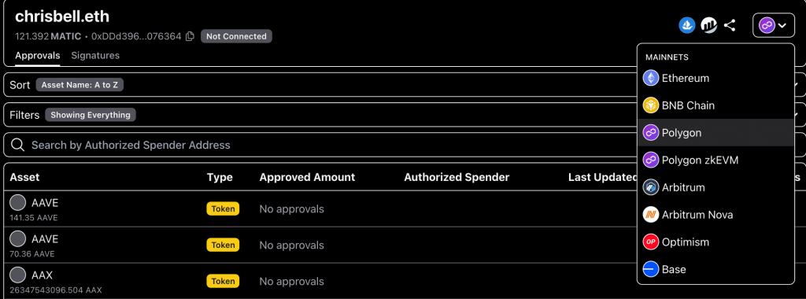

至於他是怎麼知道一個地址過去所有 Approve 過的紀錄？這就要到鏈上拿 Event Logs 的資料了。

#### 4. Event Logs

回顧 Day 8 中其實已經有講到 Event 的概念，也就是在智能合約中可以定義一些關鍵狀態改變的 Event，並在對應的時機發出，那天提到 ERC-20 標準中定義了以下格式的 Event：

[code]
    event Transfer(address indexed from, address indexed to, uint value);

[/code]

以及[這筆交易](https://sepolia.etherscan.io/tx/0x8778dfe09585097badb32951bc34a1cb41c166045bd37f6b92885b40f5c26bfc#eventlog)裡有個 ERC-20 Transfer Event 的範例，這是我轉移 UNI Token 的交易。而每個交易的 Logs tab 都可以看到這筆交易觸發了哪些 Event（一筆交易可以有非常多 Event）。

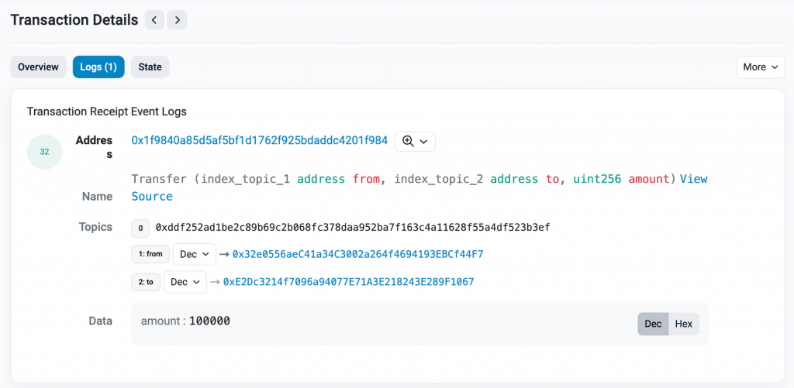

從這張圖由上而下來介紹每個欄位的意義。首先 Address 代表是發出這個 Event 的智能合約地址，可以看到跟 UNI Token Contract Address 是一致的。再來是 Event Name，欄位的型別跟名稱都算好理解，但裡面的 `index` 還沒有介紹過。 `index_topic_1` 跟 `index_topic_2` 就對應到 Event 定義中的 `indexed` 標記，代表區塊鏈是否應該要對這個欄位做 indexing。實際的效益就是大家可以方便用有被 index 的欄位去 Filter 出 Logs，例如當我想找出我的地址所有轉出的 Transfer Event，那我只要 Filter 出 from 欄位是我的地址的所有 Event Logs 就可以了（後面會提到實際做法）。

而 amount 這個欄位在定義中沒有 `indexed` 代表不會被 index，也就是無法有效率地找到所有 Transfer amount 等於特定值的 Logs，這也是合理的因為這種使用場景很少，而且要使用 indexed 欄位所需要的 gas fee 也比較高。

接下來是 Topics，Topics 指的是一個 Log 中有被 index 的欄位們，而 Topic 0 會是從 Event 的定義計算 keccak256 hash 算出的值，可以用來辨識不同的 Event，計算方法如下：（圖片參考[網址](https://medium.com/mycrypto/understanding-event-logs-on-the-ethereum-blockchain-f4ae7ba50378)）

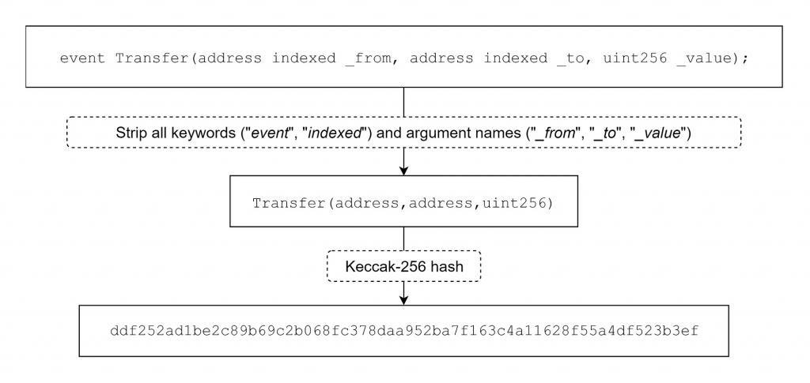

所以其實要找出所有我的地址的轉出 Event，需要下的 Filter 會是 topic 0 = `0xddf252ad1be2c89b69c2b068fc378daa952ba7f163c4a11628f55a4df523b3ef` 且 topic 1 = `0x00000000000000000000000032e0556aec41a34c3002a264f4694193ebcf44f7` 才能精準拿到對的 Logs 資料。注意到因為每個 topic 都固定是 32 bytes 的，所以如果是地址的話前面要 pad 一些 0。

最後是 Data 欄位，這裡就會依序放入沒有被 index 的欄位的值，因為 Transfer Event 只有 amount 欄位沒有被 index，所以 Data 裡的值就只有他。有了以上知識後，就可以試著使用 Alchemy 的 [eth_getLogs](https://docs.alchemy.com/reference/eth-getlogs) API 來查詢我的地址發出過的 UNI Token Transfer Event 有哪些：

[code]
    curl --request POST \
         --url https://eth-sepolia.g.alchemy.com/v2/YOUR_API_KEY \
         --header 'accept: application/json' \
         --header 'content-type: application/json' \
         --data '
    {
      "id": 1,
      "jsonrpc": "2.0",
      "method": "eth_getLogs",
      "params": [
        {
          "address": [
            "0x1f9840a85d5af5bf1d1762f925bdaddc4201f984"
          ],
          "fromBlock": "0x0",
          "toBlock": "latest",
          "topics": [
            "0xddf252ad1be2c89b69c2b068fc378daa952ba7f163c4a11628f55a4df523b3ef",
            "0x00000000000000000000000032e0556aec41a34c3002a264f4694193ebcf44f7"
          ]
        }
      ]
    }' | jq

[/code]

把 `YOUR_API_KEY` 代換成讀者的 API Key 即可。topics 欄位代表 log topics 的值依序要等於什麼，以及會多指定 fromBlock 跟 toBlock 代表要查詢的區塊範圍，因為有時 Logs 的數量非常多會需要分頁查詢。查詢結果如下：

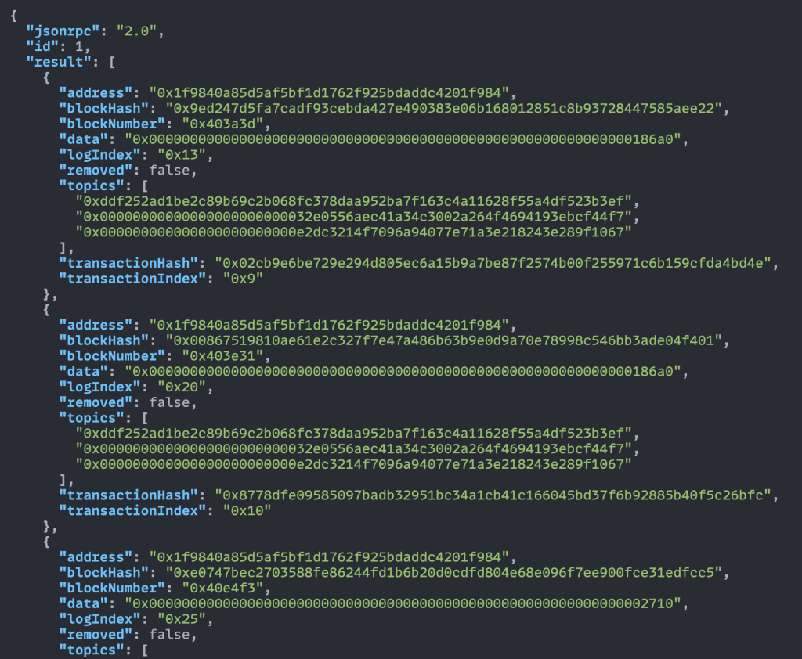

可以看到他會回傳所有符合的 Logs 的 Topics, Data, Transaction Hash, Block number 等等，而從 Topics 與 Data 就可以解析出這筆 Transfer Event Log 中的 from, to, amount 資料了。

#### 5. Revoke Cash 程式碼

理解以上 Event Logs 的概念後，就可以來看 Revoke Cash 的程式碼，以下會簡單帶讀者看一下裡面核心邏輯的部分，不會解釋到每個細節。程式碼在[這裡](https://github.com/RevokeCash/revoke.cash)。

首先他需要拿到一個地址所有跟 Approve 有關的 Logs，相關的邏輯在 [useEvents.ts](https://github.com/RevokeCash/revoke.cash/blob/master/lib/hooks/ethereum/events/useEvents.tsx) 裡，傳入的參數有當下正在查詢的錢包地址以及 Chain ID：

[code]
    export const useEvents = (address: Address, chainId: number) => {
      // ...

    	const getErc721EventSelector = (eventName: 'Transfer' | 'Approval' | 'ApprovalForAll') => {
    	  return getEventSelector(getAbiItem({ abi: ERC721_ABI, name: eventName }));
    	};

    	const addressTopic = address ? addressToTopic(address) : undefined;
    	const transferToTopics = addressTopic && [getErc721EventSelector('Transfer'), null, addressTopic];
    	const transferFromTopics = addressTopic && [getErc721EventSelector('Transfer'), addressTopic];
    	const approvalTopics = addressTopic && [getErc721EventSelector('Approval'), addressTopic];
    	const approvalForAllTopics = addressTopic && [getErc721EventSelector('ApprovalForAll'), addressTopic];

    	const baseFilter = { fromBlock: 0, toBlock: blockNumber };

    	const {
    	  data: transferTo,
    	  isLoading: isTransferToLoading,
    	  error: transferToError,
    	} = useLogs('Transfer (to)', chainId, { ...baseFilter, topics: transferToTopics });

    	const {
    	  data: transferFrom,
    	  isLoading: isTransferFromLoading,
    	  error: transferFromError,
    	} = useLogs('Transfer (from)', chainId, { ...baseFilter, topics: transferFromTopics });

    	const {
    	  data: approval,
    	  isLoading: isApprovalLoading,
    	  error: approvalError,
    	} = useLogs('Approval', chainId, { ...baseFilter, topics: approvalTopics });

    	const {
    	  data: approvalForAllUnpatched,
    	  isLoading: isApprovalForAllLoading,
    	  error: approvalForAllError,
    	} = useLogs('ApprovalForAll', chainId, { ...baseFilter, topics: approvalForAllTopics });

    // ...
    }

[/code]

裡面使用 ERC-721 的 Event Selector 原因是 ERC-721 的 Transfer, Approval Event 的 Selector 都跟 ERC-20 是一樣的（像前者都等於 `keccak256('Transfer(address,address,uint256)')` ），因此可以重複使用。以及使用 `useLogs` 去查詢鏈上符合這些 topics 的 Logs，他基本上就是用 React Query 把查詢鏈上資料的 API Call 包起來的 Hook。

除了 Approval 相關的 Logs 以外他也拿了 Transfer From 跟 Transfer To 的資料，也就是從這個地址轉出/轉入特定 Token 的紀錄，就能用來計算當下這個地址擁有該 Token 的數量。

有了這些 Events 之後就可以用它來計算所有的 Token Approval 資料，由於 ERC-20、ERC-721、ERC-1155 的處理都不太一樣，我們先只專注看 ERC-20。相關的邏輯是在 [allowances.ts](https://github.com/RevokeCash/revoke.cash/blob/master/lib/utils/allowances.ts) 中，前面先對所有 Events 按照 Token Contract 做 Grouping，再按照 Contract Address 一個一個處理，而關於 ERC-20 的處理最關鍵是在這兩個 function：

[code]
    export const getErc20AllowancesFromApprovals = async (
      contract: Erc20TokenContract,
      owner: Address,
      approvals: Log[],
    ) => {
      const sortedApprovals = sortLogsChronologically(approvals).reverse();
      const deduplicatedApprovals = deduplicateLogsByTopics(sortedApprovals);

      const allowances = await Promise.all(
        deduplicatedApprovals.map((approval) => getErc20AllowanceFromApproval(contract, owner, approval)),
      );

      return allowances;
    };

    const getErc20AllowanceFromApproval = async (
      contract: Erc20TokenContract,
      owner: Address,
      approval: Log,
    ): Promise<BaseAllowanceData> => {
      const spender = topicToAddress(approval.topics[2]);
      const lastApprovedAmount = fromHex(approval.data, 'bigint');

      // If the most recent approval event was for 0, then we know for sure that the allowance is 0
      // If not, we need to check the current allowance because we cannot determine the allowance from the event
      // since it may have been partially used (through transferFrom)
      if (lastApprovedAmount === 0n) {
        return { spender, amount: 0n, lastUpdated: 0, transactionHash: approval.transactionHash };
      }

      const [amount, lastUpdated, transactionHash] = await Promise.all([
        contract.publicClient.readContract({
          ...contract,
          functionName: 'allowance',
          args: [owner, spender],
        }),
        approval.timestamp ?? blocksDB.getBlockTimestamp(contract.publicClient, approval.blockNumber),
        approval.transactionHash,
      ]);

      return { spender, amount, lastUpdated, transactionHash };
    };

[/code]

計算方式主要就是按照時間由新到舊排序 Logs 後，按照 topics 去做 deduplication，因為 Approval 的 event 長得像這樣： `Approval(address indexed owner, address indexed spender, uint value)` ，如果 topics 不同代表 `spender` 不同，因此需要分開處理。

針對同一個 owner 跟 spender 的組合，如果最新的一筆 Approval Log 的 Approval amount 是 0，那就代表這個地址已經撤銷授權了，可以直接 return 0。但如果不是的話，有可能這個地址在 Approve `spender` 後被 `spender` 使用過 `transferFrom` 把部分 Approve 的金額扣除（可以參考 ERC-20 transferFrom 的實作），因此才需要再去鏈上查詢一次 `allowance()` 知道最新的值。這樣就能拿到最精準的 Approval amount 了。

#### 6. 小結

今天我們介紹了 Token Approval 背後的 Event Logs 原理，以及像 Revoke Cash 這種服務如何找出一個地址所有曾經 Approve 過的資料。可以看到這種查詢跟資料處理的邏輯其實非常複雜，因為要從鏈上最原始的 Logs 資料處理起去做好 aggregation，不過有了 Event Logs 的相關知識後就能一步一步把需要的資料組合出來了。明天會來介紹像 Metamask 這種錢包的 Browser Extension 背後是怎麼跟 DApp 互動的。

## DAY 16｜Day 17 - Web3 與進階前端：Meta Transaction 免手續費交易

- 原文：https://ithelp.ithome.com.tw/articles/10327464
- 發佈時間：2023-09-26 00:23:16

### 章節內容

#### 1. 未分章內容

今天我們會介紹並實作一個可以讓使用者不需自己支付 Gas Fee 的機制，也就是 Meta Transaction，可以用來提升一般用戶的使用體驗，做為 Web3 與進階前端的收尾。

#### 2. Meta Transaction 背景

在發送任何以太坊上的交易時，都必需要有原生代幣（也就是 ETH）作為 Gas Fee 才能發送。但這也對使用者形成了一個門檻，想像一個場景是我跟別人買了一些 USDT 請他打到我的 ETH 錢包，這時我如果想把這些 USDT 轉走或是換成其他的幣就會無法送出交易，因為我還需要買一些 ETH 作為 Gas Fee。而今天要介紹的 Meta Transaction 就是想解決這個問題，來做到使用者不需要有 ETH 也能發送交易。

類似的場景也有很多，像有很多透過 NFT 做行銷的活動會希望讓使用者連接錢包後來領 NFT，但又不希望強制使用者要先買好 ETH (on Ethereum) 或 MATIC (on Polygon)，否則會造成許多用戶流失。

如果使用者想發交易卻又不想付手續費的話，有什麼可能的作法呢？一個想法是那使用者 A 只要簽名好一個「他想發 xxx 交易」的訊息就好（也就是他的「意圖」, intent），並把這個訊息交由另一個地址 B 發送交易，並透過智能合約的邏輯模擬出就像是 A 親自發出這筆交易一樣的效果，這樣就是一種 Meta Transaction 的作法了。

#### 3. ERC-2771 合約標準

一個實作 Meta Transaction 的方法是 [ERC-2771](https://eips.ethereum.org/EIPS/eip-2771) 標準，裡面定義了如何將交易訊息打包並簽名、如何在鏈上驗證、合約中如何以簽名者的身份執行邏輯等等。以下是官方文件中的圖：

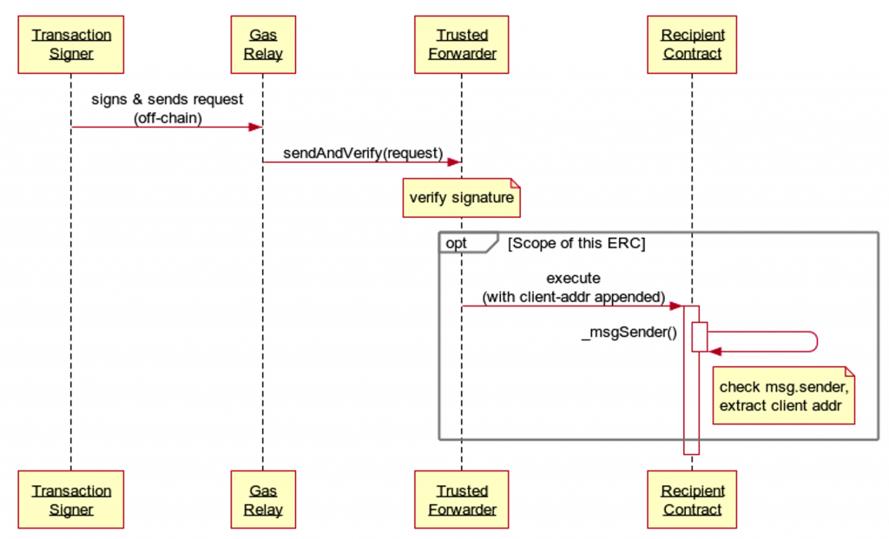

可以看到這裡面有幾個角色

* Transaction Signer：想要發送交易但不想花 Gas Fee 的終端用戶，他只需要簽名一個 message
  * Gas Relay：拿到 Transaction Signer 簽出來的訊息跟原始資料後，負責把交易發到鏈上的地址，會由他支付 Gas Fee
  * Trusted Forwarder：這筆交易會呼叫的智能合約地址，負責驗證簽章是否有效，若通過會再呼叫目標合約
  * Recipient Contract：終端用戶想操作的智能合約

以下舉一個實際的例子應該會更好懂。NFT Worlds 是一個元宇宙項目，他們發行了自己的代幣 WRLD Token，對應在 Polygon 鏈上的智能合約在[這裡](https://polygonscan.com/address/0xd5d86fc8d5c0ea1ac1ac5dfab6e529c9967a45e9)，切換到程式碼可以看到他實作的 `ERC2771Context` 這個 interface

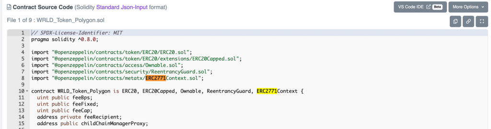

這個合約就對應到上面的 Recipient Contract，代表 NFT Worlds 的項目方希望當用戶想轉移 WRLD Token 時，允許他們不需花自己的 gas fee。至於 Trusted Forwarder 合約則是在[這裡](https://polygonscan.com/address/0x7fe3aedfc76d7c6dd84b617081a9346de81236dc)

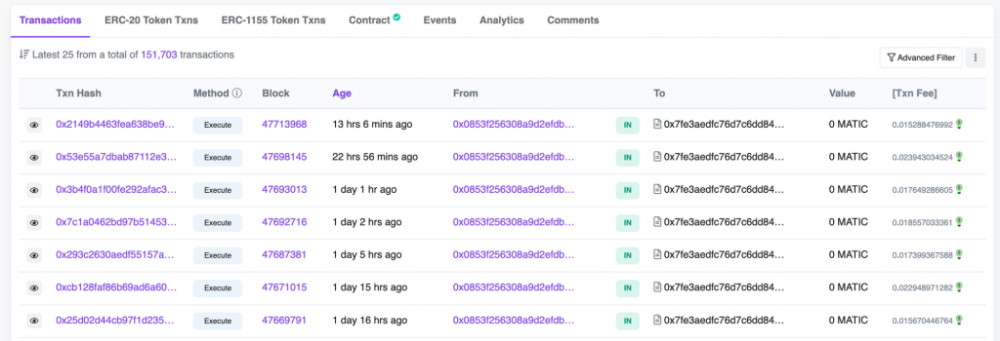

看一下這個合約相關的交易歷史，可以發現全部都是 `0x0853f256308a9d2efdb18f5ab9d6ce0cd4a622b4` 這個地址在呼叫 Trusted Forwarder 合約的 `Execute` 方法，到這裡就可以發現這個地址其實是 Gas Relay，因為他負責把交易打上鏈並支付 Gas Fee。那這些交易是如何運作的？可以點擊[其中一筆交易](https://polygonscan.com/tx/0xad00037f6eac542544a68139702a7810b229e7ad8b1ead1d15b779ed075bc5c2)進去看：

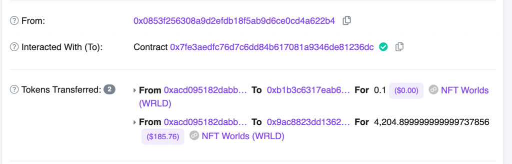

雖然是 0x0853 發出的交易，但裡面的 Token Transfer 卻是從 0xacd0 這個地址轉出的，而再往下到 Input Data 區塊中點擊 Decode Input Data 可以看到這筆交易的 call data：

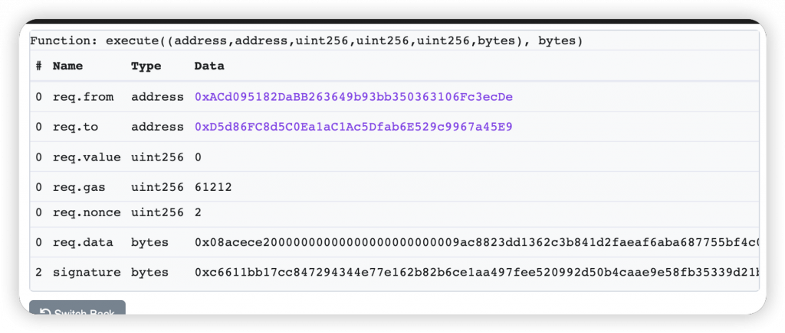

裡面的 from 地址就跟轉出 Token 的地址一致，代表 0xacd0 其實是這筆交易的 Transaction Signer，他做的操作是轉出他的 Token，只是請 0x0853 作為 Relayer 幫他支付 Gas Fee。

至於這位 Transaction Signer 實際想做什麼交易，只要看 `req.data` 的內容就會知道他想發給 Recipient Contract 的 call data 實際上是什麼：

[code]
    0x08acece20000000000000000000000009ac8823dd1362c3b841d2faeaf6aba687755bf4c0000000000000000000000000000000000000000000000e3f41904f485900000

[/code]

這是一個被 encode ABI 函式 encode 過的字串，要知道他其實是什麼 function 可以使用前幾天提到的 [Openchain ABI Tools](https://openchain.xyz/tools/abi)：

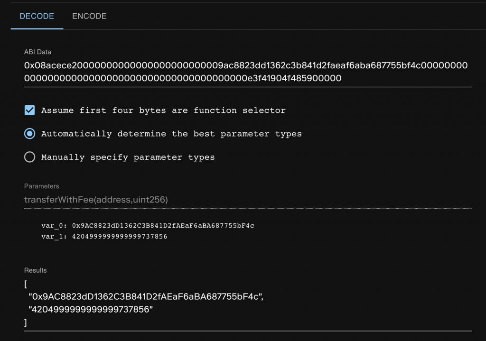

解析結果是 `transferWithFee()` function，看他的宣告可以猜到兩個參數分別是要轉去的地址跟數量（0x9ac8 也跟上面圖中收到 Token 的地址一致），於是到這裡我們就完全看懂這筆交易了！總結一下這筆交易中 ERC-2771 各個角色對應到的地址：

* Transaction Signer: [0xacd0](https://polygonscan.com/address/0xacd095182dabb263649b93bb350363106fc3ecde)，他的錢包裡完全沒有 MATIC，卻想呼叫 WRLD Token 合約上的 `transferWithFee` function
  * Gas Relay: [0x0853](https://polygonscan.com/address/0x0853f256308a9d2efdb18f5ab9d6ce0cd4a622b4)，也就是 NFT Worlds 項目方持有的專門代付 Gas Fee 的錢包
  * Trusted Forwarder: [WRLD_Forwarder_Polygon](https://polygonscan.com/address/0x7fe3aedfc76d7c6dd84b617081a9346de81236dc)
  * Recipient Contract: [WRLD_Token_Polygon](https://polygonscan.com/address/0xd5d86fc8d5c0ea1ac1ac5dfab6e529c9967a45e9)

#### 4. ERC-2771 程式碼

從實際發送出的交易已經看出整個 ERC-2771 的運作機制了，接下來就要進到合約中看 Trusted Forwarder 跟 Recipient Contract 是如何實作的，這樣我們才能把 ERC-2771 的標準整合進自己的合約中。可以先從 [OpenZeppelin 的文件](https://docs.openzeppelin.com/contracts/4.x/api/metatx)來看 ERC-2771 相關的合約支援哪些方法，裡面定義了 Recipient Contract 需實作的 `ERC2771Context` 介面：

[code]
    constructor(address trustedForwarder)
    isTrustedForwarder(address forwarder) → bool
    _msgSender() → address sender
    _msgData() → bytes

[/code]

以及 Trusted Forwarder 需實作的 `MinimalForwarder` 介面：

[code]
    constructor()
    getNonce(address from) → uint256
    verify(struct MinimalForwarder.ForwardRequest req, bytes signature) → bool
    execute(struct MinimalForwarder.ForwardRequest req, bytes signature) → bool, bytes

[/code]

先從整筆交易的進入點 `execute()` 看起，參數裡有個 `MinimalForwarder.ForwardRequest` 結構，如果進到[原始碼](https://github.com/OpenZeppelin/openzeppelin-contracts/blob/v4.9.3/contracts/metatx/MinimalForwarder.sol)裡面看的話可以找到他的定義：

[code]
    struct ForwardRequest {
        address from;
        address to;
        uint256 value;
        uint256 gas;
        uint256 nonce;
        bytes data;
    }

[/code]

這跟剛才在 Polygonscan 上查看的交易資料結構一致，就是代表 Transaction Signer 希望對這個合約執行的操作，值得注意的是只需要傳入 gas 代表 gas limit 即可，不需傳入 gas price（因為 gas price 是 Gas Relay 發交易時決定的）。來看一下他的實作：

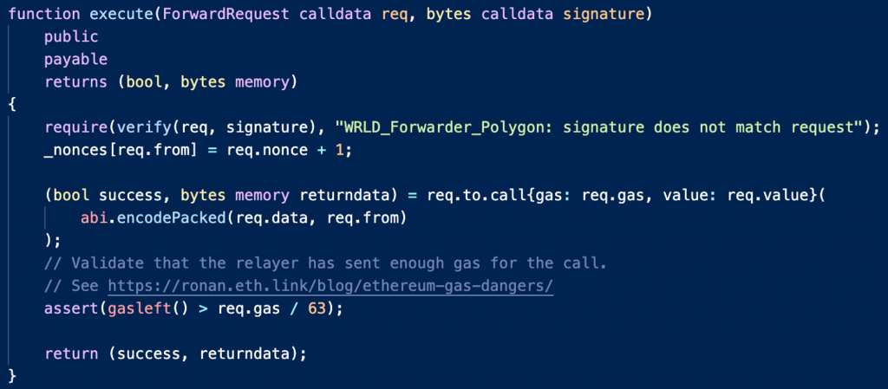

簡單來說他做了一些檢查後，使用 `.call()` 去呼叫 Recipient Contract。前面的檢查用到了 `verify` function：

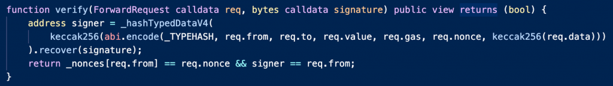

可以看到 `verify` 先驗證這個 Signature 是否真的是 `req.from` 地址去簽名 Transaction Request 得到的值，而因為 Transaction Signer 簽的是 Typed Message（交易意圖有固定的欄位所以是結構化的資料），在鏈上也要用驗證 Sign Typed Message 的方法。

接下來比較有趣的是 nonce 的驗證， `_nonces` 是一個用來記錄 `req.from` 地址已經透過這個 Forwarder Contract 轉發多少交易的數量，類似每個 EVM 地址都有的 nonce 用來避免 Replay Attack，這裡需要 nonce 也是一樣的原因：不希望同樣一個 signature 可以被別人重複使用第二次，所以當 `verify` 驗證通過後會把 `_nonces[req.from]` 加一，來讓下一個有效的 signature 一定跟上過去用過的 signature 不同。因此 `ForwardRequest` 內的 `nonce` 值並不是該 `req.from` 地址本身的 nonce，而是 Forwarder Contract 自己紀錄的值。

最後在呼叫 Recipient Contract 時，會把 `req.data` 跟 `req.from` 連接起來，而這就對應到 Recipient Contract 中必須實作的 `ERC2771Context`：

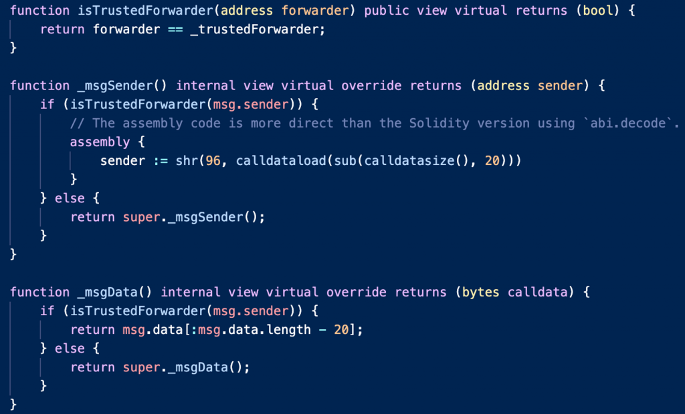

當 Recipient Contract 想要知道現在是誰呼叫自己時，他必須判斷這筆交易是否為 Meta Transaction，如果是的話這筆交易的所有邏輯就必須針對 Transaction Signer 發生，否則就是對原始發送這筆交易的人（`msg.sender`）發生。至於當是 Meta Transaction 的情況要如何知道 Transaction Signer 是誰，剛才在 `.call` 時拼接在最後面的 `req.from` 資料就派上用場了，可以從 call data 中去抓最後 20 bytes 得到。

因此透過 `_msgSender()` function 把以上邏輯包起來，並在所有其他 function 中如果想知道當下是誰呼叫這個合約時都使用它，就能完成符合 ERC-2771 標準的合約實作。例如前面看到的 `transferWithFee` 長這樣：

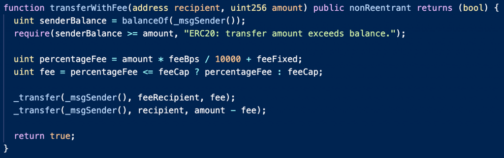

當要轉移代幣時，如果誤用了 `msg.sender` ，以前面的例子他就會把 0x0853 (Gas Relay) 地址的代幣轉走，但其實要轉走的應該是 0xacd0 (Transaction Signer) 的代幣才對。於是到這裡就把 ERC-2771 的實作介紹完了！

#### 5. 前端實作

當符合 ERC-2771 的智能合約被開發完後，若要把完整的流程串起來，還差兩個步驟：

1. 前端要組合需要的交易內容成 Typed Message 讓使用者簽名
  2. 把簽名送到後端，由後端的 Gas Relay 錢包發送交易上鏈

由於後續的內容才會講到後端如何發送帶有 call data 的交易，今天先提供前端的實作方式。本質上要發送 ERC-2771 Transaction 需要兩個資訊：ForwardRequest 跟 Signature。也就是前端必須算好以下資料：

* `from`, `to`, `value`, `gas`, `data`: 對合約進行操作的相關資料
  * `nonce`: Forwarder Contract 上該地址的 nonce
  * `signature`: 把上面這些資料組成 Typed Message 後讓用戶簽名後的資料

同樣以用戶想呼叫 NFT Worlds 合約中的 `transferWithFee(address,uint256)` function 為例，具體實作方式為：

* `from`, `to`, `value`, `gas` 都可以設成固定的值
  * `data` 要用 `viem` 中的 `encodeFunctionData` 來基於 ABI 去組
  * `nonce` 要用 `useContractRead` 來到 Forwarder Contract 查最新的值
  * `signature` 要用 `useSignTypedData` 來讓使用者簽名

前面先定義好 Forwarder Contract 跟 Recipient Contract 的地址跟 ABI 後，就可以把這些資料組出來了：

[code]
    // read forwarder nonce
    const { data: forwarderNonce } = useContractRead({
      address: FORWARDER_CONTRACT_ADDRESS,
      abi: forwarderABI,
      functionName: "getNonce",
      args: [address || NULL_ADDRESS],
      chainId: 137,
    });

    // encode transferWithFee function data
    const gas = 100000n;
    const data = encodeFunctionData({
      abi: recipientContractABI,
      functionName: "transferWithFee",
      args: ["0xE2Dc3214f7096a94077E71A3E218243E289F1067", 10000n],
    });

    // compose and sign typed data
    const {
      data: signature,
      isError,
      error,
      signTypedData,
    } = useSignTypedData({
      domain: {
        name: "WRLD_Forwarder_Polygon",
        version: "1.0.0",
        chainId: 137,
        verifyingContract: FORWARDER_CONTRACT_ADDRESS,
      } as const,
      primaryType: "ForwardRequest",
      types: {
        ForwardRequest: [
          { name: "from", type: "address" },
          { name: "to", type: "address" },
          { name: "value", type: "uint256" },
          { name: "gas", type: "uint256" },
          { name: "nonce", type: "uint256" },
          { name: "data", type: "bytes" },
        ],
      },
      message: {
        from: address || NULL_ADDRESS,
        to: TOKEN_CONTRACT_ADDRESS,
        value: 0n,
        gas,
        nonce: forwarderNonce || 0n,
        data,
      },
    });

    // in returned component
    <button
      onClick={() => {
        if (forwarderNonce !== undefined) {
          signTypedData();
        }
      }}
    >
      Sign Meta Transaction
    </button>
    
Forwarder Nonce: {(forwarderNonce || 0n).toLocaleString()}

    
Signature: {signature}

    {isError && 
Error: {error?.message}
}

[/code]

其中傳入 `useSignTypedData` 的是標準的 [EIP-712](https://eips.ethereum.org/EIPS/eip-712) 格式，他定義了如何在鏈上驗證 Typed Message 的標準，其中所需要的 `name` 跟 `version` 就會對應到 Forwarder Contract 上所記錄的自己的 name & version。點擊 Sign Meta Transaction 後就可以看到 Metamask 跳出的簽名 Typed Message 的視窗：

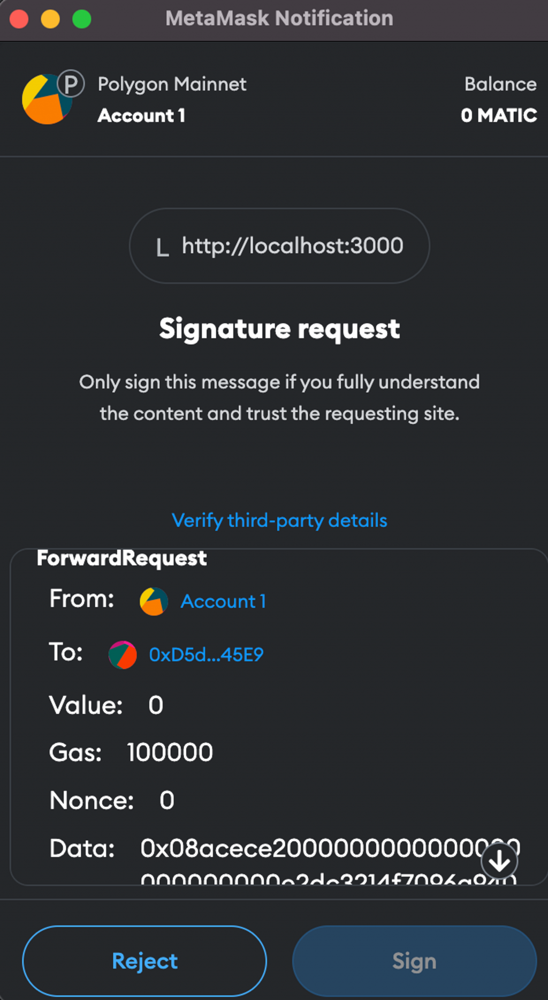

至於要如何驗證簽出來的簽章在鏈上可以被驗證通過呢？其實可以直接呼叫 Forwarder 中的 `verify` function，只要他回傳 `true` 就代表驗證成功，並顯示在畫面上：

[code]
    // verify typed data
    const { data: isVerified } = useContractRead({
      address: FORWARDER_CONTRACT_ADDRESS,
      abi: forwarderABI,
      functionName: "verify",
      args: [
        {
          from: address || NULL_ADDRESS,
          to: TOKEN_CONTRACT_ADDRESS,
          value: 0n,
          gas,
          nonce: forwarderNonce || 0n,
          data,
        },
        signature || "0x",
      ],
      chainId: 137,
      enabled: !!address && !!forwarderNonce && !!signature,
    });

    // in returned component
    {isVerified && 
Signature verified!
}

[/code]

最後看到 Signature verified 代表我們的簽章可以通過 Forwarder Contract 的驗證了！

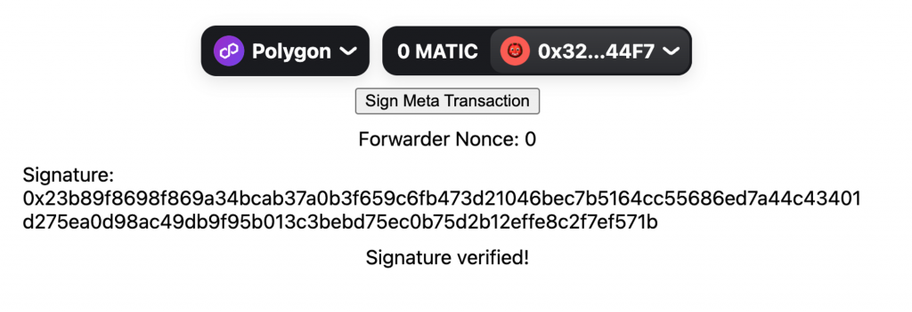

#### 6. 小結

今天我們詳細講解了 ERC-2771 的機制，包含發送交易的過程、智能合約的邏輯、前端簽名 Typed Data 的串接，完整程式碼在[這裡](https://github.com/a00012025/ironman-2023-web3-fullstack/tree/main/frontend/day17)。其實 ERC-2771 只是其中一種實作 Meta Transaction 的方式，其他還有像 [Ethereum Gas Station Network](https://docs.opengsn.org/) 也可以發送 Gasless Transaction。以及在最近正式通過的 [ERC-4337](https://eips.ethereum.org/EIPS/eip-4337) 帳戶抽象化標準也是想解決 Gas Fee 支付的問題，這個會在後續的內容介紹到。

今天就是 Web3 與進階前端主題的最後一篇，接下來會進入 Web3 與進階後端，明天就會從今天也有提到的「從後端發送帶有 call data 的交易」開始介紹，讓讀者有能力實作完整 Meta Transaction 的流程。

## DAY 17｜Day 16 - Web3 與進階前端：瀏覽器錢包 Extension 原理

- 原文：https://ithelp.ithome.com.tw/articles/10327465
- 發佈時間：2023-09-25 15:41:20

### 章節內容

#### 1. 未分章內容

今天我們會來介紹瀏覽器錢包 Extension 的原理，包含解釋更底層的概念如 Wallet Provider, JSON-RPC API 等等，這樣在使用一些 wagmi, viem 或 ethers.js 中較底層的 API 時可以更清楚裡面提到的概念。另外也會基於這些知識介紹 Revoke Cash 的防止釣魚交易的瀏覽器 Extension，以及他背後是如何實作的。

#### 2. Metamask 原理

如果讀者曾經好奇 Metamask Extension 的運作方式的話，官方文件中有一個[架構圖](https://docs.metamask.io/wallet/concepts/architecture/)可以看到 Metamask Extension 跟 DApp, User, 區塊鏈節點之間的關係：

簡單來說 Metamask Extension 內會保管使用者的私鑰，在使用者進到一個新頁面時，會對 window 注入一個 `window.ethereum` 物件來讓 DApp 可以透過這個物件跟 Metamask Extension 互動。

DApp 的開發者可以透過 Metamask SDK 包裝好的方法來跟 `window.ethereum` 互動以對區塊鏈進行讀寫，包含讀取現在使用者連接了哪個錢包、錢包餘額、Nonce、發送交易等等。而 `window.ethereum` 在收到一些 DApp 來的請求時，會根據請求類型去決定要自己處理還是轉由區塊鏈節點服務處理。例如：

* 如果要取得當下連上的錢包，Metamask 就會自己回應 DApp。
  * 如果是要取得當下錢包的 ETH 餘額或 Nonce，Metamask 會去區塊鏈節點服務（如 Infura, Alchemy）查詢最新的值。
  * 如果是發送交易的請求，Metamask 會跳出彈窗要求使用者確認，若確認送出後就會發送給節點服務。

因此 Metamask inject 的 `window.ethereum` 物件就包含了所有跟區塊鏈互動所需的 function。在 Metamask 的 [Provider API 文件中](https://docs.metamask.io/wallet/reference/provider-api/)就有寫到這個物件提供的 property 與 function 們，包含：

[code]
    window.ethereum.isMetaMask
    window.ethereum.isConnected(): boolean;

    interface RequestArguments {
      method: string;
      params?: unknown[] | object;
    }
    window.ethereum.request(args: RequestArguments): Promise<unknown>;

    // Listen to event
    function handleAccountsChanged(accounts) {
      // Handle new accounts, or lack thereof.
    }
    window.ethereum.on('accountsChanged', handleAccountsChanged);
    window.ethereum.removeListener('accountsChanged', handleAccountsChanged);

[/code]

因此許多前端 web 3 相關的 library（如 ethers.js, web3.js, wagmi, viem 等等）都是幫我們串接好跟 `window.ethereum` 物件的互動來提供更高層次的用法。像 wagmi 裡提供了一個 `InjectedConnector` （[文件](https://wagmi.sh/react/connectors/injected)），指的就是可以連上任何有 Inject `window.ethereum` 進當前頁面的 Wallet Extension。

#### 3. Wallet Provider

除了 Metamask 之外，也有很多其他的 EVM 錢包 Extension，像是 Coinbase Wallet, Rabby 等等，如果讀者有安裝 Metamask 以外錢包的話，會發現在 DApp 中按下連接 Metamask 時可能會連到其他錢包！在了解上面的機制後就很好理解原因了：這些 Wallet Extension 也同樣定義了 `window.ethereum` 物件，並且可能把 Metamask 給覆蓋掉了，只要他定義的物件跟 Metamask 的物件有一樣的 interface，那麼對 DApp 來說就是正常的發所有跟區塊鏈相關的請求給 `window.ethereum` ，並不會察覺到任何不同。

這個介面其實也有一個標準，也就是 [EIP-1193](https://eips.ethereum.org/EIPS/eip-1193) 中定義的 Ethereum Provider JavaScript API，他把 `window.ethereum` 這個 JavaScript 物件稱為 Provider，代表區塊鏈操作的提供者，而要跟 Provider 互動就會透過 JSON-RPC API 的介面。

#### 4. JSON-RPC API

在前幾篇文章中都有陸續提到 JSON-RPC 的概念，但都還沒有講得很清楚。其實我們之前已經使用過很多次 JSON-RPC API 了，以這個打 Alchemy 的請求為例：

[code]
    curl --request POST \
         --url https://eth-mainnet.g.alchemy.com/v2/docs-demo \
         --header 'accept: application/json' \
         --header 'content-type: application/json' \
         --data '
    {
      "id": 1,
      "jsonrpc": "2.0",
      "params": [
        "0xe5cB067E90D5Cd1F8052B83562Ae670bA4A211a8",
        "latest"
      ],
      "method": "eth_getBalance"
    }'

[/code]

可以看到他是對 `https://eth-mainnet.g.alchemy.com/v2/docs-demo` 的 POST 請求，而請求的方法跟參數都寫在 POST body 中，所以不管是要呼叫哪個方法的 API（如 `eth_estimateGas`, `eth_getLogs` 等等），都只要改動請求中的 `method` 與 `params` 參數即可，POST 的網址都會是固定的。

因此他跟一般較常見的 RESTful API 很不同，RESTful API 定義了一套對於資源的描述與操作方式，因此不同資源會用不同的網址。JSON-RPC API 則是不管是讀是寫、是什麼資源，都把請求描述在POST 的 JSON Body 中，來達到 Remote Procedure Call 的目的（也就是透過網路去呼叫遠端的函式）。這種 API 的介面被廣泛應用在 EVM 區塊鏈相關的程式呼叫中。

在 Metamask 的 Wallet Provider 中定義了一個 `request()` function，他的介面就正好是 JSON-RPC API 的樣子：

[code]
    interface RequestArguments {
      method: string;
      params?: unknown[] | object;
    }
    window.ethereum.request(args: RequestArguments): Promise<unknown>;

[/code]

如同 Metamask 文件中的描述：

> MetaMask uses the `[window.ethereum.request(args)](https://docs.metamask.io/wallet/reference/provider-api/#windowethereumrequestargs)` provider method to wrap a [JSON-RPC API](https://docs.metamask.io/wallet/concepts/apis/#json-rpc-api). The API contains standard Ethereum JSON-RPC API methods and MetaMask-specific methods.

因此這個 function 就是 Metamask Wallet Provider 幾乎所有功能的進入點，因為可以用它來呼叫任何 JSON RPC method。至於到底有哪些 method 可以用呢？以 Metamask 為例他已經把所有的 JSON-RPC method 都列在[官方文件](https://docs.metamask.io/wallet/reference/rpc-api/)的 JSON-RPC API Playground 中了（圖中只是一小部分）

到這裡就可以對 JSON-RPC 的應用場景做個總結了，會用到 JSON-RPC API 的地方主要有兩個：

1. 呼叫區塊鏈節點服務時 （如 Alchemy），會使用 HTTP POST 搭配 JSON-RPC 形式的 body。
  2. DApp 要跟 Wallet Extension 互動時，透過 `window.ethereum.request()` 發送 JSON-RPC 形式的請求

而在 [viem](https://viem.sh/) 中（wagmi 底層使用的跟 Ethereum Wallet Provider 互動的套件），恰好區分出這兩種類型的 Client（[參考文件](https://viem.sh/docs/clients/intro.html)），比對上面的描述就會十分清楚：

> A **Client** provides access to a subset of **Actions**. There are three types of **Clients** in viem:

* A **[Public Client](https://viem.sh/docs/clients/public.html)** which provides access to **[Public Actions](https://viem.sh/docs/actions/public/introduction.html)** , such as `getBlockNumber` and `getBalance`.
  * A **[Wallet Client](https://viem.sh/docs/clients/wallet.html)** which provides access to **[Wallet Actions](https://viem.sh/docs/actions/wallet/introduction.html)** , such as `sendTransaction` and `signMessage`.
  * A **[Test Client](https://viem.sh/docs/clients/test.html)** which provides access to **[Test Actions](https://viem.sh/docs/actions/test/introduction.html)** , such as `mine` and `impersonate`.

#### 5. 對 Ethereum Provider 加功能

介紹完這麼多關於 Browser Extension, Wallet Provider, JSON-RPC 的概念後，實際有什麼應用呢？前一天提到的 Revoke Cash 其實還有出一個 [Browser Extension](https://revoke.cash/extension)，是用來防止一些釣魚網站騙使用者簽下可能會導致資產損失的交易/簽名，因為通常這些釣魚網站會偽裝成給使用者一些好處（免費領取代幣或 NFT），但實際上是送出 Approve 交易或是簽下 Permit 訊息等操作。Revoke Cash 的 Extension 就可以在使用者進行任何錢包操作前先經過一層風險偵測，警告使用者這個操作是否可能是可疑的操作。使用起來如下圖：

第一張圖是 Approve 交易，第二張圖是簽署「NFT 零元購」的 Typed Message，意思就是會把自己的 NFT 免費送別人（詳細的原理今天不會講到，有興趣的讀者可以自行查詢）。有了前面的知識，就能知道這個 Extension 是如何運作的了。

程式碼在[這裡](https://github.com/RevokeCash/browser-extension/tree/master)，核心思想是只要覆蓋 `window.ethereum` 物件，在 DApp 發送任何關於簽名交易、Personal Message、Typed Data 的操作時，都先經過 Revoke cash extension 的處理，如果符合特定的 pattern 就彈出警告視窗，使用者確認後再繼續呼叫原本 `window.ethereum` 中的處理流程即可。主要的邏輯在 [proxy-injected-providers.tsx](https://github.com/RevokeCash/browser-extension/blob/master/src/injected/proxy-injected-providers.tsx) 檔案中：

[code]
    const sendHandler = {
      // ...
    };
    const sendAsyncHandler = {
      // ...
    };
    const requestHandler = {
      // ...
    };

    const requestProxy = new Proxy(window.ethereum.request, requestHandler);
    const sendProxy = new Proxy(window.ethereum.send, sendHandler);
    const sendAsyncProxy = new Proxy(window.ethereum.sendAsync, sendAsyncHandler);

    window.ethereum.request = requestProxy;
    window.ethereum.send = sendProxy;
    window.ethereum.sendAsync = sendAsyncProxy;

[/code]

這裡就不展開講每個 handler 中做的細節，有興趣的讀者可自行閱讀。不過一個有趣的點是他會在初始化後每 100ms 去看當下的 `window.ethereum` 是否已經被其他 Extension inject 進來了，有了之後才會對 `window.ethereum` 中原本的三個方法做 Proxy：

[code]
    const overrideWindowEthereum = () => {
      if (!window.ethereum) return;
      clearInterval(overrideInterval);
    	// ...
    };

    overrideInterval = setInterval(overrideWindowEthereum, 100);
    overrideWindowEthereum();

[/code]

雖然是個簡單粗暴的方法，不過十分有效！

#### 6. 小結

今天我們從 Metamask 的原理講起，介紹了 Wallet Provider 跟 JSON-RPC API 的機制，以及應用他來看懂 Revoke Cash Extension 的實作方式，用一樣的方式讀者也有能力開發需要攔截 JSON-RPC Request 的任何 Extension 了（像是市面上也有其他掃描錢包操作的 Extension）。明天我們會介紹並實作一個可以讓使用者不需付 Gas Fee 的代發交易機制，也就是 Meta Transaction。

## DAY 18｜Day 18 - Web3 與進階後端：發送更複雜的交易

- 原文：https://ithelp.ithome.com.tw/articles/10329344
- 發佈時間：2023-09-27 16:16:12

### 章節內容

#### 1. 未分章內容

今天會延續昨天提到如何在後端發送帶有 call data 的交易，並使用 UNI Token 以及 Uniswap V2 在測試網上的合約作為範例，用 golang 來實作對這兩個合約發送交易。

#### 2. 智能合約的 Go Binding

在 Day 11 的內容中我們建立一個交易時用的方式是：

[code]
    tx := types.NewTransaction(
    	nonce,
    	common.HexToAddress("0xE2Dc3214f7096a94077E71A3E218243E289F1067"),
    	amountToSend,
    	estimateGas,
    	gasPrice,
    	[]byte{},
    )

[/code]

其中最後一個參數是 `data []byte` 也就是這筆交易的 call data，而如果要發送帶有 call data 的交易，以轉移 ERC-20 Token 為例，可能需要組出長得像這樣的 hex 字串：

[code]
    0xa9059cbb000000000000000000000000e2dc3214f7096a94077e71a3e218243e289f10670000000000000000000000000000000000000000000000000000000000002710

[/code]

這代表當決定好要呼叫合約的 `transfer(address dst, uint256 rawAmount)` 並帶入指定的 `dst`, `rawAmount` 時，至少還要做以下的處理才能拿到完整 call data：

1. 計算 `keccak256("transfer(address,uint256)")` 取前四個 bytes
  2. 把 `dst` 地址去除 `0x` 前綴並在左邊補零至長度 64
  3. 把 `rawAmount` 數量轉成 16 進制並在左邊補零至長度 64
  4. 把上面三個值組合起來

可以想像當參數越來越多、型別複雜時，要做的處理就越多也很容易出錯，例如像 `address[]` 這種型別的參數被 ABI Encode 的方式並不直覺。

這時智能合約的 Go Binding 就非常有用了，他算是讓 Go 開發者方便用來跟 EVM 智能合約互動的介面，讓我們不需要手動編碼/解碼 ABI 資料，可以直接呼叫智能合約的方法或查詢其狀態，他同時處理好了型別的安全性。

值得一提的是 Go Binding 的概念是更廣泛的，他代表將某一語言或系統的特定功能「綁定」到Go 語言，讓開發者在 Go 語言中能直接使用該功能或API。例如當我想在 Go 中呼叫由 Python 寫的函式時，可以使用一些工具來建立 Go 和 Python 之間的 Binding。這樣在 Go 語言中就可以直接呼叫那些在 Python 中定義的函式和方法，而不需透過複雜的互動方式如執行 shell command 或使用 RPC 等等。

#### 3. ERC-20 Binding 與實作

接下來就能介紹如何使用 ERC-20 的 Go Binding 還方便的跟 ERC-20 合約互動。有個 [eth-go-bindings](https://github.com/metachris/eth-go-bindings) 套件已經寫好一些常見合約標準的 Binding，如 ERC-20, ERC-165, ERC-721, ERC-1155 等等，方便開發者直接操作這些類型的合約。以 UNI Token 的 ERC-20 合約為例，使用方式如下：

[code]
    import (
      "github.com/ethereum/go-ethereum/common"
    	"github.com/ethereum/go-ethereum/core/types"
    	"github.com/ethereum/go-ethereum/ethclient"
    	"github.com/metachris/eth-go-bindings/erc20"
    )

    // connect to json rpc node
    client, err := ethclient.Dial("https://eth-sepolia.g.alchemy.com/v2/" + os.Getenv("ALCHEMY_API_KEY"))
    if err != nil {
    	log.Fatal(err)
    }

    // declare UNI token contract
    const uniTokenContractAddress = "0x1f9840a85d5aF5bf1D1762F925BDADdC4201F984"
    uniToken, err := erc20.NewErc20(common.HexToAddress(uniTokenContractAddress), client)
    if err != nil {
    	log.Fatal(err)
    }

[/code]

建立 `ethclient` 的部分跟之前一樣，而套件提供了 `erc20.NewErc20` 可以獲得一個 ERC-20 的 binding，來看一下裡面有哪些 function 可以用：

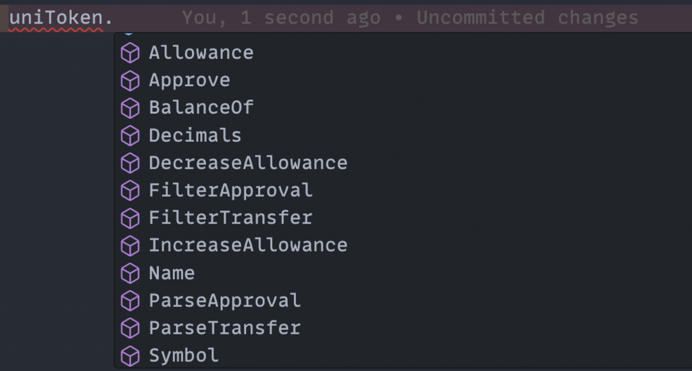

很多都是熟悉的 ERC-20 properties / functions，如 name, symbol, balanceOf, approve 等等。因此如果要查詢一個地址的 Balance，只要呼叫 `BalanceOf` 即可：

[code]
    balance, err := token.BalanceOf(&bind.CallOpts{}, ownerAddress)
    if err != nil {
        log.Fatalf("Failed to retrieve token balance: %v", err)
    }

[/code]

如果要發送 Token Transfer 的交易，可以先看一下 `uniToken.Transfer` function 的定義：

[code]
    // Transfer is a paid mutator transaction binding the contract method 0xa9059cbb.
    //
    // Solidity: function transfer(address recipient, uint256 amount) returns(bool)
    func (_Erc20 *Erc20Transactor) Transfer(opts *bind.TransactOpts, recipient common.Address, amount *big.Int) (*types.Transaction, error) {
    	return _Erc20.contract.Transact(opts, "transfer", recipient, amount)
    }

[/code]

只要傳入想轉移的 Recipient 跟 Token Amount 即可，這個 function 就會直接送出交易。因為是寫入操作，所以使用時需要多在 `opts` 參數提供 `From`, `Signer`, `Value`, `GasPrice` 等欄位，才能組出並簽名完整的交易，範例如下：

[code]
    chainID := big.NewInt(11155111)
    tx, err = uniToken.Transfer(
    	&bind.TransactOpts{
    		From: common.HexToAddress(address.Hex()),
    		Signer: func(_ common.Address, tx *types.Transaction) (*types.Transaction, error) {
    			return types.SignTx(tx, types.NewEIP155Signer(chainID), privateKey)
    		},
    		Value:    big.NewInt(0),
    		GasPrice: gasPrice,
    	},
    	common.HexToAddress("0xE2Dc3214f7096a94077E71A3E218243E289F1067"),
    	big.NewInt(1000000),
    )
    fmt.Printf("tx sent: %s\n", tx.Hash().Hex())

[/code]

讀者可能會發現這裡沒有傳入 `GasLimit` 與 `Nonce` 的值，原因是 go-ethereum 在發交易時會自動偵測未填入的欄位，如果是他能自動填入的就會到鏈上查詢（也就是去打 `eth_estimateGas` 跟 `eth_getTransactionCount` RPC method)。

#### 4. abigen

有了以上套件我們已經能輕鬆跟一些標準合約互動了，但有時還是會遇到較特殊的合約 function，沒有別人寫好的 Go Binding 可以用。例如在 Sepolia 上的 [Uniswap V2 合約](https://sepolia.etherscan.io/address/0xc532a74256d3db42d0bf7a0400fefdbad7694008)，從 Contract Tab 可以看到他有許多複雜的 function：

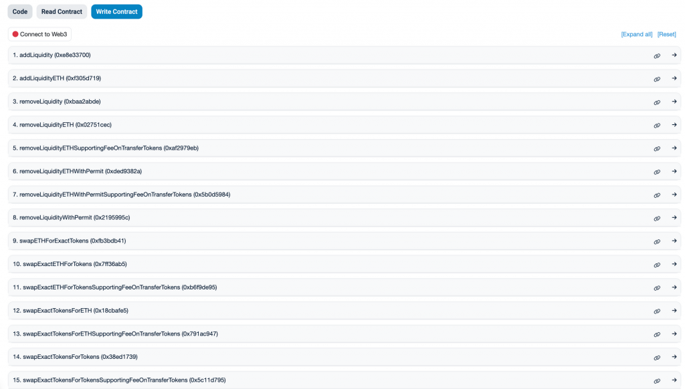

接下來的目標是發送一個 Swap 交易。但是要怎麼方便的跟他互動呢？這就要用到 [abigen](https://geth.ethereum.org/docs/tools/abigen) 這個方便的工具了，它可以根據已部署的智能合約的 ABI 產生對應的 Go binding。以 Uniswap V2 合約為例，可以先到 Contract Tab → Code 拉到最下面去複製這個合約完整的 ABI，並存成 `uniswapv2.abi.json` 檔案。

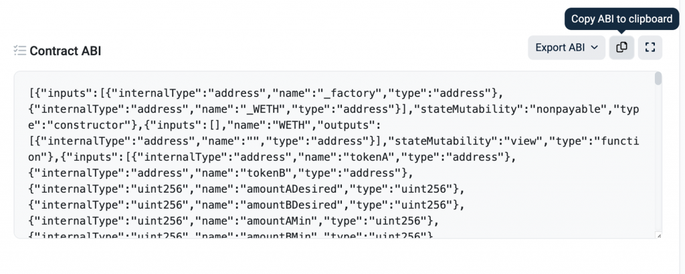

再來執行 `abigen --abi uniswapv2.abi.json --pkg uniswap --type UniswapV2 --out UniswapV2.go` 去產生 Uniswap V2 合約的 Go Binding，這些參數的意義是：

* `-abi`: 指定輸入 ABI 檔案的路徑。
  * `-pkg`: 指定生成的 Go package 名。
  * `-type`: 指定生成的 Go struct 的名稱。
  * `-out`: 指定輸出檔案名稱。

執行完成後把相關檔案放到獨立 package 中，就可以在 main 中宣告 Uniswap V2 合約了：

[code]
    import (
      "github.com/a00012025/ironman-2023-web3-fullstack/backend/day18/uniswap"
    )

    // main

    const uniswapV2ContractAddress = "0xc532a74256d3db42d0bf7a0400fefdbad7694008"
    uniswapV2, err := uniswap.NewUniswapV2(common.HexToAddress(uniswapV2ContractAddress), client)
    if err != nil {
    	log.Fatal(err)
    }

[/code]

#### 5. 對 Uniswap 發送交易

Uniswap 提供很豐富的 Swap functions，包含從 ETH Swap 成 Token、從 Token A Swap 成 Token B 等等，完整的 interface 可以參考 Uniswap V2 [官方文件](https://docs.uniswap.org/contracts/v2/reference/smart-contracts/router-02)。

我們會嘗試實作的是把一點點 ETH 透過 Uniswap V2 去換成另一個 Token，因此要用到的會是 `SwapExactETHForTokens` function，來看一下他的宣告：

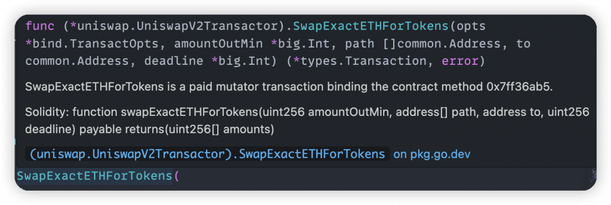

對應到官方文件中的 **[swapExactETHForTokens](https://docs.uniswap.org/contracts/v2/reference/smart-contracts/router-02#swapexactethfortokens)** function，簡單來說他的作用是給他固定數量的 ETH 並指定要 Swap 成什麼 Token，就可以幫你做 Swap。要呼叫他需要以下幾個參數：

* `amountOutMin`: 交易執行後期望收到的最少 token 數量，作為市場價格波動的保護機制。
  * `path`: 這是一個地址陣列，指定了從 ETH 到目標 ERC-20 token 的轉換路徑。例如從 ETH 轉換成 WETH 再轉換成 UNI 時，則需要放入 WETH 與 UNI 的合約地址。
  * `to`: 最終的 token 接收地址。
  * `deadline`: 交易的截止時間（UNIX timestamp），如果交易在此時間後都還沒被執行，則該交易將會失敗。

我在 Uniswap V2 中找到了一個 Token 可以作為示範：[ZKSlove](https://sepolia.etherscan.io/token/0xbd429ad5456385bf86042358ddc81c57e72173d3)，因此要把 ETH 轉換成他就需要經過 ETH → WETH → ZKSlove 的路徑，這樣就可以用以下程式碼發送 Swap 交易：

[code]
    chainID := big.NewInt(11155111)
    amountToSend := big.NewInt(100000)
    tx, err = uniswapV2.SwapExactETHForTokens(
    	&bind.TransactOpts{
    		From: common.HexToAddress(address.Hex()),
    		Signer: func(_ common.Address, tx *types.Transaction) (*types.Transaction, error) {
    			return types.SignTx(tx, types.NewEIP155Signer(chainID), privateKey)
    		},
    		Value:    amountToSend,
    		GasPrice: gasPrice,
    	},
    	big.NewInt(0),
    	[]common.Address{
    		common.HexToAddress("0x7b79995e5f793A07Bc00c21412e50Ecae098E7f9"),
    		common.HexToAddress("0xbd429ad5456385bf86042358ddc81c57e72173d3"),
    	},
    	common.HexToAddress("0x32e0556aeC41a34C3002a264f4694193EBCf44F7"),
    	big.NewInt(999999999999999999),
    )
    fmt.Printf("tx sent: %s\n", tx.Hash().Hex())

[/code]

因為要給他一些 ETH 做 Swap，就需要在 `bind.TransactOpts` 中指定要轉出的 `Value`。至於 `amountOutMin` 可以先用 `0` 來避免交易失敗（實際情況會根據匯率算出一個合理的值）， `path` 則帶入 WETH 以及該 Token 的合約地址，`to` 則帶入我自己的地址，`deadline` 先用一個很大的值確保不會超過。這樣就能成功送出交易了！完整的程式執行結果如下：

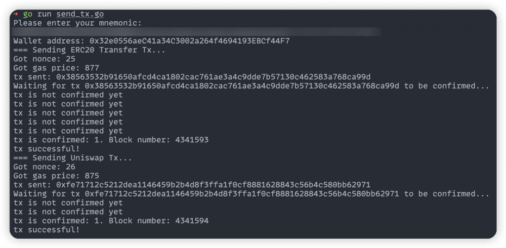

對應的 Tx 可以在 Sepolia Etherscan 上看到：[UNI Token Transfer](https://sepolia.etherscan.io/tx/0x38563532b91650afcd4ca1802cac761ae3a4c9dde7b57130c462583a768ca99d) 與 [Swap ETH to Token](https://sepolia.etherscan.io/tx/0xfe71712c5212dea1146459b2b4d8f3ffa1f0cf8881628843c56b4c580bb62971)。

#### 6. 小結

今天我們深入探討如何在後端發送帶有 call data 的交易。透過 Go Binding 和 abigen 的工具可以幫助我們輕鬆地完成這些操作，完整程式碼在[這裡](https://github.com/a00012025/ironman-2023-web3-fullstack/tree/main/backend/day18)。明天我們會討論如何在後端同時發送多筆交易，並講解這其中可能遇到的問題與挑戰。

## DAY 19｜Day 19 - Web3 與進階後端：同時發送大量交易

- 原文：https://ithelp.ithome.com.tw/articles/10330125
- 發佈時間：2023-09-28 18:05:24

### 章節內容

#### 1. 未分章內容

今天我們會講解在後端同時發送大量交易會遇到的問題與解法。回想 Day 17 中的 Meta Transaction 作法，最後一步是把用戶想做的交易與簽章打到後端，由後端發出交易並上鏈，而如果同時有很多用戶在打這個 API，就會發生同時發送交易導致部分交易無法送出或被覆蓋掉的問題。

#### 2. 同時發送交易

在昨天的內容中，我們使用 UNI Token 的 Go Binding 送出 Token Transfer 交易時，他會自動去鏈上查詢最新的 Nonce 並放進交易中。但如果同一瞬間有三個交易要被發出去，到鏈上查詢 Nonce 時很可能會查到同樣的值，這就會導致重複的 Nonce 變成了無效交易（一個地址的一個 Nonce 只能對應到一筆上鏈的交易），而被「覆蓋」掉。以下的程式碼展示了這種狀況：

[code]
    // send 3 transaction concurrently
    wg := sync.WaitGroup{}
    for i := 0; i < 3; i++ {
    	wg.Add(1)
    	go func() {
    		tx, err := sendUniTokenTransferTx(client, account.Address, privateKey)
    		if err == nil {
    			fmt.Printf("tx sent: %s\n", tx.Hash().Hex())
    			waitUntilTxConfirmed(tx, client)
    		} else {
    			fmt.Printf("tx sent failed: %s\n", err.Error())
    		}
    		wg.Done()
    	}()
    }
    wg.Wait()

[/code]

簡單來說就是同時發送三個交易，並使用 `sync.WaitGroup` 等到三個交易都上鏈後結束程式。執行結果如下：

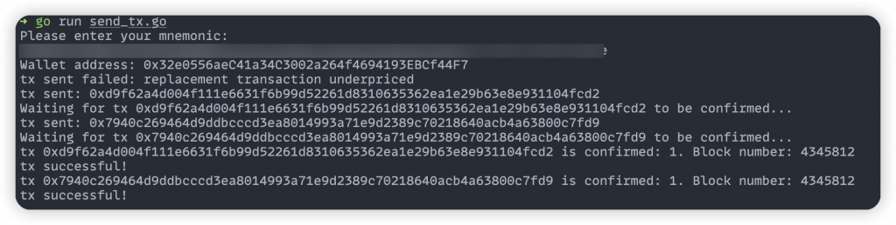

可以看到其中有一筆交易失敗了，錯誤訊息是 `replacement transaction underpriced`。會產生這個錯誤的原因是當我送出兩筆同樣 Nonce 的交易到鏈上時，RPC Node 會把第二筆交易當成是第一筆交易的 replacement transaction，意思是第二筆交易是來覆蓋第一筆交易的，這個功能常被用來取消剛發送而還沒有上鏈的交易，作法是發送一筆轉帳給自己 0 ETH 的同 Nonce 的交易來覆蓋上一筆交易。

而 Ethereum 為了避免有人發大量的相同 Nonce 的交易給礦工造成潛在的 Denial of Service 攻擊，會限制同一個 Nonce 的情況下新交易的 Gas Price 至少要比舊交易的 Gas Price 高 10%，來提高攻擊成本。因此上面會發生 `replacement transaction underpriced` 錯誤就是因為新交易的 Gas Price 不夠高（underpriced）。而最本質的問題就是這筆交易拿到了跟之前的交易一樣的 Nonce。

#### 3. 初步解法

為了解決 Nonce 的 Race condition，只要確保取得當下的 Nonce 跟把 Nonce +1 這兩件事是一個原子操作（atomic operation）即可，這樣就能讓 Nonce 的 concurrent access 持續拿到往上加的值。

因此可以使用 [atomic package](https://pkg.go.dev/sync/atomic) 來實作這件事，在程式中紀錄 `currentNonce` 代表下一筆交易應該要用什麼 Nonce 送出，並在 main 一開始去鏈上查詢最新的 Nonce 要用多少，後續就可以用 `atomic.AddInt64` 來取得每筆交易的下一個 Nonce。程式碼如下：

[code]
    var currentNonce int64 = -1 // -1 means not initialized

    // in main()
    // init nonce
    nonce, err := client.PendingNonceAt(context.Background(), account.Address)
    if err != nil {
    	log.Fatal(err)
    }
    atomic.StoreInt64(&currentNonce, int64(nonce))

    // in sendUniTokenTransferTx()
    // get next nonce
    nonce := atomic.AddInt64(&currentNonce, 1) - 1
    fmt.Printf("Got nonce: %d\n", nonce)

    chainID := big.NewInt(11155111)
    amount := rand.Int63n(1000000)
    tx, err = uniToken.Transfer(
    	&bind.TransactOpts{
    		From: common.HexToAddress(address.Hex()),
    		Signer: func(_ common.Address, tx *types.Transaction) (*types.Transaction, error) {
    			return types.SignTx(tx, types.NewEIP155Signer(chainID), privateKey)
    		},
    		Value:    big.NewInt(0),
    		GasPrice: gasPrice,
    		Nonce:    big.NewInt(nonce),
    	},
    	common.HexToAddress("0xE2Dc3214f7096a94077E71A3E218243E289F1067"),
    	big.NewInt(amount),
    )

[/code]

這樣就能確保同時發送交易時的 Nonce 是嚴格遞增的了，並且每筆交易都能成功上鏈，執行結果如下：

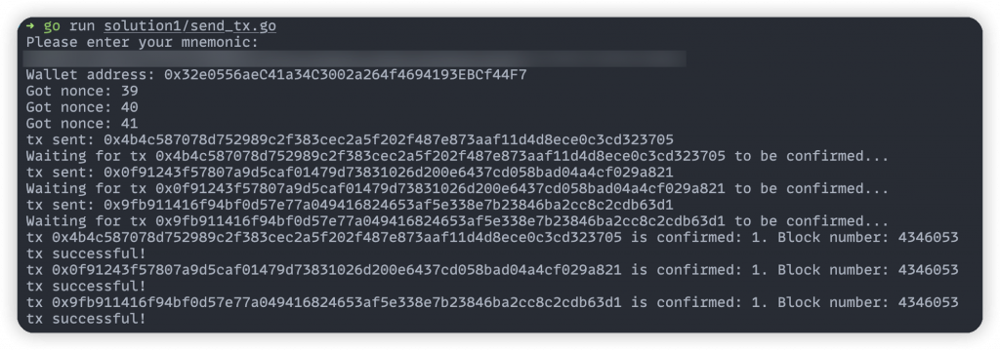

同樣的做法也可以延伸到如果系統中有多個 instance 在執行的狀況（例如使用 serverless 方式或 K8S 部署），透過像 Redis 這種服務來追蹤最新的 Nonce State 並做好 Atomic 操作，就能實作出多個程式 instance 同時發送多筆交易的邏輯。

#### 4. 更深入的問題

即使我們已採取了上述措施，仍可能遇到其他問題。例如只要把同時發送交易的數量從 3 筆改成 10 筆，馬上會遇到在呼叫 `uniToken.Transfer` 時 Alchemy API 回傳 429 (Too Many Requests) 的問題，因為太頻繁地打 Alchemy API 了。

這時會發生一個嚴重的問題：當我同時送出 Nonce 10~15 的交易，但 Nonce 12 的交易在送出時被 Alchemy 拒絕了，這時 Nonce 13~15 甚至未來發送的所有交易都會被卡住無法上鏈！ 雖然這些交易有成功被 broadcast 給 RPC Node，但為了符合 Nonce 嚴格遞增的規則，這些交易會一直被放在一個叫 memory pool 的地方（簡稱 mempool），等待礦工打包上鏈。關於 mempool 的機制有興趣的讀者可以看[這裡](https://www.geeksforgeeks.org/what-is-ethereum-mempool/)。

以下透過一個範例程式來展示這種錯誤出現的狀況：

[code]
    // in sendUniTokenTransferTx()
    if rand.Int()%2 == 0 {
        // simulate RPC node error
        return nil, fmt.Errorf("RPC node error for nonce %d", nonce)
    }
    tx, err = uniToken.Transfer(
        // ...
    )
    return

[/code]

這模擬了有 50% 的機率會在送交易到 Alchemy 時壞掉。實際執行結果

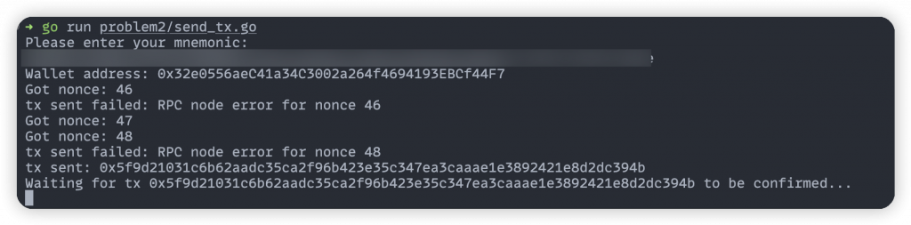

可以看到 Nonce 46 在送出時壞掉，而 Nonce 47 有成功送出，這就導致程式會一直等不到 Nonce 47 的交易被確認上鏈。

除了 Nonce 沒被使用到的問題之外，其實還有另一個情況會導致交易被卡在鏈上，那就是交易的 Gas Price 太低了。雖然有用 `SuggestGasPrice` 去估計要花多少 Gas Price，但在極端情況有可能下一個 block 的 Gas Price 增加很多，而 Gas Price 太低導致的卡鏈也可能高達幾個小時！因此這也是一個需要解決的問題。

#### 5. 解法推導

要解決交易被 Alchemy 拒絕的問題，最簡單的方法就是重試幾次就好，但考量到一隻 API 通常最慢要在幾秒內回傳結果，才不會讓 end user 等太久，因此也不能無限的等待跟重試。這樣當系統流量大時，還是會遇到重試幾次後還是失敗而必須 return error 給前端的狀況。

假設是 Nonce 12 出錯，那當發現這筆交易最終無法被廣播出去時，就必須要讓未來的交易可以重複利用 Nonce 12 來送出交易才行。這樣的好處是 Nonce 13~15 的交易已經發出後，就算過一陣子我們再成功發出 Nonce 12 的交易，礦工可以一起幫 Nonce 12~15 的交易打包上鏈，這樣就能避免掉 Nonce 13~15 卡在 mempool 中的問題。

所以需要建立一個 Nonce Pool 去儲存當下能使用的 Nonce 們，並支援當交易無法被廣播上鏈時，把對應的 Nonce 歸還回 Nonce Pool 的操作。而每次要從 Nonce Pool 中取出新的 Nonce 時，只要取裡面最小的值即可。而能實現這些操作的資料結構就是一個 min heap。

此外如果要解決 Gas Price 太低導致卡鏈的問題，最簡單的方法是固定多給一些 Gas Price，就能很大程度地避免這個問題了。這背後是因為 EIP-1559 中定義了 Base Fee 在下個 block 最多只會比上個 block 增加 12.5%，因此可以根據這個值來估計 Gas Price 的變化幅度上限。

#### 6. 完整解法

先解決 Gas Price 可能太低的問題，最簡單粗暴的作法是拿到建議數值後固定加 30 Gwei：

[code]
    // get gas price
    gasPrice, err := client.SuggestGasPrice(context.Background())
    if err != nil {
    	log.Fatal(err)
    }
    // increase gas price by 30 gwei to avoid stuck tx
    gasPrice = new(big.Int).Add(gasPrice, big.NewInt(30000000000))

[/code]

接下來是 Nonce Pool 的實作，會需要支援以下幾個 function：

[code]
    func NewNoncePool(initialNonce int64) *NoncePool
    func (n *NoncePool) GetNonce() int64
    func (n *NoncePool) ReturnNonce(returnedNonce int64)

[/code]

這樣可以在程式初始化時到鏈上查詢最新的 Nonce 後用 `NewNoncePool` 建立 `NoncePool` ，後續就可以用 `GetNonce()` 拿到 pool 中最小的 Nonce，以及要歸還 Nonce 時使用 `ReturnNonce()` 。可以使用 Go 的 [container/heap](https://pkg.go.dev/container/heap) package 來實作 `NoncePool` 中的 min heap，以下給出這幾個 function 的實作：

[code]
    package main

    import (
    	"container/heap"
    	"sync"
    )

    type IntHeap []int64

    func (h IntHeap) Len() int           { return len(h) }
    func (h IntHeap) Less(i, j int) bool { return h[i] < h[j] }
    func (h IntHeap) Swap(i, j int)      { h[i], h[j] = h[j], h[i] }
    func (h *IntHeap) Push(x interface{}) {
    	*h = append(*h, x.(int64))
    }
    func (h *IntHeap) Pop() interface{} {
    	old := *h
    	n := len(old)
    	x := old[n-1]
    	*h = old[0 : n-1]
    	return x
    }

    type NoncePool struct {
    	nonces IntHeap
    	lock   sync.Mutex
    }

    func NewNoncePool(initialNonce int64) *NoncePool {
    	pool := &NoncePool{}
    	heap.Init(&pool.nonces)
    	heap.Push(&pool.nonces, initialNonce)
    	return pool
    }

    func (n *NoncePool) GetNonce() int64 {
    	n.lock.Lock()
    	defer n.lock.Unlock()

    	// Get min nonce
    	nonce := heap.Pop(&n.nonces).(int64)
    	if n.nonces.Len() == 0 {
    		// Add next nonce if nonce pool is empty
    		heap.Push(&n.nonces, nonce+1)
    	}
    	return nonce
    }

    func (n *NoncePool) ReturnNonce(returnedNonce int64) {
    	n.lock.Lock()
    	defer n.lock.Unlock()

    	heap.Push(&n.nonces, returnedNonce)
    }

[/code]

裡面多使用了 `sync.Mutex` 來確保 `GetNonce()` 跟 `ReturnNonce()` 的操作都是原子性的，避免 Race Condition。另外值得注意的是在 `GetNonce()` 中如果拿完一個 Nonce 後 heap 空了，就要把剛拿出的值 +1 後再丟回去，才能隨時拿到最新的 Nonce 值。

針對 `NoncePool` 的行為我們可以寫個測試來驗證，讀者也可用來檢驗自己的理解：

[code]
    func TestNoncePool(t *testing.T) {
    	pool := NewNoncePool(0)
    	assert.Equal(t, int64(0), pool.GetNonce())
    	assert.Equal(t, int64(1), pool.GetNonce())
    	assert.Equal(t, int64(2), pool.GetNonce())
    	pool.ReturnNonce(0)
    	assert.Equal(t, int64(0), pool.GetNonce())
    	assert.Equal(t, int64(3), pool.GetNonce())
    	assert.Equal(t, int64(4), pool.GetNonce())
    	pool.ReturnNonce(3)
    	pool.ReturnNonce(1)
    	assert.Equal(t, int64(1), pool.GetNonce())
    	assert.Equal(t, int64(3), pool.GetNonce())
    	assert.Equal(t, int64(5), pool.GetNonce())
    }

[/code]

最後把 `NoncePool` 的相關操作整合到 main 中 ，並在發送交易到 Alchemy 時加上最多三次的重試就完成了：

[code]
    // in main()
    // send 6 transaction concurrently
    wg := sync.WaitGroup{}
    for i := 0; i < 8; i++ {
    	wg.Add(1)
    	go func() {
    		tx, nonce, err := sendUniTokenTransferTx(client, account.Address, privateKey)
    		if err == nil {
    			fmt.Printf("tx sent: %s\n", tx.Hash().Hex())
    			waitUntilTxConfirmed(tx, client)
    		} else {
    			fmt.Printf("tx sent failed: %s. Return nonce %d to pool\n", err.Error(), nonce)
    			noncePool.ReturnNonce(nonce)
    		}
    		wg.Done()
    	}()
    }
    wg.Wait()

    // in sendUniTokenTransferTx()
    // get next nonce
    nonce = noncePool.GetNonce()
    fmt.Printf("Got nonce: %d\n", nonce)

    chainID := big.NewInt(11155111)
    amount := rand.Int63n(1000000)
    if rand.Int()%3 == 0 {
    	// simulate RPC node error
    	return nil, nonce, fmt.Errorf("RPC node error for nonce %d", nonce)
    }

    // retry 3 times when sending tx to RPC node
    for i := 0; i < 3; i++ {
    	tx, err = uniToken.Transfer(
    		&bind.TransactOpts{
    			From: common.HexToAddress(address.Hex()),
    			Signer: func(_ common.Address, tx *types.Transaction) (*types.Transaction, error) {
    				return types.SignTx(tx, types.NewEIP155Signer(chainID), privateKey)
    			},
    			Value:    big.NewInt(0),
    			GasPrice: gasPrice,
    			Nonce:    big.NewInt(nonce),
    		},
    		common.HexToAddress("0xE2Dc3214f7096a94077E71A3E218243E289F1067"),
    		big.NewInt(amount),
    	)
    	if err == nil {
    		return
    	}
    	fmt.Printf("tx sent failed for nonce %d. Retrying...\n", nonce)
    	time.Sleep(1 * time.Second)
    }
    return

[/code]

程式碼中把同時發送交易的次數改成 8 次，就能觀察到送出交易至 Alchemy 時收到 429 的情況。執行結果如下：

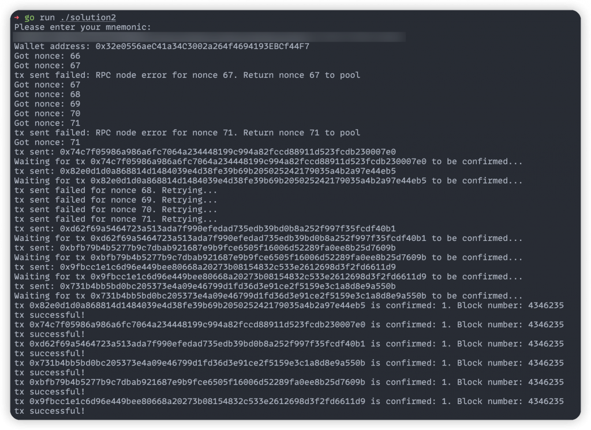

可以看到失敗的兩筆交易的 Nonce 都有被成功歸還回 Nonce Pool，並且部分交易經過重試後全部都能正常送出了！

#### 7. 小結

今天我們深入探討了在後端遇到同時發送交易時，會遇到的問題與解決策略，完整的程式碼在[這裡](https://github.com/a00012025/ironman-2023-web3-fullstack/tree/main/backend/day19)。可以發現這些都是從區塊鏈的機制衍伸出來的問題，因此要寫出高容錯的後端程式必須對區塊鏈知識有深入的了解。最後有兩個問題留給讀者思考與練習，也歡迎在留言區交流：

1. 如果我把後端管理的錢包私鑰導出到 Metamask 中，並在 Metamask 上發送新的交易，這樣既有解法會遇到什麼問題，以及如何解決？
  2. 如何把 Nonce Pool 的狀態紀錄到 Redis 中讓不同的 instance 可以同時對他做 atomic 讀寫？

至此讀者對在後端發送交易已經有十分深入的理解了，接下來會進入到如何在後端整理較複雜的鏈上資料的主題，包含 Token Balance 與交易歷史。

## DAY 20｜Day 20 - Web3 與進階後端：實作即時 ERC-20 Balance

- 原文：https://ithelp.ithome.com.tw/articles/10330773
- 發佈時間：2023-09-29 15:06:34

### 章節內容

#### 1. 未分章內容

今天要來實作的是直接查詢鏈上資料來組合出一個地址的完整 ERC-20 Balance，並且即時偵測該地址在鏈上的 Token Balance 變動。這樣的功能將等於是在 Day 10 中使用的第三方 API 功能，通過實作這功能，我們將更深入了解 Debank、Metamask Portfolio 等資產管理工具背後的機制及挑戰。

#### 2. 取得 ERC-20 Event Logs

在 Day 15 已經深入探討了 Event Logs 的概念。為了計算出完整的 ERC-20 Balance，我們只需取得該地址過去所有的 Token Transfer Event 並對其做加總即可。以 [satoshi.eth](https://etherscan.io/address/0x2089035369B33403DdcaBa6258c34e0B3FfbbBd9) 作為今日的實作範例，目標是要找出該地址在 Ethereum 主網上的所有 ERC-20 Balance。

首先回顧一下 Transfer Event 的結構，它的 Topic 0 是 `keccak256("Transfer(address,address,uint256)")`，Topic 1 與 Topic 2 則分別是代幣轉移的 from 與 to address。所以需要分別查詢匹配轉入和轉出條件的 Event Logs，再將它們組合起來。

值得注意的是這些資料會對應到 Etherscan 上的 Token Transfer Tab，可以發現其實 Etherscan 也是採用同樣的方式來呈現 ERC-20 Token 的轉帳紀錄。

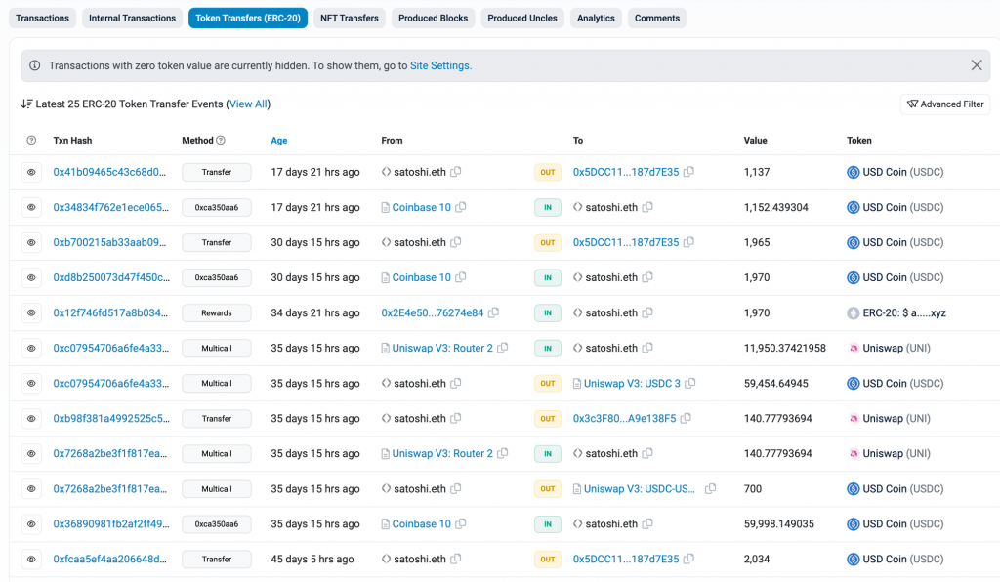

在取得 Event Logs 之前，需要先連接到 Ethereum 主網的 Alchemy RPC Node：

[code]
    // connect to json rpc node
    client, err := ethclient.Dial("wss://eth-sepolia.g.alchemy.com/v2/" + os.Getenv("ALCHEMY_API_KEY"))
    if err != nil {
    	log.Fatal(err)
    }

[/code]

有了 `client` 後，就可以使用 `client.FilterLogs` 方法分別取得轉入和轉出的所有 Logs：

[code]
    const transferEventSignature = "Transfer(address,address,uint256)"

    // transfer out filter query
    transferEventSignatureHash := crypto.Keccak256Hash([]byte(transferEventSignature))
    transferOutQuery := ethereum.FilterQuery{
    	Addresses: []common.Address{},
    	Topics: [][]common.Hash{
    		{transferEventSignatureHash},
    		{common.HexToHash(targetAddress)},
    		{},
    	},
    }
    transferOutLogs, err := client.FilterLogs(context.Background(), transferOutQuery)
    if err != nil {
    	log.Fatalf("Failed to retrieve logs: %v", err)
    }
    fmt.Printf("Got %d transfer out logs\n", len(transferOutLogs))

    // transfer in filter query
    transferInQuery := ethereum.FilterQuery{
    	Addresses: []common.Address{},
    	Topics: [][]common.Hash{
    		{transferEventSignatureHash},
    		{},
    		{common.HexToHash(targetAddress)},
    	},
    }
    transferInLogs, err := client.FilterLogs(context.Background(), transferInQuery)
    if err != nil {
    	log.Fatalf("Failed to retrieve logs: %v", err)
    }
    fmt.Printf("Got %d transfer in logs\n", len(transferInLogs))

[/code]

由於我們想拿到所有 ERC-20 Token Contract 發出的 Event，所以 Addresses 欄位需要填入空陣列，他代表想查詢哪些合約地址發出的 Event Log。再來比較有趣的是 Topics 欄位的值，他是一個二維陣列，可以看一下定義：

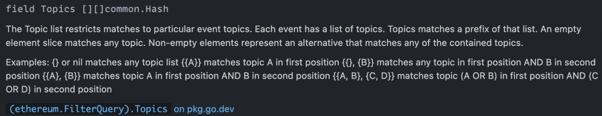

可以看到這個結構能方便指定像這樣的過濾條件：Topic 0 為 `A or B` 且 Topic 1 為 `C or D` 。這樣的好處是能在一次 API Call 中拿到多種類的 Event Log（例如我同時想拿 `Transfer` 跟 `Approve` event 的 logs，就可以在 Topic 0 指定兩個值）。而如果在那個位子不指定的話就放入空陣列即可。

這個取得 Event Log 的功能背後其實是打 `eth_getLogs` 這個 RPC Method，裡面的 topics 參數就提供了這種查詢方式，詳細可以看 Alchemy 的 [eth_getLogs 文件](https://docs.alchemy.com/reference/eth-getlogs)。

拿到這些 Logs 之後，還有一個需要注意的細節，因為這個過濾方式可能還會包含一些不是 ERC-20 Token Transfer 的 Event Log。像 ERC-721 的 Transfer Event 定義如下：

[code]
    event Transfer(address indexed from, address indexed to, uint256 indexed tokenId)

[/code]

可以發現他的 Event Signature（也就是 Log 中的 Topic 0）跟 ERC-20 Transfer 是一樣的，都是 `keccak256(”Transfer(address,address,uint256)”)`，唯一差別是在 ERC-721 Event 的第三個欄位紀錄的是 Token ID，並且他有被 indexed。因此能區分出這兩種 Log 的方式就是 Topics 數量，後續在針對每筆 Log 處理時就要 Filter 掉 Topics 數量不為 3 的 Log。

#### 3. 組出 Token Balance

有了所有轉入跟轉出的 Logs，就可以開始對這些 Logs 進行解析，確定每一筆 Log 代表的 Token 轉移數量，並按照發出該 Log 的 Token Contract Address 去計算該地址的總轉入與總轉出，進而算出他在對應 Token Contract 的餘額。

回顧一下轉移的 Token 數量會被記錄在 Log 的 Data 欄位中，因為他沒有被 indexed，而要從原始的 Log Topics 以及 Data 去解析出需要的資料是比較繁瑣的處理，因此這裡可以善用 ERC-20 的 Go Binding 裡面提供的 `ParseTransfer()` ，可以方便解析出 Transfer Event 中的資料：

[code]
    // get an arbitrary erc20 binding
    erc20Token, err := erc20.NewErc20(common.HexToAddress("0x0000000000000000000000000000000000000000"), client)
    if err != nil {
    	log.Fatalf("Failed to bind to erc20 contract: %v", err)
    }

    // When parsing a log
    transferEvent, err := erc20Token.ParseTransfer(vLog)
    if err != nil {
    	log.Fatalf("Failed to unmarshal Transfer event: %v", err)
    }
    // We can use transferEvent.From, transferEvent.To, transferEvent.Value now

[/code]

有了這些工具後就能順利解析所有的 Logs。為了方便處理可以先合併 Transfer In 跟 Out 的 Logs，並且用一個 `map[string]*big.Int` 來追蹤該地址在每個 Token Contract 的餘額：

[code]
    // calculate token balances
    allLogs := append(transferInLogs, transferOutLogs...)
    tokenBalances := make(map[string]*big.Int)
    for _, vLog := range allLogs {
    	// check if the log is ERC-20 Transfer event
    	if len(vLog.Topics) != 3 {
    		continue
    	}
    	contractAddress := vLog.Address.Hex()

    	// update token balance
    	transferEvent, err := erc20Token.ParseTransfer(vLog)
    	if err != nil {
    		log.Fatalf("Failed to unmarshal Transfer event: %v", err)
    	}
    	if transferEvent.From != transferEvent.To {
    		if _, ok := tokenBalances[contractAddress]; !ok {
    			tokenBalances[contractAddress] = big.NewInt(0)
    		}
    		if vLog.Topics[1] == common.HexToHash(targetAddress) {
    			tokenBalances[contractAddress] = tokenBalances[contractAddress].Sub(tokenBalances[contractAddress], transferEvent.Value)
    		} else {
    			tokenBalances[contractAddress] = tokenBalances[contractAddress].Add(tokenBalances[contractAddress], transferEvent.Value)
    		}
    	}
    }

[/code]

這樣就可以得到初步的 Token Balance 結果了。但這還不夠精準，必須考慮一個重要的問題：這個合約地址是否真的是一個 ERC-20 Token。

#### 4. 判斷合約 Schema

要判斷一個合約地址是否為 ERC-20，可以參考 **[OpenZeppelin](https://docs.openzeppelin.com/contracts/4.x/api/token/erc20#IERC20Metadata)** 的文件，回顧一下 ERC-20 合約應該有哪些介面：

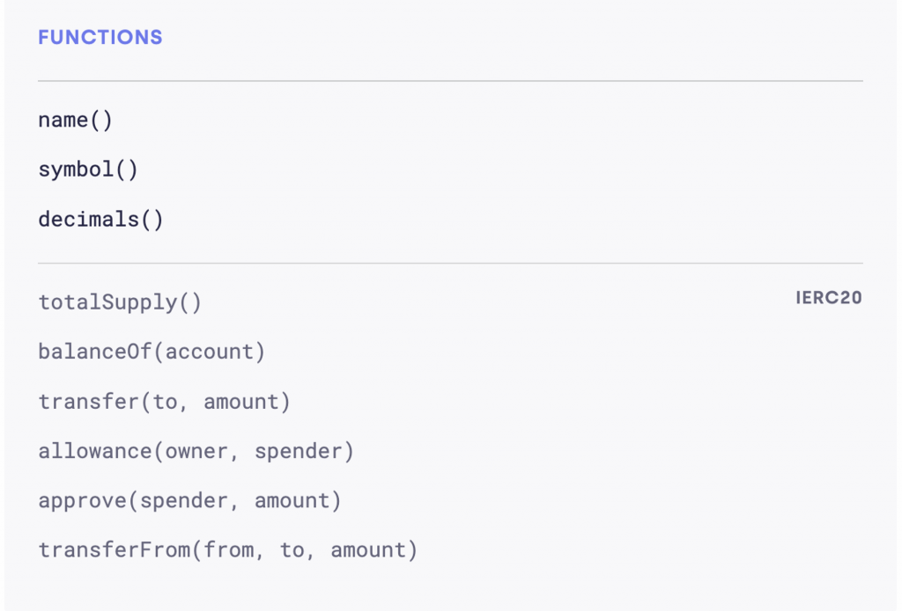

因為要支援所有這些介面才能算是 ERC-20 合約，最直觀的判斷方式就是對每個 function 都嘗試呼叫一次這個合約試試看，如果都得到正常的回覆就代表這個合約有實作對應的 function。如果合約不支援該方法，通常會得到一個 `execution reverted` 的 error。因此這樣就能判斷出他是否（很可能）是 ERC-20 Token。

以下 function 檢查了 ERC-20 的部分方法，並回傳 Token 的 name 和 decimals 來方便後續顯示結果時使用：

[code]
    // getNameAndDecimals get name and decimals if contract is ERC20 token. Otherwise, return error.
    func getNameAndDecimals(client *ethclient.Client, address common.Address) (name string, decimals uint8, err error) {
    	erc20Token, err := erc20.NewErc20(address, client)
    	if err != nil {
    		return
    	}
    	name, err = erc20Token.Name(nil)
    	if err != nil || name == "" {
    		return
    	}
    	symbol, err := erc20Token.Symbol(nil)
    	if err != nil || symbol == "" {
    		return
    	}
    	totalSupply, err := erc20Token.TotalSupply(nil)
    	if err != nil || totalSupply.Cmp(big.NewInt(0)) == 0 {
    		return
    	}
    	decimals, err = erc20Token.Decimals(nil)
    	if err != nil || decimals == 0 {
    		return
    	}
      _, err = erc20Token.BalanceOf(nil, common.HexToAddress("0x0000000000000000000000000000000000000000"))
    	if err != nil {
    		return
    	}
    	fmt.Printf("%s is ERC20 token\n", address.Hex())
    	return
    }

[/code]

這裡只有嘗試呼叫部分方法，是因為像 `transfer` function 如果在 from 地址沒有該 Token 時也會執行失敗，導致無法判斷出錯的原因是來自於合約不支援 transfer function 還是地址餘額不足。

然而此判斷方法並不太有效率，因為要做很多次的鏈上查詢，而且結果也不一定是 100% 準確。不過幸好在許多新的合約標準中會支援 [ERC-165](https://eips.ethereum.org/EIPS/eip-165) 的 `supportsInterface()` 方法，可以迅速確定一個合約是否支援某個特定的 interface。例如， RC-721 和 ERC-1155 都已經要求合約要實作這個 function（[範例](https://docs.openzeppelin.com/contracts/2.x/api/token/erc721#IERC721)），但因為 ERC-20 是早期標準，許多早期部署的 ERC-20 Token Contracts 都沒有支援 ERC-165，因此只能用比較低效率的方法判斷。

一個典型的 ERC-721 合約 `supportsInterface` 的實作如下：

[code]
    bytes4 constant InterfaceID_ERC165 =
      bytes4(keccak256('supportsInterface(bytes4)'));

    bytes4 constant InterfaceID_ERC721 =
      bytes4(keccak256('name()')) ^
      bytes4(keccak256('symbol()')) ^
      bytes4(keccak256('totalSupply()')) ^
      bytes4(keccak256('balanceOf(address)')) ^
      bytes4(keccak256('ownerOf(uint256)')) ^
      bytes4(keccak256('approve(address,uint256)')) ^
      bytes4(keccak256('transfer(address,uint256)')) ^
      bytes4(keccak256('transferFrom(address,address,uint256)')) ^
      bytes4(keccak256('tokensOfOwner(address)'));

    function supportsInterface(bytes4 _interfaceID) external view returns (bool) {
      return ((_interfaceID == InterfaceID_ERC165) || (_interfaceID == InterfaceID_ERC721));
    }

[/code]

可以看到 ERC-721 有一個固定的 interface ID，是由所有包含的 function signature hash 而來。只需使用此 ID 去呼叫合約的 `supportsInterface`，即可確定該合約是否支援 ERC-721 標準了。此方法也可用來檢查一個合約是否有支援任何其他 interface，只要它符合 ERC-165 標準即可。

#### 5. 資料整理與輸出

有了以上知識就可以完成 ERC-20 Token Balance 的程式碼，並把結果輸出。為了豐富輸出結果，程式碼中還加上了輸出 Token Name 以及搭配 Decimals 算出可讀的 Balance 資料。另外因為查詢一個合約地址是否是 ERC-20 會花費比較多時間，可以搭配一個 map 紀錄已查詢過的地址結果：

[code]
    isERC20Contract := make(map[string]bool)
    for _, vLog := range allLogs {
      // ...
      // check if the contract is ERC20 token contract
    	contractAddress := vLog.Address.Hex()
    	if val, ok := isERC20Contract[contractAddress]; ok && !val {
    		// already checked and not ERC20 token contract
    		continue
    	}

    	// get token data
    	if _, ok := tokens[contractAddress]; !ok {
    		name, decimals, err := getNameAndDecimals(client, vLog.Address)
    		if err != nil {
    			// not ERC20 token contract
    			isERC20Contract[contractAddress] = false
    			continue
    		}
    		isERC20Contract[contractAddress] = true
    		tokens[contractAddress] = struct {
    			name     string
    			decimals uint8
    		}{name, decimals}
    	}

      // update token balance
      // ...
    }

    // print token balances
    fmt.Println("Token Balances:")
    for contractAddress, balance := range tokenBalances {
    	if balance.Cmp(big.NewInt(0)) == 0 {
    		continue
    	}
    	balanceStr := decimal.NewFromBigInt(balance, -int32(tokens[contractAddress].decimals))
    	fmt.Printf("%-32s: %s (%s)\n", tokens[contractAddress].name, balanceStr, contractAddress)
    }

[/code]

裡面還用到 [decimal](github.com/shopspring/decimal) package 來計算 `big.Int` 的除法。跑起來的結果如下（只截取部分）：

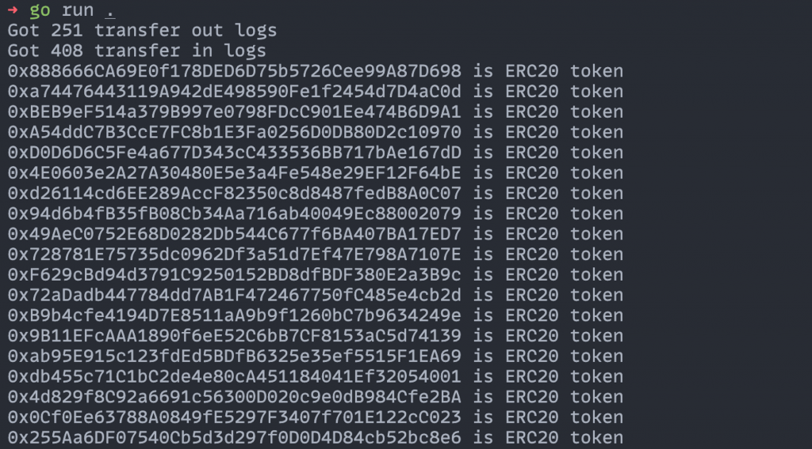

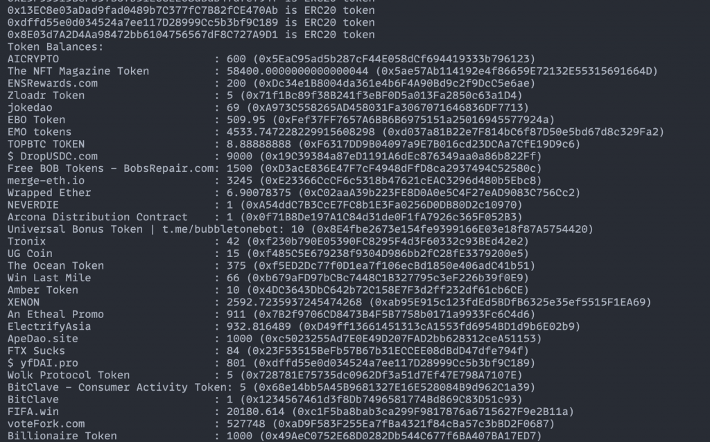

讀者可以把這個結果跟 Etherscan 的 [Token Holdings](https://etherscan.io/tokenholdings?a=0x2089035369B33403DdcaBa6258c34e0B3FfbbBd9) 頁面比較，會發現大部分是吻合的。但還是會有少部分奇怪的結果，例如以下這筆是負的值：

[code]
    USD Coin (USDC).    : -2000 (0x8E03d7A2D4Aa98472bb6104756567dF8C727A9D1)

[/code]

這其實是因為他是[假的 USDC 合約](https://etherscan.io/address/0x8E03d7A2D4Aa98472bb6104756567dF8C727A9D1)，他內部的邏輯允許了就算餘額是 0 還是能觸發 Transfer event，因為他只要在 transfer 前不去檢查 from 地址的餘額就好了。這種合約雖然有實作需要的 ERC-20 function，但實作方式並不符合 ERC-20 要達到的效果。若要更嚴謹的把這種合約過濾掉，可以再加上去查詢目標地址呼叫這個合約的 `balanceOf` 判斷是否跟計算出來的值符合，有的話才代表合約中有好好維護一個地址 Token Balance 的變化。

#### 6. 即時更新 Token Balance

我們已經能拿到一個地址當下的所有 ERC-20 Token Balance，接下來只要能監聽鏈上關於目標地址的所有新 Token Transfer Log，就能即時更新他的 Token Balance。為了展示這個功能，首先把目標地址跟鏈換成我的 Sepolia 地址，並且在連接 RPC Node 時要用 Web Socket 連線才有監聽的功能：

[code]
    const targetAddress = "0x32e0556aeC41a34C3002a264f4694193EBCf44F7"

    // connect to json rpc node
    client, err := ethclient.Dial("wss://eth-sepolia.g.alchemy.com/v2/" + os.Getenv("ALCHEMY_API_KEY"))
    if err != nil {
    	log.Fatal(err)
    }

[/code]

再來就可以用 `client.SubscribeFilterLogs` 搭配前面已經定義過的 `transferOutQuery` 和 `transferInQuery` 來即時接收符合這兩個 Filter 的 Log：

[code]
    // listen to new transfer in/out event
    fmt.Println("Listening to new transfer in/out event...")
    transferOutChan := make(chan types.Log)
    transferOutSub, err := client.SubscribeFilterLogs(context.Background(), transferOutQuery, transferOutChan)
    if err != nil {
    	log.Fatalf("Failed to subscribe to transfer out event: %v", err)
    }
    transferInChan := make(chan types.Log)
    transferInSub, err := client.SubscribeFilterLogs(context.Background(), transferInQuery, transferInChan)
    if err != nil {
    	log.Fatalf("Failed to subscribe to transfer in event: %v", err)
    }

    for {
    	// wait for new transfer event
    	var newLog types.Log
    	select {
    	case err := <-transferOutSub.Err():
    		log.Fatalf("Failed to receive transfer out event: %v", err)
    	case err := <-transferInSub.Err():
    		log.Fatalf("Failed to receive transfer in event: %v", err)
    	case newLog = <-transferOutChan:
    		fmt.Printf("Got transfer out event. hash: %s, address: %s, block: %d, topics: %+v\n", newLog.TxHash, newLog.Address, newLog.BlockNumber, newLog.Topics)
    		// we can get the token name and decimals, then update token balance here
    	case newLog = <-transferInChan:
    		fmt.Printf("Got transfer in event. hash: %s, address: %s, block: %d, topics: %+v\n", newLog.TxHash, newLog.Address, newLog.BlockNumber, newLog.Topics)
    		// we can get the token name and decimals, then update token balance here
    	}
    }

[/code]

這裡就省略更新 Token Balance 的部分。執行起來後會拿到我的地址在 Sepolia 鏈上的 ERC-20 Token Balance 並監聽新的變動。再來使用 day 18 的程式碼來發送 UNI Token Transfer 交易以及 Swap 交易，來看以上程式是否能正確監聽到對應的 Log。以下是發出兩個交易的結果：

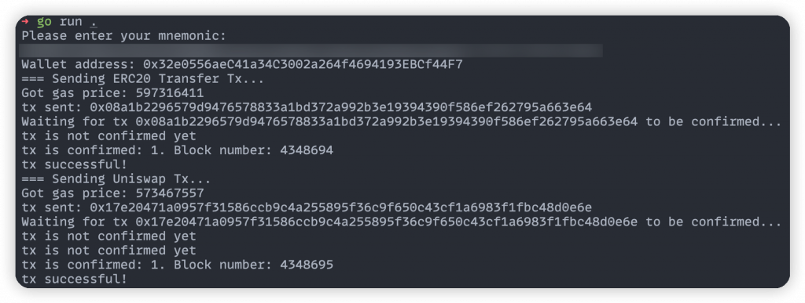

回到今天 script 的輸出視窗，可以看到他成功收到兩個新的 ERC-20 Transfer Event 了，並且 Log 的 Block number 以及 Transaction hash 都是吻合的！

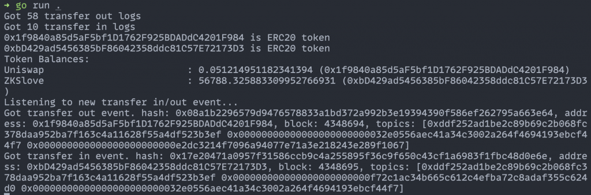

#### 7. 小結

今天我們深入講解了如何自己實作完整的 ERC-20 Token Balance 以及監聽最新的變動，完整程式碼在[這裡](https://github.com/a00012025/ironman-2023-web3-fullstack/tree/main/backend/day20)。實際的後端系統會再多考慮把合約地址的 Schema 存到資料庫中，就可以避免重複查詢。

不過以實際系統需要的 Token Balance 資料來說，還差像 Token Image URL、幣價、同一 Token 在多條鏈上的合約地址等等資訊，才能呈現最完整的結果。這些資料無法直接從鏈上取得，需要結合其他第三方 API 才行（如 coinmarketcap, coingecko 等等）。

另外今天的作法也可用來實作出完整 ERC-721 & ERC-1155 NFT 的餘額，有興趣的讀者可自行嘗試。明天會講解如何解析並整理出一個地址的交易歷史資料。

## DAY 21｜Day 21 - Web3 與進階後端：交易歷史資料整理

- 原文：https://ithelp.ithome.com.tw/articles/10331449
- 發佈時間：2023-09-30 15:05:54

### 章節內容

#### 1. 未分章內容

用戶在以太坊上可以進行各式各樣類型的交易，像是發送 ETH, Transfer Token, Swap, 合約互動, 買賣 NFT 等等，但原始的區塊鏈資料並沒有直接定義這些交易類型，導致有時用戶很難理解一筆交易實際上發生了什麼事情。為了提高區塊鏈資料的可讀性，今天我們會介紹如何整理以太坊上的交易歷史資料，並區分出不同類型的交易，包含 Send, Receive, Swap, Wrap, Unwrap 等等，作為 Web3 與進階後端主題的收尾。

#### 2. Internal Transaction

為了整理出完整的交易歷史資料，還有一個以太坊交易中的概念之前沒有提過，也就是 internal transaction。舉個實際的交易作為例子：https://sepolia.etherscan.io/tx/0xcc07567295055673a1b7cc909976a154f183fd5c0707b8dab9b900887af556b9

這是我在 Sepolia 上把 UNI Token 轉換成 ETH 的交易，可以看到在 Interacted With 中有個把 ETH 轉移給我的紀錄，而這個紀錄的詳細資訊會顯示在 Internal Txns Tab 中：

到這裡就能比較清楚 internal transaction 的作用了，他其實就是在智能合約執行時由該合約觸發的交易。當一個智能合約與其他合約或地址互動時（例如轉移 ETH 或呼叫其他合約的函數），這些呼叫都會被紀錄在 internal transactions 中。

與 Internal Transaction 相對應的概念就是 External Transaction，他指的是直接由外部帳戶（也稱為 Externally Owned Account, EOA）發起並發送到以太坊網路的交易。這些交易可以是轉移 ETH 到另一個地址，或者是呼叫一個智能合約。

因此可以看到 Etherscan 上針對一個地址顯示的交易歷史中，第一個 Transactions Tab 就是顯示這個地址相關的 External Transactions，第二第三個 Tab 則分別是 Internal Transactions 與 ERC-20 Token Transfer，下圖為範例地址 [satoshi.eth](https://etherscan.io/address/0x2089035369b33403ddcaba6258c34e0b3ffbbbd9) 的呈現：

可以看到這三個 Tab 中有一些 Transaction Hash 是一樣的，因為一筆 External Transaction 中可以同時觸發多筆 Internal Transaction 跟多筆 ERC-20 Token Transfer，因此接下來就需要按照 Tx Hash 去整理交易歷史。另外今天只會先處理 ERC-20 Token 的轉移紀錄，因此會先忽略 ERC-721 與 ERC-1155 NFT 的相關紀錄。

#### 3. 取得原始交易歷史資料

由於我們需要取得一個地址過往的所有 Internal Transactions 列表才能組出完整的交易歷史，Alchemy 目前沒有提供這個 API，因此今天的實作會使用 [Etherscan API](https://etherscan.io/apis)，讀者可以先到官網註冊一個帳號，並到 [API Key 頁面](https://etherscan.io/myapikey)建立免費的 Key。

Etherscan 提供了方便的 API 可以直接取得一個地址的所有 External Tx, Internal Tx 以及 ERC-20 Token Transfer（[相關文件](https://docs.etherscan.io/api-endpoints/accounts)），別人也已經寫好 [etherscan-api package](https://github.com/nanmu42/etherscan-api) 方便我們呼叫這幾個 API。從這三個 API 取得資料後就可以按照 Tx Hash 把相關的紀錄歸類在一起，方便後續的處理。以下程式碼就定義了 `CombinedTransaction` 結構代表一筆交易相關的紀錄，並將三個 Etherscan API 的資料整理成 `map[string]*CombinedTransaction` 結構：

[code]
    import (
      "github.com/nanmu42/etherscan-api"
    )

    const targetAddress = "0x2089035369B33403DdcaBa6258c34e0B3FfbbBd9"

    type CombinedTransaction struct {
    	Hash           string
    	ExternalTx     *etherscan.NormalTx
    	InternalTxs    []etherscan.InternalTx
    	ERC20Transfers []etherscan.ERC20Transfer
    }

    func main() {
    	client := etherscan.New(etherscan.Mainnet, os.Getenv("ETHERSCAN_API_KEY"))

    	// Get all transactions
    	externalTxs, err := client.NormalTxByAddress(targetAddress, nil, nil, 1, 0, true)
    	if err != nil {
    		log.Fatalf("Failed to retrieve transactions: %v", err)
    	}
    	internalTxs, err := client.InternalTxByAddress(targetAddress, nil, nil, 1, 0, true)
    	if err != nil {
    		log.Fatalf("Failed to retrieve transactions: %v", err)
    	}
    	addr := targetAddress
    	erc20TokenTxs, err := client.ERC20Transfers(nil, &addr, nil, nil, 1, 0, true)
    	if err != nil {
    		log.Fatalf("Failed to retrieve ERC20 transfers: %v", err)
    	}

    	// Use a map to combine transactions by their hash
    	transactionsByHash := make(map[string]*CombinedTransaction)
    	for i, tx := range externalTxs {
    		transactionsByHash[tx.Hash] = &CombinedTransaction{
    			Hash: tx.Hash,
    			// avoid pointer to loop variable
    			ExternalTx: &externalTxs[i],
    		}
    	}
    	for _, tx := range internalTxs {
    		if combined, exists := transactionsByHash[tx.Hash]; exists {
    			combined.InternalTxs = append(combined.InternalTxs, tx)
    		} else {
    			transactionsByHash[tx.Hash] = &CombinedTransaction{
    				Hash:        tx.Hash,
    				InternalTxs: []etherscan.InternalTx{tx},
    			}
    		}
    	}
    	for _, tx := range erc20TokenTxs {
    		if combined, exists := transactionsByHash[tx.Hash]; exists {
    			combined.ERC20Transfers = append(combined.ERC20Transfers, tx)
    		} else {
    			transactionsByHash[tx.Hash] = &CombinedTransaction{
    				Hash:           tx.Hash,
    				ERC20Transfers: []etherscan.ERC20Transfer{tx},
    			}
    		}
    	}
    }

[/code]

需要特別注意的是，一筆 `CombinedTransaction` 中可以沒有 `ExternalTx`，例如有一筆交易是 A 轉了 10 USDC 給 B，這筆交易就會是 A 的 External Tx 而不會是 B 的，因此在計算 B 的交易歷史時的這筆 `CombinedTransaction` 就只會有一筆 `etherscan.ERC20Transfer` 資料。接下來就可以判斷一筆交易的類型了。

#### 4. 交易類型判斷

基於現有的 `CombinedTransaction` 資料可以判斷出幾種交易類型，包含：

* Send (ETH or ERC-20 Token)
  * Receive (ETH or ERC-20 Token)
  * Swap (代幣交換)
  * Contract Execution (執行合約)

對用戶來說發送 ETH 或發送 ERC-20 Token 都算是送出資產的一種，只是背後的資料來源不同，因此要整理出這筆交易有哪些資產餘額的變化，把 ETH 跟 ERC-20 Token 一起看待。至於 Swap 則是判斷這筆交易是否包含了送出一筆資產與得到一筆資產。其他類型的交易就暫時當作是 Contract Execution。

可以先實作出 `GetTokenChanges()` 來回傳這筆交易中有哪些資產餘額的變化，程式碼如下：

[code]
    func (c *CombinedTransaction) GetTokenChanges() map[string]*big.Int {
    	// Calculate token balance changes
    	tokenChanges := make(map[string]*big.Int)

    	// External ETH transaction
    	if c.ExternalTx != nil {
    		value := new(big.Int)
    		value.SetString(c.ExternalTx.Value.Int().String(), 10)
    		tokenChanges["ETH"] = value.Neg(value)
    	} else {
    		tokenChanges["ETH"] = big.NewInt(0)
    	}
    	// Internal ETH transaction
    	for _, intTx := range c.InternalTxs {
    		value := new(big.Int)
    		value.SetString(intTx.Value.Int().String(), 10)
    		if strings.EqualFold(intTx.From, targetAddress) {
    			tokenChanges["ETH"].Sub(tokenChanges["ETH"], value)
    		} else {
    			tokenChanges["ETH"].Add(tokenChanges["ETH"], value)
    		}
    	}
    	// ERC20 token transfer
    	for _, erc20 := range c.ERC20Transfers {
    		value := new(big.Int)
    		value.SetString(erc20.Value.Int().String(), 10)
    		if strings.EqualFold(erc20.From, targetAddress) {
    			if _, exists := tokenChanges[erc20.ContractAddress]; !exists {
    				tokenChanges[erc20.ContractAddress] = new(big.Int)
    			}
    			tokenChanges[erc20.ContractAddress].Sub(tokenChanges[erc20.ContractAddress], value)
    		} else {
    			if _, exists := tokenChanges[erc20.ContractAddress]; !exists {
    				tokenChanges[erc20.ContractAddress] = new(big.Int)
    			}
    			tokenChanges[erc20.ContractAddress].Add(tokenChanges[erc20.ContractAddress], value)
    		}
    	}
    	// Remove zero balances
    	for token, balance := range tokenChanges {
    		if balance.Int64() == 0 {
    			delete(tokenChanges, token)
    		}
    	}
    	return tokenChanges
    }

[/code]

裡面針對 External Tx, Internal Tx, ERC-20 Transfer 各自有不同的處理邏輯。External Tx 中會有該地址發出的 ETH 數量，而 Internal Tx 可能是發送或接收 ETH，ERC-20 Transfer 則是發送或接收 Token，也要根據 From 是否等於該地址來決定是要增加還是減少 Token 餘額。

有了 `GetTokenChanges()` 後，就能基於他的結果來實作 `Type()` 以判斷出 Swap, Send, Receive, Contract Execution 這幾種類型：

[code]
    type TransactionType string
    const (
    	Send              TransactionType = "Send"
    	Receive           TransactionType = "Receive"
    	Swap              TransactionType = "Swap"
    	ContractExecution TransactionType = "ContractExecution"
    )

    func (c *CombinedTransaction) Type() TransactionType {
    	tokenChanges := c.GetTokenChanges()
      if len(tokenChanges) > 1 {
    		// Check Swap: 2 tokens, 1 positive, 1 negative
    		if len(tokenChanges) == 2 {
    			sign := 1
    			for _, balanceChange := range tokenChanges {
    				sign *= balanceChange.Sign()
    			}
    			if sign < 0 {
    				return Swap
    			}
    		}
    		return ContractExecution
    	}

    	// Check it's a Send or Receive
    	for _, balanceChange := range tokenChanges {
    		if balanceChange.Sign() < 0 {
    			return Send
    		} else if balanceChange.Sign() > 0 {
    			return Receive
    		}
    	}

    	return ContractExecution
    }

[/code]

到這裡就能判斷出幾個基本的交易類型了。但其實還有兩種交易我們沒有考慮到，也就是 Wrap 跟 Unwrap。

#### 5. Wrap & Unwrap 交易

在前面一些交易紀錄中，讀者可能會看到 Wrapped ETH 這個 ERC-20 Token，他跟 ETH 是怎樣的關係呢？其實 Wrapped ETH (WETH) 就是 ETH 的 ERC-20 版本。由於 ETH 本身是以太坊的原生代幣，不符合 ERC-20 標準，因此有時在智能合約中想要以 ERC-20 介面來操作 Token Contract 時，會產生 ETH 無法與之兼容的問題。

Wrapped ETH 就是為了解決這個問題而被創造出來的 ERC-20 合約，作為一種可以代表 ETH 並且完全符合 ERC-20 標準的 Token。當我想從 ETH 換成 WETH 時，其實是把 ETH 打進 WETH 的智能合約中，他就會幫我的 WETH 餘額增加對應的數量，這個過程被稱為 Wrap。範例的 Wrap 交易可以看這筆：https://etherscan.io/tx/0x48a878f061909863ad85d90d2a310d552922bb5eccd80446f1714afcc35093fc

而這筆交易並沒有產生任何 ERC-20 Token Transfer，因此在上面的程式碼會把這筆交易判斷成 Send ETH，而忽略了 WETH 合約會讓他的 WETH 餘額增加這件事。

至於 Unwrap 操作則指的是把 WETH 轉換回 ETH 的過程，只要呼叫 WETH 合約的 `withdraw()` 方法，就能把對應數量的 ETH 取回來。範例交易可以看這筆：https://etherscan.io/tx/0x9de1782def03d84b8436cf6b738945628594ab80d6a287fd24f9deb2494a3565

因此在 `CombinedTransaction.Type()` 中，就可以加上對應的邏輯來判斷 Wrap 與 Unwrap 交易。Wrap 對應到當下交易是發送給 WETH Contract 且 value > 0 的交易，Unwrap 的條件則是有從 WETH 合約收到 Internal Transaction 轉來的 ETH，實作如下：

[code]
    const wethAddress = "0xC02aaA39b223FE8D0A0e5C4F27eAD9083C756Cc2"
    const (
      Unwrap            TransactionType = "Unwrap"
    	Swap              TransactionType = "Swap"
    )

    // Check for Wrap/Unwrap
    if c.ExternalTx != nil && strings.EqualFold(c.ExternalTx.To, wethAddress) {
    	// Check for Wrap
    	if c.ExternalTx.Value != nil && c.ExternalTx.Value.Int().Cmp(big.NewInt(0)) > 0 {
    		return Wrap
    	}

    	// Check for Unwrap
    	if c.ExternalTx.Value.Int().String() == "0" && len(c.InternalTxs) > 0 {
    		internalTx := c.InternalTxs[0]
    		if strings.EqualFold(internalTx.To, targetAddress) {
    			return Unwrap
    		}
    	}
    }

[/code]

#### 6. 交易內容總結

為了提升交易內容輸出的可讀性，可以再實作 `CombinedTransaction.Summary()` 來提供該筆交易的總結，基於不同的交易類型回傳對應的詳細內容：

[code]
    func (c *CombinedTransaction) Summary() string {
    	txType := c.Type()
    	tokenChanges := c.GetTokenChanges()
    	tokens := make([]string, 0, len(tokenChanges))
    	for k := range tokenChanges {
    		tokens = append(tokens, k)
    	}

    	switch txType {
    	case Send:
    		return fmt.Sprintf("Sent %s %s", tokenChanges[tokens[0]].Neg(tokenChanges[tokens[0]]).String(), tokens[0])
    	case Receive:
    		return fmt.Sprintf("Received %s %s", tokenChanges[tokens[0]].String(), tokens[0])
    	case Wrap:
    		return fmt.Sprintf("Wrapped %s ETH to WETH", c.ExternalTx.Value.Int().String())
    	case Unwrap:
    		return fmt.Sprintf("Unwrapped WETH to %s ETH", c.InternalTxs[0].Value.Int().String())
    	case Swap:
    		return "Swap Token"
    	case ContractExecution:
    		return "Executed a contract"
    	default:
    		return "Unknown transaction type"
    	}
    }

[/code]

#### 7. 輸出結果

有了交易類型與總結資料後，最後就能輸出交易歷史了。但由於前面是使用 map 來整理所有的 `CombinedTransaction` ，這會讓交易輸出的順序亂掉，理想上應該要按照交易發生的時間由新到舊來顯示，才比較符合 Etherscan 的呈現。而這可以透過交易的 `BlockNumber` 由大到小來排序，排序後就能輸出整理後的交易歷史了：

[code]
    func (c *CombinedTransaction) BlockNumber() int {
    	if c.ExternalTx != nil {
    		return c.ExternalTx.BlockNumber
    	}
    	if len(c.InternalTxs) > 0 {
    		return c.InternalTxs[0].BlockNumber
    	}
    	if len(c.ERC20Transfers) > 0 {
    		return c.ERC20Transfers[0].BlockNumber
    	}
    	return 0
    }

    // in main()
    // sort hash from newest to oldest by block number
    txHashs := make([]string, 0, len(transactionsByHash))
    for hash := range transactionsByHash {
    	txHashs = append(txHashs, hash)
    }
    sort.Slice(txHashs, func(i, j int) bool {
    	return transactionsByHash[txHashs[i]].BlockNumber() > transactionsByHash[txHashs[j]].BlockNumber()
    })

    // Summarize for each combined transaction
    for _, hash := range txHashs {
    	combinedTx := transactionsByHash[hash]
    	fmt.Printf("Transaction %s: %s\n", combinedTx.Hash, combinedTx.Summary())
    }

[/code]

最後輸出的結果如下（只截取部分輸出）。由於把 ERC-20 Token 的顯示轉換成有小數點的 Balance 以及 Token Name 並不是今天的實作重點，若想呈現更好看的結果可以由讀者自行練習。

可以看到已經成功分類出不同類型的交易了！這個地址六種類型的交易都有出現在歷史中，以下各提供一個範例讓讀者參考：

* Send: [Tx](https://etherscan.io/tx/0x41b09465c43c68d0b82c7cbca4f527667594a9fd16f6b89dbe74c754e6acc077)
  * Receive: [Tx](https://etherscan.io/tx/0x34834f762e1ece0656d66b9029dfed519102efed737e0eb7dcd7f12cdda8beaa)
  * Wrap: [Tx](https://etherscan.io/tx/0x48a878f061909863ad85d90d2a310d552922bb5eccd80446f1714afcc35093fc)
  * Unwrap: [Tx](https://etherscan.io/tx/0x9de1782def03d84b8436cf6b738945628594ab80d6a287fd24f9deb2494a3565)
  * Swap: [Tx](https://etherscan.io/tx/0xc07954706a6fe4a334f03dfbf9b3b644806c228300c24fc5abede5c497953628)
  * Contract Execution: [Tx](https://etherscan.io/tx/0x70fc1de57e2be8e0ccf4e66112aa4dfc987745189ea04848335eec632b9022fe)

#### 8. 小結

今天我們深入講解了在後端如何整理出完整的交易歷史資料，並呈現可讀性更高的資料給使用者，完整程式碼在[這裡](https://github.com/a00012025/ironman-2023-web3-fullstack/tree/main/backend/day21)。

像 Debank, Zerion 等服務也會呈現一個地址的好讀版的交易歷史，背後就會用到類似的技巧來整理資料，可以參考 Debank 對於今天範例地址的呈現方式：https://debank.com/profile/0x2089035369b33403ddcaba6258c34e0b3ffbbbd9/history?chain=eth

此外一般這種服務也會把 NFT 相關的交易類型考慮進來，如 Send NFT, Receive NFT, Buy NFT, Sell NFT 等等，Etherscan 也有相關的 NFT Transfer History API 可以使用（例如 [tokennfttx](https://docs.etherscan.io/api-endpoints/accounts#get-a-list-of-erc721-token-transfer-events-by-address)），因此只要依循今天的架構去整理資料即可，至於這些交易類型的判斷方式就留給讀者當做練習。

以上是 Web3 與進階後端主題的內容，接下來我們會回到 Web3 與進階 App 開發的主題，來探討 App 中還會遇到哪些更深入的問題，以及一些重要的錢包功能（如 Wallet Connect, DApp Browser）是如何實作的。

## DAY 22｜Day 22 - Web3 與進階 App：交易管理與 Mempool 監聽

- 原文：https://ithelp.ithome.com.tw/articles/10332160
- 發佈時間：2023-10-01 16:02:03

### 章節內容

#### 1. 未分章內容

在錢包 App 中讓使用者清楚了解即時的交易狀態並擁有掌控權是十分重要的，這樣能讓使用者感受到更高的確定性，也提升了使用者體驗。因此交易管理是個重要的功能，今天會介紹在錢包 App 中可以透過怎樣的方式管理已發出的交易，包含取消、加速交易等操作，以及如何透過監聽 Mempool 中的交易資料來即時知道被卡在鏈上的交易有哪些。

#### 2. Gas Fee 太低的問題

一般的錢包 App 都會提供使用者自己設定交易 Gas Fee 的功能，這樣當使用者覺得一筆交易的執行速度沒有那麼重要時，可以設定一個較低的 Gas Fee 來節省成本。而當發出的交易 Gas Fee 太低時，在鏈上就會呈現 Pending 狀態，例如 Etherscan 上會在合約的交易列表中顯示 Pending 的交易：

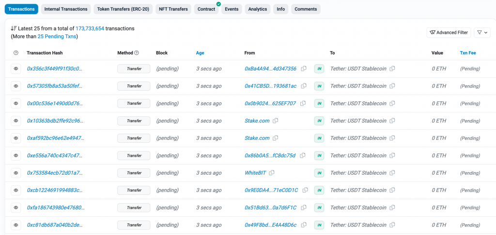

如果交易的 Gas Price 越低，那他卡在 Pending 狀態的時間就會越長，因為要等到區塊鏈網路的 Gas Price 降到它指定的價格時，交易才能成功上鏈。因此一筆交易若 Gas Fee 太低可能會卡在鏈上好幾天！

有個網站叫 [TxStreet](https://txstreet.com/)，可以看到比特幣跟以太坊網路即時的區塊狀態以及打包交易上鏈的圖像化過程，以及這些交易是從哪些 DApp 而來，非常有趣推薦讀者進去看看。圖中左邊呈現的以太坊狀態可以看到當下有 75000 以上個 Pending Transaction：

Pending Transaction 常常造成初次使用以太坊的人的困擾，因為當上一筆交易還在 Pending 時又往後送出了幾筆交易，也全部都會一起被卡住，讓使用者以為交易都發不出去。這樣有什麼好方法可以提升使用者體驗呢？

#### 3. 管理 Pending 交易

既然使用者的意圖有時就是想設定一個比較低的 Gas Fee，導致交易會花更多時間才上鏈，因此一種做法是：告訴使用者這筆交易的 Gas Price 大約會花多久才能上鏈，並即時更新這個數字。

Etherscan 有提供一個 API 來估計給訂一個 Gas Price 的交易大概需要花幾秒才能上鏈，也就是 [gasestimate](https://docs.etherscan.io/api-endpoints/gas-tracker#get-estimation-of-confirmation-time) API。使用方式很簡單：

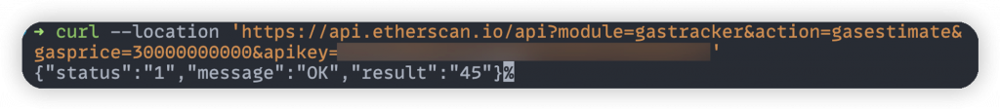

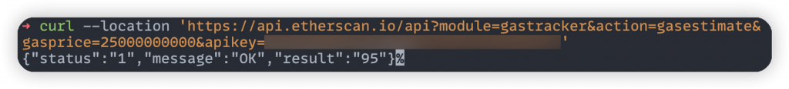

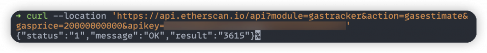

由於當下的建議 Gas Price 為 24 Gwei，嘗試估計 30 Gwei, 25 Gwei, 20 Gwei 的結果分別是 45 秒, 95 秒, 一小時，這樣的結果是合理的，因為如果送出的 Gas Price 跟當下建議的 Gas Price 差不多，也很難保證接下來幾個 block 的 Gsa Fee 不會馬上變高。而 20 Gwei 估計出一小時的原因是他無法預測 Gas Fee 何時才會降到 20 Gwei，這種情況 Etherscan 自己就會顯示待確認時間為「>1 小時」。同樣的判斷邏輯就可以應用在錢包 App 的顯示上。

除了估計 Transaction Pending 的時間外，當使用者有 Pending Transaction 且又想發送新的交易時，也要注意避免新的交易用到跟舊交易一樣的 Nonce 導致交易被覆蓋掉。要了解這個細節可以先回顧在 day 13 中提到的 Token Transfer Transaction 實作：

[code]
    final transferTx = Transaction.callContract(
      contract: contract,
      function: transferFunction,
      parameters: [EthereumAddress.fromHex(toAddress), amount],
      maxFeePerGas: await web3Client.getGasPrice(),
      maxPriorityFeePerGas: await getMaxPriorityFee(),
    );
    final tx = await signTransaction(
      privateKey: privateKey,
      transaction: transferTx,
    );

[/code]

裡面並沒有指定 Nonce，而是讓 `web3dart` 套件幫我們處理，因此要進去看他內部是如何實作拿 Nonce 的。稍微 trace 一下 code 會找到 `_fillMissingData()` function 內會把沒有設定的 Nonce 值補上：

[code]
    Future<_SigningInput> _fillMissingData({
      required Credentials credentials,
      required Transaction transaction,
      int? chainId,
      bool loadChainIdFromNetwork = false,
      Web3Client? client,
    }) async {
      // ...
      final nonce = transaction.nonce ??
          await client!
              .getTransactionCount(sender, atBlock: const BlockNum.pending());
      // ...
    }

[/code]

可以看到他去呼叫了 RPC Node 的 `eth_getTransactionCount` 方法，並帶入 `atBlock = pending` 的參數。這個參數的意義可以在 [Alchemy 的文件](https://docs.alchemy.com/reference/eth-gettransactioncount)中找到：

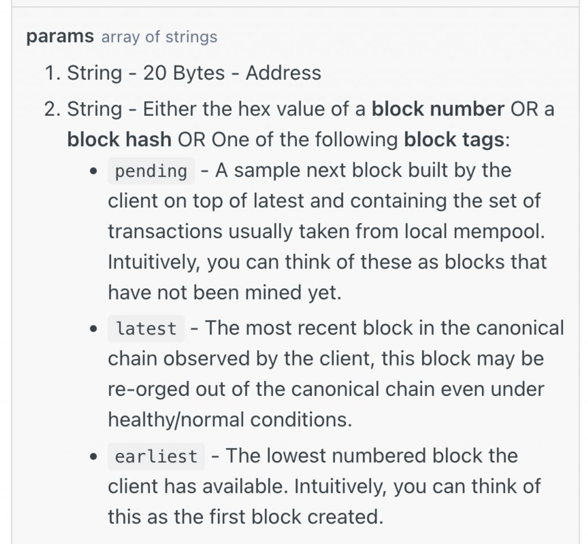

這個參數主要是指定要以什麼時間點來查詢當下的資料，因此我也可以用它來查詢過去某個 block 時某個地址已經發出的幾個交易，許多 RPC method 都有支援這個參數。

至於 `pending` 指的是也把還在 Pending 狀態的交易也考慮進來算一個地址的 Transaction Count，背後是因為 Alchemy 可以在自己的 Mempool 中追蹤一個地址有哪些 Pending Transaction。因此到這裡我們就理解了 `web3dart` 套件在發送交易時更細緻的行為：如果使用者連續發送多筆交易但前面的交易還在 pending 狀態的話，他還是能正確查到下一筆交易的 Nonce 應該要用多少，而不會誤把舊的交易覆蓋掉。

#### 4. 取消或加速交易

如果使用者沒有想發送新的交易，而是改變心意了想要上一筆交易盡快確認，或是不想執行交易了，那要怎麼處理呢？可以反過來利用以太坊中同樣的 Nonce 只會有一筆交易上鏈的特性，把使用者上一個執行的交易覆蓋掉。

例如當使用者想取消交易時，常見的作法是發一筆交易轉 0 ETH 給自己，並且 Gas Fee 必須至少比上一筆同 Nonce 的交易高 10%（否則會出現 Day 19 提到的 Replacement Transaction Underpriced 錯誤）。會發送轉 ETH 交易的原因是他所花的 Gas 數量是所有以太坊交易中最低的（也就是 21,000），可以節省這筆交易的 Gas Fee。實作基於 Day 13 的程式碼改寫如下：

[code]
    class TransactionWithHash {
      final String hash;
      final Transaction transaction;

      TransactionWithHash({
        required this.hash,
        required this.transaction,
      });
    }

    Future<TransactionWithHash> sendCancelTransaction({
      required EthPrivateKey privateKey,
      required int nonce,
      required EtherAmount lastGasPrice,
    }) async {
      try {
        // 20% up
        final newGasPrice =
            lastGasPrice.getInWei * BigInt.from(6) ~/ BigInt.from(5);
        final cancelTx = Transaction(
          from: privateKey.address,
          to: privateKey.address,
          maxFeePerGas: EtherAmount.inWei(newGasPrice),
          maxPriorityFeePerGas: EtherAmount.inWei(newGasPrice),
          maxGas: 21000,
          value: EtherAmount.zero(),
          nonce: nonce,
        );
        final tx = await signTransaction(
          privateKey: privateKey,
          transaction: cancelTx,
        );
        print('tx: $tx , nonce: $nonce');
        final txHash = await sendRawTransaction(tx);
        print('txHash: $txHash');
        return TransactionWithHash(hash: txHash, transaction: cancelTx);
      } catch (e) {
        rethrow;
      }
    }

[/code]

並且把原本 Send Token 的交易實作計算 Gas Fee 時，給他比較低的 Gas Fee，包含把 Max Priority Fee 設定為 0，就能演示這個取消交易的功能：

[code]
    // in sendTokenTransaction()
    // ...
    final nonce = await web3Client.getTransactionCount(
      EthereumAddress.fromHex(privateKey.address.hex),
      atBlock: const BlockNum.pending(),
    );

    var maxFeePerGas = await web3Client.getGasPrice();
    maxFeePerGas = EtherAmount.inWei(maxFeePerGas.getInWei - BigInt.from(1));
    var maxPriorityFeePerGas = EtherAmount.zero();

    final transferTx = Transaction.callContract(
      contract: contract,
      function: transferFunction,
      parameters: [EthereumAddress.fromHex(toAddress), amount],
      maxFeePerGas: maxFeePerGas,
      maxPriorityFeePerGas: maxPriorityFeePerGas,
      nonce: nonce,
    );
    // ...

[/code]

並在畫面上加上取消交易的按鈕，以呈現發出一筆交易後再發出取消交易可以把上一筆覆蓋掉的效果：

[code]
    class _MyHomePageState extends State<MyHomePage> {
      Transaction? lastTx;
      List<String> ethTxHashs = [];

      void sendToken() {
        final ethPriKey = EthPrivateKey.fromHex(ethWallet!.privKey!);
        sendTokenTransaction(
          privateKey: ethPriKey,
          contractAddress: uniContractAddress,
          toAddress: "0xE2Dc3214f7096a94077E71A3E218243E289F1067",
          amount: BigInt.from(10000),
        ).then((tx) {
          setState(() {
            ethTxHashs.add(tx.hash);
            lastTx = tx.transaction;
          });
        });
      }

      void sendCancelTx() {
        if (lastTx == null) {
          return;
        }
        final ethPriKey = EthPrivateKey.fromHex(ethWallet!.privKey!);
        sendCancelTransaction(
          privateKey: ethPriKey,
          nonce: lastTx!.nonce!,
          lastGasPrice: lastTx!.maxFeePerGas!,
        ).then((tx) {
          setState(() {
            ethTxHashs.add(tx.hash);
          });
        });
      }
    // ...

    // in build()
    SizedBox(
      width: 250,
      height: 50,
      child: ElevatedButton(
        onPressed: sendToken,
        child: const Text('Send Tx (low gas price)'),
      ),
    ),
    const SizedBox(height: 10),
    SizedBox(
      width: 250,
      height: 50,
      child: ElevatedButton(
        onPressed: sendCancelTx,
        child: const Text('Send Cancel Tx'),
      ),
    )
    // ...

[/code]

實際跑起來後，如果點擊 Send Tx 後會發現對應的 Tx Hash 在 Sepolia 會找不到（[沒上鏈的交易](https://sepolia.etherscan.io/tx/0x5882803a2cacc3363d633d78075ac5b329d2d58b9838531b345dacc00b2440a3)），因為 Gas Fee 太低他不會馬上上鏈，而再點擊 Send Cancel Tx 後新的交易反而會上鏈（[有上鏈的交易](https://sepolia.etherscan.io/tx/0x5882803a2cacc3363d633d78075ac5b329d2d58b9838531b345dacc00b2440a3)）。

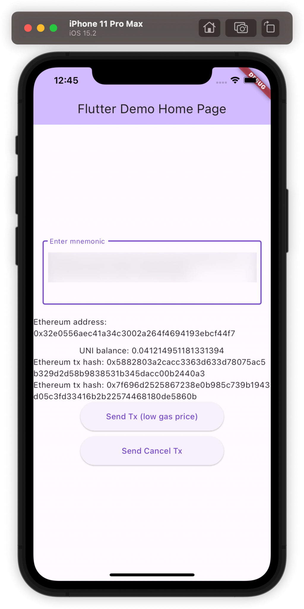

至於加速交易的寫法也很類似，只要把上一筆交易的欄位原封不動留下，並把 Gas Price 增加重新發出即可，相關程式碼在這邊就省略。

若使用以上解法來管理已送出的交易，在單一裝置使用錢包時就可以做到清楚明瞭的使用者體驗了。但還有一種比較邊緣的情況沒有考慮到，就是當使用者用同一個錢包地址在其他平台（例如瀏覽器 Extension）發送過一個低 Gas Fee 的交易，有沒有機會在 App 上也呈現這筆交易的內容以便使用者加速或取消它呢？

#### 5. Mempool 介紹

在 Day 19 也有稍微提到以太坊 Mempool 的概念，他是 Memory Pool 的簡稱，簡單來說這個地方聚集了所有已經廣播出去但還沒上鏈的交易。當我們呼叫一個 RPC 節點的 `eth_sendRawTransaction` 方法時，等於是請該節點幫我們廣播這筆交易給所有其他以太坊的節點，節點就會把這些交易存在自己的 Memory 中，就形成了 Mempool。

在這些節點中如果有開啟挖礦功能的就是以太坊的礦工，他們會負責決定下一批要被打包的交易有哪些（通常會按照給的 Gas Price 由高而低排序），而未上鏈的交易來源就會從 Mempool 而來。

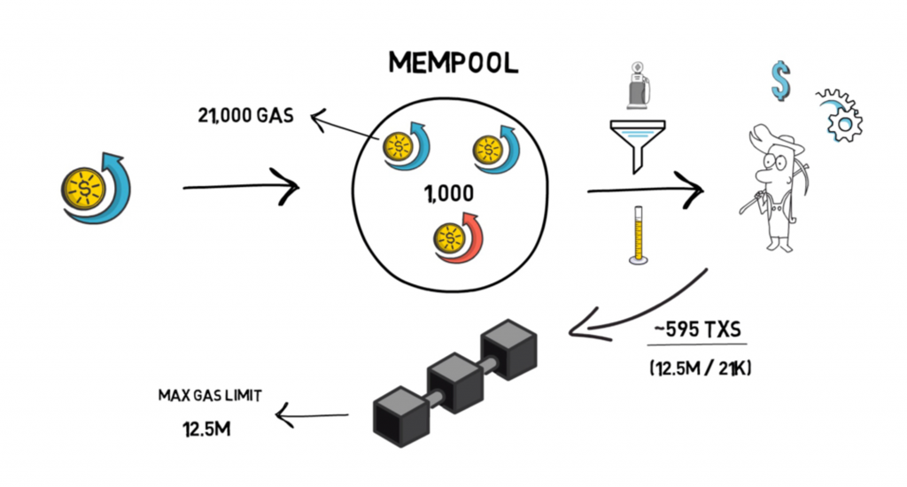

([圖片來源](https://www.builder.news/how-does-the-merge-influence-ethereum-mempool-wOqlZ))

由於 Mempool 裡的交易所有以太坊礦工都能看到，任何人也能透過 API 去拿到目前在 Mempool 中的交易有哪些。不過這也導致了交易受到 MEV 攻擊的機會，簡單來說在一些狀況只要有人發現特定的交易出現在 Mempool 中，就能透過 Front run 或 Back run 的方式對這個交易套利。因此也衍生出發送 Private Transactions 的需求，也就是不透過 Mempool 而直接把交易送給礦工的作法。相關的概念可以參考 [Flashbots](https://www.flashbots.net/) 以及 [Alchemy 關於 Private Transactions 的解釋](https://www.alchemy.com/overviews/ethereum-private-transactions)

#### 6. 取得 Mempool 資料

市面上有一些能夠取得 Mempool 中交易資料的服務，例如 [Blocknative](https://www.blocknative.com/) 跟 [Quicknode](https://www.quicknode.com/) ，都有提供訂閱 pending transaction 資料的功能。以下使用 Blocknative 來舉例，讀者可以到 [Blocknative Explorer](https://explorer.blocknative.com) 試著查看即時的 Mempool 資料：

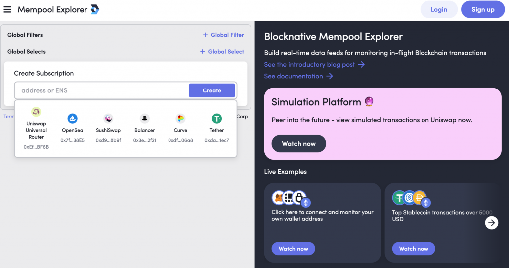

在地址欄位可以輸入任意想監聽的地址，例如點擊 Tether (USDT) 後可以開始監聽 USDT 合約的所有 pending transactions，並顯示在右邊。在畫面上也可以創建複雜的 Filter，例如只過濾出呼叫特定合約 function 的交易，或是特定來源地址的交易等等：

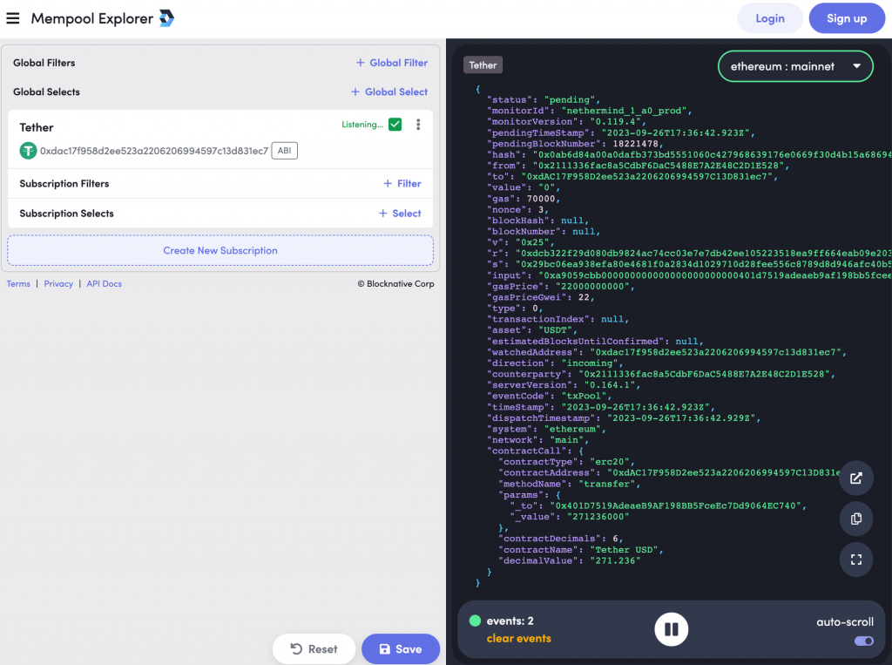

另外 Blocknative 也有提供 Mempool 相關的[監聽 API](https://docs.blocknative.com/mempool-tools/webhook-api)，不過他的 API 比較適合從後端接上去監聽所有以太坊的 pending transactions，並過濾出 App 中需要的交易，但這個機制的完整實作已經超出了今天的範圍，因此有興趣的讀者可以試著串接看看他的 API 來監聽自己地址發出的交易。

#### 7. 小結

今天我們介紹了在 App 上如何管理已發出的交易來提升使用者體驗，包含讓使用者加速或是取消既有的交易，以及介紹更多 Mempool 的機制與 Blocknative 的服務，相關程式碼在[這裡](https://github.com/a00012025/ironman-2023-web3-fullstack/tree/main/mobile/day22)。明天會來介紹 Wallet App 中要如何實作 Wallet Connect 協議。

## DAY 23｜Day 23 - Web3 與進階 App：Wallet Connect 協議與實作

- 原文：https://ithelp.ithome.com.tw/articles/10332768
- 發佈時間：2023-10-02 14:18:02

### 章節內容

#### 1. 未分章內容

今天我們會深入介紹 Wallet Connect 協議以及在 Wallet App 中的實作。在 Day 6 的實作中已經完成了 DApp 端的 Wallet Connect 整合，而這還需要錢包端有支援 Wallet Connect 才能把完整的流程串起來。

#### 2. Wallet Connect 原理

由於 Wallet Connect 是希望使用者在不同裝置上也能方便連接錢包的協議，最常見的情況是手機上的錢包 App 可以連接電腦上的 DApp 並執行任何錢包操作。在 Day 16 我們提過 Ethereum Wallet Provider 的概念，本質上 Wallet Connect 協議就是實作了一個「位在遠端的 Wallet Provider」來處理各種 JSON RPC methods。至於中間如何把 DApp 端跟錢包端連接起來，靠的就是他們的 Relay Server，如下圖所示：

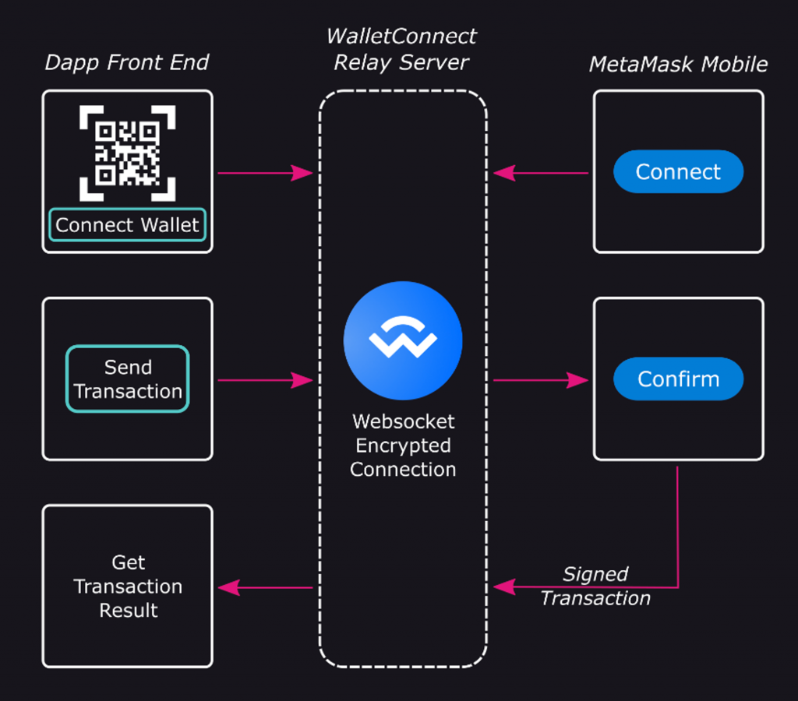

所有從 DApp 發起的錢包操作請求都會透過 Web Socket 透過 Wallet Connect Relay Server 傳到錢包端，當使用者在錢包中確認或拒絕後再把結果用一樣的方式傳回 DApp 端。過程中會透過加密傳輸來確保通訊不被監聽。

Wallet Connect 在今年六月正式從 V1 升級到 V2，最大的亮點是從原本只支援 EVM 鏈的連接與簽名，到 V2 也可以支援所有 EVM 以外的鏈（Polkadot, Cosmos 等等），讓介面變得更抽象化。

#### 3. Pairing & Session

Wallet Connect 背後定義了一個標準流程來連接 DApp 與錢包端，也就是 Wallet Connect 提供的 [Sign API 標準](https://specs.walletconnect.com/2.0/specs/clients/sign/)。首先在 DApp 端產生的 QR Code 會包含如下的網址：

[code]
    uri = "wc:7f6e504bfad60b485450578e05678ed3e8e8c4751d3c6160be17160d63ec90f9@2?symKey=587d5484ce2a2a6ee3ba1962fdd7e8588e06200c46823bd18fbd67def96ad303&methods=[wc_sessionPropose],[wc_authRequest,wc_authBatchRequest]&relay-protocol=irn"

[/code]

裡面是由以下欄位組成：

[code]
    topic = "7f6e504bfad60b485450578e05678ed3e8e8c4751d3c6160be17160d63ec90f9"
    version = 2
    symKey = "587d5484ce2a2a6ee3ba1962fdd7e8588e06200c46823bd18fbd67def96ad303"
    methods = [wc_sessionPropose],[wc_authRequest,wc_authBatchRequest]
    relay = { protocol: "irn", data: "" }

[/code]

其中 `topic` 代表兩端在做 Web Socket 通訊時要對哪個 topic 收發訊息， `version` 代表 Wallet Connect 協議版本。`symKey` 代表兩邊通訊時要用的對稱加密金鑰，`methods` 是用來告知錢包端接下來會收到哪些類型的請求，可以看到他自己定義了幾個我們沒看過的 JSON RPC method 作為特殊用途。`relay` 是 DApp 跟錢包端要透過哪個 Relay Server 進行通訊。

錢包掃描到這個 QR Code 後，會跳一個彈窗詢問用戶是否願意連接該 DApp，如果願意的話錢包就會跟 DApp 做 Pairing 來建立一個可以長達三十天的連線（每個 pairing 是由 tpoic 區分的），這樣就可以方便 DApp 跟錢包在一段比較長的時間重複利用這個連線而不需要讓使用者重連。

Pairing 建立起來後，會由 DApp 端發出 Session Proposal 來跟錢包建立可以收發資料的 Session，當錢包端同意後 DApp 就可以發 JSON RPC request 給錢包來取得地址、簽章等資料。在官方的 [Reference Client API 文件](https://specs.walletconnect.com/2.0/specs/clients/sign/client-api)可以看到一個 Wallet Connect Client 會有的介面（截取部分）：

[code]
    // initializes the client with persisted storage and a network connection
    public abstract init(params: {
      metadata?: AppMetadata;
    }): Promise<void>;

    // for proposer to create a session
    public abstract connect(params: {
      requiredNamespaces: Map<string, ProposalNamespace>;
      relays?: RelayProtocolOptions[];
      pairingTopic: string;
    }): Promise<Sequence>;

    // for responder to approve a session proposal
    public abstract approveSession(params: {
      id: number;
      namespaces: Map<string, SessionNamespace>;  // optional
      relayProtocol?: string;
    }): Promise<Sequence>;

    // for proposer to request JSON-RPC request
    public abstract request(params: {
      topic: string;
      request: RequestArguments;
      chainId: string;
    }): Promise<any>;

[/code]

值得一提的是 Pairing 機制也是 Wallet Connect V2 才加入的，因為在 V1 中只有 Session 的概念，導致錢包跟 DApp 建立連線後如果錢包沒收到 Session Proposal 或任一方斷線，就必須用新的 QR Code 重建一次 Session，導致使用者常常需要重掃 QR Code。有了 Pairing 的概念後使用者只要掃一次 QR Code 就可以讓 Wallet Connect SDK 自動管理 Session 的重連。

至於錢包跟 DApp 溝通中間經過的 Relay，目前預設是用 Wallet Connect 官方自己的 Relay Server，雖然這聽起來有點中心化且沒有隱私，不過由於前面提到的對稱式加密機制，可以確保只有錢包跟 DApp 兩方可以解開正在傳遞的訊息，也就是 Relay Server 只看得到一串亂碼無法解出原始資料。另外如果想跑自己的 Relay Server，Wallet Connect 也有提供基本功能的 Relay 可以使用：https://github.com/WalletConnect/relay

#### 4. 多鏈支援

前面提到 Wallet Connect V2 的一個亮點是也支援了 EVM 以外的鏈，他能做到這件事背後來自於 [Namespace 的設計方式](https://specs.walletconnect.com/2.0/specs/clients/sign/namespaces)。當 Pairing 建立後 DApp 發送 Session Proposal 給錢包時，會包含如下的 Namespace 資訊：

[code]
    {
      "requiredNamespaces": {
        "eip155": {
          "methods": [
            "eth_sendTransaction",
            "eth_signTransaction",
            "eth_sign",
            "personal_sign",
            "eth_signTypedData"
          ],
          "chains": ["eip155:1", "eip155:10"],
          "events": ["chainChanged", "accountsChanged"]
        },
        "solana": {
          "methods": ["solana_signTransaction", "solana_signMessage"],
          "chains": ["solana:4sGjMW1sUnHzSxGspuhpqLDx6wiyjNtZ"],
          "events": []
        },
        "polkadot": {
          "methods": ["polkadot_signTransaction", "polkadot_signMessage"],
          "chains": ["polkadot:91b171bb158e2d3848fa23a9f1c25182"],
          "events": []
        }
      },
      "optionalNamespaces": {
        "eip155:42161": {
          "methods": ["eth_sendTransaction", "eth_signTransaction", "personal_sign"],
          "events": ["accountsChanged", "chainChanged"]
        }
      }
    }

[/code]

可以看到 EVM 鏈相關的 JSON RPC methods 被包含在一個 [EIP-155](https://eips.ethereum.org/EIPS/eip-155) 的 Namespace 中，也就是 EVM 鏈使用 Chain ID 來定義不同鏈的方式，其他非 EVM 的鏈（Solana, Polkadot 等等）也能定義自己的 Chain ID 和 JSON RPC Method，只要錢包端回應 Session Proposal 時說有支援這些鏈跟對應的 JSON RPC Method，就能成功建立連線。

#### 5. Wallet App 端實作

Wallet Connect 官方提供了 [Flutter SDK](https://github.com/WalletConnect/WalletConnectFlutterV2) 把建立連線跟管理 Session 的功能封裝起來，並在 repo 中提供對應的範例程式碼，接下來帶讀者看若整實作 Wallet Connect 的錢包端串接會用到哪些東西。也可以進到 `example/wallet` 後執行 `flutter run --dart-define=PROJECT_ID=xxx` 把他的範例 App 跑起來：

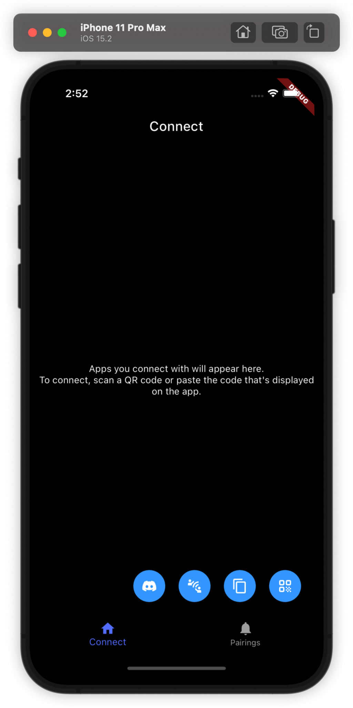

首先是建立一個 `Web3Wallet` 物件，需要給他錢包 App 的 metadata 以及在 Wallet Connect Cloud 上註冊後獲得的 Project ID：

[code]
    _web3Wallet = Web3Wallet(
      core: Core(
        projectId: DartDefines.projectId,
      ),
      metadata: const PairingMetadata(
        name: 'Example Wallet',
        description: 'Example Wallet',
        url: 'https://walletconnect.com/',
        icons: ['https://walletconnect.com/walletconnect-logo.png'],
      ),
    );

[/code]

再來當使用者掃描 Wallet Connect 的 QR Code 時，會使用 `web3Wallet.pair` 來建立 Pairing：

[code]
    Future _onFoundUri(String? uri) async {
      if (uri != null) {
        try {
          final Uri uriData = Uri.parse(uri);
          await web3Wallet.pair(
            uri: uriData,
          );
        } catch (e) {
          _invalidUriToast();
        }
      } else {
        _invalidUriToast();
      }
    }

[/code]

接下來要如何及時收到 Session Proposal 的資料呢？只要在初始化 `Web3Wallet` 後，把自己的處理 Event 的 handler 註冊給 `Web3Wallet` 即可：

[code]
    _web3Wallet!.core.pairing.onPairingInvalid.subscribe(_onPairingInvalid);
    _web3Wallet!.core.pairing.onPairingCreate.subscribe(_onPairingCreate);
    _web3Wallet!.pairings.onSync.subscribe(_onPairingsSync);
    _web3Wallet!.onSessionProposal.subscribe(_onSessionProposal);
    _web3Wallet!.onSessionProposalError.subscribe(_onSessionProposalError);
    _web3Wallet!.onSessionConnect.subscribe(_onSessionConnect);

[/code]

這樣當 DApp 端發出 Session Proposal 請求時，就會呼叫到 `_onSessionProposal` 在裡面跳出連接請求的彈窗，讓使用者選擇同意或拒絕請求，選擇後使用 `Web3Wallet` 的 `approveSession()` 或 `rejectSession` 方法來處理連線。成功後會再收到 `onSessionConnect` event：

[code]
    void _onSessionProposal(SessionProposalEvent? args) async {
      if (args != null) {
        final Widget w = WCRequestWidget(
          child: WCConnectionRequestWidget(
            wallet: _web3Wallet!,
            sessionProposal: WCSessionRequestModel(
              request: args.params,
            ),
          ),
        );
        final bool? approved = await _bottomSheetHandler.queueBottomSheet(
          widget: w,
        );
        if (approved != null && approved) {
          _web3Wallet!.approveSession(
            id: args.id,
            namespaces: args.params.generatedNamespaces!,
          );
        } else {
          _web3Wallet!.rejectSession(
            id: args.id,
            reason: Errors.getSdkError(
              Errors.USER_REJECTED,
            ),
          );
        }
      }
    }

    void _onSessionConnect(SessionConnect? args) {
      if (args != null) {
        print(args);
        sessions.value.add(args.session);
      }
    }

[/code]

再來是要如何收到 Sign Transaction 或 Sign Message 的請求並回應。這一樣也是在初始化 `Web3Wallet` 時要把對應的 Event Handler 註冊進去，對應的邏輯是在 `EVMService` 中：

[code]
    final Web3Wallet wallet = _web3WalletService.getWeb3Wallet();
    for (final String event in getEvents()) {
      wallet.registerEventEmitter(chainId: getChainId(), event: event);
    }
    wallet.registerRequestHandler(
      chainId: getChainId(),
      method: pSign,
      handler: personalSign,
    );
    wallet.registerRequestHandler(
      chainId: getChainId(),
      method: eSign,
      handler: ethSign,
    );
    wallet.registerRequestHandler(
      chainId: getChainId(),
      method: eSignTransaction,
      handler: ethSignTransaction,
    );
    wallet.registerRequestHandler(
      chainId: getChainId(),
      method: eSendTransaction,
      handler: ethSignTransaction,
    );
    wallet.registerRequestHandler(
      chainId: getChainId(),
      method: eSignTypedData,
      handler: ethSignTypedData,
    );

[/code]

這樣就可以在對應的處理函式（如 `ethSignTransaction`）中跳出給使用者的簽名請求，若使用者同意就可以自動把結果送回 DApp 了！

#### 6. 小結

今天我們探討了 Wallet Connect V2 的原理以及介紹如何在 Flutter 中實作錢包端的連接。而 Wallet Connect 除了定義 Sign API 之外也有關於 [Auth](https://specs.walletconnect.com/2.0/specs/clients/auth/), [Chat](https://specs.walletconnect.com/2.0/specs/clients/chat/), [Notify](https://specs.walletconnect.com/2.0/specs/clients/notify/) 的 API，像 Auth API 提供一個自動用錢包登入的協議，而不再需要讓使用者簽名一個 SIWE (Sign-In With Ethereum) 的訊息。Chat 則是實現錢包對錢包的 1-1 聊天功能。Notify 則是實現由 DApp 主動發推播通知給手機端的使用者的協議。有興趣的讀者可以再自行研究。明天我們會介紹另一個錢包 App 的重要功能是如何實作的，也就是 DApp Browser。

## DAY 24｜Day 24 - Web3 與進階 App：DApp 瀏覽器實作

- 原文：https://ithelp.ithome.com.tw/articles/10333681
- 發佈時間：2023-10-03 21:39:23

### 章節內容

#### 1. 未分章內容

今天要來介紹的是錢包 App 中的 DApp 瀏覽器如何實作，來幫助使用者在任何裝置與場景上都能方便透過錢包連上 DApp。這個功能在各個主流錢包 App 中都有提供，讀者不妨先試用過，會對今天的內容更加有感。

#### 2. DApp 瀏覽器介紹

昨天提到 Wallet Connect 適合的場景是錢包 App 連接桌面瀏覽器上的 DApp，而當如果使用者想要都在手機上操作 DApp，其實也可以使用 Wallet Connect。使用者可以在手機上選擇用 Chrome 或 Safari 等瀏覽器開啟 DApp，並在連接錢包時選擇用 Wallet Connect 連接，選擇對應的 App 後他會透過 Deep Link 的方式直接跳轉到錢包 App 中要求連接，並在後續每次需要簽名時直接用 Deep Link 跳轉到錢包 App。但這樣的做法會讓使用者在兩個 App 之間一直切換，並不順暢。

因此要在手機上操作 DApp 最直接的方式就是在錢包裡有個內建的瀏覽器可以用，並自動讓使用者的錢包連上瀏覽器中的 DApp，這樣就能在錢包 App 中流暢的進行所有的 DApp 操作了。這也是為什麼這個功能如此重要，對每個錢包 App 來說都是標配。下圖由左至右分別是 Metamask, Trust Wallet, KryptoGO Wallet 的 DApp 瀏覽器畫面：

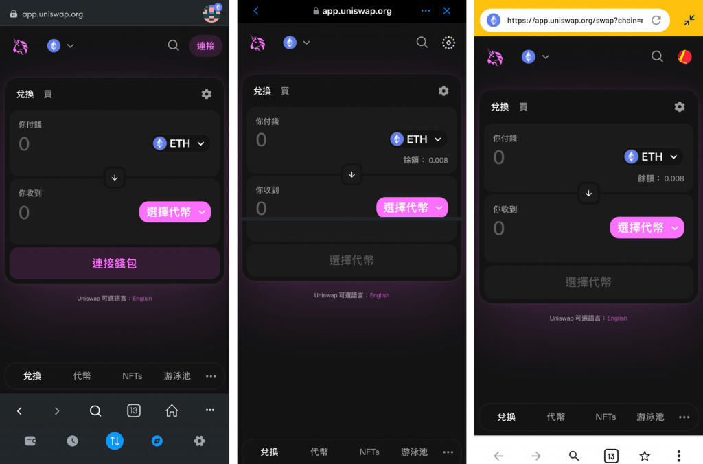

#### 3. Metamask 的開源實作

要實作 DApp 瀏覽器需要將 DApp 與錢包 App 之間的通訊串起來，由於 Metamask 的 Mobile App 和 Extension 都是開源的，可以參考他們的實作方式並移植到 Flutter 中。

在 Metamask 的 Github 可以找到一個 [mobile-provider](https://github.com/MetaMask/mobile-provider) repo，他其實是 Metamask Mobile App 中在開啟任何網頁時會用被注入進網頁的 JS Code，而且他是一個 Ethereum Wallet Provider（在 Day 16 有介紹過相關概念）。因此它提供了可以把瀏覽器中的 DApp 跟錢包 App 串起來的關鍵橋樑：當這個 Wallet Provider 從 DApp 接收到 JSON-RPC Request 時，他就會把這個請求丟給 Metamask Mobile App 處理，等待 App 處理完後拿到其回傳的結果再返回給 DApp，形成一個完整的 JSON-RPC 呼叫。

這個功能的核心在 [MobilePortStream.js](https://github.com/MetaMask/mobile-provider/blob/main/src/inpage/MobilePortStream.js) 檔案中，可以看到有個 `MobilePortStream.prototype._write` function 如下：

[code]
    MobilePortStream.prototype._write = function (msg, _encoding, cb) {
      // ...
    	if (Buffer.isBuffer(msg)) {
    	  const data = msg.toJSON();
    	  data._isBuffer = true;
    	  window.ReactNativeWebView.postMessage(
    	    JSON.stringify({ ...data, origin: window.location.href }),
    	} else {
    	  if (msg.data) {
    	    msg.data.toNative = true;
    	  }
    	  window.ReactNativeWebView.postMessage(
    	    JSON.stringify({ ...msg, origin: window.location.href }),
    	  );
    	}
      // ...
    }

[/code]

因此所有 JSON RPC request 都會通過 `window.ReactNativeWebView.postMessage` 的方式打到 Metamask 用 React Native 實作的 App 中，而 `ReactNativeWebView` 這個 property 是由 [react-native-webview](https://github.com/react-native-webview/react-native-webview) 套件提供的可以用來跟 React Native App 溝通的橋樑。

到這裡就可以想像出在 Flutter 中實作 DApp 瀏覽器的思路了：只要找一個 Flutter 瀏覽器的套件，然後把上面的 mobile-provider 程式碼中打到 React Native 的部分，換成打到 Flutter 瀏覽器提供的 property，這樣在 Flutter 中就可以用對應的 JSON RPC message handler 來接到請求並處理。

#### 4. Flutter 瀏覽器套件

Flutter 中有一個套件叫 [flutter_inappwebview](https://inappwebview.dev/)，可以方便的在 App 中加入瀏覽器的功能，還允許我們自定義要注入的 script，而這正是在實作 DApp browser 功能所需要的。他的官方文件中關於 [JavaScript Communication 的介紹](https://inappwebview.dev/docs/webview/javascript/communication/)就有提到如何從網頁端呼叫 App 端的程式碼：

[code]
    const args = [1, true, ['bar', 5], {foo: 'baz'}];
    window.flutter_inappwebview.callHandler('myHandlerName', ...args);

[/code]

只要呼叫 `window.flutter_inappwebview.callHandler` 即可 並且在 `InAppWebView` widget 中的 `onWebViewCreated` 可以使用 `controller.addJavaScriptHandler` 來加入對應的 handler：

[code]
    onWebViewCreated: (controller) {
      // register a JavaScript handler with name "myHandlerName"
      controller.addJavaScriptHandler(handlerName: 'myHandlerName', callback: (args) {
        // print arguments coming from the JavaScript side!
        print(args);

        // return data to the JavaScript side!
        return {
          'bar': 'bar_value', 'baz': 'baz_value'
        };
      });
    },

[/code]

所以我們要做的就是將 Mobile Provider 中的 `window.ReactNativeWebView.postMessage`換成`window.flutter_inappwebview.callHandler`，就可以從 Mobile Provider 呼叫到 Flutter code 了：

[code]
    if (Buffer.isBuffer(msg)) {
      const data = msg.toJSON();
      data._isBuffer = true;
      window.flutter_inappwebview.callHandler(
        'handleMessage',
        JSON.stringify({ ...data, origin: window.location.href })
      );
    } else {
      if (msg.data) {
        msg.data.toNative = true;
      }
      window.flutter_inappwebview.callHandler(
        'handleMessage',
        JSON.stringify({ ...msg, origin: window.location.href })
      );
    }

[/code]

修改完`MobilePortStream.js`後可以執行 `yarn build`來產生 minimize 後的 JS code，就可以放入 Flutter 專案中並在後續注入進瀏覽器頁面中。

#### 5. 將 DApp 瀏覽器串到 Flutter

`InAppWebView` widget 有提供在網頁中執行任意 JS Code 的方法（[官方文件](https://inappwebview.dev/docs/webview/javascript/user-scripts)），包含使用 `initialUserScripts` 來在頁面開啟後的一開始執行 JS Code，或是使用 `controller.evaluateJavascript` 來在任意時間執行 JS Code。由於我們想在頁面載入時就把 mobille provider 注入進去，因此可以使用 `initialUserScripts` 屬性，搭配使用 `rootBundle.loadString('assets/js/init.js')` 把剛才編好的 JS Code 載入進來執行：

[code]
    Future<String> browserInitScript = rootBundle.loadString('assets/js/init.js');

    // in widget
    return FutureBuilder<String?>(
      future: browserInitScript,
      builder: (context, snapshot) {
        if (snapshot.hasData) {
          return InAppWebView(
            initialUserScripts: UnmodifiableListView<UserScript>([
              UserScript(
                source: snapshot.data ?? '',
                injectionTime: UserScriptInjectionTime.AT_DOCUMENT_START,
              ),
            ]),
            // ...
          );
        } else {
          return const Center(
            child: CircularProgressIndicator(),
          );
        }
      },
    );

[/code]

裡面使用了 `FutureBuilder` 來處理還沒有載入完成 `init.js` 檔案的狀況，這樣就能成功在頁面載入時注入 Mobile Provider 了。

再來則是要監聽 DApp 端呼叫的 JSON-RPC Request 並回傳結果，因此需要在 `onWebViewCreated` 中註冊一個 JS handler：

[code]
    onWebViewCreated: (controller) async {
      controller.addJavaScriptHandler(
        handlerName: 'handleMessage',
        callback: (args) async {
          final json = jsonDecode(args[0]);
          // now json["data"] is the JSON-RPC request object
        },
      );
    },

[/code]

只要 `handlerName` 中設定的值跟 Web 端在呼叫 `callHandler` 時使用一樣的名稱即可。這樣就可以拿到從 DApp 而來的 JSON-RPC 請求開始處理。

#### 6. 實作 JSON-RPC 處理方法

DApp 要實作的 JSON-RPC 方法非常多，[Metamask 官方文件](https://docs.metamask.io/wallet/reference/eth_subscribe/)中就列出了近 50 個他支援的 JSON-RPC 方法，但其實有許多 JSON-RPC 方法可以直接傳遞給 Alchemy 來處理，包含 `eth_gasPrice`, `eth_blockNumber`, `eth_estimateGas` 等等，因為這些方法都是不依賴於當下連接的錢包，也跟簽名沒有關係。

在前面的內容我們已經介紹過 App 中簽名相關的 JSON-RPC method（包含 `eth_signTransaction`, `personal_sign`, `eth_signTypedData_v4`, …）以及如何簽名交易，因此今天相關的程式碼會省略。唯一要多處理的是當收到這些簽名請求時，需要跳出彈窗來讓使用者查看交易內容並決定接受或拒絕，若接受就走正常簽名流程，拒絕的話也需要回傳 JSON-RPC Error message 給 DApp 端。

還有另一類需要實作的 JSON-RPC method，是跟錢包本身相關的，例如：

* `eth_requestAccounts`: 請使用者選擇一個要連接的錢包（[文件](https://docs.metamask.io/wallet/reference/eth_requestaccounts/)）
  * `wallet_addEthereumChain`: 請求新增一個 EVM 鏈（[文件](https://docs.metamask.io/wallet/reference/wallet_addethereumchain/)）
  * `wallet_switchEthereumChain`: 請求切換至另一個 EVM 鏈（[文件](https://docs.metamask.io/wallet/reference/wallet_switchethereumchain/)）

跟 Ethereum Chain 相關的方法主要是用來管理錢包當下連接的鏈，因為一般 DApp 都會指定他只支援哪些鏈，而當使用者的錢包連上時不是使用對應的鏈，那 DApp 可以選擇用 `wallet_switchEthereumChain` 來請使用者切換鏈。

至於當使用者拒絕任何請求時（如簽名或新增/切換鏈），應該要回應什麼 JSON-RPC Response，也有在 JSON-RPC Error Code 中定義清楚，例如 `eth_requestAccounts` 方法當使用者拒絕時應該要回覆 `4001` error code 代表被拒絕，以及 `wallet_switchEthereumChain` 方法當錢包不支援該鏈的時候要回覆 `4902` 等等。Error Response 的格式也有在 [EIP-1474](https://eips.ethereum.org/EIPS/eip-1474) 中定義：

[code]
    {
        "id": 1337
        "jsonrpc": "2.0",
        "error": {
            "code": -32003,
            "message": "Transaction rejected"
        }
    }

[/code]

有了這些概念後，就可以按照不同的 method 來實作 `handleMessage` 方法了，以下是範例的實作方式：

[code]
    Future<dynamic> handleMessage(
      String method,
      List<dynamic> params,
    ) async {
      switch (method) {
    	  case "eth_requestAccounts":
          // ...
          if (userAccepted) {
    	      return [wallet.address];
          }
          throw JsonRpcError(
              code: 4001, message: "The request was rejected by the user");
        case "eth_signTransaction":
          // ...
          if (userAccepted) {
    	      return signTransaction(params);
          }
          throw JsonRpcError(
              code: 4001, message: "The request was rejected by the user");
        case "wallet_switchEthereumChain":
    	    // ...
          if (!chainSupported) {
    	      throw JsonRpcError(
    	          code: 4902, message: "Unrecognized chain ID.");
          }
          if (userAccepted) {
    	      return switchEthereumChain(params);
          }
          throw JsonRpcError(
              code: 4001, message: "The request was rejected by the user");

    		// add more cases here
        // e.g. eth_signTypedData_v4
    		default:
    			return postAlchemyRpc(method, params);
      }
    }

[/code]

#### 7. 回傳結果

最後從 `handleMessage` 中得到回傳值時，就可以透過 `InAppWebView` 提供的 `controller.callAsyncJavaScript()` 方法來對頁面執行自訂的 JS Code，來把結果透過 `window.postMessage` 打回 Metamask mobile provider 中。由於 mobile-provider 中監聽的 target 是 `metamask-inpage`，因此傳遞的訊息中必須包含 `"target": "metamask-inpage"`。把以上程式碼串起來就是完整的實作方式了！

[code]
    Future<String> browserInitScript = rootBundle.loadString('assets/js/init.js');

    // in widget
    return FutureBuilder<String?>(
      future: browserInitScript,
      builder: (context, snapshot) {
        if (snapshot.hasData) {
          return InAppWebView(
            initialUserScripts: UnmodifiableListView<UserScript>([
              UserScript(
                source: snapshot.data ?? '',
                injectionTime: UserScriptInjectionTime.AT_DOCUMENT_START,
              ),
            ]),
            onWebViewCreated: (controller) async {
              controller.addJavaScriptHandler(
                handlerName: 'handleMessage',
                callback: (args) async {
                  final json = jsonDecode(args[0]);
                  final rpcId = (json["data"]["id"] is int)
                    ? json["data"]["id"]
                    : int.parse(json["data"]["id"]);
                  final method = json["data"]["method"];
                  final params = json["data"]["params"] ?? [];

                  handleMessage(method, params).then((result) {
                    controller.callAsyncJavaScript(
                      functionBody: _getPostMessageFunctionBody(rpcId, result),
                    );
                  }).catchError((e) {
                    controller.callAsyncJavaScript(
                      functionBody: _getPostErrorMessageFunctionBody(rpcId, e),
                    );
                  });
                },
              );
            },
          );
        } else {
          return const Center(
            child: DefaultCircularProgressIndicator(),
          );
        }
      },
    );

    // util functions
    String _getPostMessageFunctionBody(int id, dynamic result) {
      return '''
            try {
              window.postMessage({
                "target":"metamask-inpage",
                "data":{
                  "name":"metamask-provider",
                  "data":{
                    "jsonrpc":"2.0",
                    "id":$id,
                    "result":${jsonEncode(result)}
                  }
                }
              }, '*');
            } catch (e) {
              console.log('Error in evaluating javascript: ' + e);
            }
      ''';
    }

    String _getPostErrorMessageFunctionBody(int id, String error) {
      return '''
            try {
              window.postMessage({
                "target":"metamask-inpage",
                "data":{
                  "name":"metamask-provider",
                  "data":{
                    "jsonrpc":"2.0",
                    "id":$id,
                    "error":$error
                  }
                }
              }, '*');
            } catch (e) {
              console.log('Error in evaluating javascript: ' + e);
            }
      ''';
    }

[/code]

KryptoGO Wallet 正是使用這樣的架構來實作 DApp browser 的功能，以下是實際運作時幾種請求用戶確認的畫面：

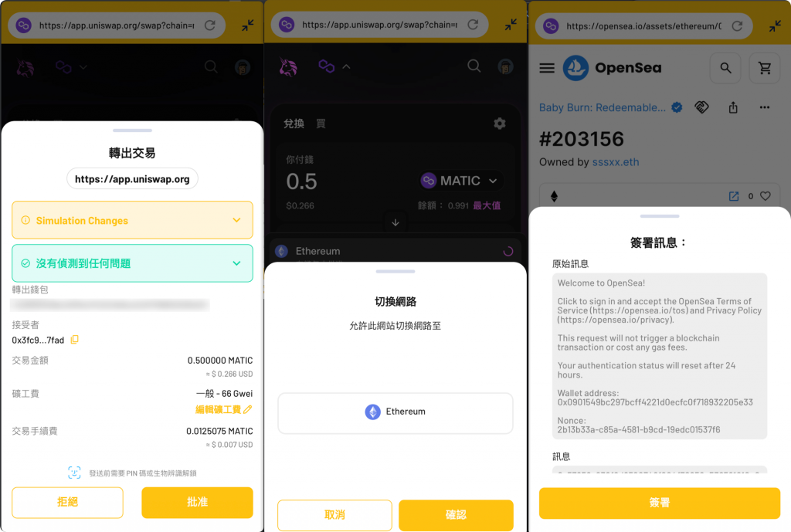

#### 8. 小結

今天我們詳細介紹了 DApp 瀏覽器的原理以及如何在 App 中實作他，針對 mobile provider 我們有從 Metamask 的 repo 中 fork 出一個 Flutter 的版本，程式碼放在[這裡](https://github.com/kryptogo/mobile-provider)。這兩天我們把 Wallet Connect 與 DApp browser 這兩個大幅增加錢包 App 便利性的功能完成了，接下來會介紹錢包 App 中要如何實作 Swap 功能，來讓使用者更方便的兌換任何代幣。

## DAY 25｜Day 25 - Web3 與進階 App：Swap 功能實作

- 原文：https://ithelp.ithome.com.tw/articles/10334206
- 發佈時間：2023-10-04 20:21:39

### 章節內容

#### 1. 未分章內容

今天要講解的是錢包 App 中要如何實作代幣的 Swap 功能，會使用到 1inch 這個 Swap 服務提供的 API，並介紹 EIP-2612 Permit 的作用以及他如何協助使用者節省 Gas Fee，作為 Web3 與進階 App 主題的結尾。

#### 2. Swap 功能簡介

我們從 Day 3 開始就操作 Uniswap，也用它做為許多範例程式互動的 DApp，讀者應該已經很熟悉了。而除了 Uniswap 外其實還有很多各式各樣的 Swap DApp，像是 1inch、Curve（專做穩定幣的兌換）、QuickSwap（Polygon 上的 Swap）、PancakeSwap（Binance Chain 上的 Swap）等等，每條鏈上都一定會有個 Swap 服務，因為這樣才能方便讓使用者進行交易。

而一個 Swap 功能主要要達成的目的是：當使用者選擇想換的代幣並輸入要換多少後，畫面上會先給個報價代表預估可以收到多少目標代幣，使用者可以進一步設定滑點（Slippage）來指定換到的幣跟預估的幣的數量不能差太多。

當設定完成並發出交易後，使用者會跟 Swap 的智能合約互動，智能合約中最常見是用 AMM（Automated Market Maker, 又稱自動化造市商）的演算法來計算能換多少幣出來，詳細的 AMM 機制不會在今天講解，有興趣的讀者可以深入研究。簡單的理解方式是：造市商的目的是提供市場流動性，也就是當有任何人想買/賣幣的時候，造市商可以選擇當他的對手方來賣/買對應的幣，這樣就能幫助使用者完成交易。而 AMM 自動化造市商就是在智能合約上可以自動運行的造市商。

另外每個 Swap 服務可能會有些微妙的差別，像是 Uniswap 除了支援指定固定數量的 From Token 外，也支援指定固定數量的 To Token（From/To 分別代表 Swap 中使用者送出/收到的幣），讀者可以到 Uniswap 在下方代幣的數量輸入一個值，就可以得到大約要花掉多少數量的 from token（如下圖）。但 1inch 只支援指定 From Token 的數量而不支援指定 To Token，這背後是因為 1inch 的智能合約並沒有支援 Exact Amount Out 相關的方法。

#### 3. 1inch Swap API

今天會使用 1inch API 來實作 App 的 Swap 功能，原因是他們的 API 十分方便好用也足夠有彈性。還有另一個好處是 1inch 提供了 [Swap Aggregation](https://1inch.io/aggregation-protocol/) 的功能，因為像各種 EVM 鏈上都會有很多 Swap 服務，每個 Swap 當下的價格可能都不一樣（就像我們換匯時選擇不同的銀行會有不同的價格），而若使用者要手動比價會十分麻煩。以下是 1inch 有支援的 DEX 們：

因此 Swap Aggregation 就是自動幫我們找出價格最好的路徑是什麼，在比較複雜的情況可能會經過多個 Swap 智能合約的路徑以及多種幣。例如當使用者想從 DAI 換成 UNI 時，最好的路徑可能是先在 1inch 上把 DAI 換成 WETH，再到 Uniswap 上把 WETH 換成 UNI。因此這種 Path Finder 背後就會用到最短路徑的演算法。

而不管透過何種路徑做 Swap，對開發者來說最關心的只有在發交易時，應該要送到哪個智能合約地址、要用什麼 Call Data 送、Gas Limit 是多少的這些資訊，如果我們只要指定想 Swap 的 From/To Token 跟數量，就能取得匯率跟 Swap 要用的 Calldata 的話會很方便，而這正是 1inch Swap API 提供的功能。來看一下他的 API 文件：https://docs.1inch.io/docs/aggregation-protocol/api/swagger/

最下面的兩個 API（ `/v5.2/1/quote` 跟 `/v5.2/1/swap`）就可以達到以上兩個目的，分別是取得代幣的報價與取得 Swap 要用的交易資料。路徑中的 `1` 代表 EVM 鏈的 Chain ID，因此這邊先用以太坊作為例子。來看一下他們主要的參數跟回傳值是什麼（這裡僅先列出 required parameters）：

[code]
    [GET] /v5.2/1/quote

    Params:
    - src: From token 合約地址
    - dst: To token 合約地址
    - amount: From token 的數量

    Response:
    {
      "fromToken": {
        "symbol": "string",
        "name": "string",
        "address": "string",
        "decimals": 0,
        "logoURI": "string"
      },
      "toToken": {
        "symbol": "string",
        "name": "string",
        "address": "string",
        "decimals": 0,
        "logoURI": "string"
      },
      "toAmount": "string",
      "protocols": [
        {
          "name": "string",
          "part": 0,
          "fromTokenAddress": "string",
          "toTokenAddress": "string"
        }
      ],
      "gas": 0
    }

[/code]

[code]
    [GET] /v5.2/1/swap

    Params:
    - src: From token 合約地址
    - dst: To token 合約地址
    - amount: From token 的數量
    - from: 執行交易的錢包地址
    - slippage: 最大可容忍的滑點

    Response:
    {
      "fromToken": {
        "symbol": "string",
        "name": "string",
        "address": "string",
        "decimals": 0,
        "logoURI": "string"
      },
      "toToken": {
        "symbol": "string",
        "name": "string",
        "address": "string",
        "decimals": 0,
        "logoURI": "string"
      },
      "toAmount": "string",
      "protocols": [
        "string"
      ],
      "tx": {
        "from": "string",
        "to": "string",
        "data": "string",
        "value": "string",
        "gasPrice": "string",
        "gas": 0
      }
    }

[/code]

因此使用 `/v5.2/1/quote` 就可以拿到使用者能換多少幣的資訊，裡面除了有 `toAmount` 外也附上的 From/To Token 的 Symbol, Name, Decimals, Logo URI 等等，方便我們計算 `toAmount` 經過 decimals 轉換的值並顯示相關資訊給使用者。

當使用者確定要執行交易時，只要打 `/v5.2/1/swap` API 並多傳入執行交易的錢包地址與最大可容忍的滑點，就可以拿到 `tx` 裡的 `to`, `data`, `value` 等資訊，這樣就能直接用它來組出交易並送出了。以下舉幾個 Swap 不同代幣的例子來講解從簡單到複雜的狀況要如何處理。

#### 4. Swap ETH to USDT

如果用戶要 Swap ETH 到 USDT，可以透過實際打 1inch API 來看會拿到怎樣的資料。首先寫好查詢 1inch 兩隻 API 的程式碼：

[code]
    final Dio dio = Dio();

    Future<void> main(List<String> args) async {
      dio.options.baseUrl = 'https://api.1inch.dev/swap';
      dio.options.headers = {
        'Accept': 'application/json',
        'Authorization': 'Bearer YOUR_API_KEY',
      };

      final quote = await getQuote(1,
          fromToken: '0xeeeeeeeeeeeeeeeeeeeeeeeeeeeeeeeeeeeeeeee',
          toToken: '0xdAC17F958D2ee523a2206206994597C13D831ec7',
          amount: BigInt.from(1000000000000000));
      print(jsonEncode(quote));

      final swapData = await getSwapData(1,
          fromTokenAddress: '0xeeeeeeeeeeeeeeeeeeeeeeeeeeeeeeeeeeeeeeee',
          toTokenAddress: '0xdAC17F958D2ee523a2206206994597C13D831ec7',
          amount: BigInt.from(1000000000000000),
          fromAddress: '0x2089035369B33403DdcaBa6258c34e0B3FfbbBd9');
      print(jsonEncode(swapData));
    }

    @override
    Future<OneInchQuoteResponse> getQuote(
      int chainId, {
      required String fromToken,
      required String toToken,
      required BigInt amount,
    }) async {
      final params = {
        'src': fromToken,
        'dst': toToken,
        'amount': amount.toString(),
        'includeTokensInfo': true,
        'includeProtocols': true,
        'includeGas': true,
      };
      final response =
          await dio.get('/v5.2/${chainId}/quote', queryParameters: params);
      final quote = OneInchQuoteResponse.fromJson(response.data);
      return quote;
    }

    @override
    Future<OneInchTx> getSwapData(
      int chainId, {
      required String fromTokenAddress,
      required String toTokenAddress,
      required BigInt amount,
      required String fromAddress,
      int slippage = 1,
    }) async {
      final queryData = {
        'fromTokenAddress': fromTokenAddress,
        'toTokenAddress': toTokenAddress,
        'amount': amount.toString(),
        'fromAddress': fromAddress,
        'slippage': slippage,
        'fee': "0",
      };
      final response = await dio.get(
        '/v5.2/${chainId}/swap',
        queryParameters: queryData,
      );
      final swapResponse = OneInchTx.fromJson(response.data['tx']);
      return swapResponse;
    }

[/code]

其中 API Key 可以到 [1inch developer portal](https://portal.1inch.dev/) 註冊後免費申請，裡面使用了 Dart 的 [freezed](https://pub.dev/packages/freezed) 來產生方便 parse JSON 的 class，細節就不在這裡展開。並且在呼叫 Quote 跟 Swap 時帶入對應的 From/To Token，也就是 ETH 跟 USDT。ETH 則因為是原生代幣沒有合約地址，就以 `0xeee...eee` 代替。以及 From amount 使用 0.001 ETH，執行結果如下：

[code]
    // quote
    {
      "fromToken": {
        "symbol": "ETH",
        "name": "Ether",
        "address": "0xeeeeeeeeeeeeeeeeeeeeeeeeeeeeeeeeeeeeeeee",
        "decimals": 18,
        "logoURI": "https://tokens.1inch.io/0xeeeeeeeeeeeeeeeeeeeeeeeeeeeeeeeeeeeeeeee.png",
        "eip2612": false,
        "wrappedNative": false
      },
      "toToken": {
        "symbol": "USDT",
        "name": "Tether USD",
        "address": "0xdac17f958d2ee523a2206206994597c13d831ec7",
        "decimals": 6,
        "logoURI": "https://tokens.1inch.io/0xdac17f958d2ee523a2206206994597c13d831ec7.png",
        "eip2612": false,
        "wrappedNative": false
      },
      "toAmount": "1672645",
      "gas": 185607
    }
    // swap
    {
      "from": "0x2089035369B33403DdcaBa6258c34e0B3FfbbBd9",
      "to": "0x1111111254eeb25477b68fb85ed929f73a960582",
      "data": "0x0502b1c5000000000000000000000000000000000000000000000000000000000000000000000000000000000000000000000000000000000000000000038d7ea4c68000000000000000000000000000000000000000000000000000000000000019446e0000000000000000000000000000000000000000000000000000000000000080000000000000000000000000000000000000000000000000000000000000000100000000000000003b6d03400d4a11d5eeaac28ec3f61d100daf4d40471f18528b1ccac8",
      "value": "1000000000000000",
      "gas": 166875,
      "gasPrice": "6063728349"
    }

[/code]

由於 USDT 的 decimals 是 6，回傳的 `toAmount` 是 `1672514` ，因此 0.001 ETH 可以換到 1.672514 USDT，跟當下的匯率是差不多的。而 swap API 也正常回應了要打的合約地址跟 Call Data、Value 等資料，可以看到 to 地址為 [0x1111111254eeb25477b68fb85ed929f73a960582](https://etherscan.io/address/0x1111111254eeb25477b68fb85ed929f73a960582) 也就是 1inch 的 Aggregator Contract，value 因為我們想兌換 ETH 所以要打對應數量的 ETH 到合約上。只要發出這筆交易就可以執行對應的 Swap 操作了。

#### 5. Swap USDT to USDC

如果使用者想從 USDT Swap 成 USDC，就沒有那麼簡單了，因為在 Swap 之前必須要 Approve 過 1inch 的合約使用自己的 USDT，後續才能發出 Swap 交易讓 1inch 把自己的 USDT 轉走，並轉入 USDC。因此我們需要先判斷使用者是否曾經 Approve 過 1inch 的合約足夠的 USDT，如果不夠則需要先發送 Approve 交易。

而這也有對應的 API 可以使用，也就是以下這幾個 approve 相關的 API：

* `/v5.2/1/approve/spender`： 查詢使用者應該要 approve 哪個地址使用 Token（因此會是 1inch Aggregator 合約，只是不同鏈可能合約地址不同）
  * `/v5.2/1/approve/allowance`：給定使用者的地址跟一個 Token 地址，查詢使用者已經 Approve 的數量
  * `/v5.2/1/approve/transaction`：給定要 Approve 的 Token 數量與 Token 地址，拿到可以用來發送 Approve 交易的 Call Data, Value, Gas Price 等資料

如果使用者 Approve 的數量不足，那在呼叫 `/v5.2/1/swap` API 時會產生 400 錯誤，因為這時是無法發送 Swap 交易的。

至於要 Approve 的數量是多少，不同錢包 App 可能有不同的計算或設定方式，例如若希望提昇安全性，可能會 Approve 恰好要轉出的 Token 數量，這樣使用者就可以不用擔心在 Day 15 提到的由 Approve 產生的風險，但缺點就是每次 Swap 都要重新 Approve 一次會花比較多 Gas Fee。而另一種作法就是直接 Approve 最大數量（也就是 2^64-1），讓未來執行任何 Swap 都不需要再 Approve 來提升便利性，只是就稍微不安全了一點。但有些人也覺得風險可接受，畢竟像 1inch, Uniswap 這種經手幾億美金以上價值的合約，勢必經過大量的審計跟駭客的攻擊嘗試，才能維持穩定那麼久一段時間。

#### 6. Swap USDC to USDT

當使用者想 Swap USDC 到 USDT 時，也可以按照跟上面一樣的方式處理，但其實 USDC 合約提供了一個可以省掉 Approve 交易的 Gas Fee 的方法，也就是 [EIP-2612](https://eips.ethereum.org/EIPS/eip-2612) 中定義的 Permit 方法。

EIP-2612 會出現的背景是希望使用者在要跟會轉移自己 ERC-20 Token 的合約互動時，可以不用發兩次交易（先 Approve 再執行想要的交易），只需要發送後面的交易並帶入一個 Signature 代表允許該合約使用自己的 ERC-20 Token 即可。

以下是支援 Permit 方法的 ERC-20 智能合約需要有的介面：

[code]
    function permit(address owner, address spender, uint value, uint deadline, uint8 v, bytes32 r, bytes32 s) external
    function nonces(address owner) external view returns (uint)
    function DOMAIN_SEPARATOR() external view returns (bytes32)

[/code]

我們在 Day 17 的 Meta Transaction 中也講解過類似的概念，本質上只要用戶簽了一個 Typed Data 代表他允許誰來使用他的哪個代幣、允許數量多少，這樣別人就可以拿這個 Signature 去呼叫該代幣合約的 `permit` 方法，進而取得用戶的 Token Approval。來看一下 [USDC 合約](https://etherscan.deth.net/address/0xa0b86991c6218b36c1d19d4a2e9eb0ce3606eb48)中關於 permit 函式的實作：

基本上就是去驗證組合出來的 Typed Data 資料跟交易提供的簽章（v, r, s 值），來看是否真的是 owner 簽名的訊息，驗證通過的話就會呼叫 `_approve` function，達到跟 owner 自己呼叫 `approve()` 一樣的效果。而 EIP-2612 標準中定義了 Permit 簽名時的資料結構：

[code]
    {
      "types": {
        "EIP712Domain": [
          {
            "name": "name",
            "type": "string"
          },
          {
            "name": "version",
            "type": "string"
          },
          {
            "name": "chainId",
            "type": "uint256"
          },
          {
            "name": "verifyingContract",
            "type": "address"
          }
        ],
        "Permit": [
          {
            "name": "owner",
            "type": "address"
          },
          {
            "name": "spender",
            "type": "address"
          },
          {
            "name": "value",
            "type": "uint256"
          },
          {
            "name": "nonce",
            "type": "uint256"
          },
          {
            "name": "deadline",
            "type": "uint256"
          }
        ],
      },
      "primaryType": "Permit",
      "domain": {
        "name": erc20name,
        "version": version,
        "chainId": chainid,
        "verifyingContract": tokenAddress
      },
      "message": {
        "owner": owner,
        "spender": spender,
        "value": value,
        "nonce": nonce,
        "deadline": deadline
      }
    }

[/code]

裡面一樣使用 Nonce 來防止 Replay Attack，因此在簽名新的 Permit 訊息時也都要先到鏈上查詢該 Token 最新的 Nonce 是什麼。查詢後就可以使用以上資料結構組出要簽名的 Typed Data，並使用 Sign Typed Data 方法簽出需要的 Signature，最後就可以在打 1inch 的 swap API 時帶入 `permit` 參數，得到一個包含 Permit 功能的交易資料。

至於要怎麼知道一個 From Token 是否支援 EIP-2612？其實在打 `quote` API 時裡面回傳的 From/To Token 資訊就有包含 `eip2612` 欄位，若是 `true` 的話就代表有支援 EIP-2612，可以幫助使用者節省 Gas Fee。把以上的知識串起來就能實作出完整的 Swap 功能了！以下是 KryptoGO Wallet 中實際運作的樣子：

#### 7. 小結

今天我們介紹了如何在錢包 App 中使用 1inch API 來實作 Swap 功能，也介紹了 EIP-2612 Permit 的概念，相關的程式碼在[這裡](https://github.com/a00012025/ironman-2023-web3-fullstack/tree/main/mobile/day25)。其實在 Production 的功能實作中還有許多面向要考慮，包含：

* 顯示可 Swap 的代幣列表以及使用者已持有的 ERC-20 代幣餘額
  * 加入 Use Max 按鈕方便使用者兌換全部的幣
  * 設定要抽的手續費比例以及接收地址

另外除了 1inch 既有的 Swap 功能外，也有許多人在研發新的更有效率、手續費更低或的 Swap 協議，包含 Uniswap v3 讓流動性提供方可以選擇要在哪個價格區間提供流動性來增加資金利用率，還有 Uniswap v4 跟 1inch 都推出在鏈上執行限價單的方式，可以指定想成交的價格後等待成交，而不需要手動執行交易。還有 Uniswap 的 Universal Router 可以讓使用者在一筆交易中兌換任意數量的 ERC-20, ERC-721, ERC-1155 Token。有興趣的讀者可以再深入研究。

到這裡我們已經介紹完本系列所有 Web3 與前端、後端、App 開發的主題了，接下來會探討 Web3 資安的主題，是許多 Web3 使用者關心卻常迷失在各種技術名詞之中的題目，若操作時不夠小心資產可能一下就被駭客盜走。

## DAY 26｜Day 26 - Web3 與資安：攻擊方式與資產保護（上）

- 原文：https://ithelp.ithome.com.tw/articles/10334895
- 發佈時間：2023-10-05 21:31:07

### 章節內容

#### 1. 未分章內容

今天跟明天的內容會來介紹 Web3 世界裡有哪些需要注意的資安風險，以及作為使用者我們可以怎麼預防資產被盜走。經過前面 25 天的內容我們已經對 Web3 技術有許多了解，可以幫助我們深入理解每種攻擊跟防禦的原理。

#### 2. 暗黑森林

有些人把區塊鏈比喻成黑暗森林，原因是有大量的攻擊手法持續出現，只要稍有不慎自己的資產就有可能陷入危險，而過去也有許多業界知名人士遭駭的案例，就算是資深玩家也難以倖免。

慢霧是間在 Web3 算知名的資安審計公司，他們有一份[區塊鏈黑暗森林自救手冊](https://github.com/slowmist/Blockchain-dark-forest-selfguard-handbook)（中文版在[這裡](https://github.com/slowmist/Blockchain-dark-forest-selfguard-handbook/blob/main/README_CN.md)），裡面詳細介紹了許多攻擊的手法與如何防禦，他們用以下這張圖來總結所有的面向：

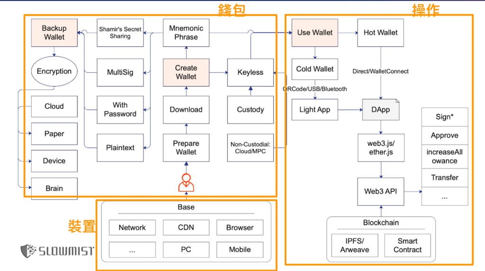

橘色的部分是我加上的，粗略把這張圖分成三塊：操作、錢包和裝置。操作指的是當使用者用錢包進行任何 DApp 操作時，可能被攻擊的點。裝置指的是若使用者的裝置本身被入侵的風險。錢包則是關於錢包 App 的資安風險、私鑰與註記詞的保存等問題。今天會先介紹操作的問題以及平常使用 DApp 時應該要注意哪些東西。

#### 3. 詐騙案例

舉個常見的案例，在 Twitter 或 Discord 等社群平台上有許多幣圈的社群跟廣告，常常會有詐騙的人在上面宣傳甚至直接密你，把他的東西包裝成可以領取某個獎勵或是 NFT 引導我們點進去。這時可能會看到像這樣的網頁：

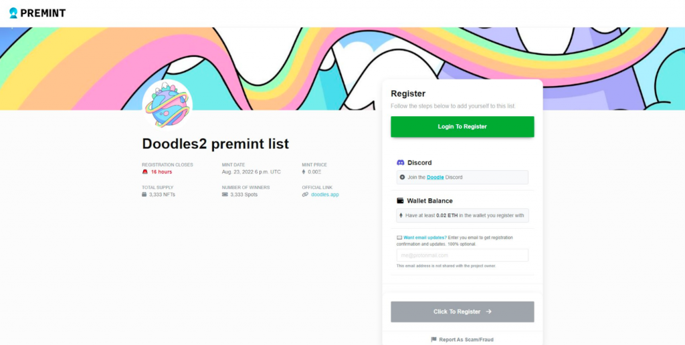

看起來很正常，但輸入完資訊按下一步送出後跳出了這個簽名的請求：

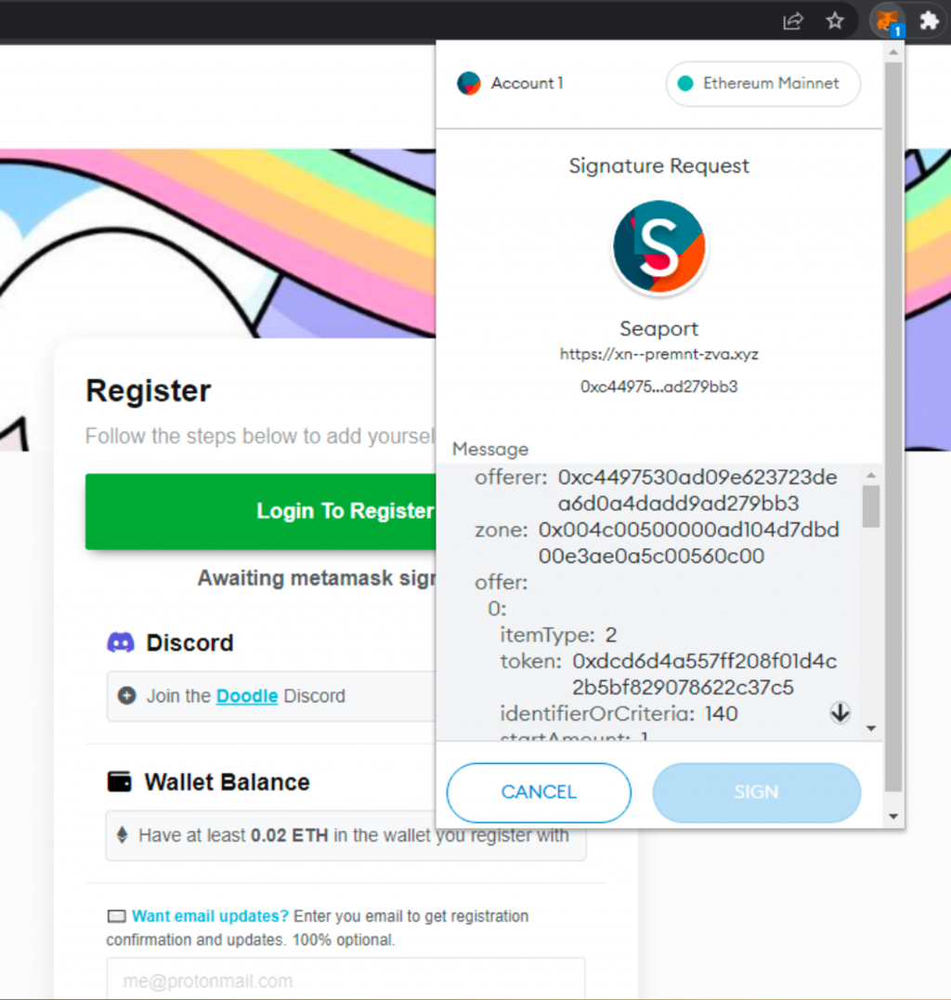

如果對一般看不懂簽名請求的使用者來說，可能來不及看懂這裡面在做什麼就按下簽名了，而這時最嚴重的情況會導致他的 NFT 全部都被轉走！原理今天會提到，但這正是區塊鏈操作的可怕之處：所有釣魚網站都會做得很精緻，目的就是要誘導使用者按下簽名，而在 Web3 世界任何操作都代表價值的流動或資產轉移，對駭客來說只需要花相對低的成本就可以取得很高的報酬，而且金流還能透過 Tornado Cash 之類的服務做到無法被追蹤。

特別是近幾個月出現越來越多知名 KOL 或知名 Web3 項目的 Twitter 被駭（最常見是透過 SIM Swap 攻擊），導致官方帳號貼出了釣魚網站的資訊，許多人就會信以為真進去操作，往往造成大量的資產損失。

因此接下來會列舉幾個常見的範例來讓讀者理解怎樣的操作可能會有風險，因為在錢包 App 中的確認訊息是不可能被偽造的（除非連 Metamask 都被發現漏洞），錢包 App 跳出來的彈窗內才是最正確的內容，不管網頁上寫他是要送你一些幣還是免費 mint 一些 NFT 都不能相信。

#### 4. Approve 操作

首先一個常見的風險是直接呼叫 ERC-20 的 `approve` 方法或是 ERC-721, ERC-1155 的 `setApprovalForAll`方法，把自己的 Token 或 NFT 授權給別人，這個在 Metamask 的確認頁面中就看得出來：

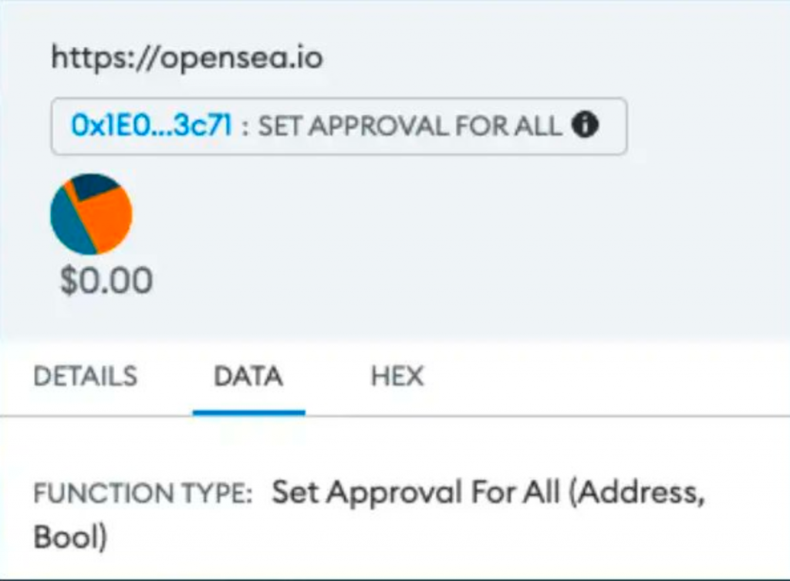

因此如果在確認頁面中看到 Approve 或 Approval 相關的字眼就要特別小心，。但這類型操作有時比較難分辨的原因是像在 Uniswap, Opensea 等知名平台上也會有需要使用者 Approve 資產的操作，也會使用到 `approve` 或是 `setApprovalForAll` 方法。因此要準確的區分就必須檢查當下互動的合約地址是否真的是該協議的地址，例如把地址貼到 Etherscan 上查詢。

另外一個可以再次確認的是 Approve 的對象，也就是授權哪個地址使用自己的資產。現在 Metamask 中會顯示 Approve 交易的細節，點擊 Verify third-party details 可以看到當下正要 Approve 的 spender 是誰：

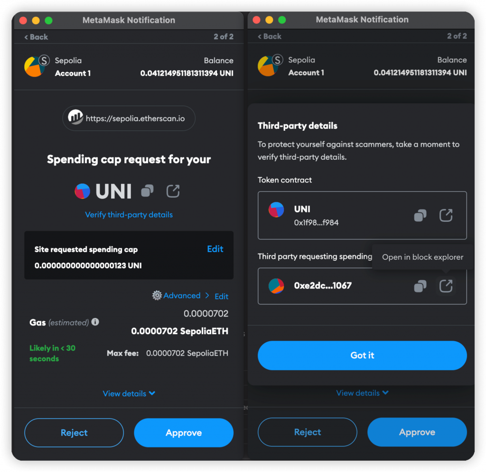

在惡意的網站通常他會要求你 approve 一個 EOA 地址可以使用你的資產，而這就是最大的風險：駭客可以持續監聽鏈上的狀態，只要發現有人 Approve 了他的 EOA 地址使用一些資產，就馬上用那個 EOA 發交易把受害者的資產全部轉走。因此點擊 Open in block explorer 查看是授權給哪個地址也是很重要的。

#### 5. 簽名「零元購」訊息

這是在 NFT 交易盛行時常見的一種詐騙手法，也是誘導使用者簽名，而這次簽名的東西是「允許零元購」的 Typed Data，呈現的範例就是一開始詐騙案例圖中的樣子，該範例是要求簽名一個 Seaport 的訊息。

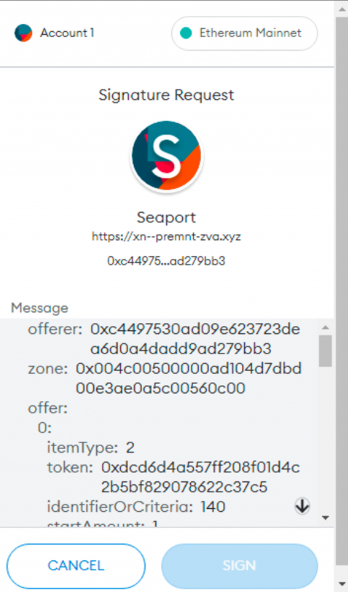

那麼 Seaport 到底是什麼以及他的風險為何？它其實是 Opensea 提出的 NFT marketplace 的合約標準，Opensea 的官方文件有詳細的解釋：https://docs.opensea.io/reference/seaport-overview

但這個協議很複雜很難短時間內完全理解，因為他支援買賣雙方可以用任意數量的 ERC-20, ERC-721, ERC-1155 Token 來交易，例如我拿 1 ETH + 一個 Azuki NFT 跟你換兩個 Beanz NFT 加一個 Otherside 土地的這種交易，非常有彈性。

不過對用戶來說主要的操作就是：在掛賣 NFT 前先 Approve Opensea 的合約使用自己的 NFT，並且簽名一個 Seaport 的 Typed Data 來代表「我願意用 xxx 價格賣出這個 NFT」的訊息，這樣未來的買家若看到滿意的 NFT 想購買，就只要把賣家已經簽好的 Signature 搭配自己發出的 ETH 送到 Opensea 的 Seaport 合約中，若通過 Seaport 合約的驗證它就會自動把對應的 NFT 轉給買家、ETH 轉給賣家（並抽一些手續費）。這樣的好處是對賣家來說不需要預先把手上的 NFT 轉給 Opensea 就能掛賣並由其他人成交。

因此這就是駭客可以利用的點：搭配 Seaport 協議的彈性，釣魚網站可以先偵測該受害者所有的 NFT collection，判斷哪些 collection 是他已經有 Approve 過 Seaport 合約使用的，找出來後騙受害者簽名一個類似「我願意用 0.0001 ETH 賣出 3 個 Azuki、5 個 BAYC、2 個 MAYC」這樣的訊息，若受害者上當他就可以馬上拿這個簽章到 Seaport 的合約去成交這筆交易，也就等同於把受害者的所有有價值的 NFT 全部轉走了。

幾個月前就有位受害者因為這個釣魚事件，被轉走了十幾個 BAYC 損失超過千萬，非常可怕。

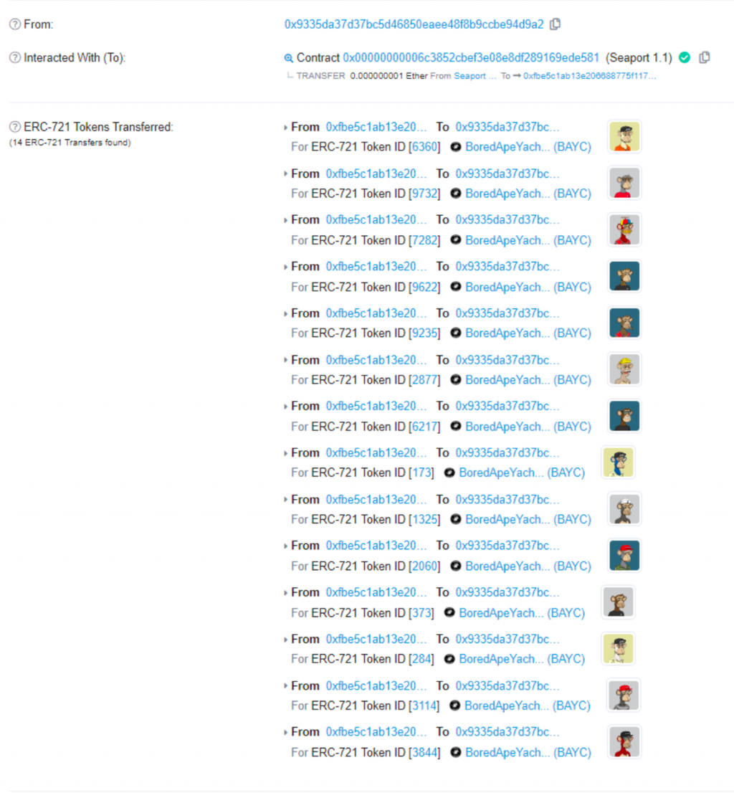

了解這個攻擊手法後，防禦的方式就很簡單：只要在 Opensea 以外的網站看到 Seaport 相關的訊息就不要簽名，因為很有可能是釣魚。

當然也不止 Opensea 合約有這樣的風險，任何 NFT marketplace 都可能有一樣的攻擊方式，例如 Blur 這個 NFT marketplace 的 bulk listing 簽名資料長得像以下這樣（[參考連結](https://x.com/realScamSniffer/status/1632707177445212160?s=20)）：

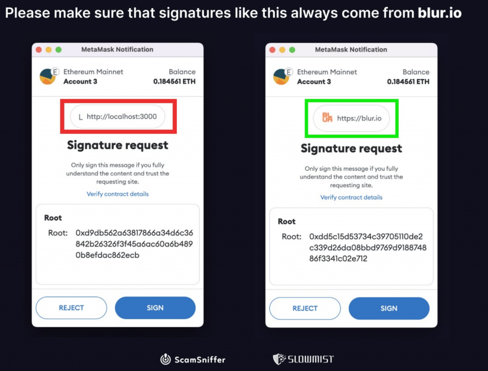

簽下去就有風險讓自己所有在 Blur 上 Approve 過的 NFT 全部被轉走。這個因為簽名中不會顯示 Blur 所以更容易被騙。因此最謹慎的方式是看到任何 Typed Data 如果是看不懂的話就不要簽，因為有可能被拿來送到某個你不知道的合約觸發了某些效果。

#### 6. Permit 訊息簽名

在 Day 25 中有介紹到部分 ERC-20 Token 會有 Permit 的功能，方便使用者不需要發送獨立的 Approve 交易就可以透過簽名 Typed Data 的方式來授權自己的 ERC-20 Token。而這就類似上面 NFT marketplace 的攻擊方式：只要騙使用者簽名一個 Permit 訊息，駭客就能把這個簽章送到對應的 ERC-20 合約中允許自己把使用者的所有幣轉走。因此當簽名訊息中有 Permit 相關文字時也要特別小心。

#### 7. eth_sign 盲簽

這個簽名方式非常危險，它是當我們在簽名所有交易或是訊息時最底層的一個方法。原理是不管交易或是訊息最終都會被 hash 成一個 64 bytes 的資料，並呼叫 eth_sign 方法來產生最終的簽名。因此如果駭客直接請求 eth_sign 的簽名，他就可以要求簽任何的交易或訊息而讓使用者完全看不出來！簽名請求如下：

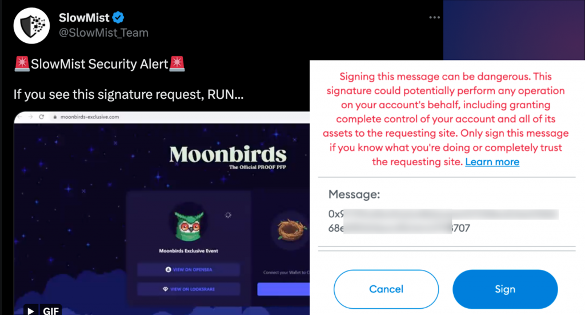

（[參考連結](https://twitter.com/SlowMist_Team/status/1581955691350106112?s=20)）

雖然有很長的警告訊息，但應該是還是有人忽略警告訊息按下簽名，導致資產被駭。因此最近 eth_sign 這個功能已經被 Metamask 預設關閉了（[官方說明](https://support.metamask.io/hc/en-us/articles/14764161421467-What-is-eth-sign-and-why-is-it-a-risk-)），也非常不建議使用者打開，因此如果不改設定的話就不會再遇到這個簽名請求了。

#### 8. 補充說明

前面講到關於簽名交易跟 Typed Data 都會有風險，那麼簽名 Personal Message 呢？一般來說因為 Personal Message 不會被放到鏈上的智能合約中做驗證（原因在 Day 7 有提到），因此其實不會有什麼問題。

#### 9. 防禦方法

了解以上許多攻擊方式後，就可以總結幾個防禦的方法，主要是在進行任何簽名時要注意：

* 確認清楚合約地址、要執行的操作、要 Approve 的對象等等
  * 確認簽名訊息的內容與作用合約
  * 不要忽略警告訊息

還有一個比較少人注意但有效的防禦方式，就是可以把已知的合約地址加入 Metamask 的 Contacts 中，這樣在簽名交易時就會顯示右邊自己設定的別名「Uniswap」而非左邊看不懂的 hex 字串：

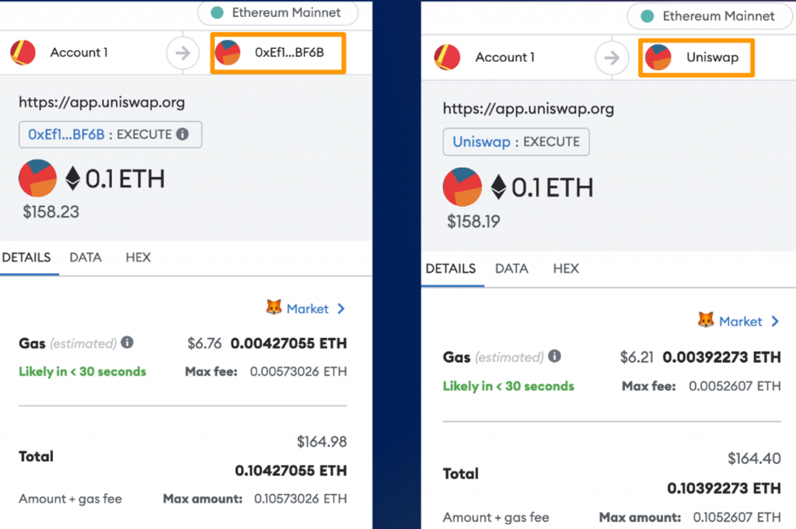

設定方式很簡單，只要在跟合約互動時點擊合約地址，幫他加一個 Nickname 後儲存就可以了。另外也可以在 Metamask 的設定頁面中找到 Contacts 新增常用的地址簿。相關步驟如下圖：

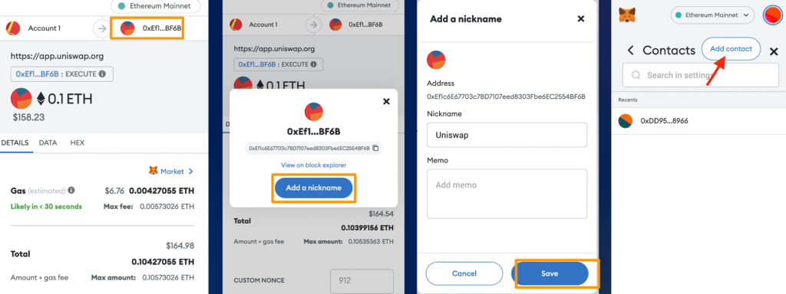

這樣就能省去每次還要到鏈上查這個地址的時間了！

#### 10. 小結

今天我們介紹了許多區塊鏈上可能會遇到的詐騙/釣魚手法、背後的原理以及如何防禦。區塊鏈上的攻擊方式不斷推陳出新，因此未來還是很可能出現其他攻擊手法，因此最重要還是確保自己能理解所有正在進行的操作，才能把風險降到最低。明天會延續操作問題再介紹幾個案例，並把剩餘的錢包與裝置問題與防禦方式講解完。

## DAY 27｜Day 27 - Web3 與資安：攻擊方式與資產保護（下）

- 原文：https://ithelp.ithome.com.tw/articles/10335476
- 發佈時間：2023-10-06 20:09:29

### 章節內容

#### 1. 未分章內容

今天我們會延續昨天提到的操作問題，來講解更多在操作上可能會遇到的風險。並講解在裝置跟錢包安全應該要注意什麼，也提供給讀者更多防禦的方式，讓各位在 Web3 操作的世界中都能更加小心謹慎。

#### 2. 誘導至釣魚網站

回顧昨天的許多例子，很多都是要在釣魚網站上進行簽名交易或訊息的操作才會被駭，而駭客就有很多方式來把使用者誘導到釣魚網站上面。

第一個方式是他會空投大量的 NFT 給很多不同的使用者，並在 Opensea 給這個 NFT 一個很高價的 offer，騙使用者去嘗試把它賣掉，類似以下這樣的 NFT：

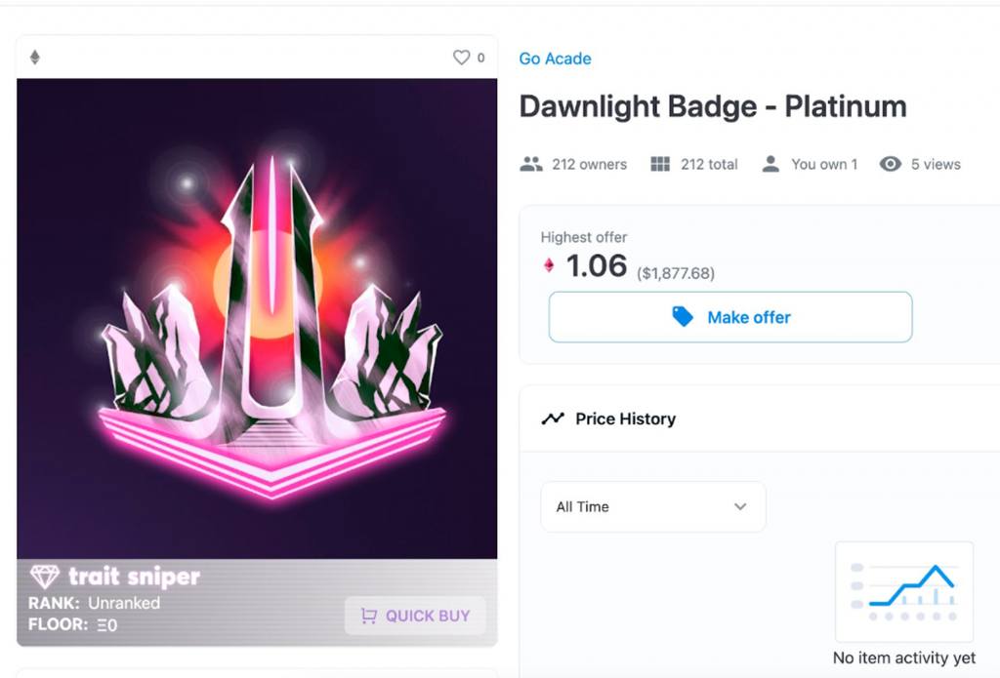

而當使用者看到高價 offer 的時候，通常會試著去接受這個 offer，但這個 NFT 的合約可能寫了一些程式碼來防止這個 NFT 被轉移（或是只有 contract owner 才能轉移 NFT），而當使用者嘗試接受 offer 時發出的交易就會失敗並 revert。這時使用者可能會在交易失敗的內容裡看到要他必須前往某個網站才能領取獎勵，這時他就可能會被騙到釣魚網站了。

當然最近更流行的是更直接的方式，就是在 NFT 的圖片上寫說恭喜你獲得了某些獎勵，請到某個網站去領取等等，不管怎樣目的都是騙使用者前往釣魚網站，並用複雜的簽名訊息來誘導使用者簽名。

另一種作法是透過在 Discord / Twitter 散佈假訊息來讓使用者連到釣魚網站，並且會用很相似的 domain name 來騙過使用者，例如曾經有用 `looksrore` 偽裝成 `looksrare` NFT marketplace 網站的案例：

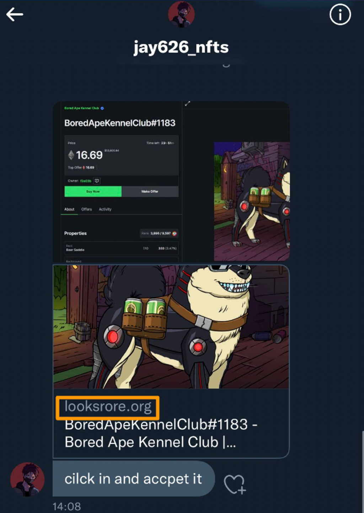

或是有一些釣魚網站他的 domain name 裡會有一些非英文字的特殊字元，例如說 o 上面多了兩個點，如果不仔細要看的話是看不出來的。

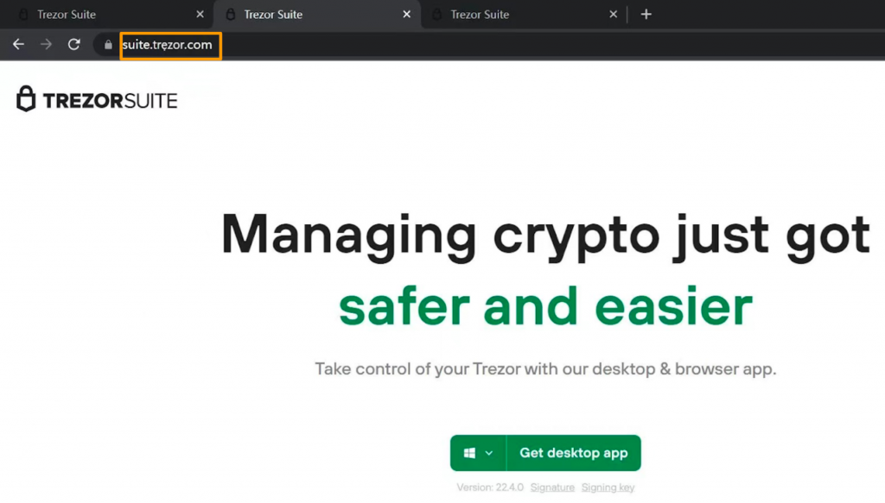

因此防禦方式很簡單，就是再三確認 domain name 跟是否正確即可，通常可以拿來跟其他管道獲得的 domain name 交叉比對去驗證（例如官方 Twitter、官網等等）。

最後還有一種比較少見的狀況，就是原本的網站被駭導致同一網址導向到駭客的網頁，這時會出現 https 憑證錯誤，代表駭客很可能正在進行中間人攻擊，去監聽流量並在網站內注入惡意的程式碼，導致跳出惡意的簽名內容。過去 MyEtherWallet 就曾經因為這個方式被駭，導致使用者 1700 萬美金的損失。

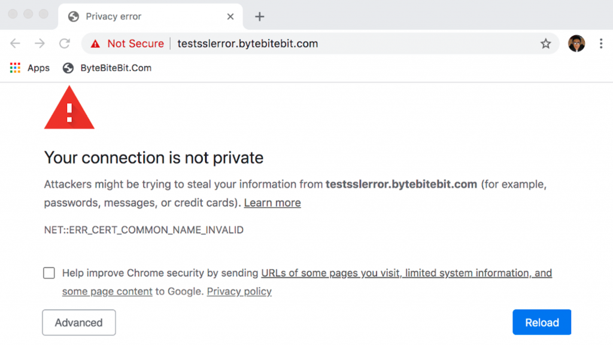

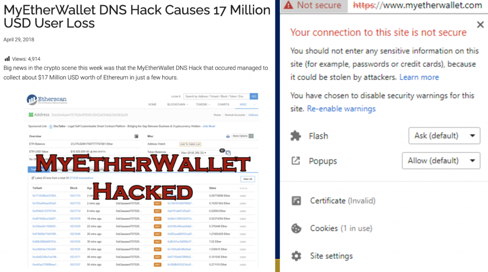

因此當瀏覽器提示有 https 相關錯誤時，不要繼續前往該網站是最好的防禦方式。

#### 3. DeFi 惡意智能合約

再來另一類型的操作問題是跟 DeFi 或惡意的智能合約有關，也就是當使用者跟這些惡意合約互動時也可能造成資產損失，而他通常會用很高的 APY 或是他的幣一直漲來吸引使用者投資進去。

例如之前有個著名的魷魚幣 rug 事件，他的幣一直漲吸引了許多人，但其實 contract owner 是可以 rug 流動性的，也就是可以一瞬間把這個流動池裡的錢全部抽走，如果沒有去仔細看這個智能合約的話，那就可能會被這種合約騙到。

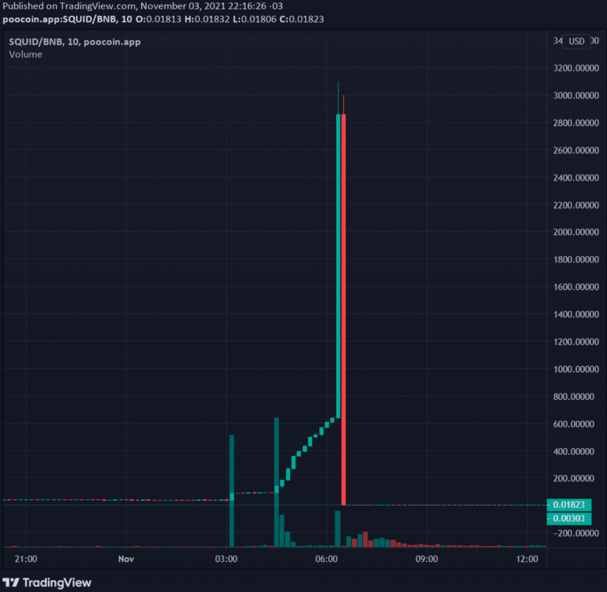

而且這種案例通常合約是不會開源的，代表沒辦法去驗證你存進去這個合約的錢到底是不是安全、在自己掌控範圍內的。因此沒開源的合約也通常代表著更高的風險。有些幣甚至會做成只能買不能賣的合約（也被稱為貔貅盤或殺豬盤），導致使用者以為自己賺很多但最後根本賣不掉。

第二種狀況是在 DeFi 協議中，如果 Admin 的權限過大也會有問題，例如如果合約的 Owner 有權力改變這個 DeFi 協議的關鍵參數，或是把資金緊急撤走，那也是個潛在的風險。因為我們不確定這個 Owner 地址背後的私鑰的控制者會不會突然發起這種交易，而這也失去「Decentralized Finance」的本意了，因為如果有一個人能夠控制整個協議的話，其實是非常中心化的行為。

因此比較嚴謹的 DeFi 協議可能會對關鍵參數的修改引入 Time Lock 的機制，也就是例如 Owner 想要改一個參數，那他可能必須要先提出更改提案（要發個交易上鏈），等待至少 48 小時後才能真正修改這個參數，這樣就會有一段時間讓大家評估、檢視這個決定，或是把資金給移走。讀者在研究 DeFi 合約機制時可以特別留意是否有這類的設計。

#### 4. 0U 投毒

最後還有一種今年比較流行的方式：「0U 投毒」，例如當我從地址 A 把一些 USDT 轉給另一個地址 B，這時候駭客可能會觸發另外一筆 USDT 的轉移交易，轉 0 個 USDT 到另一個駭客控制的地址 C。比較特別的是這個地址 C 的前四位跟後四位跟用戶轉去的地址 B 是一樣的，這樣下次用戶如果只有核對轉帳地址的前四位跟後四位，有可能就不小心轉到了駭客的 USDT 地址。

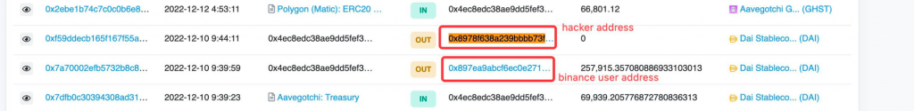

這個攻擊手法已經累計造成數百萬美金的損失。背後的原理是這些智能合約內的邏輯是允許我幫別人的地址轉出 0 USDT 的，畢竟不會有任何資產轉移（不確定是 bug 還是 feature？），而這樣的交易紀錄就容易讓不熟區塊鏈的使用者受騙。

對駭客來說可以預先產生好 16^8 約等於 42 億個地址，也就是對於所有前四位跟後四位的組合，都算出一個自己能掌握的地址，就可以在監聽鏈上活動發現有人轉移 USDT 時，馬上發起一個詐騙用的交易。

#### 5. 裝置問題

接下來講解關於錢包跟裝置的問題，也就是對應到昨天全景圖中的左半部分：

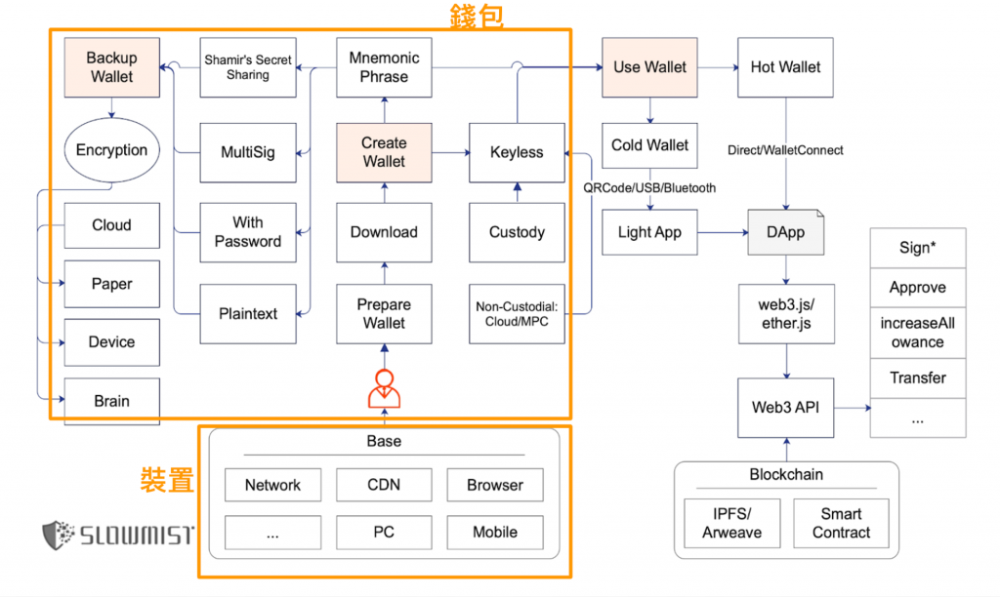

這裡的攻擊手法就會比較偏 Web2。例如最常見的就是駭客會想辦法讓你安裝惡意程式進電腦，像是透過各種盜版軟體、在 Google 下廣告等等方式，讓使用者裝進電腦。而這種惡意程式通常就會想辦法取得電腦上的機敏資料，例如去讀瀏覽器的 Cookie 甚至掃過電腦中所有資料夾來找有沒有檔案有存註記詞。

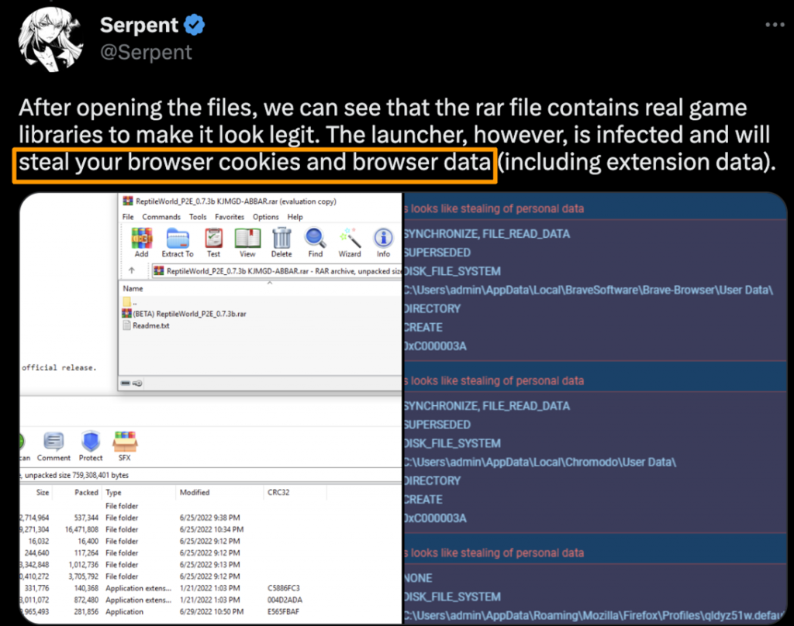

知名的 Twitter KOL “NFT God” 也曾經受騙上當，安裝了假的 OBS 直播軟體導致他的大量 NFT 被轉走。而這背後是駭客投放了 Google 廣告讓他的網站結果被顯示在最前面。

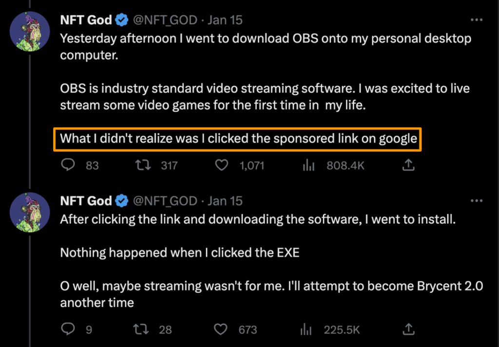

另外還有一種惡意軟體會做的事，就是「剪貼簿攻擊」，主要是透過監聽使用者的剪貼簿，來偵測是否有複製類似錢包私鑰或註記詞的字串。甚至會偵測使用者是否正在複製一個錢包地址，並在使用者想打幣給該地址時，偷偷置換成駭客自己的地址。

因此防禦方式是不下載任何可疑的 email 附件、檔案，或是在搜尋並安裝軟體時忽略 Google 廣告的內容、確認網址是否正確。以及在轉帳前還是必須再三確認即將送出的地址是否真的是想轉入的地址。

另外其實瀏覽器 Extension 的權限也很大，例如有些權限可以任意修改頁面中的內容，這也讓駭客有機會把交易所的入金地址置換成他自己控制的地址。因此在安裝瀏覽器 Extension 時也要特別注意他請求了哪些權限、是否請求比他需要的更多的權限。

#### 6. 錢包問題

在錢包軟體本身也有被攻擊的環節，例如知名錢包軟體 BitKeep 在去年就曾爆出因為 APK 被駭客修改，導致許多用戶的資產遭駭的事件（[參考連結](https://www.blocktempo.com/bitkeep-wallet-was-attacked/)）。由於官方沒有公佈詳細的攻擊根本原因，只能猜測可能是駭客置換了官網的 APK 下載連結成包含惡意程式的版本，讓使用者開啟後偷讀取私鑰並上傳。

因此防禦方法就是都從官方的 Google Play / App Store 管道下載應用，而不裝從其他地方下載的 APK 檔，就能很大程度地避免這種攻擊，因為駭客要攻擊到換掉 App 開發商在 Google Play / App Store 的 App 是更困難的，而這個安全性來自於開發者上傳 App 到雙平台時都必須經過簽章的認證。

再來有一個比較針對性的攻擊方法，也就是去年有位使用者的 Metamask 錢包備份被釣魚後遭到破解。駭客首先打電話給他假裝自己是 Apple 客服，並要求他提供驗證碼，因此釣魚成功取得受害者在 iCloud 上的 Metamask 備份

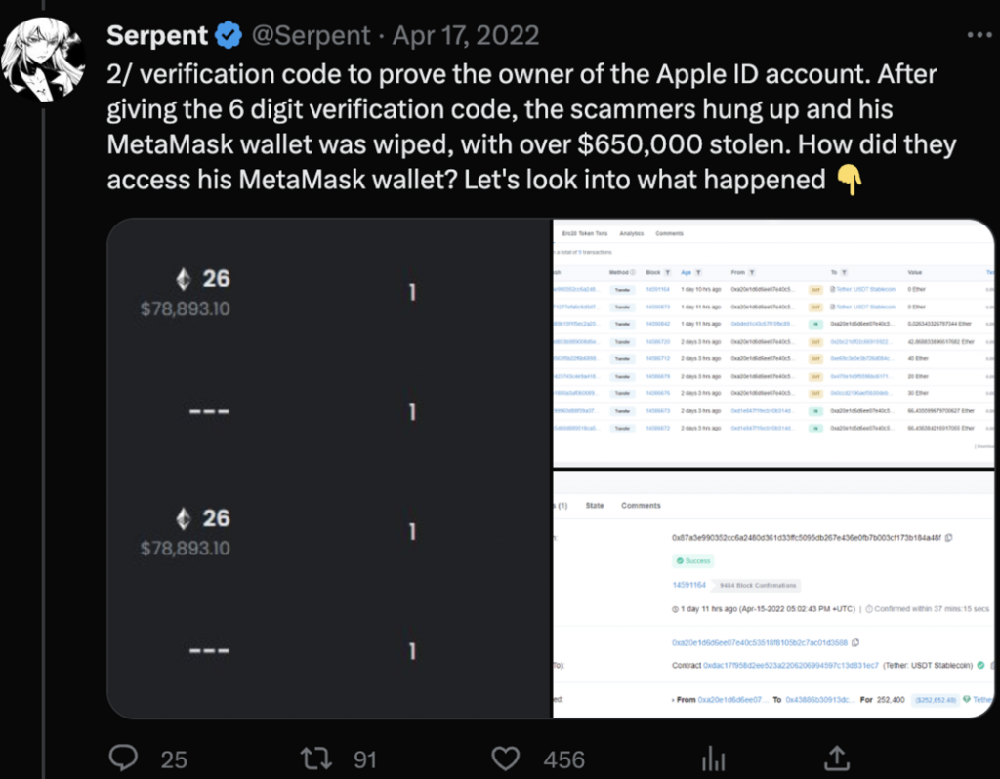

（[參考連結](https://twitter.com/Serpent/status/1515545806857990149?s=20)）

理論上 Metamask 存在 Storage 中備份上 iCloud 的資料是經過我們設定的密碼加密產生，那為什麼還會被駭呢？很可能是駭客已經從其他渠道取得這個人常用的密碼組合（很多平台如果資安防護沒做好，駭客可能偷得到使用者的密碼），嘗試幾個後就成功把受害者的錢包私鑰解開了，這通常被稱為撞庫攻擊。因為以 Metamask 的加密強度，要在短時間內破解就算是超級電腦也很困難。

因此防禦方法就是不要提供任何驗證碼給別人，而有些人會選擇關閉 iCloud 備份來避免比較機密的資料被備份到雲端。不過在錢包中設定一個夠長且唯一的密碼更重要，因為越長的密碼可以讓破解難度成指數級增長。

關於密碼強度[這篇文章](https://www.hivesystems.io/blog/are-your-passwords-in-the-green)有十分形象化的解釋，簡單來說越長或有越多特殊符號的密碼是越難破解的，也就是越右下方越安全：

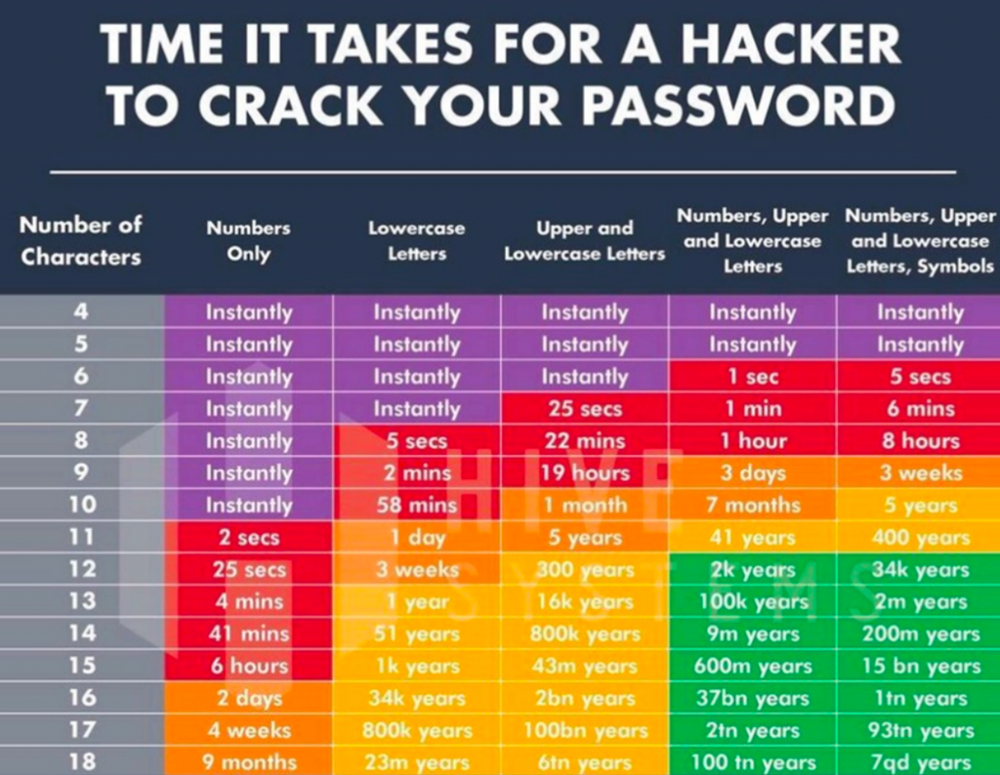

雖然密碼的破解難度還受到 hash 方式的強度影響今天不會深入講解，不過這張圖可以給讀者一個概念，評估自己的密碼強度多高。

#### 7. FAQ

關於操作安全、裝置安全與錢包安全等議題，以下整理一些常見的 FAQ：

Q: 如果我的錢包「連接」上了釣魚網站，會有被盜風險嗎？

A: 沒有簽名任何訊息或交易的話基本上沒風險

Q: 如果我的錢包被簽名惡意訊息/交易的方式騙走資產，就不能用了？

A: 就算取消授權了還是不建議繼續用，因為 Signature 在少數情況可能可以重復使用

Q: 我被盜的原因是註記詞被駭客猜到 / 暴力破解了？

A: 不可能（除非使用了[有漏洞的 Profanity](https://medium.com/amber-group/exploiting-the-profanity-flaw-e986576de7ab) ，因為由他產生的註記詞可被破解）

Q: 註記詞洩漏後，還能嘗試轉 ETH 進去把其他 NFT 轉出來？

A: 可以嘗試但有可能會被瞬間轉走。理想做法是搭配 Flashbot 把多個交易綁在一起送出

Q: 熱錢包在電腦還是手機上比較安全？

A: 手機（iOS 再比 Android 安全），因為電腦的攻擊表面較大

#### 8. 更多保護措施

除了前面提到的保護措施外，以下再介紹幾個方式。

#### 9. 冷錢包

為了避免私鑰/註記詞的明文在電腦上以任何形式暴露，許多人會推薦使用冷錢包，他的原理是讓私鑰只存在一個小型 USB 裝置中，當使用者要進行任何簽名時都必須將裝置連接到電腦，並在裝置上確認簽名。這樣就算不小心安裝了惡意軟體在電腦上，他也沒辦法讀到冷錢包的私鑰。

市面上有許多冷錢包廠商可選擇，如 Ledger, Trezor, SafePal, CoolWallet 等等，有興趣的讀者可以多研究他們之間的安全機制差異。但冷錢包並無法避免簽署到惡意的交易或訊息，在這種狀況的好處是可以幫助你在操作前三思，因為進行交易變得更麻煩了。

#### 10. Browser Extension

在惡意簽名的防範上也可以借助一些 Browser Extension 工具，來偵測當下簽名的東西是否有異常。較知名的選項有：

* [Fire](https://www.joinfire.xyz/)
  * [Wallet Guard](https://www.walletguard.app/)
  * [Pocket Universe](https://www.pocketuniverse.app/)

這幾個 Extension 都能在一筆交易或簽名前先模擬交易會產生的效果（如 Approve Token 或轉移 NFT），背後是透過交易在 EVM 中的 Simluation 來實際模擬交易會產生的 state change。更進階也有偵測現在連接的網站是否有可能是釣魚網站的功能。或是 [KryptoGO Wallet Extension](https://chrome.google.com/webstore/detail/kryptogo-crypto-nft-walle/bgaihnkooadagpjddlcaleaopmkjadfl) 也內建了交易安全相關的功能，有興趣的讀者可選擇適合自己的使用。

#### 11. 小結

Web3 相關的資安議題其實水非常深，這兩天提到的主題都可以再深入講許多，不過掌握了幾個原則跟基本概念後，就能幫助我們在 Web 3 的世界中謹慎提防任何可能有風險的地方。而針對 Web3 資安想深入學習的讀者，可以從 [Web3 Security Tools](https://github.com/Quillhash/Web3-Security-Tools) 這個 repo 去找相關資源，裡面整理了許多資安相關的工具。明天我們會探討熱錢包應該要如何安全備份的議題。

## DAY 28｜Day 28 - Web3 與資安：私鑰保存與備份

- 原文：https://ithelp.ithome.com.tw/articles/10335962
- 發佈時間：2023-10-07 15:59:15

### 章節內容

#### 1. 未分章內容

今天我們會講解一般有哪些保存與備份私鑰的方法，而許多錢包 App 都有提供幫使用者備份的選項，因此也會介紹他們的作法以及背後的原理，如 Key Derivation, Shamir’s Secret Sharing 等等。以及較新型的 MPC 錢包是如何運作的。

#### 2. 私鑰保存

由於去中心化的精神強調使用者應該要能自己保存自己的私鑰與註記詞，但很多時候要人們記下 12 字的註記詞並安全的保存也是一個高的門檻，會成為初次進入 Web 3 使用者的障礙。因此如何方便又安全的保存私鑰是歷久不衰的議題。

一般來說方便性跟安全性是個取捨，假設我們想自己保管註記詞，以下提供四個等級的註記詞保存方式。

#### 3. Level 1

* 抄在紙上：是最簡單的方式，但如果紙張丟失或被破壞就無法復原，或是有紙張被其他人找到的風險。
  * 存在電腦的檔案中：容易存取，但有被駭客或惡意軟體竊取的風險。
  * 存到 Google Drive / Gmail / USB / …：方便跨設備存取，但同樣有被駭客或服務提供商竊取的風險。

#### 4. Level 2

可以把存有註記詞的文件用密碼加密、壓縮成 zip 檔，並備份到 Google Drive。多了一層密碼保護會比 Level 1 的方式更安全，但若密碼被洩漏或忘記，一樣有資產丟失的風險。

#### 5. Level 3

針對物理備份方式，如果想擁有較高的物理安全性，也有幾種能防火、防水、防銹、防毀損的備份方式，可以保護註記詞不像紙張儲存那樣容易被自然因素破壞。市面上有許多冷錢包廠商有提供這種備份方式，通常會用鋼板把註記詞排列出來，或是自己刻在上面，都是更耐久的保存方式。

#### 6. Level 4

已經有許多人在思考死後要如何讓其他人取得自己的區塊鏈資產，因為以上這幾種方式都可能因為只有該使用者知道註記詞在哪，而在死後沒辦法被找回。

因此一種作法是透過智能合約搭配 Oracle 來監控是否使用者在一段時間內都沒有活動，若符合條件就自動把資金轉移給指定的人，避免使用者因意外而無法操作錢包。但目前這類的解決方案都還沒有到很成熟，畢竟要自動且準確的偵測這件事十分困難，機制也要不能被駭才行。期待未來有更成熟的作法。

以上講解了幾種使用者自己備份註記詞的作法，那麼在各種錢包 App 中是怎麼做備份的呢？

#### 7. 錢包 App 備份

許多錢包 App 為了降低使用者進入 Web3 的門檻，會希望透過較直觀可理解的方式來幫使用者備份私鑰，以下舉幾個例子。

#### 8. Rainbow

Rainbow Wallet 提供設定密碼備份的選項，在 Android / iOS 上分別可備份到 Google Drive 與 iCloud。而為了讓雲端服務商沒辦法解開使用者的私鑰，通常會設計成如果忘記密碼就無法幫使用者還原回來。

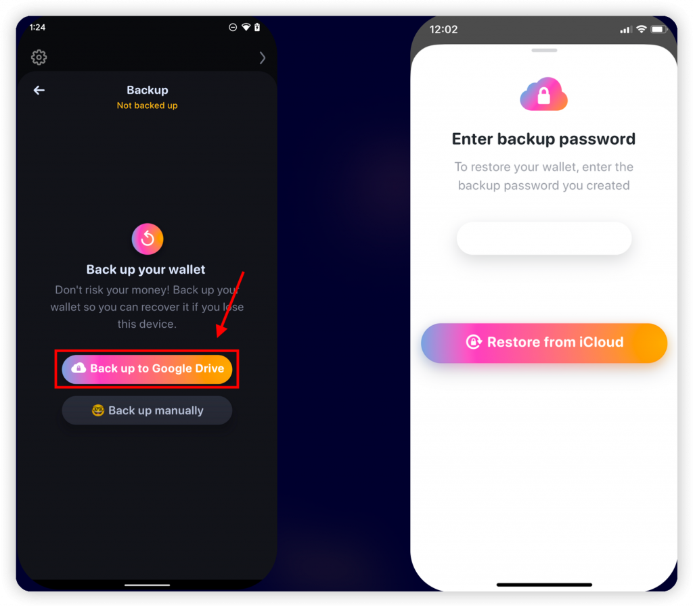

#### 9. OKX Wallet

OKX Wallet 同樣也提供用密碼備份的作法，可以看到這是市面上錢包目前最流行的備份方式。

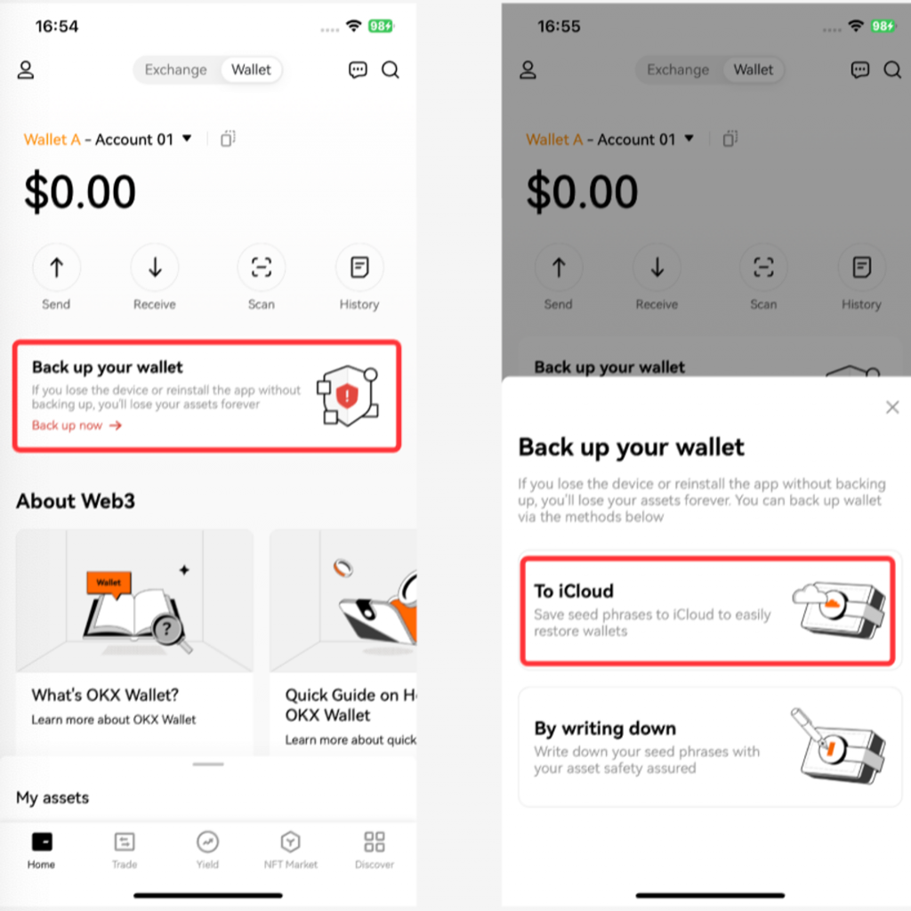

#### 10. Argent

Argent Wallet 的備份方式比較特別，按照[官方文件](https://www.argent.xyz/blog/off-chain-recovery/)的寫法，他們備份的方式是會先生成一把 Key Encryption Key（KEK），也就是用來加密私鑰的私鑰，會把它存到 Argent 的雲端。並用 KEK 加密錢包的私鑰後備份到 iCloud 或 Google Drive 上。這樣的好處是 Argent 或 iCloud/Google Drive 任一方都解不出使用者的私鑰，並且可以做到不需要密碼來還原錢包。

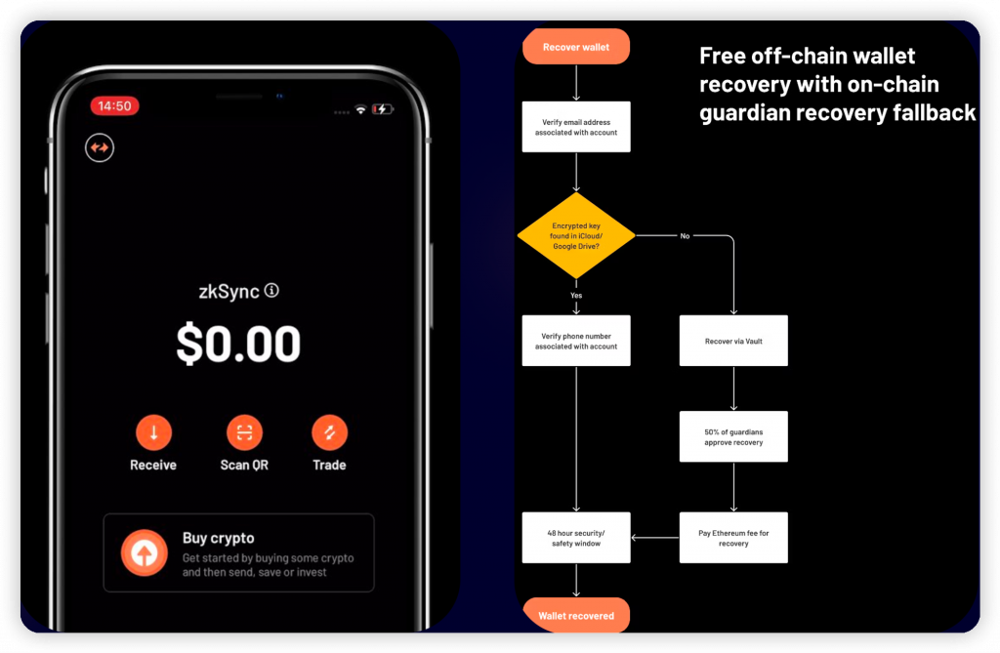

#### 11. KryptoGO

KryptoGO Wallet 中也提供了用密碼備份的選項，並且要求至少要 12 字來確保安全性，這樣使用者在其他裝置登入也可以用密碼找回錢包。

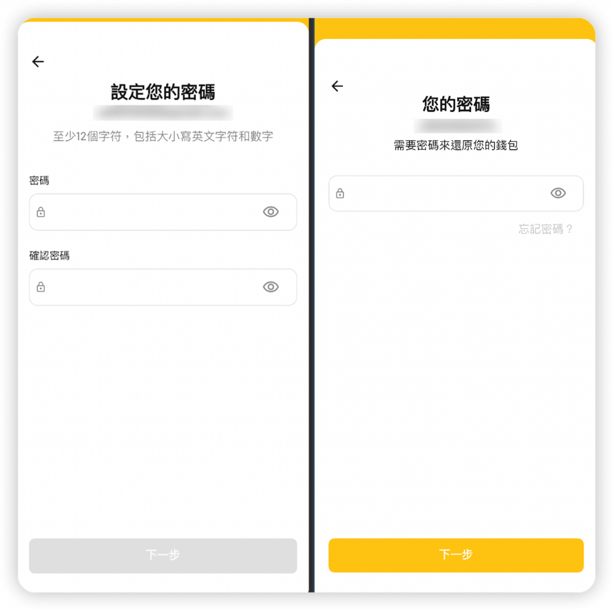

而密碼備份本質上就是對私鑰與註記詞經過一層加密後備份上雲端，只是這個加密所使用的 Key 是從密碼算出來的，通常會把這個流程稱為 Key Derivation。常見的作法是透過密碼加上 Salt 後，經過一系列的 Slow hash function 的計算，來算出一個可用來做對稱式加密的 Key。

會選用 Slow hash function （如 Argon2, bcrypt, PBKDF2 等等）的目的是讓暴力破解的難度大幅增加，另一方面也要在計算 key derivation 時不要讓使用者等太久（例如幾百毫秒內算完）。關於 KryptoGO Wallet 中使用的密碼備份安全機制，詳細可參考[這份文件](https://www.kryptogo.com/docs/wallet-security)。

#### 12. SSS 備份機制

除了以上許多錢包採用的密碼備份機制以外，還有一個備份方式可以讓使用者不需記憶密碼，又維持高的安全性，也就是 Shamir’s Secret Sharing Scheme（SSS）。

SSS 的概念是可以把一個私鑰 (Secret) 拆分成 n 個碎片，各自存放在不同的地方，只需要任選其中 k 個私鑰碎片就能恢復出完整的私鑰。例如在 n=3, k=2 的狀況會有三個私鑰碎片，而只要取得兩個碎片就能還原出完整的私鑰。

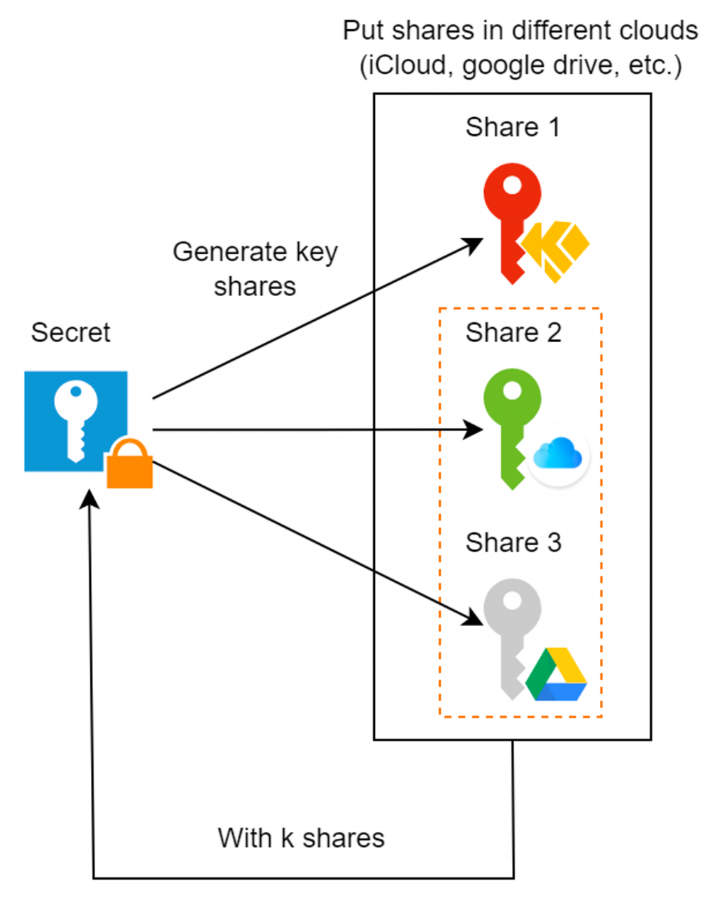

因此在 KryptoGO Wallet 中，當使用者選擇使用 SSS 備份時，會將使用者的私鑰碎片備份到 KryptoGO 雲端、iCloud/Google Drive 雲端上，來讓使用者未來換裝置登入時也能直接還原出錢包。

而 SSS 演算法也有一個良好的特性，就是持有一個 secret share 並不會降低暴力破解出 secret 的難度，因此不管是 KryptoGO, iCloud, Google Drive 就算有一個地方的資料外洩，也不會造成資產損失。

SSS 背後的原理是利用建立一個 k-1 次方的多項式函數 `f(x)`，並在這個多項式函數圖形上找出 n 個點來作為各自的 Secret Share。至於原始的 Secret 值則是 `f(0)`，這樣就能使用「k 個點能唯一決定一個 k-1 次方的多項式」性質，透過 n 個 Secret Share 中的任意 k 個 Share 來還原出原本的多項是，進而算出 `f(0)` 也就是原始 Secret 的值。

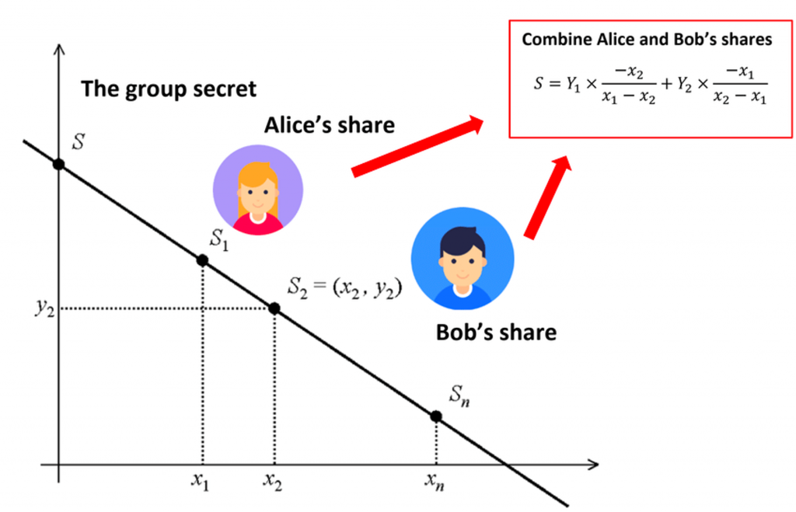

而還原出 k-1 次方多項式的作法是用到[拉格朗日差值法](https://en.wikipedia.org/wiki/Lagrange_polynomial)，已經有相關的數學公式來直接計算：

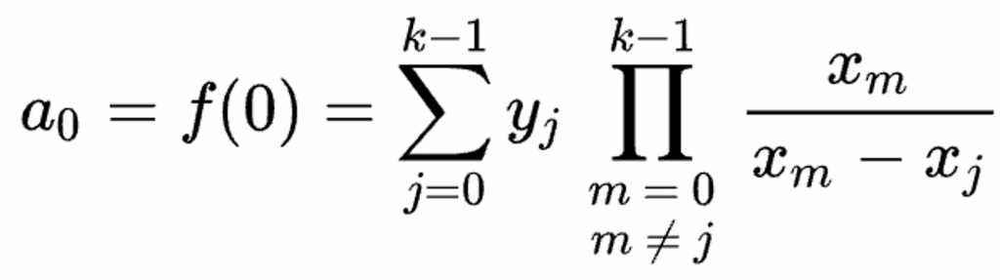

在 KryptoGO Wallet 中也有提供透過 SSS 備份錢包私鑰的功能，結合前面提到的密碼備份選項讓使用者自由選擇：

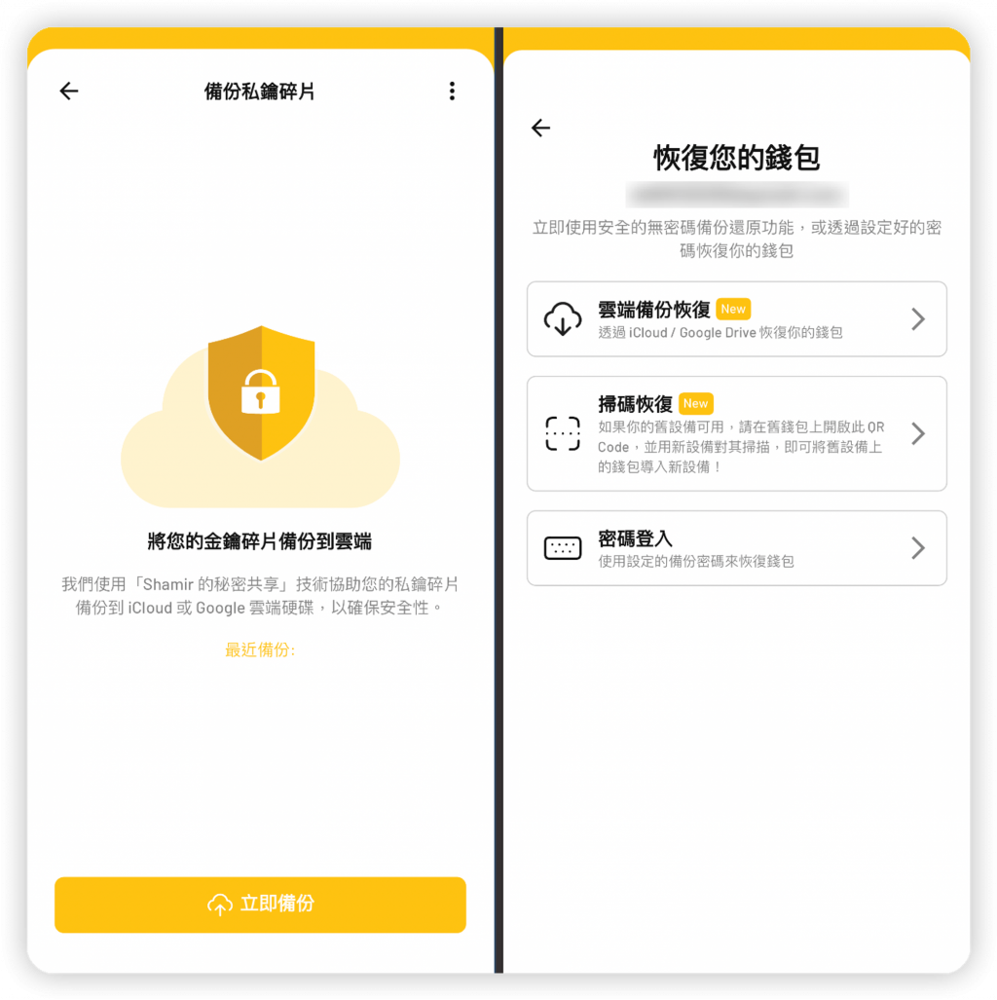

#### 13. MPC 錢包

近年來開始流行的是 MPC 錢包，它的全名是 Multi Party Computation 或稱多方運算，會出現的背景是因為不希望單一裝置有機會拿到完整的私鑰，因為如果私鑰的明文曾經被某個裝置計算出來過，極端情況下有裝置被入侵的風險。因此這個做法也會把私鑰拆成多份，但不同的是沒有一個人能組出完整的私鑰：

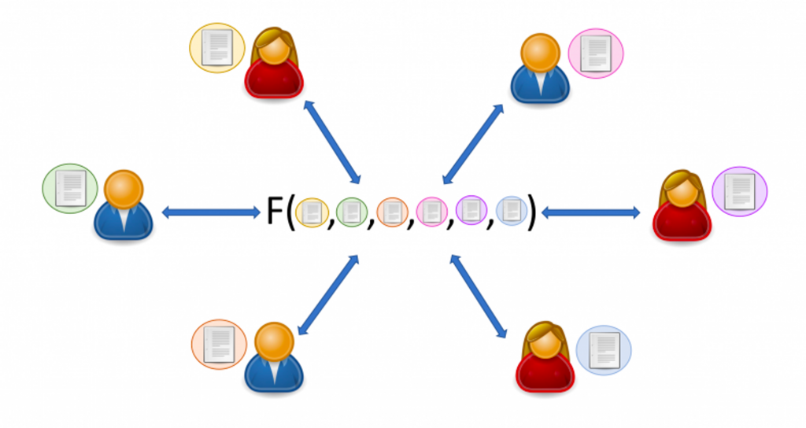

而 MPC 的精神是讓一群人共同計算一個函數的回傳值，但對其他人的資訊一無所知。因此在 MPC 錢包中的作法是：

1. n 個參與者各自持有私鑰的一個 secret share（通常是使用者自己跟錢包服務商）
  2. 當要簽名時，每個人各自先基於自己的 secret share 算出部分的簽名。
  3. 由某一方透過複雜的演算法組合大家的部分簽名，算出最終的簽名。

對 BTC, ETH 鏈的 MPC 錢包來說，在計算交易簽章時需要計算的 function 是 ECDSA 簽章，因此必須設計能算出 ECDSA 結果的 MPC 演算法。這種演算法十分複雜，已經超出了今天的範圍，有興趣的讀者可以參考 [Fast Secure Two-Party ECDSA Signing](https://eprint.iacr.org/2017/552.pdf) 論文， 還有 [ZenGo 錢包的實作](https://github.com/ZenGo-X/multi-party-ecdsa)。

由於前面提到的 MPC 作法是需要所有參與者一起計算，那有沒有像 SSS 演算法那樣只需要部分參與者就能算出結果的作法呢？這個其實就是 TSS (Threshold Signature Scheme) 演算法。他可以讓 n 個參與者中只需要 k 個人就有能力一起對一個交易做簽名，來做到更好的冗余性。有興趣的讀者可以參考 OKX 錢包中的 TSS 功能是如何實作的：https://github.com/okx/threshold-lib/blob/main/docs/Threshold_Signature_Scheme.md

#### 14. 小結

今天我們介紹了作為使用者可以怎麼備份自己的私鑰註記詞，以及一般錢包服務會透過哪些方式來協助使用者安全又便利的備份。接下來最後兩天會介紹一些 Web 3 世界中較前沿的技術，提供讀者對 Web 3 技術更全面的認識。

## DAY 29｜Day 29 - Web3 與前沿技術：基礎建設與去中心化應用

- 原文：https://ithelp.ithome.com.tw/articles/10336560
- 發佈時間：2023-10-08 18:30:44

### 章節內容

#### 1. 未分章內容

今天我們來探討一些 Web3 的前沿技術。由於 Web3 的技術日新月異，持續有新技術和升級出現，今天會簡要介紹幾個領域及並搭配具有代表性的案例，幫助讀者更全面地了解 Web3 相關技術。

#### 2. 基礎建設

基礎建設主要涵蓋協議、公鏈、儲存和數據等核心技術，它對區塊鏈如何擴展應用範圍且降低使用成本扮演著重要的角色。

#### 3. Layer 2 (L2)

在探討 Layer 2 之前我們首先需要明白 Layer 1（L1）。Layer 1，如 Bitcoin、Ethereum、Solana 和 Tron 等鏈，都具有完整的區塊鏈功能，也就是他們都不需要依賴其他鏈並具有獨立的共識機制，因此被稱為 Layer 1。

相對的 Layer 2 是基於 Layer 1 鏈之上建立的擴展解決方案，其目的是提高交易速度（TPS）和降低交易成本（Gas Fee）。並且 Layer 2 主要依靠 Layer 1 的安全性，將 Layer 2 中紀錄的部分數據上到 Layer 1 鏈以確保交易的真實性和不可篡改性。

要實現 Layer 2 主要有三大技術：State Channel、Plasma 和 Rollup。State Channel 是一種雙方參與者之間的私密通道，Plasma 則是一種層次化的區塊鏈架構，而 Rollup 則通過打包多筆交易來減少交易數據。目前最主流正在發展的是 Rollup 技術。

Rollup 又分成 ZK Rollup 和 Optimistic Rollup 兩種。ZK Rollup 使用零知識證明確保交易的完整性和隱私，而 Optimistic Rollup 則是選擇性地在發生爭議時進行計算。兩者的差別在於，ZK Rollup 的交易驗證是即時和完整的，而 Optimistic Rollup 是選擇性的驗證，數據如果在鏈上經過一定的時間沒有被挑戰，他的最終性（Finality）才算是被確定下來。Vitalik 特別看好 ZK Rollup，因為它可以在保證高效性的同時確保數據的安全性，詳細可以參考 Vitalik 的文章 [An Incomplete Guide to Rollups](https://vitalik.ca/general/2021/01/05/rollup.html)。

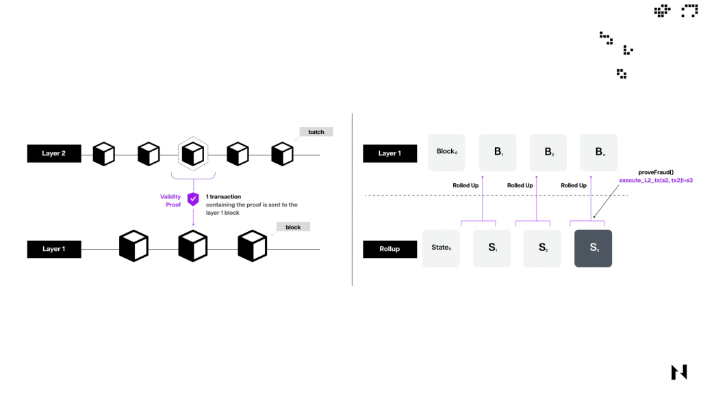

([圖片來源](https://www.nervos.org/knowledge-base/zk_rollup_vs_optimistic_rollup))

另一方面像 Optimistic Rollup 由於需要把 Layer 2 的資料打包到 Layer 1 上，資料存到 Layer 1 上時的交易手續費就至關重要。這個就是 EIP-4844 提案想解決的問題：目的是降低將 Layer 2 資料打包到 Layer 1 的手續費。它增加了一種名為 blob 的資料類型，用它來儲存資料有助於減少 Gas Fee 和提高吞吐量。這項更新預計將於明年第一季度的坎昆升級中上線。

#### 4. Sharding

Vitalik 一直在推動在以太坊中實施 Sharding 技術，以進一步提升性能和減少成本。Sharding 技術將以太坊區塊鏈分割成多個獨立運作的片段，使得每個節點只需要處理一個片段中的交易，以大幅提高網路的擴展性和交易速度。

以太坊的路線圖正朝這個目標前進，前面提到的 EIP-4844 其實是 Proto-Danksharding 機制的一部分，它是為了以太坊未來要實施的 Full Danksharding 做準備。詳細概念可以參考以太坊官方的 [Danksharding 文件](https://ethereum.org/en/roadmap/danksharding/)的介紹。

Vitalik 曾提出以太坊接下來六個階段的路線圖，包括：The Merge, The Surge, The Scourge, The Verge, The Purge, The Splurge。目前正在積極發展 The Surge 階段，這階段的目標就是通過 Rollup 技術實現每秒 10 萬筆交易。

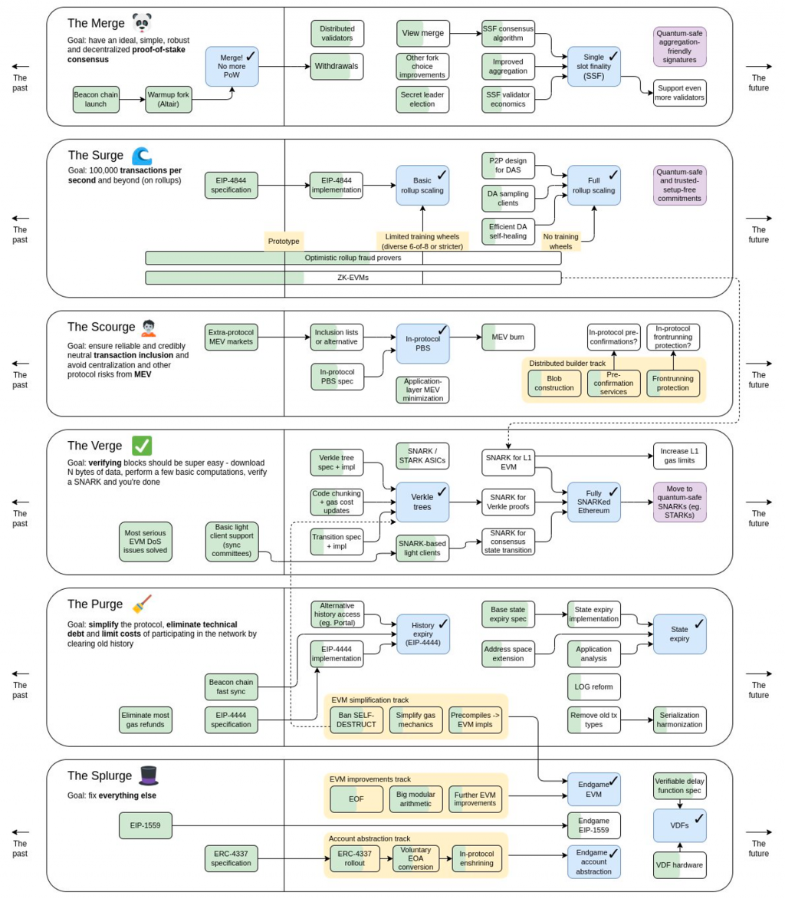

對詳細資訊有興趣的讀者可以參考[以太坊官方路線圖](https://ethereum.org/en/roadmap/)。

#### 5. MEV

MEV 的全名是 Miner Extractable Value，允許礦工通過交易排序或選擇哪些交易被包含在下個區塊中來獲取額外收益。其中 Searcher 是主要的套利者，他們在 mempool 中查看待確認上鏈的交易，並尋找對受害者進行套利的機會，有時會造成許多損失。

Flashbots 是 MEV 生態中的核心服務，它提供競價機制讓 Searchers 互相競爭，並為礦工提供具有 MEV 功能的 go-ethereum 版本（[連結](https://github.com/flashbots/mev-geth)），幫助礦工打包由 Searchers 而來的套利交易。因為套利交易中通常會給更高的 Gas Fee，對礦工來說是有經濟誘因的。

MEV 攻擊可以分為 front run 和 back run 兩種。Front run 是當一個交易被偵測到且有利可圖時，Searcher 發出一個套利交易並付更高的 Gas Fee 提前完成它。Back run 則是在原始交易之後發出一個交易以獲利。

舉個三明治 MEV Bot 的例子，當機器人偵測到 mempool 中有一筆用 USDT 買入 ETH 的 Swap 交易時，Searcher 可以在這筆原始交易之前插入一筆一樣用 USDT 買入 ETH 的交易（Front Run），並在原始交易後插入一筆賣出 ETH 至 USDT 的交易（Back Run），把這三個交易打包起來送出後，就可以在一個 Transaction Bundle 中達到低買高賣的套利效果。詳細機制可以參考[這篇文章](https://www.blocknative.com/blog/what-is-mev-sandwiching)。

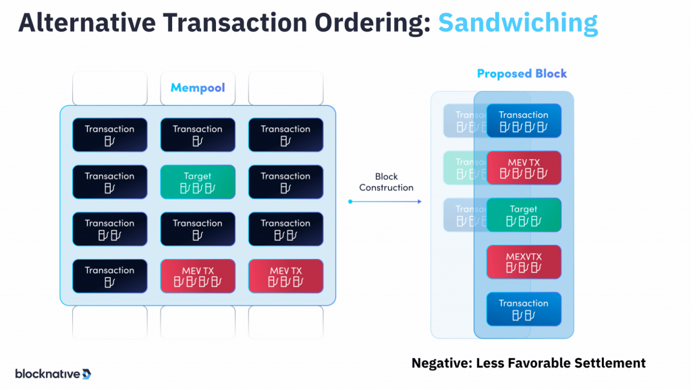

但這也跟使用者設定的滑點有關，如果 Swap 設定的滑點越高越有可能受到 MEV 攻擊，因為 Searcher 就可以在 Front Run 交易中用更大額的資金來對價格產生更大的影響。最極端的狀況是幾個月前有人把 3CRV 代幣換成 USDT 時因操作不當而被 MEV 套利攻擊，誤把兩百萬美金 swap 成 0.05 USDT，應該也跟他的滑點設定太高有關（[參考連結](https://zombit.info/unfortunate-guy-lost-2m-3crv-2m-in-one-transaction/)）。

MEV 攻擊還有許多不同的種類，還有像是 DEX 套利、清算交易等等，更多的詳細機制可以參考[這篇文章](https://www.blocktempo.com/the-secret-of-mev-on-ethereum/)。

#### 6. Layer 0 與跨鏈協議

除了既有的 L1, L2 區塊鏈以外，有一些應用場景會需要搭建自己的鏈，例如著名的 GameFi 遊戲 Axie Infinity 就在自己建立的 Ronin 鏈上儲存遊戲的 NFT 與代幣資訊，或是像 dYdX 鏈上永續合約協議決定自己用 Cosmos SDK 建立屬於自己應用的鏈，目的都是為了降低手續費與加速交易的執行，也有一個好處是這些應用專屬的鏈就不會受到既有 L1 鏈的擁堵程度所影響。而能幫助開發者快速建立新的鏈並維持跟既有鏈的互通性正是 Layer 0 想解決的問題。

現在較知名的三個 Layer 0 協議為 Cosmos, Polkadot 和 Avalanche，開發者都能用他們的 SDK 建立專屬自己應用的鏈，並且內建跨鏈的功能，例如 Cosmos 的 IBC 以及 Polkadot 的 XCMP 協議都是能夠跨鏈傳輸訊息的方式，相關機制可以參考[這篇文章](https://medium.com/the-interchain-foundation/eli5-what-is-ibc-def44d7b5b4c)。

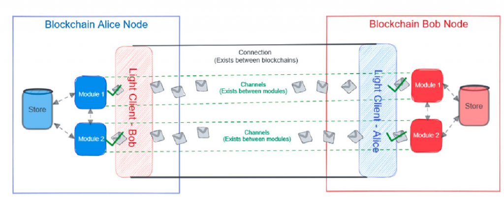

#### 7. 去中心化應用

在基礎建設之上誕生了一系列的去中心化應用，各有他們想解決的問題

#### 8. DeFi

從 2020 年開始的 DeFi Summer 是各種 DeFi 協議迅速增長、許多人投入資金的時期，當時產生了一批關於借貸、流動性挖礦相關的 DeFi 應用。從 Uniswap V2 的 AMM 機制開始，這些協議需要使用者來提供流動性以維持 Swap 的服務，因此流動性挖礦就是用該協議的代幣來獎勵提供流動性的人的機制。

在這之後雖然有一波泡沫的破裂，但 DeFi 協議還是持續演進，提供更多元的交易選項與更有效率的市場方案，包含 Uniswap V3 推出可以自己指定提供流動性區間的功能，來提升資金效率。以及 Uniswap V4 推出了 hooks 功能可以讓使用者指定要執行的限價單。

除了 Swap 服務之外，近年也有許多鏈上衍生品服務出現，包含鏈上的永續合約協議（GMX, dYdX, Perpetual Protocol）、鏈上期權協議（Opyn, Lyra）提供多元的衍生品，以及以太坊從 PoW 升級成 PoS 後帶來 LSDFi 相關的新應用，讓任何使用者都能質押 ETH 貢獻自己成為以太坊驗證節點的一部份，並基於質押的流動性衍生出許多應用，這些協議背後的技術也值得深究。

關於 DeFi 應用的資訊，整理最齊全的是 [DefiLlama](https://defillama.com/) 網站，讀者可以從中找到許多有趣的 DeFi 協議。

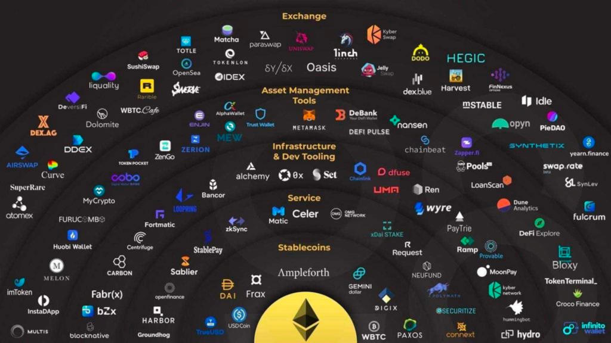

（[圖片來源](https://www.coolwallet.io/what-is-defi-guide-to-decentralized-finance/)）

#### 9. NFT

之前介紹到 NFT 核心的 ERC-721 與 ERC-1155 並不難懂，而近年也有許多人嘗試將 NFT 的標準定義得更廣泛，例如 [ERC-3525](https://eips.ethereum.org/EIPS/eip-3525) 半同質化代幣是想創造出介於 ERC-20 跟 ERC-721 之間的代幣，可以用來代表像債券、保險、vesting plan 等較難用既有協議表示的東西。

而在前面的內容中多次提到的 NFT Marketplace 背後的智能合約技術也非常值得研究，包含 Blur 與 Opensea 的 [Seaport](https://docs.opensea.io/reference/seaport-overview) 合約都使用了複雜的技術來匹配買賣家的單，並支援批次上架、成交等功能。Blur 的合約解析可以參考[這裡](https://github.com/cryptochou/blur-analysis)。

另外還有一些新的標準想探索 NFT 更廣泛的用途，包含 [ERC-6551](https://eips.ethereum.org/EIPS/eip-6551) 是個可以讓一個 NFT 成為一個錢包的協議，也就是轉移這個 NFT 的同時也會把一個錢包的控制權轉移出去，可以用在像一個遊戲角色的 NFT 可以持有一些遊戲內資產、道具的場景，這些資產與道具就會隨著遊戲角色一起轉移。

以及 Opensea 最近提出了 Redeemable NFT 的標準 [ERC-7498](https://github.com/ethereum/EIPs/pull/7501)，因為許多 NFT 的應用是可以兌換線上或線下的某些物品，就衍生出了需要將其標準化的需求，詳細可以參考 Opensea [官方文章](https://opensea.io/blog/articles/redeemables-standard-roadmap)，以及今年底前可以在[這裡](https://opensea.io/collection/baby-burn-opensea/drop) mint 出 Opensea 範例的 Redeemable NFT。

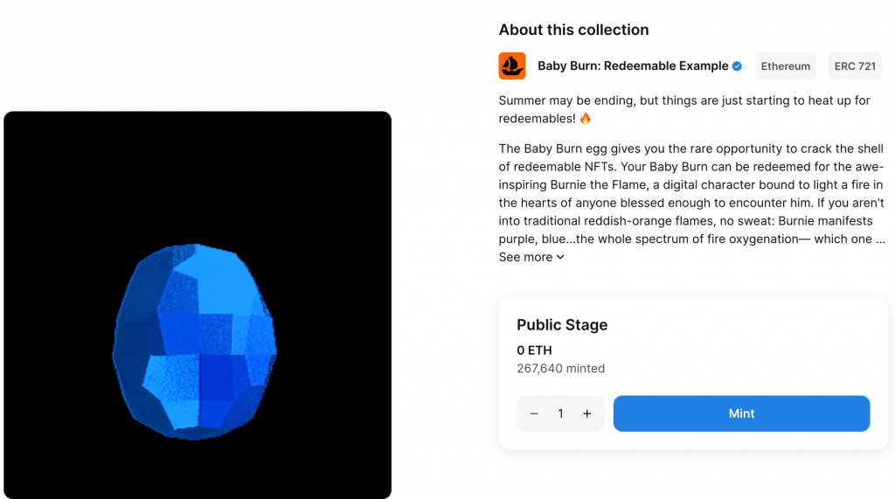

最後除了 EVM 鏈上的 NFT 外，也是今年由於 Bitcoin 的 Taproot 升級讓比特幣中可以有類似智能合約的功能，就誕生了 Bitcoin 鏈上的 NFT。著名的協議包含 [Ordinals](https://101blockchains.com/bitcoin-ordinals-explained/) 與 [BRC-20](https://www.okx.com/learn/brc20-staking)，也是發展十分早期的東西，有興趣的讀者可以深入研究。

#### 10. 帳戶抽象

為了降低 Web3 的使用者門檻，任何交易都需要 Gas Fee 是一大問題。因此有許多帳戶抽象的解決方案被提出來，主要目的是把一個「以太坊帳戶」的概念抽象化，讓他支援更多的功能，包含代付 Gas Fee、多簽、社交恢復等等功能，讓用戶體驗更接近於 Web 2 的服務。

已經有許多錢包應用實作帳戶抽象的功能，包含 [Gnosis Safe](https://safe.global/) 合約錢包與 [Argent](https://www.argent.xyz/) 。另外也有今年剛通過的 [ERC-4337](https://eips.ethereum.org/EIPS/eip-4337) 帳戶抽象標準，目的是統一所有人的實作並設計去中心化的機制來提高互操作性。關於帳戶抽象與 ERC-4337 標準的資訊也可以參考 [Argent 的介紹文章](https://www.argent.xyz/blog/part-2-wtf-is-account-abstraction/)。

#### 11. 其他應用

除了以上應用外還有非常多元的去中心化應用，像是：

* Decentralized ID 希望打造每個人在鏈上的去中心化身份與建立個人信用，例如 [Fractal ID](https://web.fractal.id/) 可結合 KYC 資料來打造合規的 DeFi 應用。
  * 鏈上訊息傳輸：支援區塊鏈地址跟地址之間傳訊息的通訊協定，或是 DApp 主動推播給錢包地址的協議，包含 [Blockscan](https://chat.blockscan.com/), [Debank Hi](https://debank.com/hi), [Push Protocol](https://push.org/) 等等。
  * 社交應用：如 [Lens Protocol](https://www.lens.xyz/) 想打造去中心化的社交圖譜、近期很紅的 [Friend Tech](https://www.friend.tech/) 可讓每個人建立個人社群與變現、[DeBox](https://debox.pro/) 可經營基於 NFT 的去中心化社群等等。
  * 鏈上資料分析：提供鏈上資料的分析工具來幫助投資人尋找標的、建立分析與統計圖表、識別同身份的地址，知名的服務包含 [Dune analytics](https://dune.com/home), [Nansen](https://www.nansen.ai/), [Glassnode](https://glassnode.com/), [0xscope](https://0xscope.com/) 等等。

#### 12. 小結

今天我們介紹了非常多的 Web3 前沿技術與正在快速發展的去中心化應用們，而這也還沒包含所有的主題，因此在 Web3 世界中最重要的還是持續學習、嘗試新的技術與應用。明天會介紹這些區塊鏈技術的底層用到的密碼學技術，以及前沿的密碼學主題。

## DAY 30｜Day 30 - Web3 與前沿技術：密碼學與應用

- 原文：https://ithelp.ithome.com.tw/articles/10336862
- 發佈時間：2023-10-09 09:09:44

### 章節內容

#### 1. 未分章內容

今天會介紹一些較底層的密碼學技術以及相關應用，包含 ZKP, MPC, Layer 2, DID 等等，帶讀者了解許多區塊鏈技術的基石，作為本系列文章的結尾。

#### 2. Zero-knowledge Proof

當我們提及 Web3 中的先進密碼學技術時，「零知識證明」（Zero-knowledge Proof，簡稱 ZKP）絕對是不可忽略的一環。它是許多區塊鏈應用的核心，因為只有採用 ZKP，某些區塊鏈應用才能在確保隱私的同時，實現高效的計算和驗證。

ZKP 的核心思想是：證明者可以不揭露任何具體資訊，但仍能向驗證者「證明」某個事實是真的。舉一個生活中的例子：如果 Alice 想要向一位色盲者 Bob 證明紅色和藍色是兩種不同的顏色，但又不透露具體的顏色資訊給 Bob。這時 Alice 可以將一個紅色物品和一個藍色物品放在他的面前，讓 Bob 隨機選擇一個並隱藏起來，然後問 Alice 所選的是什麼顏色。這樣來回進行多次後如果每次 Alice 都能正確地回答，考慮到如果是亂猜的話每次猜對的機率只有 1/2，Bob 基於機率的計算就會相信紅色和藍色確實是不同的。

再來看一個比較數學的例子：對於一個 n 次方的多項式，當 n 很大時要找出該多項式的解會很難（也就是帶進去會讓結果等於 0 的值），但若證明者已經知道該多項式的一個解，就可以在不透露具體數值的情況下向驗證者證明他的確是知道的，過程中也會像上述流程那樣通過一系列的問答挑戰，使驗證者相信他確實知道這個解。更有趣的是，這個證明過程其實可以不需要任何交互，證明者只需提供一個數學上的證明就足夠了。這個概念也被稱為 Non-interactive Zero-knowledge Proof。

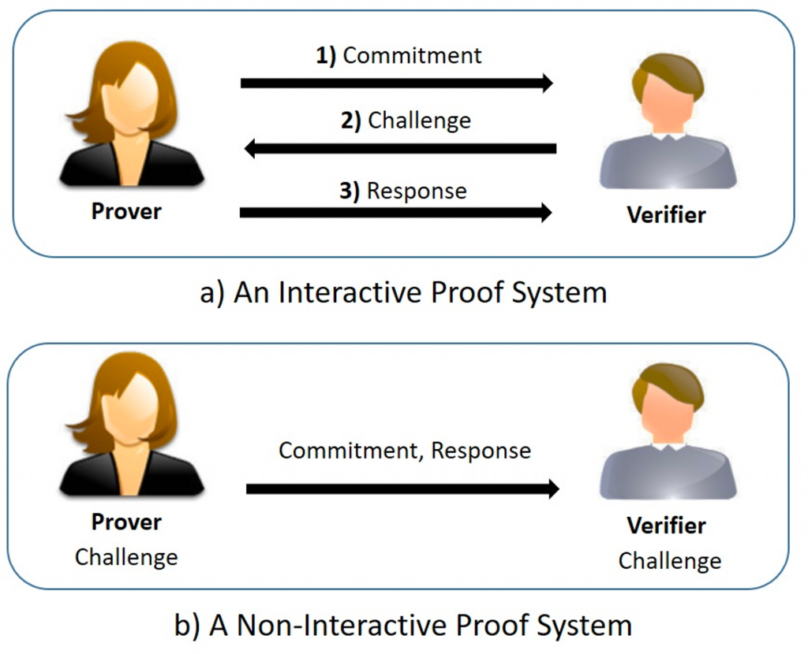

([圖片來源](https://blog.cs.ut.ee/2020/08/13/karim-baghery-reducing-trust-and-improving-security-in-zk-snarks-and-commitments/))

這樣的技術在實際應用中有何用途呢？例如在金融交易中，交易雙方可能需要確認對方有足夠的資金，但又不希望揭露自己的資金總額。在這種情況下就可以透過 ZKP 來達成此目的以保護隱私。因此可以看到 ZK 是個非常抽象的數學基礎，可以應用在許多場景。

至於 ZKP 的演算法，最廣為人知的有 zk-SNARK (Succinct Non-Interactive Argument of Knowledge) 和 zk-STARK (Scalable Transparent Argument of Knowledge)。雖然今天我們不會深入其算法細節，但值得一提的是，他們在效率、可信賴設置和抗量子計算的能力上有所不同。可信賴設置（Trusted Setup）指的是在證明開始前需要的「一次性的」Secret 設定過程，如果這些 Secret 沒有被銷毀而被洩漏，可能被用於製造偽造的證明。所以這個設定過程需要極大的信任。

| 可信任設置 | 大小與速度 | 抗量子能力
---|---|---|---
zk-SNARK | 需要 | 產生的證明非常小，且生成速度快 | 使用的某些技術可能會在未來受到量子計算的威脅
zk-STARK | 不需要 | 產生的證明比 zk-SNARK 大，而且生成可能比較慢。但它在驗證時仍然非常快。 | 被設計為對抗量子計算的攻擊，對於擔心量子技術的人來說可能是更好的選擇

對於 ZKP 的發展方向，學界和業界都在積極研究其優化方式，包含算法和電路的改進、效能優化、專用硬體的開發等，以期能解決當前算法的效率和規模問題，並推動更多實際應用的出現。

至於 ZK 的詳細算法與底層數學概念，有興趣的讀者可以參考 Vitalik 的文章：[An approximate introduction to how zk-SNARKs are possible](https://vitalik.ca/general/2021/01/26/snarks.html)。另外若想對 ZK 有更全面的了解，也非常推薦最近 RareSkills 出品的 [ZK Book](https://www.rareskills.io/zk-book)，從基礎理論到程式碼實作都有詳細解說，宣稱是最適合開發者的 ZK 教學材料。

#### 3. ZK Rollup

昨天提到的 ZK Rollup 就是基於 ZKP 的 Rollup 可擴展性解決方案，能夠把多筆交易集結成單一的大型交易，並記錄到區塊鏈中。其中 ZKP 的應用在於驗證這批次的交易是有效的（例如只有 1 ETH 的地址無法轉出 2 ETH），但不揭露交易的具體細節，從而確保交易的完整性與隱私性。因此背後使用的 ZKP 算法非常重要，因為它必須確保數據夠小並且可以讓驗證者快速驗證 Layer 2 上的資料正確性。

#### 4. zk-EVM

在實現 ZK Rollup Layer 2 解決方案的過程中，由於需要滿足所有操作都是可以經過 ZKP 機制驗證的，會導致更難在這樣的鏈上做到 EVM 相容，也就代表開發者無法很輕鬆的把原有在以太坊上開發好的智能合約搬到採用 ZK Rollup 的鏈上執行。

因此 zk-EVM 就被提出來作為一個解決方案，它的核心思想是想辦法設計跟 EVM 盡量相容的機制，同時又確保所有操作與狀態轉移的方式都能被 ZKP 算法驗證。通常跟 EVM 越相容的解決方案在 ZKP 證明的生成上就會花費更大成本。更多關於 zk-EVM 的資訊可以在 Vitalik 的文章 **[The different types of ZK-EVMs](https://vitalik.ca/general/2022/08/04/zkevm.html)** 中找到。

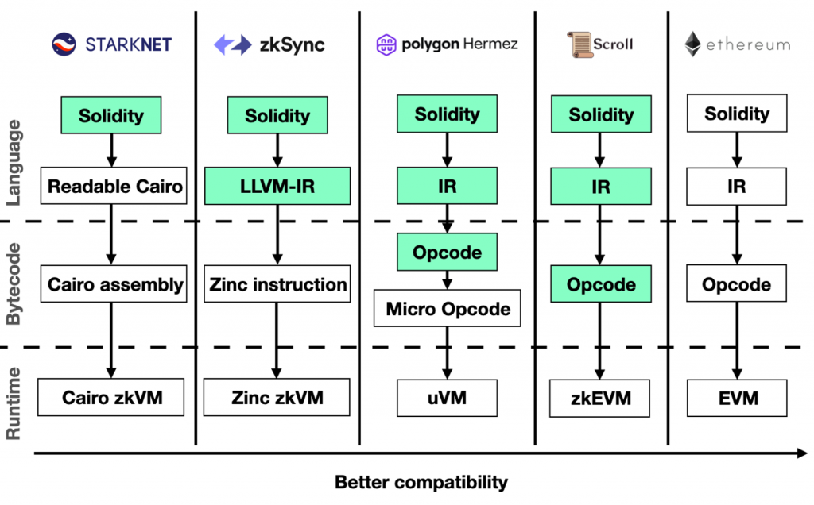

（[圖片來源](https://blog.pantherprotocol.io/what-is-a-zkevm-heres-everything-you-need-to-know/)）

#### 5. Tornado Cash

Tornado Cash 也是一個使用 ZKP 技術的知名應用。它提供的是隱私轉帳的功能，也就是當 Alice 想轉移 1 ETH 給 Bob 時，可能不希望這筆轉帳直接出現在鏈上，這樣大家就知道 Alice 跟 Bob 之間有某些交易關係。

因此 Tornado Cash 的作法是它分成了 0.1 ETH, 1 ETH, 10 ETH 跟 100 ETH 的池子，用戶可以選擇一個池子存入對應數量的 ETH 進智能合約，這時 Tornado Cash 會生成一個憑證給用戶，經過一段時間後用戶可以基於該憑證產生一個 ZK Proof 並跟智能合約互動，來證明自己確實擁有這個池子中的一份資產。因此 Alice 可以將此 ZK Proof 提供給 Bob 讓他發送包含該證明的交易，經過智能合約驗證通過後就可以從池子中取回特定數量的 ETH。

只要存入跟取出之間的時間間隔夠長，過程就是無法被追蹤的，因為其他人無從得知每一筆取出交易對應到哪一筆存入交易，達到隱私交易的目的。不過這樣的隱私保護功能也常被用於洗錢以隱匿金流，因此 Tornado Cash 曾遭到美國的制裁。

#### 6. World Coin

還有一個有趣的 ZKP 應用是 [World Coin](https://worldcoin.org/)，他們採用虹膜掃描技術，為每個人類建立唯一的身份標示。主要可以應用在任何「希望每個人只能領取一次」的場景上，像是全民基本收入（Universal Basic Income, UBI）這種公共福利項目，或是在一些去中心化應用中會希望他們的代幣空投都是發送給真實的人類而非機器人（也就是避免女巫攻擊）。只要確保每個領取福利的人都是真實存在且唯一的，就不會有重複或虛假身份的問題。

這背後使用到 ZKP 技術的點在於，使用者必須生成一個「我還沒領過該項目」的證明，同時又不暴露自己的身份或虹膜資料，並交由智能合約驗證，這樣就能解決重複領取的問題同時兼顧隱私。當然也有人對於要被掃描虹膜本身就有很大的隱私顧慮，因此是否應該參與仍是見仁見智。

（[圖片來源](https://fortune.com/crypto/2023/03/21/sam-altman-orb-scan-eyeballs-ai-bot-worldcoin/)）

#### 7. 其他應用

ZKP 的應用場景非常廣泛，除了上述例子外，它還可以應用於隱私交易、數位身份認證、跨鏈協議等多個領域。有興趣深入了解的讀者，可以參考 Vitalik 的 [Some ways to use ZK-SNARKs for privacy](https://vitalik.ca/general/2022/06/15/using_snarks.html) 文章。

#### 8. Multi Party Computation

在 Day 28，我們已經簡單介紹了 Multi Party Computation (MPC, 多方運算) 的概念。回顧一下，MPC 主要目的是讓多個參與者共同參與某個函數的計算，但卻不揭露自己的私有資訊給其他人。

除了經常被提及的 Threshold Signature Scheme (TSS) 演算法可以用來實作 MPC 錢包簽章，MPC 還有許多其他算法來允許多方共同計算不同函數的結果。例如 Garbled Circuit 是一種用於 2 Party 安全計算一個二進制函數的方法，以及 Private Set Intersection 相關的演算法可以在不透露兩個集合完整資訊的前提下計算交集，可被應用在 Password Monitoring 來安全地識別使用者的密碼是否已被洩漏到公開資料中。

為了實現 MPC，背後的一個關鍵技術是 Fully Homomorphic Encryption (FHE, 全同態加密)。FHE 的魅力在於它可以在資料仍然保持加密的情況下，進行複雜的數學運算，例如加法或乘法，且運算結果也是加密的。只要對最終結果進行解密，就可以在不洩漏其他輸入資訊的前提下得到函數的計算結果，因此這類的演算法通常會是 MPC 演算法的基礎。

許多人常常將 ZK, MPC 和 FHE 這些術語混用。為了更好地區分它們，以下總結他們的主要差異：

* **FHE** ：它使我們可以直接在**加密的資料上** 執行計算，無需解密。
  * **ZK** ：它的目標是**證明某事情是真實的** ，但又不透露具體的詳情或背景資訊。因此計算過程不一定是完全加密的。
  * **MPC** ：它允許多個參與者在各自的私有資料上執行合作計算，但不揭露自己的具體輸入。

若讀者想深入瞭解 Multi Party Computation 及其背後的數學，推薦 [DApp Learning 的頻道](https://www.youtube.com/@DappLearning/playlists)和其教材，其中包含了許多深入且詳細的內容。

#### 9. Layer 2

在 Layer 2 較前沿的發展也使用到許多密碼學技術，例如昨天提到的 EIP-4844 中增加了一種名為 blob 的資料類型，能夠讓一些 Rollup 解決方案在裡面用較低的成本存放交易資料。對 Optimistic Rollup 來說，由於他設計的在 Layer 1 上進行「挑戰」的機制，也就是當任何人發現 Layer 2 中儲存的狀態跟 Layer 1 上存的狀態不一致時，可以在 Layer 1 上發起挑戰來使不合法的交易無效化。

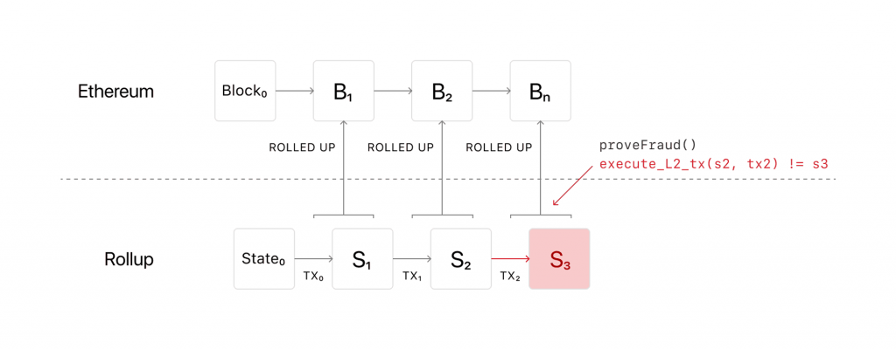

（[圖片來源](https://www.defipulse.com/blog/rollups-validiums-and-volitions-learn-about-the-hottest-ethereum-scaling-solutions)）

但為了節省成本，blob 的內容是無法被智能合約存取的，不過至少 Layer 1 上會儲存 blob 的一個 Commitment，基本上就是把所有 blob 裡的資料做一個 hash 成為一個 root，並且證明方可以提出某個 blob 資料屬於這個 root 的證明（類似 Merkle Tree 的機制）。

這裡用到的 Commitment 叫做 KZG Polynomial Commitment，主要會透過多項式的方式來編碼一組資料，例如當我想編碼 [x, y, z] 這個資料時等價於紀錄一個多項式 f 使得 f(1) = x, f(2) = y, f(3) = z。有了這個多項式之後就能透過有效率的方式對他進行 hash。相對於 Merkle Tree 的好處是他的 Proof Size 較小且驗證的步驟較少，可以在鏈上進行更有效率、低成本的驗證。

值得一提的是 KZG Commitment 也是一些 ZKP 算法的基礎，可以看到許多基礎密碼學概念都是共通的。

#### 10. Decentralized ID

昨天的內容也有提到 Decentralized ID (DID, 去中心化身份)，它是一種讓用戶可以在互聯網上自主識別和管理自己身份的系統。會出現的背景是因為現有 Web2 中人們的身份已經被各種中心化的大型公司和政府掌握，例如當 Facebook, Twitter 等社群平台決定將某個用戶的帳號停權時，他們的網路足跡就會直接被消失。因此 DID 主要目的是希望將個人資料與身份的控制權交還給用戶本人，這樣每個人的身份就不再依賴於傳統的中心化身份提供者。

> _Web 3.0, a decentralized and fair internet where users control their own data, identity and destiny._

在 DID 的架構中，通常有三個主要的角色：用戶 (Subject)、發行者 (Issuer) 以及驗證者 (Verifier)。用戶是身份的擁有者，發行者負責提供身份證明，而驗證者則確認身份證明的真實性和有效性。因此一個用戶可以搜集來自各式各樣發行者的身分證明，保存在自己身上，並在必要時出示對應的證明。例如當我的地址已經做過 KYC，提供我 KYC 服務的人就可以發給我一個憑證，代表我已經做過 KYC 了，這個證明就可以讓一些想要合規的 DApp 來驗證（例如某些 DApp 可能需要驗證使用者不是美國公民）

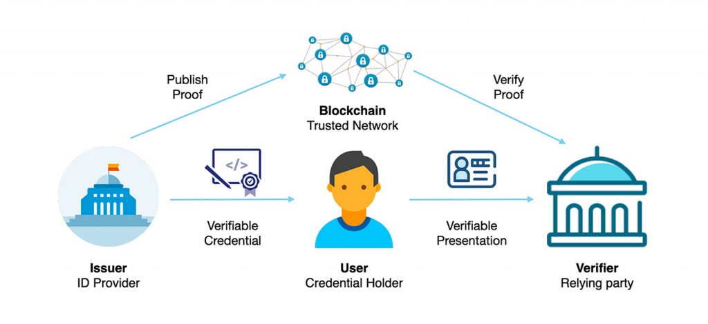

（[圖片來源](https://medium.com/finema/verifiable-credential-and-verifiable-presentation-for-decentralized-digital-identity-132d107c2d9f)）

Issuer 為了證明資料的有效性，也會透過把證明發佈到區塊鏈上來幫助 Verifier 進行驗證，因此 DID 的實現方式也會利用到 ZK 的技術。例如當用戶希望在某個場景下證明自己的年齡但不想透露確切的出生日期時，他可以使用 ZK 技術拿著 Issuer 發行的 Verifiable Credential 向 Verifier 證明自己已滿 18 歲，來確保隱私性。

Verifiable Credential 中會紀錄一組該憑證的防篡改的 metadata，包含誰是發行者、發行日期、有效日期、驗證用的公鑰等等，讓 Verifier 可以用密碼學方式驗證發行此憑證的源頭是誰。

DID 的基礎建設發展得十分迅速，包含 W3C（全球資訊網協會）已經為 DID 提供了正式的標準，這些標準詳細描述了如何創建、管理和驗證 DIDs，這可以幫助開發者和服務提供者有一個統一和標準化的參考框架。

另一個值得一提的 DID 應用案例是 [Gitcoin Passport](https://passport.gitcoin.co/)，使用者可以用錢包登入 Gitcoin Passport 後連結許多第三方帳號，包含 Github, Twitter, KYC 提供商等等，Gitcoin 會基於每個第三方帳號的「唯一人類」程度給分，例如如果連接的 Github 帳號是一年前創建的或是曾經有非常多 activity，那就會給予更高的分數。基於使用者連接的服務最終會算出一個「Unique Humanity Score」。

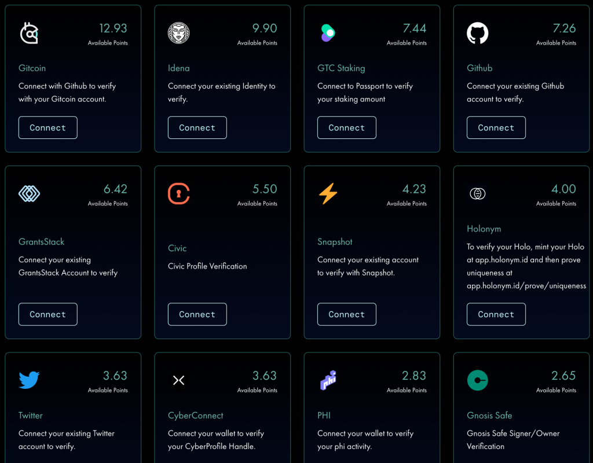

這個 Unique Humanity Score 就可以被用來防止女巫攻擊，因為當使用者在 Gitcoin Passport 驗證後可以拿到屬於自己的 DID 身份，他的呈現方式就是一個可以下載下來的 JSON 檔，裡面包含了 Gitcoin 的簽章。而當任何項目方想進行空投時，可以限定只空投給有提交 Gitcoin Passport 且分數在一定門檻以上的使用者（分數越高越難）。這樣就可以確保發放出的獎勵都是給到不同的人，要創進大量的假帳號來刷獎勵就會非常困難。

#### 11. 其他主題

除了以上主題外，也還有許多非常新的密碼學主題，包含：

* [Verkel Tree](https://vitalik.ca/general/2021/06/18/verkle.html)：另一種比 Merkle Tree 的 Proof Size 更小的驗證資料是否在一個集合中的作法。
  * [Stealth Address](https://vitalik.ca/general/2023/01/20/stealth.html)：在鏈上生成一個一次性收款地址來達到隱私交易的機制。
  * [Proof of Reserve](https://vitalik.ca/general/2022/11/19/proof_of_solvency.html)：中心化交易所如何透過密碼學來證明自己擁有能夠償還所有使用者資金的資產，又不洩漏每個人的資產餘額。

這些主題都是出自於 Vitalik 的部落格，裡面有許多技術主題非常值得深入研究。

#### 12. 結語

今天我們介紹了關於 ZK, MPC, Layer 2, DID 等主題的概念與應用場景，以及底層用到的密碼學技術有哪些，來幫助讀者從底層到應用層建立完整的認知模型。至此「Web3 全端工程師的技術養成之路」系列就完結了，感謝大家的追蹤與支持！

區塊鏈的技術非常有趣也在持續快速發展，行業中許多研究者與企業都致力於降低使用者門檻、提供更好的用戶體驗、降低交易成本、增加交易速度、保護隱私等等，對於技術的狂熱者來說永遠不會覺得無聊。最近 A16Z 才剛發佈了「[Nakamoto Challenges](https://a16zcrypto.com/posts/announcement/introducing-the-nakamoto-challenge-addressing-the-toughest-problems-in-crypto/)」懸賞能解決七個區塊鏈難題的人，並提供優先進入他們加速器的計畫，從中就可以看出區塊鏈還有許多重要問題尚未被解決，還有很多發展的空間。

最後，如果你也想和我們一起走在 Web3 技術的前沿、與強者同事切磋交流，打造一個安全且開放的數位資產世界，那麼歡迎[加入 KryptoGO](https://www.kryptogo.com/join-us)！
