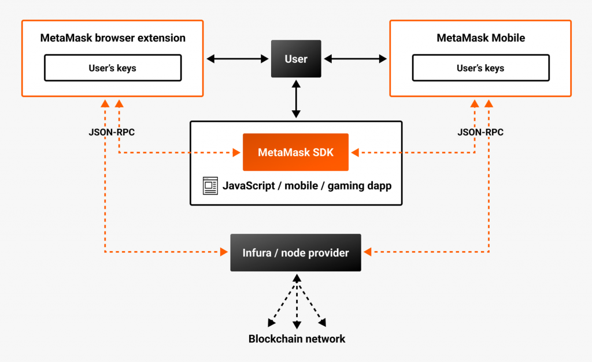
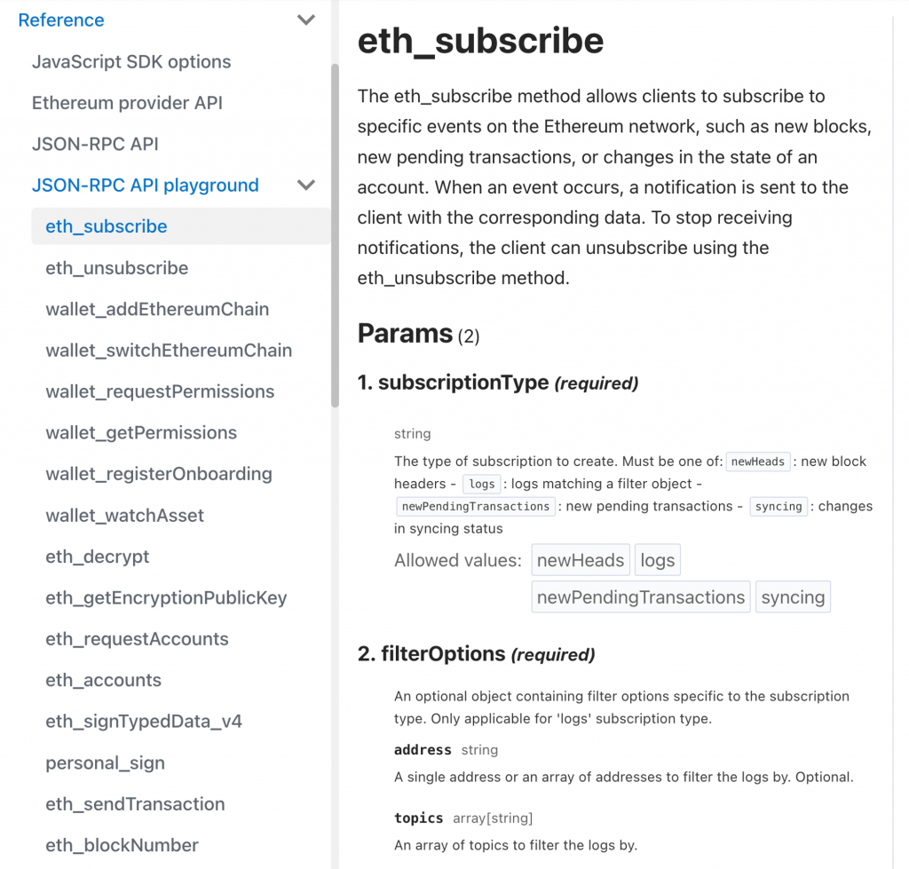
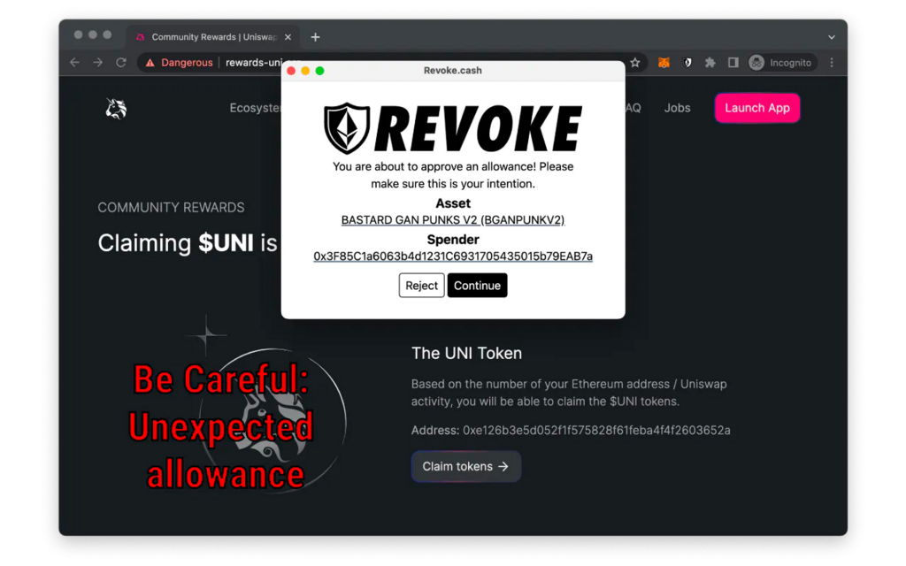
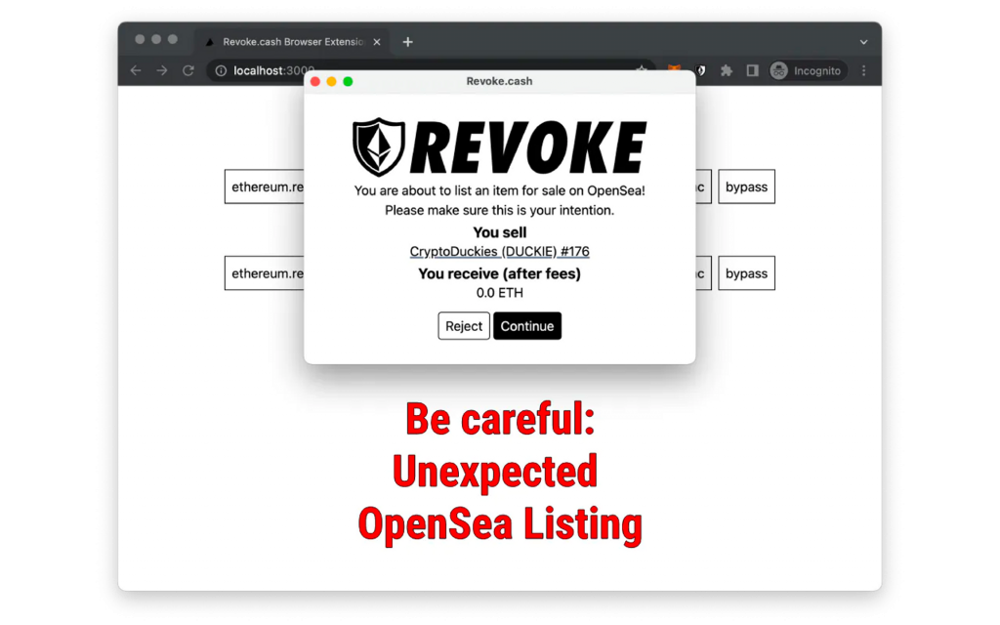

# DAY 17｜Day 16 - Web3 與進階前端：瀏覽器錢包 Extension 原理

- 原文：https://ithelp.ithome.com.tw/articles/10327465
- 發佈時間：2023-09-25 15:41:20

## 章節內容

### 1. 未分章內容

今天我們會來介紹瀏覽器錢包 Extension 的原理，包含解釋更底層的概念如 Wallet Provider, JSON-RPC API 等等，這樣在使用一些 wagmi, viem 或 ethers.js 中較底層的 API 時可以更清楚裡面提到的概念。另外也會基於這些知識介紹 Revoke Cash 的防止釣魚交易的瀏覽器 Extension，以及他背後是如何實作的。

### 2. Metamask 原理

如果讀者曾經好奇 Metamask Extension 的運作方式的話，官方文件中有一個[架構圖](https://docs.metamask.io/wallet/concepts/architecture/)可以看到 Metamask Extension 跟 DApp, User, 區塊鏈節點之間的關係：

簡單來說 Metamask Extension 內會保管使用者的私鑰，在使用者進到一個新頁面時，會對 window 注入一個 `window.ethereum` 物件來讓 DApp 可以透過這個物件跟 Metamask Extension 互動。

DApp 的開發者可以透過 Metamask SDK 包裝好的方法來跟 `window.ethereum` 互動以對區塊鏈進行讀寫，包含讀取現在使用者連接了哪個錢包、錢包餘額、Nonce、發送交易等等。而 `window.ethereum` 在收到一些 DApp 來的請求時，會根據請求類型去決定要自己處理還是轉由區塊鏈節點服務處理。例如：

* 如果要取得當下連上的錢包，Metamask 就會自己回應 DApp。
  * 如果是要取得當下錢包的 ETH 餘額或 Nonce，Metamask 會去區塊鏈節點服務（如 Infura, Alchemy）查詢最新的值。
  * 如果是發送交易的請求，Metamask 會跳出彈窗要求使用者確認，若確認送出後就會發送給節點服務。

因此 Metamask inject 的 `window.ethereum` 物件就包含了所有跟區塊鏈互動所需的 function。在 Metamask 的 [Provider API 文件中](https://docs.metamask.io/wallet/reference/provider-api/)就有寫到這個物件提供的 property 與 function 們，包含：

[code]
    window.ethereum.isMetaMask
    window.ethereum.isConnected(): boolean;

    interface RequestArguments {
      method: string;
      params?: unknown[] | object;
    }
    window.ethereum.request(args: RequestArguments): Promise<unknown>;

    // Listen to event
    function handleAccountsChanged(accounts) {
      // Handle new accounts, or lack thereof.
    }
    window.ethereum.on('accountsChanged', handleAccountsChanged);
    window.ethereum.removeListener('accountsChanged', handleAccountsChanged);

[/code]

因此許多前端 web 3 相關的 library（如 ethers.js, web3.js, wagmi, viem 等等）都是幫我們串接好跟 `window.ethereum` 物件的互動來提供更高層次的用法。像 wagmi 裡提供了一個 `InjectedConnector` （[文件](https://wagmi.sh/react/connectors/injected)），指的就是可以連上任何有 Inject `window.ethereum` 進當前頁面的 Wallet Extension。

### 3. Wallet Provider

除了 Metamask 之外，也有很多其他的 EVM 錢包 Extension，像是 Coinbase Wallet, Rabby 等等，如果讀者有安裝 Metamask 以外錢包的話，會發現在 DApp 中按下連接 Metamask 時可能會連到其他錢包！在了解上面的機制後就很好理解原因了：這些 Wallet Extension 也同樣定義了 `window.ethereum` 物件，並且可能把 Metamask 給覆蓋掉了，只要他定義的物件跟 Metamask 的物件有一樣的 interface，那麼對 DApp 來說就是正常的發所有跟區塊鏈相關的請求給 `window.ethereum` ，並不會察覺到任何不同。

這個介面其實也有一個標準，也就是 [EIP-1193](https://eips.ethereum.org/EIPS/eip-1193) 中定義的 Ethereum Provider JavaScript API，他把 `window.ethereum` 這個 JavaScript 物件稱為 Provider，代表區塊鏈操作的提供者，而要跟 Provider 互動就會透過 JSON-RPC API 的介面。

### 4. JSON-RPC API

在前幾篇文章中都有陸續提到 JSON-RPC 的概念，但都還沒有講得很清楚。其實我們之前已經使用過很多次 JSON-RPC API 了，以這個打 Alchemy 的請求為例：

[code]
    curl --request POST \
         --url https://eth-mainnet.g.alchemy.com/v2/docs-demo \
         --header 'accept: application/json' \
         --header 'content-type: application/json' \
         --data '
    {
      "id": 1,
      "jsonrpc": "2.0",
      "params": [
        "0xe5cB067E90D5Cd1F8052B83562Ae670bA4A211a8",
        "latest"
      ],
      "method": "eth_getBalance"
    }'

[/code]

可以看到他是對 `https://eth-mainnet.g.alchemy.com/v2/docs-demo` 的 POST 請求，而請求的方法跟參數都寫在 POST body 中，所以不管是要呼叫哪個方法的 API（如 `eth_estimateGas`, `eth_getLogs` 等等），都只要改動請求中的 `method` 與 `params` 參數即可，POST 的網址都會是固定的。

因此他跟一般較常見的 RESTful API 很不同，RESTful API 定義了一套對於資源的描述與操作方式，因此不同資源會用不同的網址。JSON-RPC API 則是不管是讀是寫、是什麼資源，都把請求描述在POST 的 JSON Body 中，來達到 Remote Procedure Call 的目的（也就是透過網路去呼叫遠端的函式）。這種 API 的介面被廣泛應用在 EVM 區塊鏈相關的程式呼叫中。

在 Metamask 的 Wallet Provider 中定義了一個 `request()` function，他的介面就正好是 JSON-RPC API 的樣子：

[code]
    interface RequestArguments {
      method: string;
      params?: unknown[] | object;
    }
    window.ethereum.request(args: RequestArguments): Promise<unknown>;

[/code]

如同 Metamask 文件中的描述：

> MetaMask uses the `[window.ethereum.request(args)](https://docs.metamask.io/wallet/reference/provider-api/#windowethereumrequestargs)` provider method to wrap a [JSON-RPC API](https://docs.metamask.io/wallet/concepts/apis/#json-rpc-api). The API contains standard Ethereum JSON-RPC API methods and MetaMask-specific methods.

因此這個 function 就是 Metamask Wallet Provider 幾乎所有功能的進入點，因為可以用它來呼叫任何 JSON RPC method。至於到底有哪些 method 可以用呢？以 Metamask 為例他已經把所有的 JSON-RPC method 都列在[官方文件](https://docs.metamask.io/wallet/reference/rpc-api/)的 JSON-RPC API Playground 中了（圖中只是一小部分）

到這裡就可以對 JSON-RPC 的應用場景做個總結了，會用到 JSON-RPC API 的地方主要有兩個：

1. 呼叫區塊鏈節點服務時 （如 Alchemy），會使用 HTTP POST 搭配 JSON-RPC 形式的 body。
  2. DApp 要跟 Wallet Extension 互動時，透過 `window.ethereum.request()` 發送 JSON-RPC 形式的請求

而在 [viem](https://viem.sh/) 中（wagmi 底層使用的跟 Ethereum Wallet Provider 互動的套件），恰好區分出這兩種類型的 Client（[參考文件](https://viem.sh/docs/clients/intro.html)），比對上面的描述就會十分清楚：

> A **Client** provides access to a subset of **Actions**. There are three types of **Clients** in viem:

* A **[Public Client](https://viem.sh/docs/clients/public.html)** which provides access to **[Public Actions](https://viem.sh/docs/actions/public/introduction.html)** , such as `getBlockNumber` and `getBalance`.
  * A **[Wallet Client](https://viem.sh/docs/clients/wallet.html)** which provides access to **[Wallet Actions](https://viem.sh/docs/actions/wallet/introduction.html)** , such as `sendTransaction` and `signMessage`.
  * A **[Test Client](https://viem.sh/docs/clients/test.html)** which provides access to **[Test Actions](https://viem.sh/docs/actions/test/introduction.html)** , such as `mine` and `impersonate`.

### 5. 對 Ethereum Provider 加功能

介紹完這麼多關於 Browser Extension, Wallet Provider, JSON-RPC 的概念後，實際有什麼應用呢？前一天提到的 Revoke Cash 其實還有出一個 [Browser Extension](https://revoke.cash/extension)，是用來防止一些釣魚網站騙使用者簽下可能會導致資產損失的交易/簽名，因為通常這些釣魚網站會偽裝成給使用者一些好處（免費領取代幣或 NFT），但實際上是送出 Approve 交易或是簽下 Permit 訊息等操作。Revoke Cash 的 Extension 就可以在使用者進行任何錢包操作前先經過一層風險偵測，警告使用者這個操作是否可能是可疑的操作。使用起來如下圖：

第一張圖是 Approve 交易，第二張圖是簽署「NFT 零元購」的 Typed Message，意思就是會把自己的 NFT 免費送別人（詳細的原理今天不會講到，有興趣的讀者可以自行查詢）。有了前面的知識，就能知道這個 Extension 是如何運作的了。

程式碼在[這裡](https://github.com/RevokeCash/browser-extension/tree/master)，核心思想是只要覆蓋 `window.ethereum` 物件，在 DApp 發送任何關於簽名交易、Personal Message、Typed Data 的操作時，都先經過 Revoke cash extension 的處理，如果符合特定的 pattern 就彈出警告視窗，使用者確認後再繼續呼叫原本 `window.ethereum` 中的處理流程即可。主要的邏輯在 [proxy-injected-providers.tsx](https://github.com/RevokeCash/browser-extension/blob/master/src/injected/proxy-injected-providers.tsx) 檔案中：

[code]
    const sendHandler = {
      // ...
    };
    const sendAsyncHandler = {
      // ...
    };
    const requestHandler = {
      // ...
    };

    const requestProxy = new Proxy(window.ethereum.request, requestHandler);
    const sendProxy = new Proxy(window.ethereum.send, sendHandler);
    const sendAsyncProxy = new Proxy(window.ethereum.sendAsync, sendAsyncHandler);

    window.ethereum.request = requestProxy;
    window.ethereum.send = sendProxy;
    window.ethereum.sendAsync = sendAsyncProxy;

[/code]

這裡就不展開講每個 handler 中做的細節，有興趣的讀者可自行閱讀。不過一個有趣的點是他會在初始化後每 100ms 去看當下的 `window.ethereum` 是否已經被其他 Extension inject 進來了，有了之後才會對 `window.ethereum` 中原本的三個方法做 Proxy：

[code]
    const overrideWindowEthereum = () => {
      if (!window.ethereum) return;
      clearInterval(overrideInterval);
    	// ...
    };

    overrideInterval = setInterval(overrideWindowEthereum, 100);
    overrideWindowEthereum();

[/code]

雖然是個簡單粗暴的方法，不過十分有效！

### 6. 小結

今天我們從 Metamask 的原理講起，介紹了 Wallet Provider 跟 JSON-RPC API 的機制，以及應用他來看懂 Revoke Cash Extension 的實作方式，用一樣的方式讀者也有能力開發需要攔截 JSON-RPC Request 的任何 Extension 了（像是市面上也有其他掃描錢包操作的 Extension）。明天我們會介紹並實作一個可以讓使用者不需付 Gas Fee 的代發交易機制，也就是 Meta Transaction。
