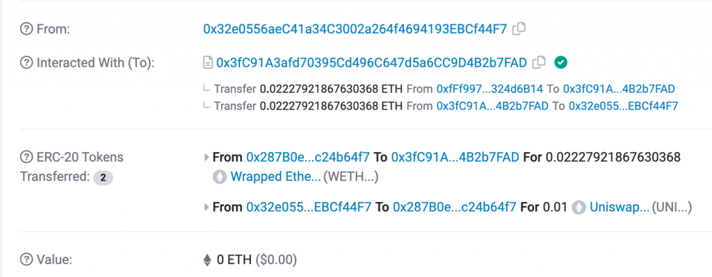
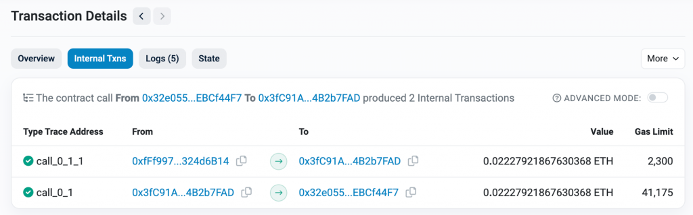
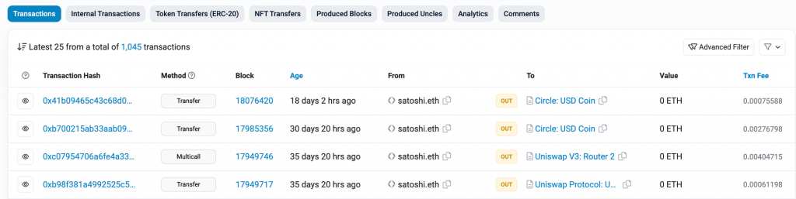
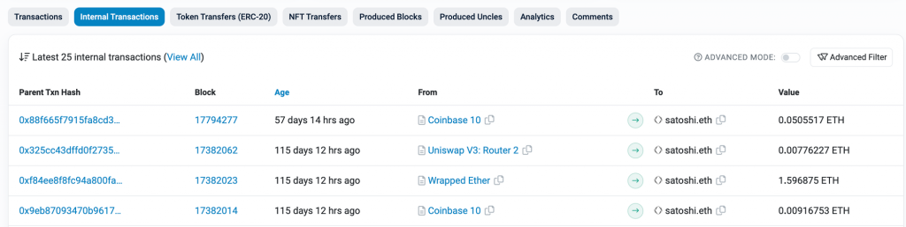
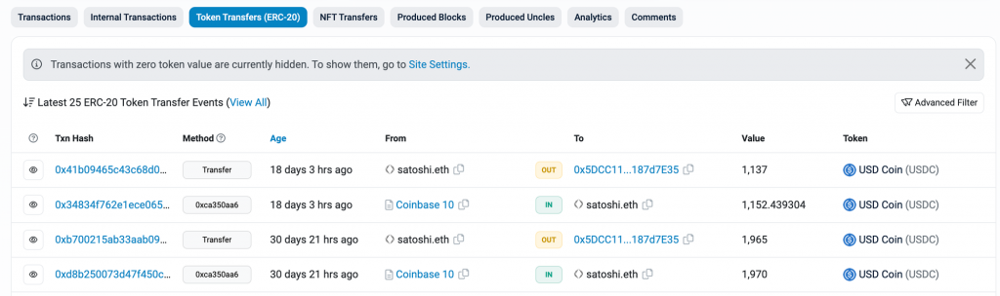
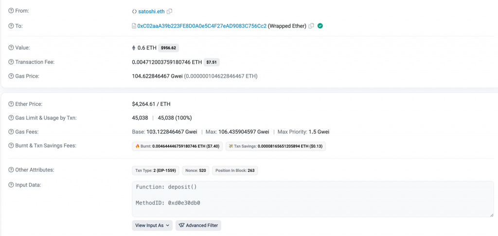
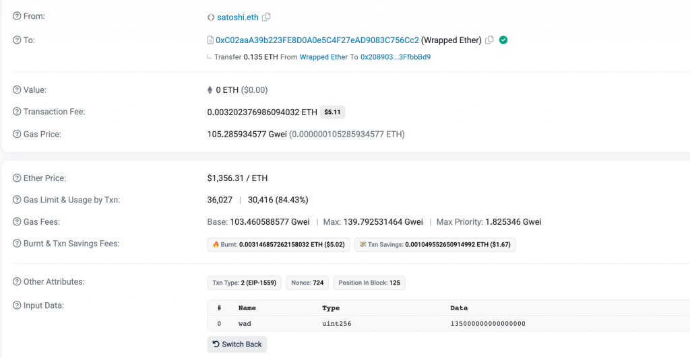
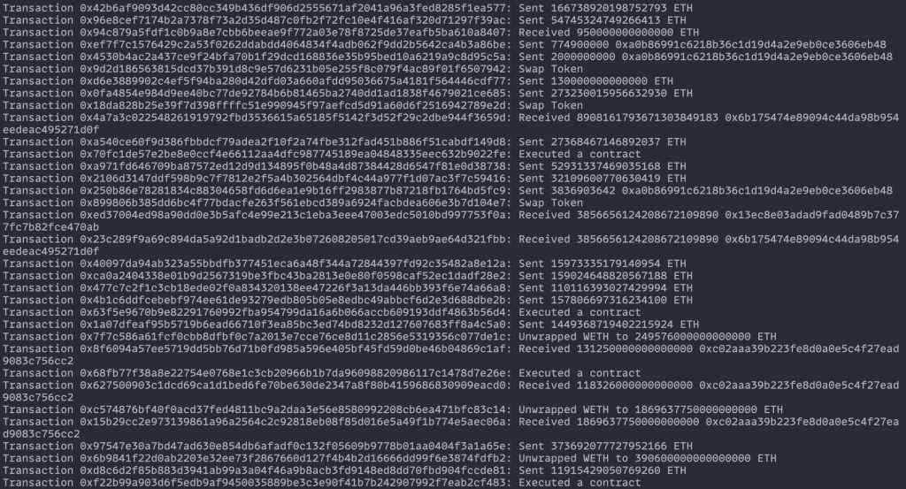
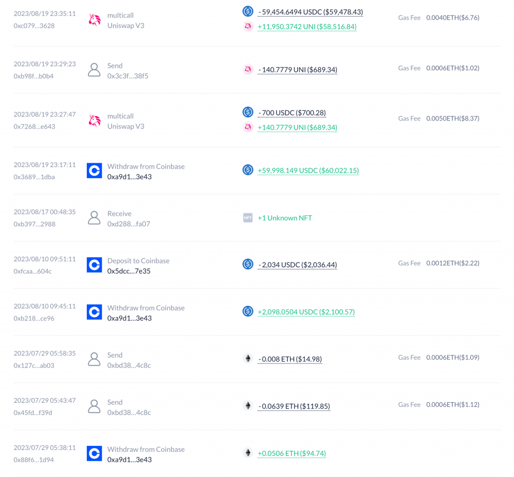

# DAY 21｜Day 21 - Web3 與進階後端：交易歷史資料整理

- 原文：https://ithelp.ithome.com.tw/articles/10331449
- 發佈時間：2023-09-30 15:05:54

## 章節內容

### 1. 未分章內容

用戶在以太坊上可以進行各式各樣類型的交易，像是發送 ETH, Transfer Token, Swap, 合約互動, 買賣 NFT 等等，但原始的區塊鏈資料並沒有直接定義這些交易類型，導致有時用戶很難理解一筆交易實際上發生了什麼事情。為了提高區塊鏈資料的可讀性，今天我們會介紹如何整理以太坊上的交易歷史資料，並區分出不同類型的交易，包含 Send, Receive, Swap, Wrap, Unwrap 等等，作為 Web3 與進階後端主題的收尾。

### 2. Internal Transaction

為了整理出完整的交易歷史資料，還有一個以太坊交易中的概念之前沒有提過，也就是 internal transaction。舉個實際的交易作為例子：https://sepolia.etherscan.io/tx/0xcc07567295055673a1b7cc909976a154f183fd5c0707b8dab9b900887af556b9

這是我在 Sepolia 上把 UNI Token 轉換成 ETH 的交易，可以看到在 Interacted With 中有個把 ETH 轉移給我的紀錄，而這個紀錄的詳細資訊會顯示在 Internal Txns Tab 中：

到這裡就能比較清楚 internal transaction 的作用了，他其實就是在智能合約執行時由該合約觸發的交易。當一個智能合約與其他合約或地址互動時（例如轉移 ETH 或呼叫其他合約的函數），這些呼叫都會被紀錄在 internal transactions 中。

與 Internal Transaction 相對應的概念就是 External Transaction，他指的是直接由外部帳戶（也稱為 Externally Owned Account, EOA）發起並發送到以太坊網路的交易。這些交易可以是轉移 ETH 到另一個地址，或者是呼叫一個智能合約。

因此可以看到 Etherscan 上針對一個地址顯示的交易歷史中，第一個 Transactions Tab 就是顯示這個地址相關的 External Transactions，第二第三個 Tab 則分別是 Internal Transactions 與 ERC-20 Token Transfer，下圖為範例地址 [satoshi.eth](https://etherscan.io/address/0x2089035369b33403ddcaba6258c34e0b3ffbbbd9) 的呈現：

可以看到這三個 Tab 中有一些 Transaction Hash 是一樣的，因為一筆 External Transaction 中可以同時觸發多筆 Internal Transaction 跟多筆 ERC-20 Token Transfer，因此接下來就需要按照 Tx Hash 去整理交易歷史。另外今天只會先處理 ERC-20 Token 的轉移紀錄，因此會先忽略 ERC-721 與 ERC-1155 NFT 的相關紀錄。

### 3. 取得原始交易歷史資料

由於我們需要取得一個地址過往的所有 Internal Transactions 列表才能組出完整的交易歷史，Alchemy 目前沒有提供這個 API，因此今天的實作會使用 [Etherscan API](https://etherscan.io/apis)，讀者可以先到官網註冊一個帳號，並到 [API Key 頁面](https://etherscan.io/myapikey)建立免費的 Key。

Etherscan 提供了方便的 API 可以直接取得一個地址的所有 External Tx, Internal Tx 以及 ERC-20 Token Transfer（[相關文件](https://docs.etherscan.io/api-endpoints/accounts)），別人也已經寫好 [etherscan-api package](https://github.com/nanmu42/etherscan-api) 方便我們呼叫這幾個 API。從這三個 API 取得資料後就可以按照 Tx Hash 把相關的紀錄歸類在一起，方便後續的處理。以下程式碼就定義了 `CombinedTransaction` 結構代表一筆交易相關的紀錄，並將三個 Etherscan API 的資料整理成 `map[string]*CombinedTransaction` 結構：

[code]
    import (
      "github.com/nanmu42/etherscan-api"
    )

    const targetAddress = "0x2089035369B33403DdcaBa6258c34e0B3FfbbBd9"

    type CombinedTransaction struct {
    	Hash           string
    	ExternalTx     *etherscan.NormalTx
    	InternalTxs    []etherscan.InternalTx
    	ERC20Transfers []etherscan.ERC20Transfer
    }

    func main() {
    	client := etherscan.New(etherscan.Mainnet, os.Getenv("ETHERSCAN_API_KEY"))

    	// Get all transactions
    	externalTxs, err := client.NormalTxByAddress(targetAddress, nil, nil, 1, 0, true)
    	if err != nil {
    		log.Fatalf("Failed to retrieve transactions: %v", err)
    	}
    	internalTxs, err := client.InternalTxByAddress(targetAddress, nil, nil, 1, 0, true)
    	if err != nil {
    		log.Fatalf("Failed to retrieve transactions: %v", err)
    	}
    	addr := targetAddress
    	erc20TokenTxs, err := client.ERC20Transfers(nil, &addr, nil, nil, 1, 0, true)
    	if err != nil {
    		log.Fatalf("Failed to retrieve ERC20 transfers: %v", err)
    	}

    	// Use a map to combine transactions by their hash
    	transactionsByHash := make(map[string]*CombinedTransaction)
    	for i, tx := range externalTxs {
    		transactionsByHash[tx.Hash] = &CombinedTransaction{
    			Hash: tx.Hash,
    			// avoid pointer to loop variable
    			ExternalTx: &externalTxs[i],
    		}
    	}
    	for _, tx := range internalTxs {
    		if combined, exists := transactionsByHash[tx.Hash]; exists {
    			combined.InternalTxs = append(combined.InternalTxs, tx)
    		} else {
    			transactionsByHash[tx.Hash] = &CombinedTransaction{
    				Hash:        tx.Hash,
    				InternalTxs: []etherscan.InternalTx{tx},
    			}
    		}
    	}
    	for _, tx := range erc20TokenTxs {
    		if combined, exists := transactionsByHash[tx.Hash]; exists {
    			combined.ERC20Transfers = append(combined.ERC20Transfers, tx)
    		} else {
    			transactionsByHash[tx.Hash] = &CombinedTransaction{
    				Hash:           tx.Hash,
    				ERC20Transfers: []etherscan.ERC20Transfer{tx},
    			}
    		}
    	}
    }

[/code]

需要特別注意的是，一筆 `CombinedTransaction` 中可以沒有 `ExternalTx`，例如有一筆交易是 A 轉了 10 USDC 給 B，這筆交易就會是 A 的 External Tx 而不會是 B 的，因此在計算 B 的交易歷史時的這筆 `CombinedTransaction` 就只會有一筆 `etherscan.ERC20Transfer` 資料。接下來就可以判斷一筆交易的類型了。

### 4. 交易類型判斷

基於現有的 `CombinedTransaction` 資料可以判斷出幾種交易類型，包含：

* Send (ETH or ERC-20 Token)
  * Receive (ETH or ERC-20 Token)
  * Swap (代幣交換)
  * Contract Execution (執行合約)

對用戶來說發送 ETH 或發送 ERC-20 Token 都算是送出資產的一種，只是背後的資料來源不同，因此要整理出這筆交易有哪些資產餘額的變化，把 ETH 跟 ERC-20 Token 一起看待。至於 Swap 則是判斷這筆交易是否包含了送出一筆資產與得到一筆資產。其他類型的交易就暫時當作是 Contract Execution。

可以先實作出 `GetTokenChanges()` 來回傳這筆交易中有哪些資產餘額的變化，程式碼如下：

[code]
    func (c *CombinedTransaction) GetTokenChanges() map[string]*big.Int {
    	// Calculate token balance changes
    	tokenChanges := make(map[string]*big.Int)

    	// External ETH transaction
    	if c.ExternalTx != nil {
    		value := new(big.Int)
    		value.SetString(c.ExternalTx.Value.Int().String(), 10)
    		tokenChanges["ETH"] = value.Neg(value)
    	} else {
    		tokenChanges["ETH"] = big.NewInt(0)
    	}
    	// Internal ETH transaction
    	for _, intTx := range c.InternalTxs {
    		value := new(big.Int)
    		value.SetString(intTx.Value.Int().String(), 10)
    		if strings.EqualFold(intTx.From, targetAddress) {
    			tokenChanges["ETH"].Sub(tokenChanges["ETH"], value)
    		} else {
    			tokenChanges["ETH"].Add(tokenChanges["ETH"], value)
    		}
    	}
    	// ERC20 token transfer
    	for _, erc20 := range c.ERC20Transfers {
    		value := new(big.Int)
    		value.SetString(erc20.Value.Int().String(), 10)
    		if strings.EqualFold(erc20.From, targetAddress) {
    			if _, exists := tokenChanges[erc20.ContractAddress]; !exists {
    				tokenChanges[erc20.ContractAddress] = new(big.Int)
    			}
    			tokenChanges[erc20.ContractAddress].Sub(tokenChanges[erc20.ContractAddress], value)
    		} else {
    			if _, exists := tokenChanges[erc20.ContractAddress]; !exists {
    				tokenChanges[erc20.ContractAddress] = new(big.Int)
    			}
    			tokenChanges[erc20.ContractAddress].Add(tokenChanges[erc20.ContractAddress], value)
    		}
    	}
    	// Remove zero balances
    	for token, balance := range tokenChanges {
    		if balance.Int64() == 0 {
    			delete(tokenChanges, token)
    		}
    	}
    	return tokenChanges
    }

[/code]

裡面針對 External Tx, Internal Tx, ERC-20 Transfer 各自有不同的處理邏輯。External Tx 中會有該地址發出的 ETH 數量，而 Internal Tx 可能是發送或接收 ETH，ERC-20 Transfer 則是發送或接收 Token，也要根據 From 是否等於該地址來決定是要增加還是減少 Token 餘額。

有了 `GetTokenChanges()` 後，就能基於他的結果來實作 `Type()` 以判斷出 Swap, Send, Receive, Contract Execution 這幾種類型：

[code]
    type TransactionType string
    const (
    	Send              TransactionType = "Send"
    	Receive           TransactionType = "Receive"
    	Swap              TransactionType = "Swap"
    	ContractExecution TransactionType = "ContractExecution"
    )

    func (c *CombinedTransaction) Type() TransactionType {
    	tokenChanges := c.GetTokenChanges()
      if len(tokenChanges) > 1 {
    		// Check Swap: 2 tokens, 1 positive, 1 negative
    		if len(tokenChanges) == 2 {
    			sign := 1
    			for _, balanceChange := range tokenChanges {
    				sign *= balanceChange.Sign()
    			}
    			if sign < 0 {
    				return Swap
    			}
    		}
    		return ContractExecution
    	}

    	// Check it's a Send or Receive
    	for _, balanceChange := range tokenChanges {
    		if balanceChange.Sign() < 0 {
    			return Send
    		} else if balanceChange.Sign() > 0 {
    			return Receive
    		}
    	}

    	return ContractExecution
    }

[/code]

到這裡就能判斷出幾個基本的交易類型了。但其實還有兩種交易我們沒有考慮到，也就是 Wrap 跟 Unwrap。

### 5. Wrap & Unwrap 交易

在前面一些交易紀錄中，讀者可能會看到 Wrapped ETH 這個 ERC-20 Token，他跟 ETH 是怎樣的關係呢？其實 Wrapped ETH (WETH) 就是 ETH 的 ERC-20 版本。由於 ETH 本身是以太坊的原生代幣，不符合 ERC-20 標準，因此有時在智能合約中想要以 ERC-20 介面來操作 Token Contract 時，會產生 ETH 無法與之兼容的問題。

Wrapped ETH 就是為了解決這個問題而被創造出來的 ERC-20 合約，作為一種可以代表 ETH 並且完全符合 ERC-20 標準的 Token。當我想從 ETH 換成 WETH 時，其實是把 ETH 打進 WETH 的智能合約中，他就會幫我的 WETH 餘額增加對應的數量，這個過程被稱為 Wrap。範例的 Wrap 交易可以看這筆：https://etherscan.io/tx/0x48a878f061909863ad85d90d2a310d552922bb5eccd80446f1714afcc35093fc

而這筆交易並沒有產生任何 ERC-20 Token Transfer，因此在上面的程式碼會把這筆交易判斷成 Send ETH，而忽略了 WETH 合約會讓他的 WETH 餘額增加這件事。

至於 Unwrap 操作則指的是把 WETH 轉換回 ETH 的過程，只要呼叫 WETH 合約的 `withdraw()` 方法，就能把對應數量的 ETH 取回來。範例交易可以看這筆：https://etherscan.io/tx/0x9de1782def03d84b8436cf6b738945628594ab80d6a287fd24f9deb2494a3565

因此在 `CombinedTransaction.Type()` 中，就可以加上對應的邏輯來判斷 Wrap 與 Unwrap 交易。Wrap 對應到當下交易是發送給 WETH Contract 且 value > 0 的交易，Unwrap 的條件則是有從 WETH 合約收到 Internal Transaction 轉來的 ETH，實作如下：

[code]
    const wethAddress = "0xC02aaA39b223FE8D0A0e5C4F27eAD9083C756Cc2"
    const (
      Unwrap            TransactionType = "Unwrap"
    	Swap              TransactionType = "Swap"
    )

    // Check for Wrap/Unwrap
    if c.ExternalTx != nil && strings.EqualFold(c.ExternalTx.To, wethAddress) {
    	// Check for Wrap
    	if c.ExternalTx.Value != nil && c.ExternalTx.Value.Int().Cmp(big.NewInt(0)) > 0 {
    		return Wrap
    	}

    	// Check for Unwrap
    	if c.ExternalTx.Value.Int().String() == "0" && len(c.InternalTxs) > 0 {
    		internalTx := c.InternalTxs[0]
    		if strings.EqualFold(internalTx.To, targetAddress) {
    			return Unwrap
    		}
    	}
    }

[/code]

### 6. 交易內容總結

為了提升交易內容輸出的可讀性，可以再實作 `CombinedTransaction.Summary()` 來提供該筆交易的總結，基於不同的交易類型回傳對應的詳細內容：

[code]
    func (c *CombinedTransaction) Summary() string {
    	txType := c.Type()
    	tokenChanges := c.GetTokenChanges()
    	tokens := make([]string, 0, len(tokenChanges))
    	for k := range tokenChanges {
    		tokens = append(tokens, k)
    	}

    	switch txType {
    	case Send:
    		return fmt.Sprintf("Sent %s %s", tokenChanges[tokens[0]].Neg(tokenChanges[tokens[0]]).String(), tokens[0])
    	case Receive:
    		return fmt.Sprintf("Received %s %s", tokenChanges[tokens[0]].String(), tokens[0])
    	case Wrap:
    		return fmt.Sprintf("Wrapped %s ETH to WETH", c.ExternalTx.Value.Int().String())
    	case Unwrap:
    		return fmt.Sprintf("Unwrapped WETH to %s ETH", c.InternalTxs[0].Value.Int().String())
    	case Swap:
    		return "Swap Token"
    	case ContractExecution:
    		return "Executed a contract"
    	default:
    		return "Unknown transaction type"
    	}
    }

[/code]

### 7. 輸出結果

有了交易類型與總結資料後，最後就能輸出交易歷史了。但由於前面是使用 map 來整理所有的 `CombinedTransaction` ，這會讓交易輸出的順序亂掉，理想上應該要按照交易發生的時間由新到舊來顯示，才比較符合 Etherscan 的呈現。而這可以透過交易的 `BlockNumber` 由大到小來排序，排序後就能輸出整理後的交易歷史了：

[code]
    func (c *CombinedTransaction) BlockNumber() int {
    	if c.ExternalTx != nil {
    		return c.ExternalTx.BlockNumber
    	}
    	if len(c.InternalTxs) > 0 {
    		return c.InternalTxs[0].BlockNumber
    	}
    	if len(c.ERC20Transfers) > 0 {
    		return c.ERC20Transfers[0].BlockNumber
    	}
    	return 0
    }

    // in main()
    // sort hash from newest to oldest by block number
    txHashs := make([]string, 0, len(transactionsByHash))
    for hash := range transactionsByHash {
    	txHashs = append(txHashs, hash)
    }
    sort.Slice(txHashs, func(i, j int) bool {
    	return transactionsByHash[txHashs[i]].BlockNumber() > transactionsByHash[txHashs[j]].BlockNumber()
    })

    // Summarize for each combined transaction
    for _, hash := range txHashs {
    	combinedTx := transactionsByHash[hash]
    	fmt.Printf("Transaction %s: %s\n", combinedTx.Hash, combinedTx.Summary())
    }

[/code]

最後輸出的結果如下（只截取部分輸出）。由於把 ERC-20 Token 的顯示轉換成有小數點的 Balance 以及 Token Name 並不是今天的實作重點，若想呈現更好看的結果可以由讀者自行練習。

可以看到已經成功分類出不同類型的交易了！這個地址六種類型的交易都有出現在歷史中，以下各提供一個範例讓讀者參考：

* Send: [Tx](https://etherscan.io/tx/0x41b09465c43c68d0b82c7cbca4f527667594a9fd16f6b89dbe74c754e6acc077)
  * Receive: [Tx](https://etherscan.io/tx/0x34834f762e1ece0656d66b9029dfed519102efed737e0eb7dcd7f12cdda8beaa)
  * Wrap: [Tx](https://etherscan.io/tx/0x48a878f061909863ad85d90d2a310d552922bb5eccd80446f1714afcc35093fc)
  * Unwrap: [Tx](https://etherscan.io/tx/0x9de1782def03d84b8436cf6b738945628594ab80d6a287fd24f9deb2494a3565)
  * Swap: [Tx](https://etherscan.io/tx/0xc07954706a6fe4a334f03dfbf9b3b644806c228300c24fc5abede5c497953628)
  * Contract Execution: [Tx](https://etherscan.io/tx/0x70fc1de57e2be8e0ccf4e66112aa4dfc987745189ea04848335eec632b9022fe)

### 8. 小結

今天我們深入講解了在後端如何整理出完整的交易歷史資料，並呈現可讀性更高的資料給使用者，完整程式碼在[這裡](https://github.com/a00012025/ironman-2023-web3-fullstack/tree/main/backend/day21)。

像 Debank, Zerion 等服務也會呈現一個地址的好讀版的交易歷史，背後就會用到類似的技巧來整理資料，可以參考 Debank 對於今天範例地址的呈現方式：https://debank.com/profile/0x2089035369b33403ddcaba6258c34e0b3ffbbbd9/history?chain=eth

此外一般這種服務也會把 NFT 相關的交易類型考慮進來，如 Send NFT, Receive NFT, Buy NFT, Sell NFT 等等，Etherscan 也有相關的 NFT Transfer History API 可以使用（例如 [tokennfttx](https://docs.etherscan.io/api-endpoints/accounts#get-a-list-of-erc721-token-transfer-events-by-address)），因此只要依循今天的架構去整理資料即可，至於這些交易類型的判斷方式就留給讀者當做練習。

以上是 Web3 與進階後端主題的內容，接下來我們會回到 Web3 與進階 App 開發的主題，來探討 App 中還會遇到哪些更深入的問題，以及一些重要的錢包功能（如 Wallet Connect, DApp Browser）是如何實作的。
