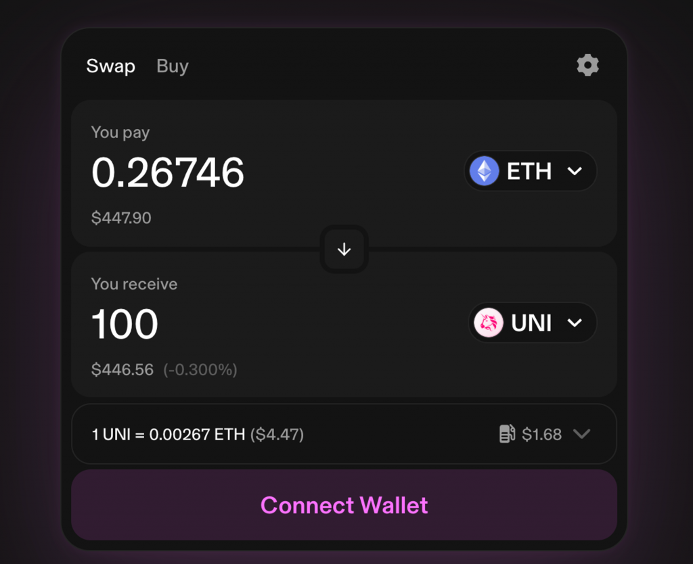
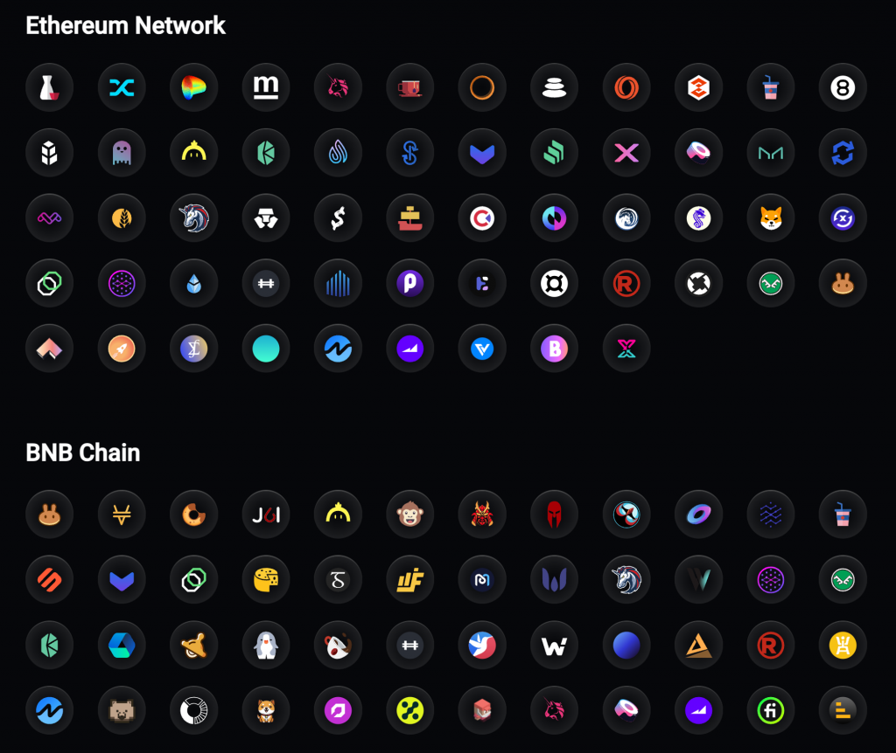
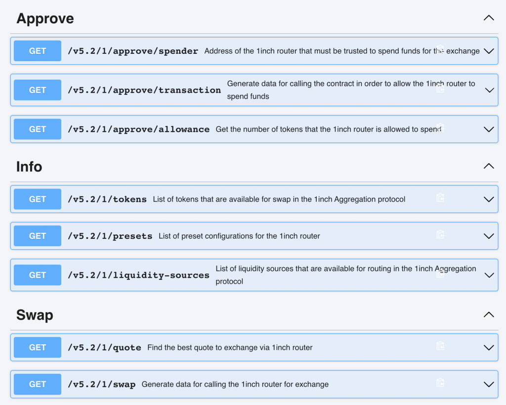
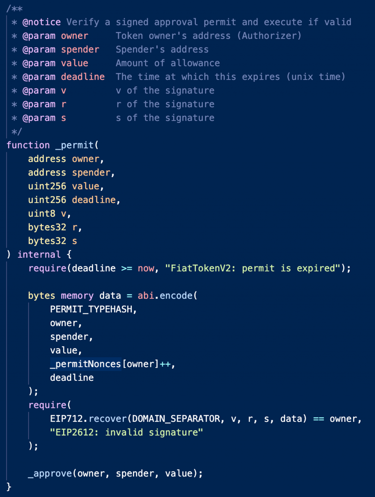
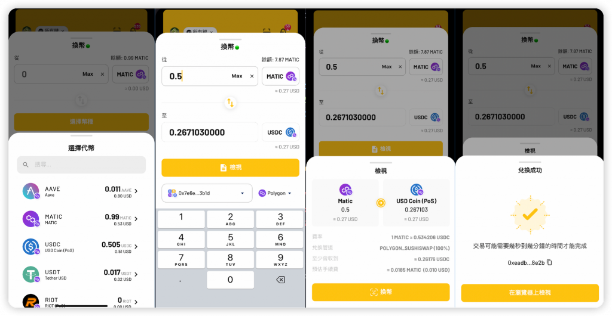

# DAY 25｜Day 25 - Web3 與進階 App：Swap 功能實作

- 原文：https://ithelp.ithome.com.tw/articles/10334206
- 發佈時間：2023-10-04 20:21:39

## 章節內容

### 1. 未分章內容

今天要講解的是錢包 App 中要如何實作代幣的 Swap 功能，會使用到 1inch 這個 Swap 服務提供的 API，並介紹 EIP-2612 Permit 的作用以及他如何協助使用者節省 Gas Fee，作為 Web3 與進階 App 主題的結尾。

### 2. Swap 功能簡介

我們從 Day 3 開始就操作 Uniswap，也用它做為許多範例程式互動的 DApp，讀者應該已經很熟悉了。而除了 Uniswap 外其實還有很多各式各樣的 Swap DApp，像是 1inch、Curve（專做穩定幣的兌換）、QuickSwap（Polygon 上的 Swap）、PancakeSwap（Binance Chain 上的 Swap）等等，每條鏈上都一定會有個 Swap 服務，因為這樣才能方便讓使用者進行交易。

而一個 Swap 功能主要要達成的目的是：當使用者選擇想換的代幣並輸入要換多少後，畫面上會先給個報價代表預估可以收到多少目標代幣，使用者可以進一步設定滑點（Slippage）來指定換到的幣跟預估的幣的數量不能差太多。

當設定完成並發出交易後，使用者會跟 Swap 的智能合約互動，智能合約中最常見是用 AMM（Automated Market Maker, 又稱自動化造市商）的演算法來計算能換多少幣出來，詳細的 AMM 機制不會在今天講解，有興趣的讀者可以深入研究。簡單的理解方式是：造市商的目的是提供市場流動性，也就是當有任何人想買/賣幣的時候，造市商可以選擇當他的對手方來賣/買對應的幣，這樣就能幫助使用者完成交易。而 AMM 自動化造市商就是在智能合約上可以自動運行的造市商。

另外每個 Swap 服務可能會有些微妙的差別，像是 Uniswap 除了支援指定固定數量的 From Token 外，也支援指定固定數量的 To Token（From/To 分別代表 Swap 中使用者送出/收到的幣），讀者可以到 Uniswap 在下方代幣的數量輸入一個值，就可以得到大約要花掉多少數量的 from token（如下圖）。但 1inch 只支援指定 From Token 的數量而不支援指定 To Token，這背後是因為 1inch 的智能合約並沒有支援 Exact Amount Out 相關的方法。

### 3. 1inch Swap API

今天會使用 1inch API 來實作 App 的 Swap 功能，原因是他們的 API 十分方便好用也足夠有彈性。還有另一個好處是 1inch 提供了 [Swap Aggregation](https://1inch.io/aggregation-protocol/) 的功能，因為像各種 EVM 鏈上都會有很多 Swap 服務，每個 Swap 當下的價格可能都不一樣（就像我們換匯時選擇不同的銀行會有不同的價格），而若使用者要手動比價會十分麻煩。以下是 1inch 有支援的 DEX 們：

因此 Swap Aggregation 就是自動幫我們找出價格最好的路徑是什麼，在比較複雜的情況可能會經過多個 Swap 智能合約的路徑以及多種幣。例如當使用者想從 DAI 換成 UNI 時，最好的路徑可能是先在 1inch 上把 DAI 換成 WETH，再到 Uniswap 上把 WETH 換成 UNI。因此這種 Path Finder 背後就會用到最短路徑的演算法。

而不管透過何種路徑做 Swap，對開發者來說最關心的只有在發交易時，應該要送到哪個智能合約地址、要用什麼 Call Data 送、Gas Limit 是多少的這些資訊，如果我們只要指定想 Swap 的 From/To Token 跟數量，就能取得匯率跟 Swap 要用的 Calldata 的話會很方便，而這正是 1inch Swap API 提供的功能。來看一下他的 API 文件：https://docs.1inch.io/docs/aggregation-protocol/api/swagger/

最下面的兩個 API（ `/v5.2/1/quote` 跟 `/v5.2/1/swap`）就可以達到以上兩個目的，分別是取得代幣的報價與取得 Swap 要用的交易資料。路徑中的 `1` 代表 EVM 鏈的 Chain ID，因此這邊先用以太坊作為例子。來看一下他們主要的參數跟回傳值是什麼（這裡僅先列出 required parameters）：

[code]
    [GET] /v5.2/1/quote

    Params:
    - src: From token 合約地址
    - dst: To token 合約地址
    - amount: From token 的數量

    Response:
    {
      "fromToken": {
        "symbol": "string",
        "name": "string",
        "address": "string",
        "decimals": 0,
        "logoURI": "string"
      },
      "toToken": {
        "symbol": "string",
        "name": "string",
        "address": "string",
        "decimals": 0,
        "logoURI": "string"
      },
      "toAmount": "string",
      "protocols": [
        {
          "name": "string",
          "part": 0,
          "fromTokenAddress": "string",
          "toTokenAddress": "string"
        }
      ],
      "gas": 0
    }

[/code]

[code]
    [GET] /v5.2/1/swap

    Params:
    - src: From token 合約地址
    - dst: To token 合約地址
    - amount: From token 的數量
    - from: 執行交易的錢包地址
    - slippage: 最大可容忍的滑點

    Response:
    {
      "fromToken": {
        "symbol": "string",
        "name": "string",
        "address": "string",
        "decimals": 0,
        "logoURI": "string"
      },
      "toToken": {
        "symbol": "string",
        "name": "string",
        "address": "string",
        "decimals": 0,
        "logoURI": "string"
      },
      "toAmount": "string",
      "protocols": [
        "string"
      ],
      "tx": {
        "from": "string",
        "to": "string",
        "data": "string",
        "value": "string",
        "gasPrice": "string",
        "gas": 0
      }
    }

[/code]

因此使用 `/v5.2/1/quote` 就可以拿到使用者能換多少幣的資訊，裡面除了有 `toAmount` 外也附上的 From/To Token 的 Symbol, Name, Decimals, Logo URI 等等，方便我們計算 `toAmount` 經過 decimals 轉換的值並顯示相關資訊給使用者。

當使用者確定要執行交易時，只要打 `/v5.2/1/swap` API 並多傳入執行交易的錢包地址與最大可容忍的滑點，就可以拿到 `tx` 裡的 `to`, `data`, `value` 等資訊，這樣就能直接用它來組出交易並送出了。以下舉幾個 Swap 不同代幣的例子來講解從簡單到複雜的狀況要如何處理。

### 4. Swap ETH to USDT

如果用戶要 Swap ETH 到 USDT，可以透過實際打 1inch API 來看會拿到怎樣的資料。首先寫好查詢 1inch 兩隻 API 的程式碼：

[code]
    final Dio dio = Dio();

    Future<void> main(List<String> args) async {
      dio.options.baseUrl = 'https://api.1inch.dev/swap';
      dio.options.headers = {
        'Accept': 'application/json',
        'Authorization': 'Bearer YOUR_API_KEY',
      };

      final quote = await getQuote(1,
          fromToken: '0xeeeeeeeeeeeeeeeeeeeeeeeeeeeeeeeeeeeeeeee',
          toToken: '0xdAC17F958D2ee523a2206206994597C13D831ec7',
          amount: BigInt.from(1000000000000000));
      print(jsonEncode(quote));

      final swapData = await getSwapData(1,
          fromTokenAddress: '0xeeeeeeeeeeeeeeeeeeeeeeeeeeeeeeeeeeeeeeee',
          toTokenAddress: '0xdAC17F958D2ee523a2206206994597C13D831ec7',
          amount: BigInt.from(1000000000000000),
          fromAddress: '0x2089035369B33403DdcaBa6258c34e0B3FfbbBd9');
      print(jsonEncode(swapData));
    }

    @override
    Future<OneInchQuoteResponse> getQuote(
      int chainId, {
      required String fromToken,
      required String toToken,
      required BigInt amount,
    }) async {
      final params = {
        'src': fromToken,
        'dst': toToken,
        'amount': amount.toString(),
        'includeTokensInfo': true,
        'includeProtocols': true,
        'includeGas': true,
      };
      final response =
          await dio.get('/v5.2/${chainId}/quote', queryParameters: params);
      final quote = OneInchQuoteResponse.fromJson(response.data);
      return quote;
    }

    @override
    Future<OneInchTx> getSwapData(
      int chainId, {
      required String fromTokenAddress,
      required String toTokenAddress,
      required BigInt amount,
      required String fromAddress,
      int slippage = 1,
    }) async {
      final queryData = {
        'fromTokenAddress': fromTokenAddress,
        'toTokenAddress': toTokenAddress,
        'amount': amount.toString(),
        'fromAddress': fromAddress,
        'slippage': slippage,
        'fee': "0",
      };
      final response = await dio.get(
        '/v5.2/${chainId}/swap',
        queryParameters: queryData,
      );
      final swapResponse = OneInchTx.fromJson(response.data['tx']);
      return swapResponse;
    }

[/code]

其中 API Key 可以到 [1inch developer portal](https://portal.1inch.dev/) 註冊後免費申請，裡面使用了 Dart 的 [freezed](https://pub.dev/packages/freezed) 來產生方便 parse JSON 的 class，細節就不在這裡展開。並且在呼叫 Quote 跟 Swap 時帶入對應的 From/To Token，也就是 ETH 跟 USDT。ETH 則因為是原生代幣沒有合約地址，就以 `0xeee...eee` 代替。以及 From amount 使用 0.001 ETH，執行結果如下：

[code]
    // quote
    {
      "fromToken": {
        "symbol": "ETH",
        "name": "Ether",
        "address": "0xeeeeeeeeeeeeeeeeeeeeeeeeeeeeeeeeeeeeeeee",
        "decimals": 18,
        "logoURI": "https://tokens.1inch.io/0xeeeeeeeeeeeeeeeeeeeeeeeeeeeeeeeeeeeeeeee.png",
        "eip2612": false,
        "wrappedNative": false
      },
      "toToken": {
        "symbol": "USDT",
        "name": "Tether USD",
        "address": "0xdac17f958d2ee523a2206206994597c13d831ec7",
        "decimals": 6,
        "logoURI": "https://tokens.1inch.io/0xdac17f958d2ee523a2206206994597c13d831ec7.png",
        "eip2612": false,
        "wrappedNative": false
      },
      "toAmount": "1672645",
      "gas": 185607
    }
    // swap
    {
      "from": "0x2089035369B33403DdcaBa6258c34e0B3FfbbBd9",
      "to": "0x1111111254eeb25477b68fb85ed929f73a960582",
      "data": "0x0502b1c5000000000000000000000000000000000000000000000000000000000000000000000000000000000000000000000000000000000000000000038d7ea4c68000000000000000000000000000000000000000000000000000000000000019446e0000000000000000000000000000000000000000000000000000000000000080000000000000000000000000000000000000000000000000000000000000000100000000000000003b6d03400d4a11d5eeaac28ec3f61d100daf4d40471f18528b1ccac8",
      "value": "1000000000000000",
      "gas": 166875,
      "gasPrice": "6063728349"
    }

[/code]

由於 USDT 的 decimals 是 6，回傳的 `toAmount` 是 `1672514` ，因此 0.001 ETH 可以換到 1.672514 USDT，跟當下的匯率是差不多的。而 swap API 也正常回應了要打的合約地址跟 Call Data、Value 等資料，可以看到 to 地址為 [0x1111111254eeb25477b68fb85ed929f73a960582](https://etherscan.io/address/0x1111111254eeb25477b68fb85ed929f73a960582) 也就是 1inch 的 Aggregator Contract，value 因為我們想兌換 ETH 所以要打對應數量的 ETH 到合約上。只要發出這筆交易就可以執行對應的 Swap 操作了。

### 5. Swap USDT to USDC

如果使用者想從 USDT Swap 成 USDC，就沒有那麼簡單了，因為在 Swap 之前必須要 Approve 過 1inch 的合約使用自己的 USDT，後續才能發出 Swap 交易讓 1inch 把自己的 USDT 轉走，並轉入 USDC。因此我們需要先判斷使用者是否曾經 Approve 過 1inch 的合約足夠的 USDT，如果不夠則需要先發送 Approve 交易。

而這也有對應的 API 可以使用，也就是以下這幾個 approve 相關的 API：

* `/v5.2/1/approve/spender`： 查詢使用者應該要 approve 哪個地址使用 Token（因此會是 1inch Aggregator 合約，只是不同鏈可能合約地址不同）
  * `/v5.2/1/approve/allowance`：給定使用者的地址跟一個 Token 地址，查詢使用者已經 Approve 的數量
  * `/v5.2/1/approve/transaction`：給定要 Approve 的 Token 數量與 Token 地址，拿到可以用來發送 Approve 交易的 Call Data, Value, Gas Price 等資料

如果使用者 Approve 的數量不足，那在呼叫 `/v5.2/1/swap` API 時會產生 400 錯誤，因為這時是無法發送 Swap 交易的。

至於要 Approve 的數量是多少，不同錢包 App 可能有不同的計算或設定方式，例如若希望提昇安全性，可能會 Approve 恰好要轉出的 Token 數量，這樣使用者就可以不用擔心在 Day 15 提到的由 Approve 產生的風險，但缺點就是每次 Swap 都要重新 Approve 一次會花比較多 Gas Fee。而另一種作法就是直接 Approve 最大數量（也就是 2^64-1），讓未來執行任何 Swap 都不需要再 Approve 來提升便利性，只是就稍微不安全了一點。但有些人也覺得風險可接受，畢竟像 1inch, Uniswap 這種經手幾億美金以上價值的合約，勢必經過大量的審計跟駭客的攻擊嘗試，才能維持穩定那麼久一段時間。

### 6. Swap USDC to USDT

當使用者想 Swap USDC 到 USDT 時，也可以按照跟上面一樣的方式處理，但其實 USDC 合約提供了一個可以省掉 Approve 交易的 Gas Fee 的方法，也就是 [EIP-2612](https://eips.ethereum.org/EIPS/eip-2612) 中定義的 Permit 方法。

EIP-2612 會出現的背景是希望使用者在要跟會轉移自己 ERC-20 Token 的合約互動時，可以不用發兩次交易（先 Approve 再執行想要的交易），只需要發送後面的交易並帶入一個 Signature 代表允許該合約使用自己的 ERC-20 Token 即可。

以下是支援 Permit 方法的 ERC-20 智能合約需要有的介面：

[code]
    function permit(address owner, address spender, uint value, uint deadline, uint8 v, bytes32 r, bytes32 s) external
    function nonces(address owner) external view returns (uint)
    function DOMAIN_SEPARATOR() external view returns (bytes32)

[/code]

我們在 Day 17 的 Meta Transaction 中也講解過類似的概念，本質上只要用戶簽了一個 Typed Data 代表他允許誰來使用他的哪個代幣、允許數量多少，這樣別人就可以拿這個 Signature 去呼叫該代幣合約的 `permit` 方法，進而取得用戶的 Token Approval。來看一下 [USDC 合約](https://etherscan.deth.net/address/0xa0b86991c6218b36c1d19d4a2e9eb0ce3606eb48)中關於 permit 函式的實作：

基本上就是去驗證組合出來的 Typed Data 資料跟交易提供的簽章（v, r, s 值），來看是否真的是 owner 簽名的訊息，驗證通過的話就會呼叫 `_approve` function，達到跟 owner 自己呼叫 `approve()` 一樣的效果。而 EIP-2612 標準中定義了 Permit 簽名時的資料結構：

[code]
    {
      "types": {
        "EIP712Domain": [
          {
            "name": "name",
            "type": "string"
          },
          {
            "name": "version",
            "type": "string"
          },
          {
            "name": "chainId",
            "type": "uint256"
          },
          {
            "name": "verifyingContract",
            "type": "address"
          }
        ],
        "Permit": [
          {
            "name": "owner",
            "type": "address"
          },
          {
            "name": "spender",
            "type": "address"
          },
          {
            "name": "value",
            "type": "uint256"
          },
          {
            "name": "nonce",
            "type": "uint256"
          },
          {
            "name": "deadline",
            "type": "uint256"
          }
        ],
      },
      "primaryType": "Permit",
      "domain": {
        "name": erc20name,
        "version": version,
        "chainId": chainid,
        "verifyingContract": tokenAddress
      },
      "message": {
        "owner": owner,
        "spender": spender,
        "value": value,
        "nonce": nonce,
        "deadline": deadline
      }
    }

[/code]

裡面一樣使用 Nonce 來防止 Replay Attack，因此在簽名新的 Permit 訊息時也都要先到鏈上查詢該 Token 最新的 Nonce 是什麼。查詢後就可以使用以上資料結構組出要簽名的 Typed Data，並使用 Sign Typed Data 方法簽出需要的 Signature，最後就可以在打 1inch 的 swap API 時帶入 `permit` 參數，得到一個包含 Permit 功能的交易資料。

至於要怎麼知道一個 From Token 是否支援 EIP-2612？其實在打 `quote` API 時裡面回傳的 From/To Token 資訊就有包含 `eip2612` 欄位，若是 `true` 的話就代表有支援 EIP-2612，可以幫助使用者節省 Gas Fee。把以上的知識串起來就能實作出完整的 Swap 功能了！以下是 KryptoGO Wallet 中實際運作的樣子：

### 7. 小結

今天我們介紹了如何在錢包 App 中使用 1inch API 來實作 Swap 功能，也介紹了 EIP-2612 Permit 的概念，相關的程式碼在[這裡](https://github.com/a00012025/ironman-2023-web3-fullstack/tree/main/mobile/day25)。其實在 Production 的功能實作中還有許多面向要考慮，包含：

* 顯示可 Swap 的代幣列表以及使用者已持有的 ERC-20 代幣餘額
  * 加入 Use Max 按鈕方便使用者兌換全部的幣
  * 設定要抽的手續費比例以及接收地址

另外除了 1inch 既有的 Swap 功能外，也有許多人在研發新的更有效率、手續費更低或的 Swap 協議，包含 Uniswap v3 讓流動性提供方可以選擇要在哪個價格區間提供流動性來增加資金利用率，還有 Uniswap v4 跟 1inch 都推出在鏈上執行限價單的方式，可以指定想成交的價格後等待成交，而不需要手動執行交易。還有 Uniswap 的 Universal Router 可以讓使用者在一筆交易中兌換任意數量的 ERC-20, ERC-721, ERC-1155 Token。有興趣的讀者可以再深入研究。

到這裡我們已經介紹完本系列所有 Web3 與前端、後端、App 開發的主題了，接下來會探討 Web3 資安的主題，是許多 Web3 使用者關心卻常迷失在各種技術名詞之中的題目，若操作時不夠小心資產可能一下就被駭客盜走。
