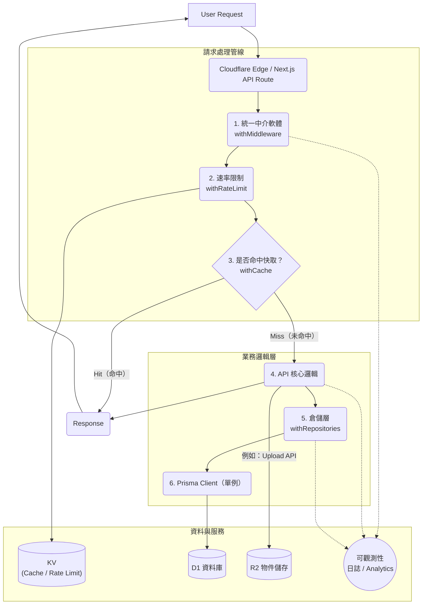

# 不用再配伺服器了！這套 Next.js + Cloudflare 模板，一個人零成本搞定全端出海

作為開發者，我們都想快速驗證自己的想法，尤其是在海外市場。但一想到要配伺服器、搞資料庫、CDN、CI/CD，一個人基本就被勸退了。

這篇文章想分享一個開源模板，它把這套事全包了。

核心就是：**一個人、零成本、用 Next.js + Cloudflare 生態搞定全端出海。**

---

- **GitHub 倉庫：** [TangSY/edge-next-starter](https://github.com/TangSY/edge-next-starter)
- **線上 Demo：** [7723b3e2.cloudflare-worker-template-prod.pages.dev](https://7723b3e2.cloudflare-worker-template-prod.pages.dev/)

---

這篇文章特別適合：獨立開發者、早期新創團隊，或者任何需要快速驗證海外市場的工程師。

## 為什麼說「一個人就能搞定」？

說「一個人就能搞」，不是吹牛。核心是這個模板已經把最繁瑣的「髒活累活」幹完了。

你不用再從零開始搭架子。這個模板把一個全端應用需要的東西都分好類，並提供了最佳實踐：

- **前端：** Next.js 15.5.2（App Router + TypeScript）
- **後端：** Cloudflare Pages Functions（Edge Runtime），API 路由開箱即用
- **資料：** Prisma ORM + D1 資料庫
- **儲存：** R2 物件儲存
- **快取：** KV 鍵值儲存
- **觀測：** 結構化日誌 + Analytics 事件
- **工程：** 統一回應／錯誤／中介軟體／速率限制
- **測試：** Vitest
- **部署：** Wrangler + GitHub Actions

你能真正專注於業務本身：頁面、資料模型、介面邏輯。其餘的工程必需品，例如日誌、限流、錯誤處理、回應格式、快取、上傳、健康檢查、多環境配置與 CI/CD，都已預設提供。

對你來說，這意味著：

1. **節省大量時間：** 減少 70% 以上的重複配置工作。
2. **不用糾結選型：** 直接使用 Next.js + Cloudflare 這套統一的現代技術棧。
3. **部署無憂：** 環境變數、CI/CD 腳本與文件都已備好，照著跑就行。

---

## 輕鬆上手：5 步跑通全端

上手不難，這個模板把關鍵步驟都腳本化了。你只需要準備好這幾樣東西：

- Node.js >= 20（專案裡有 `.nvmrc`）
- pnpm >= 8
- 一個 Cloudflare 帳戶（需要開通 Pages、Workers、D1、R2、KV）

然後，跟著 `QUICKSTART-zh.md` 文件，5 步就能跑起來：

1. **初始化：** `pnpm i` 裝好依賴，`wrangler login` 登入 Cloudflare。
2. **配環境：** 配置 `wrangler.toml`（本地）、`wrangler.test.toml`（測試）和 `wrangler.prod.toml`（正式環境）。
3. **建資源：**
   - D1（資料庫）：`pnpm run db:migrate:local`
   - R2（儲存）：`pnpm run r2:create:test`（或 `prod`）
   - KV（快取）：`pnpm run kv:create:test`（或 `prod`）
4. **跑開發：**
   - 本地開發（Next.js）：`pnpm dev`
   - 模擬 Cloudflare 環境：`pnpm run cf:dev`
5. **部署上線：**
   - 測試環境：`pnpm run pages:deploy:test`
   - 正式環境：`pnpm run pages:deploy:prod`

如果順利，你一天內就能跑通 Demo，一週內就能上線 MVP，去驗證海外訪問體驗。

---

## 零成本起步：Cloudflare 免費額度有多香？

「完全免費」是這套方案最大的誘惑。Cloudflare 的 Free Tier 真的非常大方，用來做 MVP 甚至中小流量專案都綽綽有餘，但實際額度仍要以 Cloudflare 官方最新文件為準。

- **Pages（靜態託管）**
  - 專案數量：100 個
  - 每月建置：500 次
  - 頻寬／靜態請求：無限制
- **Pages Functions（與 Workers 共享額度）**
  - 每日請求：100,000 次
  - CPU 時間：每次請求 10 毫秒
- **D1 Database（資料庫）**
  - 資料庫數量：10 個
  - 總儲存：5 GB（所有資料庫共享）
- **R2 Storage（物件儲存）**
  - **核心優勢：零出站費用（Egress Zero）**，這點對出海非常重要。

這些額度對個人開發者相當友善。你能以**零伺服器成本**跑一個真實的全端應用。

---

## 完整的生態：不只是拼湊

這個模板不是簡單把 Next.js 和 Cloudflare 拼在一起，而是把它們的原生生態串成一個有機整體。它已經為你規劃好每個元件的職責：

- **前端／頁面：** Next.js App Router 負責承載 UI，SSR、SSG、ISR 都具備，Tailwind CSS 也已配好。
- **後端／API：** 執行在 Edge Runtime 上的 Next.js 路由（`app/api/*`）負責處理業務邏輯。
- **資料／ORM：** Prisma 配合 `@prisma/adapter-d1` 連接 D1 資料庫，享受型別安全與關聯查詢。
- **快取：** KV 作為高效能鍵值儲存，用於快取熱點資料。
- **儲存：** R2 負責物件儲存，適合圖片與附件上傳，對 CDN 友好。
- **可觀測性：** 結構化日誌（`pino`）與 Analytics Engine 負責事件打點，方便排查問題。
- **部署：** Wrangler 統一驅動本地開發與多環境（`local`、`test`、`prod`）部署。
- **規範／工程：** 統一的錯誤類型、Repository 模式分層、CI/CD 自動化。

你不需要再折騰「如何把這些拼好」，直接用即可。

---

## 為什麼說它適合「出海」？

海外使用者最關心兩件事：**訪問速度**和**穩定性**。

這套方案天生就是為全球訪問設計的：

1. **全球邊緣節點：** 你的應用和服務（Pages、Workers）都部署在 Cloudflare 的全球 POP 上，使用者可以就近接入，延遲自然更低。
2. **D1 邊緣資料庫：** 很適合輕中量業務，能減少資料庫跨區查詢延遲。
3. **R2 零出站費：** 海外使用者下載圖片或檔案時，不必支付高昂流量費，成本結構更漂亮。
4. **邊緣快取（KV）：** 以極低延遲服務熱點資料。
5. **輕鬆多環境：** 測試與正式環境分離，按分支策略（`develop -> test`、`main -> prod`）自動部署。

這套技術棧能讓你快速上線、穩定運行、低成本迭代，把精力真正花在試錯與打磨產品上。

---

## 模板裡的一些「私貨」：工程亮點

這部分是模板真正有價值的地方。只提供元件拼裝是不夠的，作者把正式環境中必備的工程實踐都標準化了。

1. **統一 API 回應與中介軟體**
   - `lib/api/response.ts` 定義 `success`／`error` 的結構，`errorResponse` 會自動映射錯誤類型與狀態碼。
   - `lib/api/middleware.ts` 會自動注入 `requestId`、記錄請求耗時，並追加追蹤標頭。

2. **錯誤類型體系**
   - `lib/errors/index.ts` 定義十多種常見錯誤類型，例如資料庫、驗證、認證、限流等。
   - `ERROR_STATUS_MAP` 統一管理 HTTP 狀態碼，讓錯誤處理更規範。

3. **結構化日誌（正式環境 JSON、開發環境 Pretty）**
   - `lib/logger/index.ts` 支援 `http()`、`performance()`、`query()` 等專用方法，也能配置慢查詢門檻。

4. **Analytics 事件打點**
   - `lib/analytics/index.ts` 定義各種業務事件，可選擇 Sink（例如寫入 D1 或 KV），失敗時自動降級到日誌。

5. **速率限制（KV 滑動視窗）**
   - `lib/api/rate-limit.ts` 利用 KV 的原子性實作滑動視窗限流。預設每分鐘 300 次，也能在路由上自訂，例如限制建立使用者介面為 `10/min`。

6. **Repository 模式 + Prisma + D1 單例**
   - `repositories/*` 封裝資料存取，`lib/api/database.ts` 提供 `withRepositories` 注入。
   - `lib/db/client.ts` 對 Prisma Client 做了**單例重用**。這很關鍵，能減少約 50 到 100 毫秒的資料庫冷啟動開銷。

7. **開箱即用的快取裝飾器**
   - `lib/cache/client.ts` 提供 `withCache(key, fn, ttl)` 裝飾器，自動處理快取命中、穿透與回源。

8. **封裝 R2 上傳與下載**
   - `lib/r2/client.ts` 封裝上傳與下載，`app/api/upload/route.ts` 是完整範例，你不需要直接面對複雜的 S3 SDK。

9. **健康檢查端點**
   - `app/api/health/route.ts` 提供健康檢查端點，方便 CI/CD 或監控系統檢測 D1、R2、KV 是否可用。

10. **CI/CD 與變更記錄**
    - `.github/workflows/*` 負責 CI 與部署。
    - `release-please` 用來自動管理 `CHANGELOG`。

---

## 實踐路徑：從零到 MVP

我建議的實踐路徑如下：

### Day 1：跑通並上線 Demo

- Fork 專案，配置好 Cloudflare 帳戶與 Wrangler，建立 D1、R2、KV 並完成綁定。
- 在本地跑通 `pnpm dev` 和 `pnpm run cf:dev`，確認 Edge API 正常。
- 跑通遷移腳本，驗證 `/api/health`、`/api/users` 等核心介面。
- 部署到測試環境：`pnpm run pages:deploy:test`

### Day 2 到 Day 3：客製你的業務模型

- 修改 `prisma/schema.prisma`，加入自己的模型，例如 `Comment` 或 `Order`。
- 在 `repositories/*` 目錄新增自己的資料倉儲，可參考 `users.repository.ts`。
- 在 `app/api/*` 目錄新增自己的路由，統一使用 `withRepositories` + `withMiddleware`；需要快取與限流時，再加上 `withCache` / `withRateLimit`。
- 推到正式環境：`pnpm run pages:deploy:prod`，並觀察日誌與 Analytics 事件。

### Day 4 到 Day 7：出海驗證與優化

- 開始關注真實數據，對熱門介面（例如列表頁）加上 `withCache`。
- 保護寫操作（例如註冊、下單）與外部服務整合，調整限流策略。
- 透過 `logger.query`、`performance` 與 Analytics 觀測慢查詢與慢操作。
- 收集海外使用者回饋，快速迭代。

---

## 成本與擴展：免費起步，平滑升級

**免費層能跑多久？**

依作者經驗，做 MVP 和中小流量（日 10 萬請求）絕對夠用。5 GB 的 D1 儲存也能支撐一段時間，而 R2 的零出站費更是巨大的成本優勢。

**未來如何擴展？**

當你的業務開始成長後，這套架構也能平滑升級：

1. **資料：** 讀寫壓力變大時，先上讀快取（KV）；再不夠就考慮接入專業託管資料庫，例如 PlanetScale，讓 Edge 扮演 BFF 層。
2. **儲存：** R2 本身效能很強，後續重點通常在管理策略。
3. **觀測：** Analytics Engine 可以持久化資料，也能再對接外部可觀測平台。

---

## 常見問題（FAQ）

**Q1：為什麼選 Next.js + Cloudflare？**  
A：前端生態成熟，加上 Edge 原生執行時。對獨立開發者來說，沒有伺服器維護成本、全球 POP 優勢，以及 D1、R2、KV 的一體化，是很關鍵的決定因素。

**Q2：會不會很難上手？**  
A：如果你本來就熟 Next.js，幾乎沒有門檻。模板已經把資料庫連接、日誌、部署這些最麻煩的工程部分包好，你只需要寫業務。

**Q3：免費層真的夠用嗎？**  
A：對 MVP 和中小流量來說通常足夠。上線後持續觀察 Cloudflare 用量統計，快超額時再升級或優化即可。

**Q4：如何面向海外做優化？**  
A：核心就是盡量靠近使用者。善用邊緣快取（KV）、R2 零出站費，以及 SSR、SSG、ISR，減少跨區往返；同時為介面加上 `withCache` 和合理的 `Cache-Control` 標頭。

**Q5：如何擴展複雜業務？**  
A：透過 Repository 模式擴展資料存取層；在 API 層統一使用 `withRepositories` + `withMiddleware`。Prisma 本身也支援交易、分頁與過濾等能力。

---

## 結語：把精力還給產品

如果你也是獨立開發者或小團隊，正苦於出海專案的啟動成本與複雜度，希望這套模板能幫你省下大量搭建基礎設施的時間。

「一個人就能搞定出海全端」不是口號，而是一種可行的實踐。

---

### 立刻開始：一天內上線你的出海應用

別再猶豫了。你的下一個想法，不該死在繁瑣的伺服器配置上。

**立即 Fork 倉庫，開始構建：**  
[https://github.com/TangSY/edge-next-starter](https://github.com/TangSY/edge-next-starter)

祝你出海順利。

---

原文出處：[https://juejin.cn/post/7564921269491580943](https://juejin.cn/post/7564921269491580943)
