# Google OAuth 申請、Gmail 應用程式密碼與 OAuth2 Proxy Zero Trust 實作

## 前言

在 Zero Trust 持續被討論的這幾年，我自己過去其實比較常直接使用 Cloudflare Zero Trust 或 VPN，很少從零自建整套驗證入口。不過當部署環境的網路條件比較嚴格時，VPN 不一定總是可行，這時候把驗證邏輯收斂到 HTTP 入口，通常會更容易落地。

OAuth2 Proxy 就是很適合這種場景的元件。它可以站在應用程式前面，接手登入、驗證與使用者識別，再把已經通過驗證的請求轉交給後端服務。本文以 Google 當成 OAuth 提供者，在 Linux 上結合 Nginx，示範如何建立一套簡單實用的 Zero Trust 存取入口，並補上 Gmail SMTP 需要的 Google 應用程式密碼設定方式。

## Google 帳號前置條件與差異

在開始之前，先把兩件常被混在一起的設定拆開：

- `Google OAuth Client ID / Client Secret`：這是給 OAuth2 Proxy 或網站登入流程用的，必須在 Google Cloud Console 建立。
- `Google 應用程式密碼`：這是給 Gmail SMTP、舊版郵件客戶端、掃描器或只接受帳號密碼的程式用的 16 位密碼，不是 OAuth 的 `Client Secret`。

如果你的需求同時包含「網站登入」與「Gmail SMTP 寄信」，通常兩者都要準備：

1. 在 Google Cloud Console 建立 OAuth 憑證，給 OAuth2 Proxy 使用。
2. 在 Google 帳號安全性設定中開啟兩步驟驗證，之後另外產生 Gmail SMTP 專用的應用程式密碼。

如果你用的是公司或學校的 Google Workspace 帳號，要先注意兩件事：

- Google 官方目前建議第三方郵件客戶端優先改用 OAuth。
- 即使已開啟兩步驟驗證，`應用程式密碼` 也可能因為管理員政策、只允許安全金鑰，或 Advanced Protection 而不顯示。

## 架構概念

這篇文章採用的是「Nginx 在最前面，OAuth2 Proxy 負責驗證，後端應用只接收已驗證流量」的做法。

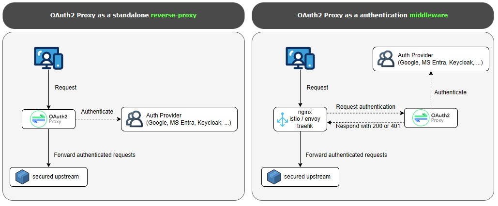

整體流程如下：

1. 使用者先連到受保護的網站。
2. Nginx 先將請求送到 OAuth2 Proxy 做驗證。
3. 如果尚未登入，OAuth2 Proxy 會將使用者導向 Google 登入頁。
4. 使用者完成登入與授權後，Google 會把瀏覽器導回 `/oauth2/callback`。
5. OAuth2 Proxy 建立登入 Session，並將請求交回 Nginx。
6. Nginx 再把請求轉送到真正的後端服務。

這種做法的好處是，後端應用程式本身不需要處理 OAuth 流程，只要信任來自反向代理層的使用者資訊即可。

## 前置設定

本文使用 Google 作為 OAuth 提供者，因此第一步要先在 Google Cloud Console 建立 OAuth 用戶端。這一段處理的是「登入授權」，不是 Gmail SMTP 的應用程式密碼。

先前往 [Google Cloud 建立專案](https://console.developers.google.com/project)，建立一個新的專案，或直接使用現有專案。

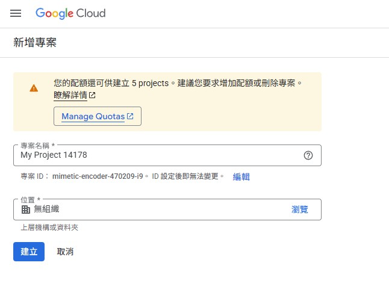

接著前往「API 和服務」中的「[憑證](https://console.cloud.google.com/apis/credentials)」，選擇建立「OAuth 用戶端 ID」。

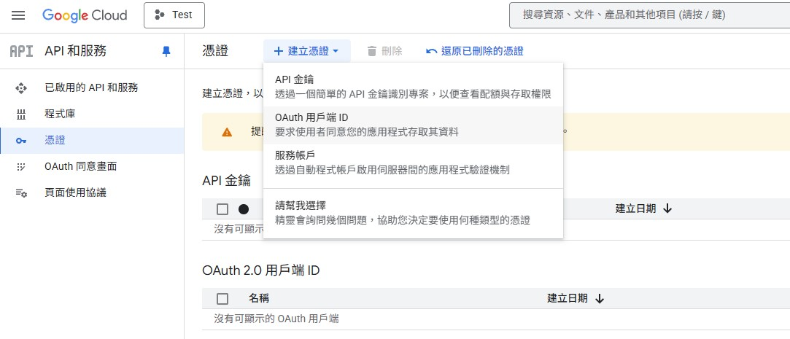

如果是第一次操作，畫面通常會先要求你設定「OAuth 同意畫面」。這一步要先完成，後面才有辦法建立 OAuth 用戶端。

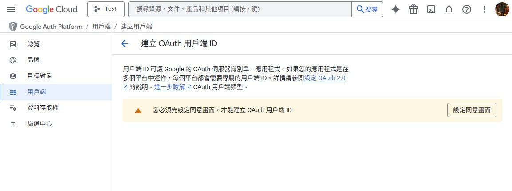

建立 OAuth 用戶端時，應用程式類型請選「網頁應用程式」。名稱可以自行決定，但重新導向 URI 必須填入你實際要保護的網域，並加上：

```text
https://你的網域/oauth2/callback
```

如果你目前還在內網測試，也可以先用測試網域或反向代理入口的正式網址來配置。

這裡有兩個很重要，而且很容易填錯的規則：

### 1. JavaScript 來源只能填來源，不能帶路徑

「已授權的 JavaScript 來源」只能填網站來源本身，不能包含 callback path。

正確範例：

```text
http://localhost:8080
```

錯誤範例：

```text
http://localhost:8080/auth/google/callback
```

### 2. 重新導向 URI 必須填完整 callback 路徑

「已授權的重新導向 URI」必須填完整路徑，而且要和你程式中實際使用的 `redirect_uri` 完全一致。

正確範例：

```text
http://localhost:8080/auth/google/callback
```

如果你的本機測試可能會在 `127.0.0.1` 與 `localhost` 之間切換，建議兩組都先加進去：

已授權的 JavaScript 來源：

```text
http://localhost:8080
http://127.0.0.1:8080
```

已授權的重新導向 URI：

```text
http://localhost:8080/auth/google/callback
http://127.0.0.1:8080/auth/google/callback
```

如果這裡少填其中一組，實際測試時很容易出現「看起來網址差不多，但 Google 不接受」的情況。

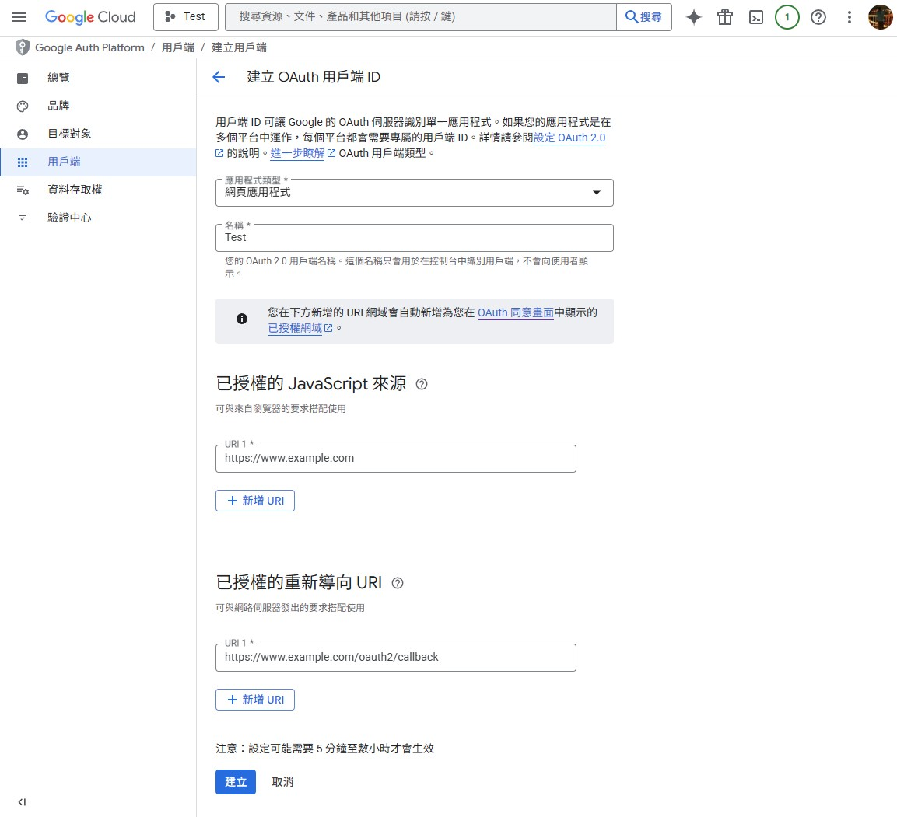

建立完成後，請記錄以下資訊，後面設定 OAuth2 Proxy 時會用到：

- `Client ID`
- `Client Secret`

你也可以直接下載 JSON 留存，但本文後續示範會直接把必要欄位寫進設定檔。

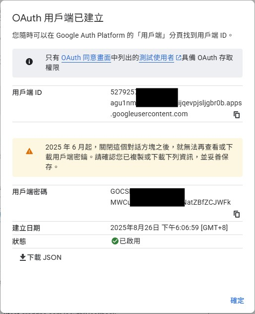

## Gmail SMTP 的 Google 應用程式密碼

如果你的系統除了要做 Google OAuth 登入，還需要透過 Gmail SMTP 寄信，這裡要再做第二組設定。這組密碼是給 SMTP 驗證用，不是前面 Google Cloud Console 建出來的 `Client Secret`。

### 1. 先開啟兩步驟驗證

Google 官方要求只有已開啟兩步驟驗證的帳號，才能建立應用程式密碼。若尚未開啟，先到 Google 帳戶的「安全性」頁面完成設定。

### 2. 進入應用程式密碼頁面

目前介面比以前藏得更深，實務上有三種進法：

1. 直接開啟 `https://myaccount.google.com/apppasswords`。
2. 進入 Google 帳戶管理頁後，如果上方有搜尋欄，直接搜尋「應用程式密碼」。
3. 手動走 `安全性` -> `兩步驟驗證`，然後往頁面下方找 `應用程式密碼`。

如果你明明已開啟兩步驟驗證，卻還是看不到這個入口，常見原因有：

- 帳號只允許使用安全金鑰做兩步驟驗證。
- 你使用的是公司、學校或其他受管理的 Google Workspace 帳號。
- 帳號已啟用 Advanced Protection。

### 3. 建立 SMTP 專用密碼

建立時可以選 Mail / 其他自訂名稱。若你的程式是後端服務，建議名稱直接寫成服務名，例如：

```text
my-api-gmail-smtp
```

建立完成後，Google 會顯示一組 16 位密碼。這組密碼只會顯示一次，請立即保存到你的密碼管理工具或部署環境變數。

### 4. Gmail SMTP 連線參數

常見設定如下：

```text
SMTP Host: smtp.gmail.com
SMTP Port: 587
Security: STARTTLS / TLS
Username: 你的完整 Gmail 位址
Password: 剛剛產生的 Google 應用程式密碼
```

如果你的程式要求 SSL 直連，也可改用：

```text
SMTP Host: smtp.gmail.com
SMTP Port: 465
Security: SSL
Username: 你的完整 Gmail 位址
Password: 剛剛產生的 Google 應用程式密碼
```

這裡有三個容易填錯的點：

- `SMTP Password` 要填應用程式密碼，不是平常登入 Google 的主密碼。
- `SMTP Password` 也不是前面 OAuth 用的 `Client Secret`。
- 如果你的郵件元件支援 `Sign in with Google` 或完整 OAuth，優先改用 OAuth，安全性會比應用程式密碼更高。

### 5. 最小可用範例

如果你的程式只接受帳號密碼登入 SMTP，環境變數通常會長這樣：

```bash
export SMTP_HOST="smtp.gmail.com"
export SMTP_PORT="587"
export SMTP_USERNAME="you@gmail.com"
export SMTP_PASSWORD="你的16位應用程式密碼"
```

實際送信成功後，再把這組設定帶回你的應用程式或部署系統即可。

## 建立環境

接下來在 Linux 主機上安裝 Nginx 與 OAuth2 Proxy。以下範例以 Debian 或 Ubuntu 系列環境為主。

### 1. 安裝 Nginx

```bash
sudo apt-get update
sudo apt-get install -y nginx nginx-extras
```

安裝完成後，可以先確認 Nginx 服務狀態：

```bash
sudo systemctl status nginx
```

如果只是先確認服務有沒有起來，也可以直接測試設定檔是否有效：

```bash
sudo nginx -t
```

### 2. 下載 OAuth2 Proxy

前往 OAuth2 Proxy 的 [Releases 頁面](https://github.com/oauth2-proxy/oauth2-proxy/releases) 找你要使用的版本。本文範例沿用原文版本 `v7.12.0`，實際部署前請自行確認你要的版本號。

```bash
cd /tmp
sudo wget https://github.com/oauth2-proxy/oauth2-proxy/releases/download/v7.12.0/oauth2-proxy-v7.12.0.linux-amd64.tar.gz
sudo tar zxvf oauth2-proxy-v7.12.0.linux-amd64.tar.gz
```

解壓縮後會得到一個 `oauth2-proxy-v7.12.0.linux-amd64` 目錄，裡面包含可執行檔 `oauth2-proxy`。

### 3. 安置可執行檔

原文習慣把執行檔移到 `/etc/`，這裡保留同樣做法。如果你偏好更標準的路徑，也可以放到 `/usr/local/bin/`。

```bash
cd /tmp/oauth2-proxy-v7.12.0.linux-amd64
sudo mv oauth2-proxy /etc/oauth2-proxy
sudo chmod +x /etc/oauth2-proxy
```

確認版本：

```bash
/etc/oauth2-proxy --version
```

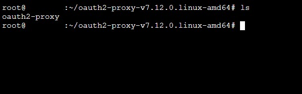

## 設定 OAuth2 Proxy

接著建立 OAuth2 Proxy 需要的設定目錄與檔案。這裡使用 `/var/auth` 作為工作目錄。

### 1. 建立設定目錄

```bash
sudo mkdir -p /var/auth
cd /var/auth
```

### 2. 建立 `run.cfg`

建立 `run.cfg`，內容如下：

```ini
http_address = "127.0.0.1:4180"
reverse_proxy = true
upstreams = ["http://127.0.0.1:80/"]
pass_basic_auth = true
pass_user_headers = true
pass_host_header = true
set_xauthrequest = true
client_id = "YOUR_CLIENT_ID.apps.googleusercontent.com"
client_secret = "YOUR_CLIENT_SECRET"
scope = "openid email profile"
pass_access_token = false
authenticated_emails_file = "/var/auth/email.txt"
cookie_name = "_oauth2_proxy"
cookie_secret = "YOUR_COOKIE_SECRET"
cookie_expire = "2h"
cookie_refresh = "1h"
cookie_secure = true
```

這幾個欄位最重要：

- `client_id` 與 `client_secret`：直接填入剛剛在 Google Cloud 建立的憑證。
- `authenticated_emails_file`：允許登入的 Email 白名單。
- `cookie_secret`：用來保護 Cookie，必須自行產生。
- `cookie_secure = true`：表示只透過 HTTPS 傳送 Cookie，正式環境應維持開啟。

### 3. 產生 `cookie_secret`

可以用下面這個指令產生一組隨機字串：

```bash
dd if=/dev/urandom bs=32 count=1 2>/dev/null | base64 | tr -d '\n' | tr '+/' '-_' ; echo
```

將輸出結果貼進 `cookie_secret`。

### 4. 建立允許登入的 Email 白名單

建立 `email.txt`，每行放一個允許通過的 Email，例如：

```text
alice@example.com
bob@example.com
```

這樣 OAuth2 Proxy 驗證成功後，只有在白名單中的帳號會被放行。

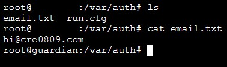

### 5. 建議先本地檢查設定檔

在正式掛成背景服務前，先用前景模式測一次，最容易看錯誤訊息：

```bash
sudo /etc/oauth2-proxy --config=/var/auth/run.cfg
```

如果設定沒問題，通常會看到服務啟動並監聽在 `127.0.0.1:4180`。這一步確認完成後，再按 `Ctrl+C` 停掉，繼續做 systemd 設定。

## 設定背景服務

接著把 OAuth2 Proxy 掛成 systemd 服務，讓它能開機自動啟動，也比較方便查看狀態與日誌。

### 1. 建立 service 檔

在 `/etc/systemd/system` 建立 `oauth2proxy.service`：

```bash
cd /etc/systemd/system
sudo vim oauth2proxy.service
```

貼上以下內容：

```ini
[Unit]
Description=Oauth2-Proxy Daemon Service
After=network.target network-online.target nss-lookup.target basic.target
Wants=network-online.target nss-lookup.target

[Service]
Type=simple
ExecStart=/etc/oauth2-proxy --config=/var/auth/run.cfg
WorkingDirectory=/var/auth
Restart=on-failure
RestartSec=5s

[Install]
WantedBy=multi-user.target
```

### 2. 重新載入 systemd

```bash
sudo systemctl daemon-reload
```

### 3. 啟動並設定開機自動啟動

```bash
sudo systemctl start oauth2proxy
sudo systemctl enable oauth2proxy
```

### 4. 確認服務真的有起來

```bash
sudo systemctl status oauth2proxy
```

如果啟動失敗，可以立刻看日誌：

```bash
sudo journalctl -u oauth2proxy -n 100 --no-pager
```

若你正在調整設定檔，追即時日誌會更快：

```bash
sudo journalctl -u oauth2proxy -f
```

這一段建議一定要做，因為 `client_id`、`client_secret`、`cookie_secret`、白名單路徑只要任一處有誤，通常都會在這裡第一時間暴露。

## 設定 Nginx

OAuth2 Proxy 本身只負責驗證，所以還需要 Nginx 負責把外部流量收進來，並在轉送到後端前先做驗證。

### 1. 設定重點

這裡有三個關鍵位置：

- `/oauth2/`：讓瀏覽器可以跟 OAuth2 Proxy 完成登入、登出與回呼流程。
- `/oauth2/auth`：給 Nginx 的 `auth_request` 子請求使用。
- `/`：真正受保護的應用入口，只有驗證成功才會被代理到後端。

### 2. 範例設定

請依你的網域名稱、SSL 憑證路徑與後端位址修改：

```nginx
server {
    listen 443 ssl;
    listen [::]:443 ssl;
    server_name www.example.com;

    ssl_certificate /var/ssl/fullchain.pem;
    ssl_certificate_key /var/ssl/privkey.pem;

    server_tokens off;
    more_set_headers Server;

    location /oauth2/ {
        proxy_pass http://127.0.0.1:4180;
        proxy_set_header Host $host;
        proxy_set_header X-Real-IP $remote_addr;
        proxy_set_header X-Auth-Request-Redirect $scheme://$host$request_uri;
    }

    location = /oauth2/auth {
        proxy_pass http://127.0.0.1:4180;
        proxy_set_header Host $host;
        proxy_set_header X-Real-IP $remote_addr;
        proxy_set_header X-Forwarded-Uri $request_uri;
        proxy_set_header Content-Length "";
        proxy_pass_request_body off;
    }

    location = /oauth2/sign_out {
        proxy_pass http://127.0.0.1:4180;
        proxy_set_header Host $host;
        proxy_set_header X-Real-IP $remote_addr;
        proxy_set_header X-Forwarded-Uri $request_uri;
    }

    location / {
        auth_request /oauth2/auth;
        error_page 401 =403 /oauth2/sign_in;

        auth_request_set $user $upstream_http_x_auth_request_user;
        auth_request_set $email $upstream_http_x_auth_request_email;
        auth_request_set $token $upstream_http_x_auth_request_access_token;
        auth_request_set $auth_cookie $upstream_http_set_cookie;

        proxy_set_header X-User $user;
        proxy_set_header X-Email $email;
        proxy_set_header X-Access-Token $token;
        add_header Set-Cookie $auth_cookie;

        proxy_set_header Host $host;
        proxy_set_header X-Real-IP $remote_addr;
        proxy_set_header X-Forwarded-Uri $request_uri;
        proxy_pass http://192.168.1.2:80;
    }
}
```

### 3. 套用前先驗證設定

每次修改完 Nginx 設定，都先做語法檢查：

```bash
sudo nginx -t
```

確認沒問題後再重新載入：

```bash
sudo systemctl restart nginx
```

如果 Nginx 重啟失敗，可以直接看最近錯誤：

```bash
sudo journalctl -u nginx -n 100 --no-pager
```

### 4. 常見調整點

- 後端應用如果本身也要知道使用者身份，可以直接讀 `X-User` 與 `X-Email`。
- 如果你的服務是跑在不同 port，請修改 `proxy_pass http://192.168.1.2:80;`。
- 如果你是反向代理多個站點，建議每個站點各自維護一組對應的 Nginx server block。
- 正式環境務必使用 HTTPS，否則 `cookie_secure = true` 會造成 Cookie 無法正常工作。

## 查看成果

設定完成後，打開你的網站，第一次進入時應該會先看到 OAuth2 Proxy 的登入畫面。

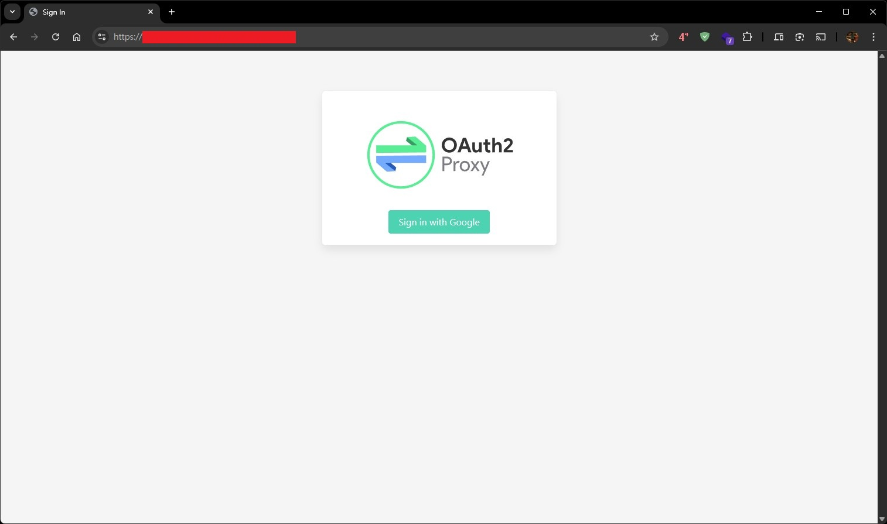

點下登入之後，瀏覽器會被導向 Google 的登入與授權頁面。

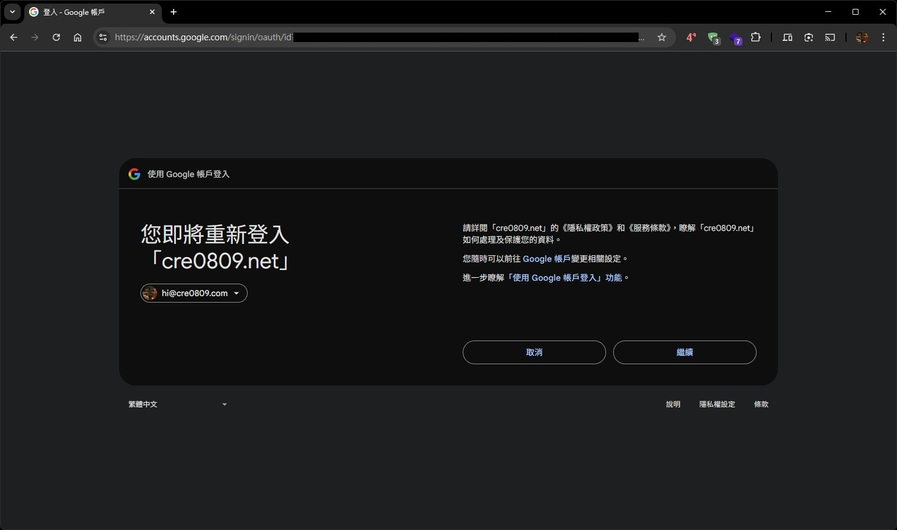

當驗證成功並回到原站後，你的應用程式才會真正出現。原文範例的後端是一個 AdGuard Home 頁面。

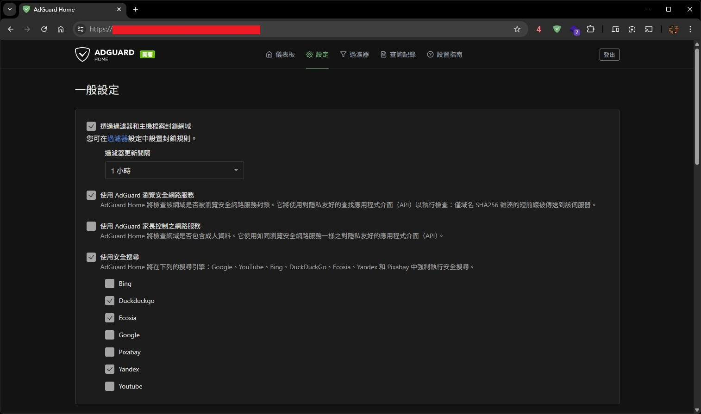

## 驗證流程建議

如果你想更有系統地確認整套流程有成功，可以照下面順序檢查：

1. `systemctl status oauth2proxy` 確認 OAuth2 Proxy 服務正常。
2. `systemctl status nginx` 確認 Nginx 正常。
3. `curl -I https://你的網域/oauth2/sign_in` 確認 OAuth2 Proxy 入口能回應。
4. 用瀏覽器開啟受保護頁面，確認會先跳轉登入。
5. 使用白名單中的 Google 帳號登入，確認可成功回到應用頁面。
6. 改用不在 `email.txt` 的帳號重試，確認應該被拒絕。

## 常見問題

### 登入後一直回到登入頁

通常先檢查這幾個地方：

- Google Cloud 的重新導向 URI 是否與實際網址完全一致。
- `cookie_secret` 是否正確。
- 站點是否真的走 HTTPS。
- `cookie_secure = true` 的情況下，是否誤用 HTTP 進行測試。

### 看不到 Google 應用程式密碼入口

先依序檢查：

- 兩步驟驗證是否真的已開啟。
- 這個帳號是否是公司或學校帳號，且管理員禁用了 App Passwords。
- 兩步驟驗證是否只設定安全金鑰。
- 帳號是否啟用了 Advanced Protection。

如果你是 Google Workspace 帳號，且要給第三方客戶端或裝置連 Gmail，Google 官方目前優先建議改用 OAuth。

### OAuth2 Proxy 起不來

優先看：

```bash
sudo journalctl -u oauth2proxy -n 100 --no-pager
```

最常見是設定檔路徑錯、白名單檔案不存在，或 `client_secret` 填錯。

### Nginx 驗證一直失敗

先確認：

- `location = /oauth2/auth` 是否存在。
- `auth_request /oauth2/auth;` 是否寫對。
- `proxy_pass` 是否真的指向 `127.0.0.1:4180`。
- `nginx -t` 是否通過。

## 參考資料

- [OAuth2 Proxy GitHub Repository](https://github.com/oauth2-proxy/oauth2-proxy)
- [OAuth2 Proxy Releases](https://github.com/oauth2-proxy/oauth2-proxy/releases)
- [Google Cloud Console](https://console.cloud.google.com/)
- [Google Account Help: Sign in with app passwords](https://support.google.com/accounts/answer/185833)
- [Google Workspace Help: Set up Gmail with a third-party email client](https://support.google.com/a/answer/9003945)
