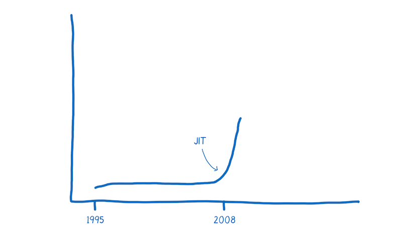
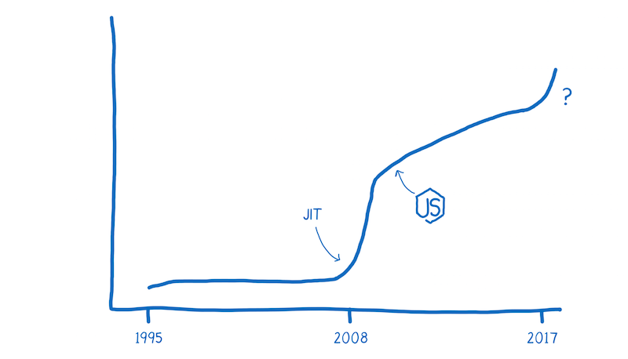
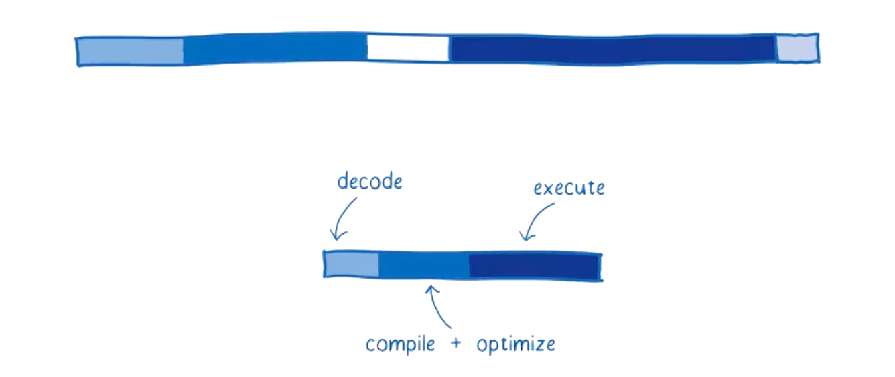
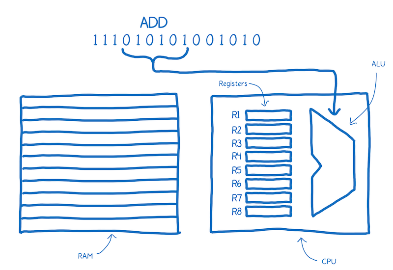
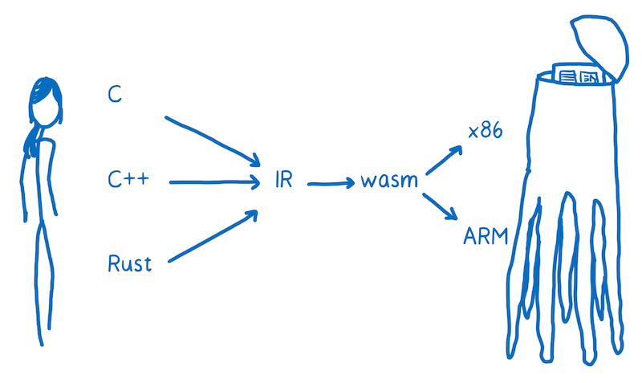
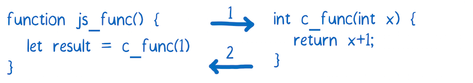

# WebAssembly

WebAssembly 是一種可以使用非 JavaScript 程式語言編寫程式碼並且能在瀏覽器上執行的技術方案。

## 一點點效能歷史

1995 年 JavaScript 誕生。它的設計時間非常短，前十年發展迅速。

緊接著瀏覽器廠商們就開始了更多的競爭。

2008年，人們稱之為瀏覽器效能大戰的時期開始了。很多瀏覽器加入了即時編譯器，又稱之為JITs。在這種模式下，JavaScript在執行的時候，JIT 選擇模式然後基於這些模式使程式碼執行更快。

這些 JITs 的引入是瀏覽器執行程式碼機制的一個轉折點。所有的突然之間，JavaScript 的執行速度快了10倍。



隨著這種改進的效能，JavaScript 開始被用於意想不到的事情，比如使用Node.js和Electron構建應用程式。

現在 WebAssembly 可能是的另一個轉折點。



在我們沒有搞清楚 JavaScript 和 WebAssembly 之間的效能差前，我們需要理解 JS 引擎所做的工作。

## JavaScript 是如何在瀏覽器中執行的呢？

作為一個開發人員，您將JavaScript加入到頁面時，您有一個目標並遇到一個問題。

- 目標：你想要告訴電腦做什麼
- 問題：你和電腦使用不通的語言。

您說的是人類的語言，電腦說的是機器語言。儘管你不認為 JavaScript 或者其他高階語言是人類語言，但事實就是這樣的。它們的設計是為了讓人們認知，不是為機器設計的。

所以JavaScript引擎的工作就是把你的人類語言轉化成機器所理解的語言。

在程式設計中，通常有兩種翻譯方法將程式碼翻譯成機器語言。你可以使用`解釋器`或者`編譯器`。

使用解釋器，翻譯的過程基本上是一行一行及時生效的。

編譯器是另外一種工作方式，它在執行前翻譯。

每種翻譯方法都有利弊。

### 解釋器的利弊

解釋器很快的獲取程式碼並且執行。您不需要在您可以執行程式碼的時候知道全部的編譯步驟。因此，解釋器感覺與 JavaScript 有著自然的契合。web 開發者能夠立即得到回饋很重要。

這也是瀏覽器最開始使用 JavaScript 解釋器的原因之一。

但是實用解釋器的弊端是當你執行相同的程式碼的時候。比如，你執行了一個迴圈。然後你就會一遍又一遍的做同樣的事情。

### 編譯器的利弊

編譯器則有相反的效果。在程式開始的時候，它可能需要稍微多一點的時間來瞭解整個編譯的步驟。但是當執行一個迴圈的時候他會更快，因為他不需要重複的去翻譯每一次迴圈裡的程式碼。

因為解釋器必須在每次迴圈存取時不斷重新轉換程式碼，作為一個可以擺脫解釋器低效率的方法，瀏覽器開始將編譯器引入。

不同的瀏覽器實現起來稍有不同，但是基本目的是相同的。他們給 JavaScript 引擎新增了一個新的部分，稱為監視器（也稱為分析器）。該監視器在 JavaScript 執行時監控程式碼，並記錄程式碼片段執行的次數以及使用了那些資料型別。

如果相同的程式碼行執行了幾次，這段程式碼被標記為 "warm"。如果執行次數比較多，就被標記為 "hot"。

被標記為 "warm" 的程式碼被扔給基礎編譯器，只能提升一點點的速度。被標記為 "hot" 的程式碼被扔給最佳化編譯器，速度提升的更多。

## 耗時比較：JavaScript Vs. WebAssembly

這張圖大致給出了現在一個程式的啟動效能，目前 JIT 編譯器在瀏覽器中很常見。

該圖顯示了 JS 引擎執行程式花費的時間。顯示的時間並不是平均的。這個圖片表明，JS 引擎做的這些任務花費的時間取決於頁面中 JavaScript 做了什麼事情。但是我們可以用這個圖來構建一個心理模型。


每欄顯示花費在特定任務上的時間。

- `Parsing` - 將原始碼轉換成解釋器可以執行的東西所用的事情。
- `Compiling + optimizing` - 花費在基礎編譯和最佳化編譯上的時間。有一些最佳化編譯的工作不在主執行緒，所以這裡並不包括這些時間。
- `Re-optimizing` - 當預先編譯最佳化的程式碼不能被最佳化的情況下，JIT 將這些程式碼重新最佳化，如果不能重新最佳化那麼久丟給基礎編譯去做。這個過程叫做重新最佳化。
- `Execution` - 執行程式碼的過程
- `Garbage collection` - 清理記憶體的時間

一個重要的事情要注意：這些任務不會發生在離散塊或特定的序列中。相反，它們將被交叉執行。比如正在做一些程式碼解析時，還執行者一些其他的邏輯，有些程式碼編譯完成後，引擎又做了一些解析，然後又執行了一些邏輯，等等。

這種交叉執行對早期 JavaScript 的效能有很大的幫助，早期的 JavaScript 的執行就像下圖一樣：


一開始，當只有一個解釋器執行 JavaScript 時，執行速度相當緩慢。JITs 的引入，大大提升了執行效率。

監視和編譯程式碼的開銷是需要權衡的事情。如果 JavaScript 開發人員按照相同的方式編寫JavaScript，解析和編譯時間將會很小。但是，效能的提升使開發人員能夠建立更大的JavaScript應用程式。

這意味著還有改進的餘地。

下面是 WebAssembly 如何比較典型 web 應用。



瀏覽器的 JS 引擎有輕微的不同。這裡是基於 SpiderMonkey 來講。

### 請求

這沒有展示在圖上，但是從伺服器獲取檔案是會消耗時間的

下載執行與 JavaScript 等效的 WebAssembly 檔案需要更少的時間，因為它的體積更小。WebAssembly 設計的體積更小，可以以二進位制形式表示。

即使使用 gzip 壓縮的 JavaScript檔案很小，但 WebAssembly 中的等效程式碼可能更小。

所以說，下載資源的時間會更少。在網速慢的情況下更能顯示出效果來。

### 解析

JavaScript 原始碼一旦被下載到瀏覽器，源將被解析為抽象語法樹（AST）。

通常瀏覽器解析原始碼是懶惰的，瀏覽器首先會解析他們真正需要的東西，沒有及時被呼叫的函式只會被建立成存根。

在這個過程中，AST被轉換為該 JS 引擎的中間表示（稱為位元組碼）。

相反，WebAssembly 不需要被轉換，因為它已經是位元組碼了。它僅僅需要被解碼並確定沒有任何錯誤。


### 編譯 + 最佳化

如前所述，JavaScript 是在執行程式碼期間編譯的。因為 JavaScript 是動態型別語言，相同的程式碼在多次執行中都有可能都因為程式碼裡含有不同的型別資料被重新編譯。這樣會消耗時間。

相反，WebAssembly 與機器程式碼更接近。例如，型別是程式的一部分。這是速度更快的一個原因：

編譯器不需要在執行程式碼時花費時間去觀察程式碼中的資料型別，在開始編譯時做最佳化。

編譯器不需要去每次執行相同程式碼中資料型別是否一樣。

更多的最佳化在 LLVM 最前面就已經完成了。所以編譯和最佳化的工作很少。


### 重新最佳化

有時 JIT 丟棄一個最佳化版本的程式碼,然後重新最佳化。

JIT 基於執行程式碼的假設不正確時,會發生這種情況。例如,當進入迴圈的變數與先前的迭代不同時,或者在原型鏈中插入新函式時,會發生重新最佳化。

在 WebAssembly 中,型別是明確的,因此 JIT 不需要根據執行時收集的資料對型別進行假設。這意味著它不必經過重新最佳化的週期。


### 執行

儘可能編寫執行效能好的 JavaScript。所以,你可能需要知道 JIT 是如何做最佳化的。

然而,大多數開發者並不知道 JIT 的內部原理。即使是那些瞭解 JIT 內部原理的開發人員,也很難實現最佳的方案。有很多時候,人們為了使他們的程式碼更易於閱讀（例如：將常見任務抽象為跨型別工作的函式）會阻礙編譯器最佳化程式碼。

正因如此,執行 WebAssembly 程式碼通常更快。有些必須對 JavaScript 做的最佳化不需要用在 WebAssembly 上

另外,WebAssembly 是為編譯器設計的。意思是,它是專門給編譯器來閱讀,並不是當做程式語言讓程式設計師去寫的。

由於程式設計師不需要直接程式設計,WebAssembly 提供了一組更適合機器的指令。根據您的程式碼所做的工作,這些指令的執行速度可以在10％到800％之間。


### 垃圾回收

在 JavaScript 中,開發者不需要擔心記憶體中無用變數的回收。JS 引擎使用一個叫垃圾回收器的東西來自動進行垃圾回收處理。

這對於控制效能可能並不是一件好事。你並不能控制垃圾回收時機,所以它可能在非常重要的時間去工作,從而影響效能。

現在,WebAssembly 根本不支援垃圾回收。記憶體是手動管理的（就像 C/C++）。雖然這些可能讓開發者程式設計更困難,但它的確提升了效能。


總而言之,這些都是在許多情況下,在執行相同任務時WebAssembly 將勝過 JavaScript 的原因。

WebAssembly 是如何工作的？
現在,您瞭解開發人員為什麼對 WebAssembly 感到興奮,讓我們來看看它是如何工作的。

當我談到上面的 JIT 時,我談到了與機器的溝通像與外星人溝通。


我現在想看看這個外星人的大腦如何工作 - 機器的大腦如何解析和理解交流內容。

這個大腦的一部分是專注於思考,例如算術和邏輯。有一部分腦部提供短期記憶,另一部分提供長期記憶。

這些不同的部分都有名字。

- 負責思考的部分是算術邏輯單元（ALU）。
- 短期儲存由暫存器（Registers）提供。
- 隨機儲存器（或RAM）來提供長期儲存能力。


機器碼中的語句被稱為指令。

當一條指令進入大腦時會發生什麼？它被拆分成了多個的部分並有特殊的含義。

被拆分成的多個部分分別進入不同的大腦單元進行處理,這也是拆分指令所依賴的方式。

例如,這個大腦從機器碼中取出4-10位,並將它們傳送到 ALU。ALU進行計算,它根據 0 和 1 的位置來確定是否需要將兩個數相加。

這個塊被稱為"操作碼",因為它告訴 ALU 執行什麼操作。



那麼這個大腦會拿後面的兩個塊來確定他們所要操作的數。這兩個塊對應的是暫存器的地址。


請注意新增在機器碼上面的標註（ADD R1 R2）,這使我們更容易瞭解發生了什麼。這就是`組合語言`。它被稱為符號機器碼。這樣人類也能看懂機器碼的含義。

您可以看到,這個機器的組合語言和機器碼之間有非常直接的關係。每種機器內部有不同的結構,所以每種機器都有自己獨有的組合語言。

所以我們並不只有一個翻譯的目標。
相反,我們的目標是不同型別的機器碼。就像人類說不同的語言一樣,機器也有不同的語言。

您希望能夠將這些任何一種高階程式語言轉換為任何一種組合語言。這樣做的一個方法是建立一大堆不同的翻譯器,可以從任意一種語言轉換成任意一種組合語言。


這樣做的效率非常低。為瞭解決這個問題,大多數編譯器會在高階語言和組合語言之間多加一層。編譯器將把高階語言翻譯成一種更低階的語言,但比機器碼的等級高。這就是中間程式碼（IR）。


意思就是編譯器可以將任何一種高階語言轉換成一種中間語言。然後,編譯器的另外的部分將中間語言編譯成目標機器的組合語言程式碼。

編譯器的"前端"將高階程式語言轉換為IR。編譯器的"後端"將 IR 轉換成目標機器的組合語言程式碼。


## WebAssembly 適合在哪裡使用？

您可能會將 WebAssembly 當做是另外一種目標組合語言。這是真的,這些機器語言（x86，ARM等）中的每一種都對應於特定的機器架構。

當你的程式碼執行在使用者的機器的 web 平臺上的時候,你不知道你的程式碼將會執行在那種機器結構上。

所以 WebAssembly 和別的組合語言是有一些不同的。所以他是一個概念機上的機器語言,不是在一個真正存在的物理機上執行的機器語言。

正因如此,WebAssembly 指令有時候被稱為虛擬指令。它比 JavaScript 程式碼更快更直接的轉換成機器程式碼,但它們不直接和特定硬體的特定機器程式碼對應。

在瀏覽器下載 WebAssembly後,使 WebAssembly 的迅速轉換成目標機器的組合語言程式碼。



如果想在您的頁面裡上新增 WebAssembly,您需要將您的程式碼編譯成 `.wasm` 檔案。

## 編譯到 .wasm 檔案

當前對 WebAssembly 支援最多的編譯器工具鏈稱是 LLVM。有許多不同的"前端"和"後端"可以插入到 LLVM 中。

注意：大多數 WebAssembly 模組開發者使用 C 和 Rust 編寫程式碼,然後編譯成 WebAssembly,但是這裡有其他建立 WebAssembly 模組的途徑。比如,這裡有一個實驗性工具,他可以幫你使用 TypeScript 建立一個 WebAssembly 模組,你可以在這裡直接編輯WebAssembly。

假設我們想透過 C 來建立 WebAssembly。我們可以使用 clang "前端" 從 C 編譯成 LLVM 中間程式碼。當它變成 LLVM 的中間程式碼（IR）以後,LLVM 可以理解他,所以 LLVM 可以對程式碼做一些最佳化。

如果想讓 LLVM 的 IR 變成 WebAssembly,我們需要一個 "後端"。目前 LLVM 專案中有一個正在開發中的。這個"後端"對做這件事情很重要,應該很快就會完成。可惜,它現在還不能用。

另外有一個工具叫做 Emscripten,它用起來比較簡單。它還可以有比較有用的可以選擇,比如說由 IndexDB 支援的檔案系統。


不管你使用的什麼工具鏈,最終的結果都應該是以 `.wasm` 結尾的檔案。來讓我們看一下如何將它用在你的 web 頁面。

## 在 JavaScript 中載入一個 .wasm 元件

`.wasm` 檔案是 WebAssembly 元件,它可以被 JavaScript 載入。到目前為止,載入過程有點複雜。

```js
function fetchAndInstantiate(url, importObject) {
  return fetch(url).then(response =>
    response.arrayBuffer()
  ).then(bytes =>
    WebAssembly.instantiate(bytes, importObject)
  ).then(results =>
    results.instance
  );
}
```

您可以在 [文件](https://developer.mozilla.org/en-US/docs/WebAssembly) 中更深入地瞭解這些。

我們正在努力使這個過程更容易。我們期望對工具鏈進行改進,並與現有的模組管理工具（如Webpack）或載入器（如SystemJS）相結合。我相信,載入 WebAssembly 模組越來越簡單,就像載入 JavaScript 一樣。

但是,WebAssembly模組和JS模組之間存在重大差異。目前,WebAssembly 中的函式只能使用 WebAssembly 型別（整數或浮點數）作為引數或返回值。



對於任何更複雜的資料型別（如字串），必須使用 WebAssembly 模組的記憶體。

如果你之前主要使用 JavaScript,可能對於直接存取記憶體是不熟悉的。C，C ++和Rust等效能更高的語言往往具有手動記憶體管理功能。WebAssembly 模組的記憶體模擬這些語言中的堆。

為此,它使用 JavaScript 中稱為 ArrayBuffer。ArrayBuffer 是一個位元組陣列。因此,陣列的索引作為記憶體地址。

如果要在 JavaScript 和 WebAssembly 之間傳遞一個字串,需要將字元轉換為等效的字元碼。然後你需要將它寫入記憶體陣列。由於索引是整數,所以可以將索引傳遞給 WebAssembly 函式。因此,字串的第一個字元的索引可以當作指標。


任何人開發的 WebAssembly 模組很可能被 Web 開發人員使用並為該模組建立一個的裝飾器。這樣,您當做使用者來使用這個模組就不需要考慮記憶體管理的事情了。

我已經在另一篇文章中解釋了更多 [關於使用WebAssembly模組的內容](https://hacks.mozilla.org/2017/02/creating-and-working-with-webassembly-modules/)。

## WebAssembly 現在是什麼狀態？

二月二十八日,四大瀏覽器宣佈達成共識,即 WebAssembly 的 MVP （最小化可行產品）已經完成。大約一週後,Firefox會預設開啟 WebAssembly 支援,而Chrome則在第二週開始。它也可用於預覽版本的Edge和Safari。

這提供了一個穩定的初始版本,瀏覽器開始支援。

該核心不包含社群組織計劃的所有功能。即使在初始版本中,WebAssembly 也會很快。但是,透過修復和新功能的組合,將來應該能夠更快。我在另一篇文章中 [詳細介紹了這些功能](https://hacks.mozilla.org/2017/02/where-is-webassembly-now-and-whats-next/)。

## 總結

使用WebAssembly,可以更快地在 web 應用上執行程式碼。這裡有 幾個 WebAssembly 程式碼執行速度比 JavaScript 高效的原因。

- 檔案載入 - WebAssembly 檔案體積更小,所以下載速度更快。
- 解析 - 解碼 WebAssembly 比解析 JavaScript 要快
- 編譯和最佳化 - 編譯和最佳化所需的時間較少,因為在將檔案推送到伺服器之前已經進行了更多最佳化,JavaScript 需要為動態型別多次編譯程式碼
- 重新最佳化 - WebAssembly 程式碼不需要重新最佳化,因為編譯器有足夠的資訊可以在第一次執行時獲得正確的程式碼
- 執行 - 執行可以更快,WebAssembly 指令更接近機器碼
- 垃圾回收 - 目前 WebAssembly 不直接支援垃圾回收,垃圾回收都是手動控制的,所以比自動垃圾回收效率更高。

目前瀏覽器中的 MVP（最小化可行產品） 已經很快了。在接下來的幾年裡,隨著瀏覽器的發展和新功能的增加,它將在未來幾年內變得更快。沒有人可以肯定地說,這些效能改進可以實現什麼樣的應用。但是,如果過去有任何跡象,我們可以期待驚奇。

(rb, ms, cm, il)

This article has been republished from Medium.
